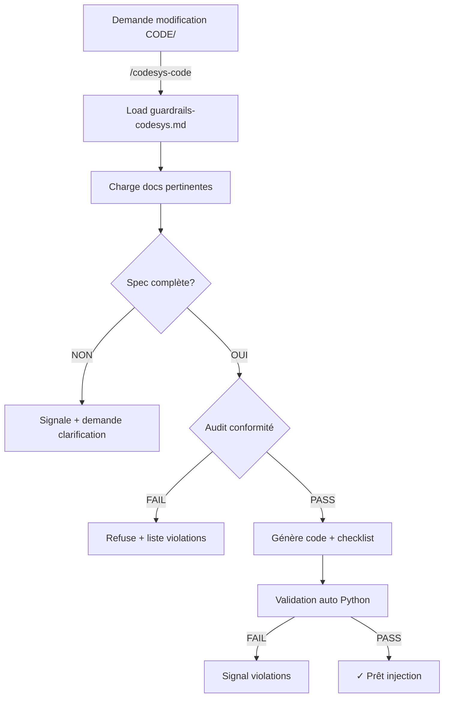

# 🔧 SKILL Locale : `/codesys-code`

**SKILL de validation + modification sécurisée du code CODESYS**

---

## 📋 Fichiers de la SKILL

| Fichier | Rôle |
|---------|------|
| **[guardrails-codesys.md](./.claude/guardrails-codesys.md)** | Règles strictes + checklist audit |
| **[codesys-code-skill.md](./.claude/codesys-code-skill.md)** | Documentation SKILL + workflow |
| **[tools/check-codesys-code.py](../tools/check-codesys-code.py)** | Validation automatique avant injection |
| **[CLAUDE.md](./CLAUDE.md)** | Intégration dans guide projet |

---

## 🚀 Utilisation rapide

```bash
# Avant toute modification CODE/

# 1. Extraire depuis CODESYS
python tools/extract.py --clean

# 2. Invoquer guardrails (demander modif via /codesys-code)
/codesys-code FB_Joystick

# 3. L'IA :
#    ✓ Charge guardrails-codesys.md
#    ✓ Lis FB_Joystick existante
#    ✓ Audit : nommage, interface, sécurité
#    ✓ Demande clarifications si doute
#    ✓ Génère code conforme + checklist

# 4. Valider avant injection
python tools/check-codesys-code.py CODE/FB_Joystick*.xml

# 5. Réinjecter dans Device.export
python tools/inject.py

# 6. Réimporter Device.export dans CODESYS (manuel)
```

---

## ⚡ Commandes spéciales

### Audit complet du CODE/ existant

```bash
python tools/check-codesys-code.py --audit CODE/
```

→ Signale **toutes** les violations existantes dans CODE/.

---

### Invoquer /codesys-code dans Claude Code

```
/codesys-code [fichier | nom_FB | description]

Exemples:
  /codesys-code FB_Joystick
  /codesys-code CODE/FB_Safety*.xml
  /codesys-code Je veux ajouter un nouveau mode de commande
```

→ Claude charge automatiquement guardrails + docs pertinentes.

---

## 🔐 Garanties de la SKILL

### ✅ Appliquées AVANT génération

- [ ] Nommage PascalCase strict (pas hongrois, pas snake_case)
- [ ] Interface FB complète (Enable, Reset, SafeStop, SafetyOk, Mode)
- [ ] Sorties : Ready, Busy, Done, Error, ErrorId, State, StateAtError
- [ ] ErrorId = bitfield (16 bits max)
- [ ] Reset sur front obligatoire (jamais auto)
- [ ] SafeStop prioritaire sur Enable
- [ ] Pas de redémarrage auto après défaut

### ❌ Refusées si présentes

- Code non-conforme aux règles
- Interface FB incomplète
- Logique de Reset ambiguë
- SafeStop dépendant de Enable
- Spec métier manquante ou ambiguë

---

## 🛡️ Processus de validation



---

## 📚 Docs référencées automatiquement

Quand `/codesys-code` est invoqué, Claude charge :

| Doc | Si |
|-----|-----|
| `NAMING_CONVENTION.md` | Toujours |
| `AF_Partie3_Template_FB_Commun.md` | Nouveau FB ou interface complexe |
| `AF_Partie2_Architecture_Programme_v2.1.md` | Questions architecturales |
| `AF_Partie1_Analyse_Fonctionnelle.md` | Contexte métier flou |

---

## ⚠️ Cas d'arrêt (NO CODE GENERATED)

```
❌ Nommage ambigu ou non-PascalCase
❌ Interface FB incomplète
❌ Reset pas sur front
❌ SafeStop pas prioritaire
❌ Redémarrage auto détecté
❌ Spec manquante ou incomplète
❌ Doute sur implémentation
```

→ Toujours signaler plutôt qu'approximer.

---

## 🧪 Test de la SKILL

### 1. Audit du CODE/ actuel

```bash
python tools/check-codesys-code.py --audit CODE/
```

→ Doit valider tous les fichiers actuels (ou lister violations).

### 2. Tester sur un FB existant

```
/codesys-code FB_Filter_PT1

# Claude doit :
# 1. Charger guardrails
# 2. Lire FB_Filter_PT1 existante
# 3. Signaler tout écart trouvé
# 4. Refuser modification si doute
```

### 3. Demander modification conforme

```
/codesys-code Ajouter un nouveau mode au FB_Joystick

# Claude doit :
# 1. Lire FB_Joystick existante
# 2. Vérifier interface actuelle
# 3. Demander clarifications si flou
# 4. Générer code conforme à interface
# 5. Tracer checklist d'audit
```

---

## 🔄 Intégration continue

### Avant chaque commit CODE/

```bash
# Valider toutes les modifs
python tools/check-codesys-code.py --audit CODE/

# Si violations → commit bloqué jusqu'à correction
```

---

## 📝 Évolution de la SKILL

Ajouter dans `guardrails-codesys.md` :
- [ ] Cas limites découverts
- [ ] Patterns approuvés (ex: multi-stage relay)
- [ ] Exemples conformes

Améliorer `tools/check-codesys-code.py` :
- [ ] Vérifications plus fines (patterns état machine)
- [ ] Support diagrammes (diagCAN, diagETHERCAT)
- [ ] Mode auto-fix (corrections proposées)

---

**État:** ✅ Opérationnelle  
**Dernière MAJ:** 2026-06-30  
**Garantie:** Code généré 100% conforme aux règles projet
