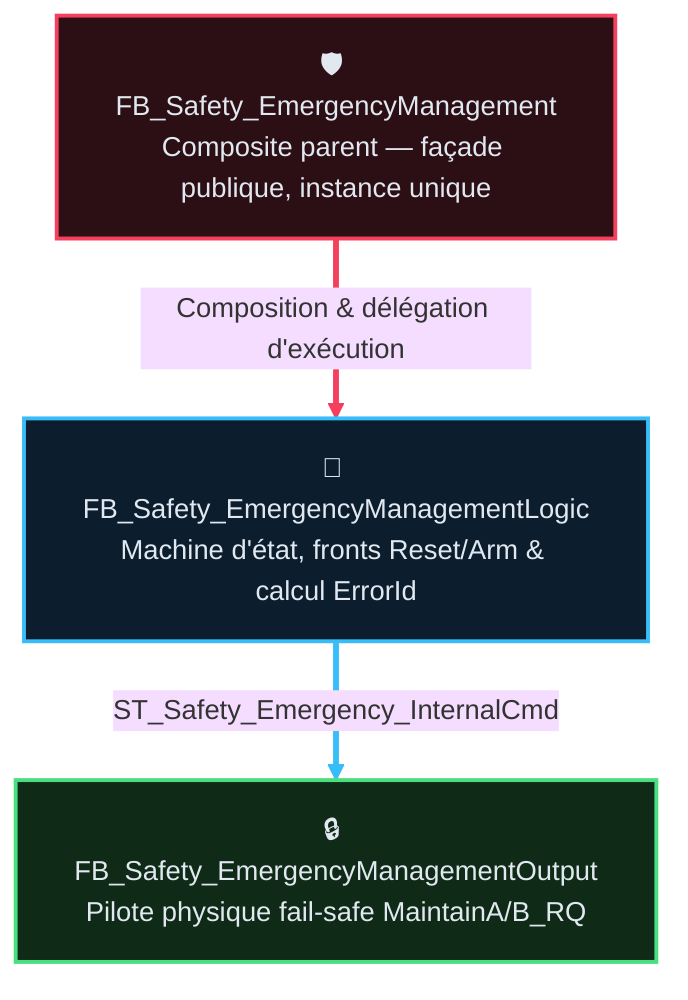
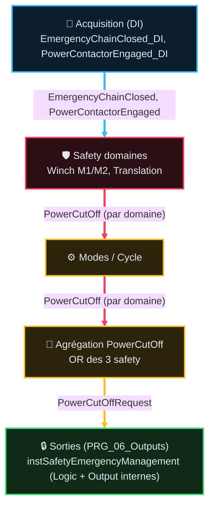

# FB_Safety_EmergencyManagement — Spec composant (v1.2)

> Rôle machine : [`AF_Partie-01_Analyse_Fonctionnelle_v2.1.md`](../AF_Partie-01_Analyse_Fonctionnelle_v2.1.md)
> §7 — couvre `F01.01`…`F01.08` (Table des fonctions).
> Rôle de **ce** document : réponse technique au besoin fonctionnel F01.xx — constitution,
> interfaces, séquence, intégration, écarts bus, et **détail complet** des `TC-P01-*` (le chapô
> AF01 en liste les IDs racine en table macro, sans dupliquer steps/timing/formules).
> ⚠️ Existant vérifié + écarts à normaliser. Pas de modif code sans validation §8.

## 🧭 Sommaire

1. [🎯 Périmètre et composition](#1--périmètre-et-composition)
2. [🧪 Points de validation (détail)](#2--points-de-validation-détail)
3. [🔌 Contrats d'interface](#3--contrats-dinterface)
4. [⚙️ Comportement et séquence](#4--comportement-et-séquence)
5. [📡 Polarités et E/S physiques](#5--polarités-et-es-physiques)
6. [🔗 Intégration programme (architecture cible)](#6--intégration-programme-architecture-cible)
7. [🖥️ IHM et diagnostics](#7--ihm-et-diagnostics)
8. [🧬 Simulation](#8--simulation)
9. [🗂️ Normalisation bus/DUT (cible — plan, pas code)](#9--normalisation-busdut-cible--plan-pas-code)
10. [📊 Stratégie de test](#10--stratégie-de-test)
11. [📜 Suivi historique](#11--suivi-historique)
12. [📚 Documents liés](#12--documents-liés)

## 1 · 🎯 Périmètre et composition

### Responsabilité

Répond au besoin fonctionnel `F01.01`-`F01.08` (AF01 §1, Table des fonctions) : gère la **coupure
de puissance amont** (canaux PLC redondants fail-safe) et la **séquence explicite de réarmement**
du contacteur général, avec auto-test A/B. Ne gère **pas** les protections mouvement métier
(`FB_Safety_Winch` / `FB_Safety_Translation`) : il **consomme** leur demande `PowerCutOff` agrégée.

### Composition POO & Schéma CFC



Trait plein = composition/données transférées. `Logic` et `Output` sont des sous-instances
**privées** — jamais appelées hors du composite parent (même scan).

---

### 🧱 Fiches Composants & Cartouches ST (`CODE/AU/`)

#### 🛡️ `FB_Safety_EmergencyManagement` *(Composite Façade)*
- **Fichier Source** : [`FB_Safety_EmergencyManagement.st`](../../../../CODE/B_AU_SECURITE/FB_Safety_EmergencyManagement.st)
- **🎯 Cartouche ST (`🎯 Rôle`)** : `Façade publique, instance unique ; câblage interne Logic/Output & exposition des bus d'état`
- **Responsabilité** : Point d'entrée unique de la boucle d'arrêt d'urgence, encapsule les sous-instances privées `Logic` et `Output`.

#### 🧠 `FB_Safety_EmergencyManagementLogic` *(Décision & Machine d'État)*
- **Fichier Source** : [`FB_Safety_EmergencyManagementLogic.st`](../../../../CODE/B_AU_SECURITE/FB_Safety_EmergencyManagementLogic.st)
- **🎯 Cartouche ST (`🎯 Rôle`)** : `Machine d'état, fronts Reset/Arm, calcul ErrorId & consignes logiques`
- **Responsabilité** : Gère les étapes d'auto-test, les fronts `Reset`/`ArmRequest`, et produit le bus interne `ST_Safety_Emergency_InternalCmd`.

#### 🔒 `FB_Safety_EmergencyManagementOutput` *(Pilote Physique Fail-Safe)*
- **Fichier Source** : [`FB_Safety_EmergencyManagementOutput.st`](../../../../CODE/B_AU_SECURITE/FB_Safety_EmergencyManagementOutput.st)
- **🎯 Cartouche ST (`🎯 Rôle`)** : `Enable gate + copie consignes logiques vers sorties physiques`
- **Responsabilité** : Barrière physique finale pour les signaux `MaintainA_RQ` et `MaintainB_RQ` (polarité maintien, `TRUE` = voie saine).

#### 🧩 `ST_Safety_Emergency_InternalCmd` *(DUT Bus Interne)*
- **Fichier Source** : [`ST_Safety_Emergency_InternalCmd.st`](../../../../CODE/B_AU_SECURITE/ST_Safety_Emergency_InternalCmd.st)
- **🎯 Cartouche ST (`🎯 Rôle`)** : `Transporte les ordres logiques entre le bloc de décision et le bloc de sortie`
- **Responsabilité** : Structure d'échange interne à 3 champs `BOOL` reliant `Logic` et `Output`.

Profil AF03 : **barrière puissance / safety transverse** — pas de `StartStop` ni `SafeStop`.
`Reset` sur front. Pas de redémarrage auto après défaut.

---

## 2 · 🧪 Points de validation (détail)

> Décline la table macro du chapô AF01 (§1, `F01.01`-`F01.08`) — 10 IDs racine, propriétaire
> unique de ce document (aucune décimale : chaque test est déjà une unité atomique).

### Types d'essai

| Type | Sens |
|---|---|
| `💻 AUTO` | Banc / script / suite hors production (Python, sim). |
| `⚡ AUTO_PLC` | Séquence intégrée à l'automate de production (se joue seule dans le FB). |
| `🟢 SITE` | Essai terrain / câblage / AU physique. |
| `⚡ SITE+AUTO` | Couverture mixte (Automate + Terrain). |

### Catalogue (10 tests — regroupés par fonction)

| ID | Intention | Comportement attendu | Preuve | Type | Réf |
|---|---|---|---|---|---|
| <nobr><code>TC-P01-001</code></nobr> | AU physique | Coupe puissance moteurs, API vivant | Contacteur ouvert | `🟢 SITE` | §6.1 |
| <nobr><code>TC-P01-002</code></nobr> | Maintien A/B | Perte canal A ou B ouvre la boucle AU | `MaintainA/B_RQ=FALSE` | `⚡ SITE+AUTO` | §5 |
| <nobr><code>TC-P01-003</code></nobr> | Réarmement | Front `ArmRequest` + boucle OK ➔ pulse 1s | Pulse 1s (step 5) | `⚡ AUTO_PLC` | §4.3 |
| <nobr><code>TC-P01-004</code></nobr> | Ack Cause/Ack | `Reset` efface l'affichage (interlock reste sur Cause) | `Error=FALSE` | `💻 AUTO` | §4.4bis |
| <nobr><code>TC-P01-005</code></nobr> | Séquencement | Acquittement et réarmement 2 actions distinctes | 2 actions requises | `⚡ SITE+AUTO` | §4.4 |
| <nobr><code>TC-P01-006</code></nobr> | Auto-test A/B | Test croisé A/B au réarmement (échec ➔ `RedundancyFail`) | Steps 1–4 (200ms) | `⚡ AUTO_PLC` | §4.3bis |
| <nobr><code>TC-P01-007</code></nobr> | Lockout 5s | Échec confirmation contacteur ➔ verrouillage 5s | `LockoutActive=TRUE` | `💻 AUTO` | §4.3 |
| <nobr><code>TC-P01-008</code></nobr> | Coupure métier | `PowerCutOffRequest=TRUE` coupe A et B sans armer | `MaintainA/B_RQ=FALSE` | `💻 AUTO` | §4 |
| <nobr><code>TC-P01-009</code></nobr> | Re-latch Cause | Cause persistante ➔ ré-alarme au prochain essai | `Ack=FALSE` | `💻 AUTO` | §4.4bis |
| <nobr><code>TC-P01-010</code></nobr> | Cohérence coupure IHM | `BtnEmergencyCutOff` pendant le pulse de réarmement (step 5) | ⚠️ `ArmPulse_RQ` reste TRUE — écart relevé, non corrigé (audit 2026-08-22) | `💻 AUTO` | §7 |

---

## 3 · 🔌 Contrats d'interface

### Entrées

| Port | Producteur actuel | Sémantique |
|---|---|---|
| `Enable` | `Outputs` = TRUE fixe | Active surveillance ; FALSE = neutralisation totale |
| `Reset` | `Supervision.FaultMachineReset_IHM` ← `BtnFaultReset` | Front acquittement défauts FB |
| `ArmRequest` | `GVL_IHM.Modes.Cmd.BtnEmergencyArming` | Front demande réarmement |
| `EmergencyChainClosed` | `Acquisition.EmergencyChainClosed` ← `EmergencyChainClosed_DI` | Boucle AU fermée |
| `PowerContactorEngaged` | `Acquisition.PowerContactorEngaged` ← `PowerContactorEngaged_DI` | Contacteur engagé |
| `PowerCutOffRequest` | OR local M1/M2/M3 `.PowerCutOff` dans `Outputs` | Coupure demandée par safety domaine |
| `BtnEmergencyCutOff` | `GVL_IHM.Modes.Cmd.BtnEmergencyCutOff` | **Coupure IHM maintenue** : bouton IHM (ou supervision) qui force l'ouverture des deux canaux A/B tant que maintenu — **pas** un bouton physique AU (celui-ci est dans la boucle hardware). Ne déclenche **pas** de séquence de réarmement. |

### Sorties logiques / diag

| Port | Sémantique |
|---|---|
| `Ready` | `= Enable AND NOT StartupFail` |
| `Busy` | Séquence active ou lockout en cours |
| `Done` | `= PowerContactorEngaged` |
| `Error` / `ErrorId` | bit0=Redundancy, bit1=ArmFailed, bit3=StartupFail |
| `ArmingSeqStep` | 0…6 diagnostic |
| `RedundancyTestFailed` | Latch auto-test |
| `EmergencyArmingFailed` | Latch non-confirmation contacteur |
| `EmergencyArmingLockoutActive` | Fenêtre 5 s anti-réessai |

### Bus d'état et diagnostic (structurés, depuis composite)

| DUT | Champs | Rôle |
|---|---|---|
| `ST_Safety_Emergency_State` | `ChainOk`, `ContactorOk`, `Step`, `Armable`, `ArmingBusy` | État public chaîne AU — consommé par Supervision, Troubleshooting |
| `ST_Safety_Emergency_Diag` | `Error`, `ErrorId`, `RedundancyTestFailed`, `ArmFailed`, `LockoutActive` | Diagnostic chaîne AU — consommé par Supervision, IHM State |

**Producteur unique** : `FB_Safety_EmergencyManagement` (sorties `State`/`Diag`).
Mappés dans `GVL_IHM.Modes.State.*` par Supervision (L2, ✅ fait).

### Sorties vers actionneurs (via Output)

| Port FB | Q physique actuelle | Polarité |
|---|---|---|
| `PowerCutOff_A_RQ` | `PowerKeepAlive_A_RQ` | TRUE = maintien voie A |
| `PowerCutOff_B_RQ` | `PowerKeepAlive_B_RQ` | TRUE = maintien voie B |
| `EmergencyArming_RQ` | `EmergencyArming_RQ` | TRUE = impulsion réarmement |

### DUT interne

```text
ST_Safety_Emergency_InternalCmd
  MaintainA_Cmd : BOOL   // TRUE = maintien canal A (ex-PowerCutOff_A_Cmd)
  MaintainB_Cmd : BOOL   // TRUE = maintien canal B (ex-PowerCutOff_B_Cmd)
  ArmPulse_Cmd : BOOL   // TRUE = pulse réarmement (ex-EmergencyArming_Cmd)
```

🏷️ Renommage 2026-07-30 : `PowerCutOff_*` → `Maintain*` (polarité maintien explicite,
conforme règle C1 : le nom répond à « que signifie TRUE ? »).

---

## 4 · ⚙️ Comportement et séquence

### 4.1 Formules de maintien (état armé ou idle)

Hors neutralisation :

```text
PowerCutOff_A_Cmd = NOT PowerCutOffRequest
                  AND NOT ForceTestA          // seulement pendant étape 1
                  AND NOT BtnEmergencyCutOff
                  AND NOT RedundancyTestFailed

PowerCutOff_B_Cmd = NOT PowerCutOffRequest
                  AND NOT ForceTestB          // seulement pendant étape 3
                  AND NOT BtnEmergencyCutOff
                  AND NOT RedundancyTestFailed
```

### 4.2 Déclenchement armement

Conditions **toutes** requises sur front `ArmRequest` :

1. `ArmingSeqStep = 0`
2. `EmergencyChainClosed = TRUE`
3. `EmergencyArmingLockoutActive = FALSE`
4. `PowerContactorEngaged = FALSE` (contacteur non engagé)

Pas d'auto-réarmement sur simple retour boucle saine.

### 4.3 Étapes

| Step | Nom | Durée | Action | Échec |
|---|---|---|---|---|
| 1 | TestA | 200 ms | Ouvre A seul | Si chain encore TRUE → `RedundancyTestFailed`, retour 0 |
| 2 | RestoreA | 200 ms | Rétablit A | Si chain FALSE en fin → retour 0 |
| 3 | TestB | 200 ms | Ouvre B seul | Idem redondance → 0 |
| 4 | RestoreB | 200 ms | Rétablit B | Si chain FALSE → 0 ; sinon → 5 |
| 5 | Pulse | 1 s | `EmergencyArming_Cmd=TRUE` | — |
| 6 | Confirm | ≤ 2 s | Attend `PowerContactorEngaged` | Timeout → `EmergencyArmingFailed` + lockout 5 s |

Succès étape 6 : retour IDLE, lockout off.

### Chronogramme — réarmement nominal (succès)

| Instant | `ArmRequest` | `ArmingSeqStep` | `PowerContactorEngaged` | `EmergencyArming_RQ` |
|---|---|---|---|---|
| t0 — repos | FALSE | 0 (IDLE) | FALSE | FALSE |
| t1 — front demande | TRUE ↑ | 1 (TestA) | FALSE | FALSE |
| t2 — +800ms (steps 1-4 OK) | FALSE | 5 (Pulse) | FALSE | TRUE ↑ |
| t3 — +1s (fin pulse) | FALSE | 6 (Confirm) | FALSE | FALSE ↓ |
| t4 — contacteur confirmé | FALSE | 0 (IDLE) | TRUE ↑ | FALSE |

Si `PowerContactorEngaged` ne passe pas TRUE avant timeout 2s à t4 : `EmergencyArmingFailed`
+ `EmergencyArmingLockoutActive` 5s, retour direct à `ArmingSeqStep=0`.

### 4.3bis Auto-test A/B = essai `AUTO_PLC` intégré

À chaque réarmement réussi jusqu'au pulse, le FB **teste les deux sorties de maintien
sans procédure manuelle séparée** :

| Phase | `PowerKeepAlive_A` | `PowerKeepAlive_B` | Attendu sur `EmergencyChainClosed` |
|---|---|---|---|
| TestA (200 ms) | **FALSE** (forcé) | TRUE (maintenu) | doit **ouvrir** (FALSE) |
| RestoreA | TRUE | TRUE | doit **refermer** (TRUE) |
| TestB (200 ms) | TRUE | **FALSE** (forcé) | doit **ouvrir** |
| RestoreB | TRUE | TRUE | doit **refermer** |

- Un seul canal est ouvert à la fois : l'autre reste en maintien — ce n'est pas une coupure
  AU opérateur, c'est la **preuve runtime** que chaque voie commande bien la boucle.
- Si la chain ne suit pas la voie testée ⇒ collé/shunté ⇒ `RedundancyTestFailed` (latch).
- Déclencheur : le même front `ArmRequest` que le réarmement (pas un bouton « test » dédié).
- Observable : `ArmingSeqStep` 1…4, puis 5 (pulse) si OK.
- Couvert par **TC-P01-006** (`AUTO_PLC`) ; rejouable aussi en sim (`AUTO`) si SimBench
  câblé correctement (§8).

### 4.4 Acquittements

> ⚠️ **REX 2026-08** : la règle initiale ("Reset **et** `PowerContactorEngaged=TRUE`") créait une
> impasse opérateur — le contacteur ne peut justement pas s'engager tant que le défaut est actif,
> donc le Reset restait bloqué en boucle. Corrigée par le pattern `Cause`/`Ack`
> (`DOC/STDS/CODE_QUALITY_STANDARDS.md §9`) : le Reset **acquitte toujours**, sans condition.

| Défaut | Catégorie | Condition d'effacement |
|---|---|---|
| `RedundancyTestFailed` | Fault | Front `Reset` (toujours effectif) ; re-latch si un nouvel échec d'auto-test survient |
| `EmergencyArmingFailed` | Fault | Front `Reset` (toujours effectif, **non conditionné** par `PowerContactorEngaged`) ; re-latch si une nouvelle tentative échoue à nouveau |

**Ce qui débloque reellement une tentative echouee** : ce n'est pas le Reset, c'est un nouveau
front `ArmRequest` (§4.4bis) — le Reset acquitte seulement l'affichage IHM/diag du defaut passé.

**Comportement code retenu** : après expiration du lockout 5 s, un nouvel `ArmRequest` peut
toujours relancer la séquence, que `EmergencyArmingFailed` ait été acquitté ou non —
l'acquittement n'est jamais une condition de redémarrage (§4.4bis, `CODE_QUALITY_STANDARDS.md §9`).

### 4.4bis Pattern Cause / Ack appliqué à ce composant

Application concrète du pattern général (`CODE_QUALITY_STANDARDS.md §9`) aux deux Fault de ce FB :

- `EmergencyArmingFailedCause` : latch brut de l'échec de confirmation contacteur (positionné à
  l'étape 6, jamais effacé par Reset — seulement par une nouvelle tentative reussie).
- `EmergencyArmingFailedAck` : accusé opérateur, mis à `TRUE` sur front `Reset` (toujours), remis
  à `FALSE` automatiquement au prochain échec (nouveau front de `EmergencyArmingFailedCause`).
- Affiché/expose en diagnostic (`ErrorId` bit1) : `Cause OR NOT Ack`.
- L'interlock de sécurité (blocage nouvel armement pendant le lockout 5s) reste basé sur
  `EmergencyArmingLockoutActive`, jamais sur `Ack` — l'acquittement n'ouvre aucun interlock.
- Même construction pour `RedundancyTestFailedCause`/`RedundancyTestFailedAck`.
- Affichage IHM : lissage anti-clignotement optionnel via `TON` court (`CST_FaultDisplayDebounce`,
  `T#0ms`…`T#500ms`) sur la sortie affichée uniquement — l'action de sécurité (blocage,
  `SafeStop`, coupure) reste instantanée sur la `Cause` brute, jamais retardée.

### 4.5 Temporisations nommées

| Timer | Valeur |
|---|---|
| Test / restore A ou B | `T#200ms` |
| Pulse armement | `T#1s` |
| Confirm contacteur | `T#2s` |
| Lockout | `T#5s` |

---

## 5 · 📡 Polarités et E/S physiques

| Rôle | Signal acquisition / Q | TRUE signifie |
|---|---|---|
| Boucle AU | `EmergencyChainClosed_DI` → `EmergencyChainClosed` | Boucle fermée / saine |
| Contacteur | `PowerContactorEngaged_DI` → `PowerContactorEngaged` | Contacteur engagé |
| Maintien A/B | `PowerKeepAlive_A/B_RQ` | Relais maintien excité (fail-safe) |
| Pulse réarmement | `EmergencyArming_RQ` | Commande mécanique de réarmement active |

Double dénomination FB `PowerCutOff_*_RQ` vs Q `PowerKeepAlive_*_RQ` : **même polarité maintien**.
Voir écart normalisation §9.

Filtre acquisition : anti-rebond 20 ms à confirmer sur le matériel ; sinon filtrage équivalent à
porter dans `PRG_02_Acquisition`. `FB_Input`/`PRG_01_Inputs_LD` sont en retrait et ne doivent plus
être cités comme producteur cible.

---

## 6 · 🔗 Intégration programme (architecture cible)

> ⚠️ **Architecture en cours de migration** : le code actuel utilise encore des PRG séquentiels
> (`Acquisition`…`Outputs`). L'architecture programme (AF02 v3) organise l'exécution en 7 programmes :
> `PRG_02_Acquisition`, `PRG_03_Modes_Cycle`, `PRG_04_Treuils_Benne`, `PRG_05_Translation`, `PRG_06_Outputs`, `PRG_07_Supervision`.
> Le flux logique reste identique ; seuls les conteneurs changent.

### 6.1 Chaîne d'appels (logique, indépendante du conteneur)



Sortie du composite (`PRG_06_Outputs`) : `PowerKeepAlive_A/B_RQ`, `EmergencyArming_RQ`.

| FB / rôle | Appelé dans (cible) | Rôle |
|---|---|---|
| Acquisition DI | `PRG_02_Acquisition` | Produit les faits `HwIn` et diagnostics ; filtrage à prouver |
| `FB_Input` | Retrait contrôlé | Aucun nouveau consommateur |
| `FB_Safety_Winch` M1/M2 | `PRG_04_Treuils_Benne` | Avant mouvements |
| `FB_Safety_Translation` | `PRG_05_Translation` | Avant mouvements |
| `FB_Safety_EmergencyManagement` | `PRG_06_Outputs` seulement | Fin — après agrégat OR PowerCutOff |
| Logic / Output | **Jamais hors composite** | Même scan que le parent |
| `FB_Sim_Safety` | via SimBench dans Acquisition | Début (boucle sim) |

### 6.2 Câblage de l'instance (Outputs)

| Élément | Emplacement |
|---|---|
| Instance | `PRG_06_Outputs.instSafetyEmergencyManagement` |
| Agrégation PowerCutOff | Bus `ST_Safety_PowerCutOffRequest` depuis Safety |
| Publication Q | Juste après l'appel FB dans `PRG_06_Outputs` |
| Portail mouvement | `PowerContactorEngaged` (**lu** par le FB, pas produit par lui) |

Conformité AF02 : AU en **chaîne sortie**, pas de page AU orpheline.
Cible : rester dans `PRG_06_Outputs`.

### 6.4 Démarrage — autotest au premier boot (Start-up Self-Check)

Au premier cycle après `Enable=TRUE` (démarrage PLC ou téléchargement), le FB exécute
un **autotest de cohérence** avant d'autoriser toute séquence de réarmement :

| Étape | Vérification | Comportement si échec |
|---|---|---|
| 1 | `EmergencyChainClosed = TRUE` (boucle AU fermée) | Bloque toute séquence ; `ErrorId` bit0 si boucle ouverte sans demande |
| 2 | `PowerContactorEngaged = FALSE` (contacteur au repos) | Bloque ; contacteur déjà engagé = anomalie câblage/retour |
| 3 | Pas de séquence en cours (`ArmingSeqStep = 0`) | Bloque si séquence résiduelle |

Ces vérifications sont **synchrones, déterministes, non bloquantes** (1 cycle). Si tout est OK,
le FB passe en `Ready=TRUE` et attend un front `ArmRequest`.

> ⚠️ **Retiré (2026-08-22)** : une étape "`PowerKeepAlive_A = TRUE` ET `PowerKeepAlive_B = TRUE`"
> figurait ici. Retirée car incohérente à double titre : (1) au premier cycle après boot, les
> sorties de maintien sont **forcément** au repos (fail-safe) — le contrôle échouerait
> systématiquement par construction, sans rapport avec un défaut réel ; (2) `PowerKeepAlive_A/B`
> ne sont pas des retours matériels mais les **propres sorties calculées** par ce FB
> (`Cmd.MaintainA/B_Cmd`) — les vérifier reviendrait à comparer le FB avec lui-même, pas à
> constater un état physique. La vérification réelle de la redondance des canaux existe déjà et
> est correcte : c'est l'autotest dynamique §4.3bis (steps 1-4, `TC-P01-002/003/006`), qui coupe
> **réellement** chaque canal et observe la réaction de `EmergencyChainClosed`.

---

## 7 · 🖥️ IHM et diagnostics

| Couche | Nom | TRUE signifie |
|---|---|---|
| Demande safety métier | `PowerCutOff` / `ST_Safety_PowerCutOffRequest` (futur bus) | « Je demande la **coupure** » |
| Entrée composite | `PowerCutOffRequest` | Idem |
| Sortie logique interne | `MaintainA/B_Cmd` (ex-`PowerCutOff_A/B_Cmd`) | **Maintien** fail-safe (TRUE = maintien sain) |
| Q physique device | `PowerKeepAlive_A/B_RQ` | **Maintien** (TRUE = relais excité) — nom matériel clair |

Cohérence rétablie : `Maintain*` porte la polarité réelle (maintien), `PowerKeepAlive_*_RQ`
reste le nom matériel historique (identique).

### Commandes (`ST_ModesCmd`)

| Champ | Usage |
|---|---|
| `BtnEmergencyArming` | → `ArmRequest` (front) |
| `BtnEmergencyCutOff` | → `BtnEmergencyCutOff` (niveau) — **commande IHM** (arrêt à distance), **pas** un bouton hardware ; les boutons hardware sont sur la chaîne AU physique (entrées `EmergencyChainClosed_DI`) |
| `BtnFaultReset` | → chaîne `FaultMachineReset_IHM` → `Reset` (avec autres défauts métier) |

### États déclarés (`ST_ModesState`) — contrat attendu

| Champ | Source attendue |
|---|---|
| `PowerContactorEngaged` | `Acquisition` (mappé) |
| `EmergencyChainOk` | `Acquisition.EmergencyChainClosed` |
| `PowerContactorOk` | miroir contacteur |
| `PowerCutOffActive` | OR safety domaines (polarité alarme) |
| `EmergencyArmable` | chain OK ∧ step0 ∧ ¬lockout ∧ ¬RedundancyFail ∧ ¬PowerContactorEngaged |
| `EmergencyArmingBusy` | Busy ∨ lockout |
| `RedundancyTestFailed` | sortie FB |
| `EmergencyArmingFailed` | sortie FB |

**✅ État 2026-07-30** : les 7 champs manquants de `ST_ModesState` sont désormais alimentés
depuis `ST_Safety_Emergency_State`/`ST_Safety_Emergency_Diag` (via `PRG_07_Supervision`). Écart résolu.

---

## 8 · 🧬 Simulation

`FB_Sim_Safety` (via `FB_SimBench`) :

- `SimChainOk := PowerCutOff_A AND PowerCutOff_B AND NOT BtnEmergencyStop`
- Latch contacteur sur `EmergencyArming` ; retombée immédiate si chain ouverte

**Correctif L1 appliqué** dans `Acquisition` → `instSimBench` :

| Entrée SimBench | Source |
|---|---|
| `PowerKeepAlive_A` | `PowerKeepAlive_A_RQ` (Q FB, scan N-1) |
| `PowerKeepAlive_B` | `PowerKeepAlive_B_RQ` |
| `EmergencyArming_RQ` | `EmergencyArming_RQ` (pulse FB, scan N-1) |

La sim rejoue la **vraie** chaîne sortie, comme le terrain.

---

## 9 · 🗂️ Normalisation bus/DUT (cible — plan, pas code)

Alignement AF02/AF03 + synthèse 5 bus. **À valider avant implémentation.**

### 9.1 Principes

1. Une instance, un producteur des Q puissance/réarmement : Outputs.
2. Pas de GVL comme bus de commande interne pour les états armement.
3. Agrégation `PowerCutOff` nommée et visible (DUT), produite côté Safety.
4. IHM reste frontière `Cmd/State` ; mapping Supervision lit le bus State/Diag Emergency.
5. DUT interne Logic→Output conserve `ST_Safety_Emergency_InternalCmd` (privé composite).

### 9.2 DUT proposés (noms à figer)

| DUT | Producteur | Contenu minimal | Lecteurs |
|---|---|---|---|
| `ST_Safety_PowerCutOffRequest` | Safety (`PRG_04`/`PRG_05`) | `Request : BOOL`, optionnel masque sources | `PRG_06_Outputs` → `PowerCutOffRequest` |
| `ST_HwMachine` (sous-image de `ST_HardwareImage`) | Acquisition | DI chain + contactor déjà dans `ST_HwMachine` | FB via Acquisition qualifiée |
| `ST_Safety_Emergency_State` | Outputs / composite | Step, Busy, Armable, ChainOk, ContactorOk | Supervision, troubleshooting |
| `ST_Safety_Emergency_Diag` | Outputs / composite | Error, ErrorId, RedundancyFail, ArmingFail, Lockout | Supervision, IHM State |

### 9.3 Lots d'implémentation — état courant

| Lot | Contenu | Risque | État |
|---|---|---|---|
| **L0 Doc** | Cette spec + extraction + liens AF01/02/03 | Nul | ✅ Fait |
| **L1 Sim** | Corriger câblage `FB_SimBench` KeepAlive/Arming | Faible | ✅ Fait |
| **L2 IHM map** | Alimenter tous les champs `ST_ModesState` armement depuis FB | Faible | ✅ Fait |
| **L3 DUT State/Diag** | Introduire `ST_Safety_Emergency_State`, `ST_Safety_Emergency_Diag` ; retirer dépendance `GVL_Global` armement | Moyen | ✅ Fait (code + bus) |
| **L4 Agrégat PowerCutOff** | DUT `ST_Safety_PowerCutOffRequest` depuis Safety ; OR hors Outputs anonyme | Moyen | ⬜ Planifié |
| **L5 Noms polarité** | Renommage partiel `PowerCutOff_A/B_Cmd` → `MaintainA/B_Cmd`, `EmergencyArming_Cmd` → `ArmPulse_Cmd` | Moyen | ✅ Fait (ST_Safety_Emergency_InternalCmd + code) ; reste `PowerKeepAlive_*_RQ` côté Q (nom matériel conservé) |

### 9.4 Hors scope de ce FB

- Méca A–E treuil / safety translation (Parties 09/11)
- Mapping device EtherCAT/CAN (Partie 06)
- Graphisme IHM (Partie 07)

---

## 10 · 📊 Stratégie de test

| Couche | Cible | TC | Type |
|---|---|---|---|
| **Intégré production** | Séquence armement steps 1–4 dans le FB | P01-006 (et amorce P01-003) | **AUTO_PLC** |
| Unitaire / suite ST | Logic + timers hors ou en sim | P01-003…010 | AUTO |
| Composite | Enable gate, sorties | P01-010, 002 | AUTO |
| Linkage | Unique writer Q | P01-011 | AUTO |
| Site | AU physique, indépendance câblage A/B | P01-001, 002, 005 | SITE |

Les résultats d'exécution restent hors AF (scripts / checklists / registres).

---

## 11 · 📜 Suivi historique

| Version | Date | Changement |
|---|---|---|
| v1.2 | 2026-08-25 | Mise en conformité `GUIDE_EDITION_AF_v1.0` : composition POO §1 et chaîne d'appels §6.1 en Mermaid `flowchart TD` stylisés avec `linkStyle` (remplacent le schéma HTML/SVG et le diagramme ASCII), chronogramme texte ajouté pour le réarmement nominal (§4.3), lien AF01 repointé v2.1, section « 7 · IHM et diagnostics » dédoublonnée, table de points de validation déplacée en §2 (juste après §1) avec numérotation complète des sections, liste de fichiers code dédupliquée |
| v1.1 | — | Version précédente (voir `ARCHIVES/Doc/`) |

## 12 · 📚 Documents liés

| Doc | Lien |
|---|---|
| AF01 §7 | Règles **machine** AU/réarmement (sans dupliquer interfaces ni TC) |
| AF02 | Instance dans `PRG_06_Outputs` ; pas de page AU orpheline |
| AF03 | Profil barrière / Reset front / intégrité liaisons (pas d'ID bus) |
| AF06 | Noms DI/DQ puissance |
| AF07 | Champs `ST_Modes*` |
| AF13 | `FB_Sim_Safety` |

Fichiers code de référence :

- `CODE/B_AU_SECURITE/FB_Safety_EmergencyManagement.st`
- `CODE/B_AU_SECURITE/FB_Safety_EmergencyManagementLogic.st`
- `CODE/B_AU_SECURITE/FB_Safety_EmergencyManagementOutput.st`
- `CODE/B_AU_SECURITE/ST_Safety_Emergency_InternalCmd.st` (interne Logic→Output)
- `CODE/B_AU_SECURITE/ST_Safety_Emergency_State.st` (bus état public)
- `CODE/B_AU_SECURITE/ST_Safety_Emergency_Diag.st` (bus diagnostic)
- `ARCHIVES/Code/SUPERVISION/ST_Safety_Emergency_HmiCmd.st` (bus commande IHM, test archivé T99)
- `ARCHIVES/Code/SUPERVISION/ST_Safety_Emergency_HmiState.st` (bus état IHM, test archivé T99)
- `ARCHIVES/Code/SUPERVISION/GVL_IHM_AU.st` (interface IHM archivée T99)
- `CODE/M_MAIN/PRG_02_Acquisition.st` (ST pur)
- `CODE/M_MAIN/PRG_06_Outputs.st` (sorties)
- `ARCHIVES/Code/TESTS/PRG_AU_TestBench.st` (banc de test manuel, archivé 2026-08-01 — voir `DOC/WFLOW/TASKS.yaml`)
- `CODE/L_SIMULATION/FB_Sim_Safety.st`
