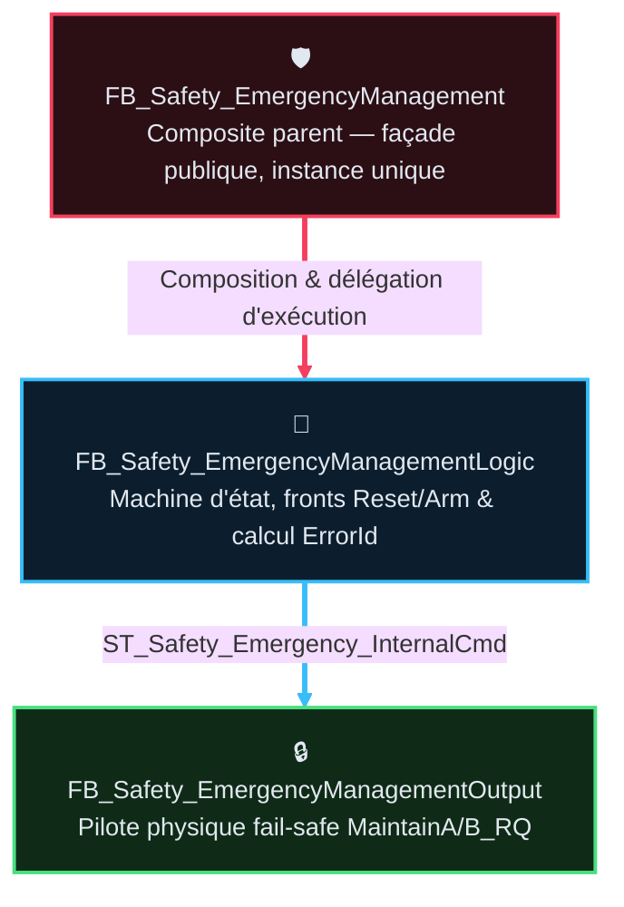
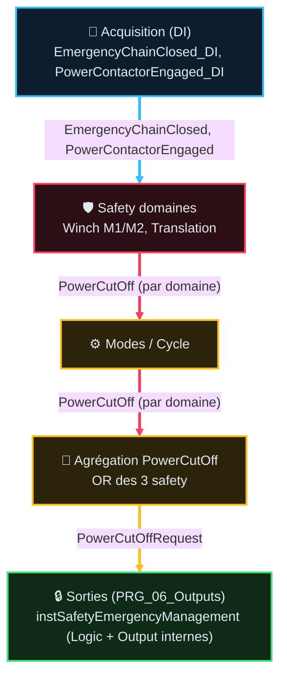

# FB_Safety_EmergencyManagement — Spec composant (v1.4)

> Rôle machine : [`AF_Partie-01_Analyse_Fonctionnelle_v2.1.md`](../AF_Partie-01_Analyse_Fonctionnelle_v2.1.md)
> §7 — couvre `F01.01`…`F01.08` (Table des fonctions).
> Rôle de **ce** document : réponse technique au besoin fonctionnel F01.xx — constitution,
> interfaces, séquence, intégration, écarts bus, et **détail complet** des `TC-P01-*` (le chapô
> AF01 en liste les IDs racine en table macro, sans dupliquer steps/timing/formules).
> ⚠️ Existant vérifié + écarts à normaliser. Pas de modif code sans validation §8.

## 🧭 Sommaire

1. [🎯 Périmètre et composition](#1-périmètre-et-composition)
2. [🧪 Table des points de validation (détail)](#2-table-des-points-de-validation-détail)
3. [🔌 Contrats d'interface](#3-contrats-dinterface)
4. [⚙️ Comportement et séquence](#4-comportement-et-séquence)
5. [📡 Polarités et E/S physiques](#5-polarités-et-es-physiques)
6. [🔗 Intégration programme (architecture cible)](#6-intégration-programme-architecture-cible)
7. [🖥️ IHM et diagnostics](#7-ihm-et-diagnostics)
8. [🧬 Simulation](#8-simulation)
9. [🗂️ Normalisation bus/DUT (cible — plan, pas code)](#9-normalisation-busdut-cible-plan-pas-code)
10. [📊 Stratégie de test](#10-stratégie-de-test)
11. [📜 Suivi historique](#11-suivi-historique)
12. [📚 Documents liés](#12-documents-liés)

## 1 · 🎯 Périmètre et composition

### Responsabilité

Répond au besoin fonctionnel `F01.01`-`F01.08` (AF01 §1, Table des fonctions) : gère la **coupure
de puissance amont** (canaux PLC redondants fail-safe) et la **séquence explicite de réarmement**
du contacteur général, avec auto-test A/B. Ne gère **pas** les protections mouvement métier
(`FB_Safety_Winch` / `FB_Safety_Translation`) : il **consomme** leur demande `PowerCutOff` agrégée.

### Composition POO & Schéma CFC



Trait plein = composition/données transférées. `Logic` et `Output` sont des sous-instances
**privées** — jamais appelées hors du composite parent (même scan).

---

### 🧱 Fiches Composants & Cartouches ST (`CODE/AU/`)

#### 🛡️ `FB_Safety_EmergencyManagement` *(Composite Façade)*

- **Fichier Source** : [`FB_Safety_EmergencyManagement.st`](../../../../CODE/B_AU_SECURITE/FB_Safety_EmergencyManagement.st)
- **🎯 Cartouche ST (`🎯 Rôle`)** : `Façade publique, instance unique ; câblage interne Logic/Output & exposition des bus d'état`
- **Responsabilité** : Point d'entrée unique de la boucle d'arrêt d'urgence, encapsule les sous-instances privées `Logic` et `Output`.

#### 🧠 `FB_Safety_EmergencyManagementLogic` *(Décision & Machine d'État)*

- **Fichier Source** : [`FB_Safety_EmergencyManagementLogic.st`](../../../../ARCHIVES/Code/AU/FB_Safety_EmergencyManagementLogic_v2.1_OLD.st) *(archivé — fusionné dans `FB_Safety_EmergencyManagement`)*
- **🎯 Cartouche ST (`🎯 Rôle`)** : `Machine d'état, fronts Reset/Arm, calcul ErrorId & consignes logiques`
- **Responsabilité** : Gère les étapes d'auto-test, les fronts `Reset`/`ArmRequest`, et produit le bus interne `ST_Safety_Emergency_InternalCmd`.

#### 🔒 `FB_Safety_EmergencyManagementOutput` *(Pilote Physique Fail-Safe)*

- **Fichier Source** : [`FB_Safety_EmergencyManagementOutput.st`](../../../../ARCHIVES/Code/AU/FB_Safety_EmergencyManagementOutput_v2.1_OLD.st) *(archivé — fusionné dans `FB_Safety_EmergencyManagement`)*
- **🎯 Cartouche ST (`🎯 Rôle`)** : `Enable gate + copie consignes logiques vers sorties physiques`
- **Responsabilité** : Barrière physique finale pour les signaux `MaintainA_RQ` et `MaintainB_RQ` (polarité maintien, `TRUE` = voie saine).

Profil AF03 : **barrière puissance / safety transverse** — pas de `StartStop` ni `SafeStop`.
`Reset` sur front. Pas de redémarrage auto après défaut.

---

## 2 · 🧪 Table des points de validation (détail)

> Décline la table macro du chapô AF01 (§1, `F01.01`-`F01.08`) — 10 IDs racine, propriétaire
> unique de ce document (aucune décimale : chaque test est déjà une unité atomique).

> **État** — `V` validé, implémentation non vérifiée · `V-I` validé et implémenté · `NV` non validé, non implémenté · `NV-I` code présent mais non validé · `R` refusé · `NA` non applicable.

### Types d'essai

| Type | Sens |
|---|---|
| `💻 AUTO` | Banc / script / suite hors production (Python, sim). |
| `⚡ AUTO_PLC` | Séquence intégrée à l'automate de production (se joue seule dans le FB). |
| `🟢 SITE` | Essai terrain / câblage / AU physique. |
| `⚡ SITE+AUTO` | Couverture mixte (Automate + Terrain). |

### Catalogue (10 tests — regroupés par fonction)

### Catalogue & Scénarios Temporels

> **Organisation des Essais** :
> 1. **Scénario 1 (Nominal)** : Cycle complet d'utilisation sans perturbation (Initialisation -> Auto-test A/B -> Pulse 1s -> Confirmation contacteur -> Maintien puissance sain).
> 2. **Scénarios 2 à 6 (Perturbations & Injections)** : Injection d'événements et de pannes venant perturber ou tester les barrières de sécurité.

<table style="width: 100%; table-layout: fixed; border-collapse: collapse; font-size: 13.5px;">
  <colgroup>
    <col style="width: 32px;">
    <col style="width: 55px;">
    <col style="width: calc(100% - 175px);">
    <col style="width: 45px;">
    <col style="width: 26px;">
    <col style="width: 36px;">
  </colgroup>
  <thead>
    <tr style="border-bottom: 2px solid #475569; text-align: left;">
      <th style="padding: 4px 1px; text-align: center;"><small><b>ID</b></small></th>
      <th style="padding: 4px 1px; text-align: center;"><small>Intention</small></th>
      <th style="padding: 4px 8px;">Séquence & Déroulé des étapes (Comportement attendu & Signaux)</th>
      <th style="padding: 4px 1px; text-align: center;"><small>Type</small></th>
      <th style="padding: 4px 1px; text-align: center;"><small>Réf</small></th>
      <th style="padding: 4px 1px; text-align: center;"><small>État</small></th>
    </tr>
  </thead>
  <tbody>
    <tr style="border-bottom: 1px solid rgba(255,255,255,0.08);">
      <td style="padding: 4px 1px; text-align: center; vertical-align: middle;"><span style="writing-mode: vertical-rl; transform: rotate(180deg); display: inline-block; font-family: monospace; font-size: 11px; font-weight: bold; letter-spacing: 0.5px;">TC-P01-SCEN-NOM</span></td>
      <td style="padding: 4px 1px; text-align: center; vertical-align: middle;"><small><b>Nominal</b><br>Réarm.</small></td>
      <td style="padding: 6px 8px; line-height: 1.55;">
        💤 <b>Étape 0 (Repos initial)</b> : Machine hors tension (<code>EmergencyChainClosed=FALSE</code> ou TRUE, contacteur au repos, <code>Armable=TRUE</code>, message <code>"AU: repos - pret a rearmer"</code>).<br>
        ⏱️ <b>Étape 0bis (Pré-armement 500 ms)</b> : Front <code>ArmRequest</code> ➔ <code>PreArmDelayActive=TRUE</code>, reste en Step 0 IDLE pendant 500 ms (contacteurs espacés, message <code>"AU: appui pris en compte - etablissement chaine"</code>).<br>
        🚀 <b>Étape 1 (Test Voie A 1 s)</b> : Step 1 <code>TEST_A</code>, <code>ForceTestA=TRUE</code> ➔ <code>MaintainA_Cmd=FALSE</code>, <code>MaintainB_Cmd=TRUE</code>. Chaîne matérielle doit s'ouvrir (<code>EmergencyChainClosed=FALSE</code>). Message <code>"AU: autotest canal A en cours"</code>.<br>
        🔍 <b>Étape 2 (Restauration A 500 ms)</b> : Step 2 <code>RESTORE_A</code>, <code>ForceTestA=FALSE</code> ➔ <code>MaintainA_Cmd=TRUE</code>. Chaîne se referme (<code>EmergencyChainClosed=TRUE</code>). Settle contacteur 500 ms.<br>
        🔍 <b>Étape 3 (Test Voie B 1 s)</b> : Step 3 <code>TEST_B</code>, <code>ForceTestB=TRUE</code> ➔ <code>MaintainB_Cmd=FALSE</code>, <code>MaintainA_Cmd=TRUE</code>. Chaîne matérielle doit s'ouvrir (<code>EmergencyChainClosed=FALSE</code>). Message <code>"AU: autotest canal B en cours"</code>.<br>
        🔍 <b>Étape 4 (Restauration B & Hold 1 s)</b> : Step 4 <code>RESTORE_B</code>, <code>ForceTestB=FALSE</code> ➔ <code>MaintainA/B_Cmd=TRUE</code>. Chaîne refermée et tenue 1 s avant pulse (relais <code>PowerKeepAlive</code> audibles, message <code>"AU: restauration canal B"</code>).<br>
        ⚡ <b>Étape 5 (Pulse collage 1 s)</b> : Step 5 <code>PULSE</code>, <code>Cmd.ArmPulse_Cmd=TRUE</code> pendant 1000 ms. Message <code>"AU: impulsion rearmement contacteur"</code>.<br>
        ⏱️ <b>Étape 6 (Confirmation contacteur ≤ 2 s)</b> : Step 6 <code>CONFIRM</code>, <code>Cmd.ArmPulse_Cmd=FALSE</code>, attente <code>PowerContactorEngaged=TRUE</code>. Message <code>"AU: attente confirmation contacteur"</code>.<br>
        ✅ <b>Étape 7 (Succès & Verrouillage 5 s)</b> : <code>PowerContactorEngaged=TRUE</code> ➔ <code>WasArmed=TRUE</code>, <code>Done=TRUE</code>, retour Step 0 IDLE. Garde anti-chatter active : <code>Armable=FALSE</code> pendant les 5 s suivant le départ (message <code>"AU: temporisation 5s en cours - patienter"</code>), puis retour <code>Armable=TRUE</code>.
      </td>
      <td style="padding: 4px 1px; text-align: center;"><small><code>⚡ AUTO</code></small></td>
      <td style="padding: 4px 1px; text-align: center;"><small>§4.3</small></td>
      <td style="padding: 4px 1px; text-align: center;"><small><code>V-I</code></small></td>
    </tr>
    <tr style="border-bottom: 1px solid rgba(255,255,255,0.08);">
      <td style="padding: 4px 1px; text-align: center; vertical-align: middle;"><span style="writing-mode: vertical-rl; transform: rotate(180deg); display: inline-block; font-family: monospace; font-size: 11px; font-weight: bold; letter-spacing: 0.5px;">TC-P01-SCEN-DYN</span></td>
      <td style="padding: 4px 1px; text-align: center; vertical-align: middle;"><small><b>Dynamique</b><br>Perturb.</small></td>
      <td style="padding: 6px 8px; line-height: 1.55;">
        🚀 <b>Phase 1 (Mise en service)</b> : Réarmement nominal complet abouti (<code>Done=TRUE</code>, <code>WasArmed=TRUE</code>).<br>
        ⚡ <b>Phase 2 (Coupure procédé en marche)</b> : Dérive treuil M1/M2/M3 ➔ <code>PowerCutOffRequest=TRUE</code>. Retombée immédiate <code>MaintainA/B_Cmd=FALSE</code>, contacteur retombe, <code>WasArmed=FALSE</code>, <code>Armable=FALSE</code>, message <code>"AU: coupure securite metier active - lever la cause puis rearmer"</code>.<br>
        🛡️ <b>Phase 3 (Tentative sous défaut)</b> : Front <code>ArmRequest</code> sous <code>PowerCutOffRequest=TRUE</code> ➔ Refus net, reste Step 0 IDLE sans alarme parasite contacteur.<br>
        🔄 <b>Phase 4 (Acquittement défaut procédé)</b> : Disparition dérive + <code>Reset</code> ➔ <code>Armable</code> redevient TRUE (si garde 5 s écoulée).<br>
        ⚠️ <b>Phase 5 (Échec collage contacteur)</b> : Nouvel armement, auto-tests A/B OK, pulse 1 s envoyé, mais contacteur ne colle pas (Step 6 timeout 2 s) ➔ Avortement <code>LastAbortCause=128 (CST_ABORT_TIMEOUT_CONTACTOR)</code>, alarme <code>EmergencyArmingFailed=TRUE</code>, Lockout 5 s (<code>EmergencyArmingLockoutActive=TRUE</code>), message <code>"AU echec: contacteur non confirme"</code>.<br>
        🔓 <b>Phase 6 (Reprise après échec)</b> : Écoulement Lockout 5 s + impulsion <code>Reset</code> ➔ Alarme acquittée, <code>Armable=TRUE</code>, prêt pour nouvel essai.
      </td>
      <td style="padding: 4px 1px; text-align: center;"><small><code>💻 AUTO</code></small></td>
      <td style="padding: 4px 1px; text-align: center;"><small>§4.3</small></td>
      <td style="padding: 4px 1px; text-align: center;"><small><code>V-I</code></small></td>
    </tr>
    <tr style="border-bottom: 1px solid rgba(255,255,255,0.08);">
      <td style="padding: 4px 1px; text-align: center; vertical-align: middle;"><span style="writing-mode: vertical-rl; transform: rotate(180deg); display: inline-block; font-family: monospace; font-size: 11px; font-weight: bold;">TC-P01-001</span></td>
      <td style="padding: 4px 1px; text-align: center; vertical-align: middle;"><small>Coupure AU<br>physique</small></td>
      <td style="padding: 6px 8px; line-height: 1.55;">
        ⚡ <b>Étape 1</b> : Enfoncement coup de poing AU physique sur site en production ➔ Ouverture matérielle boucle 24V (<code>EmergencyChainClosed=FALSE</code>).<br>
        🔒 <b>Étape 2</b> : Grâce au latch <code>WasArmed=TRUE</code> (aucune raison métier), les sorties PLC <code>MaintainA/B_Cmd</code> restent TRUE.<br>
        ⛔ <b>Étape 3</b> : Retombée instantanée du contacteur de puissance ligne par coupure matérielle en série.<br>
        🔄 <b>Étape 4</b> : Relâchement coup de poing ➔ Boucle 24V se referme immédiatement (<code>EmergencyChainClosed=TRUE</code>), relais PLC étant restés fermés. Prêt pour réarmement sans rejouer les auto-tests PLC.
      </td>
      <td style="padding: 4px 1px; text-align: center;"><small><code>🟢 SITE</code></small></td>
      <td style="padding: 4px 1px; text-align: center;"><small>§6.1</small></td>
      <td style="padding: 4px 1px; text-align: center;"><small><code>V-I</code></small></td>
    </tr>
    <tr style="border-bottom: 1px solid rgba(255,255,255,0.08);">
      <td style="padding: 4px 1px; text-align: center; vertical-align: middle;"><span style="writing-mode: vertical-rl; transform: rotate(180deg); display: inline-block; font-family: monospace; font-size: 11px; font-weight: bold;">TC-P01-002</span></td>
      <td style="padding: 4px 1px; text-align: center; vertical-align: middle;"><small>Perte maintien<br>A/B</small></td>
      <td style="padding: 6px 8px; line-height: 1.55;">
        🔍 <b>Étape 1</b> : Surveillance indépendante des canaux A et B en régime nominal établi.<br>
        ⚡ <b>Étape 2</b> : Test de coupure unilatérale canal A (<code>ForceTestA=TRUE</code> ➔ <code>MaintainA_Cmd=FALSE</code>, B maintenu TRUE).<br>
        🔍 <b>Étape 3</b> : Vérification réaction boucle ➔ Restauration canal A (500 ms settle).<br>
        ⚡ <b>Étape 4</b> : Test de coupure unilatérale canal B (<code>ForceTestB=TRUE</code> ➔ <code>MaintainB_Cmd=FALSE</code>, A maintenu TRUE) ➔ Restauration canal B (1 s hold).
      </td>
      <td style="padding: 4px 1px; text-align: center;"><small><code>⚡ MIXTE</code></small></td>
      <td style="padding: 4px 1px; text-align: center;"><small>§5</small></td>
      <td style="padding: 4px 1px; text-align: center;"><small><code>V-I</code></small></td>
    </tr>
    <tr style="border-bottom: 1px solid rgba(255,255,255,0.08);">
      <td style="padding: 4px 1px; text-align: center; vertical-align: middle;"><span style="writing-mode: vertical-rl; transform: rotate(180deg); display: inline-block; font-family: monospace; font-size: 11px; font-weight: bold;">TC-P01-003</span></td>
      <td style="padding: 4px 1px; text-align: center; vertical-align: middle;"><small>Impulsion<br>réarm.</small></td>
      <td style="padding: 6px 8px; line-height: 1.55;">
        🚀 <b>Étape 1</b> : Front montant <code>ArmRequest</code> sous préconditions saines ➔ Délai pré-armement 500 ms.<br>
        ⚡ <b>Étape 2</b> : Auto-tests A/B croisés validés ➔ Génération impulsion collage contacteur 1.0 s exacte (<code>Cmd.ArmPulse_Cmd=TRUE</code>).<br>
        ⏱️ <b>Étape 3</b> : Retombée du pulse à 1.0 s (<code>Cmd.ArmPulse_Cmd=FALSE</code>) et passage en Step 6 CONFIRM.
      </td>
      <td style="padding: 4px 1px; text-align: center;"><small><code>⚡ AUTO</code></small></td>
      <td style="padding: 4px 1px; text-align: center;"><small>§4.3</small></td>
      <td style="padding: 4px 1px; text-align: center;"><small><code>V-I</code></small></td>
    </tr>
    <tr style="border-bottom: 1px solid rgba(255,255,255,0.08);">
      <td style="padding: 4px 1px; text-align: center; vertical-align: middle;"><span style="writing-mode: vertical-rl; transform: rotate(180deg); display: inline-block; font-family: monospace; font-size: 11px; font-weight: bold;">TC-P01-004</span></td>
      <td style="padding: 4px 1px; text-align: center; vertical-align: middle;"><small>Acquittement<br>Reset</small></td>
      <td style="padding: 6px 8px; line-height: 1.55;">
        ⚠️ <b>Étape 1</b> : Apparition d'un défaut de sécurité ou d'auto-test (<code>Status.Fault.Error=TRUE</code>, <code>StartupFail=TRUE</code> ou <code>RedundancyTestFailed=TRUE</code>).<br>
        🔄 <b>Étape 2</b> : Front montant sur <code>Reset</code> ➔ Effacement de l'affichage du défaut (<code>Ack:=TRUE</code>, <code>StartupFail:=FALSE</code>, <code>RedundancyTestFailedCause:=FALSE</code>).<br>
        🛡️ <b>Étape 3</b> : Verrouillage maintenu : aucun redémarrage automatique, séquence reste à IDLE Step 0.
      </td>
      <td style="padding: 4px 1px; text-align: center;"><small><code>💻 AUTO</code></small></td>
      <td style="padding: 4px 1px; text-align: center;"><small>§4.4</small></td>
      <td style="padding: 4px 1px; text-align: center;"><small><code>V-I</code></small></td>
    </tr>
    <tr style="border-bottom: 1px solid rgba(255,255,255,0.08);">
      <td style="padding: 4px 1px; text-align: center; vertical-align: middle;"><span style="writing-mode: vertical-rl; transform: rotate(180deg); display: inline-block; font-family: monospace; font-size: 11px; font-weight: bold;">TC-P01-005</span></td>
      <td style="padding: 4px 1px; text-align: center; vertical-align: middle;"><small>Séquence<br>2 temps</small></td>
      <td style="padding: 6px 8px; line-height: 1.55;">
        🔄 <b>Temps 1</b> : Action 1 = Impulsion <code>Reset</code> opérateur pour acquitter et purger l'état de défaut.<br>
        🚀 <b>Temps 2</b> : Action 2 = Impulsion <code>ArmRequest</code> distincte et consciente pour engager l'armement (rejet si tenté simultanément ou sans Reset préalable).
      </td>
      <td style="padding: 4px 1px; text-align: center;"><small><code>⚡ MIXTE</code></small></td>
      <td style="padding: 4px 1px; text-align: center;"><small>§4.4</small></td>
      <td style="padding: 4px 1px; text-align: center;"><small><code>V-I</code></small></td>
    </tr>
    <tr style="border-bottom: 1px solid rgba(255,255,255,0.08);">
      <td style="padding: 4px 1px; text-align: center; vertical-align: middle;"><span style="writing-mode: vertical-rl; transform: rotate(180deg); display: inline-block; font-family: monospace; font-size: 11px; font-weight: bold;">TC-P01-006</span></td>
      <td style="padding: 4px 1px; text-align: center; vertical-align: middle;"><small>Auto-test<br>A/B croisé</small></td>
      <td style="padding: 6px 8px; line-height: 1.55;">
        🚀 <b>Étape 1</b> : Front <code>ArmRequest</code> ➔ Délai 500 ms ➔ Lancement TestA (Step 1, coupure 1 s canal A, <code>MaintainA_Cmd=FALSE</code>).<br>
        ⚠️ <b>Étape 2</b> : Détection canal collé : <code>EmergencyChainClosed</code> reste TRUE à l'échéance de <code>TonTestA (1 s)</code>.<br>
        🚨 <b>Étape 3</b> : Avortement immédiat ➔ <code>RedundancyTestFailedCause=TRUE</code>, <code>LastAbortCause=32 (CST_ABORT_REDUNDANCY_A)</code>, message <code>"AU echec: voie A collee"</code>, retour IDLE Step 0.
      </td>
      <td style="padding: 4px 1px; text-align: center;"><small><code>⚡ AUTO</code></small></td>
      <td style="padding: 4px 1px; text-align: center;"><small>§4.3b</small></td>
      <td style="padding: 4px 1px; text-align: center;"><small><code>V-I</code></small></td>
    </tr>
    <tr style="border-bottom: 1px solid rgba(255,255,255,0.08);">
      <td style="padding: 4px 1px; text-align: center; vertical-align: middle;"><span style="writing-mode: vertical-rl; transform: rotate(180deg); display: inline-block; font-family: monospace; font-size: 11px; font-weight: bold;">TC-P01-007</span></td>
      <td style="padding: 4px 1px; text-align: center; vertical-align: middle;"><small>Échec contact.<br>+ Lockout</small></td>
      <td style="padding: 6px 8px; line-height: 1.55;">
        ⚡ <b>Étape 1</b> : Fin d'impulsion de collage 1 s ➔ Entrée en Step 6 CONFIRM.<br>
        ⏱️ <b>Étape 2</b> : Écoulement timeout 2.0 s sans retour <code>PowerContactorEngaged</code>.<br>
        🔒 <b>Étape 3</b> : Déclenchement alarme <code>EmergencyArmingFailedCause=TRUE</code> + <code>LastAbortCause=128 (CST_ABORT_TIMEOUT_CONTACTOR)</code> + Lockout 5.0 s (<code>EmergencyArmingLockoutActive=TRUE</code>, <code>ArmPulseInhibitActive=TRUE</code>), message <code>"AU echec: contacteur non confirme"</code>.
      </td>
      <td style="padding: 4px 1px; text-align: center;"><small><code>💻 AUTO</code></small></td>
      <td style="padding: 4px 1px; text-align: center;"><small>§4.3</small></td>
      <td style="padding: 4px 1px; text-align: center;"><small><code>V-I</code></small></td>
    </tr>
    <tr style="border-bottom: 1px solid rgba(255,255,255,0.08);">
      <td style="padding: 4px 1px; text-align: center; vertical-align: middle;"><span style="writing-mode: vertical-rl; transform: rotate(180deg); display: inline-block; font-family: monospace; font-size: 11px; font-weight: bold;">TC-P01-008</span></td>
      <td style="padding: 4px 1px; text-align: center; vertical-align: middle;"><small>Coupure métier<br>active</small></td>
      <td style="padding: 6px 8px; line-height: 1.55;">
        ⚡ <b>Étape 1</b> : Détection dérive métier critique (ex. survitesse treuil ➔ <code>PowerCutOffRequest=TRUE</code>).<br>
        ⛔ <b>Étape 2</b> : Retombée immédiate et inconditionnelle des canaux A et B (<code>MaintainA/B_Cmd=FALSE</code>, reset <code>WasArmed=FALSE</code>).<br>
        🛡️ <b>Étape 3</b> : Verrouillage <code>Armable=FALSE</code> (<code>CutOffActive=TRUE</code>), message <code>"AU: coupure securite metier active - lever la cause puis rearmer"</code>.
      </td>
      <td style="padding: 4px 1px; text-align: center;"><small><code>💻 AUTO</code></small></td>
      <td style="padding: 4px 1px; text-align: center;"><small>§4.1</small></td>
      <td style="padding: 4px 1px; text-align: center;"><small><code>V-I</code></small></td>
    </tr>
    <tr style="border-bottom: 1px solid rgba(255,255,255,0.08);">
      <td style="padding: 4px 1px; text-align: center; vertical-align: middle;"><span style="writing-mode: vertical-rl; transform: rotate(180deg); display: inline-block; font-family: monospace; font-size: 11px; font-weight: bold;">TC-P01-009</span></td>
      <td style="padding: 4px 1px; text-align: center; vertical-align: middle;"><small>Interlock<br>PowerCutOff</small></td>
      <td style="padding: 6px 8px; line-height: 1.55;">
        🛡️ <b>Étape 1</b> : Présence active de <code>PowerCutOffRequest=TRUE</code> (ou <code>BtnEmergencyCutOff=TRUE</code>).<br>
        🚫 <b>Étape 2</b> : Tentative d'armement <code>ArmRequest</code> ➔ Refus net, interdiction de transition hors Step 0 (<code>Armable=FALSE</code>).<br>
        🔄 <b>Étape 3</b> : Persistance du blocage si <code>Reset</code> sans disparition de la cause brute.
      </td>
      <td style="padding: 4px 1px; text-align: center;"><small><code>💻 AUTO</code></small></td>
      <td style="padding: 4px 1px; text-align: center;"><small>§4.2</small></td>
      <td style="padding: 4px 1px; text-align: center;"><small><code>V-I</code></small></td>
    </tr>
    <tr style="border-bottom: 1px solid rgba(255,255,255,0.08);">
      <td style="padding: 4px 1px; text-align: center; vertical-align: middle;"><span style="writing-mode: vertical-rl; transform: rotate(180deg); display: inline-block; font-family: monospace; font-size: 11px; font-weight: bold;">TC-P01-010</span></td>
      <td style="padding: 4px 1px; text-align: center; vertical-align: middle;"><small>Avortement<br>IHM</small></td>
      <td style="padding: 6px 8px; line-height: 1.55;">
        ⚡ <b>Étape 1</b> : Impulsion de réarmement en cours (Step 5 PULSE, <code>Cmd.ArmPulse_Cmd=TRUE</code>).<br>
        🛑 <b>Étape 2</b> : Appui volontaire opérateur sur <code>BtnEmergencyCutOff</code> pendant le pulse.<br>
        ✅ <b>Étape 3</b> : Coupure immédiate du pulse et du maintien sans lever d'alarme de contacteur (<code>LastAbortCause=1 (CST_ABORT_CUT_IHM)</code>, avortement propre, message <code>"AU echec: coupure IHM en sequence"</code>).
      </td>
      <td style="padding: 4px 1px; text-align: center;"><small><code>💻 AUTO</code></small></td>
      <td style="padding: 4px 1px; text-align: center;"><small>§4.3</small></td>
      <td style="padding: 4px 1px; text-align: center;"><small><code>V-I</code></small></td>
    </tr>
  </tbody>
</table>

---

## 3 · 🔌 Contrats d'interface

### Entrées

| Port | Producteur actuel | Sémantique |
|---|---|---|
| `Enable` | `Outputs` = TRUE fixe | Active surveillance ; FALSE = neutralisation totale |
| `Reset` | `Supervision.FaultMachineReset_IHM` ← `BtnFaultReset` | Front acquittement défauts FB |
| `ArmRequest` | `GVL_IHM.Emergency.Cmd.BtnEmergencyArming` | Front demande réarmement |
| `EmergencyChainClosed` | `Acquisition.EmergencyChainClosed` ← `EmergencyChainClosed_DI` | Boucle AU fermée |
| `PowerContactorEngaged` | `Acquisition.PowerContactorEngaged` ← `PowerContactorEngaged_DI` | Contacteur engagé |
| `PowerCutOffRequest` | OR local M1/M2/M3 `.PowerCutOff` dans `Outputs` | Coupure demandée par safety domaine |
| `BtnEmergencyCutOff` | `GVL_IHM.Emergency.Cmd.BtnEmergencyCutOff` | **Coupure IHM maintenue** : bouton IHM (ou supervision) qui force l'ouverture des deux canaux A/B tant que maintenu — **pas** un bouton physique AU (celui-ci est dans la boucle hardware). Ne déclenche **pas** de séquence de réarmement. |
| `BypassArmingPreconditions` | `GVL_BypassRetain.BypassAuArmingPreconditions` | `[TST]` Bypass ingénierie MES (défaut FALSE, RETAIN, jamais IHM) : arme sans les préconditions (boucle fermée, contacteur au repos, lockout, coupure métier/IHM) et fait aboutir CONFIRM sans contacteur réel. ⛔ **NON SÉCURISÉ — MES uniquement**. |
| `BypassRedundancyTest` | `GVL_BypassRetain.BypassAuRedundancyTest` | `[TST]` Bypass ingénierie MES (défaut FALSE, RETAIN, jamais IHM) : saute l'auto-test A/B (passe de IDLE via PreArmDelay directement à RESTORE_B puis PULSE). ⛔ **NON SÉCURISÉ — MES uniquement**. |
| `BypassPowerCutOff` | `GVL_BypassRetain.BypassAuPowerCutOff` | `[TST]` Bypass ingénierie MES (défaut FALSE, RETAIN, jamais IHM) : neutralise `PowerCutOffRequest` dans ce FB (le PLC ne fait plus chuter l'AU par coupure procédé). `BtnEmergencyCutOff` reste dur. ⛔ **NON SÉCURISÉ — MES uniquement**. |

### Sorties structurées (2 DUT)

Le FB expose deux structures publiques en `VAR_OUTPUT` :
- `Status : ST_Safety_Emergency_Status` : Regroupe les états publics IEC (`Ready`/`Done`), le bus d'état (`State`), le bus de diagnostic (`Diag`), la synthèse défaut (`Fault : ST_Fault`, socle `FB_FaultCore`) et le message opérateur (`OperatorMessage : STRING(120)`).
- `Cmd : ST_Safety_Emergency_Cmd` : Regroupe les consignes logiques de pilotage (`MaintainA_Cmd`, `MaintainB_Cmd`, `ArmPulse_Cmd`, `TestCutActive`).

### Bus d'état et diagnostic (structurés, depuis composite)

| DUT | Champs | Rôle |
|---|---|---|
| `ST_Safety_Emergency_State` | `ChainOk`, `ContactorOk`, `Step`, `Armable`, `ArmingBusy` | État public chaîne AU — consommé par Supervision, Troubleshooting |
| `ST_Safety_Emergency_Diag` | `Error`, `ErrorId`, `RedundancyTestFailed`, `ArmFailed`, `WasArmed`, `LockoutActive`, `LastAbortStep`, `LastAbortCause` | Diagnostic chaîne AU — consommé par Supervision, IHM State, Troubleshooting |
| `ST_Fault` (socle `FB_FaultCore`) | `Error`, `ErrorId`, `Warning`, `WarningId`, `Texte`, `Causes` | Synthèse défaut standardisée (bit0=Redundancy, bit1=ArmFailed, bit3=StartupFail) |

**Producteur unique** : `FB_Safety_EmergencyManagement` (sorties `Status.State`/`Status.Diag`/`Status.Fault`).
Mappés dans `PRG_06_Outputs` (bus de sortie) et `PRG_07_Supervision` (L2, ✅ fait).

### Sorties vers actionneurs (pilotées via Cmd dans Outputs)

| Port Cmd FB | Sortie protégée dans PRG_06 | Q physique | Polarité |
|---|---|---|---|
| `Cmd.MaintainA_Cmd` | `PowerKeepAliveACmd` (via `instKeepAliveAProtector`, 100 ms) | `PowerKeepAlive_A_RQ` | TRUE = maintien voie A |
| `Cmd.MaintainB_Cmd` | `PowerKeepAliveBCmd` (via `instKeepAliveBProtector`, 100 ms) | `PowerKeepAlive_B_RQ` | TRUE = maintien voie B |
| `Cmd.ArmPulse_Cmd` | `EmergencyArmingCmd` (via `instArmContactorProtector`, 5 s) | `EmergencyArming_RQ` | TRUE = impulsion réarmement |
| `Cmd.TestCutActive` | `Data.TestCutActive` (bus inter-PRG) | Consommé par `FB_Sim_Safety` | TRUE = coupure auto-test A ou B active |

---

## 4 · ⚙️ Comportement et séquence

### 4.1 Formules de maintien (état armé ou idle)

Hors neutralisation (`Enable = TRUE`), le maintien des relais fail-safe `MaintainA/B_Cmd` est calculé par décomposition :

```pascal
// Coupure procédé effective (respect des 3 bypass orthogonaux)
CutOffActive := PowerCutOffRequest AND NOT BypassPowerCutOff AND NOT BypassArmingPreconditions;

// Latch « AU armée » (non RETAIN) : posé dès que PowerContactorEngaged (ou bypass en CONFIRM).
// Retombe sur coupure métier hors bypass, BtnEmergencyCutOff, Enable=FALSE, défaut redondance.
Maintain_ChainOk := EmergencyChainClosed OR (ArmingSeqStep <> CST_STEP_IDLE) OR WasArmed;

Maintain_NoCutOff := NOT CutOffActive AND NOT BtnEmergencyCutOff;

MaintainA_NoFault := NOT ForceTestA AND NOT RedundancyTestFailedCause;
MaintainB_NoFault := NOT ForceTestB AND NOT RedundancyTestFailedCause;

Cmd.MaintainA_Cmd := Enable AND Maintain_ChainOk AND Maintain_NoCutOff AND MaintainA_NoFault;
Cmd.MaintainB_Cmd := Enable AND Maintain_ChainOk AND Maintain_NoCutOff AND MaintainB_NoFault;
```

> 🛡️ **Rôle du Latch `WasArmed`** : Permet de maintenir `PowerKeepAlive` à travers un appui AU pur (chaîne matérielle physiquement ouverte par le coup-de-poing 24V) tant qu'aucune raison **métier** ne demande la coupure. Au relâchement de l'AU, la chaîne se referme instantanément (les contacts PLC étant restés fermés), sans nécessiter une séquence de réarmement complète.

### 4.2 Formule d'éligibilité au réarmement (`Armable`)

Le réarmement n'est autorisé (`State.Armable = TRUE`) **que si toutes** les conditions suivantes sont réunies :

```pascal
// 1. Pas d'arrêt d'urgence IHM ni de demande de coupure métier
// ⚠️ PLUS de EmergencyChainClosed : c'est la séquence d'armement qui referme la chaîne
//    via PowerKeepAlive en série. Gater sur chaîne fermée rendait le réarmement impossible chaîne ouverte.
Armable_ChainOk := NOT BtnEmergencyCutOff AND NOT CutOffActive;

// 2. Séquence au repos
Armable_Idle := (ArmingSeqStep = CST_STEP_IDLE);

// 3. Pas de lockout actif et contacteur principal au repos
Armable_NoBlock := NOT EmergencyArmingLockoutActive AND NOT PowerContactorEngaged;

// 4. Formule globale (avec bypass ingénierie MES et garde dure anti-chatter 5s)
Armable := (BypassArmingPreconditions OR (Armable_ChainOk AND Armable_NoBlock))
           AND Armable_Idle AND NOT ArmPulseInhibitActive;
```

> 🚦 **Source unique IHM** : `State.Armable` reflète la vérité « on peut appuyer maintenant » — `FALSE` pendant les 5 s de garde dure post-séquence (`ArmPulseInhibitActive`), même après un armement réussi, puis `TRUE` à l'échéance. C'est LA source pour savoir quand réappuyer.

### 4.3 Étapes de la séquence d'armement

| Step | Nom (Constante GVL) | Durée / Timer | Action | Comportement nominal & Échec |
|---|---|---|---|---|
| - | **PreArmDelay** *(en Step 0)* | 500 ms (`CST_PreArmDelay`) | Mémorise l'appui (`PreArmDelayActive := TRUE`) sans asserter aucun maintien (reste en IDLE). | Évite le claquement simultané des contacteurs (staccato audible). Annulé si coupure IHM/métier. |
| 1 | `CST_STEP_TEST_A` | 1 s (`CST_TestDuration`) | `ForceTestA := TRUE` (ouvre canal A seul, `MaintainA_Cmd := FALSE`). | Si `EmergencyChainClosed` reste TRUE (hors bypass) ➔ `RedundancyTestFailedCause := TRUE`, avortement `CST_ABORT_REDUNDANCY_A`, retour IDLE. |
| 2 | `CST_STEP_RESTORE_A` | 500 ms (`CST_RestoreSettle`) | Rétablit canal A (`ForceTestA := FALSE`). Settle contacteur. | Si `EmergencyChainClosed` FALSE à l'échéance (hors bypass) ➔ avortement `CST_ABORT_TIMEOUT_RESTORE_A`, retour IDLE. |
| 3 | `CST_STEP_TEST_B` | 1 s (`CST_TestDuration`) | `ForceTestB := TRUE` (ouvre canal B seul, `MaintainB_Cmd := FALSE`). | Si `EmergencyChainClosed` reste TRUE (hors bypass) ➔ `RedundancyTestFailedCause := TRUE`, avortement `CST_ABORT_REDUNDANCY_B`, retour IDLE. |
| 4 | `CST_STEP_RESTORE_B` | 1 s (`CST_KeepAliveHold`) | Rétablit canal B (`ForceTestB := FALSE`). Maintient A+B établis 1 s. *(Point d'entrée direct sous `BypassRedundancyTest`)*. | Si `EmergencyChainClosed` FALSE à l'échéance (hors bypass) ➔ avortement `CST_ABORT_TIMEOUT_RESTORE_B`, retour IDLE. Sinon ➔ Step 5. |
| 5 | `CST_STEP_PULSE` | 1 s (`CST_ArmingPulseDuration`) | `Cmd.ArmPulse_Cmd := TRUE`. *(Non gaté par `ArmPulseInhibitActive`)*. | Chute boucle AU / coupure métier ➔ Avortement (hors bypass). |
| 6 | `CST_STEP_CONFIRM` | ≤ 2 s (`CST_ArmingConfirmTimeout`) | Attend `PowerContactorEngaged` (ou bypass actif). | Si retour contacteur (ou bypass) ➔ `WasArmed := TRUE`, `Done := TRUE`, retour IDLE. Si timeout ➔ `EmergencyArmingFailedCause := TRUE`, lockout 5 s, retour IDLE. |

### 4.3bis Gestion des avortements en cours de séquence

1. **Avortement volontaire** (`BtnEmergencyCutOff = TRUE`) :
   - Arrêt immédiat de la séquence (`ArmingSeqStep := CST_STEP_IDLE`).
   - `LastAbortStep := ArmingSeqStep`, `LastAbortCause := CST_ABORT_CUT_IHM` (1).
   - **Aucune alarme d'échec ni verrouillage** (décision consciente opérateur, inconditionnel même sous bypass).
2. **Avortement sécurité / coupure métier** (`PowerCutOffRequest = TRUE`) :
   - *Hors bypass* : Arrêt immédiat (`ArmingSeqStep := CST_STEP_IDLE`), `EmergencyArmingLockoutActive := TRUE`, `LastAbortCause := CST_ABORT_POWER_CUTOFF` (16). Ne pose **pas** `EmergencyArmingFailedCause` (coupure métier ≠ défaut d'armement).
   - *Sous bypass* (`BypassArmingPreconditions` OU `BypassRedundancyTest`) : ignoré pendant la séquence.
3. **Chute de boucle matérielle en Step PULSE ou CONFIRM** (`NOT EmergencyChainClosed`) :
   - *Hors bypass* : `EmergencyArmingFailedCause := TRUE`, `EmergencyArmingLockoutActive := TRUE`, `LastAbortCause := CST_ABORT_CHAIN_DROP` (2), retour IDLE.
   - *Sous bypass* : ignoré, pas d'alarme.
4. **Tolérance Bypass MES globale** :
   - Sous `BypassRedundancyTest` ou `BypassArmingPreconditions`, aucun défaut `EmergencyArmingFailed` ni `RedundancyTestFailed` ne peut être généré.

### 4.3ter Chronogramme d'Essai Global (Scénarios Temporels & Déroulés)

```text
  Phase 0 : 💤 [REPOS INITIAL] Machine prête au réarmement
  ├── Préconditions : Boucle matérielle prête, coupure relâchée, aucun défaut actif.
  └── Résultat attendu : Armable = TRUE, PowerContactorEngaged = FALSE, Done = FALSE.
  │
  Phase 1 : 🚀 [RÉARMEMENT NOMINAL] Cycle complet d'armement sans accroc (TC-P01-SCEN-NOM)
  ├── Étape 1.0 : Front montant ArmRequest ➔ Mémorisation et Délai pré-armement 500ms (PreArmDelayActive=TRUE, Step 0 IDLE).
  ├── Étape 1.1 : Auto-test Voie A (1s) ➔ Step 1 TEST_A, coupure canal A, vérification ouverture chaîne.
  ├── Étape 1.2 : Restauration Voie A (500ms) ➔ Step 2 RESTORE_A, refermeture canal A, settle contacteur.
  ├── Étape 1.3 : Auto-test Voie B (1s) ➔ Step 3 TEST_B, coupure canal B, vérification ouverture chaîne.
  ├── Étape 1.4 : Restauration Voie B & Hold (1s) ➔ Step 4 RESTORE_B, canaux A+B tenus (CHAIN OK audible).
  ├── Étape 1.5 : Impulsion Contacteur (1s) ➔ Step 5 PULSE, ArmPulse_Cmd = TRUE pendant 1000ms.
  ├── Étape 1.6 : Confirmation Contacteur ➔ Step 6 CONFIRM, PowerContactorEngaged = TRUE (WasArmed=TRUE, Done=TRUE).
  └── Résultat attendu : Puissance engagée (Done = TRUE, Busy = FALSE, Error = FALSE, retour Step 0 IDLE).
  │
  Phase 2 : ⚡ [PERTURBATION 1] Coupure sécurité métier en pleine marche (TC-P01-008)
  ├── Contexte : Machine armée en production (Done=TRUE, WasArmed=TRUE).
  ├── Événement : Dérive treuil M1/M2/M3 détectée (PowerCutOffRequest = TRUE).
  └── Résultat attendu : Retombée immédiate MaintainA/B_Cmd = FALSE, contacteur ouvert, WasArmed = FALSE, Armable = FALSE.
  │
  Phase 3 : 🛡️ [PERTURBATION 2] Tentative de réarmement sous défaut & acquittement (TC-P01-009)
  ├── Événement : L'opérateur appuie sur ArmRequest alors que PowerCutOffRequest est toujours actif.
  ├── Résultat attendu : Refus net, la séquence reste verrouillée à l'étape 0 (Armable = FALSE).
  ├── Étape 3.1 : Disparition de la dérive métier + appui sur Reset.
  └── Résultat attendu : Défaut acquitté, interlock libéré ➔ Armable redevient TRUE.
  │
  Phase 4 : ⚠️ [PERTURBATION 3] Échec mécanique du contacteur & Lockout 5s (TC-P01-007)
  ├── Événement : Lancement réarmement, auto-test A/B réussi, impulsion 1s envoyée, mais le contacteur ne colle pas.
  ├── Étape 4.1 : Timeout confirmation 2s écoulé à l'étape 6 sans retour PowerContactorEngaged.
  ├── Résultat attendu : Alarme EmergencyArmingFailed levée + Lockout 5s actif + garde dure ArmPulseInhibitActive (Armable = FALSE, Busy = TRUE).
  ├── Étape 4.2 : Écoulement du lockout 5s (garde dure retombe) + impulsion Reset.
  └── Résultat attendu : Lockout purgé ➔ Armable redevient TRUE, machine prête pour un nouvel essai.
```

### 4.3quater Auto-test A/B = essai `AUTO_PLC` intégré

À chaque réarmement réussi jusqu'au pulse, le FB **teste les deux sorties de maintien sans procédure manuelle séparée** :

| Phase | `PowerKeepAlive_A` | `PowerKeepAlive_B` | Attendu sur `EmergencyChainClosed` |
|---|---|---|---|
| Step 1 TEST_A (1 s) | **FALSE** (forcé) | TRUE (maintenu) | doit **ouvrir** (FALSE) |
| Step 2 RESTORE_A (500 ms) | TRUE | TRUE | doit **refermer** (TRUE) |
| Step 3 TEST_B (1 s) | TRUE | **FALSE** (forcé) | doit **ouvrir** (FALSE) |
| Step 4 RESTORE_B (1 s) | TRUE | TRUE | doit **refermer** et **tenir** |

- Un seul canal est ouvert à la fois : l'autre reste en maintien.
- Si la chaîne ne suit pas la voie testée ⇒ collé/shunté ⇒ `RedundancyTestFailedCause` (latch).
- 🛠️ **Chemin Bypass Redondance** : sous `BypassRedundancyTest := TRUE`, les étapes 1..3 sont sautées ; la séquence entre directement en `CST_STEP_RESTORE_B` (1 s hold), puis `PULSE` et `CONFIRM`.

### 4.4 Acquittements

> ⚠️ **REX 2026-08** : Le pattern `Cause`/`Ack` (`DOC/STDS/CODE_QUALITY_STANDARDS.md §9`) garantit que le Reset **acquitte toujours**, sans condition.

| Défaut | Catégorie | Condition d'effacement |
|---|---|---|
| `RedundancyTestFailed` | Fault | Front `Reset` (vide `RedundancyTestFailedCause` et remet `Ack := TRUE`) ; re-latch si un nouvel échec d'auto-test survient |
| `EmergencyArmingFailed` | Fault | Front `Reset` (vide `EmergencyArmingFailedCause` et remet `Ack := TRUE`, **non conditionné** par `PowerContactorEngaged`) |
| `StartupFail` | Fault (bit3) | Front `Reset` |

### 4.4bis Pattern Cause / Ack appliqué à ce composant

Application concrète du pattern général (`CODE_QUALITY_STANDARDS.md §9`) aux Faults de ce FB :

- `EmergencyArmingFailedCause` : latch brut de l'échec de confirmation contacteur (posé en étape 6 ou chute chaîne). Effacé par `Reset` ou nouvelle séquence réussie.
- `EmergencyArmingFailedAck` : accusé opérateur, mis à `TRUE` sur front `Reset`, remis à `FALSE` automatiquement sur front montant de la Cause.
- Affiché en diagnostic / IHM : `Cause OR NOT Ack` lissé par debounce `CST_FaultDisplayDebounce` (200 ms).
- L'interlock de sécurité (blocage pendant lockout 5s) reste basé sur `EmergencyArmingLockoutActive`, jamais sur `Ack`.

### 4.5 Temporisations et Gardes Anti-Chatter

| Constante / Timer | Valeur | Rôle |
|---|---|---|
| `CST_PreArmDelay` | `T#500ms` | Délai avant assertion `PowerKeepAlive` (espacement audible contacteurs) |
| `CST_TestDuration` | `T#1s` | Durée coupure canal A puis canal B pendant l'auto-test |
| `CST_RestoreSettle` | `T#500ms` | Temps d'établissement / settle contacteur après restauration voie A |
| `CST_KeepAliveHold` | `T#1s` | Maintien `PowerKeepAlive` A+B établi en Step 4 avant le pulse gros contacteur |
| `CST_ArmingPulseDuration` | `T#1s` | Durée impulsion réarmement contacteur puissance |
| `CST_ArmingConfirmTimeout` | `T#2s` | Timeout d'attente confirmation collage contacteur |
| `CST_ArmingLockout` | `T#5s` | Durée de verrouillage anti-réessai après échec ou départ séquence |
| `CST_FaultDisplayDebounce`| `T#200ms`| Anti-clignotement affichage IHM |

#### 🛡️ Garde DURE anti-chatter `ArmPulseInhibitActive` (interne FB)
Dès qu'une séquence d'armement **démarre** (`SeqRunStartEdge` sur passage IDLE ➔ non-IDLE), `ArmPulseInhibitActive := TRUE` pour 5 s (`CST_ArmingLockout`). Inconditionnel (succès, échec, bypass).
- Bloque tout nouveau départ de séquence en amont (`Armable = FALSE` et garde en IDLE).
- **IMPORTANT** (fix b56d0844) : `Cmd.ArmPulse_Cmd` n'est **PAS** gaté par `NOT ArmPulseInhibitActive` (car le pulse intervient en cours de séquence pendant que la garde 5s du départ est déjà active).

---

## 5 · 📡 Polarités, E/S physiques et Protections Matérielles

| Rôle | Signal acquisition / Q | TRUE signifie |
|---|---|---|
| Boucle AU | `EmergencyChainClosed_DI` → `EmergencyChainClosed` | Boucle fermée / saine |
| Contacteur | `PowerContactorEngaged_DI` → `PowerContactorEngaged` | Contacteur engagé |
| Maintien A/B | `PowerKeepAlive_A/B_RQ` | Relais maintien excité (fail-safe) |
| Pulse réarmement | `EmergencyArming_RQ` | Commande mécanique de réarmement active |

### 🛡️ Gardes anti-chatter `FB_ContactorProtector` en sortie de PRG_06_Outputs
Pour éviter tout claquement destructif en sortie physique :
1. `instArmContactorProtector` sur `EmergencyArming_RQ` (`Cfg_MinInterval = T#5s`) : garantit qu'une impulsion passe intégralement, puis bloque toute réactivation pendant 5 s.
2. `instKeepAliveAProtector` et `instKeepAliveBProtector` sur `PowerKeepAlive_A_RQ` et `PowerKeepAlive_B_RQ` (`Cfg_MinInterval = T#100ms`) : espacement minimum entre coupure et ré-enclenchement pour supprimer le mitraillage sans gêner les temps de test (1 s).

Filtre acquisition : anti-rebond 20 ms à confirmer sur le matériel ; sinon filtrage équivalent à porter dans `PRG_02_Acquisition`.

---

## 6 · 🔗 Intégration programme (architecture cible)

> ⚠️ **Architecture en cours de migration** : le code actuel utilise encore des PRG séquentiels
> (`Acquisition`…`Outputs`). L'architecture programme (AF02 v3) organise l'exécution en 7 programmes :
> `PRG_02_Acquisition`, `PRG_03_Modes_Cycle`, `PRG_04_Treuils_Benne`, `PRG_05_Translation`, `PRG_06_Outputs`, `PRG_07_Supervision`.
> Le flux logique reste identique ; seuls les conteneurs changent.

### 6.1 Chaîne d'appels (logique, indépendante du conteneur)



Sortie du composite (`PRG_06_Outputs`) : `PowerKeepAlive_A/B_RQ`, `EmergencyArming_RQ`.

| FB / rôle | Appelé dans (cible) | Rôle |
|---|---|---|
| Acquisition DI | `PRG_02_Acquisition` | Produit les faits `HwIn` et diagnostics ; filtrage à prouver |
| `FB_Input` | Retrait contrôlé | Aucun nouveau consommateur |
| `FB_Safety_Winch` M1/M2 | `PRG_04_Treuils_Benne` | Avant mouvements |
| `FB_Safety_Translation` | `PRG_05_Translation` | Avant mouvements |
| `FB_Safety_EmergencyManagement` | `PRG_06_Outputs` seulement | Fin — après agrégat OR PowerCutOff |
| Logic / Output | **Jamais hors composite** | Même scan que le parent |
| `FB_Sim_Safety` | via SimBench dans Acquisition | Début (boucle sim) |

### 6.2 Câblage de l'instance (Outputs)

| Élément | Emplacement / Câblage |
|---|---|
| Instance FB AU | `PRG_06_Outputs.instSafetyEmergencyManagement` |
| Bypass Ingénierie MES | `GVL_BypassRetain.BypassAuArmingPreconditions` et `GVL_BypassRetain.BypassAuRedundancyTest` |
| Protections Contacteurs | `instArmContactorProtector` (5 s), `instKeepAliveAProtector` (100 ms), `instKeepAliveBProtector` (100 ms) |
| Agrégation PowerCutOff | `PowerCutOffReq := PRG_04... OR PRG_05...` |
| Publication Q physiques | `PowerKeepAlive_A_RQ`, `PowerKeepAlive_B_RQ`, `EmergencyArming_RQ` filtrées par les protectors |
| Portail mouvement | `PowerContactorEngaged` (**lu** par le FB, pas produit par lui) |

Conformité AF02 : AU en **chaîne sortie**, pas de page AU orpheline.
Cible : rester dans `PRG_06_Outputs`.

### 6.4 Démarrage — autotest au premier boot (Start-up Self-Check)

Au premier cycle après `Enable=TRUE` (démarrage PLC ou téléchargement), le FB exécute
un **autotest de cohérence** avant d'autoriser toute séquence de réarmement :

| Étape | Vérification | Comportement si échec |
|---|---|---|
| 1 | `EmergencyChainClosed = TRUE` (boucle AU fermée) | Bloque toute séquence ; `StartupFail := TRUE` (bit3 `Fault`) |
| 2 | `PowerContactorEngaged = FALSE` (contacteur au repos) | Bloque ; contacteur déjà engagé = anomalie câblage/retour |
| 3 | Pas de séquence en cours (`ArmingSeqStep = 0`) | Bloque si séquence résiduelle |

Ces vérifications sont **synchrones, déterministes, non bloquantes** (1 cycle). Si tout est OK,
le FB passe en `Ready=TRUE` et attend un front `ArmRequest`.

> 🛠️ **Note Bypass MES** : Sous `BypassRedundancyTest`, le premier `ArmRequest` de l'opérateur saute l'auto-test dynamique A/B (`TEST_A`..`RESTORE_B`) et applique directement le maintien puis l'impulsion de collage. Sous `BypassArmingPreconditions`, le réarmement aboutit même sans retour matériel contacteur.

---

## 7 · 🖥️ IHM et diagnostics

| Couche | Nom | TRUE signifie |
|---|---|---|
| Demande safety métier | `PowerCutOff` / `ST_Safety_PowerCutOffRequest` (futur bus) | « Je demande la **coupure** » |
| Entrée composite | `PowerCutOffRequest` | Idem |
| Sortie logique interne | `MaintainA/B_Cmd` (ex-`PowerCutOff_A/B_Cmd`) | **Maintien** fail-safe (TRUE = maintien sain) |
| Q physique device | `PowerKeepAlive_A/B_RQ` | **Maintien** (TRUE = relais excité) — nom matériel clair |

### Commandes (`ST_ModesCmd` / `GVL_IHM.Emergency.Cmd`)

| Champ | Usage |
|---|---|
| `BtnEmergencyArming` | → `ArmRequest` (front) |
| `BtnEmergencyCutOff` | → `BtnEmergencyCutOff` (niveau) — **commande IHM** (arrêt à distance), **pas** un bouton hardware ; les boutons hardware sont sur la chaîne AU physique (entrées `EmergencyChainClosed_DI`) |
| `BtnFaultReset` | → chaîne `FaultMachineReset_IHM` → `Reset` (avec autres défauts métier) |

### États déclarés (`ST_ModesState` / `ST_Safety_Emergency_State` / `ST_Safety_Emergency_Diag`)

| Champ | Source attendue | Rôle |
|---|---|---|
| `PowerContactorEngaged` | `Acquisition.PowerContactorEngaged` | Contacteur puissance engagé |
| `EmergencyChainOk` | `Acquisition.EmergencyChainClosed` | Boucle matérielle fermée |
| `PowerContactorOk` | miroir contacteur | Maintien contacteur OK |
| `PowerCutOffActive` | OR safety domaines | Demande de coupure active |
| `EmergencyArmable` | `Status.State.Armable` | Réarmement possible maintenant (`NOT ArmPulseInhibitActive`, etc.) |
| `EmergencyArmingBusy` | `Status.State.ArmingBusy` | Séquence ou lockout en cours |
| `WasArmed` | `Status.Diag.WasArmed` | AU armée au moins une fois ; maintien chaîne à travers appui AU |
| `RedundancyTestFailed` | `Status.Diag.RedundancyTestFailed` | Défaut voie collée à l'auto-test |
| `EmergencyArmingFailed` | `Status.Diag.ArmFailed` | Échec réarmement (timeout contacteur 2 s) |

### 💬 Messages Opérateur (`Status.OperatorMessage`)

Le FB publie un message textuel explicite (`STRING(120)`) priorisé selon la gravité :
1. **Bypass Ingénierie MES actif** (Priorité haute) :
   `'AU: BYPASS INGENIERIE MES ACTIF - controles/auto-test desactives - NON SECURISE'`
2. **Défauts / Autotest démarrage** :
   - `StartupFail` ➔ `'AU: autotest demarrage echoue - verifier boucle/contacteur puis Reset'`
   - `RedundancyTestFailed` ➔ `'AU: defaut redondance contacteurs - verifier puis Reset'`
   - `EmergencyArmingFailed` ➔ Message court décodé sur `LastAbortCause` :
     - `CST_ABORT_TIMEOUT_CONTACTOR` (128) ➔ `'AU echec: contacteur non confirme'`
     - `CST_ABORT_REDUNDANCY_A` (32) ➔ `'AU echec: voie A collee'`
     - `CST_ABORT_REDUNDANCY_B` (64) ➔ `'AU echec: voie B collee'`
     - `CST_ABORT_TIMEOUT_RESTORE_A` (4) ➔ `'AU echec: chaine non refermee (voie A)'`
     - `CST_ABORT_TIMEOUT_RESTORE_B` (8) ➔ `'AU echec: chaine non refermee (voie B)'`
     - `CST_ABORT_CHAIN_DROP` (2) ➔ `'AU echec: chaine ouverte pendant pulse'`
     - `CST_ABORT_POWER_CUTOFF` (16) ➔ `'AU echec: coupure metier en sequence'`
     - `CST_ABORT_CUT_IHM` (1) ➔ `'AU echec: coupure IHM en sequence'`
     - `CST_ABORT_INVALID_STEP` (256) ➔ `'AU echec: etape invalide - Reset'`
3. **Coupures actives / Attente** :
   - `PowerCutOffRequest` ➔ `'AU: coupure securite metier active - lever la cause puis rearmer'`
   - `BtnEmergencyCutOff` ➔ `'AU: coupure urgence IHM active - relacher puis rearmer'`
   - `NOT EmergencyChainClosed` ➔ `'AU: boucle urgence ouverte - verifier coup-de-poing'`
   - `EmergencyArmingLockoutActive` ➔ `'AU: verrouillage 5s actif - attendre puis rearmer'`
4. **Déroulement de séquence** :
   - Step 0 IDLE + `ArmPulseInhibitActive` ➔ `'AU: temporisation 5s en cours - patienter'`
   - Step 0 IDLE + `PreArmDelayActive` ➔ `'AU: appui pris en compte - etablissement chaine'`
   - Step 0 IDLE nominal ➔ `'AU: repos - pret a rearmer'`
   - Step 1 `TEST_A` ➔ `'AU: autotest canal A en cours'`
   - Step 2 `RESTORE_A` ➔ `'AU: restauration canal A'`
   - Step 3 `TEST_B` ➔ `'AU: autotest canal B en cours'`
   - Step 4 `RESTORE_B` ➔ `'AU: restauration canal B'`
   - Step 5 `PULSE` ➔ `'AU: impulsion rearmement contacteur'`
   - Step 6 `CONFIRM` ➔ `'AU: attente confirmation contacteur'`

---

## 8 · 🧬 Simulation

`FB_Sim_Safety` (via `FB_SimBench`) :

- `SimChainOk := PowerCutOff_A AND PowerCutOff_B AND NOT BtnEmergencyStop`
- Latch contacteur sur `EmergencyArming` ; retombée immédiate si chain ouverte

**Correctif L1 appliqué** dans `Acquisition` → `instSimBench` :

| Entrée SimBench | Source |
|---|---|
| `PowerKeepAlive_A` | `PowerKeepAlive_A_RQ` (Q FB, scan N-1) |
| `PowerKeepAlive_B` | `PowerKeepAlive_B_RQ` |
| `EmergencyArming_RQ` | `EmergencyArming_RQ` (pulse FB, scan N-1) |

La sim rejoue la **vraie** chaîne sortie, comme le terrain.

---

## 9 · 🗂️ Normalisation bus/DUT (cible — plan, pas code)

Alignement AF02/AF03 + synthèse 5 bus. **À valider avant implémentation.**

### 9.1 Principes

1. Une instance, un producteur des Q puissance/réarmement : Outputs.
2. Pas de GVL comme bus de commande interne pour les états armement.
3. Agrégation `PowerCutOff` nommée et visible (DUT), produite côté Safety.
4. IHM reste frontière `Cmd/State` ; mapping Supervision lit le bus State/Diag Emergency.
5. DUT interne Logic→Output conserve `ST_Safety_Emergency_InternalCmd` (privé composite).

### 9.2 DUT proposés (noms à figer)

| DUT | Producteur | Contenu minimal | Lecteurs |
|---|---|---|---|
| `ST_Safety_PowerCutOffRequest` | Safety (`PRG_04`/`PRG_05`) | `Request : BOOL`, optionnel masque sources | `PRG_06_Outputs` → `PowerCutOffRequest` |
| `ST_HwMachine` (sous-image de `ST_HardwareImage`) | Acquisition | DI chain + contactor déjà dans `ST_HwMachine` | FB via Acquisition qualifiée |
| `ST_Safety_Emergency_State` | Outputs / composite | Step, Busy, Armable, ChainOk, ContactorOk | Supervision, troubleshooting |
| `ST_Safety_Emergency_Diag` | Outputs / composite | Error, ErrorId, RedundancyFail, ArmingFail, WasArmed, Lockout | Supervision, IHM State |

### 9.3 Lots d'implémentation — état courant

| Lot | Contenu | Risque | État |
|---|---|---|---|
| **L0 Doc** | Cette spec + extraction + liens AF01/02/03 | Nul | ✅ Fait |
| **L1 Sim** | Corriger câblage `FB_SimBench` KeepAlive/Arming | Faible | ✅ Fait |
| **L2 IHM map** | Alimenter tous les champs `ST_ModesState` armement depuis FB | Faible | ✅ Fait |
| **L3 DUT State/Diag** | Introduire `ST_Safety_Emergency_State`, `ST_Safety_Emergency_Diag` ; retirer dépendance `GVL_Global` armement | Moyen | ✅ Fait (code + bus) |
| **L4 Agrégat PowerCutOff** | DUT `ST_Safety_PowerCutOffRequest` depuis Safety ; OR hors Outputs anonyme | Moyen | ⬜ Planifié |
| **L5 Noms polarité** | Renommage partiel `PowerCutOff_A/B_Cmd` → `MaintainA/B_Cmd`, `EmergencyArming_Cmd` → `ArmPulse_Cmd` | Moyen | ✅ Fait (ST_Safety_Emergency_InternalCmd + code) ; reste `PowerKeepAlive_*_RQ` côté Q (nom matériel conservé) |

### 9.4 Hors scope de ce FB

- Méca A–E treuil / safety translation (Parties 09/11)
- Mapping device EtherCAT/CAN (Partie 06)
- Graphisme IHM (Partie 07)

---

## 10 · 📊 Stratégie de test

| Couche | Cible | TC | Type |
|---|---|---|---|
| **Intégré production** | Séquence armement steps 1–4 dans le FB | P01-006 (et amorce P01-003) | **AUTO_PLC** |
| Unitaire / suite ST | Logic + timers hors ou en sim | P01-003…010 | AUTO |
| Composite | Enable gate, sorties | P01-010, 002 | AUTO |
| Linkage | Unique writer Q | P01-011 | AUTO |
| Site | AU physique, indépendance câblage A/B | P01-001, 002, 005 | SITE |

Les résultats d'exécution restent hors AF (scripts / checklists / registres).

---

## 11 · 📜 Suivi historique

| Version | Date | Changement |
|---|---|---|
| **v1.4** | **2026-09-02** | **Mise à jour majeure d'alignement physique & exploitation (T173-C)** :<br>1. Intégration du 3e bypass orthogonal `BypassPowerCutOff` (`CutOffActive` décomposée).<br>2. Formalisation complète des 4 scénarios d'armement anti-sorties-silencieuses et table de vérité des messages opérateur.<br>3. Précision des chronogrammes et des délais d'attente réels pour les bancs de tests automatiques CI (`CST_PreArmDelay = 500ms`, `CST_TestDuration = 1s`, `CST_RestoreSettle = 500ms`, `CST_KeepAliveHold = 1s`, `CST_ArmingPulseDuration = 1s`, `CST_ArmingConfirmTimeout = 2s`, `CST_ArmingLockout = 5s`).<br>4. Latch `WasArmed` préservant le maintien PLC sur coup de poing physique sans demande métier. |
| v1.3 | 2026-09-02 | Mise à jour intégrale selon code réel ST (commits `0f08a0ad`, `6892bb31`, `b56d0844`) : ajout des entrées `BypassArmingPreconditions` / `BypassRedundancyTest` (MES uniquement) ; formule `Armable` sans `EmergencyChainClosed` + inclusion de `NOT ArmPulseInhibitActive` ; latch `WasArmed` pour maintien `PowerKeepAlive` à travers coup-de-poing physique pur ; délai pré-armement 500 ms (`CST_PreArmDelay`) ; révision des timings étapes (`CST_TestDuration = 1s`, `CST_RestoreSettle = 500ms`, `CST_KeepAliveHold = 1s`) ; gardes anti-chatter `FB_ContactorProtector` dans PRG_06 ; fix `ArmPulse_Cmd` non gaté par la garde 5s interne ; messages opérateur enrichis. |
| v1.2 | 2026-08-25 | Mise en conformité `GUIDE_EDITION_AF_v1.0` : composition POO §1 et chaîne d'appels §6.1 en Mermaid `flowchart TD` stylisés avec `linkStyle` (remplacent le schéma HTML/SVG et le diagramme ASCII), chronogramme texte ajouté pour le réarmement nominal (§4.3), lien AF01 repointé v2.1, section « 7 · IHM et diagnostics » dédoublonnée, table de points de validation déplacée en §2 (juste après §1) avec numérotation complète des sections, liste de fichiers code dédupliquée |
| v1.1 | — | Version précédente (voir `ARCHIVES/Doc/`) |

## 12 · 📚 Documents liés

| Doc | Lien |
|---|---|
| AF01 §7 | Règles **machine** AU/réarmement (sans dupliquer interfaces ni TC) |
| AF02 | Instance dans `PRG_06_Outputs` ; pas de page AU orpheline |
| AF03 | Profil barrière / Reset front / intégrité liaisons (pas d'ID bus) |
| AF06 | Noms DI/DQ puissance |
| AF07 | Champs `ST_Modes*` |
| AF13 | `FB_Sim_Safety` |

Fichiers code de référence :

- `CODE/B_AU_SECURITE/FB_Safety_EmergencyManagement.st` (FB fusionné)
- `CODE/A_COMMUN/FB_ContactorProtector.st` (garde anti-chatter contacteurs)
- `CODE/B_AU_SECURITE/_TYPES/ST_Safety_Emergency_Status.st` (DUT état/diagnostic)
- `CODE/B_AU_SECURITE/_TYPES/ST_Safety_Emergency_Cmd.st` (DUT commandes de pilotage)
- `CODE/B_AU_SECURITE/_TYPES/ST_Safety_Emergency_State.st` (bus état public)
- `CODE/B_AU_SECURITE/_TYPES/ST_Safety_Emergency_Diag.st` (bus diagnostic)
- `CODE/B_AU_SECURITE/GVL_Safety_Emergency.st` (constantes étapes CST_STEP_* et causes CST_ABORT_*)
- `CODE/M_MAIN/PRG_02_Acquisition.st` (ST pur)
- `CODE/M_MAIN/PRG_06_Outputs.st` (sorties et protecteurs)
- `CODE/L_SIMULATION/FB_Sim_Safety.st`
