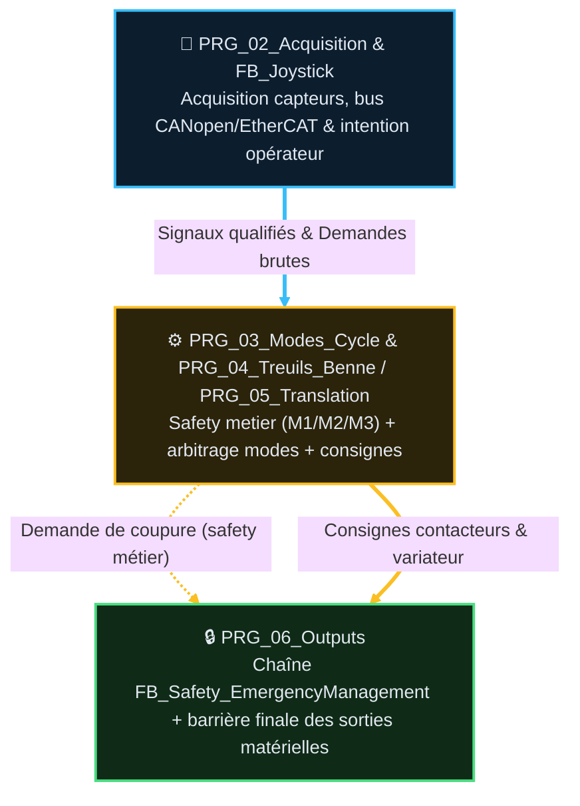

# Analyse Fonctionnelle - Partie 1 : Presentation et Fonctions (v2.1)

> La tracabilite des versions programme/document est portee par `DOC/VERSION_HISTORY.md`.

## 🎯 Rôle et périmètre

- **Rôle** : présenter la machine, ses fonctions et son modèle de sécurité électrique.
- **Périmètre** : automatisme et contrat PLC-IHM ; graphisme et ergonomie IHM hors périmètre.
- **Type de composant** : `FB_Safety_EmergencyManagement` (contrat AF03 `standard` — voir sous-fiche) pour §7 ; le reste (§3-6, §8) est méta (pas de FB unique).

### 🎯 Table des fonctions

> Catalogue propre à la chaîne AU/réarmement (§7) — les tables §4 (Fonctions métier/transverses)
> sont un **index** vers d'autres AF, pas un catalogue `F<NN>.<seq>` de cette partie.

> **État** — `V` validé, implémentation non vérifiée · `V-I` validé et implémenté · `NV` non validé,
> non implémenté · `NV-I` code présent mais non validé · `R` refusé · `NA` non applicable.

<table style="width: 100%; table-layout: fixed; border-collapse: collapse; font-size: 14px;">
  <colgroup>
    <col style="width: 40px;">
    <col style="width: 140px;">
    <col style="width: calc(100% - 520px);">
    <col style="width: 110px;">
    <col style="width: 50px;">
    <col style="width: 90px;">
    <col style="width: 50px;">
    <col style="width: 40px;">
  </colgroup>
  <thead>
    <tr style="border-bottom: 2px solid #475569; text-align: left;">
      <th style="padding: 4px 1px; text-align: center;"><small><b>ID</b></small></th>
      <th style="padding: 4px 1px; text-align: center;"><small>Fonction</small></th>
      <th style="padding: 4px 8px;">Description</th>
      <th style="padding: 4px 1px; text-align: center;"><small>Réalisée par</small></th>
      <th style="padding: 4px 1px; text-align: center;"><small>Criticité</small></th>
      <th style="padding: 4px 1px; text-align: center;"><small>TC couvrants</small></th>
      <th style="padding: 4px 1px; text-align: center;"><small>Statut</small></th>
      <th style="padding: 4px 1px; text-align: center;"><small>État</small></th>
    </tr>
  </thead>
  <tbody>
    <tr style="border-bottom: 1px solid rgba(255,255,255,0.08);">
      <td style="padding: 4px 1px; text-align: center; vertical-align: middle;">F01.01</td>
      <td style="padding: 4px 1px; text-align: center; vertical-align: middle;"><small><b>Couper la puissance (AU)</b></small></td>
      <td style="padding: 6px 8px; line-height: 1.55;">Boucle AU physique ouverte ➔ coupure matérielle des moteurs/actionneurs, indépendante du PLC</td>
      <td style="padding: 4px 1px; text-align: center; vertical-align: middle;"><small><code>FB_Safety_EmergencyManagement</code></small></td>
      <td style="padding: 4px 1px; text-align: center; vertical-align: middle;"><small>🔴 C4</small></td>
      <td style="padding: 4px 1px; text-align: center; vertical-align: middle;">TC-P01-001</td>
      <td style="padding: 4px 1px; text-align: center; vertical-align: middle;"><small>✅</small></td>
      <td style="padding: 4px 1px; text-align: center; vertical-align: middle;"><small><code>NV-I</code></small></td>
    </tr>
    <tr style="border-bottom: 1px solid rgba(255,255,255,0.08);">
      <td style="padding: 4px 1px; text-align: center; vertical-align: middle;">F01.02</td>
      <td style="padding: 4px 1px; text-align: center; vertical-align: middle;"><small><b>Maintenir 2 canaux fail-safe</b></small></td>
      <td style="padding: 6px 8px; line-height: 1.55;">Perte de maintien A <b>ou</b> B ➔ ouvre la boucle AU</td>
      <td style="padding: 4px 1px; text-align: center; vertical-align: middle;"><small><code>FB_Safety_EmergencyManagement</code></small></td>
      <td style="padding: 4px 1px; text-align: center; vertical-align: middle;"><small>🔴 C4</small></td>
      <td style="padding: 4px 1px; text-align: center; vertical-align: middle;">TC-P01-002</td>
      <td style="padding: 4px 1px; text-align: center; vertical-align: middle;"><small>✅</small></td>
      <td style="padding: 4px 1px; text-align: center; vertical-align: middle;"><small><code>NV-I</code></small></td>
    </tr>
    <tr style="border-bottom: 1px solid rgba(255,255,255,0.08);">
      <td style="padding: 4px 1px; text-align: center; vertical-align: middle;">F01.03</td>
      <td style="padding: 4px 1px; text-align: center; vertical-align: middle;"><small><b>Réarmer sur demande explicite</b></small></td>
      <td style="padding: 6px 8px; line-height: 1.55;">Front <code>ArmRequest</code> + boucle saine ➔ séquence de réarmement ; jamais automatique</td>
      <td style="padding: 4px 1px; text-align: center; vertical-align: middle;"><small><code>FB_Safety_EmergencyManagement</code></small></td>
      <td style="padding: 4px 1px; text-align: center; vertical-align: middle;"><small>🔴 C4</small></td>
      <td style="padding: 4px 1px; text-align: center; vertical-align: middle;">TC-P01-003, TC-P01-005</td>
      <td style="padding: 4px 1px; text-align: center; vertical-align: middle;"><small>✅</small></td>
      <td style="padding: 4px 1px; text-align: center; vertical-align: middle;"><small><code>NV-I</code></small></td>
    </tr>
    <tr style="border-bottom: 1px solid rgba(255,255,255,0.08);">
      <td style="padding: 4px 1px; text-align: center; vertical-align: middle;">F01.04</td>
      <td style="padding: 4px 1px; text-align: center; vertical-align: middle;"><small><b>Acquitter sans lever l'interlock</b></small></td>
      <td style="padding: 6px 8px; line-height: 1.55;"><code>Reset</code> efface l'affichage (pattern Cause/Ack) sans jamais ouvrir l'interlock de sécurité</td>
      <td style="padding: 4px 1px; text-align: center; vertical-align: middle;"><small><code>FB_Safety_EmergencyManagement</code></small></td>
      <td style="padding: 4px 1px; text-align: center; vertical-align: middle;"><small>🟠 C3</small></td>
      <td style="padding: 4px 1px; text-align: center; vertical-align: middle;">TC-P01-004, TC-P01-009</td>
      <td style="padding: 4px 1px; text-align: center; vertical-align: middle;"><small>✅</small></td>
      <td style="padding: 4px 1px; text-align: center; vertical-align: middle;"><small><code>NV-I</code></small></td>
    </tr>
    <tr style="border-bottom: 1px solid rgba(255,255,255,0.08);">
      <td style="padding: 4px 1px; text-align: center; vertical-align: middle;">F01.05</td>
      <td style="padding: 4px 1px; text-align: center; vertical-align: middle;"><small><b>Auto-tester la redondance A/B</b></small></td>
      <td style="padding: 6px 8px; line-height: 1.55;">Test croisé des 2 canaux à chaque réarmement (preuve runtime, pas de procédure manuelle séparée)</td>
      <td style="padding: 4px 1px; text-align: center; vertical-align: middle;"><small><code>FB_Safety_EmergencyManagement</code></small></td>
      <td style="padding: 4px 1px; text-align: center; vertical-align: middle;"><small>🔴 C4</small></td>
      <td style="padding: 4px 1px; text-align: center; vertical-align: middle;">TC-P01-006</td>
      <td style="padding: 4px 1px; text-align: center; vertical-align: middle;"><small>✅</small></td>
      <td style="padding: 4px 1px; text-align: center; vertical-align: middle;"><small><code>NV-I</code></small></td>
    </tr>
    <tr style="border-bottom: 1px solid rgba(255,255,255,0.08);">
      <td style="padding: 4px 1px; text-align: center; vertical-align: middle;">F01.06</td>
      <td style="padding: 4px 1px; text-align: center; vertical-align: middle;"><small><b>Verrouiller après échec</b></small></td>
      <td style="padding: 6px 8px; line-height: 1.55;">Non-confirmation contacteur après pulse ➔ lockout 5s avant nouvel essai</td>
      <td style="padding: 4px 1px; text-align: center; vertical-align: middle;"><small><code>FB_Safety_EmergencyManagement</code></small></td>
      <td style="padding: 4px 1px; text-align: center; vertical-align: middle;"><small>🟠 C3</small></td>
      <td style="padding: 4px 1px; text-align: center; vertical-align: middle;">TC-P01-007</td>
      <td style="padding: 4px 1px; text-align: center; vertical-align: middle;"><small>✅</small></td>
      <td style="padding: 4px 1px; text-align: center; vertical-align: middle;"><small><code>NV-I</code></small></td>
    </tr>
    <tr style="border-bottom: 1px solid rgba(255,255,255,0.08);">
      <td style="padding: 4px 1px; text-align: center; vertical-align: middle;">F01.07</td>
      <td style="padding: 4px 1px; text-align: center; vertical-align: middle;"><small><b>Couper sur demande safety métier</b></small></td>
      <td style="padding: 6px 8px; line-height: 1.55;"><code>PowerCutOffRequest</code> (agrégat M1/M2/M3) ➔ coupe A et B sans déclencher d'armement</td>
      <td style="padding: 4px 1px; text-align: center; vertical-align: middle;"><small><code>FB_Safety_EmergencyManagement</code></small></td>
      <td style="padding: 4px 1px; text-align: center; vertical-align: middle;"><small>🔴 C4</small></td>
      <td style="padding: 4px 1px; text-align: center; vertical-align: middle;">TC-P01-008</td>
      <td style="padding: 4px 1px; text-align: center; vertical-align: middle;"><small>✅</small></td>
      <td style="padding: 4px 1px; text-align: center; vertical-align: middle;"><small><code>NV-I</code></small></td>
    </tr>
    <tr style="border-bottom: 1px solid rgba(255,255,255,0.08);">
      <td style="padding: 4px 1px; text-align: center; vertical-align: middle;">F01.08</td>
      <td style="padding: 4px 1px; text-align: center; vertical-align: middle;"><small><b>Cohérence coupure IHM / réarmement</b></small></td>
      <td style="padding: 6px 8px; line-height: 1.55;"><code>BtnEmergencyCutOff</code> pendant le pulse de réarmement</td>
      <td style="padding: 4px 1px; text-align: center; vertical-align: middle;"><small><code>FB_Safety_EmergencyManagement</code></small></td>
      <td style="padding: 4px 1px; text-align: center; vertical-align: middle;"><small>🟠 C3</small></td>
      <td style="padding: 4px 1px; text-align: center; vertical-align: middle;">TC-P01-010</td>
      <td style="padding: 4px 1px; text-align: center; vertical-align: middle;"><small>⚠️ écart relevé, non corrigé (audit 2026-08-22)</small></td>
      <td style="padding: 4px 1px; text-align: center; vertical-align: middle;"><small><code>NV</code></small></td>
    </tr>
  </tbody>
</table>

## 📑 Sommaire

1. [🧪 Table des points de validation (non détaillé)](#1-table-des-points-de-validation-non-détaillé)
2. [🔄 Architecture & Flux Général Machine](#2-architecture-flux-général-machine)
3. [🏗️ Équipements principaux](#3-équipements-principaux)
4. [🧩 Fonctions](#4-fonctions)
5. [🔄 Finalité opérationnelle](#5-finalité-opérationnelle)
6. [⏹️ Modèle de commande et d'arrêt](#6-modèle-de-commande-et-darrêt)
7. [⚡ Sécurité électrique et réarmement](#7-sécurité-électrique-et-réarmement)
8. [📏 Position et référencement](#8-position-et-référencement)
9. [📜 Suivi historique](#9-suivi-historique)
10. [📚 Documents liés](#10-documents-liés)

## 🧪 1 · Table des points de validation (non détaillé)

> Table macro — la fiche `FB_Safety_EmergencyManagement` est **propriétaire unique** du détail
> (`TC-P01-001`…`010`, steps/timing/formules). Le chapô ne recopie **pas** ces 10 descriptions
> ligne à ligne (ce serait une duplication d'information à double maintenance) — il regroupe par
> intention, au même niveau de synthèse que la Table des fonctions ci-dessus :
> [`FB_Safety_EmergencyManagement_v1.2.md §2`](AF_Partie-01_Analyse_Fonctionnelle/FB_Safety_EmergencyManagement_v1.2.md).

> **État** — `V` validé, implémentation non vérifiée · `V-I` validé et implémenté · `NV` non validé,
> non implémenté · `NV-I` code présent mais non validé · `R` refusé · `NA` non applicable.

<table style="width: 100%; table-layout: fixed; border-collapse: collapse; font-size: 14px;">
  <colgroup>
    <col style="width: 140px;">
    <col style="width: 150px;">
    <col style="width: calc(100% - 590px);">
    <col style="width: 110px;">
    <col style="width: 140px;">
    <col style="width: 50px;">
  </colgroup>
  <thead>
    <tr style="border-bottom: 2px solid #475569; text-align: left;">
      <th style="padding: 4px 1px; text-align: center;"><small><b>ID</b></small></th>
      <th style="padding: 4px 1px; text-align: center;"><small>Intention</small></th>
      <th style="padding: 4px 8px;">Séquence & Déroulé des étapes (Comportement attendu)</th>
      <th style="padding: 4px 1px; text-align: center;"><small>Type</small></th>
      <th style="padding: 4px 1px; text-align: center;"><small>Réf</small></th>
      <th style="padding: 4px 1px; text-align: center;"><small>État</small></th>
    </tr>
  </thead>
  <tbody>
    <tr style="border-bottom: 1px solid rgba(255,255,255,0.08);">
      <td style="padding: 4px 1px; text-align: center; vertical-align: middle;">TC-P01-001, TC-P01-008</td>
      <td style="padding: 4px 1px; text-align: center; vertical-align: middle;"><small><b>Coupure de puissance</b></small></td>
      <td style="padding: 6px 8px; line-height: 1.55;">AU physique et demande safety métier agrégée coupent A+B, sans passer par une séquence d'armement</td>
      <td style="padding: 4px 1px; text-align: center; vertical-align: middle;"><small><code>🟢 SITE+AUTO</code></small></td>
      <td style="padding: 4px 1px; text-align: center; vertical-align: middle;"><small><code>FB_Safety_EmergencyManagement</code></small></td>
      <td style="padding: 4px 1px; text-align: center; vertical-align: middle;"><small><code>NV</code></small></td>
    </tr>
    <tr style="border-bottom: 1px solid rgba(255,255,255,0.08);">
      <td style="padding: 4px 1px; text-align: center; vertical-align: middle;">TC-P01-002, TC-P01-006</td>
      <td style="padding: 4px 1px; text-align: center; vertical-align: middle;"><small><b>Redondance A/B</b></small></td>
      <td style="padding: 6px 8px; line-height: 1.55;">Perte d'un canal ouvre la boucle ; auto-test croisé des 2 canaux prouvé à chaque réarmement</td>
      <td style="padding: 4px 1px; text-align: center; vertical-align: middle;"><small><code>⚡ SITE+AUTO_PLC</code></small></td>
      <td style="padding: 4px 1px; text-align: center; vertical-align: middle;"><small><code>FB_Safety_EmergencyManagement</code></small></td>
      <td style="padding: 4px 1px; text-align: center; vertical-align: middle;"><small><code>NV-I</code></small></td>
    </tr>
    <tr style="border-bottom: 1px solid rgba(255,255,255,0.08);">
      <td style="padding: 4px 1px; text-align: center; vertical-align: middle;">TC-P01-003, TC-P01-005, TC-P01-007</td>
      <td style="padding: 4px 1px; text-align: center; vertical-align: middle;"><small><b>Réarmement</b></small></td>
      <td style="padding: 6px 8px; line-height: 1.55;">Front explicite requis, jamais automatique ; acquittement et réarmement = 2 actions distinctes ; échec de confirmation ➔ lockout 5s</td>
      <td style="padding: 4px 1px; text-align: center; vertical-align: middle;"><small><code>⚡ AUTO_PLC</code></small></td>
      <td style="padding: 4px 1px; text-align: center; vertical-align: middle;"><small><code>FB_Safety_EmergencyManagement</code></small></td>
      <td style="padding: 4px 1px; text-align: center; vertical-align: middle;"><small><code>NV-I</code></small></td>
    </tr>
    <tr style="border-bottom: 1px solid rgba(255,255,255,0.08);">
      <td style="padding: 4px 1px; text-align: center; vertical-align: middle;">TC-P01-004, TC-P01-009</td>
      <td style="padding: 4px 1px; text-align: center; vertical-align: middle;"><small><b>Acquittement (Cause/Ack)</b></small></td>
      <td style="padding: 6px 8px; line-height: 1.55;"><code>Reset</code> efface l'affichage sans jamais lever l'interlock de sécurité ; re-latch si nouvel échec</td>
      <td style="padding: 4px 1px; text-align: center; vertical-align: middle;"><small><code>💻 AUTO</code></small></td>
      <td style="padding: 4px 1px; text-align: center; vertical-align: middle;"><small><code>FB_Safety_EmergencyManagement</code></small></td>
      <td style="padding: 4px 1px; text-align: center; vertical-align: middle;"><small><code>NV-I</code></small></td>
    </tr>
    <tr style="border-bottom: 1px solid rgba(255,255,255,0.08);">
      <td style="padding: 4px 1px; text-align: center; vertical-align: middle;">TC-P01-010</td>
      <td style="padding: 4px 1px; text-align: center; vertical-align: middle;"><small><b>Cohérence coupure IHM</b></small></td>
      <td style="padding: 6px 8px; line-height: 1.55;">Coupure IHM maintenue pendant le pulse de réarmement — écart connu, non corrigé (audit 2026-08-22)</td>
      <td style="padding: 4px 1px; text-align: center; vertical-align: middle;"><small><code>💻 AUTO</code></small></td>
      <td style="padding: 4px 1px; text-align: center; vertical-align: middle;"><small><code>FB_Safety_EmergencyManagement</code></small></td>
      <td style="padding: 4px 1px; text-align: center; vertical-align: middle;"><small><code>NV-I</code></small></td>
    </tr>
  </tbody>
</table>

## 🔄 2 · Architecture & Flux Général Machine

Trait plein épais = flux de données transformées ; pointillé = signal de commande/permission
(pas une donnée transformée). Couleur = domaine (cyan acquisition, jaune commande/mouvement, vert
sortie), même dictionnaire que `GUIDE_EDITION_AF_v1.0.md §3quater`.

Le safety métier (M1/M2/M3) est évalué **à l'intérieur** de `PRG_04_Treuils_Benne`/`PRG_05_Translation`
(pas un étage distinct) ; seule la chaîne électrique AU (`FB_Safety_EmergencyManagement`) est
exécutée en aval, dans `PRG_06_Outputs` — voir §7.1.

---

## 🏗️ 3 · Équipements principaux

| Element | Role machine |
|---|---|
| 🪝 Treuil M1 | Levage/retenue, codeur absolu COD1, frein manque-courant. |
| 🪝 Treuil M2 | Levage/benne, codeur absolu COD2, frein manque-courant. |
| ↔️ Translation M3 | Deplace le chariot/pont ; variateur AC600 sur EtherCAT et frein manque-courant. |
| 🪣 Benne | Sans moteur propre : ouverture/fermeture par desynchronisation commandee de M1/M2. |
| 🕹️ Joystick Hall | Commande operateur CANopen, avec homme-mort. |
| ⚡ Contacteur puissance | Autorise ou coupe l'energie des moteurs et actionneurs ; il ne coupe pas l'automate. |

Chaque treuil utilise deux contacteurs de sens et quatre contacteurs de vitesse. Les cinq paliers
resultent d'une table de masques propre a chaque treuil. Le detail des tables, des mouvements et

---

## 🧩 4 · Fonctions

### 🎯 Fonctions metier

| Fonction | Responsabilite |
|---|---|
| 🕹️ Joystick | Produit les demandes de mouvement : marche, direction et vitesse. Les modes et etats autorises determinent l'equipement effectivement commande. |
| 🪝 Treuils | Executent le mouvement, les paliers, le freinage, les limites et les retours de position. |
| ↔️ Translation | Execute le mouvement M3 et le positionnement du chariot/pont. |
| 🪣 Benne | Ordonne la desynchronisation M1/M2 necessaire a son ouverture ou sa fermeture. |
| 🎚️ Modes | Arbitre les droits de marche et les sources de commande. |
| 🔄 Cycle semi-automatique | Orchestre une sequence de production a partir des fonctions disponibles. |

### 🔧 Fonctions transverses

| Fonction | Responsabilite |
|---|---|
| 🖥️ Interface PLC-IHM | Expose des structures d'echange typees pour commandes autorisees, reglages, mesures, diagnostics et etats. |
| 💬 Information operateur | Fournit les etats de la machine et les informations d'action attendue. La presentation, la priorisation et le format des messages sont specifies par la Partie 07. |
| 🧪 Simulation | Permet les essais hors ligne et sans materiel, avec selection explicite des sources reelles ou simulees par domaine. |
| 📡 Diagnostic devices | Surveille les devices et bus requis pour une marche sure ; les pertes pertinentes sont transmises aux protections et aux modes. |
| 🛡️ Safety | Surveille les conditions dangereuses de mouvement et demande soit un arret rapide, soit une coupure de puissance selon le risque. |

---

## 🔄 5 · Finalité opérationnelle

La machine descend la benne, realise le prelevement, remonte la charge, la deplace vers une zone

Les modes maintenance permettent les manoeuvres necessaires hors cycle, dans les autorisations

---

## ⏹️ 6 · Modèle de commande et d'arrêt

| Niveau | Condition | Effet |
|---|---|---|
| [NORMAL] Marche et arret normal | `Enable=TRUE`, pas de `SafeStop` ; `StartStop` pilote la demande | Acceleration ou deceleration normale. |
| [RAPIDE] Arret rapide logiciel | `SafeStop=TRUE`, `Enable=TRUE` | Deceleration rapide du mouvement ; le FB reste actif jusqu'a l'arret. |
| [NEUTRE] Neutralisation | `Enable=FALSE` ou contacteur puissance non confirme | Sorties du FB neutralisees. |
| [COUPURE] Coupure de puissance | AU physique, perte du maintien PLC ou demande safety majeure | Coupure materielle de l'energie des moteurs et actionneurs. |

Precedence obligatoire : `Enable` > `SafeStop` > `StartStop`.

Le frein est a manque-courant. Sa commande doit respecter les conditions physiques de desserrage et

La limite legale de profondeur est une interdiction d'exploitation geree par les modes ; elle n'est
pas, a elle seule, une fonction safety.

---

## ⚡ 7 · Sécurité électrique et réarmement (F01.01-F01.08)

> Detail FB, interfaces, sequence, polarites, IHM, sim et `TC-P01-*` :
> [`FB_Safety_EmergencyManagement_v1.2.md`](AF_Partie-01_Analyse_Fonctionnelle/FB_Safety_EmergencyManagement_v1.2.md).

### 🧱 7.1 Principe

L'automate reste alimente. Une boucle materielle coupe le contacteur general de puissance des
moteurs et actionneurs. Cette boucle comprend les boutons d'arret d'urgence physiques et deux
canaux relais pilotes par le PLC. L'absence de maintien de l'un des canaux PLC doit ouvrir la
boucle : perte d'alimentation PLC, arret du programme ou depassement watchdog conduit donc a la
coupure de puissance.

| Role machine | Sens |
|---|---|
| Retour boucle AU | Boucle physique fermee ; precondition a l'armement — pas le portail mouvement. |
| Retour contacteur | Contacteur reellement engage ; portail maitre `PowerContactorEngaged` des mouvements. |
| Canaux maintien A/B | Deux voies PLC fail-safe : maintien actif a l'etat sain, ouverture = coupure. |
| Impulsion rearmement | Commande explicite operateur ; jamais d'auto-rearmement sur seule boucle saine. |

Une boucle AU saine ne prouve pas que la puissance est presente : apres coupure, la boucle peut
etre saine alors que le contacteur reste ouvert.

Implementation : un seul composite `FB_Safety_EmergencyManagement` en chaine sortie
(`PRG_06_Outputs`). Les safety metier (M1/M2/M3) **demandent** la coupure ; ce FB **execute**
la chaine electrique.

### 🧨 7.2 Sources de coupure

| Source | Effet |
|---|---|
| AU physique | Coupure materielle independante du PLC. |
| Perte maintien PLC / watchdog | Retombee des canaux A/B → coupure. |
| Demande safety domaine (treuil, translation) | Coupure via canaux PLC ; seuils proprietaires Parties 09/11. |
| Coupure IHM explicite | Ouverture des canaux PLC (detail FB). |

La benne n'a pas de safety dedie : couche 1 Benne (P10), escalade possible via safety M1 (P09).

### 🔁 7.3 Rearmement (regles machine)

- Jamais automatique.
- Front commande operateur seulement.
- Preconditions : boucle saine, contacteur non engage, pas de sequence/verrouillage actif.
- Auto-test des deux voies avant impulsion ; confirmation contacteur apres impulsion.
- Acquittement d'un defaut metier et rearmement du contacteur = **deux actions distinctes**.

Temporisations, etapes, latches, Reset conditionnel : **spec FB** (pas recopies ici).

### 🧑‍🔧 7.4 Actions operateur

| Situation | Action operateur |
|---|---|
| Demarrage froid / AU relache, contacteur ouvert | Demander le rearmement. |
| AU physique appuye | Relacher l'AU puis rearmer. |
| Coupure safety metier | Traiter et acquitter le defaut domaine, puis rearmer. |
| Perte PLC | Retablir le PLC puis rearmer. |
| Echec auto-test voies | Diagnostiquer la voie, puis acquitter, puis rearmer. |
| Contacteur non engage apres impulsion | Diagnostiquer le contacteur (regles Reset : spec FB). |

La redondance electrique se prouve par le cablage et un essai canal par canal, pas par deux
sorties logiques identiques.

---

## 📏 8 · Position et référencement

Les codeurs absolus mesurent position et vitesse des cables. Ils servent a l'information de
profondeur/altimetrie, aux limites, au synchronisme M1/M2, aux protections de mouvement et aux
etats mecaniques deduits, dont certains etats de benne.

Le plan de reference affiche est le toucher eau : `0 m`. Le preset brut des codeurs reste positif
et est distinct de l'affichage. L'enroulement/remontee est positif ; la descente sous l'eau est
negative. Le processus de homing est specifie par la Partie 09.

---

## 📜 9 · Suivi historique

| Version | Date | Changement |
|---|---|---|
| v2.1 | 2026-08-25 | Mise en conformite `GUIDE_EDITION_AF_v1.0` : Sommaire lie et complet, section `🎯 Rôle et périmètre` explicite, diagramme §2 en Mermaid `flowchart TD` stylise (remplace le schema HTML/SVG) avec `linkStyle` par domaine, correction de la représentation safety (évaluée dans PRG_04/05, pas un étage à part), correction du lien casse vers la fiche `FB_Safety_EmergencyManagement`, `PRG_OUTPUTS_LD` → `PRG_06_Outputs`. **Correctif 2 (même jour)** : AF-01 retirée de la colonne « Fondations » du guide §5 (comportement réel/testable, contrairement à AF-02/03 méta) ; ajout d'une vraie table macro TC en §1 (10 IDs racine repris tels quels de `FB_Safety_EmergencyManagement`, aucun ID inventé) — le résumé sans ID qui existait avant ne respectait pas la règle chapô/sous-fiche du guide §4. **Correctif 3 (même jour)** : ajout de la Table des fonctions `F01.01`-`F01.08` (chaîne AU/réarmement, §7) — omise à tort en présumant que les tables §4 (index vers d'autres AF) en tenaient lieu ; `FB_Safety_EmergencyManagement` répond à ce besoin fonctionnel (colonne « Réalisée par ») |
| v2.0 | — | Version precedente (voir `ARCHIVES/Doc/`) |

## 📚 10 · Documents liés

| Sujet | Document proprietaire |
|---|---|
| Chaine electrique AU — regles machine (§5) | **Cette partie** |
| `FB_Safety_EmergencyManagement` + `TC-P01-*` | [`FB_Safety_EmergencyManagement_v1.2.md`](AF_Partie-01_Analyse_Fonctionnelle/FB_Safety_EmergencyManagement_v1.2.md) |
| Architecture, taches et flux | Partie 02 |
| Contrats FB / DUT | Partie 03 |
| Cycle semi-automatique | Partie 04 |
| Modes et droits | Partie 05 |
| Conditionnement E/S | Partie 06 |
| Contrat PLC-IHM | Partie 07 |
| Joystick · Treuils · Codeurs · Translation · Benne · Sim · TS | Parties 08–14 |

Les autres parties renvoient a §5 pour le **role machine** et a la spec FB pour
**l'implementation et les tests**, sans recopier ni l'un ni l'autre.
