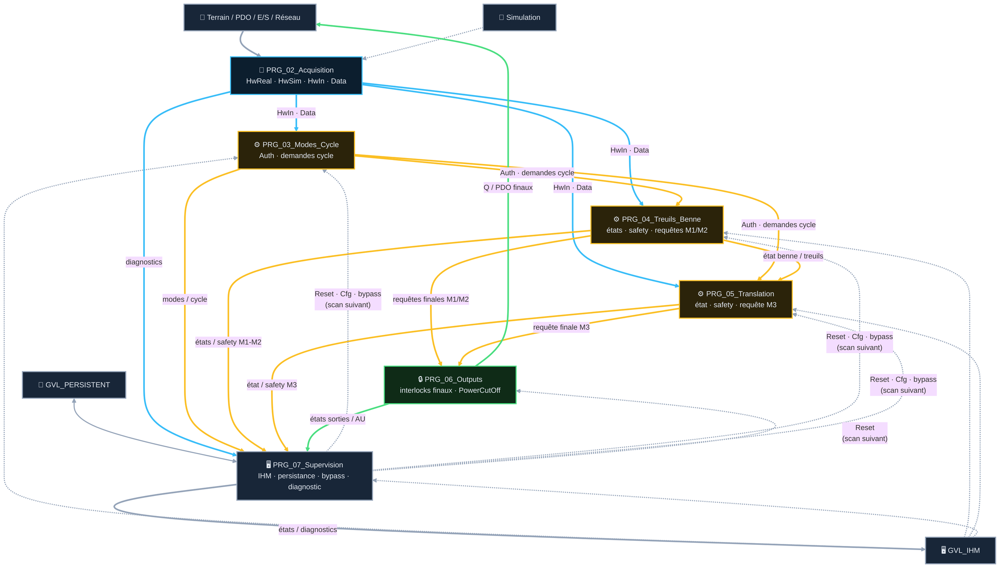

# Analyse Fonctionnelle - Partie 2 : Architecture Programme (v3.2)

> La tracabilite des versions programme/document est portee par `DOC/VERSION_HISTORY.md`.

## 📑 Sommaire

1. [🧪 Table des points de validation](#1-table-des-points-de-validation)
2. [🧱 Principes d'architecture](#2-principes-darchitecture)
3. [🗺️ Organisation cible](#3-organisation-cible)
4. [🚌 Contrats de flux](#4-contrats-de-flux)
5. [⏱️ Exécution cible](#5-exécution-cible)
6. [🔧 Règles de maintenance et migration](#6-règles-de-maintenance-et-migration)
7. [📜 Suivi historique](#7-suivi-historique)
8. [❓ TBD](#8-tbd)
9. [📚 Documents liés](#9-documents-liés)

---

## 🎯 Rôle et périmètre

- **Rôle** : définir l'architecture d'exécution ST de l'automate : ordonnancement des programmes,
  frontières de flux, responsabilités exclusives et règles de lisibilité maintenance.
- **Périmètre** : découpage par procédé (6 POU actifs), ordonnancement `MainTask`, contrats de flux
  inter-domaine. Ne définit pas : le détail des contrats FB/DUT (Partie 03), le contenu métier
  de chaque domaine (Parties 04-14).
- **Type de composant** : Architecture d'intégration — pas de FB unique ; les contrats publics
  sont les bus inter-PRG, détaillés en AF03.
- Le code ST versionné est la référence de l'architecture active. Les POU CFC/Ladder historiques
  sont uniquement des repères de migration archivés.

### 🎯 Table des fonctions

> **État** — `V` validé, implémentation non vérifiée · `V-I` validé et implémenté · `NV` non validé,
> non implémenté · `NV-I` code présent mais non validé · `R` refusé · `NA` non applicable.

<table style="width: 100%; table-layout: fixed; border-collapse: collapse; font-size: 14px;">
  <colgroup>
    <col style="width: 40px;">
    <col style="width: 140px;">
    <col style="width: calc(100% - 520px);">
    <col style="width: 110px;">
    <col style="width: 50px;">
    <col style="width: 90px;">
    <col style="width: 50px;">
    <col style="width: 40px;">
  </colgroup>
  <thead>
    <tr style="border-bottom: 2px solid #475569; text-align: left;">
      <th style="padding: 4px 1px; text-align: center;"><small><b>ID</b></small></th>
      <th style="padding: 4px 1px; text-align: center;"><small>Fonction</small></th>
      <th style="padding: 4px 8px;">Description</th>
      <th style="padding: 4px 1px; text-align: center;"><small>Réalisée par</small></th>
      <th style="padding: 4px 1px; text-align: center;"><small>Criticité</small></th>
      <th style="padding: 4px 1px; text-align: center;"><small>TC couvrants</small></th>
      <th style="padding: 4px 1px; text-align: center;"><small>Statut</small></th>
      <th style="padding: 4px 1px; text-align: center;"><small>État</small></th>
    </tr>
  </thead>
  <tbody>
    <tr style="border-bottom: 1px solid rgba(255,255,255,0.08);">
      <td style="padding: 4px 1px; text-align: center; vertical-align: middle;"><span style="writing-mode: vertical-rl; transform: rotate(180deg); display: inline-block; font-family: monospace; font-size: 11.5px; font-weight: bold; letter-spacing: 0.5px;">F02.01</span></td>
      <td style="padding: 4px 1px; text-align: center; vertical-align: middle;"><small><b>Ordonner le cycle applicatif</b></small></td>
      <td style="padding: 6px 8px; line-height: 1.55;">Exécute les six PRG dans l'ordre Acquisition → Modes/Cycle → Treuils/Benne → Translation → Outputs → Supervision.</td>
      <td style="padding: 4px 1px; text-align: center; vertical-align: middle;"><small><code>MainTask</code> + <code>PRG_02</code> à <code>PRG_07</code></small></td>
      <td style="padding: 4px 1px; text-align: center; vertical-align: middle;"><small>🔵 C2</small></td>
      <td style="padding: 4px 1px; text-align: center; vertical-align: middle;"><span style="font-family: monospace; font-size: 11.5px; font-weight: bold; letter-spacing: 0.5px;">TC-P02-004</span></td>
      <td style="padding: 4px 1px; text-align: center; vertical-align: middle;"><small>⚠️ revue MainTask manuelle</small></td>
      <td style="padding: 4px 1px; text-align: center; vertical-align: middle;"><small><code>NV</code></small></td>
    </tr>
    <tr style="border-bottom: 1px solid rgba(255,255,255,0.08);">
      <td style="padding: 4px 1px; text-align: center; vertical-align: middle;"><span style="writing-mode: vertical-rl; transform: rotate(180deg); display: inline-block; font-family: monospace; font-size: 11.5px; font-weight: bold; letter-spacing: 0.5px;">F02.02</span></td>
      <td style="padding: 4px 1px; text-align: center; vertical-align: middle;"><small><b>Encapsuler l'orchestration ST</b></small></td>
      <td style="padding: 6px 8px; line-height: 1.55;">Les PRG rendent visibles leurs instances, flux et arbitrages ; calculs et machines d'état résident dans les FB.</td>
      <td style="padding: 4px 1px; text-align: center; vertical-align: middle;"><small><code>PRG_02</code> à <code>PRG_07</code></small></td>
      <td style="padding: 4px 1px; text-align: center; vertical-align: middle;"><small>⚪ C1</small></td>
      <td style="padding: 4px 1px; text-align: center; vertical-align: middle;"><span style="font-family: monospace; font-size: 11.5px; font-weight: bold; letter-spacing: 0.5px;">TC-P02-002</span></td>
      <td style="padding: 4px 1px; text-align: center; vertical-align: middle;"><small>✅</small></td>
      <td style="padding: 4px 1px; text-align: center; vertical-align: middle;"><small><code>NV-I</code></small></td>
    </tr>
    <tr style="border-bottom: 1px solid rgba(255,255,255,0.08);">
      <td style="padding: 4px 1px; text-align: center; vertical-align: middle;"><span style="writing-mode: vertical-rl; transform: rotate(180deg); display: inline-block; font-family: monospace; font-size: 11.5px; font-weight: bold; letter-spacing: 0.5px;">F02.03</span></td>
      <td style="padding: 4px 1px; text-align: center; vertical-align: middle;"><small><b>Garantir un producteur unique</b></small></td>
      <td style="padding: 6px 8px; line-height: 1.55;">Chaque image, bus, commande et état public a un propriétaire unique, identifié avant tout raccordement.</td>
      <td style="padding: 4px 1px; text-align: center; vertical-align: middle;"><small>Contrats <code>ST_*</code> + PRG producteurs</small></td>
      <td style="padding: 4px 1px; text-align: center; vertical-align: middle;"><small>🟠 C3</small></td>
      <td style="padding: 4px 1px; text-align: center; vertical-align: middle;"><span style="font-family: monospace; font-size: 11.5px; font-weight: bold; letter-spacing: 0.5px;">TC-P02-001</span></td>
      <td style="padding: 4px 1px; text-align: center; vertical-align: middle;"><small>⚠️ gate à fiabiliser (TBD §8)</small></td>
      <td style="padding: 4px 1px; text-align: center; vertical-align: middle;"><small><code>NV</code></small></td>
    </tr>
    <tr style="border-bottom: 1px solid rgba(255,255,255,0.08);">
      <td style="padding: 4px 1px; text-align: center; vertical-align: middle;"><span style="writing-mode: vertical-rl; transform: rotate(180deg); display: inline-block; font-family: monospace; font-size: 11.5px; font-weight: bold; letter-spacing: 0.5px;">F02.04</span></td>
      <td style="padding: 4px 1px; text-align: center; vertical-align: middle;"><small><b>Isoler la barrière de sortie</b></small></td>
      <td style="padding: 6px 8px; line-height: 1.55;">Seul <code>PRG_06_Outputs</code> applique les interlocks finaux et écrit les Q/PDO des actionneurs.</td>
      <td style="padding: 4px 1px; text-align: center; vertical-align: middle;"><small><code>PRG_06_Outputs</code></small></td>
      <td style="padding: 4px 1px; text-align: center; vertical-align: middle;"><small>🔴 C4</small></td>
      <td style="padding: 4px 1px; text-align: center; vertical-align: middle;"><span style="font-family: monospace; font-size: 11.5px; font-weight: bold; letter-spacing: 0.5px;">TC-P02-003</span></td>
      <td style="padding: 4px 1px; text-align: center; vertical-align: middle;"><small>✅</small></td>
      <td style="padding: 4px 1px; text-align: center; vertical-align: middle;"><small><code>NV-I</code></small></td>
    </tr>
    <tr style="border-bottom: 1px solid rgba(255,255,255,0.08);">
      <td style="padding: 4px 1px; text-align: center; vertical-align: middle;"><span style="writing-mode: vertical-rl; transform: rotate(180deg); display: inline-block; font-family: monospace; font-size: 11.5px; font-weight: bold; letter-spacing: 0.5px;">F02.05</span></td>
      <td style="padding: 4px 1px; text-align: center; vertical-align: middle;"><small><b>Rendre explicites les retards de scan</b></small></td>
      <td style="padding: 6px 8px; line-height: 1.55;">Toute donnée consommée avant son producteur est interdite, sauf retard d'un scan nommé et justifié.</td>
      <td style="padding: 4px 1px; text-align: center; vertical-align: middle;"><small>Ordonnancement <code>MainTask</code></small></td>
      <td style="padding: 4px 1px; text-align: center; vertical-align: middle;"><small>🟠 C3</small></td>
      <td style="padding: 4px 1px; text-align: center; vertical-align: middle;"><span style="font-family: monospace; font-size: 11.5px; font-weight: bold; letter-spacing: 0.5px;">TC-P02-004</span></td>
      <td style="padding: 4px 1px; text-align: center; vertical-align: middle;"><small>⚠️ revue MainTask manuelle</small></td>
      <td style="padding: 4px 1px; text-align: center; vertical-align: middle;"><small><code>NV</code></small></td>
    </tr>
    <tr style="border-bottom: 1px solid rgba(255,255,255,0.08);">
      <td style="padding: 4px 1px; text-align: center; vertical-align: middle;"><span style="writing-mode: vertical-rl; transform: rotate(180deg); display: inline-block; font-family: monospace; font-size: 11.5px; font-weight: bold; letter-spacing: 0.5px;">F02.06</span></td>
      <td style="padding: 4px 1px; text-align: center; vertical-align: middle;"><small><b>Séparer supervision et commande métier</b></small></td>
      <td style="padding: 6px 8px; line-height: 1.55;">La vue troubleshooting observe seulement ; <code>PRG_07</code> porte distinctement reset IHM, persistance et bypass autorisés.</td>
      <td style="padding: 4px 1px; text-align: center; vertical-align: middle;"><small><code>PRG_07_Supervision</code> + <code>FB_TroubleshootingView</code></small></td>
      <td style="padding: 4px 1px; text-align: center; vertical-align: middle;"><small>🔵 C2</small></td>
      <td style="padding: 4px 1px; text-align: center; vertical-align: middle;"><span style="font-family: monospace; font-size: 11.5px; font-weight: bold; letter-spacing: 0.5px;">TC-P02-005</span></td>
      <td style="padding: 4px 1px; text-align: center; vertical-align: middle;"><small>✅</small></td>
      <td style="padding: 4px 1px; text-align: center; vertical-align: middle;"><small><code>NV-I</code></small></td>
    </tr>
  </tbody>
</table>

## 🧪 1 · Table des points de validation

> **État** — `V` validé, implémentation non vérifiée · `V-I` validé et implémenté · `NV` non validé,
> non implémenté · `NV-I` code présent mais non validé · `R` refusé · `NA` non applicable.

<table style="width: 100%; table-layout: fixed; border-collapse: collapse; font-size: 14px;">
  <colgroup>
    <col style="width: 28px;">
    <col style="width: 50px;">
    <col style="width: calc(100% - 165px);">
    <col style="width: 45px;">
    <col style="width: 26px;">
    <col style="width: 36px;">
  </colgroup>
  <thead>
    <tr style="border-bottom: 2px solid #475569; text-align: left;">
      <th style="padding: 4px 1px; text-align: center;"><small><b>ID</b></small></th>
      <th style="padding: 4px 1px; text-align: center;"><small>Intention</small></th>
      <th style="padding: 4px 8px;">Séquence & Déroulé des étapes (Comportement attendu)</th>
      <th style="padding: 4px 1px; text-align: center;"><small>Type</small></th>
      <th style="padding: 4px 1px; text-align: center;"><small>Réf</small></th>
      <th style="padding: 4px 1px; text-align: center;"><small>État</small></th>
    </tr>
  </thead>
  <tbody>
    <tr style="border-bottom: 1px solid rgba(255,255,255,0.08);">
      <td style="padding: 4px 1px; text-align: center; vertical-align: middle;"><span style="writing-mode: vertical-rl; transform: rotate(180deg); display: inline-block; font-family: monospace; font-size: 11.5px; font-weight: bold; letter-spacing: 0.5px;">TC-P02-001</span></td>
      <td style="padding: 4px 1px; text-align: center; vertical-align: middle;"><small><b>Un seul producteur<br>par donnée</b></small></td>
      <td style="padding: 6px 8px; line-height: 1.55;">Aucun écouteur/écrivain multiple sur un contrat <i>(⚠️ <code>G200_check_linkage.py</code> L10 remonte des faux positifs intra-POU — voir TBD §8)</i></td>
      <td style="padding: 4px 1px; text-align: center;"><small><code>💻 AUTO</code></small></td>
      <td style="padding: 4px 1px; text-align: center;"><small>§2</small></td>
      <td style="padding: 4px 1px; text-align: center;"><small><code>NV</code></small></td>
    </tr>
    <tr style="border-bottom: 1px solid rgba(255,255,255,0.08);">
      <td style="padding: 4px 1px; text-align: center; vertical-align: middle;"><span style="writing-mode: vertical-rl; transform: rotate(180deg); display: inline-block; font-family: monospace; font-size: 11.5px; font-weight: bold; letter-spacing: 0.5px;">TC-P02-002</span></td>
      <td style="padding: 4px 1px; text-align: center; vertical-align: middle;"><small><b>Orchestration ST<br>sans logique cachée</b></small></td>
      <td style="padding: 6px 8px; line-height: 1.55;">Les calculs et machines d'état résident dans les FB ; le PRG rend ses arbitrages et flux explicitement lisibles</td>
      <td style="padding: 4px 1px; text-align: center;"><small><code>💻 AUTO</code></small></td>
      <td style="padding: 4px 1px; text-align: center;"><small>§2</small></td>
      <td style="padding: 4px 1px; text-align: center;"><small><code>NV</code></small></td>
    </tr>
    <tr style="border-bottom: 1px solid rgba(255,255,255,0.08);">
      <td style="padding: 4px 1px; text-align: center; vertical-align: middle;"><span style="writing-mode: vertical-rl; transform: rotate(180deg); display: inline-block; font-family: monospace; font-size: 11.5px; font-weight: bold; letter-spacing: 0.5px;">TC-P02-003</span></td>
      <td style="padding: 4px 1px; text-align: center; vertical-align: middle;"><small><b>Sorties physiques<br>via PRG_06</b></small></td>
      <td style="padding: 6px 8px; line-height: 1.55;">Aucun autre POU n'écrit les Q/PDO finaux</td>
      <td style="padding: 4px 1px; text-align: center;"><small><code>💻 AUTO</code></small></td>
      <td style="padding: 4px 1px; text-align: center;"><small>§3</small></td>
      <td style="padding: 4px 1px; text-align: center;"><small><code>NV</code></small></td>
    </tr>
    <tr style="border-bottom: 1px solid rgba(255,255,255,0.08);">
      <td style="padding: 4px 1px; text-align: center; vertical-align: middle;"><span style="writing-mode: vertical-rl; transform: rotate(180deg); display: inline-block; font-family: monospace; font-size: 11.5px; font-weight: bold; letter-spacing: 0.5px;">TC-P02-004</span></td>
      <td style="padding: 4px 1px; text-align: center; vertical-align: middle;"><small><b>Ordre MainTask<br>conforme</b></small></td>
      <td style="padding: 6px 8px; line-height: 1.55;">Tâche CODESYS + <code>G200_check_linkage.py</code> PASS <i>(⚠️ ne vérifie pas l'ordre inter-POU — revue manuelle à ce jour, voir TBD §8)</i></td>
      <td style="padding: 4px 1px; text-align: center;"><small><code>⚡ SITE+AUTO</code></small></td>
      <td style="padding: 4px 1px; text-align: center;"><small>§5</small></td>
      <td style="padding: 4px 1px; text-align: center;"><small><code>NV</code></small></td>
    </tr>
    <tr style="border-bottom: 1px solid rgba(255,255,255,0.08);">
      <td style="padding: 4px 1px; text-align: center; vertical-align: middle;"><span style="writing-mode: vertical-rl; transform: rotate(180deg); display: inline-block; font-family: monospace; font-size: 11.5px; font-weight: bold; letter-spacing: 0.5px;">TC-P02-005</span></td>
      <td style="padding: 4px 1px; text-align: center; vertical-align: middle;"><small><b>Troubleshooting<br>lecture seule</b></small></td>
      <td style="padding: 6px 8px; line-height: 1.55;"><code>FB_TroubleshootingView</code> ne produit aucune commande, configuration ni interlock</td>
      <td style="padding: 4px 1px; text-align: center;"><small><code>💻 AUTO</code></small></td>
      <td style="padding: 4px 1px; text-align: center;"><small>§3</small></td>
      <td style="padding: 4px 1px; text-align: center;"><small><code>NV</code></small></td>
    </tr>
  </tbody>
</table>

---

## 🧱 2 · Principes d'architecture

| Principe | Exigence |
|---|---|
| 📑 ST lisible & structuré | Les programmes d'orchestration sont rédigés en **Structured Text (ST)**. Ils sont découpés en sections claires commentées avec des emojis (ex: `// === 📥 §1 ACQUISITION ===`), sans logique métier inline. |
| 🧩 POO | Les FB encapsulent calculs, machines d'état et briques techniques par composition. |
| ✍️ Producteur unique | Toute donnée, commande ou sortie physique a un seul écrivain identifié. |
| 🔗 Contrat par bus DUT | Tout flux inter-domaine passe par une structure DUT publique (`ST_*`), documentée et orientée rôle (`Auth`, `Qualified`, `Measurements`). |
| 🛡️ Safety visible | Les sorties safety et leurs consommateurs sont nommés et explicites ; aucun arbitrage safety anonyme n'est admis. |
| ⚡ Sortie finale | Une barrière finale (`PRG_06_Outputs`) est l'unique productrice de chaque commande physique. |
| 🧪 Simulation | Le choix réel/simulé est réalisé une fois à la frontière acquisition, par domaine. |
| 🖥️ IHM | Les structures `Cmd/State/Cfg/Bypass` restent le contrat PLC-IHM, distinct des flux internes. |

Un programme d'orchestration ST contient des déclarations d'instances, des constantes nommées et le câblage des entrées/sorties de FB par structures DUT. Il ne contient ni `IF` complexe, ni calcul, ni fusion de commandes, ni écriture de sortie d'actionneur hors `PRG_06_Outputs`. Les commandes de protocole des codeurs nécessaires au homing restent une exception propriétaire de `PRG_02`.

---

## 🗺️ 3 · Organisation cible

**Regle de decoupage : par ensemble mecanique, pas par couche transverse.**
Chaque procede physique porte sa propre safety dans son programme ST : le lien entre la surveillance
safety et le bloc metier commande doit etre visible dans le meme POU, sans ouvrir un domaine transverse.

| N° | Programme | Langage | Responsabilite |
|---|---|---|---|
| 01 | 📥 `PRG_02_Acquisition` | ST pur (`.st`) | **Frontière d'acquisition, qualification et substitution réel/simulé** : producteur unique de `HwReal`, `HwSim`, `HwIn`, chaîne codeurs/homing, gestes joystick et diagnostics devices/bus. |
| — | ~~`PRG_01_Inputs_LD`~~ | ~~Ladder~~ | ✅ Retiré (2026-08-26, vérifié absent de `CODE/M_MAIN/`) — qualification absorbée par `PRG_02_Acquisition`. |
| 03 | 🎚️ `PRG_03_Modes_Cycle` | ST pur (`.st`) | **Cerveau décisionnel unique** : modes, droits, autorisations, sélections de sources, **séquenceur de cycle** (`FB_Cycle`) et **assistants de dragage** (`FB_DiveSearch`, `FB_ExtractionSequence`). Produit des demandes sur `Data` ; ne commande aucune sortie directe. |
| 04 | 🪝 `PRG_04_Treuils_Benne` | ST pur (`.st`) | **Muscle & sécurité levage** : pilotage physique treuils M1 (retenue) + M2 (benne), synchronisation (`FB_WinchSync`), commande benne (`FB_Bucket`), application des requêtes cycle/assistants (`ReqProgram.ReqBucket`) et safety treuils (`FB_Safety_Winch`). |
| 05 | ↔️ `PRG_05_Translation` | ST pur (`.st`) | Décodage des capteurs M3, positionnement et arbitrage final translation, avec la safety M3 appelée de manière explicite. |
| 06 | ⚡ `PRG_06_Outputs` | ST pur (`.st`) | Barrières finales, commandes physiques, **agrégation finale des demandes `PowerCutOff`** et réarmement. |
| 07 | 🔎 `PRG_07_Supervision` | ST pur (`.st`) | Agrégation IHM, persistance de configuration, synchronisation des bypass autorisés, diagnostics et vue troubleshooting en lecture seule. |

### 🔄 Pipeline d'exécution et flux inter-PRG

Le diagramme porte les **frontières de bus et l'ordonnancement** ; il ne remplace pas les contrats
de composants AF03 ni les exigences métier AF04 à AF14. Une flèche pleine représente une donnée
publique produite puis consommée dans le cycle. Une flèche pointillée issue de la Supervision porte
une commande ou configuration dont les PRG précédents ne voient l'effet qu'au scan suivant.

```mermaid
%%{init: {'theme':'base', 'themeVariables': {'fontSize':'14px'}}}%%
flowchart TD
    Inputs["📡 Terrain / PDO / E/S / Réseau<br/>🧪 Simulation<br/>🖥️ Commandes GVL_IHM<br/>(lues dans les PRG concernés)"]
    P02["📡 PRG_02_Acquisition<br/>lit Terrain + Simulation<br/>produit HwReal · HwSim · HwIn · Data"]
    P03["⚙️ PRG_03_Modes_Cycle<br/>lit HwIn · Data · IHM<br/>produit Auth · demandes cycle"]
    P04["⚙️ PRG_04_Treuils_Benne<br/>lit Acquisition · Auth · IHM<br/>produit états · safety · requêtes M1/M2"]
    P05["⚙️ PRG_05_Translation<br/>lit Acquisition · Auth · M1/M2 · IHM<br/>produit état · safety · requête M3"]
    P06["🔒 PRG_06_Outputs<br/>lit requêtes M1/M2/M3<br/>produit interlocks finaux · Q/PDO · PowerCutOff"]
    P07["🖥️ PRG_07_Supervision<br/>lit états PRG_02 à PRG_06<br/>produit états/diagnostics IHM · persistance · bypass"]
    Next["↻ Scan suivant<br/>Reset · Cfg · bypass consommés par PRG_03 à PRG_06"]

    Inputs ==>|"terrain / simulation"| P02
    P02 ==>|"HwIn · Data"| P03
    P03 ==>|"Auth · demandes cycle"| P04
    P04 ==>|"états treuils/benne · requêtes M1/M2"| P05
    P05 ==>|"état M3 · requête M3"| P06
    P06 ==>|"états sorties / AU"| P07
    P07 -.->|"Reset · Cfg · bypass"| Next

    classDef acq fill:#0c1e2e,stroke:#38bdf8,stroke-width:2px,color:#e2e8f0
    classDef cmd fill:#2b230a,stroke:#fbbf24,stroke-width:2px,color:#e2e8f0
    classDef outp fill:#0f2b17,stroke:#4ade80,stroke-width:2px,color:#e2e8f0
    classDef sup fill:#182638,stroke:#94a3b8,stroke-width:2px,color:#e2e8f0
    classDef ext fill:#182638,stroke:#94a3b8,stroke-width:2px,color:#e2e8f0
    class Inputs,Next ext
    class P02 acq
    class P03,P04,P05 cmd
    class P06 outp
    class P07 sup

    linkStyle 0 stroke:#94a3b8,stroke-width:3px
    linkStyle 1 stroke:#38bdf8,stroke-width:3px
    linkStyle 2 stroke:#fbbf24,stroke-width:3px
    linkStyle 3 stroke:#fbbf24,stroke-width:3px
    linkStyle 4 stroke:#4ade80,stroke-width:3px
    linkStyle 5 stroke:#94a3b8,stroke-width:3px
    linkStyle 6 stroke:#94a3b8,stroke-width:2px
```



### 🕸️ Topologie détaillée des liaisons

Cette vue complète le pipeline vertical : elle est destinée à la revue de raccordement et au
dépannage. Elle montre les liaisons qui ne suivent pas la chaîne principale, notamment simulation,
IHM, persistance, retours d'état vers la Supervision et retards d'un scan.



### 🔌 Contrats d'intégration des programmes

| PRG | Lit (producteurs) | Produit | Responsabilité exclusive | Ordonnancement / référence métier |
|---|---|---|---|---|
| `PRG_02_Acquisition` | Terrain/PDO, réseau, simulation | `HwReal`, `HwSim`, `HwIn`, `Data` acquisition | Frontière acquisition/qualification, sélection réel/simulé, diagnostics devices, joystick et codeurs/homing | Premier ; AF06, AF08, AF09, AF12, AF13 |
| `PRG_03_Modes_Cycle` | `PRG_02`, IHM, retours procédés du scan précédent | `Auth`, demandes du cycle | Arbitrage des modes et séquenceur ; aucune sortie physique | Après acquisition ; AF04, AF05 |
| `PRG_04_Treuils_Benne` | `PRG_02`, `PRG_03`, IHM | États, safety et requêtes finales M1/M2 | Arbitrage treuils/benne/synchronisation et safety M1/M2 | Après Modes ; AF10 et sous-fiches associées |
| `PRG_05_Translation` | `PRG_02.HwIn.Translation`, `PRG_03`, `PRG_04`, IHM | Position logique, état, safety et requête finale M3 | Décodage M3, arbitrage translation et safety M3 ; interlock anti-collision M1/M2 | Après Treuils/Benne ; AF11 |
| `PRG_06_Outputs` | `PRG_02`, `PRG_04`, `PRG_05`, reset publié par `PRG_07` au scan précédent | Q/PDO finaux, état AU et sorties publiques | Barrière finale matérielle, interlocks actionneurs et agrégation `PowerCutOff` | Après tous les procédés ; AF01, AF06, AF10, AF11 |
| `PRG_07_Supervision` | États publics `PRG_02` à `PRG_06`, IHM, persistance | États/diagnostics IHM, persistance/bypass, reset global | Supervision ; seule la vue troubleshooting est lecture seule | Dernier ; ses commandes sont consommées au scan suivant ; AF07, AF12, AF14 |

### ⏱️ Ordre fonctionnel intra-PRG

Cette séquence est un **ordre chronologique obligatoire, à lire de haut en bas** : la phase 2 peut
consommer les garanties de la phase 1, jamais l'inverse. Elle ne fige ni le nom d'une instance, ni
l'ordre entre deux calculs indépendants au sein d'une même phase. Toute exception est un retard d'un
scan explicitement documenté ; elle ne doit jamais être implicite.

### 🚧 Registre des accès inter‑PRG hors contrat public

Ces lectures sont adressables en CODESYS, mais percent l'interface documentée du POU source. Elles ne
sont pas un idiome cible : toute nouvelle dépendance passe par `Data`/`Auth`. Chaque migration doit
conserver la fraîcheur actuelle ; `N‑1` vaut un cycle MainTask, soit 10 ms typiques.

| Lecteur | Lecture actuelle hors contrat | Fraîcheur | Cible de migration |
|---|---|---|---|
| `PRG_02` | `PRG_04.instWinchM1/M2.Status.Busy` | 🟡 N‑1 | `PRG_04.Data.WinchM1/2State.Busy` déjà public |
| `PRG_03` | instances joystick/codeur PRG‑02 ; synchro/benne PRG‑04 ; mouvement M3 PRG‑05 | 🟡 N‑1 pour PRG‑04/05 | Champs publics à compléter |
| `PRG_04` | instance cycle PRG‑03 et états locaux M3 PRG‑05 | 🟡 N‑1 pour PRG‑05 | Demandes cycle/état M3 publics |
| `PRG_05` | diagnostics internes PRG‑02 et interlock M3 interne PRG‑06 | 🟡 N‑1 pour PRG‑06 | Diagnostics acquisition/interlock publics |
| `PRG_07` | variables locales PRG‑04 et instance cycle PRG‑03 | 🟢 courant (PRG‑04) | Diagnostics publics dédiés |

#### `PRG_02_Acquisition` — détail externalisé

📄 Lire [Fiche PRG‑02 — Acquisition](AF_Partie-02_Architecture_Programme/AF_Fiche_PRG_02_Acquisition_v1.0.md) pour l'ordre intra‑PRG,
les raccordements `GVL_Simulation` / `GVL_IHM` / `GVL_PERSISTENT`, l'aiguillage `HwReal/HwSim/HwIn`
et les retards d'un scan. AF‑02 conserve ci‑dessous le résumé des autres PRG pendant leur migration.

#### `PRG_03_Modes_Cycle`

| Phase — lire ↓ | 🎯 But | 🕒 Fraîcheur lue | ❓ Pourquoi maintenant ? | ✅ Garantie avant phase suivante |
|---|---|---|---|---|
| 1. 🎚️ Arbitrer les modes | Calculer mode, permissions, inhibitions et autorisations depuis acquisition et IHM. | 🟢 `PRG_02` et IHM courants | Les droits précèdent toute demande de mouvement. | Résultat `instModes.Auth` courant disponible localement. |
| 2. 🔄 Séquencer le cycle | Évaluer le cycle et ses retours procédés. | 🟡 `Auth` N-1 dans le code actuel ; 🟡 retours procédé N-1 admis | Le cycle doit être évalué après la décision de mode, mais son entrée `Auth` est aujourd'hui en retard. | Demandes de cycle cohérentes avec les entrées réellement lues. |
| 3. 📤 Publier | Exposer `Auth` et demandes à `PRG_04`/`PRG_05`. | 🟢 `instModes.Auth` courant | Les procédés aval doivent lire les droits du scan courant. | `PRG_04`/`PRG_05` consomment `Auth` courant. |

> ⚠️ **Écart observé à arbitrer** : le source appelle `instModes`, puis appelle le cycle avec
> `Auth`, et n'affecte `Auth := instModes.Auth` qu'en fin de POU. Le cycle lit donc `Auth` du scan
> précédent. Le présent ordre fonctionnel prescrit `Auth` courant avant le cycle ; soit le retard
> doit être accepté et documenté, soit la publication doit précéder l'appel du cycle. Aucun code
> n'est modifié par cette documentation.

#### `PRG_04_Treuils_Benne`

| Phase — lire ↓ | 🎯 But | 🕒 Fraîcheur lue | ❓ Pourquoi maintenant ? | ✅ Garantie avant phase suivante |
|---|---|---|---|---|
| 1. 🧭 Préparer l'intention | Qualifier demandes maintenance et assistants de conduite. | 🟢 acquisition, `Auth`, IHM courants | Une consigne doit être attribuée avant d'être fusionnée. | Intention opérateur/automatique non ambiguë. |
| 2. 🪣 Commander la benne | Évaluer état, demande et séquences propres à la benne. | 🟢 mesures M1/M2 courantes ; 🟡 états mouvements précédemment publiés si requis | Les interdictions croisées exigent l'état benne. | État benne disponible. |
| 3. 🪝 Arbitrer M1/M2 | Fusionner les sources admises en consignes candidates par treuil. | 🟢 modes, cycle publié, joystick, benne | Une seule demande doit survivre par mouvement. | Une consigne candidate par treuil. |
| 4. 🛡️ Synchroniser/sécuriser | Évaluer synchronisme, couplages, limites, permis directionnels et safety M1/M2. | 🟢 mesures/candidates courantes | La safety décide avant l'ordre moteur. | Permis effectifs et SafeStop/PowerCutOff déterminés. |
| 5. ⚙️ Exécuter | Appeler la commande M1/M2 avec permis effectifs. | 🟢 consignes et safety courantes | Les ordres doivent être bornés par la safety déjà calculée. | Demandes actionneurs brutes cohérentes. |
| 6. 📤 Publier | Publier demandes finales, états et diagnostics publics. | 🟢 exécution du scan | Les PRG aval doivent voir un état unique. | `PRG_05`, `PRG_06` et Supervision ont un état unique. |

#### `PRG_05_Translation`

| Phase — lire ↓ | 🎯 But | 🕒 Fraîcheur lue | ❓ Pourquoi maintenant ? | ✅ Garantie avant phase suivante |
|---|---|---|---|---|
| 1. 📍 Décoder M3 | Traduire les cinq capteurs `HwIn.Translation` en position logique et cohérence capteurs. | 🟢 `HwIn.Translation` courant | La position qualifiée précède interlocks et consigne. | Position logique M3 disponible. |
| 2. 🚧 Établir les interlocks amont | Évaluer hauteur M1/M2, limites physiques et verrous de position. | 🟢 acquisition et `Auth` courants ; 🟢 état M1/M2 publié par `PRG_04` | L'enveloppe M3 est un prérequis de la demande. | Enveloppe de déplacement M3 définie. |
| 3. ↔️ Arbitrer M3 | Sélectionner cible, sens et vitesse manuelle/automatique. | 🟢 position, `Auth`, cycle publié, IHM et interlocks courants | Une seule demande est admise avant safety. | Consigne M3 candidate unique. |
| 4. 🛡️ Safety M3 | Déterminer SafeStop, PowerCutOff et défauts translation. | 🟢 acquisition/consigne courantes<br>🟡 états locaux publiés plus bas N-1 si relus | La safety borne la commande. | État safety M3 établi. |
| 5. ⚙️ Exécuter | Appliquer safety et interlocks à la commande M3. | 🟢 consigne du scan<br>🟡 toute information safety publiée après l'appel est N-1 | L'ordre final dépend des deux. | Demande finale M3 cohérente. |
| 6. 📤 Publier | Publier position, demande finale, état et diagnostic M3. | 🟢 exécution du scan | `PRG_06` doit disposer de l'ordre final. | `PRG_06` et Supervision disposent d'un état unique. |

#### `PRG_06_Outputs`

| Phase — lire ↓ | 🎯 But | 🕒 Fraîcheur lue | ❓ Pourquoi maintenant ? | ✅ Garantie avant phase suivante |
|---|---|---|---|---|
| 1. 🔒 Barrières M1/M2/M3 | Appliquer les interlocks finaux aux demandes métier. | 🟢 demandes/safety `PRG_04` et `PRG_05` courantes | Toute écriture physique doit passer par cette barrière. | Ordres moteur/frein autorisés ou neutralisés. |
| 2. ⚡ Écrire les actionneurs | Écrire les Q/PDO uniquement depuis les barrières finales. | 🟢 interlocks finalisés | La commande électrique suit la décision finale. | Sorties physiques cohérentes. |
| 3. 🔧 Auxiliaires | Appliquer la commande Kobold du procédé propriétaire. | 🟢 demande procédé courante | Elle ne doit pas contourner la frontière sortie. | Sortie auxiliaire cohérente. |
| 4. 🛑 AU/réarmement | Agréger `PowerCutOff`, évaluer chaîne AU/réarmement et commander maintiens puissance. | 🟢 safety procédé/acquisition/IHM courants ; 🟡 reset `PRG_07` N-1 | Le reset est volontairement publié après les procédés. | Maintiens/réarmement et diagnostic AU cohérents. |
| 5. 📤 Publier | Exposer états finaux sorties et chaîne AU. | 🟢 sorties du scan | Simulation et supervision consomment l'état rendu. | États publics disponibles ; le banc les relira N-1. |

#### `PRG_07_Supervision`

| Phase — lire ↓ | 🎯 But | 🕒 Fraîcheur lue | ❓ Pourquoi maintenant ? | ✅ Garantie avant phase suivante |
|---|---|---|---|---|
| 1. 🧰 Services communs | Produire horloge, heartbeat IHM et reset global sur front. | 🟢 IHM/état cycle courants | Les services sont centralisés, mais consommés lors du prochain tour. | Services disponibles N+1. |
| 2. 💾 Persistance/bypass | Restaurer/sauvegarder configurations et synchroniser bypass autorisés. | 🟢 IHM/persistance/simulation courants | La configuration doit être stable avant sa prochaine consommation métier. | Configuration et bypass disponibles N+1. |
| 3. 🖥️ Projeter IHM | Construire états et diagnostics IHM depuis contrats publics. | 🟢 états `PRG_02` à `PRG_06` courants | L'IHM doit refléter le scan terminé. | Vue opérateur cohérente. |
| 4. 🔎 Dépanner | Alimenter la vue troubleshooting sans commande métier. | 🟢 états publics courants | Le dépannage n'influence aucune décision. | Diagnostic passif traçable. |

##### 🔩 Repères d'implémentation — `PRG_07` (obligatoires)

| Phase | Lire concrètement | Faire | Écrire / garantir |
|---|---|---|---|
| 1. Services communs | `GVL_IHM.*.Cmd` et états publics cycle/machine. | Construire heartbeat et acquittement global **sur front**. | `FaultMachineReset_IHM` est la porte unique de reset ; elle sera visible des autres PRG au scan suivant. |
| 2. 💾 Configuration | `GVL_IHM.<domaine>.Cfg` et les mémoires `GVL_PERSISTENT` correspondantes (`_WinchM1CfgPersist`, `_WinchM2CfgPersist`, `_SyncCfgPersist`, `_TranslationCfgPersist`, `_BucketCfgPersist`, `_CommunCfgPersist`, `_CycleCfgPersist`, `_DredgingAssistCfgPersist`). | Au boot : restaurer Persist → IHM. Ensuite : synchroniser IHM → Persist. `TranslationM3.Cmd.SetFreq_Hz` utilise son traitement explicite `_TranslationSetFreq_Hz`. | Une configuration restaurée est signalée à l'IHM ; aucune configuration métier n'est dupliquée dans un PRG procédé. |
| 2. 🛡️ Bypass | `GVL_IHM.<domaine>.Bypass`, mémoires RETAIN de bypass et `GVL_Simulation.SimulationBypassActive`. | Restaurer au boot puis synchroniser le bypass autorisé via le pont dédié ; la simulation emprunte le chemin IHM. | Aucun procédé ne contourne directement une sécurité par un `OR` caché. |
| 3. 🖥️ Projection | Contrats publics de `PRG_02` à `PRG_06`. | Copier/agréger uniquement vers `GVL_IHM.*.State`, diagnostics et checklist. | Vue opérateur cohérente, sans devenir un producteur de commande métier. |

| Element transverse | Rattachement | Regle |
|---|---|---|
| 🖥️ Frontiere IHM | DUT `Cmd/State/Cfg/Bypass` | Chaque fonction porte son interface IHM dediee. Mapping et persistance restent **TBD**. |
| 🛑 Chaine AU physique | `PRG_02_Acquisition` | L'etat AU est un **fait d'entree qualifie** acquis avec les autres entrees : visible des l'acquisition pour la maintenance. Le FB agit ensuite sur les sorties via la barriere finale. La chaine materielle reste independante et proprietaire de la Partie 01. |
| ⚡ `PowerCutOff` | `PRG_06_Outputs` | Chaque procede publie **sa demande** ; la barriere finale, seule au plus pres des sorties, realise l'agregation et coupe. |
| 🔀 Securites croisees | Procede qui **subit** l'interdiction | Une interdiction est portee par le domaine qui la subit (ex. interdire M3 selon un etat benne = dans `PRG_05_Translation`). Les Modes distribuent des **autorisations**, ils ne portent pas la responsabilite de l'interdiction metier. |

`FB_Cycle` reste une machine d'etat ST encapsulee : sa logique est plus lisible et testable sous cette
forme, mais elle est instanciee dans `PRG_03_Modes_Cycle`. Les assistants de plongee/extraction
restent dans le domaine Treuils car ils sont aussi utilises en maintenance.

### Ce qui n'est pas un POU autonome

- Les sous-briques techniques restent privees dans leurs FB.
- Les structures IHM ne sont pas des bus internes et ne justifient pas a elles seules un programme dédié.
- La gestion d'arret d'urgence est une fonction de la chaine sortie/safety, pas une page parallele
  non raccordee.

---

## 🚌 4 · Contrats de flux

Un DUT est un contrat de frontiere. Sa specification indique obligatoirement : proprietaire,
producteur unique, lecteurs, champs, unites, polarites, validite, comportement d'invalidite et
strategie de test.

⚠️ Cette table nomme les frontières par **rôle**, pas par DUT concret (champs/types/unités) : le
détail complet est **Partie 03**. Un agent d'implémentation doit systématiquement croiser cette
table avec `AF_Partie-03_Contrats_Composants` pour retrouver le nom exact du `ST_*` qui réalise
chaque frontière — ne jamais deviner un nom de DUT à partir de cette seule table.

| Frontiere | Produit | Consomme par |
|---|---|---|
| 🏗️ Acquisition qualifiee | Mesures conditionnees, polarites normalisees, disponibilite device et source reel/simule. | Safety, Modes, mouvements, Cycle et Supervision selon besoin. |
| 📡 Diagnostic device | Etat communication et disponibilite de chaque device. | Safety, Modes et Supervision. |
| 🕹️ Demande conduite | Intention operateur brute, sourcee et homme-mort valide. | Modes/arbitre proprietaire. |
| 🎚️ Autorisations | Mode arbitre, permissions et limitations. | Cycle et domaines mouvement. |
| 🛡️ Safety domaine | `SafeStop`, interdictions directionnelles, demande `PowerCutOff` et diagnostics du domaine. | Mouvements, Outputs et Supervision. |
| ⚙️ Commande arbitree | Une commande unique par mouvement, apres arbitrage des sources et interlocks metier. | FB mouvement concerne. |
| ⚡ Demande sortie | Demande brute de l'actionneur et confirmations necessaires a la barriere finale. | Outputs uniquement. |
| 👁️ Etat public | Mesures, etats et diagnostics produits par le domaine. | Supervision et IHM. |

Diagnostics (`Error`/`ErrorId`) portes par la frontiere "Etat public" : distinction Warning
(auto-efface) / Fault (acquittement explicite, pattern `Cause`/`Ack`) documentee dans
`DOC/STDS/CODE_QUALITY_STANDARDS.md §9`, pas reformulee ici.

Interdictions : GVL globale de commande, fusion de sources dans une interface de FB, lecture/ecriture

---

## ⏱️ 5 · Exécution cible

Les cadences terrain restent a confirmer avant migration. Tant qu'aucune decision ne les modifie,
la base existante est conservee : EtherCAT 4 ms, CANopen 20 ms et `MainTask` 10 ms avec surveillance
systeme 200 ms.

```text
MainTask 10 ms — ordre d'appel
  01. PRG_02_Acquisition           (source .st en ST pur — HwReal/HwSim/HwIn)
  02. PRG_03_Modes_Cycle           (source .st en ST pur d'orchestration)
  03. PRG_04_Treuils_Benne         (source .st en ST pur — safety M1/M2 intégrée)
  04. PRG_05_Translation           (source .st en ST pur — safety M3 intégrée)
  05. PRG_06_Outputs               (source .st en ST pur — barrière finale)
  06. PRG_07_Supervision            (source .st en ST pur — supervision, persistance et diagnostics)
```

✅ **Migration source terminée** (vérifié 2026-08-26) : `CODE/M_MAIN/` ne contient plus que ces
6 POU cible — aucun `PRG_01_Inputs_LD` ni ancien `*_CFC` legacy sur le disque. Seul le statut de
la **tâche CODESYS en ligne** (projet ouvert dans l'IDE, pas le code source) reste à confirmer par
l'utilisateur lors du prochain import PLCopenXML — ce n'est plus une question de code manquant.

Ce flux est lineaire et sans retour arriere : entrees -> acquisition/diagnostic -> autorisations ->
procedes avec leur safety -> barriere finale -> observation. La safety n'est plus une couche separee
lue par les mouvements puis relue par elle-meme : chaque procede contient sa surveillance, ce qui
supprime par construction les cycles inter-programmes Safety <-> Treuils et Safety <-> Translation.

Frontiere IHM : DUT et structures `Cmd/State/Cfg/Bypass` ; mapping et persistance restent TBD, sans
programme MainTask dedie.

### Migration depuis le decoupage historique (terminee au niveau source)

Le decoupage transverse historique (safety globale separee des mouvements) est **abandonne** : il
creait les cycles Safety <-> Treuils et Safety <-> Translation. Correspondance de migration
(historique — table conservee pour comprendre le *pourquoi* du decoupage, plus une TODO) :

| POU actuel | Devient | Motif |
|---|---|---|
| `PRG_INPUTS_LD` | ✅ retiré | La qualification est absorbée par `PRG_02_Acquisition` ; retrait vérifié sur le code source (2026-08-26). |
| `PRG_ACQUISITION_CFC` + `PRG_01_Diagnostics` + `PRG_02_Encoders` + `PRG_AUXILIARY_CFC` | `PRG_02_Acquisition` | Acquérir une mesure, sa vitesse et sa santé est **une seule responsabilité** (ST pur). |
| `PRG_MODES_CFC` + `PRG_05_Cycle` | `PRG_03_Modes_Cycle` | Autorisations et séquences de conduite au même endroit (ST pur). |
| `PRG_TREUILS_CFC` + partie M1/M2/benne de `PRG_SAFETY_CFC` | `PRG_04_Treuils_Benne` | M1 et M2 sont mécaniquement indissociables (benne suspendue) ; leur safety est appelée au même endroit (ST pur). |
| `PRG_TRANSLATION_CFC` + partie M3 de `PRG_SAFETY_CFC` | `PRG_05_Translation` | Idem pour la translation (ST pur). |
| `PRG_OUTPUTS_LD` | `PRG_06_Outputs` | Devient aussi l'agrégateur `PowerCutOff` (ST pur). |
| `PRG_SUPERVISION_CFC` + `PRG_TROUBLESHOOTING_CFC` | `PRG_07_Supervision` | Supervision, persistance, bypass autorisés, observation et diagnostic (ST pur). |

📌 Décision d'architecture historique (7 POU par procédé, avant absorption de l'ancien POU Inputs) reportée dans `AF_Partie-02` §2/§4 ; l'architecture active comporte 6 POU. Historique de migration archivé (`ARCHIVES/Doc/AUDITS/Architecture_Migration7POU/`).
**Aucun renommage ni fusion ne demarre sans lot dedie** : chaque etape exige remappage complet des
consommateurs, producteur unique et preuve de liaison.

📌 Dossiers de revue et audits d'architecture :

- `ARCHIVES/Doc/AUDITS/Architecture/TABLE_POU_ACTIFS_VS_LEGACY_v1.0.md` : Cartographie POU actifs vs legacy et procédure de nettoyage CODESYS.
- `ARCHIVES/Doc/AUDITS/Architecture/PLAN_Migration_MainTask_CFC_v1.0.md` : Preuves des cycles supprimés par le découpage par procédé.
Tant que les décisions de migration ne sont pas appliquées, cette section ne constitue pas une
autorisation de renommer prématurément les POU dans le code sans lot dédié.

### Regle d'ordonnancement

| Niveau | Regle | Mise en oeuvre |
|---|---|---|
| **INTRA-programme** | L'ordre d'execution dans un POU ST suit l'ordre textuel des sections et appels. | Les dépendances locales sont écrites dans l'ordre producteur → consommateur ; toute exception est documentée. |
| **INTER-programmes** | L'ordre entre programmes est explicite et fige dans la `MainTask` par la numerotation `PRG_XX`. | Aucun programme ne doit lire une donnée produite par un programme execute plus tard dans le meme cycle, sauf retard d'un scan documente. |

⚠️ **Cette règle n'est pas vérifiée automatiquement aujourd'hui.** `G200_check_linkage.py` valide
la liaison instance/interface, pas l'ordre de lecture/écriture inter-POU dans la `MainTask`. Le
respect de cette règle repose sur la revue humaine à ce jour — voir TBD §8.

Toute dependance lue avant son producteur doit etre supprimee ou documentee comme retard d'un scan,

---

## 🔧 6 · Règles de maintenance et migration

- Un technicien doit pouvoir suivre un flux de gauche a droite : acquisition -> decision -> mouvement -> sortie -> etat public.
- Un domaine peut etre diagnostique depuis son POU ST et ses contrats publics sans ouvrir une page machine globale.
- La vue troubleshooting observe les contrats publics et ne peut jamais ecrire une commande, une configuration ou un interlock ; `PRG_07_Supervision` gère par ailleurs les actions IHM, la persistance et les bypass explicitement autorisés.
- Un remplacement se fait avec contrat de conservation, remappage complet des consommateurs et preuve de lien ; jamais par deux producteurs actifs (`_old` et nouveau).
- Les noms finaux des devices et E/S viennent du materiel/export CODESYS, puis se propagent dans les contrats.
- La chaine AU, sa polarite fail-safe, son auto-test et son rearmement sont proprietaires de la Partie 01.
- Les interfaces de FB et DUT sont proprietaires de la Partie 03.

## 📜 7 · Suivi historique

| Version | Date | Changement |
|---|---|---|
| v3.2 (amendement) | 2026-08-26 | Lot documentaire incrémental : ajout de la table des fonctions `F02.01` à `F02.06`, des pipelines Mermaid et des tables d'ordre fonctionnel `PRG_02` à `PRG_07`. Chaque phase indique but, fraîcheur (`courant`/`N-1`), causalité et garantie. Le détail codable de `PRG_02` (simulation, `HwReal/HwSim/HwIn`, codeurs/homing) est migré dans `AF_Fiche_PRG_02_Acquisition` ; AF‑02 reste la carte globale. `PRG_07` porte le repère IHM/persistance/bypass. Référence active normalisée sur les six POU ST. |
| v3.2 | 2026-08-26 | Mise en conformite `GUIDE_EDITION_AF_v1.0` : Sommaire lie, section `🎯 Rôle et périmètre` explicite, ajout Suivi historique et TBD, renumerotation complete des sections. Correction §5/§6 : la migration source (6 POU actifs après absorption de `PRG_01_Inputs_LD`) est **terminee** sur disque (verifie, plus de legacy `PRG_01_Inputs_LD`/`*_CFC`) — seul le statut de la tache CODESYS en ligne restait flou dans la formulation precedente. <nobr><code>TC-P02-001</code></nobr>/<nobr><code>TC-P02-004</code></nobr> annotes : `G200_check_linkage.py` ne couvre ni le vrai producteur-unique par-POU (faux positifs intra-POU, L10) ni l'ordre inter-programmes (revue humaine a ce jour) — voir TBD ci-dessous. Revue par sous-agent expert automatisme. |
| v3.1 | — | Version precedente (voir `ARCHIVES/Doc/`) |

## ❓ 8 · TBD

| # | Question | Impact |
|---|---|---|
| 1 | Cadences terrain (EtherCAT 4ms / CANopen 20ms / MainTask 10ms) a confirmer avant migration | Peut changer les contraintes temps reel de tous les domaines |
| 2 | Frontiere IHM : mapping et persistance des DUT `Cmd/State/Cfg/Bypass` non tranches | Bloque la specification complete du contrat PLC-IHM (Partie 07) |
| 3 | `G200_check_linkage.py` L10 (producteur unique) remonte des faux positifs : deux ecritures a la meme variable **dans le meme POU** (branchement normal) comptent comme "producteur multiple", indistinguable d'un vrai second POU ecrivain | <nobr><code>TC-P02-001</code></nobr> ne peut pas etre juge fiable sans correction du script (scoper par POU, pas par ligne) — 1019 WARN actuels, aucun distingue vrai/faux positif |
| 4 | Aucun gate n'existe pour verifier l'ordre inter-programmes (§7 "regle d'ordonnancement" — aucun programme ne doit lire une donnee produite plus tard dans le meme cycle) | <nobr><code>TC-P02-004</code></nobr> repose sur la revue manuelle ; un futur ajout de POU ou reordonnancement `MainTask` pourrait introduire une regression silencieuse |
| 5 | Décodage de position M3 encore exécuté dans `PRG_02_Acquisition`, alors que la responsabilité cible est `PRG_05_Translation` | Décision d'architecture actée ; migration code C3 à planifier sans double producteur et avec vérification IHM/safety — AF11 propriétaire du détail |

## 📚 9 · Documents liés

- Partie 01 : machine et securite electrique.
- Partie 03 : contrats composants, DUT et règles d'interfaces ST.
- Parties 04 a 14 : exigences de chaque domaine, sans redefinir l'architecture cible.
- `DOC/STDS/GUIDES/GUIDE_EDITION_AF_v1.0.md` : convention de diagramme Mermaid et structure documentaire.
- `DOC/WFLOW/TEMPLATE/AF_ARCHITECTURE_PROGRAMME_TEMPLATE.md` : squelette normé AF-02.
- [Fiche PRG‑02 — Acquisition](AF_Partie-02_Architecture_Programme/AF_Fiche_PRG_02_Acquisition_v1.0.md) : ordre interne et raccordements codables.
- [Fiche PRG‑03 — Modes & Cycle](AF_Partie-02_Architecture_Programme/AF_Fiche_PRG_03_Modes_Cycle_v1.0.md)
- [Fiche PRG‑04 — Treuils & Benne](AF_Partie-02_Architecture_Programme/AF_Fiche_PRG_04_Treuils_Benne_v1.0.md)
- [Fiche PRG‑05 — Translation](AF_Partie-02_Architecture_Programme/AF_Fiche_PRG_05_Translation_v1.0.md)
- [Fiche PRG‑06 — Outputs](AF_Partie-02_Architecture_Programme/AF_Fiche_PRG_06_Outputs_v1.0.md)
- [Fiche PRG‑07 — Supervision](AF_Partie-02_Architecture_Programme/AF_Fiche_PRG_07_Supervision_v1.0.md)
