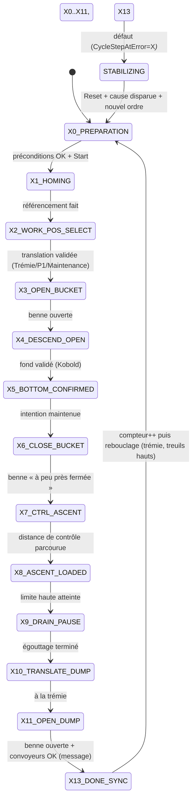

# Analyse Fonctionnelle - Partie 4 : Mode Semi-Auto & Sequenceur (v3.0)

> Role : definir le mode semi-automatique, son sequenceur (grafcet) et les petits cycles reutilisables.
> Les sorties physiques restent hors de ce document.
> 🆕 v3.0 : refonte du sequenceur conforme `GUIDE_SEQUENCEUR_v1.2.md` (§11bis R1-R9), deux
> instances (maintenance + semi-auto), homme-mort fenetre 3 s, tempo max d'etape, `STABILIZING`.
> Conception : `DOC/WFLOW/AUDITS/DESIGN_SEMI_AUTO_CYCLE_v0.1.md`.

## 🧭 Sommaire

1. Principes
2. Petits cycles reutilisables
3. Cycle semi-auto (grafcet)
4. Synchronisation pendant les mouvements
5. Messages et diagnostics
6. TBD

## 🧪 Points de validation

| ID | Intention | Preuve | Type | Réf |
|---|---|---|---|---|
| <nobr><code>TC-P04-001</code></nobr> | Relâchement manche (retour centre) stoppe sans perte d'étape | `StartStop=FALSE`, étape inchangée | `💻 AUTO` | <small>§1</small> |
| <nobr><code>TC-P04-002</code></nobr> | Cycle produit des demandes, zéro sortie physique | Aucune Q/PDO écrite par `FB_Cycle` | `💻 AUTO` | <small>§1</small> |
| <nobr><code>TC-P04-003</code></nobr> | `STABILIZING` fige l'étape (hold sur) | Étape figée, pas de reprise auto | `💻 AUTO` | <small>§3</small> |
| <nobr><code>TC-P04-004</code></nobr> | Reprise après `STABILIZING` : Cause + Reset + nouvel ordre | 3 conditions nécessaires | `💻 AUTO` | <small>§1</small> |
| <nobr><code>TC-P04-005</code></nobr> | Intention maintenue sur Diving/Extraction | Descente/montée bloquées sans manche défléchi | `⚡ SITE+AUTO` | <small>§2</small> |
| <nobr><code>TC-P04-006</code></nobr> | Pas d'asservissement continu de vitesse en synchro | Même commande M1/M2, pas de boucle fermée | `💻 AUTO` | <small>§4</small> |
| <nobr><code>TC-P04-007</code></nobr> | Seuil synchro 1 ➔ arrêt mouvement principal | M1/M2 stoppés, rattrapage dédié | `⚡ SITE+AUTO` | <small>§4</small> |
| <nobr><code>TC-P04-008</code></nobr> | Écart persistant ➔ escalade safety | `SafeStop`/`PowerCutOff` selon contrat | `💻 AUTO` | <small>§4</small> |
| <nobr><code>TC-P04-009</code></nobr> | Tempo max d'étape : défaut seulement si pilotage joystick actif | Pas de défaut au repos (manche centre) | `💻 AUTO` | <small>§3</small> |
| <nobr><code>TC-P04-010</code></nobr> | `CycleStepAtError` mémorise l'étape spécifique au défaut | Étape affichée IHM, pas `E_State` générique | `💻 AUTO` | <small>§3</small> |
| <nobr><code>TC-P04-011</code></nobr> | Deux instances (MAINT + SEMI_AUTO) sans impact croisé | Gating sorties par mode, non-régression MAINT | `💻 AUTO` | <small>§3</small> |
| <nobr><code>TC-P04-012</code></nobr> | Compteur de prélèvements RETAIN, reset MAINT only | Survit à la coupure ; reset utilisateur en MAINT | `💻 AUTO` | <small>§3</small> |

---

## 🧱 1. Principes

| Regle | Exigence |
|---|---|
| 🔄 Programme ST | `FB_Cycle` reste un sequencer ST a machine d'etat, conforme §11bis R1-R9. |
| ✍️ Demandes seulement | Le cycle produit des demandes de mouvement, jamais des sorties physiques. |
| 🕹️ Presence operateur | Tant qu'un mouvement est commande, l'intention maintenue (manche défléchi) est requise. |
| 🛑 Relachement | Relachement manche (retour centre) ⇒ `StartStop=FALSE`, etape conservee, pas de reprise automatique. |
| 🛡️ `STABILIZING` | Un `SafeStop` du domaine concerne place le cycle en hold sur (état d'attente/stabilisation). |
| 🔑 Reprise | Cause disparue + Reset sur front + nouvel ordre explicite. |
| 🧩 Reutilisation | Diving et Extraction sont des briques ST reutilisees en maintenance et en semi-auto. |
| 🕹️ Homme-mort (D2) | Appui = autorisation 3 s ; mouvement continue sans appui ; arrêt au centre du manche. |
| 🏁 Début de graphe | À la TRÉMIE, treuils en position HAUTE — rebouclage sur `X0_PREPARATION`. |

`StartStop=TRUE` signifie permission maintenue de mouvement, pas un go-to position mémorisé.

---

## 🪨 2. Petits cycles reutilisables

Ces briques ne **pas** des modes machine.

### 🌊 `FB_DiveSearch` — Diving / plongée Kobold

- Descend avec intention opérateur maintenue.
- **Sémantique et Séquence de détection Kobold (`M1_M2_KoboldContactFond_DI`)** :
  1. **Prêt à plonger (Hors de l'eau, ex. $\ge +1,0$ m)** : Capteur = `0`.
  2. **Immersion (Contact surface de l'eau, fenêtre $[-0,5\text{ m} ; +0,5\text{ m}]$)** : Front montant $\rightarrow$ Capteur passe à **`1`**.
  3. **Plongée dans l'eau libre** : Capteur retombe à **`0`**.
  4. **Toucher Fond (Arrivée au fond)** : Front montant $\rightarrow$ Capteur passe à **`1`** (détection réelle du fond).
- **Règle de validation du fond** : Le fond est validé si et seulement si l'état `1` (fond) intervient **APRÈS** la confirmation de la séquence complète (départ hors eau `0` $\rightarrow$ immersion `1` $\rightarrow$ eau libre `0`). Un signal `1` direct sans immersion préalable est rejeté comme incohérent.
- **Activation de la mesure (`M1_M2_KoboldMeasureEnable_DQ`)** : Doit être alimentée pendant toute la séquence. Sans activation ou sans front d'immersion validé autour de $0,0$ m, la descente est bloquée en défaut (T82).
- Publie une confirmation de fond valide.
- En anomalie : arrêt sécurisé demandé + diagnostic.

### ⛏️ `FB_ExtractionSequence` — Extraction
- S'active apres confirmation de fond valide, ou attestation manuelle explicite en maintenance.
- Ferme la benne via le domaine Benne.
- Remonte en phase de controle puis en phase nominale.
- En anomalie : hold sur + diagnostic.

Les deux briques consomment une **intention deja arbitree**. Elles ne lisent pas directement plusieurs sources et ne fusionnent pas de commandes.

---

## 🔄 3. Cycle semi-auto (grafcet)

### 3.1 Instance unique du séquenceur

`FB_Cycle` est un FB séquence **générique**, instancié en **une seule instance** dans `PRG_03_Modes_Cycle` :

```text
PRG_03_Modes_Cycle
 ├─ FB_Modes
 └─ instCycleSemiAuto : FB_Cycle   ← actif en SEMI_AUTO
```

- **Rôle en `SEMI_AUTO`** : Pilote le cycle complet de dragage (X0 à X13).
- **Rôle en `MAINTENANCE` (N1/N2)** : Le cycle global n'est pas exécuté. Les opérations de maintenance
  utilisent des **petits cycles unitaires autonomes** (`FB_DiveSearch`, `FB_ExtractionSequence`,
  `FB_Encoder_Homing`) ou le pilotage direct par joystick.
- **Mémorisation d'étape** : L'instance `instCycleSemiAuto` **conserve son état** lors d'un passage
  temporaire en manuel ou maintenance.
- **Retour transparent** : En revenant en `SEMI_AUTO`, l'instance reprend son étape après vérification
  des préconditions de sécurité (si non reprenable → retour `X0_PREPARATION`).
- **Gating de sécurité** : Les commandes vers les actionneurs sont strictement conditionnées par
  `Auth.Mode = SEMI_AUTO`. Aucune écriture croisée.

### 3.2 Enum `E_CycleStep`

```pascal
TYPE E_CycleStep :
(
    X0_PREPARATION      := 0,   (* 🏁 Début de graphe : à la TRÉMIE, treuils en position HAUTE *)
    X1_HOMING           := 1,   (* vitesses lentes pour chercher capteur top + référencement *)
    X2_WORK_POS_SELECT  := 2,   (* sélection cible Trémie/P1/Maintenance + translation validée *)
    X3_OPEN_BUCKET      := 3,   (* ouverture benne (si déjà ouverte → passe vite) *)
    X4_DESCEND_OPEN     := 4,   (* plongée benne ouverte, M1+M2 synchro, Kobold mesure ON *)
    X5_BOTTOM_CONFIRMED := 5,   (* fond validé (FB_DiveSearch) ; arrêt descente *)
    X6_CLOSE_BUCKET     := 6,   (* fermeture benne — tolérance « à peu près fermé » *)
    X7_CTRL_ASCENT      := 7,   (* remontée palier 1 de contrôle *)
    X8_ASCENT_LOADED    := 8,   (* remontée nominale jusqu'à limite haute *)
    X9_DRAIN_PAUSE      := 9,   (* égouttage temporisé — temps affiché IHM *)
    X10_TRANSLATE_DUMP  := 10,  (* translation vers trémie + avertissements IHM *)
    X11_OPEN_DUMP       := 11,  (* ouverture benne = vidage ; montée possible, descente ouvre *)
    X13_DONE_SYNC       := 13,  (* fin de cycle, synchronisation finale (R4) + compteur *)
    STABILIZING         := 14   (* état d'attente/stabilisation (ex-ERROR_HOLD) — pas une erreur *)
);
END_TYPE
```

> 📌 **X12 supprimé** : pas de retour P1 en fin de cycle — on reboucle sur `X0_PREPARATION`
> (trémie, treuils hauts), puis `X1`/`X2` pour aller à la cible.

### 3.3 Graphe linéaire



### 3.4 Détail des étapes

| Étape | Comportement |
|---|---|
| **X0_PREPARATION** | Début de graphe : à la trémie, treuils hauts. Vérif cohérence + Start. |
| **X1_HOMING** | Vitesses lentes pour chercher capteur top + référencement. Si déjà homé → passe vite. |
| **X2_WORK_POS_SELECT** | Cible `SelTarget ∈ {1=Trémie, 3=P1, 4=Maintenance}`. P2(2) rejeté (capteur PV). Translation validée. |
| **X3_OPEN_BUCKET** | Ouverture benne ; si déjà ouverte → passe vite. |
| **X4_DESCEND_OPEN** | Plongée benne ouverte, M1+M2 synchro, Kobold mesure ON. |
| **X5_BOTTOM_CONFIRMED** | Fond validé (FB_DiveSearch) ; arrêt descente ; remontée sécurisée. |
| **X6_CLOSE_BUCKET** | Fermeture benne — tolérance « à peu près fermé » (matière/objet). |
| **X7_CTRL_ASCENT** | Remontée palier 1 de contrôle (2 m). |
| **X8_ASCENT_LOADED** | Remontée nominale jusqu'à limite haute. |
| **X9_DRAIN_PAUSE** | Égouttage temporisé — temps écoulé affiché IHM. |
| **X10_TRANSLATE_DUMP** | Translation vers trémie + avertissements IHM (grille/crible libres). |
| **X11_OPEN_DUMP** | Ouverture benne = vidage. Montée possible ; descente fait ouvrir la benne. Contrôle convoyeurs par message utilisateur. |
| **X13_DONE_SYNC** | Fin de cycle, synchronisation finale (R4) + compteur de prélèvements. |
| **STABILIZING** | État d'attente/stabilisation (défaut). `CycleStepAtError` mémorisé. |

### 3.5 Tempo max d'étape (R5)

- Si on reste trop longtemps à une étape → **défaut** (blocage probable).
- ⚠️ **Ne PAS lancer la tempo max directement** : la lancer **quand on pilote avec le joystick**
  et que ça dure trop longtemps. Si l'utilisateur ne pilote pas (manche au centre), **pas de
  défaut d'étape**.
- Valeur par défaut : `StepMaxTimeout := T#60s`.
- L'erreur **et l'étape** sur laquelle on est tombé en défaut sont **mémorisées et affichées**
  (`CycleStepAtError`, R9).

### 3.6 Compteur de prélèvements (Q3bis)

- `SampleCount : INT` **RETAIN** — survit à la coupure machine.
- **Compte inconditionnellement** (toujours, à chaque `X13_DONE_SYNC`).
- **Reset uniquement en maintenance**, par action utilisateur.

---

## ⚖️ 4. Synchronisation pendant les mouvements

Aucun asservissement continu de vitesse n'est prevu.

| Situation | Comportement |
|---|---|
| 🟢 Nominal | M1 et M2 recoivent la meme commande maintenue. |
| 🟠 Seuil 1 depasse | Arret du mouvement synchronise principal. |
| 🔧 Rattrapage | Phase dediee pour rattraper l'axe en retard. |
| 🟢 Ecart reaccepte | Reprise possible du mouvement synchronise. |
| 🔴 Ecart persistant / arret non confirme | Escalade safety. |

### TBD synchro
- Rattrapage manuel ou automatique sous conditions.
- Seuils, temporisations et axe prioritaire de rattrapage.

---

## 💬 5. Messages et diagnostics

| Famille | Role |
|---|---|
| 🧭 Etat | Etape courante (`CycleStep`), busy/ready/error, diagnostics. |
| 🎮 Action attendue | Ce que l'operateur doit faire maintenant (ex. X10 : grille/crible libres ; X11 : convoyeurs en route). |
| 🚨 Alarme | Portee par `Error` / `ErrorId`, jamais confondue avec un simple etat. |

Le format exact des messages est porte par la Partie 07.

---

## ❓ 6. TBD

- Rattrapage synchro manuel/auto (seuils, tempo, axe prioritaire).
- Détail exact des transitions et conditions complètes d'INIT.
- Seuils Kobold eau/fond et distances de contrôle.
- Cibles de translation et paramètres d'approche.

## 📚 Documents lies

- Partie 02 : architecture et place du sequenceur — `FB_Cycle` est instancie dans `PRG_03_Modes_Cycle` (rang 03), qui reunit modes, autorisations et sequences. Il produit des demandes ; il ne commande aucune sortie.
- Partie 03 : contrats FB et precedence des arrets.
- Partie 05 : modes et droits.
- Partie 10/11/12 : treuils, benne, translation.
- Partie 01 : AU et coupure puissance.
- Conception : `DOC/WFLOW/AUDITS/DESIGN_SEMI_AUTO_CYCLE_v0.1.md`.
