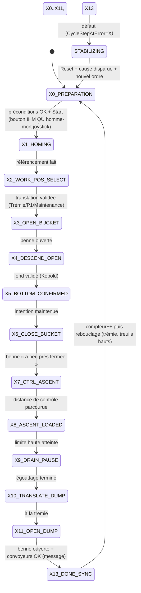

# Analyse Fonctionnelle - Partie 4 : Mode Semi-Auto & Sequenceur (v2.2)

> La tracabilite des versions programme/document est portee par `DOC/VERSION_HISTORY.md`.
> ⚠️ Correction (2026-08-26) : le titre indiquait à tort "(v3.0)" en v2.1 (aucun fichier v3.0
> n'a jamais existé — historique réel v1.4 → v2.0 → v2.1 → v2.2). Corrigé ici.

## 🎯 Rôle et périmètre

- **Rôle** : définir le mode semi-automatique, son séquenceur (grafcet) et les petits cycles
  réutilisables (Diving, Extraction).
- **Périmètre** : logique de séquence, demandes de mouvement produites. Les sorties physiques
  restent hors de ce document (Partie 06/Outputs).
- **Type de composant** : `FB_Cycle` (contrat AF03 : programme Cycle ST, machine d'état de
  séquence) — Transverse (partagé Maintenance + Semi-auto).
- 🆕 Refonte du séquenceur conforme `GUIDE_SEQUENCEUR_v1.2.md` (§11bis R1-R9) : deux instances
  (maintenance + semi-auto), homme-mort fenêtre 3 s, tempo max d'étape, `STABILIZING`.
  Conception : `DOC/WFLOW/AUDITS/DESIGN/DESIGN_SEMI_AUTO_CYCLE_v0.1.md`.

## 📑 Sommaire

1. [🧪 Points de validation](#1--points-de-validation)
2. [🧱 Principes](#2--principes)
3. [🪨 Petits cycles réutilisables](#3--petits-cycles-réutilisables)
4. [🔄 Cycle semi-auto (grafcet)](#4--cycle-semi-auto-grafcet)
5. [⚖️ Synchronisation pendant les mouvements](#5--synchronisation-pendant-les-mouvements)
6. [💬 Messages et diagnostics](#6--messages-et-diagnostics)
7. [📜 Suivi historique](#7--suivi-historique)
8. [❓ TBD](#8--tbd)
9. [📚 Documents liés](#9--documents-liés)

## 🧪 1 · Points de validation

| ID | Intention | Preuve | Type | Réf |
|---|---|---|---|---|
| <nobr><code>TC-P04-001</code></nobr> | Relâchement manche (retour centre) stoppe sans perte d'étape | `StartStop=FALSE`, étape inchangée | `💻 AUTO` | <small>§2</small> |
| <nobr><code>TC-P04-002</code></nobr> | Cycle produit des demandes, zéro sortie physique | Aucune Q/PDO écrite par `FB_Cycle` | `💻 AUTO` | <small>§2</small> |
| <nobr><code>TC-P04-003</code></nobr> | `STABILIZING` fige l'étape (hold sur) | Étape figée, pas de reprise auto | `💻 AUTO` | <small>§4</small> |
| <nobr><code>TC-P04-004</code></nobr> | Reprise après `STABILIZING` : Cause + Reset + nouvel ordre | 3 conditions nécessaires | `💻 AUTO` | <small>§2</small> |
| <nobr><code>TC-P04-005</code></nobr> | Intention maintenue sur Diving/Extraction | Descente/montée bloquées sans manche défléchi | `⚡ SITE+AUTO` | <small>§3</small> |
| <nobr><code>TC-P04-006</code></nobr> | Pas d'asservissement continu de vitesse en synchro | Même commande M1/M2, pas de boucle fermée | `💻 AUTO` | <small>§5</small> |
| <nobr><code>TC-P04-007</code></nobr> | Seuil synchro 1 ➔ arrêt mouvement principal | M1/M2 stoppés, rattrapage dédié | `⚡ SITE+AUTO` | <small>§5</small> |
| <nobr><code>TC-P04-008</code></nobr> | Écart persistant ➔ escalade safety | `SafeStop`/`PowerCutOff` selon contrat | `💻 AUTO` | <small>§5</small> |
| <nobr><code>TC-P04-009</code></nobr> | Tempo max d'étape : défaut seulement si pilotage joystick actif | Pas de défaut au repos (manche centre) | `💻 AUTO` | <small>§4</small> |
| <nobr><code>TC-P04-010</code></nobr> | `CycleStepAtError` mémorise l'étape spécifique au défaut | Étape affichée IHM, pas `E_State` générique | `💻 AUTO` | <small>§4</small> |
| <nobr><code>TC-P04-011</code></nobr> | Deux instances (MAINT + SEMI_AUTO) sans impact croisé | Gating sorties par mode, non-régression MAINT | `💻 AUTO` | <small>§4</small> |
| <nobr><code>TC-P04-012</code></nobr> | Compteur de prélèvements RETAIN, reset MAINT only | Survit à la coupure ; reset utilisateur en MAINT | `💻 AUTO` | <small>§4</small> |

---

## 🧱 2 · Principes

| Regle | Exigence |
|---|---|
| 🔄 Programme ST | `FB_Cycle` reste un sequencer ST a machine d'etat, conforme §11bis R1-R9. |
| ✍️ Demandes seulement | Le cycle produit des demandes de mouvement, jamais des sorties physiques. |
| 🕹️ Presence operateur | Tant qu'un mouvement est commande, l'intention maintenue (manche défléchi) est requise. |
| 🛑 Relachement | Relachement manche (retour centre) ⇒ `StartStop=FALSE`, etape conservee, pas de reprise automatique. |
| 🛡️ `STABILIZING` | Un `SafeStop` du domaine concerne place le cycle en hold sur (état d'attente/stabilisation). |
| 🔑 Reprise | Cause disparue + Reset sur front + nouvel ordre explicite. |
| 🧩 Reutilisation | Diving et Extraction sont des briques ST reutilisees en maintenance et en semi-auto. |
| 🕹️ Homme-mort (D2) | Appui = autorisation 3 s ; mouvement continue sans appui ; arrêt au centre du manche. |
| 🏁 Début de graphe | À la TRÉMIE, treuils en position HAUTE — rebouclage sur `X0_PREPARATION`. |

`StartStop=TRUE` signifie permission maintenue de mouvement, pas un go-to position mémorisé.

---

## 🪨 3 · Petits cycles réutilisables

Ces briques ne **pas** des modes machine.

### 🌊 `FB_DiveSearch` — Diving / plongée Kobold

- Descend avec intention opérateur maintenue.
- **Sémantique et Séquence de détection Kobold (`M1_M2_KoboldBottomTouch_DI`)** :
  1. **Prêt à plonger (Hors de l'eau, ex. $\ge +1,0$ m)** : Capteur = `0`.
  2. **Immersion (Contact surface de l'eau, fenêtre $[-0,5\text{ m} ; +0,5\text{ m}]$)** : Front montant $\rightarrow$ Capteur passe à **`1`**.
  3. **Plongée dans l'eau libre** : Capteur retombe à **`0`**.
  4. **Toucher Fond (Arrivée au fond)** : Front montant $\rightarrow$ Capteur passe à **`1`** (détection réelle du fond).
- **Règle de validation du fond** : Le fond est validé si et seulement si l'état `1` (fond) intervient **APRÈS** la confirmation de la séquence complète (départ hors eau `0` $\rightarrow$ immersion `1` $\rightarrow$ eau libre `0`). Un signal `1` direct sans immersion préalable est rejeté comme incohérent.
- **Activation de la mesure (`M1_M2_KoboldMeasureEnable_DQ`)** : Doit être alimentée pendant toute la séquence. Sans activation ou sans front d'immersion validé autour de $0,0$ m, la descente est bloquée en défaut (T82).
- Publie une confirmation de fond valide.
- En anomalie : arrêt sécurisé demandé + diagnostic.

### ⛏️ `FB_ExtractionSequence` — Extraction

- S'active apres confirmation de fond valide, ou attestation manuelle explicite en maintenance.
- Ferme la benne via le domaine Benne.
- Remonte en phase de controle puis en phase nominale.
- En anomalie : hold sur + diagnostic.

Les deux briques consomment une **intention deja arbitree**. Elles ne lisent pas directement plusieurs sources et ne fusionnent pas de commandes.

---

## 🔄 4 · Cycle semi-auto (grafcet)

### 4.1 Instance unique du séquenceur

`FB_Cycle` est un FB séquence **générique**, instancié en **une seule instance** dans `PRG_03_Modes_Cycle` :

```text
PRG_03_Modes_Cycle
 ├─ FB_Modes
 └─ instCycleSemiAuto : FB_Cycle   ← actif en SEMI_AUTO
```

- **Rôle en `SEMI_AUTO`** : Pilote le cycle complet de dragage (X0 à X13).
- **Rôle en `MAINTENANCE` (N1/N2)** : Le cycle global n'est pas exécuté. Les opérations de maintenance
  utilisent des **petits cycles unitaires autonomes** (`FB_DiveSearch`, `FB_ExtractionSequence`,
  `FB_Encoder_Homing`) ou le pilotage direct par joystick.
- **Mémorisation d'étape** : L'instance `instCycleSemiAuto` **conserve son état** lors d'un passage
  temporaire en manuel ou maintenance.
- **Retour transparent** : En revenant en `SEMI_AUTO`, l'instance reprend son étape après vérification
  des préconditions de sécurité (si non reprenable → retour `X0_PREPARATION`).
- **Gating de sécurité** : Les commandes vers les actionneurs sont strictement conditionnées par
  `Auth.Mode = SEMI_AUTO`. Aucune écriture croisée.

### 4.2 Enum `E_CycleStep`

```pascal
TYPE E_CycleStep :
(
    X0_PREPARATION      := 0,   (* 🏁 Début de graphe : à la TRÉMIE, treuils en position HAUTE *)
    X1_HOMING           := 1,   (* vitesses lentes pour chercher capteur top + référencement *)
    X2_WORK_POS_SELECT  := 2,   (* sélection cible Trémie/P1/Maintenance + translation validée *)
    X3_OPEN_BUCKET      := 3,   (* ouverture benne (si déjà ouverte → passe vite) *)
    X4_DESCEND_OPEN     := 4,   (* plongée benne ouverte, M1+M2 synchro, Kobold mesure ON *)
    X5_BOTTOM_CONFIRMED := 5,   (* fond validé (FB_DiveSearch) ; arrêt descente *)
    X6_CLOSE_BUCKET     := 6,   (* fermeture benne — tolérance « à peu près fermé » *)
    X7_CTRL_ASCENT      := 7,   (* remontée palier 1 de contrôle *)
    X8_ASCENT_LOADED    := 8,   (* remontée nominale jusqu'à limite haute *)
    X9_DRAIN_PAUSE      := 9,   (* égouttage temporisé — temps affiché IHM *)
    X10_TRANSLATE_DUMP  := 10,  (* translation vers trémie + avertissements IHM *)
    X11_OPEN_DUMP       := 11,  (* ouverture benne = vidage ; montée possible, descente ouvre *)
    X13_DONE_SYNC       := 13,  (* fin de cycle, synchronisation finale (R4) + compteur *)
    STABILIZING         := 14   (* état d'attente/stabilisation (ex-ERROR_HOLD) — pas une erreur *)
);
END_TYPE
```

> 📌 **X12 supprimé** : pas de retour P1 en fin de cycle — on reboucle sur `X0_PREPARATION`
> (trémie, treuils hauts), puis `X1`/`X2` pour aller à la cible.

### 4.3 Graphe linéaire



### 4.4 Détail des étapes

| Étape | Comportement |
|---|---|
| **X0_PREPARATION** | Début de graphe : à la trémie, treuils hauts. Vérif cohérence + Start (bouton IHM `BtnStart` **OU** armement homme-mort joystick). |
| **X1_HOMING** | Vitesses lentes pour chercher capteur top + référencement. Si déjà homé → passe vite. |
| **X2_WORK_POS_SELECT** | Cible `SelTarget ∈ {1=Trémie, 3=P1, 4=Maintenance}`. P2(2) rejeté (capteur PV). Translation validée. |
| **X3_OPEN_BUCKET** | Ouverture benne ; si déjà ouverte → passe vite. |
| **X4_DESCEND_OPEN** | Plongée benne ouverte, M1+M2 synchro, Kobold mesure ON. |
| **X5_BOTTOM_CONFIRMED** | Fond validé (FB_DiveSearch) ; arrêt descente ; remontée sécurisée. |
| **X6_CLOSE_BUCKET** | Fermeture benne — tolérance « à peu près fermé » (matière/objet). |
| **X7_CTRL_ASCENT** | Remontée palier 1 de contrôle (2 m). |
| **X8_ASCENT_LOADED** | Remontée nominale jusqu'à limite haute. |
| **X9_DRAIN_PAUSE** | Égouttage temporisé — temps écoulé affiché IHM. |
| **X10_TRANSLATE_DUMP** | Translation vers trémie + avertissements IHM (grille/crible libres). |
| **X11_OPEN_DUMP** | Ouverture benne = vidage. Montée possible ; descente fait ouvrir la benne. Contrôle convoyeurs par message utilisateur. |
| **X13_DONE_SYNC** | Fin de cycle, synchronisation finale (R4) + compteur de prélèvements. |
| **STABILIZING** | État d'attente/stabilisation (défaut). `CycleStepAtError` mémorisé. |

### 4.5 Tempo max d'étape (R5)

- Si on reste trop longtemps à une étape → **défaut** (blocage probable).
- ⚠️ **Ne PAS lancer la tempo max directement** : la lancer **gatée par l'entrée `CycleMotionPermit`**
  (`BOOL`, "manche défléchi, non centre") — `StepMaxTimer(IN := CycleMotionPermit AND ...)`. Si
  l'utilisateur ne pilote pas (`CycleMotionPermit=FALSE`, manche au centre), **pas de défaut
  d'étape**.
- Valeur par défaut : `StepMaxTimeout := T#60s`.
- L'erreur **et l'étape** sur laquelle on est tombé en défaut sont **mémorisées et affichées**
  (`CycleStepAtError`, R9).

### 4.6 Compteur de prélèvements (Q3bis)

- `SampleCount : INT` **RETAIN** — survit à la coupure machine.
- **Compte inconditionnellement** (toujours, à chaque `X13_DONE_SYNC`).
- **Reset uniquement en maintenance**, par action utilisateur.

---

## ⚖️ 5 · Synchronisation pendant les mouvements

Aucun asservissement continu de vitesse n'est prevu. Trois mécanismes concrets et **déjà codés**
coexistent (revue 2026-08-26, vérifiés contre le code — ne pas les confondre) :

| Mécanisme | Portée | Seuils réels |
|---|---|---|
| Écart de position continu (`FB_SyncDeviation`/`FB_WinchSync`) | Tout mouvement M1/M2 synchronisé | `CfgSyncToleranceM=0.10m` (Warn) / `CfgSyncCriticalToleranceM=0.50m` (Fault) |
| Contrôle de remontée lente (`FB_Cycle`, **X7_CTRL_ASCENT uniquement**) | Étape X7 seulement | `CtrlAscentToleranceM=0.25m` sur `CtrlAscentDistM=2.0m` ; `CtrlAscentTimeout=T#30s` si la tolérance n'est jamais confirmée |
| Écart de vitesse (`FB_Cycle`, X7 uniquement) | Étape X7 seulement | `SpeedMismatchThresholdMps` (config externe, `0` = contrôle désactivé) |

| Situation | Comportement |
|---|---|
| 🟢 Nominal | M1 et M2 recoivent la meme commande maintenue. |
| 🟠 Seuil Warn dépassé (`CfgSyncToleranceM`) | Alerte — **pas d'arrêt automatique** trouvé dans le code pour ce seuil seul. |
| 🔴 Seuil Fault dépassé (`CfgSyncCriticalToleranceM`) ou timeout X7 | Arrêt du mouvement synchronisé / `WinchSyncError` ; escalade safety si non résolu. |

⚠️ **Écart avec la version précédente de ce document** : l'ancienne table affirmait une "phase
de rattrapage dédiée" — **non trouvée dans le code** (`FB_Cycle.st`, `FB_WinchSync.st`,
`FB_SyncDeviation.st` : aucune machine d'état de rattrapage, seulement détection + seuils). Le
TBD ci-dessous est donc restreint à ce qui est réellement encore ouvert.

### TBD synchro

- **Manœuvre de rattrapage** (catch-up) : aucune machine d'état dédiée n'existe aujourd'hui pour
  ramener l'axe en retard — à concevoir si le besoin est confirmé.
- **Axe prioritaire de rattrapage** en cas de future manœuvre de rattrapage.
- Les seuils/tempos eux-mêmes (`CfgSyncToleranceM`, `CfgSyncCriticalToleranceM`,
  `CtrlAscentToleranceM/DistM/Timeout`, `SpeedMismatchThresholdMps`) sont **déjà codés et
  documentés ci-dessus** — ne pas les remettre en TBD.

---

## 💬 6 · Messages et diagnostics

| Famille | Role |
|---|---|
| 🧭 Etat | Etape courante (`CycleStep`), busy/ready/error, diagnostics. |
| 🎮 Action attendue | Ce que l'operateur doit faire maintenant (ex. X10 : grille/crible libres ; X11 : convoyeurs en route). |
| 🚨 Alarme | Portee par `Error` / `ErrorId`, jamais confondue avec un simple etat. |

Le format exact des messages est porte par la Partie 07.

---

## 📜 7 · Suivi historique

| Version | Date | Changement |
|---|---|---|
| v2.2 (fix) | 2026-08-26 | Revue de cohérence croisée AF-01→14 (sous-agent) : nom de signal `M1_M2_KoboldContactFond_DI` (périmé) corrigé en `M1_M2_KoboldBottomTouch_DI` (déjà corrigé côté AF-06 le même jour, pas répercuté ici) — §3 et TBD |
| v2.2 | 2026-08-26 | Mise en conformite `GUIDE_EDITION_AF_v1.0` : correction du titre (indiquait à tort "v3.0", jamais de fichier v3.0 réel), Sommaire lié, section `🎯 Rôle et périmètre` explicite, Suivi historique ajouté, renumérotation complète (chapô + sous-sections `4.1`-`4.6` + réfs `§N` cascadées). Correctifs de fond (review sous-agent expert automatisme, vérifiés contre `FB_Cycle.st`/`FB_WinchSync.st`/`FB_SyncDeviation.st`/`FB_DiveSearch.st`) : §4.5 nomme désormais l'entrée réelle `CycleMotionPermit` ; §5 entièrement réécrite — l'ancienne « phase de rattrapage dédiée » n'existe pas dans le code (seulement détection de seuils), les 3 mécanismes réels (écart position continu, contrôle X7_CTRL_ASCENT, écart vitesse X7) et leurs seuils codés sont désormais nommés, le TBD restreint à ce qui est réellement ouvert (manœuvre de rattrapage, axe prioritaire) ; ajout TBD timeout Kobold (`FB_DiveSearch` n'a aucun timer, attente indéfinie si le front d'immersion n'arrive jamais) |
| v2.1 | — | Version precedente (voir `ARCHIVES/Doc/`) — refonte séquenceur `GUIDE_SEQUENCEUR_v1.2.md` |

## ❓ 8 · TBD

- Manœuvre de rattrapage synchro (catch-up) et axe prioritaire — voir §5 (seuils/tempos déjà codés, ne pas les rouvrir).
- Détail exact des transitions et conditions complètes d'INIT.
- Seuils Kobold eau/fond et distances de contrôle.
- Cibles de translation et paramètres d'approche.
- **Timeout séquence Kobold** (revue 2026-08-26) : `FB_DiveSearch.st` ne porte aucun `TON`/timer —
  si le front d'immersion (capteur `M1_M2_KoboldBottomTouch_DI`) n'arrive jamais, le FB attend
  indéfiniment (défaut uniquement par violation de séquence, jamais par expiration de temps).
  À trancher : timeout explicite à ajouter, ou attente indéfinie réellement voulue (couvert par
  ailleurs par le tempo max d'étape générique §4.5 si `CycleMotionPermit=TRUE`) ?

## 📚 9 · Documents liés

- Partie 02 : architecture et place du sequenceur — `FB_Cycle` est instancie dans `PRG_03_Modes_Cycle` (rang 03), qui reunit modes, autorisations et sequences. Il produit des demandes ; il ne commande aucune sortie.
- Partie 03 : contrats FB et precedence des arrets.
- Partie 05 : modes et droits.
- Partie 10/11/12 : treuils, benne, translation.
- Partie 01 : AU et coupure puissance.
- Conception : `DOC/WFLOW/AUDITS/DESIGN/DESIGN_SEMI_AUTO_CYCLE_v0.1.md`.
