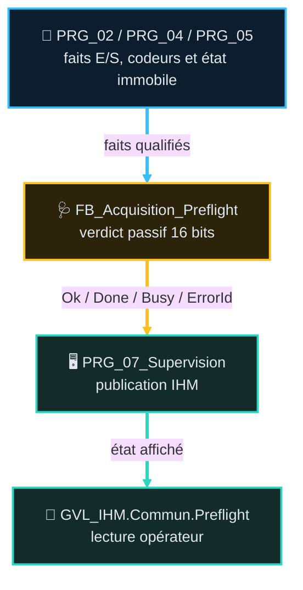

# Fiche `FB_Acquisition_Preflight` — v1.3

## 🎯 Rôle et périmètre

- **Rôle** : établir, machine immobile, un verdict IHM de cohérence sur 16 conditions E/S.
- **Périmètre strict** : lecture seule, diagnostic et publication IHM ; aucune commande, aucun `SafeStop`, aucun `PowerCutOff` et aucune autorisation de mouvement.
- **Type de composant** : observateur métier non-mouvement, exécuté par `PRG_07_Supervision`.

## 📑 Sommaire

1. [🎯 Table des fonctions](#-1--table-des-fonctions)
2. [🧪 Points de validation](#-2--points-de-validation)
3. [🔄 Pipeline et intégration](#-3--pipeline-et-intégration)
4. [🔌 Interface publique](#-4--interface-publique)
5. [⚙️ Verdict et masque défaut](#-5--verdict-et-masque-défaut)
6. [🖥️ IHM, configuration et dépannage](#️-6--ihm-configuration-et-dépannage)
7. [📜 Suivi historique](#-7--suivi-historique)
8. [❓ TBD](#-8--tbd)

## 🎯 1 · Table des fonctions

> **État** — `V` validé, implémentation non vérifiée · `V-I` validé et implémenté · `NV` non validé, non implémenté · `NV-I` code présent mais non validé · `R` refusé · `NA` non applicable.

| ID | Fonction | Description | Réalisée par | Criticité | TC couvrants | Statut | Etat |
|---|---|---|---|---|---|---|---|
| `F06.01` | Établir un verdict préflight passif | Sur front `Execute` (demande IHM `GVL_IHM.Commun.Preflight.BtnRun`) uniquement, attend l'immobilité machine, agrège 16 contrôles et publie `PreflightOk`, `PreflightDone`, `PreflightBusy`, `PreflightErrorId`. Aucun verdict automatique au démarrage automate. | `FB_Acquisition_Preflight` + `PRG_07_Supervision` | 🔵 C2 | <nobr><code>TC-P06-007</code></nobr> | ✅ code lu | `NV-I` |

## 🧪 2 · Points de validation

> **État** — `V` validé, implémentation non vérifiée · `V-I` validé et implémenté · `NV` non validé, non implémenté · `NV-I` code présent mais non validé · `R` refusé · `NA` non applicable.

<table style="width: 100%; table-layout: fixed; border-collapse: collapse; font-size: 14px;">
  <colgroup>
    <col style="width: 140px;">
    <col style="width: 150px;">
    <col style="width: calc(100% - 590px);">
    <col style="width: 110px;">
    <col style="width: 140px;">
    <col style="width: 50px;">
  </colgroup>
  <thead>
    <tr style="border-bottom: 2px solid #475569; text-align: left;">
      <th style="padding: 4px 1px; text-align: center;"><small><b>ID Unique</b></small></th>
      <th style="padding: 4px 1px; text-align: center;"><small>Groupe</small></th>
      <th style="padding: 4px 8px;">Comportement attendu</th>
      <th style="padding: 4px 1px; text-align: center;"><small>Type</small></th>
      <th style="padding: 4px 1px; text-align: center;"><small>Réf FB</small></th>
      <th style="padding: 4px 1px; text-align: center;"><small>Etat</small></th>
    </tr>
  </thead>
  <tbody>
    <tr style="border-bottom: 1px solid rgba(255,255,255,0.08);">
      <td style="padding: 4px 1px; text-align: center; vertical-align: middle;">TC-P06-007</td>
      <td style="padding: 4px 1px; text-align: center; vertical-align: middle;"><small><b>Preflight passif</b></small></td>
      <td style="padding: 6px 8px; line-height: 1.55;">Sans front <code>Execute</code>, <code>PreflightDone</code> reste <code>FALSE</code> (aucun verdict au démarrage). Sur front <code>Execute</code>, tant que la machine n'est pas immobile : <code>PreflightBusy=TRUE</code> et aucun verdict final. Une fois immobile, les 16 bits sont agrégés et <code>PreflightOk=(PreflightErrorId=0)</code>.</td>
      <td style="padding: 4px 1px; text-align: center; vertical-align: middle;"><small><code>💻 AUTO_PLC</code></small></td>
      <td style="padding: 4px 1px; text-align: center; vertical-align: middle;"><small><code>FB_Acquisition_Preflight</code> <code>PRG_07_Supervision</code></small></td>
      <td style="padding: 4px 1px; text-align: center; vertical-align: middle;"><small><code>NV-I</code></small></td>
    </tr>
  </tbody>
</table>

## 🔄 3 · Pipeline et intégration

`PRG_07_Supervision` appelle l'unique instance `instPreflight`. Il construit `MachineIsStill` à partir des états M1, M2 et M3, puis recopie les quatre sorties dans `GVL_IHM.Commun.Preflight`. Le FB ne lit ni n'écrit de GVL : ses interfaces restent explicites.

## 🔌 4 · Interface publique

### Entrées (`VAR_INPUT`)

| Famille | Données | Rôle |
|---|---|---|
| Déclenchement | `Execute`, `MachineIsStill` | Demande de verdict et garde d'immobilité. |
| Freins/contacteurs | `M1/M2/M3BrakeApplied`, `M1/M2ContactorsReleased` | Machine mécaniquement au repos. |
| Énergie et chaîne AU | `M1/M2ThermalOk`, `BrakeThermalOk`, `PhaseRotationOk`, `EmergencyChainClosed`, `PowerContactorEngaged` | Cohérence alimentation et protections. |
| Capteurs/codeurs | `SlackCableTensioned`, `M3SensorWordIncoherent`, `EncoderM1/M2Operational`, `HomedM1/M2`, `M1/M2PositionInBounds` | Cohérence position et acquisition. |

### Sorties (`VAR_OUTPUT`)

| Nom | Type | Rôle |
|---|---|---|
| `PreflightOk` | `BOOL` | Vrai seulement si aucun bit défaut n'est posé. |
| `PreflightDone` | `BOOL` | Verdict final disponible. |
| `PreflightBusy` | `BOOL` | Demande en attente d'une machine immobile. |
| `PreflightErrorId` | `WORD` | Masque diagnostic des 16 contrôles. |

## ⚙️ 5 · Verdict et masque défaut

Chaque front montant `Execute` (déclenché par l'opérateur depuis l'IHM, `GVL_IHM.Commun.Preflight.BtnRun`) génère une demande de verdict. Sans front `Execute`, aucune demande n'est créée : `PreflightDone` reste `FALSE`. Une demande reste mémorisée tant que `MachineIsStill=FALSE` ; le FB met alors `PreflightBusy=TRUE` et ne publie pas de nouveau verdict. Dès l'immobilité confirmée, il reconstruit `PreflightErrorId`, puis publie `PreflightOk`, `PreflightDone` et remet la demande à zéro.

| Bits | Contrôle |
|---|---|
| 0–2 | Freins M1/M2/M3 appliqués |
| 3–4 | Contacteurs M1/M2 relâchés |
| 5–8 | Thermiques M1/M2/frein et ordre des phases |
| 9–11 | Câble M2 tendu, cohérence M3, contacteur sans chaîne AU |
| 12–15 | Codeurs M1/M2 opérationnels, homing et position dans les bornes |

## 🖥️ 6 · IHM, configuration et dépannage

`GVL_IHM.Commun.Preflight` expose `BtnRun`, `PreflightOk`, `PreflightDone`, `PreflightBusy` et `PreflightErrorId`. Il n'existe ni configuration persistante, ni bypass. Une erreur preflight est informative : elle n'arrête pas la machine et n'autorise pas un mouvement.

## 📜 7 · Suivi historique

- **v1.3 (2026-08-26)** : décision actée — le verdict préflight n'est plus déclenché automatiquement au démarrage automate (`BootPending` retiré du code) ; il ne se produit que sur demande explicite opérateur via l'IHM (front `Execute`, déjà câblé sur `GVL_IHM.Commun.Preflight.BtnRun` depuis `PRG_07_Supervision`, non modifié). Contrat : `TASK_CONTRACT_PREFLIGHT_DECLENCHEMENT_IHM.yaml`.
- **v1.2 (2026-08-26)** : mise en conformité AF ; ajout F06.01, TC-P06-007, pipeline et état de décision/implémentation. Le retour M3 existant mais non câblé au Preflight est tracé.
- **v1.1** : version précédente (voir `ARCHIVES/Doc/`).

## ❓ 8 · TBD

- `PRG_02_Acquisition.HwIn.Translation.M3_BrakeIsOpen_DI` existe (retour M3, `TRUE` = ouvert), mais `PRG_07_Supervision` ne le transmet pas au Preflight et force `M3BrakeApplied := TRUE`. Décider de câbler `M3BrakeApplied := NOT M3_BrakeIsOpen_DI`, ou d'accepter explicitement cette exclusion du contrôle préflight M3.

## 📚 Documents liés

- [AF-06](../AF_Partie-06_Acquisition_Qualification_IO_v2.4.md) — acquisition et qualification E/S.
- [AF-02](../AF_Partie-02_Architecture_Programme_v3.2.md) — ordre des programmes et flux.
- [AF-14](../AF_Partie-14_Fonction_Troubleshooting_v1.3.md) — dépannage et supervision.
