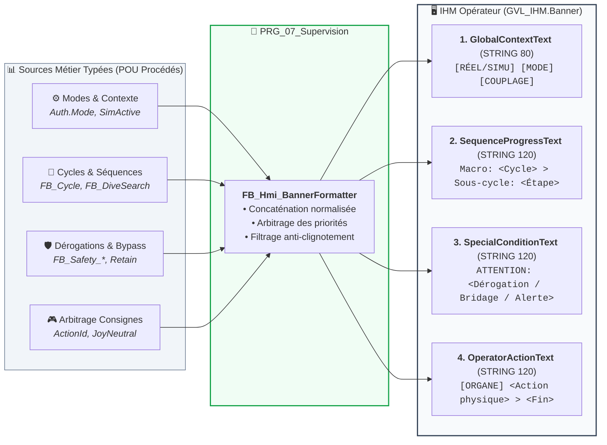

# Analyse Fonctionnelle - Partie 7 : Interface IHM (v2.2)

> La tracabilite des versions programme/document est portee par `DOC/VERSION_HISTORY.md`.

## 🎯 Rôle et périmètre

- **Rôle** : définir le contrat structurel PLC ↔ IHM.
- **Périmètre** : frontière `GVL_IHM`, structures par domaine (`Cmd`/`State`/`Cfg`/`Bypass`/`Test`),
  bandeau d'information et d'alarme, troubleshooting. Le détail des champs vit dans le code
  `CODE/J_SUPERVISION/_TYPES/`, pas listé ici.
- **Type de composant** : `FB_Hmi_BannerFormatter` (contrat AF03, instance `PRG_07_Supervision`) —
  Transverse.

## 📑 Sommaire

1. [🧪 Points de validation](#1--points-de-validation)
2. [🎯 Principe](#2--principe)
3. [🌐 Frontière `GVL_IHM`](#3--frontière-gvl_ihm)
4. [🧱 Structures par domaine](#4--structures-par-domaine)
5. [💬 Bandeau d'information et messages opérateur](#5--bandeau-dinformation-et-messages-opérateur)
6. [🚨 Bandeau d'alarme défilant](#6--bandeau-dalarme-défilant)
7. [🔎 Troubleshooting](#7--troubleshooting)
8. [📜 Suivi historique](#8--suivi-historique)
9. [❓ TBD](#9--tbd)
10. [📚 Documents liés](#10--documents-liés)

## 🧪 1 · Points de validation

| ID | Intention | Preuve | Type | Réf |
|---|---|---|---|---|
| <nobr><code>TC-P07-001</code></nobr> | IHM et PLC partagent les mêmes DUTs | Aucun miroir parallèle de variables | `💻 AUTO` | <small>§2</small> |
| <nobr><code>TC-P07-002</code></nobr> | Structures `Cmd/State/Cfg` par domaine | Convention respectée dans `GVL_IHM` | `💻 AUTO` | <small>§4</small> |
| <nobr><code>TC-P07-003</code></nobr> | IHM limitée aux variables de `GVL_IHM` | Zéro accès direct aux internes des FB | `💻 AUTO` | <small>§2</small> |
| <nobr><code>TC-P07-004</code></nobr> | Producteur unique par champ `State` | Un seul écrivain PLC par variable d'état | `💻 AUTO` | <small>§2</small> |
| <nobr><code>TC-P07-005</code></nobr> | Page Troubleshooting en lecture seule | Zéro écriture de commande/config/bypass | `💻 AUTO` | <small>§7</small> |
| <nobr><code>TC-P07-006</code></nobr> | Séparation messages action vs état | 2 familles distinctes, alarmes sur `ErrorId` | `⚡ SITE+AUTO` | <small>§5</small> |
| <nobr><code>TC-P07-007</code></nobr> | Warning auto-effaçable vs Fault sur Reset | Warning s'efface seul, Fault exige `Ack` | `⚡ SITE+AUTO` | <small>§5</small> |
| <nobr><code>TC-P07-008</code></nobr> | Carrousel d'alarmes un message à la fois, index n/N | `Banner.AlarmBanner.Index/Count` cohérents | `💻 AUTO` | <small>§6</small> |
| <nobr><code>TC-P07-009</code></nobr> | Aucun défaut actif → bandeau d'alarme vide | `HasAlarm=FALSE`, `Text=''`, `Index=0`, `Count=0` | `💻 AUTO` | <small>§6</small> |

---

## 🎯 2 · Principe

L'IHM et le PLC partagent les **memes structures**.

| Regle | Exigence |
|---|---|
| 🧱 Frontiere unique | `GVL_IHM` est le point d'echange IHM. |
| 🧩 Meme DUT | Producteur PLC et ecran utilisent la meme structure. |
| 🔒 Pas d'internes | L'IHM ne lit ni n'ecrit les variables internes des FB. |
| ✍️ Producteur unique | Chaque champ `State` a un seul ecrivain PLC. |
| 🎮 Commandes maintenues ou fronts | Les impulsions sont consommees sur front ; les maintenues gardent leur semantique. |

Pas de liste exhaustive de variables dans ce document.

---

## 🌐 3 · Frontière `GVL_IHM`

Domaines exposes a minima :

| Domaine | Structure |
|---|---|
| 🪝 Treuil M1 | `M1TreuilRetenue : ST_WinchHMI` |
| 🪝 Treuil M2 / Benne | `M2TreuilBenne : ST_WinchHMI` |
| ⚖️ Synchro | `M1M2Sync : ST_SyncHMI` |
| 🕹️ Joystick | `JOY1Joystick : ST_JoystickHMI` |
| 🎚️ Modes | `Modes : ST_ModesHMI` |
| ↔️ Translation | `TranslationM3 : ST_TranslationHMI` |
| 🔄 Cycle | `Cycle : ST_CycleHMI` |
| 🪨 Assistants | `DredgingAssist : ST_DredgingAssistHMI` |
| 📡 Reseau | `Network : ST_NetworkDiagHMI` |
| 🌐 Commun | `Commun : ST_CommunHMI` |

La reference des champs est le code actif des DUT.

---

## 🧱 4 · Structures par domaine

Convention cible :

```text
Cmd    → IHM → PLC
State  → PLC → IHM
Cfg    → reglage borne / persiste
Bypass → maintenance consciente, si justifie
Test   → banc seulement, si justifie
Safety → diagnostics safety publies, si separes
```

| Sous-structure | Role |
|---|---|
| 🎮 `Cmd` | Demandes operateur. |
| 🚦 `State` | Etats, mesures, diagnostics produits par le domaine. |
| 🔧 `Cfg` | Reglages. Bornage PLC obligatoire. |
| 🛠️ `Bypass` | Degradations de maintenance visibles. |
| 🧪 `Test` | Stimuli de banc, jamais en production. |

Le mapping, la persistance et d'eventuels agregats restent **TBD**. Ils ne justifient pas automatiquement un programme CFC.

---

## 💬 5 · Bandeau d'information et messages opérateur

Pour éviter toute ambiguïté de conduite et assister l'opérateur en temps réel (en exploitation comme en simulation/maintenance), l'IHM dispose d'un bandeau structuré en **4 champs de texte dédiés** à responsabilités disjointes :



### 📋 5.1 Responsabilités des 4 champs

| # | Champ | Rôle / Responsabilité unique | Format / Grammaire | Exemples d'affichage |
|---|---|---|---|---|
| **1** | **`GlobalContextText`** *(Macro)* | Contexte d'exécution, mode de marche actif et sélection axes. | `[Contexte] [Mode] [Axes]` | • `[RÉEL] [SEMI-AUTO] [M1+M2 SYNCHRO]`<br>• `[SIMULATION] [MAINT_N2] [TREUIL M2 SEUL]` |
| **2** | **`SequenceProgressText`** *(Micro)* | Étape courante du cycle maître **ET** de la sous-séquence active (Kobold, arrachage, homing). | `Macro: <Étape> > Sous-cycle: <Sous-étape>` | • `Cycle: DESCENTE > Kobold: 02_IMMERSION_SURFACE`<br>• `Homing: M1_RECHERCHE_INDEX_HAUT` |
| **3** | **`SpecialConditionText`** *(Dérogations)* | Régimes dérogatoires de maintenance, sécurités neutralisées, bridages actifs (*vide si nominal*). | `ATTENTION: <Type> : <Détail>` ou `INFO: <Type> : <Détail>` | • `ATTENTION: DÉROGATION : Butées logicielles M2 inactives`<br>• `INFO: BRIDAGE : Palier 1 forcé (Désynchronisme 0.4m)` |
| **4** | **`OperatorActionText`** *(Action)* | Consigne d'action physique attendue immédiatement du conducteur. | `[Organe] <Verbe d'action> > <Condition de fin>` | • `[JOYSTICK] Pousser Y- (Descente) > Attendre contact fond`<br>• `[PUPITRE] Appuyer sur Bouton HOMING M2` |

### 🧩 5.2 Principes de génération & Typage fort

- **Pas de manipulation de texte dans les FB procédé** : Les FB métier (`FB_Cycle`, `FB_DiveSearch`, `FB_Safety_Winch`, etc.) publient exclusivement des états typés (`E_CycleStep`, `E_DiveSearchState`, `ActionId : WORD`, flags booléens de bypass).
- **Arbitre central dans `PRG_07_Supervision`** : Le POU `PRG_07_Supervision` instancie un formateur dédié (`FB_Hmi_BannerFormatter`) qui assemble les 4 champs selon les priorités machine et met à jour `GVL_IHM.Banner`.
- **Séparation stricte avec les alarmes** : Les alarmes et pannes restent publiées dans `Error`/`ErrorId` et traitées par le gestionnaire d'alarmes / journal de supervision IHM. Le bandeau d'information ne remplace pas le journal d'alarmes.

### 🧊 5.3 Stratégie anti-clignotement (décision 2026-08-17)

Le bandeau est recalculé à chaque scan (10 ms). Un signal qui oscille (ex. `SafeStopActive` qui
passe ON/OFF en boucle, warning transitoire) ferait **clignoter** le texte → illisible pour
l'opérateur. Stratégie **hybride** :

| Type de message | Traitement | Rythme |
|---|---|---|
| **Défaut** (latché + acquitté) | Affiché **immédiatement**, pas de délai | scan |
| **Warning / état** (peut disparaître) | **Maintien min** avant changement (TON ~500 ms) | anti-clignotement |

- **Champs concernés** : `OperatorActionText` et `SpecialConditionText` (les plus sujets à
  oscillation). `GlobalContextText`/`SequenceProgressText` changent moins souvent → pas de maintien.
- **Principe** : un message warning/état est **maintenu un temps minimum** (500 ms) avant de
  laisser le texte changer. Un signal qui oscille plus vite que 500 ms → texte stable. Un vrai
  changement → s'affiche après 500 ms max (acceptable pour un warning, jamais pour un défaut).
- **Défauts** : passent en direct (pas de maintien) — un défaut AU/puissance doit être visible
  immédiatement, sans latence.
- **Interlock `DirectionBlocked`** (décision revue 2026-08-17) : un mouvement **demandé** mais
  **bloqué** (permit absent) est traité comme un **défaut critique** → affiché **immédiatement**
  (pas de maintien). Justification : c'est une cause de **blocage de mouvement sécurité**, pas un
  simple état transitoire ; l'opérateur qui pousse un axe interdit doit comprendre tout de suite
  pourquoi la machine ne bouge pas. Le `DirectionBlocked` alimente donc `CriticalActionActive`
  au même titre que AU/puissance/SafeStop.
- **Implémentation** : le lissage est délégué au FB utilitaire **`FB_AntiFlickerText`** (un par
  champ anti-clignoté), qui prend `NewText` + `ForceInstant` (TRUE = direct) + `HoldTime`.
  `FB_Hmi_BannerFormatter` en instancie deux : `AntiFlickSpecial` (jamais critique) et
  `AntiFlickOperator` (`ForceInstant := CriticalActionActive`).
- **Seuil** : 500 ms par défaut (`CST_BannerHoldTime`), à calibrer sur site (REX terrain).

---

## 🚨 6 · Bandeau d'alarme défilant

> ⛔ **Section manquante ajoutée** (trouvé 2026-08-26, mise en conformité) : `TC-P07-008`/`009`
> référençaient `§4bis` depuis la création de ces TC, mais aucun contenu §4bis n'a jamais été
> écrit dans ce document — seuls le Sommaire et le tableau TC en parlaient. Le mécanisme existe
> et fonctionne en code (`ST_AlarmBanner.st`, `FB_Hmi_BannerFormatter.st`), documenté ici pour la
> première fois.

`GVL_IHM.Banner.AlarmBanner : ST_AlarmBanner` liste **tous** les défauts/warnings actifs de la
machine et les affiche **un à la fois, en rotation** (carrousel), distinct du bandeau
d'information (§5) qui ne porte que 4 messages fixes par responsabilité.

| Champ | Type | Rôle |
|---|---|---|
| `HasAlarm` | `BOOL` | `TRUE` = au moins un défaut/warning actif |
| `Text` | `STRING(120)` | Message courant, préfixé `n/N` (ex. `1/2 [M1] perte codeur`) |
| `Index` | `INT` | Position courante, 1-based, `0` si aucun défaut |
| `Count` | `INT` | Nombre total de messages actifs |

**Rotation** : un message affiché `AlarmHoldTime` (déf. `T#1s`) avant de passer au suivant
(`(AlarmIndex + 1) MOD AlarmCount`) ; capacité `CST_NbMaxAlarmes = 32` messages. Si le nombre de
messages actifs diminue sous l'index courant entre deux scans, l'index est reborné à `0` plutôt
que de rester hors plage.

**Producteur** : `FB_Hmi_BannerFormatter` (`PRG_07_Supervision`) — même formateur que le bandeau
d'information (§5), sortie séparée (`Banner.AlarmBanner`, pas `Banner.GlobalContextText` etc.).

**État vide** : `AlarmCount=0` ⇒ `HasAlarm=FALSE`, `Text=''`, `Index=0`, `Count=0` — jamais de
texte résiduel du dernier défaut acquitté.

**Ajouter une nouvelle source d'alarme** (revue sous-agent 2026-08-26, gap identifié) : ce §6
documente l'affichage/rotation, pas les sources. `FB_Hmi_BannerFormatter` collecte aujourd'hui
9 domaines (`WinchM1/2Safety`, `TranslationSafety`, `BucketErrorId`, `SyncErrorId`, `DiveErrorId`,
`ExtractionErrorId`, `EmergencyErrorId`, `CycleErrorId`) via une chaîne de tests `IF...AND
(AlarmCount < CST_NbMaxAlarmes)` codée en dur dans le FB. Ajouter une source suppose 3 étapes :
(1) nouveau `VAR_INPUT` sur `FB_Hmi_BannerFormatter`, (2) nouvelle ligne dans cette chaîne `IF`,
(3) câblage de l'entrée dans `PRG_07_Supervision`. Pas de mécanisme générique d'enregistrement —
à connaître avant d'ajouter un domaine.

---

## 🔎 7 · Troubleshooting

Le troubleshooting est une observation **lecture seule**.

| Regle | Exigence |
|---|---|
| 👁️ Observation | Affiche des structures publiques dans un ordre utile au debug. |
| 🚫 Ecriture | Aucune commande, config, bypass ou interlock. |
| 🧩 Source | Contrats publics des domaines, pas les internes FB. |

✅ **Résolu** (2026-08-26) — implémenté via `FB_TroubleshootingView` + `GVL_Troubleshooting`,
détaillé dans `AF_Partie-14_Fonction_Troubleshooting/FB_TroubleshootingView_v1.2.md`. Ce n'est
plus un TBD (voir §9).

---

## 📜 8 · Suivi historique

| Version | Date | Changement |
|---|---|---|
| v2.2 | 2026-08-26 | Mise en conformite `GUIDE_EDITION_AF_v1.0` : Sommaire lié, section `🎯 Rôle et périmètre` explicite, Suivi historique ajouté, renumérotation complète + réfs `§N` cascadées. **Correctif de fond majeur** : §6 « Bandeau d'alarme défilant » écrite pour la première fois — <nobr><code>TC-P07-008</code></nobr>/<nobr><code>TC-P07-009</code></nobr> référençaient `§4bis` depuis leur création mais aucun contenu n'existait (Sommaire + tableau TC en parlaient, le corps ne l'a jamais eu) ; documenté à partir du code réel (`ST_AlarmBanner.st`, `FB_Hmi_BannerFormatter.st`), vérifié exact par review sous-agent. Ajout d'une note sur le câblage d'une nouvelle source d'alarme (gap identifié en review). Réfs `§4`/`§4.1-4.3` obsolètes dans les commentaires `FB_Hmi_BannerFormatter.st`/`FB_AntiFlickerText.st` corrigées en `§5`/`§5.1-5.3` (sans toucher la numérotation interne 1-5 des régions du FB, distincte). TBD « Organisation finale troubleshooting » marqué résolu (`FB_TroubleshootingView`, périmé depuis AF-14) |
| v2.1 | — | Version precedente (voir `ARCHIVES/Doc/`) |

## ❓ 9 · TBD

- Besoin ou non d'un programme ST de mapping/persistance.
- Contrat detaille des messages action/etat.
- ~~Organisation finale troubleshooting.~~ ✅ **Résolu** (2026-08-26) — `FB_TroubleshootingView` (voir §7 et `AF_Partie-14`).
- Eventuelle structure unique d'intention de conduite.

## 📚 10 · Documents liés

- Partie 02 : frontieres IHM et troubleshooting.
- Partie 03 : contrats publics.
- Parties metier 04 a 14 : contenu semantique publie dans `State`/`Cmd`/`Cfg`.
- Code : `CODE/J_SUPERVISION/GVL_IHM.st` et `CODE/SUPERVISION/_TYPES/`.
