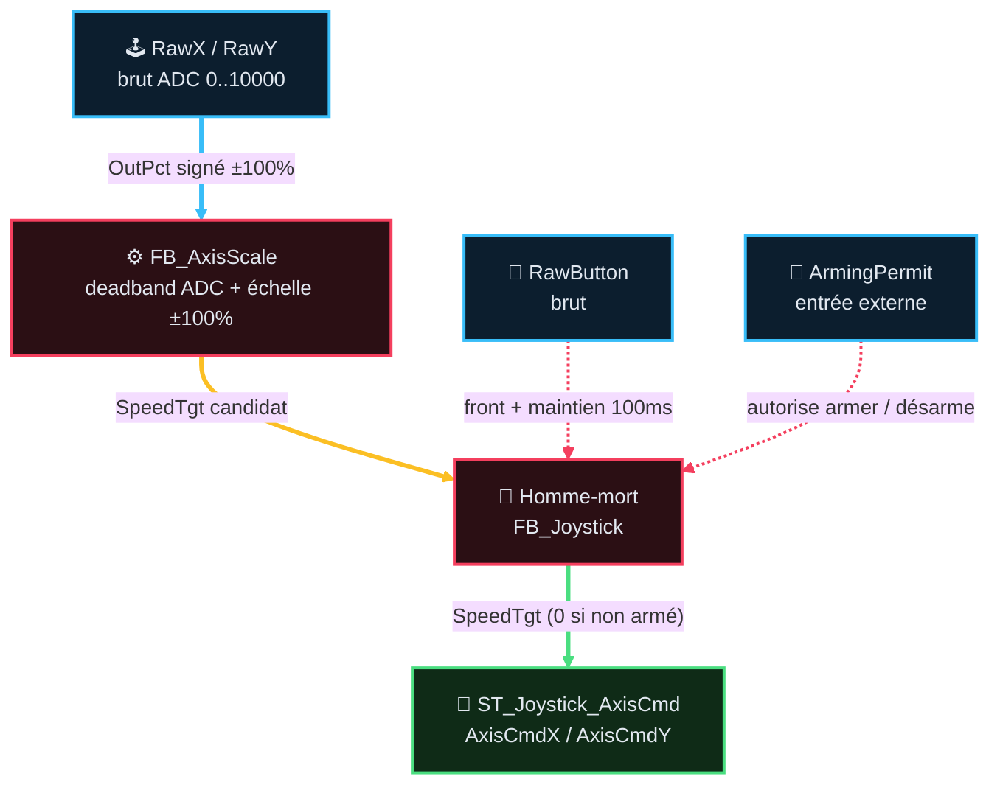

# Analyse Fonctionnelle — Partie 8 : Fonction Joystick (v2.5)

> **Version** : v2.5 — 2026-08-26 — `FB_AxisScale` décongestionné en fiche dédiée (voir §9)
> 🔗 **Dépend de** : AF02 (architecture), AF03 (contrats FB/DUT), AF06 (acquisition)
> 📄 **CODE associé** : `CODE/D_JOYSTICK/FB_Joystick.st`, `FB_AxisScale.st`, `ST_Joystick_AxisCmd.st`
> · instance `PRG_02_Acquisition.instJoystick`

## 📑 Sommaire

1. [🎯 Rôle et périmètre](#1-rôle-et-périmètre)
2. [🧪 Table des points de validation](#2-table-des-points-de-validation)
3. [🔄 Pipeline et composition (F08.01, F08.02)](#3-pipeline-et-composition-f0801-f0802)
4. [🔌 Interface publique](#4-interface-publique)
5. [🔫 Homme-mort (F08.03, F08.04)](#5-homme-mort-f0803-f0804)
6. [📡 Calibration et défaut capteur (F08.05, F08.06)](#6-calibration-et-défaut-capteur-f0805-f0806)
7. [🔒 Interlock consommateurs (F08.07, F08.08)](#7-interlock-consommateurs-f0807-f0808)
8. [🖥️ IHM, Configuration & Dépannage](#8-ihm-configuration-dépannage)
9. [📜 Suivi historique](#9-suivi-historique)
10. [❓ TBD](#10-tbd)
11. [📚 Documents liés](#11-documents-liés)

---

## 1 · 🎯 Rôle et périmètre

- **Rôle** : convertir le geste opérateur (manche 2 axes + bouton, nœud CANopen) en
  intention de conduite exploitable par les FB de mouvement, avec sécurité homme-mort intégrée.
- **Périmètre strict** : acquisition, mise à l'échelle, homme-mort, défaut capteur, calibration.
  Ne fait **pas** : arbitrage mode/sélecteur, limites machine, frein, `PowerCutOff`, pilotage Q
  physique — **ni** la décision de qui a le droit d'armer (`ArmingPermit` = entrée externe).
- **Type de composant** : Producteur d'intention (pas un FB de mouvement).
- **Contrat AF03** : `standard` (remonte défaut capteur/calibration/bus via `Fault : ST_Fault`,
  rempli par une instance `FB_FaultCore` — AF03 §3 / §4.1). Pas de `Lifecycle` (FB synchrone).

### 🎯 Table des fonctions

> **État** — `V` validé, implémentation non vérifiée · `V-I` validé et implémenté · `NV` non validé, non implémenté · `NV-I` code présent mais non validé · `R` refusé · `NA` non applicable.

<table style="width: 100%; table-layout: fixed; border-collapse: collapse; font-size: 14px;">
  <colgroup>
    <col style="width: 40px;">
    <col style="width: 140px;">
    <col style="width: calc(100% - 520px);">
    <col style="width: 110px;">
    <col style="width: 50px;">
    <col style="width: 90px;">
    <col style="width: 50px;">
    <col style="width: 40px;">
  </colgroup>
  <thead>
    <tr style="border-bottom: 2px solid #475569; text-align: left;">
      <th style="padding: 4px 1px; text-align: center;"><small><b>ID</b></small></th>
      <th style="padding: 4px 1px; text-align: center;"><small>Fonction</small></th>
      <th style="padding: 4px 8px;">Description</th>
      <th style="padding: 4px 1px; text-align: center;"><small>Réalisée par</small></th>
      <th style="padding: 4px 1px; text-align: center;"><small>Criticité</small></th>
      <th style="padding: 4px 1px; text-align: center;"><small>TC couvrants</small></th>
      <th style="padding: 4px 1px; text-align: center;"><small>Statut</small></th>
      <th style="padding: 4px 1px; text-align: center;"><small>État</small></th>
    </tr>
  </thead>
  <tbody>
    <tr style="border-bottom: 1px solid rgba(255,255,255,0.08);">
      <td style="padding: 4px 1px; text-align: center; vertical-align: middle;">F08.01</td>
      <td style="padding: 4px 1px; text-align: center; vertical-align: middle;"><small><b>Acquérir axes + bouton</b></small></td>
      <td style="padding: 6px 8px; line-height: 1.55;">Lit <code>RawX</code>/<code>RawY</code>/<code>RawButton</code> (bus CANopen ou image simulée)</td>
      <td style="padding: 4px 1px; text-align: center; vertical-align: middle;"><small><code>FB_Joystick</code></small></td>
      <td style="padding: 4px 1px; text-align: center; vertical-align: middle;"><small>🔵 C2</small></td>
      <td style="padding: 4px 1px; text-align: center; vertical-align: middle;">TC-P08-010</td>
      <td style="padding: 4px 1px; text-align: center; vertical-align: middle;"><small>✅</small></td>
      <td style="padding: 4px 1px; text-align: center; vertical-align: middle;"><small><code>NV-I</code></small></td>
    </tr>
    <tr style="border-bottom: 1px solid rgba(255,255,255,0.08);">
      <td style="padding: 4px 1px; text-align: center; vertical-align: middle;">F08.02</td>
      <td style="padding: 4px 1px; text-align: center; vertical-align: middle;"><small><b>Mettre à l'échelle</b></small></td>
      <td style="padding: 6px 8px; line-height: 1.55;">Brut ADC → % signé ±100, deadband ADC sur neutre persistant, saturation stricte</td>
      <td style="padding: 4px 1px; text-align: center; vertical-align: middle;"><small><code>FB_AxisScale</code></small></td>
      <td style="padding: 4px 1px; text-align: center; vertical-align: middle;"><small>🔵 C2</small></td>
      <td style="padding: 4px 1px; text-align: center; vertical-align: middle;">TC-P08-010</td>
      <td style="padding: 4px 1px; text-align: center; vertical-align: middle;"><small>✅</small></td>
      <td style="padding: 4px 1px; text-align: center; vertical-align: middle;"><small><code>NV-I</code></small></td>
    </tr>
    <tr style="border-bottom: 1px solid rgba(255,255,255,0.08);">
      <td style="padding: 4px 1px; text-align: center; vertical-align: middle;">F08.03</td>
      <td style="padding: 4px 1px; text-align: center; vertical-align: middle;"><small><b>Armer homme-mort</b></small></td>
      <td style="padding: 6px 8px; line-height: 1.55;">Maintien bouton <code>DeadmanArmHoldTime</code> (100ms) <b>ET</b> <code>ArmingPermit=TRUE</code></td>
      <td style="padding: 4px 1px; text-align: center; vertical-align: middle;"><small><code>FB_Joystick</code></small></td>
      <td style="padding: 4px 1px; text-align: center; vertical-align: middle;"><small>🔴 C4</small></td>
      <td style="padding: 4px 1px; text-align: center; vertical-align: middle;">TC-P08-020</td>
      <td style="padding: 4px 1px; text-align: center; vertical-align: middle;"><small>✅</small></td>
      <td style="padding: 4px 1px; text-align: center; vertical-align: middle;"><small><code>NV-I</code></small></td>
    </tr>
    <tr style="border-bottom: 1px solid rgba(255,255,255,0.08);">
      <td style="padding: 4px 1px; text-align: center; vertical-align: middle;">F08.04</td>
      <td style="padding: 4px 1px; text-align: center; vertical-align: middle;"><small><b>Désarmer homme-mort</b></small></td>
      <td style="padding: 6px 8px; line-height: 1.55;"><code>ArmingPermit=FALSE</code> (immédiat) <b>ou</b> neutre tenu <code>NeutralHoldTime</code> après grâce <code>DeadmanArmGraceTime</code> (3s)</td>
      <td style="padding: 4px 1px; text-align: center; vertical-align: middle;"><small><code>FB_Joystick</code></small></td>
      <td style="padding: 4px 1px; text-align: center; vertical-align: middle;"><small>🔴 C4</small></td>
      <td style="padding: 4px 1px; text-align: center; vertical-align: middle;">TC-P08-020</td>
      <td style="padding: 4px 1px; text-align: center; vertical-align: middle;"><small>✅</small></td>
      <td style="padding: 4px 1px; text-align: center; vertical-align: middle;"><small><code>NV-I</code></small></td>
    </tr>
    <tr style="border-bottom: 1px solid rgba(255,255,255,0.08);">
      <td style="padding: 4px 1px; text-align: center; vertical-align: middle;">F08.05</td>
      <td style="padding: 4px 1px; text-align: center; vertical-align: middle;"><small><b>Détecter défaut capteur</b></small></td>
      <td style="padding: 6px 8px; line-height: 1.55;"><code>RawX</code>/<code>RawY</code> hors <code>[0;10000]</code> ± marge 500 → <code>SpeedTgt=0</code> 2 axes + Warning</td>
      <td style="padding: 4px 1px; text-align: center; vertical-align: middle;"><small><code>FB_Joystick</code></small></td>
      <td style="padding: 4px 1px; text-align: center; vertical-align: middle;"><small>🟠 C3</small></td>
      <td style="padding: 4px 1px; text-align: center; vertical-align: middle;">TC-P08-030</td>
      <td style="padding: 4px 1px; text-align: center; vertical-align: middle;"><small>✅</small></td>
      <td style="padding: 4px 1px; text-align: center; vertical-align: middle;"><small><code>NV-I</code></small></td>
    </tr>
    <tr style="border-bottom: 1px solid rgba(255,255,255,0.08);">
      <td style="padding: 4px 1px; text-align: center; vertical-align: middle;">F08.06</td>
      <td style="padding: 4px 1px; text-align: center; vertical-align: middle;"><small><b>Calibrer neutre</b></small></td>
      <td style="padding: 6px 8px; line-height: 1.55;">Front <code>Calibrate</code> en zone <code>[2000;8000]</code> → mémorise neutre persistant, sinon Fault</td>
      <td style="padding: 4px 1px; text-align: center; vertical-align: middle;"><small><code>FB_Joystick</code></small></td>
      <td style="padding: 4px 1px; text-align: center; vertical-align: middle;"><small>🔵 C2</small></td>
      <td style="padding: 4px 1px; text-align: center; vertical-align: middle;">TC-P08-040</td>
      <td style="padding: 4px 1px; text-align: center; vertical-align: middle;"><small>⚠️ SITE non exécuté</small></td>
      <td style="padding: 4px 1px; text-align: center; vertical-align: middle;"><small><code>NV</code></small></td>
    </tr>
    <tr style="border-bottom: 1px solid rgba(255,255,255,0.08);">
      <td style="padding: 4px 1px; text-align: center; vertical-align: middle;">F08.07</td>
      <td style="padding: 4px 1px; text-align: center; vertical-align: middle;"><small><b>Interdire mouvement sans armement</b></small></td>
      <td style="padding: 6px 8px; line-height: 1.55;">Consommateur combine <code>AxisCmd*.StartStop AND DeadmanArmed</code> avant tout ordre translation ; <b>partiel</b> sur treuils (voir §Intégration)</td>
      <td style="padding: 4px 1px; text-align: center; vertical-align: middle;"><small><code>PRG_04</code>/<code>PRG_05</code> (câblage), vérifié par <code>gate</code> <code>G375</code></small></td>
      <td style="padding: 4px 1px; text-align: center; vertical-align: middle;"><small>🔴 C4</small></td>
      <td style="padding: 4px 1px; text-align: center; vertical-align: middle;">TC-P08-050</td>
      <td style="padding: 4px 1px; text-align: center; vertical-align: middle;"><small>⚠️ partiel (treuils)</small></td>
      <td style="padding: 4px 1px; text-align: center; vertical-align: middle;"><small><code>NV</code></small></td>
    </tr>
    <tr style="border-bottom: 1px solid rgba(255,255,255,0.08);">
      <td style="padding: 4px 1px; text-align: center; vertical-align: middle;">F08.08</td>
      <td style="padding: 4px 1px; text-align: center; vertical-align: middle;"><small><b>Signaler armement refusé</b></small></td>
      <td style="padding: 6px 8px; line-height: 1.55;"><code>ArmingPermitDenied := RawButton AND NOT ArmingPermit</code> (warning IHM)</td>
      <td style="padding: 4px 1px; text-align: center; vertical-align: middle;"><small><code>FB_Joystick</code></small></td>
      <td style="padding: 4px 1px; text-align: center; vertical-align: middle;"><small>⚪ C1</small></td>
      <td style="padding: 4px 1px; text-align: center; vertical-align: middle;">TC-P08-060</td>
      <td style="padding: 4px 1px; text-align: center; vertical-align: middle;"><small>⚠️ non testé</small></td>
      <td style="padding: 4px 1px; text-align: center; vertical-align: middle;"><small><code>NV</code></small></td>
    </tr>
  </tbody>
</table>

> `TC-P08-010` couvre `F08.01`+`F08.02` (même pipeline acquisition+échelle) ; `TC-P08-020` couvre
> `F08.03`+`F08.04` (armement+désarmement, même TC macro) — partage volontaire (règle guide 3-6
> TC macro), pas un oubli.

---

## 🧪 2 · Table des points de validation

> **État** — `V` validé, implémentation non vérifiée · `V-I` validé et implémenté · `NV` non validé, non implémenté · `NV-I` code présent mais non validé · `R` refusé · `NA` non applicable.

<table style="width: 100%; table-layout: fixed; border-collapse: collapse; font-size: 14px;">
  <colgroup>
    <col style="width: 28px;">
    <col style="width: 50px;">
    <col style="width: calc(100% - 165px);">
    <col style="width: 45px;">
    <col style="width: 26px;">
    <col style="width: 36px;">
  </colgroup>
  <thead>
    <tr style="border-bottom: 2px solid #475569; text-align: left;">
      <th style="padding: 4px 1px; text-align: center;"><small><b>ID</b></small></th>
      <th style="padding: 4px 1px; text-align: center;"><small>Intention</small></th>
      <th style="padding: 4px 8px;">Séquence &amp; Déroulé des étapes (Comportement attendu)</th>
      <th style="padding: 4px 1px; text-align: center;"><small>Type</small></th>
      <th style="padding: 4px 1px; text-align: center;"><small>Réf</small></th>
      <th style="padding: 4px 1px; text-align: center;"><small>État</small></th>
    </tr>
  </thead>
  <tbody>
    <tr style="border-bottom: 1px solid rgba(255,255,255,0.08);">
      <td style="padding: 4px 1px; text-align: center; vertical-align: middle;">TC-P08-010</td>
      <td style="padding: 4px 1px; text-align: center; vertical-align: middle;"><small><b>Acquisition</b> &amp; échelle</small></td>
      <td style="padding: 6px 8px; line-height: 1.55;">
        💤 <b>Étape 0</b> : Joystick au neutre, <code>SpeedTgt=0</code> 
        🚀 <b>Étape 1</b> : Injection <code>RawX=9000</code> → échelle proportionnelle → <code>80%</code> 
        ⚡ <b>Étape 2</b> : Injection <code>RawY=300</code> → échelle asymétrique → <code>-94%</code> (proportionnel, pas seulement aux bornes) 
        ✅ <b>Étape 3</b> : Deadband ADC centrée neutre vérifiée — <code>|RawIn-Neutral|≤DeadbandRaw</code> → <code>0</code>
      </td>
      <td style="padding: 4px 1px; text-align: center;"><small><code>💻 AUTO</code></small></td>
      <td style="padding: 4px 1px; text-align: center;"><small><code>FB_AxisScale</code></small></td>
      <td style="padding: 4px 1px; text-align: center;"><small><code>NV</code></small></td>
    </tr>
    <tr style="border-bottom: 1px solid rgba(255,255,255,0.08);">
      <td style="padding: 4px 1px; text-align: center; vertical-align: middle;">TC-P08-020</td>
      <td style="padding: 4px 1px; text-align: center; vertical-align: middle;"><small><b>Homme-</b> mort</small></td>
      <td style="padding: 6px 8px; line-height: 1.55;">
        💤 <b>Étape 0</b> : Repos, <code>DeadmanArmed=FALSE</code>, bouton relâché 
        🚀 <b>Étape 1</b> : Appui bouton + maintien <code>DeadmanArmHoldTime</code> (100ms) + <code>ArmingPermit=TRUE</code> → <code>DeadmanArmed=TRUE</code> 
        ⚡ <b>Étape 2</b> : Relâchement bouton avant fin 100ms → armement annulé 
        ⚡ <b>Étape 3</b> : Désarmement sur <code>ArmingPermit=FALSE</code> (immédiat) ou neutre tenu après grâce 3s 
        ✅ <b>Étape 4</b> : <code>DeadmanArmed=FALSE</code>, <code>SpeedTgt=0</code> — décélération normale (pas coupure de puissance)
      </td>
      <td style="padding: 4px 1px; text-align: center;"><small><code>💻 AUTO</code></small></td>
      <td style="padding: 4px 1px; text-align: center;"><small><code>FB_Joystick</code></small></td>
      <td style="padding: 4px 1px; text-align: center;"><small><code>NV</code></small></td>
    </tr>
    <tr style="border-bottom: 1px solid rgba(255,255,255,0.08);">
      <td style="padding: 4px 1px; text-align: center; vertical-align: middle;">TC-P08-030</td>
      <td style="padding: 4px 1px; text-align: center; vertical-align: middle;"><small><b>Défaut</b> capteur</small></td>
      <td style="padding: 6px 8px; line-height: 1.55;">
        💤 <b>Étape 0</b> : Acquisition nominale, <code>RawX/RawY</code> dans <code>[0;10000]</code> 
        🚀 <b>Étape 1</b> : Injection <code>RawX</code> ou <code>RawY</code> hors <code>[0;10000]</code> ± marge 500 
        ⚡ <b>Étape 2</b> : <code>SpeedTgt=0</code> sur les 2 axes, <code>ErrorId</code> bit1 (Warning) levé 
        ✅ <b>Étape 3</b> : Retour en plage → Warning auto-effacé, <code>SpeedTgt</code> restauré
      </td>
      <td style="padding: 4px 1px; text-align: center;"><small><code>💻 AUTO</code></small></td>
      <td style="padding: 4px 1px; text-align: center;"><small><code>FB_Joystick</code></small></td>
      <td style="padding: 4px 1px; text-align: center;"><small><code>NV</code></small></td>
    </tr>
    <tr style="border-bottom: 1px solid rgba(255,255,255,0.08);">
      <td style="padding: 4px 1px; text-align: center; vertical-align: middle;">TC-P08-040</td>
      <td style="padding: 4px 1px; text-align: center; vertical-align: middle;"><small><b>Calibration</b> neutre</small></td>
      <td style="padding: 6px 8px; line-height: 1.55;">
        💤 <b>Étape 0</b> : Neutre mémorisé, <code>Calibrate</code> au repos 
        🚀 <b>Étape 1</b> : Front <code>Calibrate</code> avec axes hors <code>[2000;8000]</code> 
        ⚡ <b>Étape 2</b> : <code>Fault</code> bit0 levé, calibration refusée, à acquitter par <code>Reset</code> + axes en zone 
        ✅ <b>Étape 3</b> : Neutre persistant survit au redémarrage PLC (RETAIN)
      </td>
      <td style="padding: 4px 1px; text-align: center;"><small><code>⚡ AUTO+SITE</code></small></td>
      <td style="padding: 4px 1px; text-align: center;"><small><code>FB_Joystick</code></small></td>
      <td style="padding: 4px 1px; text-align: center;"><small><code>NV</code></small></td>
    </tr>
    <tr style="border-bottom: 1px solid rgba(255,255,255,0.08);">
      <td style="padding: 4px 1px; text-align: center; vertical-align: middle;">TC-P08-050</td>
      <td style="padding: 4px 1px; text-align: center; vertical-align: middle;"><small><b>Gate</b> consommateurs</small></td>
      <td style="padding: 6px 8px; line-height: 1.55;">
        💤 <b>Étape 0</b> : <code>DeadmanArmed=FALSE</code>, machine en mode opératoire 
        🚀 <b>Étape 1</b> : Demande de mouvement translation sans armement homme-mort 
        ⚡ <b>Étape 2</b> : Translation refuse tout ordre (tous modes, y compris boutons IHM) 
        ⚡ <b>Étape 3</b> : Treuils M1/M2 — exigent <code>DeadmanArmed</code> seulement en mode Joystick Maître (<code>TglJoystickMaster=TRUE</code>) 
        ✅ <b>Étape 4</b> : Aucun mouvement sans armement valide (interlock directionnel par technologie, arbitré 2026-08-29 §10 Q2)
      </td>
      <td style="padding: 4px 1px; text-align: center;"><small><code>🔒 GATE</code></small></td>
      <td style="padding: 4px 1px; text-align: center;"><small><code>G375_check_deadman_arming_gate.py</code></small></td>
      <td style="padding: 4px 1px; text-align: center;"><small><code>NV</code></small></td>
    </tr>
    <tr style="border-bottom: 1px solid rgba(255,255,255,0.08);">
      <td style="padding: 4px 1px; text-align: center; vertical-align: middle;">TC-P08-060</td>
      <td style="padding: 4px 1px; text-align: center; vertical-align: middle;"><small><b>Armement</b> refusé</small></td>
      <td style="padding: 6px 8px; line-height: 1.55;">
        💤 <b>Étape 0</b> : <code>ArmingPermit=FALSE</code>, bouton relâché 
        🚀 <b>Étape 1</b> : Appui bouton (<code>RawButton=TRUE</code>) avec <code>ArmingPermit=FALSE</code> 
        ⚡ <b>Étape 2</b> : <code>ArmingPermitDenied=TRUE</code> maintenu pendant tout l'appui (Warning IHM) 
        ✅ <b>Étape 3</b> : Relâchement bouton → <code>ArmingPermitDenied=FALSE</code>, aucun armement
      </td>
      <td style="padding: 4px 1px; text-align: center;"><small><code>⬜ GAP</code></small></td>
      <td style="padding: 4px 1px; text-align: center;"><small><code>FB_Joystick</code></small></td>
      <td style="padding: 4px 1px; text-align: center;"><small><code>NV</code></small></td>
    </tr>
    <tr style="border-bottom: 1px solid rgba(255,255,255,0.08);">
      <td style="padding: 4px 1px; text-align: center; vertical-align: middle;">TC-P08-020.1</td>
      <td style="padding: 4px 1px; text-align: center; vertical-align: middle;"><small><b>Armement</b> hors neutre</small></td>
      <td style="padding: 6px 8px; line-height: 1.55;">
        💤 <b>Étape 0</b> : Axes déviés (<code>AtNeutral=FALSE</code>), bouton relâché 
        🚀 <b>Étape 1</b> : Front bouton + maintien 100ms + <code>ArmingPermit=TRUE</code> (axes toujours déviés) 
        ⚡ <b>Étape 2</b> : <code>DeadmanArmed=TRUE</code> — armement indépendant de la position des axes 
        ✅ <b>Étape 3</b> : <code>DeadmanArmed=TRUE</code> confirmé même axes déviés (<code>FB_Joystick.st:172</code>)
      </td>
      <td style="padding: 4px 1px; text-align: center;"><small><code>💻 AUTO</code></small></td>
      <td style="padding: 4px 1px; text-align: center;"><small><code>FB_Joystick</code></small></td>
      <td style="padding: 4px 1px; text-align: center;"><small><code>NV-I</code></small></td>
    </tr>
    <tr style="border-bottom: 1px solid rgba(255,255,255,0.08);">
      <td style="padding: 4px 1px; text-align: center; vertical-align: middle;">TC-P08-020.2</td>
      <td style="padding: 4px 1px; text-align: center; vertical-align: middle;"><small><b>Désarmement</b> perte permit</small></td>
      <td style="padding: 6px 8px; line-height: 1.55;">
        💤 <b>Étape 0</b> : Geste armé (<code>DeadmanArmed=TRUE</code>), mouvement en cours 
        🚀 <b>Étape 1</b> : Perte <code>ArmingPermit</code> (<code>ArmingPermit=FALSE</code>) 
        ⚡ <b>Étape 2</b> : <code>DeadmanArmed=FALSE</code> immédiat, <code>SpeedTgt=0</code> 
        ✅ <b>Étape 3</b> : Décélération normale côté FB mouvement aval (pas coupure brute) — <code>FB_Joystick.st:180-183</code>
      </td>
      <td style="padding: 4px 1px; text-align: center;"><small><code>💻 AUTO</code></small></td>
      <td style="padding: 4px 1px; text-align: center;"><small><code>FB_Joystick</code></small></td>
      <td style="padding: 4px 1px; text-align: center;"><small><code>NV-I</code></small></td>
    </tr>
    <tr style="border-bottom: 1px solid rgba(255,255,255,0.08);">
      <td style="padding: 4px 1px; text-align: center; vertical-align: middle;">TC-P08-020.3</td>
      <td style="padding: 4px 1px; text-align: center; vertical-align: middle;"><small><b>Pas de réarm.</b> auto</small></td>
      <td style="padding: 6px 8px; line-height: 1.55;">
        💤 <b>Étape 0</b> : Geste désarmé (<code>DeadmanArmed=FALSE</code>), <code>ArmingPermit=FALSE</code> 
        🚀 <b>Étape 1</b> : Retour <code>ArmingPermit=TRUE</code> sans nouvel appui bouton 
        ⚡ <b>Étape 2</b> : <code>DeadmanArmed</code> reste <code>FALSE</code> — aucun réarmement automatique 
        ✅ <b>Étape 3</b> : Nouveau front bouton + maintien 100ms requis pour réarmer (<code>FB_Joystick.st:167-176</code>)
      </td>
      <td style="padding: 4px 1px; text-align: center;"><small><code>💻 AUTO</code></small></td>
      <td style="padding: 4px 1px; text-align: center;"><small><code>FB_Joystick</code></small></td>
      <td style="padding: 4px 1px; text-align: center;"><small><code>NV-I</code></small></td>
    </tr>
    <tr style="border-bottom: 1px solid rgba(255,255,255,0.08);">
      <td style="padding: 4px 1px; text-align: center; vertical-align: middle;">TC-P08-020.4</td>
      <td style="padding: 4px 1px; text-align: center; vertical-align: middle;"><small><b>Bornes</b> temporelles</small></td>
      <td style="padding: 6px 8px; line-height: 1.55;">
        💤 <b>Étape 0</b> : Configuration chargée (<code>ST_fbJoystick_Cfg.st:15-17</code>) 
        🚀 <b>Étape 1</b> : Appui bouton → comptage <code>DeadmanArmHoldTime</code> = 100ms 
        ⚡ <b>Étape 2</b> : Grâce <code>DeadmanArmGraceTime</code> = 3s avant désarmement par neutre 
        ⚡ <b>Étape 3</b> : Neutre tenu <code>NeutralHoldTime</code> = 100ms après grâce → désarmement 
        ✅ <b>Étape 4</b> : Bornes temporelles vérifiées : 100ms / 3s / 100ms (<code>FB_Joystick.st:172,189-191</code>)
      </td>
      <td style="padding: 4px 1px; text-align: center;"><small><code>💻 AUTO</code></small></td>
      <td style="padding: 4px 1px; text-align: center;"><small><code>FB_Joystick</code></small></td>
      <td style="padding: 4px 1px; text-align: center;"><small><code>NV-I</code></small></td>
    </tr>
  </tbody>
</table>

> ⚠️ **`TC-P08-050` n'est pas un test de FB** : le gate vit dans `PRG_04_Treuils_Benne.st` /
> `PRG_05_Translation.st` (câblage de collage), pas dans `FB_Joystick` (qui ignore Winch/Translation)
> ni dans un futur `FB_Winch` (le gate n'est pas dans son interface). Preuve = script, pas instance.
>
> ⚠️ **`TC-P08-060` = GAP** : `ArmingPermitDenied` existe et est câblé, mais aucun scénario ne le
> vérifie dans `test_fb_joystick.st`.

---

## 3 · 🔄 Pipeline et composition (F08.01, F08.02)

Trait plein épais = flux de données (position/vitesse) ; pointillé = signal de commande/permission
(pas une donnée transformée). Couleur = domaine (cyan acquisition, rouge sécurité, vert sortie),
même dictionnaire que `GUIDE_EDITION_AF_v1.0.md §3quater`.

Simulation (F08.01) : `FB_Sim_Joystick` ne simule que les entrées brutes (`RawX`/`RawY`/
`RawButton`) ; le homme-mort réel de `FB_Joystick` reste actif (pas de bypass, AF13).

### 🏛️ Architecture de Commande Unifiée : du Joystick aux Sorties Physiques (M1, M2, M3)

L'intention de vitesse issue du manche (`SpeedTgt` 0.0 à 100.0 %) est unifiée à l'acquisition et se convertit selon la technologie physique de chaque axe :

| Étage | M1 (Treuil Retenue) | M2 (Treuil Benne) | M3 (Translation Pont) |
|:---|:---|:---|:---|
| **1. Entrée Joystick (`PRG_02`)** | `instJoystick.AxisCmdY.SpeedTgt` *(0..100 %, Axe Y)* | `instJoystick.AxisCmdY.SpeedTgt` *(0..100 %, Axe Y)* | `instJoystick.AxisCmdX.SpeedTgt` *(0..100 %, Axe X)* |
| **2. Consigne Arbitrée (`PRG_04` / `PRG_05`)** | `SpeedCmd_Pct` *(0.0 à 100.0 %)* | `SpeedCmd_Pct` *(0.0 à 100.0 %)* | `SpeedCmd_Pct` *(0.0 à 100.0 %)* |
| **3. Moteur de Conversion** | **`FB_SpeedStep`** *(Quantification en 5 paliers)* | **`FB_SpeedStep`** *(Quantification en 5 paliers)* | **`FB_Ramp` + Échelle Hz** *(Conversion continue en Hz)* |
| **4. Grandeur Physique Interne** | **`StepNumber` (0 à 5)** : • Palier 0 = Arrêt • Palier 1 = PV (≤ 20 %) • Palier 2 = GV1 (≤ 40 %) • Palier 3 = GV2 (≤ 60 %) • Palier 4 = GV3 (≤ 80 %) • Palier 5 = GV4 (100 %) | **`StepNumber` (0 à 5)** : • Palier 0 = Arrêt • Palier 1 = PV (≤ 20 %) • Palier 2 = GV1 (≤ 40 %) • Palier 3 = GV2 (≤ 60 %) • Palier 4 = GV3 (≤ 80 %) • Palier 5 = GV4 (100 %) | **`DriveFreqCmd_Hz` (0.0 à 50.0 Hz)** : • `Freq_Hz = (SpeedCmd_Pct / 100) * SetFreq_Hz` • Progression continue filtrée par rampe d'accélération (Hz/s) |
| **5. Sorties Physiques Réelles (`PRG_06`)** | • Sens : `RelayFwd` / `RelayRev` • Paliers : `Contactor1` à `4` • Frein : `BrakeCmd` | • Sens : `RelayFwd` / `RelayRev` • Paliers : `Contactor1` à `4` • Frein : `BrakeCmd` | • Bus EtherCAT : `DriveControlWord` • Mot Fréquence : `DriveTargetVelocity` • Frein : `BrakeCmd` |
| **6. Supervision IHM (`PRG_07` / `GVL_IHM`)** | **`GVL_IHM.M1TreuilRetenue.State.SpeedCmd_Pct`** *(+ `StepNumber` 0..5)* | **`GVL_IHM.M2TreuilBenne.State.SpeedCmd_Pct`** *(+ `StepNumber` 0..5)* | **`GVL_IHM.TranslationM3.State.SpeedCmd_Pct`** *(+ `DriveFreqCmd_Hz`)* |

---

## 4 · 🔌 Interface publique

### Entrées (`VAR_INPUT`)

| Port | Type | Rôle | Producteur actuel |
|---|---|---|---|
| `Enable` | `BOOL` | Active le bloc | `TRUE` fixe (`PRG_02_Acquisition`) |
| `Reset` | `BOOL` | Acquittement défaut (front) | `PRG_07_Supervision.FaultMachineReset_IHM` |
| `ArmingPermit` | `BOOL` | Seule permission d'armement — `FALSE` = armement bloqué + désarme un geste armé | ⚠️ `TRUE` câblé en dur, voir §10 Q1 |
| `BusCanOpenOP` / `JoystickOP` | `ST_Diag_Device` | Présence nœud CAN / device esclave | `FB_Diag_CanOpen` |
| `RawX` / `RawY` | `INT` | Axe brut (0..10000) | `HwIn.Operator` |
| `RawButton` | `BOOL` | Bouton homme-mort brut | `HwIn.Operator` |
| `Calibrate` | `BOOL` | Demande recalage neutre | `GVL_IHM.JOY1Joystick.Cmd` |
| `DeadbandRaw` | `INT` | Zone morte ADC (déf. 300) | `GVL_PERSISTENT` |
| `NeutralHoldTime` / `DeadmanArmHoldTime` / `DeadmanArmGraceTime` | `TIME` | Temporisations (100ms/100ms/3s) | constantes d'appel |
| `RawOutOfRangeMargin` | `INT` | Marge défaut capteur (déf. 500) | constante d'appel |
| `NeutralXMem` / `NeutralYMem` (`IN_OUT`) | `INT` | Neutre persistant | `GVL_PERSISTENT` |

### Sorties (`VAR_OUTPUT`)

| Port | Type | Rôle |
|---|---|---|
| `AxisCmdX` / `AxisCmdY` | `ST_Joystick_AxisCmd` | Consigne normalisée (`Enable`, `StartStop`, `SpeedTgt`, `DirectionPositive/Negative`, `AtNeutral`) |
| `Button` | `BOOL` | = `RawButton` |
| `NeutralXAct` / `NeutralYAct` | `INT` | Neutre actif |
| `DeadmanArmed` | `BOOL` | Geste armé |
| `AtNeutral` | `BOOL` | 2 axes en zone morte |
| `ArmingPermitDenied` | `BOOL` | Warning : appui bouton pendant `ArmingPermit=FALSE` |
| `Ready` | `BOOL` | État standard (= `Enable` + bus OK + pas de défaut laté) |
| `Fault` | `ST_Fault` | Brique défaut socle (vue live `Error`/`ErrorId` + vue latchée `Latched`/`LatchedId`), remplie par `instFault : FB_FaultCore` à partir de `instCauses : ARRAY[0..15] OF ST_FaultCause` |
| `SpeedTgtX_Pct` / `SpeedTgtY_Pct` | `REAL` | Miroir maintenance `SpeedTgt` |
| `DirectionX` / `DirectionY` | `INT` | Miroir maintenance direction |

**Gate** (`NOT Enable OR BusLost`) : sorties à 0, `DeadmanArmed=FALSE`, timers reset, `RETURN` —
reset complet. Distinct de `RawOutOfRange` (défaut capteur, §Calibration) qui neutralise les
axes **sans** réinitialiser les timers d'armement homme-mort.

### Sous-composant `FB_AxisScale` (F08.02) — fiche dédiée depuis v2.5

Calculateur pur, instancié deux fois dans `FB_Joystick` (`ScaleX`/`ScaleY`) — pas de contrat
`light`/`standard` au sens strict (brique technique sans cycle de vie propre, neutralisée
indirectement par le gate `FB_Joystick`).

📄 **Interface complète (ports, formule d'échelle asymétrique, deadband, saturation)** : voir
[`FB_AxisScale_v1.0.md`](AF_Partie-08_Fonction_Joystick/FB_AxisScale_v1.0.md) — ce chapô ne garde
que ce résumé, le détail vit uniquement dans la fiche dédiée (anti-duplication,
`GUIDE_EDITION_AF_v1.0.md` §4).

---

## 5 · 🔫 Homme-mort (F08.03, F08.04)

| Paramètre | Défaut | Rôle |
|---|---|---|
| `DeadmanArmHoldTime` | 100ms | Appui maintenu avant armement |
| `DeadmanArmGraceTime` | 3s | Délai après armement avant que le neutre puisse désarmer |
| `NeutralHoldTime` | 100ms | Neutre tenu avant désarmement (après grâce) |

Armement (F08.03) = front bouton → maintien 100ms → si `ArmingPermit=TRUE` au terme : armé,
**indépendamment de la position des axes**. Pas de reconfirmation périodique (le FB ne re-surveille
pas le bouton une fois armé).

Désarmement (F08.04) = `ArmingPermit=FALSE` (niveau, immédiat) **ou** neutre tenu après la grâce.

⚠️ **Ce que « immédiat » ne veut PAS dire** : perdre `ArmingPermit` ne coupe pas la puissance et
n'est pas un arrêt d'urgence — `DeadmanArmed:=FALSE` force `SpeedTgt:=0`/`StartStop:=FALSE`, ce qui
déclenche côté FB de mouvement aval (`FB_Winch`/`FB_Translation`) une **décélération normale**
(rampe palier existante), pas une coupure brutale. C'est la même sémantique que
`TC-P08-011`/`TC-P08-012` (v2.1, tests vivants `test_fb_joystick.st:451,492`) : un `ArmingPermit`
retiré en cours de geste armé — ex. fin de cycle benne — doit stopper le mouvement même bouton
tenu, par construction (c'est la raison d'être de `ArmingPermit`, voir §10 Q1). Si le besoin réel
est différent (ex. ne désarmer que sur relâchement effectif du bouton, jamais sur perte de
permission), c'est un changement de comportement `FB_Joystick` — code C4, hors périmètre d'une
mise à jour documentaire, à qualifier en tâche dédiée si confirmé.

### Chronogramme — cycle complet armement/désarmement

| Instant | `RawButton` | `ArmingPermit` | `DeadmanArmPending` | `DeadmanArmed` | `AtNeutral` |
|---|---|---|---|---|---|
| t0 — repos | FALSE | TRUE | FALSE | FALSE | TRUE |
| t1 — appui bouton (↑) | TRUE ↑ | TRUE | TRUE | FALSE | TRUE |
| t2 — +100ms (`DeadmanArmHoldTime`) | TRUE | TRUE | FALSE | **TRUE** | TRUE |
| t3 — opérateur pousse le manche | TRUE | TRUE | FALSE | TRUE | FALSE |
| t4 — relâche le bouton (↓) | FALSE ↓ | TRUE | FALSE | TRUE *(pas de resurveillance)* | FALSE |
| t5 — perte `ArmingPermit` (↓, ex. fin cycle benne) | FALSE | FALSE ↓ | FALSE | **FALSE** *(immédiat)* | FALSE |
| t6 — `ArmingPermit` revient (↑), manche encore dévié | FALSE | TRUE ↑ | FALSE | FALSE *(pas de réarmement auto)* | FALSE |
| t7 — nouvel appui bouton (↑) | TRUE ↑ | TRUE | TRUE | FALSE | FALSE |
| t8 — +100ms (`DeadmanArmHoldTime`) | TRUE | TRUE | FALSE | **TRUE** | FALSE |
| t9 — retour neutre (↑), grâce 3s + neutre 100ms écoulés | FALSE | TRUE | FALSE | **FALSE** *(désarmement neutre)* | TRUE ↑ |

t5→t6 illustre F08.04 (désarmement sur perte permission) ; t6→t7→t8 montre qu'un réarmement exige
**toujours** un nouveau front bouton (t7) + le même maintien 100ms que l'armement initial (t8),
jamais automatique au retour de `ArmingPermit` ; t9 illustre le désarmement par neutre tenu après
la grâce (F08.04, autre voie).

---

## 6 · 📡 Calibration et défaut capteur (F08.05, F08.06)

| Mécanisme | Détection | Effet |
|---|---|---|
| Calibration (front `Calibrate`) | Hors `[2000;8000]` | Fault bit0, à acquitter (Reset + axes en zone) |
| Défaut capteur (continu) | Hors `[0;10000]` ± marge 500 | `SpeedTgt=0` sur les 2 axes, Warning bit1 auto-effacé |
| Perte bus CAN (`BusCanOpenOP`/`JoystickOP` non opérationnel) | Continu | Gate complet (§Interface), Warning bit2 auto-effacé |

Neutre persistant (`NeutralXMem`/`NeutralYMem`), survit au redémarrage PLC.

---

## 7 · 🔒 Interlock consommateurs (F08.07, F08.08)

`AxisCmdY`/`DirectionY` → `PRG_04_Treuils_Benne` (M1/M2) · `AxisCmdX`/`DirectionX` →
`PRG_05_Translation` (M3), sélecteur `GVL_IHM.Modes.Cmd.TglJoystickMaster`.

| Consommateur | Exige `DeadmanArmed` | Preuve |
|---|---|---|
| Translation (M3) | **Tous les modes**, y compris boutons IHM | `PRG_05_Translation.st:186-187` — condition tautologique par construction |
| Treuils (M1/M2) | **Seulement** en mode Joystick Maître (`TglJoystickMaster=TRUE`) | `(NOT TglJoystickMaster OR JoystickDeadmanArmed)`, `PRG_04_Treuils_Benne.st:442,486` |

⚠️ **Arbitré 2026-08-29** (F08.07 partiel sur treuils) : en pilotage boutons IHM
(`TglJoystickMaster=FALSE`), les treuils ne requièrent **pas** le homme-mort — contrairement à la
Translation. **Voulu** (décision humaine, §10 Q2) : l'**armement** est du ressort du joystick ;
le mode boutons IHM est un geste conscient équivalent supervisé par ses propres interlocks
directionnels (§7), propre à chaque technologie. Aucune modification de `PRG_04` associée.

F08.08 (`ArmingPermitDenied`) est un warning diagnostic pur (visibilité IHM d'un armement refusé),
sans effet sur le gate ci-dessus.

---

## 8 · 🖥️ IHM, Configuration & Dépannage

`ST_JoystickHMI` = `Cmd` (`Calibrate`) + `State` (Raw, AxisCmd, neutres, `DeadmanArmed`,
`AtNeutral`, Online/Operational, Error/ErrorId). Pas de sous-struct `Cfg` dans `ST_JoystickHMI` —
mais des réglages existent bien, pas tous au même niveau de maturité :

| Réglage | Persistant ? | Réglable depuis un écran IHM ? |
|---|---|---|
| `DeadbandRaw` (`_JoystickDeadbandRaw`) | ✅ `GVL_PERSISTENT`, `RETAIN` | ❌ force CODESYS direct uniquement |
| `NeutralXMem`/`NeutralYMem` | ✅ `GVL_PERSISTENT`, `RETAIN` | ✅ via `Calibrate` (F08.06) |
| `RawOutOfRangeMargin` | ❌ constante en dur (`PRG_02_Acquisition.st:314` = `500`) | ❌ |

`Bypass` : **existe**, mais pas porté par ce FB — `FB_Diag_CanOpen.NetworkBypassActive`/
`SimBypassActive` (AF12 Diagnostic) alimentent `DeviceJoystickOnlineEff`, source de
`BusCanOpenOP`/`JoystickOP` consommés directement par le gate `FB_Joystick`. Un bypass réseau IHM
peut donc masquer une perte de bus joystick — hors périmètre AF08, voir AF12.

Dépannage (`GVL_Troubleshooting.Joystick : ST_JoystickChecklist`) : vue chronologique dédiée
(`FB_TroubleshootingView.st`), champs parfois recalculés en doublon de l'IHM (ex. `NeutralXAct`
y est un `BOOL` "au neutre", vs `INT` valeur réelle dans `ST_JoystickState`) — voir AF14.

---

## 9 · 📜 Suivi historique

- **v2.4 → v2.5 (2026-08-26)** : décongestion du chapô — détail `FB_AxisScale` (ajouté en v2.4)
  déplacé vers une fiche dédiée [`FB_AxisScale_v1.0.md`](AF_Partie-08_Fonction_Joystick/FB_AxisScale_v1.0.md),
  suivant le pattern chapô/sous-fiche déjà appliqué par AF03/`FB_FaultCore` et AF10/`FB_Bucket`. §4
  ne garde qu'un résumé + pointeur.
- **v2.3 → v2.4 (2026-08-26)** : `FB_AxisScale` n'avait jamais son interface documentée (seulement
  cité dans le pipeline §3 et la table des fonctions) — ajout d'une sous-section dédiée en §4
  (ports `RawIn`/`Neutral`/`DeadbandRaw`→`OutPct`, formule d'échelle asymétrique + deadband +
  saturation) sous l'interface `FB_Joystick`. Écart constaté lors d'un mini-audit AF08 vs code.
- **v2.0 → v2.1 (2026-08-25)** : resynchro interface réelle (`ArmingPermit` remplace
  `Mode`/`BenneBusy`/`DeadmanReconfEnable`/`DeadmanRearmTimeout`, retirés du code) ; profil AF03
  corrigé `standard` (était `light`, déjà inexact) ; `FB_Ramp`/`FB_Filter_PT1` confirmés absents.
- **Confirmé (2026-08-25)** : sémantique désarmement sur perte `ArmingPermit` (immédiat, niveau,
  décélération normale côté FB de mouvement aval — pas de coupure de puissance) **conservée
  volontairement**. Challengée (revue de l'ancien `CODE_20260807_v0.5.25` : `Mode`/`BenneBusy`
  désarmaient déjà activement un geste en cours, même logique) et tranchée : reste le comportement
  cible, pas juste hérité.
- **v2.1 → v2.2 (2026-08-25)** : refonte format selon `GUIDE_EDITION_AF_v1.0.md` — 14 TC détaillés
  consolidés en 6 TC macro (règle guide §3 : 3-6 max) ; suppression des redites entre corps et
  historique ; sections renumérotées et taguées par fonction `F08.xx` ; alerte `ArmingPermit`
  repliée dans le TBD (Q1) au lieu d'une section dédiée (une question non tranchée n'a qu'un seul
  domicile : le TBD).
- **v2.2 → v2.3 (2026-08-25)** : Pipeline §3 converti en Mermaid `flowchart TD` (vertical, flèches
  étiquetées par le flux de données transmis) — remplace le schéma texte muet ; ajout d'un
  chronogramme texte (§5, table instant × signal) pour le cycle complet armement/désarmement
  homme-mort, couvrant les 2 voies de désarmement (perte permission, neutre après grâce) et le
  réarmement (toujours un nouveau front bouton). Application des patterns actés
  `GUIDE_EDITION_AF_v1.0.md §3bis/§3ter`.
- Archive : `ARCHIVES/Doc/AF_Partie-08_Fonction_Joystick_v2.0.md`.

---

## 10 · ❓ TBD

- ✅ **Q1 — `ArmingPermit` câblé** (résolu 2026-08-29, T176 ; **révisé 2026-08-31**) : producteur légitime = **PRG_04_Treuils_Benne**.
  **Règle générale** : on ne peut armer QUE si au moins un axe (treuil M1/M2 ou translation M3) a un
  **permis de mouvement effectif** — sinon aucun mouvement n'est possible, l'armement serait trompeur.
  `ArmingPermit := (EffectivePermitM1_Ascent OR EffectivePermitM1_Descend OR EffectivePermitM2_Ascent
  OR EffectivePermitM2_Descend OR NOT TranslationSafety.SafeStop) AND NOT instBucket.Lifecycle.Busy
  AND NOT BenneBusyFallEdge.Q` (combiné interlock benne conservé). Publié via le bus `Data` et consommé
  `PRG_02_Acquisition.st` (plus de littéral `TRUE` — gate anti-littéral **G461** en palier C).
  Le désarmement par changement de mode (`Auth.Mode`, signal 1 de la v0.1) reste un point d'arbitrage ouvert
  (voir `DOC/WFLOW/AUDITS/PRG02_20260824/`).
- ✅ **Q2 — arbitré 2026-08-29** (validation humaine) : **ne pas confondre**. L'**armement** homme-mort
  (front bouton + 100ms + `ArmingPermit`) est géré par le **joystick** — c'est sa responsabilité,
  un seul principe, aucun domaine ne l'implémente lui-même. La **différence de comportement**
  entre domaines (translation accepte l'inversion via ses rampes ; treuils M1/M2 exigent l'arrêt
  avant inversion) relève de l'**interlock directionnel propre à chaque technologie**, pas de
  l'armement : pas de bug, voulu. Les TC-P08-020.1..4 (armement) restent la seule référence
  du principe homme-mort ; les contraintes interlock vivent dans les fiches de domaine (§7).
- Filtre par défaut et double rampe Joystick↔FB mouvement : non tranché, pas d'autorisation de
  coder (risque interférence rampe si réintroduite côté joystick).
- Présence bouton `Calibrate` sur écran HMI réel : non vérifiée terrain.

---

## 11 · 📚 Documents liés

| Doc | Lien |
|---|---|
| AF02 | Architecture programme, `PRG_02_Acquisition` |
| AF03 | Contrat `standard`, socle `FB_FaultCore` (`Fault : ST_Fault`) |
| AF06 | `HwIn.Operator` (brut/sim) |
| AF07 | `ST_JoystickHMI` |
| AF10 / AF11 | Consommateurs `AxisCmdY`/`AxisCmdX` + `DeadmanArmed` |
| AF13 | `FB_Sim_Joystick` |
| [`FB_AxisScale_v1.0.md`](AF_Partie-08_Fonction_Joystick/FB_AxisScale_v1.0.md) | Fiche détaillée du calculateur d'échelle (F08.02) |
| Code | `CODE/D_JOYSTICK/FB_Joystick.st`, `FB_AxisScale.st`, `ST_Joystick_AxisCmd.st` |
