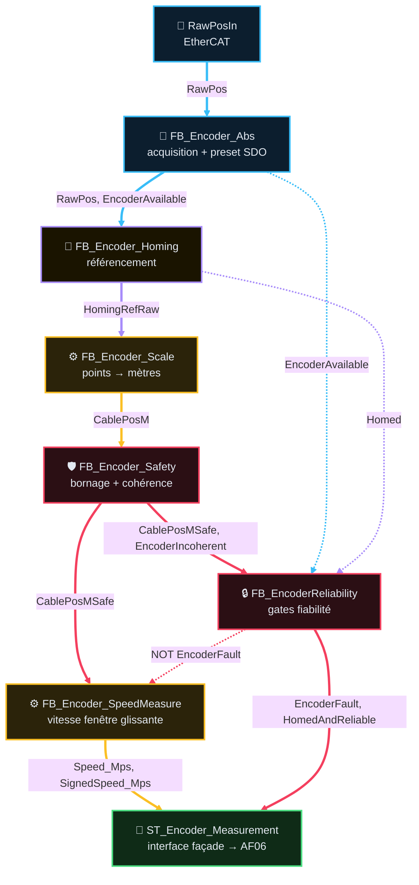

# Analyse Fonctionnelle — Partie 9 : Fonction Encoder (v2.3)

> **Version** : v2.3 — 2026-08-25 — Pipeline en Mermaid `flowchart TD` (voir §10)
> 🔗 **Dépend de** : AF02 (architecture), AF03 (contrats FB/DUT), AF06 (acquisition, `ST_EncoderMeasurements`)
> 📄 **CODE associé** : `CODE/E_CODEURS/*.st` (façade `FB_Encoder` + 7 sous-FB) · instances
> `PRG_02_Acquisition.instEncoderM1/M2`

## 📑 Sommaire

1. [🎯 Rôle et périmètre](#1--rôle-et-périmètre)
2. [🧪 Table des points de validation](#2--table-des-points-de-validation)
3. [🔄 Pipeline et composition](#3--pipeline-et-composition)
4. [🔌 Interface publique (façade `FB_Encoder`)](#4--interface-publique-façade-fb_encoder)
5. [📍 Homing (F09.02, F09.03)](#5--homing-f0902-f0903)
6. [📡 Mise à l'échelle & bornage (F09.04, F09.05, F09.06)](#6--mise-à-léchelle--bornage-f0904-f0905-f0906)
7. [⚙️ Vitesse (F09.07)](#7--vitesse-f0907)
8. [🔒 Intégration programme](#8--intégration-programme)
9. [🖥️ IHM, Configuration & Dépannage](#9--ihm-configuration--dépannage)
10. [📜 Suivi historique](#10--suivi-historique)
11. [❓ TBD](#11--tbd)
12. [📚 Documents liés](#12--documents-liés)

---

## 1 · 🎯 Rôle et périmètre

- **Rôle** : produire la position câble (m) et la vitesse (m/s) d'un treuil à partir d'un codeur
  absolu EtherCAT, avec référencement (homing) et bornage physique. 1 instance par treuil (M1/M2).
- **Périmètre strict** : acquisition brute, preset SDO, homing, mise à l'échelle, bornage,
  fiabilité, vitesse. Ne fait **pas** : décision de mouvement, pilotage frein/contacteur, calcul
  de `HomingPermit` (entrée externe, calculée par l'appelant).
- **Type de composant** : Brique de mesure (façade composite de 7 sous-FB).
- **Contrat AF03** : `standard` (remonte défaut bus/preset/homing/bornage via `Status : ST_FbStatus`
  — rempli manuellement par masques de bits dans chaque sous-FB, **pas** via le socle `FB_FbStatus`
  à `Causes[]` comme `FB_Joystick` — tolérance transitoire T137, AF03 §2).

### Table des fonctions

| ID | Fonction | Description | Réalisée par | Criticité | TC couvrants | Statut |
|---|---|---|---|---|---|---|
| `F09.01` | Acquérir position brute + gérer le preset SDO | Lit `RawPosIn`/`AlarmsIn`/`SlaveOperational` (EtherCAT), séquence l'écriture preset (déclenchement, tolérance, timeout) | `FB_Encoder_Abs` | 🟠 C3 | <nobr><code>TC-P09-010</code></nobr> | ✅ |
| `F09.02` | Référencer l'axe (homing) | 3 modes : nominal (capteur haut, front), unitaire (cible libre `CfgHomingTargetM`), dynamique (cible calculée par l'appelant, ex. benne) | `FB_Encoder_Homing` | 🟠 C3 | <nobr><code>TC-P09-020</code></nobr> | ✅ |
| `F09.03` | Détecter une incohérence codeur au redémarrage | Écart entre position au boot et dernière position connue (RETAIN) > tolérance → `HomingSuspect`, levé par `BtnConfirmCoherence` | `FB_Encoder_Homing` | 🟠 C3 | <nobr><code>TC-P09-020</code></nobr> | ✅ |
| `F09.04` | Mettre à l'échelle points → mètres | `CablePosM := (RawPos - HomingRefRaw) × CableM_PerRev / PointsPerRev` | `FB_Encoder_Scale` | 🔵 C2 | <nobr><code>TC-P09-030</code></nobr> | ✅ |
| `F09.05` | Borner physiquement + relayer l'incohérence | Hors `[PositionMinM;PositionMaxM]` (déf. ±99m) OU `HomingSuspect` → `EncoderIncoherent=TRUE` | `FB_Encoder_Safety` | 🟠 C3 | <nobr><code>TC-P09-030</code></nobr> | ✅ |
| `F09.06` | Synthétiser les gates de fiabilité | `EncoderFault := NOT Available OR Incoherent` (sans Homed) ; `HomedAndReliable := Available AND Homed AND NOT Incoherent` (gate stricte M3) | `FB_EncoderReliability` | 🟠 C3 | <nobr><code>TC-P09-040</code></nobr> | ✅ |
| `F09.07` | Mesurer la vitesse câble | Fenêtre glissante horodatée (6 échantillons, ≥50ms), signée (+ montée) | `FB_Encoder_SpeedMeasure` | 🔵 C2 | <nobr><code>TC-P09-050</code></nobr> | ✅ |

> `F09.08` (détection de variation brusque, `FB_Encoder_SpeedMonitor`) **retiré** — legacy, jamais
> instancié, fait doublon avec `F09.07` déjà en place ; voir §10 Suivi historique. ID non réattribué.
>
> `TC-P09-020` couvre `F09.02`+`F09.03` (même FB, référencement) ; `TC-P09-030` couvre
> `F09.04`+`F09.05` (échelle+bornage, même pipeline) — partage volontaire (règle guide 3-6 TC macro).

---

## 2 · 🧪 Table des points de validation

| <nobr>ID Unique</nobr> | Groupe | Comportement Attendu | <nobr>Type</nobr> | <nobr>Réf FB</nobr> |
|---|---|---|---|---|
| <nobr><code>TC-P09-010</code></nobr> | **Acquisition & preset** | Bus/esclave KO → `EncoderAvailable=FALSE`, `RawPos` gelé ; preset hors tolérance après timeout → `PresetNak` + Fault | <nobr><code>💻 AUTO</code></nobr> | <small><code>FB_Encoder_Abs</code></small> |
| <nobr><code>TC-P09-020</code></nobr> | **Homing & cohérence** | 3 modes homing bornent la cible `[-99;+99]m` avant écriture ; écart au boot > tolérance → `HomingSuspect`, levé par confirmation explicite | <nobr><code>💻 AUTO</code></nobr> | <small><code>FB_Encoder_Homing</code></small> |
| <nobr><code>TC-P09-030</code></nobr> | **Échelle & bornage** | Conversion signée exacte ; hors bornes ou suspect → `EncoderIncoherent=TRUE` | <nobr><code>💻 AUTO</code></nobr> | <small><code>FB_Encoder_Scale</code> <code>FB_Encoder_Safety</code></small> |
| <nobr><code>TC-P09-040</code></nobr> | **Fiabilité** | `EncoderFault` ne dépend pas de `Homed` (non-référencé ≠ incohérent) ; `HomedAndReliable` exige les 3 conditions | <nobr><code>💻 AUTO</code></nobr> | <small><code>FB_EncoderReliability</code></small> |
| <nobr><code>TC-P09-050</code></nobr> | **Vitesse** | `Valid=TRUE` seulement après 6 échantillons couvrant ≥50ms ; purge sur perte de validité amont | <nobr><code>💻 AUTO</code></nobr> | <small><code>FB_Encoder_SpeedMeasure</code></small> |
| <nobr><code>TC-P09-060</code></nobr> | ⛔ **RETIRÉ (v2.2)** — testait `FB_Encoder_SpeedMonitor`, FB legacy jamais instancié, retiré du code (voir §10). ID non réattribué (immutabilité `CODE_QUALITY_STANDARDS.md §0`). | — | — | — |

---

## 3 · 🔄 Pipeline et composition

Trait plein = donnée transformée · pointillé = fait consommé sans transformation (gate). Couleurs :
cyan acquisition, violet référencement, jaune calcul, rouge sécurité/fiabilité, vert sortie.

---

## 4 · 🔌 Interface publique (façade `FB_Encoder`)

### Entrées (`VAR_INPUT`)

| Port | Type | Rôle | Producteur actuel |
|---|---|---|---|
| `Enable` | `BOOL` | Active le bloc | `TRUE` fixe (`PRG_02_Acquisition`) |
| `Reset` | `BOOL` | Acquittement défaut (front) | `PRG_07_Supervision.FaultMachineReset_IHM` |
| `HomingPermit` | `BOOL` | Autorisation de homer | `Mode=MAINT_N1/N2 AND treuil sélectionné` (`PRG_02_Acquisition`) |
| `HomingAtTargetM` | `BOOL` | Demande homing nominal/unitaire (front) | `GVL_IHM.M1TreuilRetenue.Cmd.BtnHome` |
| `HomingAtZero` | `BOOL` | Force cible homing à 0.0 | `GVL_IHM...Cmd.BtnHomingAtZero` |
| `ConfirmCoherence` | `BOOL` | Lève le doute d'incohérence boot (front) | `GVL_IHM...Cmd.BtnConfirmCoherence` |
| `CfgHomingTargetM` / `CfgTopSensorPosM` | `REAL` | Cibles homing unitaire / nominal (m) | `GVL_PERSISTENT` (`_WinchM1CfgPersist`) |
| `UseDynamicTarget` / `DynamicHomingTargetM` | `BOOL` / `REAL` | Cible dynamique | **M2 seul, actif** : `M2BucketRefRequested` (front `BtnConfirmOpenPos`/`ClosePos`, MAINT_N1/N2, treuils non busy) → auto-référence M2 sur `CablePosM1` (± `OffsetCloseM`). **M1** : `FALSE`/`0.0` fixe |
| `TopPositionSensor` | `BOOL` | Capteur physique position haute | `HwIn.Winch.M1M2_TopPositionFree_DI` |
| `Hw` (`IN_OUT`) | `ST_EncoderHw` | Frontière hardware EtherCAT | `HwIn.Winch.COD1/COD2_*` |
| `PointsPerRev` / `CableM_PerRev` | `UDINT` / `REAL` | Constantes mécaniques (8192 pts/tour, 2.0 m/tour) | constantes d'appel |
| `PositionMinM` / `PositionMaxM` | `REAL` | Bornage physique (déf. ±99m) | constantes d'appel |
| `BypassGlobal` | `BOOL` | Neutralise les défauts bornage/cohérence (mise en service) | `GVL_IHM.M1TreuilRetenue.Bypass.Global` |
| `Calib` (`IN_OUT`) | `ST_Encoder_Calib` | Calibration persistante (RETAIN) | `GVL_PERSISTENT` (`_CalibM1`/`_CalibM2`) |

### Sorties (`VAR_OUTPUT`)

| Port | Type | Rôle |
|---|---|---|
| `Ready` | `BOOL` | FB prêt |
| `Status` | `ST_FbStatus` | Statut synthèse façade (agrège Abs/Safety/Homing) |
| `HwOut` | `ST_EncoderHw` | Sorties hardware (preset vers PDO) |
| `Measurement` | `ST_EncoderMeasurement` | Mesures + statuts (interface AF06) |
| `Homed` | `BOOL` | Codeur référencé |
| `HomingSuspect` | `BOOL` | Incohérence boot à confirmer |
| `EncoderFault` | `BOOL` | Gate général fiabilité (sans `Homed`) |
| `HomedAndReliable` | `BOOL` | Gate strict M3 (disponible ET référencé ET pas incohérent) |

**Gate** (`NOT Enable`) : reset complet sauf `Homed`/`HomingSuspect`/`HomingRefRaw` qui restent
alimentés depuis `Calib` (RETAIN) — un FB désactivé ne doit pas faire perdre la référence connue
aux consommateurs (`FB_Encoder_Scale` en a besoin même désactivé).

---

## 5 · 📍 Homing (F09.02, F09.03)

3 déclenchements, tous conditionnés par `HomingPermit` :

| Mode | Déclenchement | Cible |
|---|---|---|
| Nominal | Front `Home` ET front capteur haut (capture au front, pas après arrêt confirmé — la vitesse d'accostage doit rester constante) | `CfgTopSensorPosM` (déf. 8.5m) |
| Unitaire | Front `Home` (MAINT_N2 typiquement) | `CfgHomingTargetM` (libre) |
| Dynamique | Front `UseDynamicTarget` ou (`UseDynamicTarget` ET front `Home`) | `DynamicHomingTargetM` (calculée par l'appelant, ex. benne) |

Toute cible est **bornée `[-99;+99]m` avant écriture** (`CODE_QUALITY_STANDARDS §6`), quelle que
soit son origine — hors plage, homing refusé (`ErrorId` bit4).

**Cohérence au redémarrage** (F09.03) : au premier scan où le codeur répond après `Enable`, écart
entre `RawPos` et `Calib.LastKnownRawPos` (RETAIN) > tolérance (déf. 1000 pts, ~12% d'un tour) →
`HomingSuspect=TRUE`, `Homed` retombe `FALSE` (référence non fiable). Levé uniquement par
`BtnConfirmCoherence` (front, indépendant du `Reset` générique) — pas d'auto-effacement.

### Procédure terrain (nominal, benne fermée)

1. Confirmation visuelle benne fermée (opérateur, avant tout mouvement) — tant que M1/M2 ne sont
   pas référencés, `CablePosM` est potentiellement faux, aucun interlock position n'est fiable.
2. Monter M1+M2 au capteur haut → relâcher (arrêt confirmé) → `BtnHome` → `Homed` sur les 2
   instances indépendamment. `HomingRefRaw` calculé, `CablePosM ≈ CfgTopSensorPosM`.
3. Une fois référencé, `CablePosM` redevient fiable pour les interlocks aval (benne, treuils).

**Unitaire (MAINT_N2)** : sélectionner treuil → manœuvrer → arrêt confirmé → `CfgHomingTargetM` →
`BtnHome`. **`BtnHomingAtZero`** : force homing au centre exact (0.0m), usage mise en service.

---

## 6 · 📡 Mise à l'échelle & bornage (F09.04, F09.05, F09.06)

`CablePosM := (RawPos − HomingRefRaw) × CableM_PerRev / PointsPerRev` — signée (+ enroulé, − sous
l'eau). Conversion `DINT` **avant** soustraction (jamais l'inverse, évite un dépassement).

| Mécanisme | Détection | Effet |
|---|---|---|
| Bornage physique (bit0) | Hors `[PositionMinM;PositionMaxM]` (déf. ±99m) | `EncoderIncoherent=TRUE`, auto-effacé au retour en plage |
| Relais cohérence boot (bit1) | `HomingSuspect=TRUE` | `EncoderIncoherent=TRUE`, tant que non confirmé |
| `BypassGlobal` | Neutralise les 2 causes ci-dessus | Mise en service uniquement |

`FB_EncoderReliability` (calcul combinatoire pur, sans mémoire) synthétise 2 gates distincts :
- `EncoderFault := NOT EncoderAvailable OR EncoderIncoherent` — **sans** `Homed` (non-référencé
  ≠ incohérent) : sert la fiabilité de mesure (vitesse, mouvements).
- `HomedAndReliable := EncoderAvailable AND Homed AND NOT EncoderIncoherent` — gate **stricte**,
  réservée aux interlocks qui exigent une position connue (ex. hauteur M3).

---

## 7 · ⚙️ Vitesse (F09.07)

`FB_Encoder_SpeedMeasure` : fenêtre glissante horodatée (`TIME()` natif, pas un cycle supposé) —
6 échantillons espacés ≥10ms, `Valid=TRUE` seulement si la fenêtre couvre ≥50ms. Purge complète
sur `Reset`, perte `PositionValid`, ou rebouclage `TIME` détecté.

---

## 8 · 🔒 Intégration programme

`instEncoderM1`/`instEncoderM2` (façade `FB_Encoder`, **homing inclus**) : `PRG_02_Acquisition`
(rang 01), publiés dans `Data.*` puis `ST_EncoderMeasurements` (AF06 §2ter — agrégation
`EncoderFault`, consommateurs Modes/Safety/IHM, **détail non dupliqué ici**).

**Architecture actée (2026-08-25)** : la chaîne codeur complète (Abs→Homing→Scale→Safety→
Reliability→Speed) est regroupée dans une façade unique `FB_Encoder`, entièrement instanciée dans
`PRG_02_Acquisition`. Ceci **remplace** une décision antérieure (« A-01 », v2.1) qui prévoyait de
déplacer le homing seul vers `PRG_04_Treuils_Benne` pour corriger un ordre de lecture — cette
migration n'a jamais été implémentée, et n'est plus la cible : le regroupement en façade est le
choix retenu (décision utilisateur).

Conséquence acceptée : `HomingPermit` (calculé dans `PRG_02_Acquisition.st:341`) lit
`PRG_03_Modes_Cycle.Auth.Mode`, produit au rang 03 — **retard d'un scan (10ms)**, même schéma que
`HomingRefRaw` déjà accepté (AF06 §2ter, note A-01 bis) : sans conséquence, le homing est un acte
volontaire et rare (front bouton + arrêt confirmé), pas une commande temps réel.

Consommateurs directs de la façade (hors AF06) :
- `PRG_04_Treuils_Benne` : `Homed`, `HomingSuspect`, `Measurement.HomingStatus.Busy` (affichage
  checklist maintenance), `Speed_Mps`/`SignedSpeed_Mps` (entrée `FB_Safety_Winch`, détection
  mouvement non commandé — Méca A).

---

## 9 · 🖥️ IHM, Configuration & Dépannage

`ST_EncoderHMI` = état seul (pas de `Cmd` dédié — les commandes homing vivent dans
`ST_WinchHMI.Cmd` du treuil porteur) : `RawPos`, `Alarms`/`Warnings`, `SlaveOperational`,
`Homed`/`HomingBusy`/`HomingDone`/`HomingSuspect`/`HomingRefRaw`, `Error`/`ErrorId`.

| Réglage | Persistant ? | Réglable depuis un écran IHM ? |
|---|---|---|
| `Calib` (`HomingRefRaw`, `LastKnownRawPos`, `Homed`, `HomingSuspect`) | ✅ `GVL_PERSISTENT` (`_CalibM1`/`_CalibM2`) | ❌ résultat de calcul, pas un réglage direct |
| `CfgHomingTargetM` / `CfgTopSensorPosM` | ✅ `GVL_PERSISTENT` (`_WinchM1CfgPersist`) | ❌ force CODESYS direct uniquement |
| `PositionMinM`/`PositionMaxM`, `PointsPerRev`, `CableM_PerRev` | ❌ constantes d'appel | ❌ |

`Bypass` : `GVL_IHM.M1TreuilRetenue.Bypass.Global` neutralise bornage + cohérence boot (mise en
service) — **existe réellement**, exposé IHM (contrairement au bypass CAN évoqué pour AF08 qui
vivait ailleurs).

Dépannage (`GVL_Troubleshooting.HomingM1`/`HomingM2 : ST_HomingChecklist`) : vue chronologique
dédiée (AF14) — pointeur, pas de duplication ici.

🚫 La simulation reste hors de cette section (AF13, `FB_Sim_Encoder` si existant — à vérifier §11).

---

## 10 · 📜 Suivi historique

- **v2.2 → v2.3 (2026-08-25)** : Pipeline §3 converti en Mermaid `flowchart TD` (vertical, flèches
  étiquetées, couleurs par domaine) — remplace le schéma texte muet, standard
  `GUIDE_EDITION_AF_v1.0.md §3bis`.
- **v2.1 → v2.2 (2026-08-25)** : refonte format selon `GUIDE_EDITION_AF_v1.0.md` — 6 fiches FB
  éclatées (v2.1) redevenues un chapô unique décrivant la façade `FB_Encoder` (les sous-fiches
  détaillées par FB restent à traiter séparément, v1.0→v1.1, une fois ce chapô validé).
- **`FB_Encoder_SpeedMonitor` retiré** (2026-08-25) : legacy confirmé — `FB_Encoder_SpeedMeasure`
  couvre déjà la mesure de vitesse, `FB_Encoder_SpeedMonitor` (détection de variation, jamais
  instancié dans `CODE/`) faisait doublon fonctionnel. Sa référence à une tâche `T45` inexistante
  dans `TASKS.yaml` actuel confirme l'obsolescence. Code déplacé vers
  `ARCHIVES/Code/E_CODEURS/FB_Encoder_SpeedMonitor.st`, sous-fiche déplacée vers
  `ARCHIVES/Doc/FB_Encoder_SpeedMonitor_v1.0.md` (décision utilisateur).
- **Décision A-01 (v2.1) superséde** (2026-08-25) : la migration du homing seul vers
  `PRG_04_Treuils_Benne`, documentée « DÉCIDÉ » en v2.1 §4bis, n'a jamais été implémentée. La
  façade unique `FB_Encoder` (homing inclus, dans `PRG_02_Acquisition`) est désormais
  l'architecture retenue — voir §8.
- Archive : `ARCHIVES/Doc/AF_Partie-09_Fonction_Encoder_v2.0.md` (si existant, à vérifier lors de
  l'archivage v2.1).

---

## 11 · ❓ TBD

- **`CodeSeqTriggerCmd`** (`FB_Encoder_Abs`) : rôle non identifié sur le bus, laissé à 0 par
  construction (commentaire code explicite) — à confirmer avant de jamais le piloter.
- Existence de `FB_Sim_Encoder` (simulation codeur, AF13) : à vérifier lors du lot simulation.
- Bits `ErrorId` de `FB_Encoder_Homing` non tous documentés/utilisés (0, 4, 5, 9 utilisés ; 1-3,
  6-8 libres) — mineur, à couvrir si un nouveau défaut homing apparaît.
- Incohérence de suffixe d'unité : `CfgTopSensorPosM`/`CfgHomingTargetM`/`PositionMinM`/`PositionMaxM`
  (sans `_`) vs `Speed_Mps`/`SignedSpeed_Mps` (avec `_`, conforme `NAMING_CONVENTION.md`) — lot de
  renommage dédié à trancher séparément, ne pas migrer au fil de l'eau (casse IHM/bundle).
- **AF10 à corriger** : `AF_Partie-10_Fonction_Winch_v2.1.md` §4.2 liste encore `instSpeedMonitorM1/M2`
  comme faisant partie de l'architecture cible de `PRG_04_Treuils_Benne` — obsolète depuis le
  retrait de `FB_Encoder_SpeedMonitor` (ci-dessus). À corriger quand AF10 sera traitée.

---

## 12 · 📚 Documents liés

| Doc | Lien |
|---|---|
| AF02 | Architecture programme, `PRG_02_Acquisition` |
| AF03 | Contrat `standard`, tolérance T137 (Status à plat) |
| AF06 | `ST_EncoderMeasurements` (M1/M2), agrégation `EncoderFault`, consommateurs Modes/Safety |
| AF10 | Consommateur `Speed_Mps`/`Homed` (`FB_Safety_Winch`, treuils) |
| AF14 | `ST_HomingChecklist` |
| Code | `CODE/E_CODEURS/FB_Encoder.st` (façade) + 7 sous-FB |
