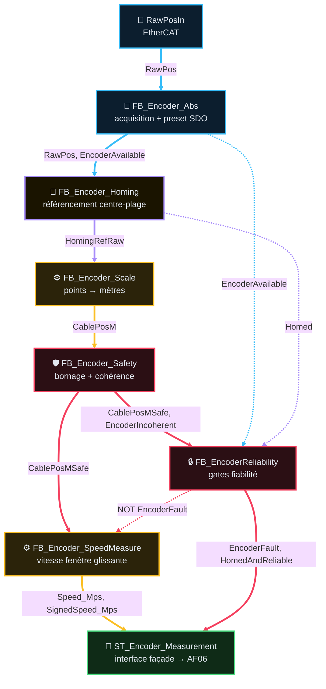

# Analyse Fonctionnelle — Partie 9 : Fonction Encoder (v2.4)

> **Version** : v2.4 — 2026-08-30 — Exigence preset **centre-plage** + garde anti-dépassement
> (diagnostic `TROUBLESHOOTING_PresetCodeurHorsCentrePlage_20260830.md`)
> 🔗 **Dépend de** : AF02 (architecture), AF03 (contrats FB/DUT), AF06 (acquisition, `ST_EncoderMeasurements`)
> 📄 **CODE associé** : `CODE/E_CODEURS/*.st` (façade `FB_Encoder` + 7 sous-FB) · instances
> `PRG_02_Acquisition.instEncoderM1/M2`

## 📑 Sommaire

1. [🎯 Rôle et périmètre](#1-rôle-et-périmètre)
2. [🧪 Table des points de validation](#2-table-des-points-de-validation)
3. [🔄 Pipeline et composition](#3-pipeline-et-composition)
4. [🔌 Interface publique (façade `FB_Encoder`)](#4-interface-publique-façade-fb_encoder)
5. [📍 Homing (F09.02, F09.03, F09.08)](#5-homing-f0902-f0903-f0908)
6. [📡 Mise à l'échelle & bornage (F09.04, F09.05, F09.06)](#6-mise-à-léchelle-bornage-f0904-f0905-f0906)
7. [⚙️ Vitesse (F09.07)](#7-vitesse-f0907)
8. [🔒 Intégration programme](#8-intégration-programme)
9. [🖥️ IHM, Configuration & Dépannage](#9-ihm-configuration-dépannage)
10. [📜 Suivi historique](#10-suivi-historique)
11. [❓ TBD](#11-tbd)
12. [📚 Documents liés](#12-documents-liés)
13. [🔧 Transaction preset E-D1 (T164-4C)](#13-transaction-preset-e-d1-t164-4c)
14. [🧩 Brique défaut façade `Fault : ST_Fault` (T164-4D)](#14-brique-défaut-façade-fault-st_fault-t164-4d)

---

## 1 · 🎯 Rôle et périmètre

- **Rôle** : produire la position câble (m) et la vitesse (m/s) d'un treuil à partir d'un codeur
  absolu EtherCAT, avec référencement (homing) et bornage physique. 1 instance par treuil (M1/M2).
- **Périmètre strict** : acquisition brute, preset SDO **centré en plage**, homing, mise à
  l'échelle, bornage, fiabilité, vitesse. Ne fait **pas** : décision de mouvement, pilotage
  frein/contacteur, calcul de `HomingPermit` (entrée externe, calculée par l'appelant).
- **Invariant de plage (F09.08)** : tout référencement place le compteur du codeur au **centre de
  sa plage de résolution totale** — la sémantique mètres est portée uniquement par la référence
  applicative `HomingRefRaw` (RETAIN), jamais par la valeur brute du compteur.
- **Type de composant** : Brique de mesure (façade composite de 7 sous-FB).
- **Contrat AF03** : `standard`. Forme cible = `Fault : ST_Fault` rempli via `FB_FaultCore`
  (AF03 §3 / §4.1). **Implémenté (T164-4D)** : la façade expose `Fault : ST_Fault` alimenté par
  `instFault : FB_FaultCore` depuis une liste de causes en clair `instCauses` (pattern
  `FB_Joystick`). Les sous-FB (Abs/Homing/Safety) conservent `Status : ST_Status` (forme legacy
  tolérée jusqu'à T164-5, AF03 §3 point 4) ; la télémétrie fine reste exposée via
  `Measurement.AbsStatus` / `Measurement.HomingStatus`.

### 🎯 Table des fonctions

> **État** — `V` validé, implémentation non vérifiée · `V-I` validé et implémenté · `NV` non validé, non implémenté · `NV-I` code présent mais non validé · `R` refusé · `NA` non applicable.
> ⚠️ **v2.4** : F09.01/F09.02/F09.08 — le code actuel (preset neutre `PresetValue := RawPos`,
> commit `73fa758d`) **ne satisfait pas** l'exigence centre-plage : divergence spec/code ouverte,
> correction planifiée (fiche `TROUBLESHOOTING_PresetCodeurHorsCentrePlage_20260830.md`).

<table style="width: 100%; table-layout: fixed; border-collapse: collapse; font-size: 14px;">
  <colgroup>
    <col style="width: 40px;">
    <col style="width: 140px;">
    <col style="width: calc(100% - 520px);">
    <col style="width: 110px;">
    <col style="width: 50px;">
    <col style="width: 90px;">
    <col style="width: 50px;">
    <col style="width: 40px;">
  </colgroup>
  <thead>
    <tr style="border-bottom: 2px solid #475569; text-align: left;">
      <th style="padding: 4px 1px; text-align: center;"><small><b>ID</b></small></th>
      <th style="padding: 4px 1px; text-align: center;"><small>Fonction</small></th>
      <th style="padding: 4px 8px;">Description</th>
      <th style="padding: 4px 1px; text-align: center;"><small>Réalisée par</small></th>
      <th style="padding: 4px 1px; text-align: center;"><small>Criticité</small></th>
      <th style="padding: 4px 1px; text-align: center;"><small>TC couvrants</small></th>
      <th style="padding: 4px 1px; text-align: center;"><small>Statut</small></th>
      <th style="padding: 4px 1px; text-align: center;"><small>État</small></th>
    </tr>
  </thead>
  <tbody>
    <tr style="border-bottom: 1px solid rgba(255,255,255,0.08);">
      <td style="padding: 4px 1px; text-align: center; vertical-align: middle;"><span style="writing-mode: vertical-rl; transform: rotate(180deg); display: inline-block; font-family: monospace; font-size: 11.5px; font-weight: bold; letter-spacing: 0.5px;">F09.01</span></td>
      <td style="padding: 4px 1px; text-align: center; vertical-align: middle;"><small><b>Acquérir position brute + gérer le preset SDO</b></small></td>
      <td style="padding: 6px 8px; line-height: 1.55;">Lit <code>RawPosIn</code>/<code>AlarmsIn</code>/<code>SlaveOperational</code> (EtherCAT), séquence l'écriture preset (déclenchement, tolérance, timeout) — la valeur preset transmise est produite par <code>FB_Encoder_Homing</code> (centre-plage, F09.08)</td>
      <td style="padding: 4px 1px; text-align: center; vertical-align: middle;"><small><code>FB_Encoder_Abs</code></small></td>
      <td style="padding: 4px 1px; text-align: center; vertical-align: middle;"><small>🟠 C3</small></td>
      <td style="padding: 4px 1px; text-align: center; vertical-align: middle;"><span style="font-family: monospace; font-size: 11.5px; font-weight: bold; letter-spacing: 0.5px;">TC-P09-010</span></td>
      <td style="padding: 4px 1px; text-align: center; vertical-align: middle;"><small>⚠️</small></td>
      <td style="padding: 4px 1px; text-align: center; vertical-align: middle;"><small><code>NV-I</code></small></td>
    </tr>
    <tr style="border-bottom: 1px solid rgba(255,255,255,0.08);">
      <td style="padding: 4px 1px; text-align: center; vertical-align: middle;"><span style="writing-mode: vertical-rl; transform: rotate(180deg); display: inline-block; font-family: monospace; font-size: 11.5px; font-weight: bold; letter-spacing: 0.5px;">F09.02</span></td>
      <td style="padding: 4px 1px; text-align: center; vertical-align: middle;"><small><b>Référencer l'axe (homing)</b></small></td>
      <td style="padding: 6px 8px; line-height: 1.55;">3 modes : nominal (capteur haut, front), unitaire (cible libre <code>CfgHomingTargetM</code>), dynamique (cible calculée par l'appelant, ex. benne). Toute cible est gravée dans le référentiel <strong>centre-plage</strong> (F09.08)</td>
      <td style="padding: 4px 1px; text-align: center; vertical-align: middle;"><small><code>FB_Encoder_Homing</code></small></td>
      <td style="padding: 4px 1px; text-align: center; vertical-align: middle;"><small>🟠 C3</small></td>
      <td style="padding: 4px 1px; text-align: center; vertical-align: middle;"><span style="font-family: monospace; font-size: 11.5px; font-weight: bold; letter-spacing: 0.5px;">TC-P09-020</span></td>
      <td style="padding: 4px 1px; text-align: center; vertical-align: middle;"><small>⚠️</small></td>
      <td style="padding: 4px 1px; text-align: center; vertical-align: middle;"><small><code>NV-I</code></small></td>
    </tr>
    <tr style="border-bottom: 1px solid rgba(255,255,255,0.08);">
      <td style="padding: 4px 1px; text-align: center; vertical-align: middle;"><span style="writing-mode: vertical-rl; transform: rotate(180deg); display: inline-block; font-family: monospace; font-size: 11.5px; font-weight: bold; letter-spacing: 0.5px;">F09.03</span></td>
      <td style="padding: 4px 1px; text-align: center; vertical-align: middle;"><small><b>Détecter une incohérence codeur au redémarrage</b></small></td>
      <td style="padding: 6px 8px; line-height: 1.55;">Écart entre position au boot et dernière position connue (RETAIN) &gt; tolérance → <code>HomingSuspect</code>, levé par <code>BtnConfirmCoherence</code></td>
      <td style="padding: 4px 1px; text-align: center; vertical-align: middle;"><small><code>FB_Encoder_Homing</code></small></td>
      <td style="padding: 4px 1px; text-align: center; vertical-align: middle;"><small>🟠 C3</small></td>
      <td style="padding: 4px 1px; text-align: center; vertical-align: middle;"><span style="font-family: monospace; font-size: 11.5px; font-weight: bold; letter-spacing: 0.5px;">TC-P09-020</span></td>
      <td style="padding: 4px 1px; text-align: center; vertical-align: middle;"><small>✅</small></td>
      <td style="padding: 4px 1px; text-align: center; vertical-align: middle;"><small><code>NV-I</code></small></td>
    </tr>
    <tr style="border-bottom: 1px solid rgba(255,255,255,0.08);">
      <td style="padding: 4px 1px; text-align: center; vertical-align: middle;"><span style="writing-mode: vertical-rl; transform: rotate(180deg); display: inline-block; font-family: monospace; font-size: 11.5px; font-weight: bold; letter-spacing: 0.5px;">F09.04</span></td>
      <td style="padding: 4px 1px; text-align: center; vertical-align: middle;"><small><b>Mettre à l'échelle points → mètres</b></small></td>
      <td style="padding: 6px 8px; line-height: 1.55;"><code>CablePosM := (RawPos - HomingRefRaw) × CableM_PerRev / PointsPerRev</code></td>
      <td style="padding: 4px 1px; text-align: center; vertical-align: middle;"><small><code>FB_Encoder_Scale</code></small></td>
      <td style="padding: 4px 1px; text-align: center; vertical-align: middle;"><small>🔵 C2</small></td>
      <td style="padding: 4px 1px; text-align: center; vertical-align: middle;"><span style="font-family: monospace; font-size: 11.5px; font-weight: bold; letter-spacing: 0.5px;">TC-P09-030</span></td>
      <td style="padding: 4px 1px; text-align: center; vertical-align: middle;"><small>✅</small></td>
      <td style="padding: 4px 1px; text-align: center; vertical-align: middle;"><small><code>NV-I</code></small></td>
    </tr>
    <tr style="border-bottom: 1px solid rgba(255,255,255,0.08);">
      <td style="padding: 4px 1px; text-align: center; vertical-align: middle;"><span style="writing-mode: vertical-rl; transform: rotate(180deg); display: inline-block; font-family: monospace; font-size: 11.5px; font-weight: bold; letter-spacing: 0.5px;">F09.05</span></td>
      <td style="padding: 4px 1px; text-align: center; vertical-align: middle;"><small><b>Borner physiquement + relayer l'incohérence</b></small></td>
      <td style="padding: 6px 8px; line-height: 1.55;">Hors <code>[PositionMinM;PositionMaxM]</code> (déf. ±99m) OU <code>HomingSuspect</code> → <code>EncoderIncoherent=TRUE</code></td>
      <td style="padding: 4px 1px; text-align: center; vertical-align: middle;"><small><code>FB_Encoder_Safety</code></small></td>
      <td style="padding: 4px 1px; text-align: center; vertical-align: middle;"><small>🟠 C3</small></td>
      <td style="padding: 4px 1px; text-align: center; vertical-align: middle;"><span style="font-family: monospace; font-size: 11.5px; font-weight: bold; letter-spacing: 0.5px;">TC-P09-030</span></td>
      <td style="padding: 4px 1px; text-align: center; vertical-align: middle;"><small>✅</small></td>
      <td style="padding: 4px 1px; text-align: center; vertical-align: middle;"><small><code>NV-I</code></small></td>
    </tr>
    <tr style="border-bottom: 1px solid rgba(255,255,255,0.08);">
      <td style="padding: 4px 1px; text-align: center; vertical-align: middle;"><span style="writing-mode: vertical-rl; transform: rotate(180deg); display: inline-block; font-family: monospace; font-size: 11.5px; font-weight: bold; letter-spacing: 0.5px;">F09.06</span></td>
      <td style="padding: 4px 1px; text-align: center; vertical-align: middle;"><small><b>Synthétiser les gates de fiabilité</b></small></td>
      <td style="padding: 6px 8px; line-height: 1.55;"><code>EncoderFault := NOT Available OR Incoherent</code> (sans Homed) ; <code>HomedAndReliable := Available AND Homed AND NOT Incoherent</code> (gate stricte M3)</td>
      <td style="padding: 4px 1px; text-align: center; vertical-align: middle;"><small><code>FB_EncoderReliability</code></small></td>
      <td style="padding: 4px 1px; text-align: center; vertical-align: middle;"><small>🟠 C3</small></td>
      <td style="padding: 4px 1px; text-align: center; vertical-align: middle;"><span style="font-family: monospace; font-size: 11.5px; font-weight: bold; letter-spacing: 0.5px;">TC-P09-040</span></td>
      <td style="padding: 4px 1px; text-align: center; vertical-align: middle;"><small>✅</small></td>
      <td style="padding: 4px 1px; text-align: center; vertical-align: middle;"><small><code>NV-I</code></small></td>
    </tr>
    <tr style="border-bottom: 1px solid rgba(255,255,255,0.08);">
      <td style="padding: 4px 1px; text-align: center; vertical-align: middle;"><span style="writing-mode: vertical-rl; transform: rotate(180deg); display: inline-block; font-family: monospace; font-size: 11.5px; font-weight: bold; letter-spacing: 0.5px;">F09.07</span></td>
      <td style="padding: 4px 1px; text-align: center; vertical-align: middle;"><small><b>Mesurer la vitesse câble</b></small></td>
      <td style="padding: 6px 8px; line-height: 1.55;">Fenêtre glissante horodatée (6 échantillons, ≥50ms), signée (+ montée)</td>
      <td style="padding: 4px 1px; text-align: center; vertical-align: middle;"><small><code>FB_Encoder_SpeedMeasure</code></small></td>
      <td style="padding: 4px 1px; text-align: center; vertical-align: middle;"><small>🔵 C2</small></td>
      <td style="padding: 4px 1px; text-align: center; vertical-align: middle;"><span style="font-family: monospace; font-size: 11.5px; font-weight: bold; letter-spacing: 0.5px;">TC-P09-050</span></td>
      <td style="padding: 4px 1px; text-align: center; vertical-align: middle;"><small>✅</small></td>
      <td style="padding: 4px 1px; text-align: center; vertical-align: middle;"><small><code>NV-I</code></small></td>
    </tr>
    <tr style="border-bottom: 1px solid rgba(255,255,255,0.08);">
      <td style="padding: 4px 1px; text-align: center; vertical-align: middle;"><span style="writing-mode: vertical-rl; transform: rotate(180deg); display: inline-block; font-family: monospace; font-size: 11.5px; font-weight: bold; letter-spacing: 0.5px;">F09.08</span></td>
      <td style="padding: 4px 1px; text-align: center; vertical-align: middle;"><small><b>Centrer le compteur au référencement (garde anti-dépassement)</b></small></td>
      <td style="padding: 6px 8px; line-height: 1.55;">Tout référencement (nominal, unitaire, forcé, dynamique benne) écrit au codeur le <strong>centre de sa plage de résolution</strong> <code>(PointsPerRev × MultiTurnRevsMax)/2</code> (déf. 16 777 216 pts = 16#1000000) et grave <code>HomingRefRaw</code> dans ce référentiel. La course physique (~20 m ≈ 1% de la plage) ne peut jamais atteindre les bornes 0 / 2^25 : le wrap-around du compteur est physiquement impossible</td>
      <td style="padding: 4px 1px; text-align: center; vertical-align: middle;"><small><code>FB_Encoder_Homing</code><br><code>FB_Encoder_Abs</code></small></td>
      <td style="padding: 4px 1px; text-align: center; vertical-align: middle;"><small>🟠 C3</small></td>
      <td style="padding: 4px 1px; text-align: center; vertical-align: middle;"><span style="font-family: monospace; font-size: 11.5px; font-weight: bold; letter-spacing: 0.5px;">TC-P09-070</span></td>
      <td style="padding: 4px 1px; text-align: center; vertical-align: middle;"><small>⬜</small></td>
      <td style="padding: 4px 1px; text-align: center; vertical-align: middle;"><small><code>NV</code></small></td>
    </tr>
  </tbody>
</table>

> `F09.08` (détection de variation brusque, `FB_Encoder_SpeedMonitor`) **retiré** — legacy, jamais
> instancié, fait doublon avec `F09.07` déjà en place ; voir §10 Suivi historique. ID non réattribué.
> *(Historique : l'ID « F09.08 » a brièvement désigné cette fonction retirée en v2.2-v2.3 ;
> réattribué en v2.4 à la garde centre-plage — l'ancienne fonction n'existe plus ni en code ni en
> spec, aucune collision d'identifiant n'est possible.)*
>
> `TC-P09-020` couvre `F09.02`+`F09.03` (même FB, référencement) ; `TC-P09-030` couvre
> `F09.04`+`F09.05` (échelle+bornage, même pipeline) — partage volontaire (règle guide 3-6 TC macro).

---

## 🧪 2 · Table des points de validation

> **État** — `V` validé, implémentation non vérifiée · `V-I` validé et implémenté · `NV` non validé, non implémenté · `NV-I` code présent mais non validé · `R` refusé · `NA` non applicable.

<table style="width: 100%; table-layout: fixed; border-collapse: collapse; font-size: 14px;">
  <colgroup>
    <col style="width: 28px;">
    <col style="width: 50px;">
    <col style="width: calc(100% - 165px);">
    <col style="width: 45px;">
    <col style="width: 26px;">
    <col style="width: 36px;">
  </colgroup>
  <thead>
    <tr style="border-bottom: 2px solid #475569; text-align: left;">
      <th style="padding: 4px 1px; text-align: center;"><small><b>ID</b></small></th>
      <th style="padding: 4px 1px; text-align: center;"><small>Intention</small></th>
      <th style="padding: 4px 8px;">Séquence & Déroulé des étapes (Comportement attendu)</th>
      <th style="padding: 4px 1px; text-align: center;"><small>Type</small></th>
      <th style="padding: 4px 1px; text-align: center;"><small>Réf</small></th>
      <th style="padding: 4px 1px; text-align: center;"><small>État</small></th>
    </tr>
  </thead>
  <tbody>
    <tr style="border-bottom: 1px solid rgba(255,255,255,0.08);">
      <td style="padding: 4px 1px; text-align: center; vertical-align: middle;"><span style="writing-mode: vertical-rl; transform: rotate(180deg); display: inline-block; font-family: monospace; font-size: 11.5px; font-weight: bold; letter-spacing: 0.5px;">TC-P09-010</span></td>
      <td style="padding: 4px 1px; text-align: center; vertical-align: middle;"><small><b>Acquisition</b><br>&amp; preset</small></td>
      <td style="padding: 6px 8px; line-height: 1.55;">
        💤 <b>Étape 0</b> : Bus EtherCAT opérationnel, <code>EncoderAvailable=TRUE</code><br>
        🚀 <b>Étape 1</b> : Perte bus/esclave (<code>AlarmsIn≠0</code> ou <code>NOT SlaveOperational</code>)<br>
        ⚡ <b>Étape 2</b> : <code>EncoderAvailable=FALSE</code>, <code>RawPos</code> gelé (dernière valeur conservée)<br>
        ⚡ <b>Étape 3</b> : Front <code>PresetRequest</code> + écart hors tolérance après timeout <code>PresetTimeout</code><br>
        ✅ <b>Étape 4</b> : <code>PresetNak</code> + <code>ErrorId</code> bit1 (Fault) levé
      </td>
      <td style="padding: 4px 1px; text-align: center;"><small><code>💻 AUTO</code></small></td>
      <td style="padding: 4px 1px; text-align: center;"><small>FB_Encoder_Abs</small></td>
      <td style="padding: 4px 1px; text-align: center;"><small><code>NV-I</code></small></td>
    </tr>
    <tr style="border-bottom: 1px solid rgba(255,255,255,0.08);">
      <td style="padding: 4px 1px; text-align: center; vertical-align: middle;"><span style="writing-mode: vertical-rl; transform: rotate(180deg); display: inline-block; font-family: monospace; font-size: 11.5px; font-weight: bold; letter-spacing: 0.5px;">TC-P09-020</span></td>
      <td style="padding: 4px 1px; text-align: center; vertical-align: middle;"><small><b>Homing</b><br>&amp; cohérence</small></td>
      <td style="padding: 6px 8px; line-height: 1.55;">
        💤 <b>Étape 0</b> : Codeur disponible, <code>Homed=FALSE</code><br>
        🚀 <b>Étape 1</b> : Front <code>Home</code> (3 modes : nominal/unitaire/dynamique), cible bornée <code>[-99;+99]m</code> avant écriture<br>
        ⚡ <b>Étape 2</b> : Écart au boot <code>RawPos</code> vs <code>Calib.LastKnownRawPos</code> &gt; tolérance (1000 pts)<br>
        ⚡ <b>Étape 3</b> : <code>HomingSuspect=TRUE</code>, <code>Homed=FALSE</code> (référence non fiable)<br>
        ✅ <b>Étape 4</b> : Levé uniquement par <code>BtnConfirmCoherence</code> (front explicite, pas d'auto-effacement)
      </td>
      <td style="padding: 4px 1px; text-align: center;"><small><code>💻 AUTO</code></small></td>
      <td style="padding: 4px 1px; text-align: center;"><small>FB_Encoder_Homing</small></td>
      <td style="padding: 4px 1px; text-align: center;"><small><code>NV</code></small></td>
    </tr>
    <tr style="border-bottom: 1px solid rgba(255,255,255,0.08);">
      <td style="padding: 4px 1px; text-align: center; vertical-align: middle;"><span style="writing-mode: vertical-rl; transform: rotate(180deg); display: inline-block; font-family: monospace; font-size: 11.5px; font-weight: bold; letter-spacing: 0.5px;">TC-P09-030</span></td>
      <td style="padding: 4px 1px; text-align: center; vertical-align: middle;"><small><b>Échelle</b><br>&amp; bornage</small></td>
      <td style="padding: 6px 8px; line-height: 1.55;">
        💤 <b>Étape 0</b> : <code>HomingRefRaw</code> mémorisé, conversion <code>DINT</code> avant soustraction (évite dépassement)<br>
        🚀 <b>Étape 1</b> : Calcul <code>CablePosM := (RawPos - HomingRefRaw) × CableM_PerRev / PointsPerRev</code> — signée exacte<br>
        ⚡ <b>Étape 2</b> : <code>CablePosM</code> hors <code>[PositionMinM;PositionMaxM]</code> ou <code>HomingSuspect=TRUE</code><br>
        ✅ <b>Étape 3</b> : <code>EncoderIncoherent=TRUE</code> (auto-effacé au retour en plage)
      </td>
      <td style="padding: 4px 1px; text-align: center;"><small><code>💻 AUTO</code></small></td>
      <td style="padding: 4px 1px; text-align: center;"><small>FB_Encoder_Scale<br>FB_Encoder_Safety</small></td>
      <td style="padding: 4px 1px; text-align: center;"><small><code>NV</code></small></td>
    </tr>
    <tr style="border-bottom: 1px solid rgba(255,255,255,0.08);">
      <td style="padding: 4px 1px; text-align: center; vertical-align: middle;"><span style="writing-mode: vertical-rl; transform: rotate(180deg); display: inline-block; font-family: monospace; font-size: 11.5px; font-weight: bold; letter-spacing: 0.5px;">TC-P09-040</span></td>
      <td style="padding: 4px 1px; text-align: center; vertical-align: middle;"><small><b>Fiabilité</b><br>gates</small></td>
      <td style="padding: 6px 8px; line-height: 1.55;">
        💤 <b>Étape 0</b> : Codeur disponible, non référencé (<code>Homed=FALSE</code>)<br>
        🚀 <b>Étape 1</b> : Évaluation <code>EncoderFault := NOT Available OR Incoherent</code> (sans <code>Homed</code>)<br>
        ⚡ <b>Étape 2</b> : <code>HomedAndReliable := Available AND Homed AND NOT Incoherent</code> — gate stricte M3<br>
        ✅ <b>Étape 3</b> : Non-référencé ≠ incohérent — <code>EncoderFault</code> n'exige pas <code>Homed</code>
      </td>
      <td style="padding: 4px 1px; text-align: center;"><small><code>💻 AUTO</code></small></td>
      <td style="padding: 4px 1px; text-align: center;"><small>FB_EncoderReliability</small></td>
      <td style="padding: 4px 1px; text-align: center;"><small><code>NV</code></small></td>
    </tr>
    <tr style="border-bottom: 1px solid rgba(255,255,255,0.08);">
      <td style="padding: 4px 1px; text-align: center; vertical-align: middle;"><span style="writing-mode: vertical-rl; transform: rotate(180deg); display: inline-block; font-family: monospace; font-size: 11.5px; font-weight: bold; letter-spacing: 0.5px;">TC-P09-050</span></td>
      <td style="padding: 4px 1px; text-align: center; vertical-align: middle;"><small><b>Vitesse</b><br>&amp; dynamique</small></td>
      <td style="padding: 6px 8px; line-height: 1.55;">
        💤 <b>Étape 0</b> : Fenêtre glissante vide, <code>Valid=FALSE</code><br>
        🚀 <b>Étape 1</b> : Accumulation de 6 échantillons espacés ≥10ms<br>
        ⚡ <b>Étape 2</b> : Fenêtre couvre ≥50ms → <code>Valid=TRUE</code>, <code>Speed_Mps</code> signée (+ montée)<br>
        ⚡ <b>Étape 3</b> : Absorption des perturbations mécaniques câble &amp; vibrations<br>
        ✅ <b>Étape 4</b> : Purge complète sur perte validité amont ou rebouclage <code>TIME()</code>
      </td>
      <td style="padding: 4px 1px; text-align: center;"><small><code>💻 AUTO</code></small></td>
      <td style="padding: 4px 1px; text-align: center;"><small>FB_Encoder_SpeedMeasure</small></td>
      <td style="padding: 4px 1px; text-align: center;"><small><code>V-I</code></small></td>
    </tr>
    <tr style="border-bottom: 1px solid rgba(255,255,255,0.08);">
      <td style="padding: 4px 1px; text-align: center; vertical-align: middle;"><span style="writing-mode: vertical-rl; transform: rotate(180deg); display: inline-block; font-family: monospace; font-size: 11.5px; font-weight: bold; letter-spacing: 0.5px;">TC-P09-060</span></td>
      <td style="padding: 4px 1px; text-align: center; vertical-align: middle;"><small>⛔ <b>RETIRÉ (v2.2)</b> — testait <code>FB_Encoder_SpeedMonitor</code>, FB legacy jamais instancié, retiré du code (voir §10). ID non réattribué (immutabilité <code>CODE_QUALITY_STANDARDS.md §0</code>).</small></td>
      <td style="padding: 6px 8px; line-height: 1.55;">—</td>
      <td style="padding: 4px 1px; text-align: center;"><small><code>—</code></small></td>
      <td style="padding: 4px 1px; text-align: center;"><small>—</small></td>
      <td style="padding: 4px 1px; text-align: center;"><small><code>NV</code></small></td>
    </tr>
    <tr style="border-bottom: 1px solid rgba(255,255,255,0.08);">
      <td style="padding: 4px 1px; text-align: center; vertical-align: middle;"><span style="writing-mode: vertical-rl; transform: rotate(180deg); display: inline-block; font-family: monospace; font-size: 11.5px; font-weight: bold; letter-spacing: 0.5px;">TC-P09-070</span></td>
      <td style="padding: 4px 1px; text-align: center; vertical-align: middle;"><small><b>Preset</b><br>centre-plage</small></td>
      <td style="padding: 6px 8px; line-height: 1.55;">
        💤 <b>Étape 0</b> : Codeur disponible, compteur en position physique quelconque (ex. près d'une borne : <code>RawPos = 40 000 pts</code>)<br>
        🚀 <b>Étape 1</b> : Homing (tout mode) → <code>PresetValue = (PointsPerRev × MultiTurnRevsMax)/2</code> (16 777 216) et <code>PendingHomingRefRaw = 16 777 216 − TargetPoints</code><br>
        ⚡ <b>Étape 2</b> : Transaction preset (§13) : compteur charge le centre, readback <code>CandidateCablePosM = cible ± 0.010 m</code> ; consommateurs de position gelés pendant la fenêtre de saut<br>
        ⚡ <b>Étape 3</b> : Post-commit : descente de la course physique complète (~20 m) puis remontée — compteur reste dans <code>[Centre − 1 M pts ; Centre + 1 M pts]</code><br>
        ✅ <b>Étape 4</b> : Aucun wrap : <code>CablePosM</code> continue, pas de <code>EncoderIncoherent</code>, pas de faux <code>HomingSuspect</code> au boot
      </td>
      <td style="padding: 4px 1px; text-align: center;"><small><code>💻 AUTO</code></small></td>
      <td style="padding: 4px 1px; text-align: center;"><small>FB_Encoder_Homing<br>FB_Encoder_Abs</small></td>
      <td style="padding: 4px 1px; text-align: center;"><small><code>NV</code></small></td>
    </tr>
  </tbody>
</table>

---

## 3 · 🔄 Pipeline et composition



Trait plein = donnée transformée · pointillé = fait consommé sans transformation (gate). Couleurs :
cyan acquisition, violet référencement, jaune calcul, rouge sécurité/fiabilité, vert sortie.

---

## 4 · 🔌 Interface publique (façade `FB_Encoder`)

### Entrées (`VAR_INPUT`)

| Port | Type | Rôle | Producteur actuel |
|---|---|---|---|
| `Enable` | `BOOL` | Active le bloc | `TRUE` fixe (`PRG_02_Acquisition`) |
| `Reset` | `BOOL` | Acquittement défaut (front) | `PRG_07_Supervision.FaultMachineReset_IHM` |
| `HomingPermit` | `BOOL` | Autorisation de homer | `Mode=MAINT_N1/N2 AND treuil sélectionné` (`PRG_02_Acquisition`) |
| `HomingAtTargetM` | `BOOL` | Demande homing nominal/unitaire (front) | `GVL_IHM.M1TreuilRetenue.Cmd.BtnHome` |
| `HomingAtZero` | `BOOL` | Force cible homing à 0.0 | `GVL_IHM...Cmd.BtnHomingAtZero` |
| `ConfirmCoherence` | `BOOL` | Lève le doute d'incohérence boot (front) | `GVL_IHM...Cmd.BtnConfirmCoherence` |
| `CfgHomingTargetM` / `CfgTopSensorPosM` | `REAL` | Cibles homing unitaire / nominal (m) | `GVL_PERSISTENT` (`_WinchM1CfgPersist`) |
| `UseDynamicTarget` / `DynamicHomingTargetM` | `BOOL` / `REAL` | Cible dynamique | **M2 seul, actif** : `M2BucketRefRequested` (front `BtnConfirmOpenPos`/`ClosePos`, MAINT_N1/N2, treuils non busy) → auto-référence M2 sur `CablePosM1` (± `OffsetCloseM`) — cible acceptée seulement si M1 `HomedAndReliable` (§5). **M1** : `FALSE`/`0.0` fixe |
| `TopPositionSensor` | `BOOL` | Capteur physique position haute | `HwIn.Winch.M1M2_TopPositionFree_DI` |
| `HwIn` (`IN`) | `ST_fbEncoder_HwIn` | Faits hardware d'entrée EtherCAT (`RawPosIn`/`AlarmsIn`/`WarningsIn`/`SlaveOperational`/`PresetStatusBit`) | `HwIn.Winch.COD1/COD2_*` (PRG_02) |
| `Cfg` | `ST_fbEncoder_Cfg` | Réglages technologiques (`PresetConfirmMode`) | `GVL_IHM.Commun.EncoderCfg` |
| `PointsPerRev` / `CableM_PerRev` | `UDINT` / `REAL` | Constantes mécaniques (8192 pts/tour, 2.0 m/tour) | constantes d'appel |
| `PositionMinM` / `PositionMaxM` | `REAL` | Bornage physique (déf. ±99m) | constantes d'appel |
| `BypassGlobal` | `BOOL` | Neutralise les défauts bornage/cohérence (mise en service) | `GVL_IHM.M1TreuilRetenue.Bypass.Global` |
| `Calib` (`IN_OUT`) | `ST_Encoder_Calib` | Calibration persistante (RETAIN) | `GVL_PERSISTENT` (`_CalibM1`/`_CalibM2`) |

### Sorties (`VAR_OUTPUT`)

| Port | Type | Rôle |
|---|---|---|
| `Ready` | `BOOL` | FB prêt (`Enable` ET pas de défaut laté non acquitté) |
| `Fault` | `ST_Fault` | Brique défaut socle (vue live `Error`/`ErrorId` + vue latchée `Latched`/`LatchedId`), remplie par `FB_FaultCore` — table des causes §14 |
| `HwOut` | `ST_fbEncoder_HwOut` | Sorties hardware (preset **centre-plage** vers PDO) |
| `Measurement` | `ST_fbEncoder_Measurement` | Mesures + statuts (interface AF06) |
| `Homed` | `BOOL` | Codeur référencé |
| `HomingSuspect` | `BOOL` | Incohérence boot à confirmer |
| `PresetConfirmationFailed` | `BOOL` | Latch diagnostic preset non confirmé (acquitté au `Reset`) |
| `EncoderFault` | `BOOL` | Gate général fiabilité (sans `Homed`) |
| `HomedAndReliable` | `BOOL` | Gate strict M3 (disponible ET référencé ET pas incohérent) |

**Gate** (`NOT Enable`) : reset complet sauf `Homed`/`HomingSuspect`/`HomingRefRaw` qui restent
alimentés depuis `Calib` (RETAIN) — un FB désactivé ne doit pas faire perdre la référence connue
aux consommateurs (`FB_Encoder_Scale` en a besoin même désactivé).

---

## 5 · 📍 Homing (F09.02, F09.03, F09.08)

3 déclenchements, tous conditionnés par `HomingPermit` :

| Mode | Déclenchement | Cible |
|---|---|---|
| Nominal | Front `Home` ET front capteur haut (capture au front, pas après arrêt confirmé — la vitesse d'accostage doit rester constante) | `CfgTopSensorPosM` (déf. 8.5m) |
| Unitaire | Front `Home` (MAINT_N2 typiquement) | `CfgHomingTargetM` (libre) |
| Dynamique | Front `UseDynamicTarget` ou (`UseDynamicTarget` ET front `Home`) | `DynamicHomingTargetM` (calculée par l'appelant, ex. benne) |

Toute cible est **bornée `[-99;+99]m` avant écriture** (`CODE_QUALITY_STANDARDS §6`), quelle que
soit son origine — hors plage, homing refusé (`ErrorId` bit4).

### 🎯 Référentiel centre-plage (F09.08) — exigence v2.4

Tout homing, quel que soit son mode (nominal, unitaire, forcé zéro, dynamique benne), écrit au
codeur le **centre de sa plage de résolution totale** et grave la référence applicative dans ce
même référentiel :

```text
CentrePts           := (PointsPerRev × MultiTurnRevsMax) / 2     // 8192 × 4096 / 2 = 16 777 216 pts (16#1000000)
PresetValue         := CentrePts                                  // écrit au codeur (PDO Rx, séquence §13)
PendingHomingRefRaw := CentrePts − TargetPoints                   // référence applicative (RETAIN, commit post-readback)
```

- **Pourquoi le centre** : la course physique (~20 m ≈ 40 tours ≈ 327 680 pts) couvre ~1% de la
  plage multitour 25 bits (0 .. 33 554 432 pts). Référencé au centre, le compteur dispose de
  ±16,7 M pts (±4096 m) de marge **dans chaque sens** — le wrap-around (enroulement 0↔2^25) est
  **physiquement impossible**. Référencé sur la position physique du moment (preset neutre), la
  marge est aléatoire : un référencement près d'une borne fait basculer le compteur en cours de
  manœuvre → `CablePosM` aberrant (~±8192 m) → `EncoderIncoherent` en pleine manœuvre, faux
  `HomingSuspect` au boot, vitesse aberrante (diagnostic complet :
  `TROUBLESHOOTING_PresetCodeurHorsCentrePlage_20260830.md`).
- **Même politique M1 et M2**, systématiquement — le codeur ne sait pas où en est la mécanique ;
  c'est la chaîne de référencement qui impose un référentiel sûr.
- La sémantique mètres vit **uniquement** dans `HomingRefRaw` (RETAIN) — jamais dans la valeur
  brute du compteur : `CablePosM = (RawPos − HomingRefRaw) × CableM_PerRev/PointsPerRev` reste
  inchangée (F09.04), seul le référentiel de `HomingRefRaw` change.
- Un homing à 0 m ⇒ `TargetPoints = 0` ⇒ le compteur est centré et la référence vaut le centre :
  la position physique du moment **lit 0.0 m**. Un homing à 8.5 m ⇒ `TargetPoints = 34 816 pts`
  ⇒ `HomingRefRaw = Centre − 34 816`.
- **Cible dynamique benne M2** : la cible (`CablePosM1` ± offset) n'est acceptée que si M1 est
  `HomedAndReliable` — sinon la cible est bâtie sur une mesure non fiable, homing refusé
  (`ErrorId` dédié).
- **Fenêtre de saut** : entre l'ordre preset et sa prise en compte par le codeur, `RawPos` passe
  de la position physique au centre (~saut de compteur) ; pendant cette fenêtre les consommateurs
  de position doivent ignorer/figer la mesure (détail transaction §13).

**Cohérence au redémarrage** (F09.03) : au premier scan où le codeur répond après `Enable`, écart
entre `RawPos` et `Calib.LastKnownRawPos` (RETAIN) > tolérance (déf. 1000 pts, ~12% d'un tour) →
`HomingSuspect=TRUE`, `Homed` retombe `FALSE` (référence non fiable). Levé uniquement par
`BtnConfirmCoherence` (front, indépendant du `Reset` générique) — pas d'auto-effacement. Avec le
centre-plage, `LastKnownRawPos` vit près du centre : un wrap ne peut plus produire de faux écart.

### Procédure terrain (nominal, benne fermée)

1. Confirmation visuelle benne fermée (opérateur, avant tout mouvement) — tant que M1/M2 ne sont
   pas référencés, `CablePosM` est potentiellement faux, aucun interlock position n'est fiable.
2. Monter M1+M2 au capteur haut → relâcher (arrêt confirmé) → `BtnHome` → `Homed` sur les 2
   instances indépendamment. Compteur recentré au milieu de plage, `CablePosM ≈ CfgTopSensorPosM`.
3. Une fois référencé, `CablePosM` redevient fiable pour les interlocks aval (benne, treuils).

**Unitaire (MAINT_N2)** : sélectionner treuil → manœuvrer → arrêt confirmé → `CfgHomingTargetM` →
`BtnHome`. **`BtnHomingAtZero`** : force homing au centre exact (0.0m), usage mise en service —
le compteur est centré à l'identique de tout autre mode.

**Référence conjointe benne (T185, absorbe T132)** : `PRG_02_Acquisition` appelle `FB_MachineHomingCycle` avant les deux façades `FB_Encoder`. Le parcours IHM propose « benne fermée » par défaut, sans forcer l'état ; l'opérateur peut confirmer « ouverte » s'il le constate. Après confirmation visuelle en N2, capteur haut commun actif et arrêt mécanique confirmé, le cycle émet les deux demandes dans le même scan. M1 reçoit la cible haut configurée ; M2 reçoit exclusivement la cible haute configurée M1 + `OffsetOpenM|OffsetCloseM`, jamais une position M1 live. Les consommateurs de position restent gelés pendant `HomingLifecycle.Busy`. Le résultat des deux homings est ensuite committé atomiquement par `FB_Bucket`.

---

## 6 · 📡 Mise à l'échelle & bornage (F09.04, F09.05, F09.06)

`CablePosM := (RawPos − HomingRefRaw) × CableM_PerRev / PointsPerRev` — signée (+ enroulé, − sous
l'eau). Conversion `DINT` **avant** soustraction (jamais l'inverse, évite un dépassement).

| Mécanisme | Détection | Effet |
|---|---|---|
| Bornage physique (bit0) | Hors `[PositionMinM;PositionMaxM]` (déf. ±99m) | `EncoderIncoherent=TRUE`, auto-effacé au retour en plage |
| Relais cohérence boot (bit1) | `HomingSuspect=TRUE` | `EncoderIncoherent=TRUE`, tant que non confirmé |
| `BypassGlobal` | Neutralise les 2 causes ci-dessus | Mise en service uniquement |

`FB_EncoderReliability` (calcul combinatoire pur, sans mémoire) synthétise 2 gates distincts :

- `EncoderFault := NOT EncoderAvailable OR EncoderIncoherent` — **sans** `Homed` (non-référencé
  ≠ incohérent) : sert la fiabilité de mesure (vitesse, mouvements).
- `HomedAndReliable := EncoderAvailable AND Homed AND NOT EncoderIncoherent` — gate **stricte**,
  réservée aux interlocks qui exigent une position connue (ex. hauteur M3).

Le bornage ±99 m est un **filet** (détection), pas une protection du compteur — la protection de
plage vit en amont dans le centre-plage (F09.08).

---

## 7 · ⚙️ Vitesse (F09.07)

`FB_Encoder_SpeedMeasure` : fenêtre glissante horodatée (`TIME()` natif, pas un cycle supposé) —
6 échantillons espacés ≥10ms, `Valid=TRUE` seulement si la fenêtre couvre ≥50ms. Purge complète
sur `Reset`, perte `PositionValid`, ou rebouclage `TIME` détecté.

---

## 8 · 🔒 Intégration programme

`instEncoderM1`/`instEncoderM2` (façade `FB_Encoder`, **homing inclus**) : `PRG_02_Acquisition`
(rang 01), publiés dans `Data.*` puis `ST_EncoderMeasurements` (AF06 §3ter — agrégation
`EncoderFault`, consommateurs Modes/Safety/IHM, **détail non dupliqué ici**).

**Architecture actée (2026-08-25)** : la chaîne codeur complète (Abs→Homing→Scale→Safety→
Reliability→Speed) est regroupée dans une façade unique `FB_Encoder`, entièrement instanciée dans
`PRG_02_Acquisition`. Ceci **remplace** une décision antérieure (« A-01 », v2.1) qui prévoyait de
déplacer le homing seul vers `PRG_04_Treuils_Benne` pour corriger un ordre de lecture — cette
migration n'a jamais été implémentée, et n'est plus la cible : le regroupement en façade est le
choix retenu (décision utilisateur).

Conséquence acceptée : `HomingPermit` (calculé dans `PRG_02_Acquisition.st:341`) lit
`PRG_03_Modes_Cycle.Auth.Mode`, produit au rang 03 — **retard d'un scan (10ms)**, même schéma que
`HomingRefRaw` déjà accepté (AF06 §3ter, note A-01 bis) : sans conséquence, le homing est un acte
volontaire et rare (front bouton + arrêt confirmé), pas une commande temps réel.

Consommateurs directs de la façade (hors AF06) :

- `PRG_04_Treuils_Benne` : `Homed`, `HomingSuspect`, `Measurement.HomingStatus.Busy` (affichage
  checklist maintenance **et gel des interlocks position pendant la transaction preset**, §13),
  `Speed_Mps`/`SignedSpeed_Mps` (entrée `FB_Safety_Winch`, détection mouvement non commandé —
  Méca A).

---

## 9 · 🖥️ IHM, Configuration & Dépannage

### 9bis · ⚙️ Configuration technologique et persistance

Le seul réglage technologique public commun aux deux codeurs est
`GVL_IHM.Commun.EncoderCfg : ST_fbEncoder_Cfg`. Il porte exclusivement
`PresetConfirmMode : E_PresetConfirmMode` (défaut `READBACK_ONLY`, valeurs stables
`0/1/2`) et le drapeau interne de pont `Initialized := FALSE`. Le pont unique
`FB_CfgPersistBridge_fbEncoder_Cfg`, appelé dans `PRG_07_Supervision` §2, restaure
`GVL_PERSISTENT._EncoderCfgPersist` au premier cycle puis recopie la structure IHM
vers le persistant à chaque scan.

Les cibles homing `CfgHomingTarget_M` / `CfgTopSensorPos_M` restent les réglages
métier indépendants M1/M2 dans `ST_WinchCfg`; `PointsPerRev`, `CableM_PerRev`,
`PositionMinM` et `PositionMaxM` restent hors IHM à chaud. `Calib` reste séparé
en `VAR_IN_OUT` (`_CalibM1` / `_CalibM2`). `MultiTurnRevsMax` (4096 tours) est une
constante câblée par la façade — elle dimensionne le centre de plage avec
`PointsPerRev` (F09.08), pas un réglage opérateur.

`ST_EncoderHMI` = état seul (pas de `Cmd` dédié — les commandes homing vivent dans
`ST_WinchHMI.Cmd` du treuil porteur) : `RawPos`, `Alarms`/`Warnings`, `SlaveOperational`,
`Homed`/`HomingBusy`/`HomingDone`/`HomingSuspect`/`HomingRefRaw`, `Error`/`ErrorId`.

| Réglage | Persistant ? | Réglable depuis un écran IHM ? |
|---|---|---|
| `Calib` (`HomingRefRaw`, `LastKnownRawPos`, `Homed`, `HomingSuspect`) | ✅ `GVL_PERSISTENT` (`_CalibM1`/`_CalibM2`) | ❌ résultat de calcul, pas un réglage direct |
| `CfgHomingTargetM` / `CfgTopSensorPosM` | ✅ `GVL_PERSISTENT` (`_WinchM1CfgPersist`) | ❌ force CODESYS direct uniquement |
| `PositionMinM`/`PositionMaxM`, `PointsPerRev`, `CableM_PerRev`, `MultiTurnRevsMax` | ❌ constantes d'appel | ❌ |

`Bypass` : `GVL_IHM.M1TreuilRetenue.Bypass.Global` neutralise bornage + cohérence boot (mise en
service) — **existe réellement**, exposé IHM (contrairement au bypass CAN évoqué pour AF08 qui
vivait ailleurs).

Dépannage (`GVL_Troubleshooting.HomingM1`/`HomingM2 : ST_HomingChecklist`) : vue chronologique
dédiée (AF14) — pointeur, pas de duplication ici.

🚫 La simulation reste hors de cette section (AF13, `FB_Sim_Encoder` si existant — à vérifier §11).

---

## 10 · 📜 Suivi historique

- **v2.3 → v2.4 (2026-08-30)** : **Exigence preset centre-plage (F09.08, TC-P09-070)** — à la
  suite du diagnostic `TROUBLESHOOTING_PresetCodeurHorsCentrePlage_20260830.md` : le design
  d'origine (commit `26217dd9`, 2026-08-21) référençait le codeur au centre de plage
  (`(PointsPerRev × MultiTurnRevsMax)/2`) mais calculait `HomingRefRaw` dans le référentiel
  physique (incohérence latente) ; le commit `73fa758d` (même jour) l'a remplacé par un preset
  neutre (`PresetValue := RawPos`) motivé par la convergence simulation, **perdant la garde
  anti-dépassement** : un référencement près d'une borne rend le wrap-around possible
  (`CablePosM` aberrant, défauts en cascade). La v2.4 spécifie le centre-plage **cohérent**
  (preset au centre ET `HomingRefRaw` dans le référentiel post-preset, readback §13 valide tel
  quel), la gate `HomedAndReliable` sur la cible dynamique benne M2, et le gel des consommateurs
  pendant la fenêtre de saut. **Divergence spec/code ouverte** : le code actuel ne satisfait pas
  cette version — correction à charger en tâche dédiée. Sous-fiche `FB_Encoder_Homing` v1.2
  synchronisée.
- **v2.3 (fix) — 2026-08-26** : Revue de cohérence croisée AF-01→14 (sous-agent) : références
  stales `AF06 §2ter` corrigées en `AF06 §3ter` (numérotation d'AF-06 décalée lors de sa propre
  mise en conformité, jamais répercutée ici) — §8 et §8bis.
- **v2.2 → v2.3 (2026-08-25)** : Pipeline §3 converti en Mermaid `flowchart TD` (vertical, flèches
  étiquetées, couleurs par domaine) — remplace le schéma texte muet, standard
  `GUIDE_EDITION_AF_v1.0.md §3bis`.
- **v2.1 → v2.2 (2026-08-25)** : refonte format selon `GUIDE_EDITION_AF_v1.0.md` — 6 fiches FB
  éclatées (v2.1) redevenues un chapô unique décrivant la façade `FB_Encoder` (les sous-fiches
  détaillées par FB restent à traiter séparément, v1.0→v1.1, une fois ce chapô validé).
- **`FB_Encoder_SpeedMonitor` retiré** (2026-08-25) : legacy confirmé — `FB_Encoder_SpeedMeasure`
  couvre déjà la mesure de vitesse, `FB_Encoder_SpeedMonitor` (détection de variation, jamais
  instancié dans `CODE/`) faisait doublon fonctionnel. Sa référence à une tâche `T45` inexistante
  dans `TASKS.yaml` actuel confirme l'obsolescence. Code déplacé vers
  `ARCHIVES/Code/E_CODEURS/FB_Encoder_SpeedMonitor.st`, sous-fiche déplacée vers
  `ARCHIVES/Doc/FB_Encoder_SpeedMonitor_v1.0.md` (décision utilisateur).
- **Décision A-01 (v2.1) supersède** (2026-08-25) : la migration du homing seul vers
  `PRG_04_Treuils_Benne`, documentée « DÉCIDÉ » en v2.1 §4bis, n'a jamais été implémentée. La
  façade unique `FB_Encoder` (homing inclus, dans `PRG_02_Acquisition`) est désormais
  l'architecture retenue — voir §8.
- Archive : `ARCHIVES/Doc/AF_Partie-09_Fonction_Encoder_v2.0.md` (si existant, à vérifier lors de
  l'archivage v2.1).

---

## 11 · ❓ TBD

- **Validation matérielle du preset** : le codeur réel doit accepter l'écriture preset
  (`PresetTriggerCmd=2` + valeur centre) via PDO Rx — à qualifier sur le matériel avant tout
  mouvement réel (bloquant pour F09.08). Si le matériel l'ignore : `PresetNak` systématique →
  aucun homing possible — à trancher avec le fournisseur.
- **Fenêtre de saut / gel consommateurs** : pendant la transaction preset centre-plage, les
  interlocks position (`FB_SyncDeviation`, `FB_Bucket`) doivent ignorer la mesure — mécanisme
  exact (gate `Measurement.HomingStatus.Busy` ou gel amont) à trancher à l'implémentation.
- **Simulation wrap** : `FB_Sim_Encoder` (AF13) clampe le compteur à 0 en descente au lieu
  d'enrouler — le wrap est intestable sur le banc actuel ; à corriger pour le garde-fou
  TC-P09-070 (règle `fix:`+`guard:`).
- **Forçage état benne sans gate codeur** (`FB_Bucket` ConfirmOpen/ConfirmClose, AF10) : aucun
  contrôle `HomedAndReliable` — usage « sans codeur » documenté en mise en service
  (`ST_HomingChecklist`) mais risqué près d'une borne ; à cadrer côté AF10.
- **`CodeSeqTriggerCmd`** (`FB_Encoder_Abs`) : rôle non identifié sur le bus, laissé à 0 par
  construction (commentaire code explicite) — à confirmer avant de jamais le piloter.
- Existence de `FB_Sim_Encoder` (simulation codeur, AF13) : à vérifier lors du lot simulation.
- Bits `ErrorId` de `FB_Encoder_Homing` non tous documentés/utilisés (0, 4, 5, 9 utilisés ; 1-3,
  6-8 libres) — mineur, à couvrir si un nouveau défaut homing apparaît.
- Incohérence de suffixe d'unité : `CfgTopSensorPosM`/`CfgHomingTargetM`/`PositionMinM`/`PositionMaxM`
  (sans `_`) vs `Speed_Mps`/`SignedSpeed_Mps` (avec `_`, conforme `NAMING_CONVENTION.md`) — lot de
  renommage dédié à trancher séparément, ne pas migrer au fil de l'eau (casse IHM/bundle).
- **AF10 à corriger** : `AF_Partie-10_Fonction_Winch_v2.1.md` §4.2 liste encore `instSpeedMonitorM1/M2`
  comme faisant partie de l'architecture cible de `PRG_04_Treuils_Benne` — obsolète depuis le
  retrait de `FB_Encoder_SpeedMonitor` (ci-dessus). À corriger quand AF10 sera traitée.

---

## 12 · 📚 Documents liés

| Doc | Lien |
|---|---|
| AF02 | Architecture programme, `PRG_02_Acquisition` |
| AF03 | Contrat `standard`, tolérance T137 (Status à plat) |
| AF06 | `ST_EncoderMeasurements` (M1/M2), agrégation `EncoderFault`, consommateurs Modes/Safety |
| AF10 | Consommateur `Speed_Mps`/`Homed` (`FB_Safety_Winch`, treuils) |
| AF14 | `ST_HomingChecklist` |
| Code | `CODE/E_CODEURS/FB_Encoder.st` (façade) + 7 sous-FB |
| Diagnostic | `DOC/WFLOW/TROUBLESHOOTING/FICHES/TROUBLESHOOTING_PresetCodeurHorsCentrePlage_20260830.md` — analyse complète du défaut anti-dépassement (historique git, scénarios wrap, options) |

---

## 13 · 🔧 Transaction preset E-D1 (T164-4C)

La frontière hardware de `FB_Encoder` est séparée en `ST_fbEncoder_HwIn` (faits
d'entrée, dont `PresetStatusBit`) et `ST_fbEncoder_HwOut` (ordres preset). Le bit
`PresetStatusBit` est réservé au site : `PRG_02_Acquisition` le force à `FALSE`
tant qu'aucun bit d'état réel n'est identifié.

**Référentiel (v2.4, F09.08)** : la valeur preset transmise est le **centre de plage**
`CentrePts = (PointsPerRev × MultiTurnRevsMax)/2` — jamais la position physique du
moment. `PendingHomingRefRaw = CentrePts − TargetPoints` est la référence candidate,
dans le référentiel **post-preset** : une fois le codeur recentré (`RawPos = CentrePts`),
le readback `CandidateCablePosM = (CentrePts − PendingHomingRefRaw) × k = TargetPositionM`
est cohérent par construction — la tolérance ±0.010 m teste la **précision réelle** du
chargement par le codeur, pas une tautologie.

Après une demande preset, `FB_Encoder_Homing` conserve la calibration précédente
et vérifie la mesure relue après la temporisation historique `T#500MS` (fenêtre de
saut incluse : le compteur passe de la position physique au centre pendant cette
fenêtre). En mode `READBACK_ONLY` (défaut), le homing est confirmé si
`ABS(CandidateCablePosM - TargetPositionM) <= 0.010 m`. Les modes
`READBACK_AND_STATUSBIT` et `STATUSBIT_ONLY` exigent en plus, ou à la place, le
bit optionnel. `Calib.Homed` et `Calib.HomingRefRaw` ne sont écrits ensemble
qu'après confirmation ; un échec conserve la référence et lève le diagnostic
« preset non confirmé » (`PresetConfirmationFailed`).

**Signification du verrou Abs** : avec le centre-plage, la condition de convergence
`ABS(RawPos − PresetValueOut) ≤ PresetTolerancePts` n'est satisfaite **que si le
codeur a réellement chargé le centre** (l'écart initial |position physique − centre|
est quelconque) — le `PresetAck` redevient une preuve matérielle, pas une
auto-confirmation.

**Gel des consommateurs pendant la fenêtre de saut (v2.4)** : le suivi de cette
transaction est interne à `FB_Encoder_Homing` et publie `Measurement.HomingStatus.Busy`
— pendant cette phase, les consommateurs de position (`FB_SyncDeviation`,
`FB_Bucket`, interlocks hauteur) doivent **ignorer/figer** la mesure : `CablePosM`
transite par une valeur aberrante le temps que le compteur saute au centre et que la
référence soit committée. Les protections du pipeline treuil restent actives pendant
cette phase (le treuil ne passe pas en mode de référencement de sécurité : la demande
de homing exige déjà l'arrêt confirmé des treuils, `HomingPermit` + treuils non busy).

> 🔧 **Fenêtre de référence côté `FB_Safety_Winch` (correctif T183, 2026-09-01)** : le saut
> de `CablePosM` au preset déclenchait de faux défauts mécaniques — `Meca A` (dérive non
> commandée, `DriftGuardA` re-capturait l'ancienne référence puis voyait le saut) et
> `Meca E` (écart critique synchro M1/M2, y compris sur l'**autre** treuil quand seul M2
> est référencé). Le `Busy` homing seul (~500 ms) retombe avant l'application réelle du
> preset et la reconvergence M1/M2. `FB_Safety_Winch` calcule donc `RefWindowActive` =
> `InReferencingMode OR BenneBusy OR saut de position détecté (> 0,5 m/scan sur `CablePosM`
> ou `ExpectedOtherWinchPosM`) OR 2 s de stabilisation` ; pendant cette fenêtre, `Meca A`,
> `Meca E` (cause + escalade) et la survitesse sont inhibées et leurs latches remis à zéro.
> Les autres protections (limites câble/haute, contacteurs, chaîne, thermiques, sens opposé,
> absence mouvement) restent actives. Détection de saut = garde locale, sans nouvelle entrée
> (harnais `FB_Safety_Winch` gelé). Seuil `CST_RefPosStepM = 0,5 m/scan` et garde `T#2s` à
> confirmer au banc.
>
> 🖥️ **Affichage IHM** : `PRG_07_Supervision` fige `M*TreuilRetenue/Benne.State.Position_M`,
> `M2TreuilBenne.Bucket.State.M2PositionCorrected` et `Cycle.State.M*Position_M` sur leur
> dernière valeur saine tant que `HomingBusy + 2 s` — anti-clignotement, aucune décision
> machine.

---

## 14 · 🧩 Brique défaut façade `Fault : ST_Fault` (T164-4D)

La façade `FB_Encoder` expose `Fault : ST_Fault` rempli par `instFault : FB_FaultCore`
depuis une liste de causes en clair `instCauses : ARRAY[0..15] OF ST_FaultCause`
(pattern `FB_Joystick`). **Table fermée** — chaque cause est alimentée **uniquement**
depuis une sortie publique d'un sous-FB (encapsulation stricte, jamais de lecture de
`VAR` interne) :

| Cause | Source publique | Sémantique | `Latching` | Condition de Reset |
|---|---|---|---|---|
| 0 — Perte matériel / communication codeur EtherCAT | `NOT instAbs.EncoderAvailable` | live | `FALSE` | auto (retombe seule) |
| 1 — Incohérence mesure / saut de position codeur | `instSafety.EncoderIncoherent` | live | `FALSE` | auto |
| 2 — Échec confirmation transaction preset codeur | `instHoming.PresetConfirmationFailed` | latched | `TRUE` | front `Reset` |

- **Vue live** (`Fault.Error`/`ErrorId`) : suit les causes actives, retombe seule.
- **Vue latchée** (`Fault.Latched`/`LatchedId`) : cause 2 arme le bit, conservé jusqu'au
  front `Reset` (le socle est appelé même `Enable=FALSE` pour maintenir le latch et traiter
  le Reset hors autorisation — AC4).
- **Interlocks machine** : toujours sur les faits bruts (`EncoderFault`,
  `HomedAndReliable`, `EncoderIncoherent`), **jamais** sur `Fault.Latched` (conservation).
- **Abandon assumé** : la fusion OR des `Status.ErrorId` des sous-FB (Abs/Safety/Homing)
  dans la façade est supprimée (contrat AC1 / `dropped_on_purpose`). La télémétrie fine
  reste exposée via `Measurement.AbsStatus` / `Measurement.HomingStatus` (conservés).
- **`Ready`** : `Enable AND NOT Fault.Latched` (un défaut laté non acquitté rend le FB
  non-prêt jusqu'au `Reset`).
