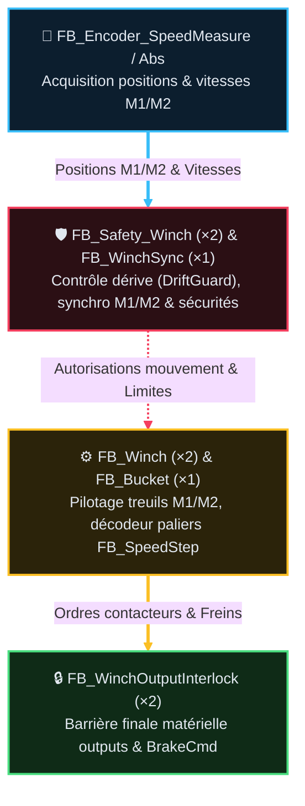

# Analyse Fonctionnelle — Partie 10 : Fonction Winch M1/M2 (v2.1)

> La tracabilite des versions programme/document est portee par `DOC/VERSION_HISTORY.md`.
> Source code actuel : `CODE/H_TREUILS_BENNE/*.st` · instances dans `PRG_04_Treuils_Benne.st` (ST), `PRG_06_Outputs.st` (ST). 🚩 La conversion CFC natif est **abandonnée** (2026-08-16) : le code reste en **ST + PLCopenXML**, aucune page CFC native cible.
> 🗺️ Architecture cible faisant foi : `DOC/AF/AF_Partie-02_Architecture_Programme_v3.2.md` §3 et §5.
> v1.14 archivée : `ARCHIVES/Doc/AF_Partie-09_Fonction_Winch_v1.14.md`.

## 🎯 Rôle et périmètre

- **Rôle** : pilotage physique et sécurité des treuils M1 (Retenue) / M2 (Benne), synchronisation étagée, commande mécanique benne et barrière finale.
- **Périmètre & Architecture** : `PRG_04_Treuils_Benne` est l'organe d'exécution physique. Il n'instancie plus `FB_DiveSearch` ni `FB_ExtractionSequence` (centralisés dans `PRG_03_Modes_Cycle`). Il **arbitre et applique** les requêtes benne et Kobold reçues de `PRG_03.Data.ReqProgram.ReqBucket`, sous le contrôle souverain de ses sécurités d'axe (`FB_Safety_Winch`).
- **Type de composant** : `FB_Winch` (×2), `FB_Safety_Winch` (×2), `FB_WinchSync`, `FB_Bucket`,
  `FB_WinchOutputInterlock` (×2) et 4 briques diagnostic — Fonction métier.

### 🎯 Table des fonctions

> **État** — `V` validé, implémentation non vérifiée · `V-I` validé et implémenté · `NV` non validé, non implémenté · `NV-I` code présent mais non validé · `R` refusé · `NA` non applicable.

<table style="width: 100%; table-layout: fixed; border-collapse: collapse; font-size: 14px;">
  <colgroup>
    <col style="width: 40px;">
    <col style="width: 140px;">
    <col style="width: calc(100% - 520px);">
    <col style="width: 110px;">
    <col style="width: 50px;">
    <col style="width: 90px;">
    <col style="width: 50px;">
    <col style="width: 40px;">
  </colgroup>
  <thead>
    <tr style="border-bottom: 2px solid #475569; text-align: left;">
      <th style="padding: 4px 1px; text-align: center;"><small><b>ID</b></small></th>
      <th style="padding: 4px 1px; text-align: center;"><small>Fonction</small></th>
      <th style="padding: 4px 8px;">Description</th>
      <th style="padding: 4px 1px; text-align: center;"><small>Réalisée par</small></th>
      <th style="padding: 4px 1px; text-align: center;"><small>Criticité</small></th>
      <th style="padding: 4px 1px; text-align: center;"><small>TC couvrants</small></th>
      <th style="padding: 4px 1px; text-align: center;"><small>Statut</small></th>
      <th style="padding: 4px 1px; text-align: center;"><small>État</small></th>
    </tr>
  </thead>
  <tbody>
    <tr style="border-bottom: 1px solid rgba(255,255,255,0.08);">
      <td style="padding: 4px 1px; text-align: center; vertical-align: middle;"><span style="writing-mode: vertical-rl; transform: rotate(180deg); display: inline-block; font-family: monospace; font-size: 11.5px; font-weight: bold; letter-spacing: 0.5px;">F10.01</span></td>
      <td style="padding: 4px 1px; text-align: center; vertical-align: middle;"><small><b>Piloter le mouvement treuil par palier</b></small></td>
      <td style="padding: 6px 8px; line-height: 1.55;">5 paliers vitesse, sens, tempo asymétrique montée/descente</td>
      <td style="padding: 4px 1px; text-align: center; vertical-align: middle;"><small><code>FB_Winch</code></small></td>
      <td style="padding: 4px 1px; text-align: center; vertical-align: middle;"><small>🟠 C3</small></td>
      <td style="padding: 4px 1px; text-align: center; vertical-align: middle;"><span style="font-family: monospace; font-size: 11.5px; font-weight: bold; letter-spacing: 0.5px;">TC-P10-011, 017-019</span></td>
      <td style="padding: 4px 1px; text-align: center; vertical-align: middle;"><small>✅</small></td>
      <td style="padding: 4px 1px; text-align: center; vertical-align: middle;"><small><code>NV-I</code></small></td>
    </tr>
    <tr style="border-bottom: 1px solid rgba(255,255,255,0.08);">
      <td style="padding: 4px 1px; text-align: center; vertical-align: middle;"><span style="writing-mode: vertical-rl; transform: rotate(180deg); display: inline-block; font-family: monospace; font-size: 11.5px; font-weight: bold; letter-spacing: 0.5px;">F10.02</span></td>
      <td style="padding: 4px 1px; text-align: center; vertical-align: middle;"><small><b>Protéger le treuil (défense en profondeur)</b></small></td>
      <td style="padding: 6px 8px; line-height: 1.55;">7 mécanismes A-G (safety métier), masques, bypass</td>
      <td style="padding: 4px 1px; text-align: center; vertical-align: middle;"><small><code>FB_Safety_Winch</code></small></td>
      <td style="padding: 4px 1px; text-align: center; vertical-align: middle;"><small>🔴 C4</small></td>
      <td style="padding: 4px 1px; text-align: center; vertical-align: middle;"><span style="font-family: monospace; font-size: 11.5px; font-weight: bold; letter-spacing: 0.5px;">TC-P10-001-010</span></td>
      <td style="padding: 4px 1px; text-align: center; vertical-align: middle;"><small>✅</small></td>
      <td style="padding: 4px 1px; text-align: center; vertical-align: middle;"><small><code>NV-I</code></small></td>
    </tr>
    <tr style="border-bottom: 1px solid rgba(255,255,255,0.08);">
      <td style="padding: 4px 1px; text-align: center; vertical-align: middle;"><span style="writing-mode: vertical-rl; transform: rotate(180deg); display: inline-block; font-family: monospace; font-size: 11.5px; font-weight: bold; letter-spacing: 0.5px;">F10.03</span></td>
      <td style="padding: 4px 1px; text-align: center; vertical-align: middle;"><small><b>Synchroniser M1/M2 (3 zones)</b></small></td>
      <td style="padding: 6px 8px; line-height: 1.55;">Nominal / dégradé palier 1 / SafeStop selon écart</td>
      <td style="padding: 4px 1px; text-align: center; vertical-align: middle;"><small><code>FB_WinchSync</code></small></td>
      <td style="padding: 4px 1px; text-align: center; vertical-align: middle;"><small>🔴 C4</small></td>
      <td style="padding: 4px 1px; text-align: center; vertical-align: middle;"><span style="font-family: monospace; font-size: 11.5px; font-weight: bold; letter-spacing: 0.5px;">TC-P10-014-016</span></td>
      <td style="padding: 4px 1px; text-align: center; vertical-align: middle;"><small>✅</small></td>
      <td style="padding: 4px 1px; text-align: center; vertical-align: middle;"><small><code>NV-I</code></small></td>
    </tr>
    <tr style="border-bottom: 1px solid rgba(255,255,255,0.08);">
      <td style="padding: 4px 1px; text-align: center; vertical-align: middle;"><span style="writing-mode: vertical-rl; transform: rotate(180deg); display: inline-block; font-family: monospace; font-size: 11.5px; font-weight: bold; letter-spacing: 0.5px;">F10.04</span></td>
      <td style="padding: 4px 1px; text-align: center; vertical-align: middle;"><small><b>Barrière finale sorties + watchdog frein</b></small></td>
      <td style="padding: 6px 8px; line-height: 1.55;">Contacteurs + frein couplé direct, anti-redémarrage</td>
      <td style="padding: 4px 1px; text-align: center; vertical-align: middle;"><small><code>FB_WinchOutputInterlock</code></small></td>
      <td style="padding: 4px 1px; text-align: center; vertical-align: middle;"><small>🔴 C4</small></td>
      <td style="padding: 4px 1px; text-align: center; vertical-align: middle;"><span style="font-family: monospace; font-size: 11.5px; font-weight: bold; letter-spacing: 0.5px;">TC-P10-012, 013, 020-022</span></td>
      <td style="padding: 4px 1px; text-align: center; vertical-align: middle;"><small>✅</small></td>
      <td style="padding: 4px 1px; text-align: center; vertical-align: middle;"><small><code>NV-I</code></small></td>
    </tr>
    <tr style="border-bottom: 1px solid rgba(255,255,255,0.08);">
      <td style="padding: 4px 1px; text-align: center; vertical-align: middle;"><span style="writing-mode: vertical-rl; transform: rotate(180deg); display: inline-block; font-family: monospace; font-size: 11.5px; font-weight: bold; letter-spacing: 0.5px;">F10.05</span></td>
      <td style="padding: 4px 1px; text-align: center; vertical-align: middle;"><small><b>Piloter la benne (désynchro M1/M2)</b></small></td>
      <td style="padding: 6px 8px; line-height: 1.55;">Ouverture/fermeture, glissement, assistants Dive/Extraction</td>
      <td style="padding: 4px 1px; text-align: center; vertical-align: middle;"><small><code>FB_Bucket</code></small></td>
      <td style="padding: 4px 1px; text-align: center; vertical-align: middle;"><small>🟠 C3</small></td>
      <td style="padding: 4px 1px; text-align: center; vertical-align: middle;"><span style="font-family: monospace; font-size: 11.5px; font-weight: bold; letter-spacing: 0.5px;">TC-P10-023-034</span></td>
      <td style="padding: 4px 1px; text-align: center; vertical-align: middle;"><small>✅</small></td>
      <td style="padding: 4px 1px; text-align: center; vertical-align: middle;"><small><code>NV-I</code></small></td>
    </tr>
    <tr style="border-bottom: 1px solid rgba(255,255,255,0.08);">
      <td style="padding: 4px 1px; text-align: center; vertical-align: middle;"><span style="writing-mode: vertical-rl; transform: rotate(180deg); display: inline-block; font-family: monospace; font-size: 11.5px; font-weight: bold; letter-spacing: 0.5px;">F10.06</span></td>
      <td style="padding: 4px 1px; text-align: center; vertical-align: middle;"><small><b>Diagnostiquer la symétrie M1/M2</b></small></td>
      <td style="padding: 6px 8px; line-height: 1.55;">Écarts démarrage/frein/arrêt/position, passif</td>
      <td style="padding: 4px 1px; text-align: center; vertical-align: middle;"><small><code>FB_Winch_Symmetry</code></small></td>
      <td style="padding: 4px 1px; text-align: center; vertical-align: middle;"><small>⚪ C1</small></td>
      <td style="padding: 4px 1px; text-align: center; vertical-align: middle;"><span style="font-family: monospace; font-size: 11.5px; font-weight: bold; letter-spacing: 0.5px;">—</span></td>
      <td style="padding: 4px 1px; text-align: center; vertical-align: middle;"><small>✅</small></td>
      <td style="padding: 4px 1px; text-align: center; vertical-align: middle;"><small><code>NV-I</code></small></td>
    </tr>
    <tr style="border-bottom: 1px solid rgba(255,255,255,0.08);">
      <td style="padding: 4px 1px; text-align: center; vertical-align: middle;"><span style="writing-mode: vertical-rl; transform: rotate(180deg); display: inline-block; font-family: monospace; font-size: 11.5px; font-weight: bold; letter-spacing: 0.5px;">F10.07</span></td>
      <td style="padding: 4px 1px; text-align: center; vertical-align: middle;"><small><b>Décoder consigne % → contacteurs</b></small></td>
      <td style="padding: 6px 8px; line-height: 1.55;">Palier 1-5 + garde-fou vitesse mesurée</td>
      <td style="padding: 4px 1px; text-align: center; vertical-align: middle;"><small><code>FB_SpeedStep</code></small></td>
      <td style="padding: 4px 1px; text-align: center; vertical-align: middle;"><small>🟠 C3</small></td>
      <td style="padding: 4px 1px; text-align: center; vertical-align: middle;"><span style="font-family: monospace; font-size: 11.5px; font-weight: bold; letter-spacing: 0.5px;">—</span></td>
      <td style="padding: 4px 1px; text-align: center; vertical-align: middle;"><small>✅</small></td>
      <td style="padding: 4px 1px; text-align: center; vertical-align: middle;"><small><code>NV-I</code></small></td>
    </tr>
    <tr style="border-bottom: 1px solid rgba(255,255,255,0.08);">
      <td style="padding: 4px 1px; text-align: center; vertical-align: middle;"><span style="writing-mode: vertical-rl; transform: rotate(180deg); display: inline-block; font-family: monospace; font-size: 11.5px; font-weight: bold; letter-spacing: 0.5px;">F10.08</span></td>
      <td style="padding: 4px 1px; text-align: center; vertical-align: middle;"><small><b>Estimer la charge 2D (palier × vitesse)</b></small></td>
      <td style="padding: 6px 8px; line-height: 1.55;">Diagnostic, pas d'action sécurité</td>
      <td style="padding: 4px 1px; text-align: center; vertical-align: middle;"><small><code>FB_WinchLoadEstimator</code></small></td>
      <td style="padding: 4px 1px; text-align: center; vertical-align: middle;"><small>⚪ C1</small></td>
      <td style="padding: 4px 1px; text-align: center; vertical-align: middle;"><span style="font-family: monospace; font-size: 11.5px; font-weight: bold; letter-spacing: 0.5px;">—</span></td>
      <td style="padding: 4px 1px; text-align: center; vertical-align: middle;"><small>✅</small></td>
      <td style="padding: 4px 1px; text-align: center; vertical-align: middle;"><small><code>NV-I</code></small></td>
    </tr>
    <tr style="border-bottom: 1px solid rgba(255,255,255,0.08);">
      <td style="padding: 4px 1px; text-align: center; vertical-align: middle;"><span style="writing-mode: vertical-rl; transform: rotate(180deg); display: inline-block; font-family: monospace; font-size: 11.5px; font-weight: bold; letter-spacing: 0.5px;">F10.09</span></td>
      <td style="padding: 4px 1px; text-align: center; vertical-align: middle;"><small><b>Surveiller la dérive sous frein serré</b></small></td>
      <td style="padding: 6px 8px; line-height: 1.55;">Capture position, alerte si dérive</td>
      <td style="padding: 4px 1px; text-align: center; vertical-align: middle;"><small><code>FB_DriftGuard</code></small></td>
      <td style="padding: 4px 1px; text-align: center; vertical-align: middle;"><small>🟠 C3</small></td>
      <td style="padding: 4px 1px; text-align: center; vertical-align: middle;"><span style="font-family: monospace; font-size: 11.5px; font-weight: bold; letter-spacing: 0.5px;">—</span></td>
      <td style="padding: 4px 1px; text-align: center; vertical-align: middle;"><small>✅</small></td>
      <td style="padding: 4px 1px; text-align: center; vertical-align: middle;"><small><code>NV-I</code></small></td>
    </tr>
  </tbody>
</table>

## 📑 Sommaire

1. [🧪 Table des points de validation (non détaillé)](#1-table-des-points-de-validation-non-détaillé)
2. [🧱 Composition — fiches FB dédiées](#2-composition-fiches-fb-dédiées)
   - [2bis. Frein — couplage direct](#2bis-frein-couplage-direct-🔧-2026-08-06-demande-client)
   - [2ter. Tempo de reprise basée sur l'état frein](#2ter-tempo-de-reprise-basée-sur-létat-frein-pas-le-centre-joystick-🔧-2026-08-07)
3. [🎯 Rôle machine](#3-rôle-machine)
4. [🚌 DUT et bus](#4-dut-et-bus)
5. [🔗 Intégration programme](#5-intégration-programme)
6. [⚠️ Alertes et écarts (transverses)](#6-alertes-et-écarts-transverses)
7. [⚙️ Commande vitesse par palier](#7-commande-vitesse-par-palier)
   - [7.1 Mécanisme implémenté](#71-mécanisme-implémenté-fb_winchst-commit-2026-08-06)
   - [7.2 Doctrine anti-retombée associée](#72-doctrine-anti-retombée-associée-fb_winchoutputinterlockst-commit-2026-08-06)
   - [7.3 TBD — Apprentissage vitesse par palier](#73-tbd-apprentissage-vitesse-par-palier)
   - [7.3bis Surveillance de symétrie M1/M2](#73bis-️-surveillance-de-symétrie-m1m2-fb_winch_symmetry-mes-008-diagnostic)
   - [7.4 Mou de câble & récupération](#74-🪢-spécification-mécanique-mou-de-câble-slackcable-récupération)
   - [7.5 Benne partiellement fermée & remontée palier 1](#75-🪣-sécurité-benne-partiellement-fermée-obstruée-remontée-palier-1)
   - [7.6 Synchronisation M1/M2 étagée](#76-️-synchronisation-m1m2-étagée-fb_winchsync)
8. [📜 Suivi historique](#8-suivi-historique)
9. [❓ TBD](#9-tbd)
10. [📚 Documents liés](#10-documents-liés)

## 🧪 1 · Table des points de validation (non détaillé)

Catalogue `TC-P10-*` **réparti dans les fiches FB** (propriétaire unique par fiche, pas
dupliqué ici) :

> **État** — `V` validé, implémentation non vérifiée · `V-I` validé et implémenté · `NV` non validé, non implémenté · `NV-I` code présent mais non validé · `R` refusé · `NA` non applicable.

<table style="width: 100%; table-layout: fixed; border-collapse: collapse; font-size: 14px;">
  <colgroup>
    <col style="width: 28px;">
    <col style="width: 50px;">
    <col style="width: calc(100% - 165px);">
    <col style="width: 45px;">
    <col style="width: 26px;">
    <col style="width: 36px;">
  </colgroup>
  <thead>
    <tr style="border-bottom: 2px solid #475569; text-align: left;">
      <th style="padding: 4px 1px; text-align: center;"><small><b>ID</b></small></th>
      <th style="padding: 4px 1px; text-align: center;"><small>Intention</small></th>
      <th style="padding: 4px 8px;">Séquence &amp; Déroulé des étapes (Comportement attendu)</th>
      <th style="padding: 4px 1px; text-align: center;"><small>Type</small></th>
      <th style="padding: 4px 1px; text-align: center;"><small>Réf</small></th>
      <th style="padding: 4px 1px; text-align: center;"><small>État</small></th>
    </tr>
  </thead>
  <tbody>
    <tr style="border-bottom: 1px solid rgba(255,255,255,0.08);">
      <td style="padding: 4px 1px; text-align: center; vertical-align: middle;"><span style="font-family: monospace; font-size: 11.5px; font-weight: bold; letter-spacing: 0.5px;">TC-P10-011, 017, 018, 019</span></td>
      <td style="padding: 4px 1px; text-align: center; vertical-align: middle;"><small><b>Pilotage</b><br>treuil</small></td>
      <td style="padding: 6px 8px; line-height: 1.55;">
        💤 <b>Étape 0</b> : Treuil au repos, contacteurs coupés, frein serré<br>
        🚀 <b>Étape 1</b> : Consigne opérateur (joystick/boutons) → arbitrage palier/sens<br>
        ⚡ <b>Étape 2</b> : Activation contacteurs selon palier, décodage <code>FB_SpeedStep</code><br>
        ✅ <b>Étape 3</b> : Mouvement treuil piloté — détail dans <a href="AF_Partie-10_Fonction_Winch/FB_Winch_v1.0.md">FB_Winch_v1.0.md</a>
      </td>
      <td style="padding: 4px 1px; text-align: center;"><small><code>—</code></small></td>
      <td style="padding: 4px 1px; text-align: center;"><small><a href="AF_Partie-10_Fonction_Winch/FB_Winch_v1.0.md">FB_Winch_v1.0.md</a></small></td>
      <td style="padding: 4px 1px; text-align: center;"><small><code>NV-I</code></small></td>
    </tr>
    <tr style="border-bottom: 1px solid rgba(255,255,255,0.08);">
      <td style="padding: 4px 1px; text-align: center; vertical-align: middle;"><span style="font-family: monospace; font-size: 11.5px; font-weight: bold; letter-spacing: 0.5px;">TC-P10-001 à 010</span></td>
      <td style="padding: 4px 1px; text-align: center; vertical-align: middle;"><small><b>Sécurité</b><br>treuil</small></td>
      <td style="padding: 6px 8px; line-height: 1.55;">
        💤 <b>Étape 0</b> : Mouvement nominal, aucun défaut actif<br>
        🚀 <b>Étape 1</b> : Injection défaut (dérite, non-confirmation arrêt, sens opposé, etc.)<br>
        ⚡ <b>Étape 2</b> : Détection par mécanisme Méca A-G, <code>ErrorId</code> bit levé<br>
        ✅ <b>Étape 3</b> : <code>SafeStop</code> ± <code>PowerCutOff</code> selon masque — détail dans <a href="AF_Partie-10_Fonction_Winch/FB_Safety_Winch_v1.0.md">FB_Safety_Winch_v1.0.md</a>
      </td>
      <td style="padding: 4px 1px; text-align: center;"><small><code>—</code></small></td>
      <td style="padding: 4px 1px; text-align: center;"><small><a href="AF_Partie-10_Fonction_Winch/FB_Safety_Winch_v1.0.md">FB_Safety_Winch_v1.0.md</a></small></td>
      <td style="padding: 4px 1px; text-align: center;"><small><code>NV-I</code></small></td>
    </tr>
    <tr style="border-bottom: 1px solid rgba(255,255,255,0.08);">
      <td style="padding: 4px 1px; text-align: center; vertical-align: middle;"><span style="font-family: monospace; font-size: 11.5px; font-weight: bold; letter-spacing: 0.5px;">TC-P10-014, 015, 016</span></td>
      <td style="padding: 4px 1px; text-align: center; vertical-align: middle;"><small><b>Synchro</b><br>M1/M2</small></td>
      <td style="padding: 6px 8px; line-height: 1.55;">
        💤 <b>Étape 0</b> : M1/M2 synchronisés, écart &lt; 0.8m (Zone 1)<br>
        🚀 <b>Étape 1</b> : Injection écart entre M1 et M2<br>
        ⚡ <b>Étape 2</b> : Zone 2 (0.8-2.5m) → dégradation palier 1 ; Zone 3 (≥2.5m) → SafeStop<br>
        ✅ <b>Étape 3</b> : Comportement 3 zones validé — détail dans <a href="AF_Partie-10_Fonction_Winch/FB_WinchSync_v1.1.md">FB_WinchSync_v1.1.md</a>
      </td>
      <td style="padding: 4px 1px; text-align: center;"><small><code>—</code></small></td>
      <td style="padding: 4px 1px; text-align: center;"><small><a href="AF_Partie-10_Fonction_Winch/FB_WinchSync_v1.1.md">FB_WinchSync_v1.1.md</a></small></td>
      <td style="padding: 4px 1px; text-align: center;"><small><code>NV</code></small></td>
    </tr>
    <tr style="border-bottom: 1px solid rgba(255,255,255,0.08);">
      <td style="padding: 4px 1px; text-align: center; vertical-align: middle;"><span style="font-family: monospace; font-size: 11.5px; font-weight: bold; letter-spacing: 0.5px;">TC-P10-012, 013, 020, 021, 022</span></td>
      <td style="padding: 4px 1px; text-align: center; vertical-align: middle;"><small><b>Barrière</b><br>sorties</small></td>
      <td style="padding: 6px 8px; line-height: 1.55;">
        💤 <b>Étape 0</b> : Sorties autorisées, frein couplé direct<br>
        🚀 <b>Étape 1</b> : Arrêt commandé ou défaut → coupure contacteurs + frein<br>
        ⚡ <b>Étape 2</b> : Watchdog frein 500ms, anti-redémarrage, gate mot/fréquence<br>
        ✅ <b>Étape 3</b> : Zéro redémarrage auto validé — détail dans <a href="AF_Partie-10_Fonction_Winch/FB_WinchOutputInterlock_v1.0.md">FB_WinchOutputInterlock_v1.0.md</a>
      </td>
      <td style="padding: 4px 1px; text-align: center;"><small><code>—</code></small></td>
      <td style="padding: 4px 1px; text-align: center;"><small><a href="AF_Partie-10_Fonction_Winch/FB_WinchOutputInterlock_v1.0.md">FB_WinchOutputInterlock_v1.0.md</a></small></td>
      <td style="padding: 4px 1px; text-align: center;"><small><code>NV</code></small></td>
    </tr>
    <tr style="border-bottom: 1px solid rgba(255,255,255,0.08);">
      <td style="padding: 4px 1px; text-align: center; vertical-align: middle;"><span style="font-family: monospace; font-size: 11.5px; font-weight: bold; letter-spacing: 0.5px;">TC-P10-023 à 034</span></td>
      <td style="padding: 4px 1px; text-align: center; vertical-align: middle;"><small><b>Benne</b><br>ouv./ferm.</small></td>
      <td style="padding: 6px 8px; line-height: 1.55;">
        💤 <b>Étape 0</b> : Benne au repos, M1/M2 synchronisés<br>
        🚀 <b>Étape 1</b> : Demande ouverture/fermeture benne (désynchro M1/M2)<br>
        ⚡ <b>Étape 2</b> : Glissement, assistants Dive/Extraction, défense en profondeur<br>
        ✅ <b>Étape 3</b> : Manœuvre benne validée — détail dans <a href="AF_Partie-10_Fonction_Winch/FB_Bucket_v1.0.md">FB_Bucket_v1.0.md</a>
      </td>
      <td style="padding: 4px 1px; text-align: center;"><small><code>—</code></small></td>
      <td style="padding: 4px 1px; text-align: center;"><small><a href="AF_Partie-10_Fonction_Winch/FB_Bucket_v1.0.md">FB_Bucket_v1.0.md</a></small></td>
      <td style="padding: 4px 1px; text-align: center;"><small><code>NV-I</code></small></td>
    </tr>
    <tr style="border-bottom: 1px solid rgba(255,255,255,0.08);">
      <td style="padding: 4px 1px; text-align: center; vertical-align: middle;"><span style="font-family: monospace; font-size: 11.5px; font-weight: bold; letter-spacing: 0.5px;">Diagnostic MES-008, symétrie</span></td>
      <td style="padding: 4px 1px; text-align: center; vertical-align: middle;"><small><b>Symétrie</b><br>M1/M2</small></td>
      <td style="padding: 6px 8px; line-height: 1.55;">
        💤 <b>Étape 0</b> : M1/M2 en mouvement, métriques passives collectées<br>
        🚀 <b>Étape 1</b> : Mesure écarts démarrage/frein/arrêt/position<br>
        ⚡ <b>Étape 2</b> : Calcul <code>DeltaStartDelay_Ms</code>, <code>MaxSyncDeviation_M</code>, etc.<br>
        ✅ <b>Étape 3</b> : Diagnostic passif publié IHM — détail dans <a href="AF_Partie-10_Fonction_Winch/FB_Winch_Symmetry_v1.1.md">FB_Winch_Symmetry_v1.1.md</a>
      </td>
      <td style="padding: 4px 1px; text-align: center;"><small><code>—</code></small></td>
      <td style="padding: 4px 1px; text-align: center;"><small><a href="AF_Partie-10_Fonction_Winch/FB_Winch_Symmetry_v1.1.md">FB_Winch_Symmetry_v1.1.md</a></small></td>
      <td style="padding: 4px 1px; text-align: center;"><small><code>NV</code></small></td>
    </tr>
    <tr style="border-bottom: 1px solid rgba(255,255,255,0.08);">
      <td style="padding: 4px 1px; text-align: center; vertical-align: middle;"><span style="font-family: monospace; font-size: 11.5px; font-weight: bold; letter-spacing: 0.5px;">Décodage paliers 1..5 &amp; garde-fou</span></td>
      <td style="padding: 4px 1px; text-align: center; vertical-align: middle;"><small><b>Décodage</b><br>paliers</small></td>
      <td style="padding: 6px 8px; line-height: 1.55;">
        💤 <b>Étape 0</b> : Consigne <code>SpeedCmd_Pct</code> reçue (0-100%)<br>
        🚀 <b>Étape 1</b> : Quantification en 5 paliers (PV/GV1/GV2/GV3/GV4)<br>
        ⚡ <b>Étape 2</b> : Activation contacteurs selon palier, garde-fou vitesse mesurée<br>
        ✅ <b>Étape 3</b> : Décodeur validé — détail dans <a href="AF_Partie-10_Fonction_Winch/FB_SpeedStep_v1.0.md">FB_SpeedStep_v1.0.md</a>
      </td>
      <td style="padding: 4px 1px; text-align: center;"><small><code>—</code></small></td>
      <td style="padding: 4px 1px; text-align: center;"><small><a href="AF_Partie-10_Fonction_Winch/FB_SpeedStep_v1.0.md">FB_SpeedStep_v1.0.md</a></small></td>
      <td style="padding: 4px 1px; text-align: center;"><small><code>NV</code></small></td>
    </tr>
    <tr style="border-bottom: 1px solid rgba(255,255,255,0.08);">
      <td style="padding: 4px 1px; text-align: center; vertical-align: middle;"><span style="font-family: monospace; font-size: 11.5px; font-weight: bold; letter-spacing: 0.5px;">Diagnostic charge 2D</span></td>
      <td style="padding: 4px 1px; text-align: center; vertical-align: middle;"><small><b>Charge</b><br>2D</small></td>
      <td style="padding: 6px 8px; line-height: 1.55;">
        💤 <b>Étape 0</b> : Treuil en mouvement, palier et vitesse mesurés<br>
        🚀 <b>Étape 1</b> : Estimation charge 2D (palier × vitesse)<br>
        ⚡ <b>Étape 2</b> : Calcul diagnostic passif, aucune action sécurité<br>
        ✅ <b>Étape 3</b> : Estimation publiée IHM — détail dans <a href="AF_Partie-10_Fonction_Winch/FB_WinchLoadEstimator_v1.0.md">FB_WinchLoadEstimator_v1.0.md</a>
      </td>
      <td style="padding: 4px 1px; text-align: center;"><small><code>—</code></small></td>
      <td style="padding: 4px 1px; text-align: center;"><small><a href="AF_Partie-10_Fonction_Winch/FB_WinchLoadEstimator_v1.0.md">FB_WinchLoadEstimator_v1.0.md</a></small></td>
      <td style="padding: 4px 1px; text-align: center;"><small><code>NV</code></small></td>
    </tr>
    <tr style="border-bottom: 1px solid rgba(255,255,255,0.08);">
      <td style="padding: 4px 1px; text-align: center; vertical-align: middle;"><span style="font-family: monospace; font-size: 11.5px; font-weight: bold; letter-spacing: 0.5px;">Dérive position sous frein</span></td>
      <td style="padding: 4px 1px; text-align: center; vertical-align: middle;"><small><b>Dérive</b><br>frein serré</small></td>
      <td style="padding: 6px 8px; line-height: 1.55;">
        💤 <b>Étape 0</b> : Treuil à l'arrêt, frein serré, position captée<br>
        🚀 <b>Étape 1</b> : Surveillance position pendant arrêt (frein maintenu)<br>
        ⚡ <b>Étape 2</b> : Détection dérive &gt; seuil → alerte<br>
        ✅ <b>Étape 3</b> : Capture &amp; surveillance validées — détail dans <a href="AF_Partie-10_Fonction_Winch/FB_DriftGuard_v1.0.md">FB_DriftGuard_v1.0.md</a>
      </td>
      <td style="padding: 4px 1px; text-align: center;"><small><code>—</code></small></td>
      <td style="padding: 4px 1px; text-align: center;"><small><a href="AF_Partie-10_Fonction_Winch/FB_DriftGuard_v1.0.md">FB_DriftGuard_v1.0.md</a></small></td>
      <td style="padding: 4px 1px; text-align: center;"><small><code>NV</code></small></td>
    </tr>
  </tbody>
</table>

---

## 🧱 2 · Composition — fiches FB dédiées

| Fiche | FB détaillé | Contenu |
|---|---|---|
| [`FB_Winch_v1.0.md`](AF_Partie-10_Fonction_Winch/FB_Winch_v1.0.md) | `FB_Winch` | Mouvement, palier, sens (🔧 2026-08-06 : frein retiré, voir §2bis) |
| [`FB_Safety_Winch_v1.0.md`](AF_Partie-10_Fonction_Winch/FB_Safety_Winch_v1.0.md) | `FB_Safety_Winch` | 7 mécanismes A-G, masques, bypass |
| [`FB_WinchSync_v1.1.md`](AF_Partie-10_Fonction_Winch/FB_WinchSync_v1.1.md) | `FB_WinchSync` | Synchro niveau 1, couplage croisé |
| [`FB_WinchOutputInterlock_v1.0.md`](AF_Partie-10_Fonction_Winch/FB_WinchOutputInterlock_v1.0.md) | `FB_WinchOutputInterlock` | Barrière finale, watchdog frein, anti-redémarrage |
| [`FB_Bucket_v1.0.md`](AF_Partie-10_Fonction_Winch/FB_Bucket_v1.0.md) | `FB_Bucket` (+ `FB_DiveSearch`, `FB_ExtractionSequence`) | Benne, désynchronisation M1/M2, glissement, assistants |
| [`FB_Winch_Symmetry_v1.1.md`](AF_Partie-10_Fonction_Winch/FB_Winch_Symmetry_v1.1.md) | `FB_Winch_Symmetry` | Diagnostic passif symétrie & décalages M1/M2 |
| [`FB_SpeedStep_v1.0.md`](AF_Partie-10_Fonction_Winch/FB_SpeedStep_v1.0.md) | `FB_SpeedStep` | Décodeur consigne % -> contacteurs & garde-fou |
| [`FB_WinchLoadEstimator_v1.0.md`](AF_Partie-10_Fonction_Winch/FB_WinchLoadEstimator_v1.0.md) | `FB_WinchLoadEstimator` | Estimation charge 2D palier x vitesse |
| [`FB_DriftGuard_v1.0.md`](AF_Partie-10_Fonction_Winch/FB_DriftGuard_v1.0.md) | `FB_DriftGuard` | Capture & surveillance dérive sous frein |



Trait plein épais = flux de données transformées ; pointillé = signal de commande/permission.
Couleur = domaine (cyan acquisition, rouge sécurité, jaune commande/mouvement, vert sortie),
même dictionnaire que `GUIDE_EDITION_AF_v1.0.md §3quater`.

Benne = sous-fonction M2 : aucune I/O propre, réutilise `FB_Winch` M2. Fiche dédiée dans ce dossier.

### 2bis. Frein — couplage direct (🔧 2026-08-06, demande client)

`FB_Brake` (COMMUN, séquence temporisée frein manque-courant) est **retiré de la composition
`FB_Winch`** — reste utilisé tel quel par `FB_Translation` (M3), non touché. Décision client :
le frein ne doit jamais pouvoir diverger de l'état des contacteurs de sens, donc plus de FB
intermédiaire avec sa propre temporisation/état — couplage structurel direct.

Nouvelle architecture :
- `FB_Winch` ne produit plus aucune sortie frein (`BrakeCmd`/`BrakeCommandOpenConfirmed`/
  `BrakeContactorCheck` retirés de son interface).
- `FB_WinchOutputInterlock` calcule `BrakeCmd := RelayFwd OR RelayRev` **après** avoir
  finalisé ces deux sorties (§5 de sa logique) — hérite automatiquement de toutes leurs
  conditions de sécurité (Error, RestartInhibit, RestartRequired, MotorRequest) sans les
  répéter. Watchdog conservé : `BrakeFeedback` (retour physique brut, ex-DI
  `Mx_BrakeIsOpen_DI`, câblé directement depuis `PRG_04`) comparé à `BrakeCmd`, timeout
  500 ms → `ErrorId` bit0 → coupe le mouvement (mécanisme `Error` déjà existant).
- `PRG_06_Outputs` recalcule **la même expression** indépendamment sur les DQ finaux
  (`M1BrakeCmd := M1RelayFwd OR M1RelayRev`) pour piloter la bobine physique — visible
  directement dans le réseau Ladder, sans ouvrir `FB_WinchOutputInterlock` (même doctrine
  de visibilité que les autres barrières finales, voir en-tête `PRG_06_Outputs.st`).

⚠️ Contrepartie assumée (décision client, pas une omission) : le frein n'attend plus de
confirmation physique du contacteur de sens avant de s'ouvrir (l'ancien `ContactorEngaged`,
anti-retombée du 2026-08-06 matin, est retiré) — le couplage est désormais sur la **commande**
`RelayFwd`/`RelayRev`, pas sur leur confirmation terrain. Le risque théorique (frein ouvert
avant engagement mécanique réel du contacteur) est jugé acceptable par le client au profit de
la garantie structurelle "jamais de mouvement commandé sans frein desserré".

### 2ter. Tempo de reprise basée sur l'état frein, pas le centre joystick (🔧 2026-08-07)

**Décision client** : `RestartDelay` (interlock final, tempo avant réautorisation d'un mouvement
après arrêt) ne doit plus démarrer sur `FwdRevSpeedFeedbackOff` (retour contacteur, image
indirecte du centre joystick) mais sur `NOT BrakeFeedback` — c'est-à-dire une fois le frein
**réellement confirmé fermé** par son propre retour physique. Plus fiable que le centre
joystick (qui ne dit rien de la réalité mécanique et n'existe que dans certains modes) : l'état
frein fonctionne identiquement en Mode Boutons IHM, Mode Joystick, ou un futur séquenceur auto.

- `RestartDelay` : `T#1000ms` → **`T#1500ms`**, décompté à partir de la confirmation frein
  fermé (pas de la commande d'arrêt) — délai réel total = fermeture mécanique du frein +
  1500ms, volontairement plus prudent que l'ancien calcul.
- `RestartRequired` reste armé **instantanément** sur l'arrêt commandé (`NOT MotorRequest`,
  bloque §5 dès ce scan) — seul le **décompte** de la tempo change de déclencheur.

**Un seul verrou de fait entre deux reprises, reprise ou inversion confondues** : `RestartDelay`
(1500ms + fermeture réelle frein) est structurellement toujours ≥ `DirectionInterlockDelay`
(400/900ms max, §1). Après une pause réelle suffisante (~2s), les deux verrous sont déjà levés
en tâche de fond avant même la nouvelle demande opérateur — la reprise est alors instantanée,
que la nouvelle demande soit dans le même sens ou inversée. Pas un cumul des deux tempos, un
seul verrou dominant (`RestartDelay`, toujours le plus long des deux).

---

## 🎯 3 · Rôle machine

Treuil M1 (Retenue) et M2 (Benne) : levage/retenue de charge par câble, 5 paliers de vitesse
par contacteurs discrets (pas de variateur continu), frein à manque de courant. Sécurité par
défense en profondeur (7 mécanismes détaillés dans la fiche `FB_Safety_Winch`).

---

## 🚌 4 · DUT et bus

| DUT | Producteur | Consommateur |
|---|---|---|
| `ST_WinchFinalInterlockRequest` | `PRG_04_Treuils_Benne` | `PRG_06_Outputs` |
| `ST_SpeedStepTable` | config IHM/RETAIN | `FB_Winch`/`FB_SpeedStep` |
| `ST_SafetyWinch` | `Supervision` (agrège) | IHM |
| `ST_BypassWinch` | IHM RETAIN | `FB_Safety_Winch` |
| `ST_ContactorCheck` (COMMUN) | `FB_Winch` (contacteurs sens/vitesse) | `FB_Safety_Winch`, IHM |

---

## 🔗 5 · Intégration programme

### 5.1 Organisation de l'exécution (ST pur)

```text
PRG_04_Treuils_Benne (ST) — régions réelles (corrigé 2026-08-26, vérifié contre le code)
  §1  Intention maintenance et assistants (DiveSearch/ExtractionSequence)
  §2  Commande benne (instBucket)
  §3  Arbitrage consignes M1/M2 (SEMI_AUTO / MAINT / joystick / boutons, combiné)
  §4  Synchronisation M1/M2 (instWinchSync)
  §5  Couplage croisé et sécurités (instSafetyWinchM1/M2)
  §6  Exécution treuils M1/M2 (instWinchM1/M2)
  §7  Publication demandes brutes
  §8  Publication états IHM
PRG_06_Outputs (LD généré)  instWinchOutputInterlockM1/M2 (Q finales)
```

**Dépendances** : Joystick (`AxisCmdY`, `DeadmanArmed`), Modes (`JoystickWinchSelectArbitrated`,
`InhibitM1/M2`, `SyncEnable`), Encodeurs (`CablePosM`, `Homed`, vitesse), Cycle (SEMI_AUTO).

### 5.2 Cible — `PRG_04_Treuils_Benne` (rang 04 de la `MainTask`)

Découpage **par ensemble mécanique**. M1 (retenue) et M2 (benne) sont indissociables : la benne
est suspendue entre les deux, et l'ouverture, la fermeture, la synchro et le câble mou dépendent
de leur **combinaison**. Une seule page les porte, avec leur safety.

| Ce qui est porté par `PRG_04_Treuils_Benne` | Rôle |
|---|---|
| Arbitrages M1/M2, benne (`FB_Bucket`), synchro, assistants plongée/extraction | Conduite treuils |
| `instSafetyWinchM1/M2`, `instLoadEstimatorM1/M2` | Safety treuils & benne |

> 📌 **Neutralisation et validité offset benne (`FB_Bucket`)** : lorsque `FB_Bucket` est désactivé (`InhibitM2`), son gate neutralise `ActiveOffsetM := 0.0` (comparaison M1/M2 stricte sans fuite d'offset périmé vers Méca E `FB_Safety_Winch`) et publie la sortie `ActiveOffsetValid := FALSE` (exposée dans `ST_fbBucket_State` pour l'IHM et le diagnostic).

> 📌 **Référence machine T184** : un offset benne n'est utilisable pour la conduite nominale que lorsque M1 et M2 sont `HomedAndReliable` et que l'état visuel benne a été committé après homing conjoint. Sans cette qualification, aucun bypass de `SyncDeviationWarn` n'est autorisé : le clamp palier 1 reste actif. Pendant le preset des codeurs, `PRG_04` désactive seulement le consommateur `FB_WinchSync`; les protections de mouvement restent actives.

⚠️ **Aucune sémantique safety ne change** : les mécanismes Méca A→E, les bits `ErrorId` 14/15,
`AscentPermit`/`DescendPermit` (logique positive fail-safe), les seuils et les polarités restent ceux décrits dans les fiches FB.
Seule **l'affectation POU** change : la safety devient visible en parallèle des blocs métier sur
la même page, ce qui supprime par construction le cycle prouvé `Safety ↔ Treuils`.

`PowerCutOff` : cette page publie **sa demande** M1/M2. L'agrégation et la coupure restent la
responsabilité exclusive de la barrière finale `PRG_06_Outputs` (AF02 §2). Aucun POU « safety
machine globale » n'existe dans la cible.

📌 Lot de migration : **M3** (C4, rebuild) — migration 7 POU soldée, historique archivé (`ARCHIVES/Doc/AUDITS/Architecture_Migration7POU/`).

---

## ⚠️ 6 · Alertes et écarts (transverses)

| # | Gravité | Point | Détail |
|---|---|---|---|
| 1 | info | 7 mécanismes (A-G), pas 5 | `FB_Safety_Winch` §6 |
| 2 | info | Doc AF02 legacy décrit l'architecture historique | Architecture 7 POU actuelle |

Écarts spécifiques à un FB (double délai palier, `DelayMotorDecel` code mort, garde-fou non
persistant) : voir la fiche FB concernée (§7 de chaque fiche) et §7 ci-dessous.

---

## ⚙️ 7 · Commande vitesse par palier — DÉCIDÉ et implémenté (retour terrain 2026-08-06)

> ✅ **Décision prise et codée le 2026-08-06**, en connaissance de cause et **sans les essais en
> charge réelle validant les bandes de vitesse par palier** (`SpeedBandMaxMps` reste théorique,
> voir §7.3). Phrase complétée 2026-08-26 — coupée avant, trouvée en revue de conformité.

### 7.1 Mécanisme implémenté (`FB_Winch.st`, commit 2026-08-06)

| Mécanisme | Avant | Après (implémenté) |
|---|---|---|
| Accélération/décélération | `FB_Ramp` générique, %/s (`CfgRampAccelRate`/`CfgRampDecelNormalRate`/`CfgRampDecelFastRate`, retirés) | `RampTargetPct` alimente directement `FB_SpeedStep` (pas de lissage) ; progressivité assurée par la tempo par palier ci-dessous |
| Hausse palier | Délai fixe unique `T#1s500ms`, symétrique montée/descente | `EffectiveStepDelay := EffectiveDirectionInterlockDelay + T#100ms` → **500ms en descente / 1000ms en montée** (déduit de l'interlock de sens, pas un réglage séparé) |
| Interlock changement de sens | `DirectionInterlockDelay` unique 200ms | Asymétrique : `DirectionInterlockDelayDescent := T#400ms` / `DirectionInterlockDelayAscent := T#900ms`, toujours < la tempo palier correspondante (interlock jamais le facteur limitant, garanti par construction) |
| Arrêt (relâchement joystick) | Suivait la rampe de décélération (contacteurs engagés plusieurs secondes après l'ordre d'arrêt) | Coupure **instantanée** de `RelayFwd`/`RelayRev` et des 4 contacteurs de vitesse dès `Direction=0`, même scan |
| Coupure finale (freinage) | `DelayMotorDecel` code mort dans `FB_Brake.st` | Sans objet côté treuil : `FB_Brake` retiré (§2bis), le frein suit désormais `RelayFwd OR RelayRev` sans aucune temporisation |
| Garde-fou vitesse mesurée | Existe, désactivé, non persistant | Inchangé par ce lot |
| Bandes de vitesse par palier | Théoriques, jamais mesurées | Voir §6.3, non traité par ce lot |

### 7.2 Doctrine anti-retombée associée (`FB_WinchOutputInterlock.st`, commit 2026-08-06)

⚠️ **Révisée le même jour (§2bis)** : la doctrine ci-dessous (contacteur confirmé physiquement
AVANT ouverture frein, via `ContactorEngaged := NOT FwdRevSpeedFeedbackOff`) a été implémentée
le matin du 2026-08-06, puis **remplacée l'après-midi même** par un couplage direct sur la
commande (`BrakeCmd := RelayFwd OR RelayRev`, décision client — voir §2bis pour le raisonnement
et la contrepartie assumée). Conservé ici pour l'historique de la décision, périmé en pratique.

**T91 (asymétrie montée/descente) et T93 (tempo par palier au lieu de rampe %/s) sont ainsi
implémentés** ; seule l'apprentissage/validation en charge réelle (§7.3) reste ouvert. ⚠️ Correction
2026-08-26 : la référence "T91" citée ici dans une version antérieure ne concerne **pas** ce
sujet — le seul `T91` réel documenté (`DOC/WFLOW/AUDITS/ETUDE_T91_SEQ_FREIN_PUISSANCE_v0.1.md`)
porte sur l'asymétrie montée/descente de `FB_Brake`, un périmètre différent et sans rapport
depuis que le frein a été découplé de `FB_Winch` (§2bis).

### 7.3 TBD — Apprentissage vitesse par palier

**Constat** : `SpeedBandMaxMps` est aujourd'hui rempli à la main avec des valeurs théoriques.
Aucun mécanisme de mesure/calibration automatique n'existe (T95 mentionne "étendre
`FB_Winch_Symmetry`" sans détailler de mécanisme).

**Besoin exprimé** :

| Élément | Détail |
|---|---|
| Déclencheur | Mode maintenance dédié : "Apprentissage à vide" et "Apprentissage en charge" (2 jeux de bandes distincts) |
| Capture | Sur chaque palier, après stabilité (~1-2 s), mesure vitesse peu filtrée (évite un pic transitoire) |
| Stockage | Remplace/alimente `SpeedBandMaxMps[1..5]`, un jeu par condition (vide/charge) |
| Robustesse | Valeur brute jamais utilisée telle quelle : **offset réglable** (marge) avant utilisation comme seuil de garde-fou |
| Cas d'usage cité | Alimentation groupe électrogène vs secteur → vitesse réelle différente à charge égale ; l'apprentissage évite une calibration manuelle poste par poste |

**TBD à trancher avant code** :
- Bit unique (sélection vide/charge par ailleurs) ou 2 bits dédiés distincts ?
- Portée : par treuil (M1/M2 séparés) — cohérent avec `SpeedBandMaxMps` déjà par instance
- Durée de stabilité et fenêtre de mesure (lien `FB_Encoder_SpeedMeasure`, déjà fenêtre 50 ms — probablement insuffisant seul, agrégation supplémentaire à définir)
- FB dédié proposé (nom informatif, pas engageant) : `FB_WinchSpeedLearning`

Suivi pilotage : `PLAN_TASK.md` T96.

### 7.3bis ⚖️ Surveillance de symétrie M1/M2 (`FB_Winch_Symmetry` — MES-008 & Diagnostic)

**Objectif** : Identifier passivement si un décalage entre les deux treuils (M1 et M2) provient d'un retard d'automatisme/contacteur ou d'un problème mécanique/frein.

**Métriques mesurées passivement (exécuté dans `PRG_07_Supervision`, en lecture seule stricte)** :
- `DeltaStartDelay_Ms` : Écart de temps au démarrage des mouvements M1/M2.
- `DeltaBrakeReleaseTime_Ms` & `DeltaBrakeApplyTime_Ms` : Écart de temps d'ouverture/fermeture effective des freins.
- `DeltaStopTime_Ms` & `DeltaStopDistance_Mm` : Écart de temps et de distance parcourue lors de la phase d'arrêt.
- `MaxSyncDeviation_M` : Écart maximal de position synchro pendant la course.

**Consommation IHM / Diagnostic** : Ces données alimentent `ST_WinchSymmetryHMI` et la page Diagnostic de l'IHM pour orienter la maintenance terrain.

### 7.4 🪢 Spécification mécanique — Mou de Câble (`SlackCable`) & Récupération

> 📌 **Principe physique** : Le contacteur physique `M2_TensionedCable_DI` (tambour M2) détecte la perte de tension d'un câble (ex: contact fond d'eau, benne posée).

1. **Mode Synchronisé Normal (`SyncEnable = TRUE`)** :
   - Détection d'un mou de câble (`SlackCable = TRUE`) ➔ Déclenche un **`SafeStop` complet (rampe rapide)** sur M1 et M2 pour stopper la descente et préserver l'enroulement des tambours.
2. **Mode Récupération Unitaire / Maintenance (`SyncEnable = FALSE` ou Manuel MAINT)** :
   - ❌ **Interdiction formelle de DESCENDRE (`DescendPermit := FALSE`)** : Continuer à dérouler aggrave le mou, fait sortir le câble des gorges et risque d'emmêler le tambour.
   - ✅ **Autorisation d'ENROULER / MONTER (Vitesse lente / Palier 1)** : L'enroulement permet à l'opérateur de retendre le câble détendu et/ou de fermer la benne pour reprendre prise (`SlackCableAscentStep1`).
   - Dès que la tension mécanique est rétablie (`M2_TensionedCable_DI` repasse à TRUE), le blocage de descente est levé.

### 7.5 🪣 Sécurité Benne partiellement fermée / Obstruée & Remontée Palier 1

> 📌 **Problème terrain** : Un bloc rocheux, du bois ou un décalage d'usure câble peut empêcher `FB_Bucket` d'atteindre l'état `IsClosed` à 100%. Interdire la remontée bloquerait l'excavatrice au fond.

1. **Benne confirmée fermée (`IsClosed = TRUE`)** :
   - Montée normale autorisée à toutes les vitesses (Paliers 1 à 5).
2. **Benne partiellement fermée / Obstruée (`NOT IsClosed` mais demande de montée)** :
   - ❌ **Montée rapide interdite** (Paliers 2 à 5 verrouillés).
   - ✅ **Remontée autorisée en Palier 1 (Vitesse lente)** : Permet de ramener la benne en surface en sécurité sans forcer sur la cinématique ni casser le câble.

### 7.6 ⚖️ Synchronisation M1/M2 étagée (`FB_WinchSync`)

> 📌 **Constat** : Un arrêt brutal (`SafeStop`) sur un léger écart transitoire rend la machine inexploitable en production.

L'asservissement synchro est découpé en 3 zones d'action calibrées sur site :
- **Zone 1 (Écart nominal $< 0.8\,\text{m}$)** : Fonctionnement normal sans restriction (Paliers 1 à 5).
- **Zone 2 (Écart modéré $0.8\,\text{m} \dots 2.5\,\text{m}$)** : **Dégradation automatique au Palier 1 (vitesse lente)** sur les deux treuils sans couper le mouvement (`SyncDegradedStep1 := TRUE`). Alarme préventive IHM (`SyncWarn`).
- **Zone 3 (Écart critique $\ge 2.5\,\text{m}$)** : Déclenchement du **`SafeStop` (rampe rapide)** avec alarme Méca E (`CriticalSyncToleranceM := 2.5`).

---

## 📜 8 · Suivi historique

| Version | Date | Changement |
|---|---|---|
| v2.1 (fix) | 2026-08-26 | Revue de cohérence croisée AF-01→14 (sous-agent) : §5.2 citait encore `instSpeedMonitorM1/M2` comme instance active — retiré (`FB_Encoder_SpeedMonitor` supprimé, TBD signalé par AF-09 §11 mais resté sans effet jusqu'ici) |
| v2.1 | 2026-08-26 | Mise en conformite `GUIDE_EDITION_AF_v1.0` : Sommaire lié (incluant 2bis/2ter et 7.1-7.6), section `🎯 Rôle et périmètre` explicite, Table des fonctions `F10.01`-`F10.09` ajoutée (obligatoire, famille Fonctions métier), diagramme composition HTML/SVG → Mermaid `flowchart TD` stylisé, Suivi historique + TBD ajoutés, renumérotation complète (dont fusion 7.5→7.4/7.6→7.5/7.7→7.6 pour combler le trou 7.4 jamais rempli). **Correctifs de fond** (review sous-agent expert automatisme) : 4 des 9 liens vers les fiches FB (`FB_Winch`, `FB_Safety_Winch`, `FB_WinchOutputInterlock`, `FB_Bucket`) étaient morts — pointaient vers `AF_Partie-10_FB_*_v1.0.md` (racine `DOC/AF/`) alors que les 9 fiches vivent dans `AF_Partie-10_Fonction_Winch/` — corrigés dans la table Composition et le tableau Points de validation ; phrase tronquée en tête de §7 complétée ; §5.1 (organisation de l'exécution `PRG_04_Treuils_Benne`) entièrement fausse — décrivait des régions (`instBucket` en premier, arbitrage M1/M2 séparés, etc.) ne correspondant plus aux 8 régions réelles du code (`§1`-`§8` vérifiées une à une) — corrigée ; références à des tâches inexistantes (T87/T93/T94/T95/T96, jamais créées dans `TASKS.yaml`) retirées de §7.2/§7.3/§9/§10, la seule étude T91 réelle citée à tort ici concerne en fait `FB_Brake` (périmètre distinct depuis le découplage frein §2bis). Code repointé (`CODE/H_TREUILS_BENNE/*` et 3 audits) |
| v2.0 | — | Version precedente (voir `ARCHIVES/Doc/`) |

## ❓ 9 · TBD

- Apprentissage vitesse par palier (§7.3) : décision non prise, étude terrain requise. ⚠️ Les
  identifiants "Lot 4 (T87/T91/T93/T94/T95/T96)" cités dans une version antérieure de ce
  document ne correspondent à aucune tâche existante dans `TASKS.yaml` (vérifié 2026-08-26) —
  retirés pour ne pas laisser croire à un suivi formel qui n'existe pas.
- §7.3 : apprentissage vitesse par palier (bit sélection vide/charge, portée par treuil, fenêtre de mesure) — non tranché avant code.

---

## 📚 10 · Documents liés

| Doc | Lien |
|---|---|
| AF01 | AU/PowerCutOff — chaîne électrique |
| AF03 | Contrat FB mouvement |
| AF05 | Modes — InhibitM1/M2, SyncEnable |
| AF06 | E/S physiques treuils |
| AF09 | Codeurs — Homed, position, vitesse |
| Étude | `DOC/WFLOW/AUDITS/ETUDE_T91_SEQ_FREIN_PUISSANCE_v0.1.md` — FB_Brake (périmètre distinct, voir §7.2) |
| Code | `CODE/TREUILS/*.st`, `CODE/M_MAIN/PRG_04_Treuils_Benne.st` (ST actuel) ; cible `PRG_04_Treuils_Benne.xml` absente |
