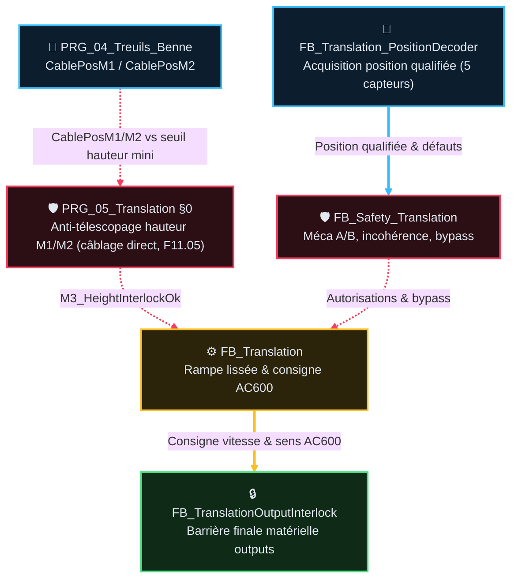

# Analyse Fonctionnelle — Partie 11 : Fonction Translation M3 (v2.3)

> La tracabilite des versions programme/document est portee par `DOC/VERSION_HISTORY.md`.

## 🎯 Rôle et périmètre

- **Rôle** : positionnement transversal du chariot/pont le long de la digue (moteur M3 via
  variateur AC600 EtherCAT) et sécurisation contre les collisions physiques.
- **Périmètre strict** : consigne de vitesse M3, décodage de position 5 capteurs, rampe de
  décélération, sécurités d'anti-télescopage Benne/Translation (câblage direct `PRG_05` §0, F11.05
  — pas une fiche FB dédiée, voir Table des fonctions).
- **Type de composant** : Domaine autonome Mouvement & Safety M3 (`PRG_05_Translation`) —
  Fonction métier.

### 🎯 Table des fonctions

> ⚠️ Corrigée 2026-08-26 (review sous-agent expert automatisme) : la version précédente listait des
> IDs `TC-P11-010`…`060` **inventés**, ne correspondant à aucun test réel des fiches FB (chacune
> propriétaire unique de sa plage, voir §1). Table reconstruite à partir des catalogues réels.

> **Etat** ? `V` valid?, impl?mentation non v?rifi?e ? `V-I` valid? et impl?ment? ? `NV` non valid?, non impl?ment? ? `NV-I` code pr?sent mais non valid? ? `R` refus? ? `NA` non applicable.

| ID | Fonction | Description | Réalisée par | Criticité | TC couvrants | Statut | Etat |
|---|---|---|---|---|---|---|---|
| `F11.01` | Décoder la position M3 (5 capteurs) | Position qualifiée Travail/Trémie/Extrêmes ; incohérence → défaut immédiat | `FB_Translation_PositionDecoder` | 🟠 C3 | <nobr><code>TC-P11-001</code></nobr>, 002 | ⚠️ cible PRG‑05 ; code encore PRG‑02 | `NV` |
| `F11.02` | Protéger M3 (Méca A/B, incohérence, bypass) | Arrêt commandé mais mouvement résiduel / incohérence prolongée → SafeStop+PowerCutOff | `FB_Safety_Translation` | 🔴 C4 | <nobr><code>TC-P11-002</code></nobr>, 010, 011, 014 | ✅ | `NV-I` |
| `F11.03` | Piloter le mouvement M3 (rampe, ralentissement, interlock sens) | Joystick/SemiAuto → rampe → AC600 ; ralentissement PV ; boutons IHM MAINT exigent homme-mort | `FB_Translation` | 🟠 C3 | <nobr><code>TC-P11-003</code></nobr>-005, 013 | ✅ | `NV-I` |
| `F11.04` | Barrière finale sorties + watchdog frein | Watchdog frein 500ms, réautorisation post-timeout, gate mot/fréquence, reset AC600 sous inhibition | `FB_TranslationOutputInterlock` | 🔴 C4 | <nobr><code>TC-P11-006</code></nobr>-009 | ✅ | `NV-I` |
| `F11.05` | Anti-télescopage hauteur M1/M2 (collision benne/translation) | Bloque translation si câbles M1/M2 sous hauteur mini, sauf `Bypass.MinHeight` conscient (jamais via `BypassGlobal`) | `PRG_05_Translation` §0 (câblage direct, hors FB dédié) | 🔴 C4 | — | ⚠️ non testé (`TC-` manquant) | `NV` |

## 📑 Sommaire

1. [🧪 Points de validation](#1--points-de-validation)
2. [🧱 Composition — fiches FB dédiées](#2--composition--fiches-fb-dédiées)
3. [⚙️ Intégration programme & Architecture](#3--intégration-programme--architecture)
4. [📏 Convention de position M3](#4--convention-de-position-m3)
5. [📜 Suivi historique](#5--suivi-historique)
6. [❓ TBD](#6--tbd)
7. [📚 Documents liés](#7--documents-liés)

## 🧪 1 · Points de validation (`TC-P11-*`)

> ⚠️ Corrigée 2026-08-26 — voir note dans la Table des fonctions ci-dessus. Chaque fiche FB reste
> **propriétaire unique** de sa plage d'IDs ; ce chapô ne recopie que la synthèse.

> **Etat** ? `V` valid?, impl?mentation non v?rifi?e ? `V-I` valid? et impl?ment? ? `NV` non valid?, non impl?ment? ? `NV-I` code pr?sent mais non valid? ? `R` refus? ? `NA` non applicable.

| <nobr>ID Unique</nobr> | Groupe | Comportement Attendu | <nobr>Type</nobr> | <nobr>Réf FB</nobr> | Etat |
|---|---|---|---|---|---|
| <nobr><code>TC-P11-001/002</code></nobr> | **Position & cohérence** | 5 capteurs ➔ mot valide ➔ position qualifiée. Mot incohérent ➔ `Incoherent=TRUE` ➔ Safety bit7 ➔ SafeStop+PowerCutOff | <nobr><code>💻 AUTO</code></nobr> | <small><code>FB_Translation_PositionDecoder</code></small> | `NV-I` |
| <nobr><code>TC-P11-010/011/014</code></nobr> | **Sécurité M3 (Méca A/B, bypass)** | Arrêt commandé mais mouvement résiduel (Méca A) ou incohérence prolongée (Méca B) ➔ SafeStop+PowerCutOff. `BypassGlobal` efface `ErrorId` | <nobr><code>⚡ AUTO_PLC</code></nobr> | <small><code>FB_Safety_Translation</code></small> | `NV-I` |
| <nobr><code>TC-P11-003/004/005/013</code></nobr> | **Vitesse, rampes & interlock sens** | Joystick/SemiAuto ➔ Rampe ➔ AC600. Ralentissement PV si `Direction=1`+capteur. Interlock sens 200ms si vitesse≠0. Boutons IHM MAINT exigent homme-mort | <nobr><code>⚡ AUTO_PLC</code></nobr> | <small><code>FB_Translation</code></small> | `NV` |
| <nobr><code>TC-P11-006-009</code></nobr> | **Barrière sorties & watchdog frein** | Watchdog frein 500ms sans confirmation ➔ FAULT+Inhibit. Réautorisation = Cause+Reset+Mot 0+nouvelle demande. Zéro redémarrage auto | <nobr><code>⚡ AUTO_PLC</code></nobr> | <small><code>FB_TranslationOutputInterlock</code></small> | `NV` |
| — (aucun TC) | **Anti-télescopage hauteur M1/M2** | Translation bloquée si `CablePosM1` ou `CablePosM2` sous `_TranslationMinHeightM1M2_M`, sauf `Bypass.MinHeight` conscient. ⚠️ Câblé directement dans `PRG_05_Translation.st` §0, hors `FB_Safety_Translation` — pas de test dédié aujourd'hui | <nobr><code>⚠️ manquant</code></nobr> | <small><code>PRG_05_Translation</code></small> | `NV` |

---

## 🧱 2 · Composition — fiches FB dédiées

| Fiche | FB détaillé | Contenu |
|---|---|---|
| [`FB_Translation_PositionDecoder_v1.1.md`](AF_Partie-11_Fonction_Translation/FB_Translation_PositionDecoder_v1.1.md) | `FB_Translation_PositionDecoder` | 5 capteurs → mot, position qualifiée, incohérence |
| [`FB_Safety_Translation_v1.1.md`](AF_Partie-11_Fonction_Translation/FB_Safety_Translation_v1.1.md) | `FB_Safety_Translation` | 8 bits ErrorId, Méca A/B, anti-télescopage, bypass |
| [`FB_Translation_v1.1.md`](AF_Partie-11_Fonction_Translation/FB_Translation_v1.1.md) | `FB_Translation` (+ `FB_Brake`, `FB_Ramp`) | Mouvement, rampe, mot AC600, ralentissement PV |
| [`FB_TranslationOutputInterlock_v1.1.md`](AF_Partie-11_Fonction_Translation/FB_TranslationOutputInterlock_v1.1.md) | `FB_TranslationOutputInterlock` | Barrière finale, watchdog frein, anti-redémarrage |

⚠️ **Correction 2026-08-26** (review sous-agent expert automatisme) : le diagramme précédent
attribuait l'anti-télescopage à `FB_Safety_Translation` — faux. L'interlock hauteur M1/M2 est
câblé **directement dans `PRG_05_Translation.st` §0** (`M3_HeightInterlockOk`, `HeightInterlockBlocking`),
hors de toute fiche FB dédiée, avec entrée croisée depuis `PRG_04_Treuils_Benne`
(`CablePosM1`/`CablePosM2`) — un flux inter-domaine absent du diagramme précédent.

Trait plein épais = flux de données transformées ; pointillé = signal de commande/permission.
Couleur = domaine (cyan acquisition, rouge sécurité, jaune commande/mouvement, vert sortie),
même dictionnaire que `GUIDE_EDITION_AF_v1.0.md §3quater`.

---

## ⚙️ 3 · Intégration programme & Architecture

- **POU cible unique** : `PRG_05_Translation` (ST pur). ⚠️ Le code actuel instancie encore le
  décodeur dans `PRG_02_Acquisition` ; migration C3 à planifier sans double producteur.
- **Source des autorisations** : `ST_fbModes_Autorisations` distribué par `PRG_03_Modes_Cycle`.
- **Image des sorties** : Transmise à `PRG_06_Outputs` pour la barrière finale matérielle.

---

## 📏 4 · Convention de position M3 (REX 2026-08-21)

**0 m = Trémie (Extrême gauche)** · **30 m = Maintenance (Extrême droite)**. Le sens physique
`+1 = vers Trémie`, `-1 = vers Maintenance` reste inchangé partout (indépendant de la convention).

Positions calibrées des 5 capteurs (`_TranslationPosXxx_M`, `GVL_PERSISTENT`) — **distances
non-linéaires** :

| Capteur | Position (m) | Segment | Longueur |
|---|---|---|---|
| Trémie | 0.0 | Trémie→PV | 5 m |
| PV | 5.0 | PV→P2 | 10 m |
| P2 | 15.0 | P2→P1 | 5 m |
| P1 | 20.0 | P1→Maintenance | 10 m |
| Maintenance | 30.0 | — | — |

Consommateurs : `FB_Translation_PositionEstimator` (odométrie + recalage), `FB_Sim_Translation`
(modèle sim, init à la Trémie 0 m), recopie persistante `_TranslationPosEstimated_M`.

---

## 📜 5 · Suivi historique

| Version | Date | Changement |
|---|---|---|
| v2.3 | 2026-08-26 | Mise en conformite `GUIDE_EDITION_AF_v1.0` : Sommaire lié (était totalement désynchronisé des sections réelles), section `🎯 Rôle et périmètre` explicite, Table des fonctions ajoutée (obligatoire, famille Fonctions métier, absente jusqu'ici), diagramme composition HTML/SVG → Mermaid `flowchart TD` stylisé, Suivi historique + TBD + **Documents liés ajoutés (section entièrement absente jusqu'ici)**, renumérotation complète. **Correctifs de fond majeurs** (review sous-agent expert automatisme) : (1) le catalogue TC du chapô (IDs `010` à `060`) était **entièrement inventé**, ne correspondant à aucun test réel des 4 fiches FB — reconstruit à partir des vrais catalogues (IDs `001` à `014`) ; (2) l'anti-télescopage était attribué à tort à `FB_Safety_Translation` — l'interlock réel (`M3_HeightInterlockOk`) est câblé directement dans `PRG_05_Translation.st` §0, hors de toute fiche FB, avec entrée croisée depuis `PRG_04_Treuils_Benne` — nouvelle fonction `F11.05` créée pour cette réalité, diagramme corrigé avec le flux inter-domaine manquant, TBD ajouté (aucun TC ne couvre cette fonction C4 aujourd'hui) |
| v2.2 | — | Version precedente (voir `ARCHIVES/Doc/`) |

## ❓ 6 · TBD

- ⛔ **F11.05 (anti-télescopage hauteur M1/M2) n'a aucun `TC-P11-*` dédié** (trouvé 2026-08-26,
  review sous-agent) — fonction C4 câblée dans `PRG_05_Translation.st` §0, jamais testée
  formellement à ce jour. Créer un TC (root ID, propriétaire à désigner : ce chapô ou une fiche
  dédiée) avant tout futur refactor de ce câblage.
- Le reste du détail (formules, seuils, ErrorId) vit dans les 4 fiches FB dédiées (§2), qui
  portent leurs propres TBD le cas échéant.

## 📚 7 · Documents liés

| Doc | Lien |
|---|---|
| AF01 | AU, coupure puissance |
| AF02 | Architecture cible — `PRG_05_Translation` |
| AF03 | Contrats FB mouvement |
| AF05 | Modes — `ST_fbModes_Autorisations` |
| AF06 | E/S physiques translation |
| AF13 | Simulation — `FB_Sim_Translation` |
| AF14 | Troubleshooting — `TROUBLESHOOTING_Translation_M3_v1.0.md` |
| Code | `CODE/I_TRANSLATION/*.st`, `CODE/M_MAIN/PRG_05_Translation.st` |
