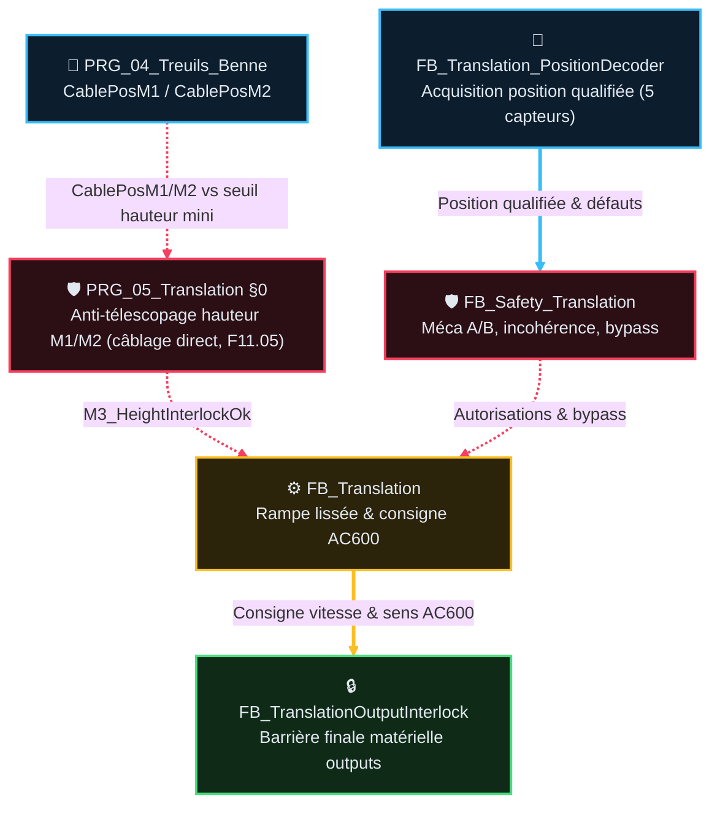

# Analyse Fonctionnelle — Partie 11 : Fonction Translation M3 (v2.3)

> La tracabilite des versions programme/document est portee par `DOC/VERSION_HISTORY.md`.

## 🎯 Rôle et périmètre

- **Rôle** : positionnement transversal du chariot/pont le long de la digue (moteur M3 via
  variateur AC600 EtherCAT) et sécurisation contre les collisions physiques.
- **Périmètre strict** : consigne de vitesse M3, décodage de position 5 capteurs, rampe de
  décélération, sécurités d'anti-télescopage Benne/Translation (câblage direct `PRG_05` §0, F11.05
  — pas une fiche FB dédiée, voir Table des fonctions).
- **Type de composant** : Domaine autonome Mouvement & Safety M3 (`PRG_05_Translation`) —
  Fonction métier.

### 🎯 Table des fonctions

> ⚠️ Corrigée 2026-08-26 (review sous-agent expert automatisme) : la version précédente listait des
> IDs `TC-P11-010`…`060` **inventés**, ne correspondant à aucun test réel des fiches FB (chacune
> propriétaire unique de sa plage, voir §1). Table reconstruite à partir des catalogues réels.

> **État** — `V` validé, implémentation non vérifiée · `V-I` validé et implémenté · `NV` non validé,
> non implémenté · `NV-I` code présent mais non validé · `R` refusé · `NA` non applicable.

<table style="width: 100%; table-layout: fixed; border-collapse: collapse; font-size: 14px;">
  <colgroup>
    <col style="width: 40px;">
    <col style="width: 140px;">
    <col style="width: calc(100% - 520px);">
    <col style="width: 110px;">
    <col style="width: 50px;">
    <col style="width: 90px;">
    <col style="width: 50px;">
    <col style="width: 40px;">
  </colgroup>
  <thead>
    <tr style="border-bottom: 2px solid #475569; text-align: left;">
      <th style="padding: 4px 1px; text-align: center;"><small><b>ID</b></small></th>
      <th style="padding: 4px 1px; text-align: center;"><small>Fonction</small></th>
      <th style="padding: 4px 8px;">Description</th>
      <th style="padding: 4px 1px; text-align: center;"><small>Réalisée par</small></th>
      <th style="padding: 4px 1px; text-align: center;"><small>Criticité</small></th>
      <th style="padding: 4px 1px; text-align: center;"><small>TC couvrants</small></th>
      <th style="padding: 4px 1px; text-align: center;"><small>Statut</small></th>
      <th style="padding: 4px 1px; text-align: center;"><small>État</small></th>
    </tr>
  </thead>
  <tbody>
    <tr style="border-bottom: 1px solid rgba(255,255,255,0.08);">
      <td style="padding: 4px 1px; text-align: center; vertical-align: middle;">F11.01</td>
      <td style="padding: 4px 1px; text-align: center; vertical-align: middle;"><small><b>Décoder la position M3 (5 capteurs)</b></small></td>
      <td style="padding: 6px 8px; line-height: 1.55;">Position qualifiée Travail/Trémie/Extrêmes ; incohérence → défaut immédiat</td>
      <td style="padding: 4px 1px; text-align: center; vertical-align: middle;"><small><code>FB_Translation_PositionDecoder</code></small></td>
      <td style="padding: 4px 1px; text-align: center; vertical-align: middle;"><small>🟠 C3</small></td>
      <td style="padding: 4px 1px; text-align: center; vertical-align: middle;">TC-P11-001, 002</td>
      <td style="padding: 4px 1px; text-align: center; vertical-align: middle;"><small>⚠️ cible PRG‑05 ; code encore PRG‑02</small></td>
      <td style="padding: 4px 1px; text-align: center; vertical-align: middle;"><small><code>NV</code></small></td>
    </tr>
    <tr style="border-bottom: 1px solid rgba(255,255,255,0.08);">
      <td style="padding: 4px 1px; text-align: center; vertical-align: middle;">F11.02</td>
      <td style="padding: 4px 1px; text-align: center; vertical-align: middle;"><small><b>Protéger M3 (Méca A/B, incohérence, bypass)</b></small></td>
      <td style="padding: 6px 8px; line-height: 1.55;">Arrêt commandé mais mouvement résiduel / incohérence prolongée → SafeStop+PowerCutOff</td>
      <td style="padding: 4px 1px; text-align: center; vertical-align: middle;"><small><code>FB_Safety_Translation</code></small></td>
      <td style="padding: 4px 1px; text-align: center; vertical-align: middle;"><small>🔴 C4</small></td>
      <td style="padding: 4px 1px; text-align: center; vertical-align: middle;">TC-P11-002, 010, 011, 014</td>
      <td style="padding: 4px 1px; text-align: center; vertical-align: middle;"><small>✅</small></td>
      <td style="padding: 4px 1px; text-align: center; vertical-align: middle;"><small><code>NV-I</code></small></td>
    </tr>
    <tr style="border-bottom: 1px solid rgba(255,255,255,0.08);">
      <td style="padding: 4px 1px; text-align: center; vertical-align: middle;">F11.03</td>
      <td style="padding: 4px 1px; text-align: center; vertical-align: middle;"><small><b>Piloter le mouvement M3 (rampe, ralentissement, interlock sens)</b></small></td>
      <td style="padding: 6px 8px; line-height: 1.55;">Joystick/SemiAuto → rampe → AC600 ; ralentissement PV ; boutons IHM MAINT exigent homme-mort</td>
      <td style="padding: 4px 1px; text-align: center; vertical-align: middle;"><small><code>FB_Translation</code></small></td>
      <td style="padding: 4px 1px; text-align: center; vertical-align: middle;"><small>🟠 C3</small></td>
      <td style="padding: 4px 1px; text-align: center; vertical-align: middle;">TC-P11-003-005, 013</td>
      <td style="padding: 4px 1px; text-align: center; vertical-align: middle;"><small>✅</small></td>
      <td style="padding: 4px 1px; text-align: center; vertical-align: middle;"><small><code>NV-I</code></small></td>
    </tr>
    <tr style="border-bottom: 1px solid rgba(255,255,255,0.08);">
      <td style="padding: 4px 1px; text-align: center; vertical-align: middle;">F11.04</td>
      <td style="padding: 4px 1px; text-align: center; vertical-align: middle;"><small><b>Barrière finale sorties + watchdog frein</b></small></td>
      <td style="padding: 6px 8px; line-height: 1.55;">Watchdog frein 500ms, réautorisation post-timeout, gate mot/fréquence, reset AC600 sous inhibition</td>
      <td style="padding: 4px 1px; text-align: center; vertical-align: middle;"><small><code>FB_TranslationOutputInterlock</code></small></td>
      <td style="padding: 4px 1px; text-align: center; vertical-align: middle;"><small>🔴 C4</small></td>
      <td style="padding: 4px 1px; text-align: center; vertical-align: middle;">TC-P11-006-009</td>
      <td style="padding: 4px 1px; text-align: center; vertical-align: middle;"><small>✅</small></td>
      <td style="padding: 4px 1px; text-align: center; vertical-align: middle;"><small><code>NV-I</code></small></td>
    </tr>
    <tr style="border-bottom: 1px solid rgba(255,255,255,0.08);">
      <td style="padding: 4px 1px; text-align: center; vertical-align: middle;">F11.05</td>
      <td style="padding: 4px 1px; text-align: center; vertical-align: middle;"><small><b>Anti-télescopage hauteur M1/M2 (collision benne/translation)</b></small></td>
      <td style="padding: 6px 8px; line-height: 1.55;">Bloque translation si câbles M1/M2 sous hauteur mini, sauf <code>Bypass.MinHeight</code> conscient (jamais via <code>BypassGlobal</code>)</td>
      <td style="padding: 4px 1px; text-align: center; vertical-align: middle;"><small><code>PRG_05_Translation</code> §0 (câblage direct, hors FB dédié)</small></td>
      <td style="padding: 4px 1px; text-align: center; vertical-align: middle;"><small>🔴 C4</small></td>
      <td style="padding: 4px 1px; text-align: center; vertical-align: middle;">TC-P11-015</td>
      <td style="padding: 4px 1px; text-align: center; vertical-align: middle;"><small>✅</small></td>
      <td style="padding: 4px 1px; text-align: center; vertical-align: middle;"><small><code>NV</code></small></td>
    </tr>
  </tbody>
</table>

## 📑 Sommaire

1. [🧪 Table des points de validation (non détaillé)](#1-table-des-points-de-validation-non-détaillé)
2. [🧱 Composition — fiches FB dédiées](#2-composition-fiches-fb-dédiées)
3. [⚙️ Intégration programme & Architecture](#3-intégration-programme-architecture)
4. [📏 Convention de position M3](#4-convention-de-position-m3)
5. [📜 Suivi historique](#5-suivi-historique)
6. [❓ TBD](#6-tbd)
7. [📚 Documents liés](#7-documents-liés)

## 🧪 1 · Table des points de validation (non détaillé)

> ⚠️ Corrigée 2026-08-26 — voir note dans la Table des fonctions ci-dessus. Chaque fiche FB reste
> **propriétaire unique** de sa plage d'IDs ; ce chapô ne recopie que la synthèse.

> **État** — `V` validé, implémentation non vérifiée · `V-I` validé et implémenté · `NV` non validé,
> non implémenté · `NV-I` code présent mais non validé · `R` refusé · `NA` non applicable.

<table style="width: 100%; table-layout: fixed; border-collapse: collapse; font-size: 14px;">
  <colgroup>
    <col style="width: 28px;">
    <col style="width: 50px;">
    <col style="width: calc(100% - 165px);">
    <col style="width: 45px;">
    <col style="width: 26px;">
    <col style="width: 36px;">
  </colgroup>
  <thead>
    <tr style="border-bottom: 2px solid #475569; text-align: left;">
      <th style="padding: 4px 1px; text-align: center;"><small><b>ID</b></small></th>
      <th style="padding: 4px 1px; text-align: center;"><small>Intention</small></th>
      <th style="padding: 4px 8px;">Séquence &amp; Déroulé des étapes (Comportement attendu)</th>
      <th style="padding: 4px 1px; text-align: center;"><small>Type</small></th>
      <th style="padding: 4px 1px; text-align: center;"><small>Réf</small></th>
      <th style="padding: 4px 1px; text-align: center;"><small>État</small></th>
    </tr>
  </thead>
  <tbody>
    <tr style="border-bottom: 1px solid rgba(255,255,255,0.08);">
      <td style="padding: 4px 1px; text-align: center; vertical-align: middle;">TC-P11-001/002</td>
      <td style="padding: 4px 1px; text-align: center; vertical-align: middle;"><small><b>Position</b> &amp; cohérence</small></td>
      <td style="padding: 6px 8px; line-height: 1.55;">
        💤 <b>Étape 0</b> : 5 capteurs M3 lus, mot capteurs en formation 
        🚀 <b>Étape 1</b> : Décodage 5 capteurs → mot valide → position qualifiée (Travail/Trémie/Extrêmes) 
        ⚡ <b>Étape 2</b> : Mot incohérent injecté → <code>Incoherent=TRUE</code> 
        ✅ <b>Étape 3</b> : Safety bit7 → <code>SafeStop</code>+<code>PowerCutOff</code>
      </td>
      <td style="padding: 4px 1px; text-align: center;"><small><code>💻 AUTO</code></small></td>
      <td style="padding: 4px 1px; text-align: center;"><small><code>FB_Translation_PositionDecoder</code></small></td>
      <td style="padding: 4px 1px; text-align: center;"><small><code>NV-I</code></small></td>
    </tr>
    <tr style="border-bottom: 1px solid rgba(255,255,255,0.08);">
      <td style="padding: 4px 1px; text-align: center; vertical-align: middle;">TC-P11-010/011/014</td>
      <td style="padding: 4px 1px; text-align: center; vertical-align: middle;"><small><b>Sécurité</b> M3</small></td>
      <td style="padding: 6px 8px; line-height: 1.55;">
        💤 <b>Étape 0</b> : M3 en mouvement nominal, <code>BypassGlobal=FALSE</code> 
        🚀 <b>Étape 1</b> : Injection défaut (Méca A : mouvement résiduel ; Méca B : incohérence prolongée) 
        ⚡ <b>Étape 2</b> : <code>SafeStop</code>+<code>PowerCutOff</code> déclenchés 
        ✅ <b>Étape 3</b> : <code>BypassGlobal</code> efface <code>ErrorId</code> (vérifié séparément)
      </td>
      <td style="padding: 4px 1px; text-align: center;"><small><code>⚡ AUTO_PLC</code></small></td>
      <td style="padding: 4px 1px; text-align: center;"><small><code>FB_Safety_Translation</code></small></td>
      <td style="padding: 4px 1px; text-align: center;"><small><code>NV-I</code></small></td>
    </tr>
    <tr style="border-bottom: 1px solid rgba(255,255,255,0.08);">
      <td style="padding: 4px 1px; text-align: center; vertical-align: middle;">TC-P11-003/004/005/013</td>
      <td style="padding: 4px 1px; text-align: center; vertical-align: middle;"><small><b>Vitesse</b> &amp; interlock</small></td>
      <td style="padding: 6px 8px; line-height: 1.55;">
        💤 <b>Étape 0</b> : M3 au repos, joystick au neutre 
        🚀 <b>Étape 1</b> : Consigne joystick/SemiAuto → rampe → AC600 
        ⚡ <b>Étape 2</b> : Ralentissement PV si <code>Direction=1</code>+capteur ; interlock sens 200ms si vitesse≠0 
        ✅ <b>Étape 3</b> : Boutons IHM MAINT exigent <code>DeadmanArmed</code> — mouvement validé
      </td>
      <td style="padding: 4px 1px; text-align: center;"><small><code>⚡ AUTO_PLC</code></small></td>
      <td style="padding: 4px 1px; text-align: center;"><small><code>FB_Translation</code></small></td>
      <td style="padding: 4px 1px; text-align: center;"><small><code>NV</code></small></td>
    </tr>
    <tr style="border-bottom: 1px solid rgba(255,255,255,0.08);">
      <td style="padding: 4px 1px; text-align: center; vertical-align: middle;">TC-P11-006-009</td>
      <td style="padding: 4px 1px; text-align: center; vertical-align: middle;"><small><b>Barrière</b> sorties</small></td>
      <td style="padding: 6px 8px; line-height: 1.55;">
        💤 <b>Étape 0</b> : Sorties M3 autorisées, frein OK 
        🚀 <b>Étape 1</b> : Perte <code>BrakeFeedback</code> pendant mouvement 
        ⚡ <b>Étape 2</b> : Watchdog frein 500ms sans confirmation → FAULT+Inhibit 
        ✅ <b>Étape 3</b> : Réautorisation = Cause+Reset+Mot 0+nouvelle demande — zéro redémarrage auto
      </td>
      <td style="padding: 4px 1px; text-align: center;"><small><code>⚡ AUTO_PLC</code></small></td>
      <td style="padding: 4px 1px; text-align: center;"><small><code>FB_TranslationOutputInterlock</code></small></td>
      <td style="padding: 4px 1px; text-align: center;"><small><code>NV</code></small></td>
    </tr>
    <tr style="border-bottom: 1px solid rgba(255,255,255,0.08);">
      <td style="padding: 4px 1px; text-align: center; vertical-align: middle;">TC-P11-015</td>
      <td style="padding: 4px 1px; text-align: center; vertical-align: middle;"><small><b>Anti-</b> télescop.</small></td>
      <td style="padding: 6px 8px; line-height: 1.55;">
        💤 <b>Étape 0</b> : <code>CablePosM1</code>/<code>CablePosM2</code> &gt; <code>_TranslationMinHeightM1M2_M</code> (6.0m) 
        🚀 <b>Étape 1</b> : Descente treuils sous 6.0m → <code>M3_HeightInterlockOk=FALSE</code> 
        ⚡ <b>Étape 2</b> : Translation bloquée ; <code>Bypass.MinHeight</code> (dédié) lève l'interlock, <code>BypassGlobal</code> non 
        ✅ <b>Étape 3</b> : Interlock anti-télescopage actif — câblé <code>PRG_05_Translation.st</code> §0 (hors FB dédié)
      </td>
      <td style="padding: 4px 1px; text-align: center;"><small><code>💻 AUTO</code></small></td>
      <td style="padding: 4px 1px; text-align: center;"><small><code>PRG_05_Translation</code></small></td>
      <td style="padding: 4px 1px; text-align: center;"><small><code>NV-I</code></small></td>
    </tr>
  </tbody>
</table>

---

## 🧱 2 · Composition — fiches FB dédiées

| Fiche | FB détaillé | Contenu |
|---|---|---|
| [`FB_Translation_PositionDecoder_v1.1.md`](AF_Partie-11_Fonction_Translation/FB_Translation_PositionDecoder_v1.1.md) | `FB_Translation_PositionDecoder` | 5 capteurs → mot, position qualifiée, incohérence |
| [`FB_Safety_Translation_v1.1.md`](AF_Partie-11_Fonction_Translation/FB_Safety_Translation_v1.1.md) | `FB_Safety_Translation` | 8 bits ErrorId, Méca A/B, anti-télescopage, bypass |
| [`FB_Translation_v1.1.md`](AF_Partie-11_Fonction_Translation/FB_Translation_v1.1.md) | `FB_Translation` (+ `FB_Brake`, `FB_Ramp`) | Mouvement, rampe, mot AC600, ralentissement PV |
| [`FB_TranslationOutputInterlock_v1.1.md`](AF_Partie-11_Fonction_Translation/FB_TranslationOutputInterlock_v1.1.md) | `FB_TranslationOutputInterlock` | Barrière finale, watchdog frein, anti-redémarrage |

⚠️ **Correction 2026-08-26** (review sous-agent expert automatisme) : le diagramme précédent
attribuait l'anti-télescopage à `FB_Safety_Translation` — faux. L'interlock hauteur M1/M2 est
câblé **directement dans `PRG_05_Translation.st` §0** (`M3_HeightInterlockOk`, `HeightInterlockBlocking`),
hors de toute fiche FB dédiée, avec entrée croisée depuis `PRG_04_Treuils_Benne`
(`CablePosM1`/`CablePosM2`) — un flux inter-domaine absent du diagramme précédent.

Trait plein épais = flux de données transformées ; pointillé = signal de commande/permission.
Couleur = domaine (cyan acquisition, rouge sécurité, jaune commande/mouvement, vert sortie),
même dictionnaire que `GUIDE_EDITION_AF_v1.0.md §3quater`.

---

## ⚙️ 3 · Intégration programme & Architecture

- **POU cible unique** : `PRG_05_Translation` (ST pur). ⚠️ Le code actuel instancie encore le
  décodeur dans `PRG_02_Acquisition` ; migration C3 à planifier sans double producteur.
- **Source des autorisations** : `ST_fbModes_Autorisations` distribué par `PRG_03_Modes_Cycle`.
- **Image des sorties** : Transmise à `PRG_06_Outputs` pour la barrière finale matérielle.

---

## 📏 4 · Convention de position M3 (REX 2026-08-21)

**0 m = Trémie (Extrême gauche)** · **30 m = Maintenance (Extrême droite)**. Le sens physique
`+1 = vers Trémie`, `-1 = vers Maintenance` reste inchangé partout (indépendant de la convention).

Positions calibrées des 5 capteurs (`_TranslationPosXxx_M`, `GVL_PERSISTENT`) — **distances
non-linéaires** :

| Capteur | Position (m) | Segment | Longueur |
|---|---|---|---|
| Trémie | 0.0 | Trémie→PV | 5 m |
| PV | 5.0 | PV→P2 | 10 m |
| P2 | 15.0 | P2→P1 | 5 m |
| P1 | 20.0 | P1→Maintenance | 10 m |
| Maintenance | 30.0 | — | — |

Consommateurs : `FB_Translation_PositionEstimator` (odométrie + recalage), `FB_Sim_Translation`
(modèle sim, init à la Trémie 0 m), recopie persistante `_TranslationPosEstimated_M`.

---

## 📜 5 · Suivi historique

| Version | Date | Changement |
|---|---|---|
| v2.3 | 2026-08-26 | Mise en conformite `GUIDE_EDITION_AF_v1.0` : Sommaire lié (était totalement désynchronisé des sections réelles), section `🎯 Rôle et périmètre` explicite, Table des fonctions ajoutée (obligatoire, famille Fonctions métier, absente jusqu'ici), diagramme composition HTML/SVG → Mermaid `flowchart TD` stylisé, Suivi historique + TBD + **Documents liés ajoutés (section entièrement absente jusqu'ici)**, renumérotation complète. **Correctifs de fond majeurs** (review sous-agent expert automatisme) : (1) le catalogue TC du chapô (IDs `010` à `060`) était **entièrement inventé**, ne correspondant à aucun test réel des 4 fiches FB — reconstruit à partir des vrais catalogues (IDs `001` à `014`) ; (2) l'anti-télescopage était attribué à tort à `FB_Safety_Translation` — l'interlock réel (`M3_HeightInterlockOk`) est câblé directement dans `PRG_05_Translation.st` §0, hors de toute fiche FB, avec entrée croisée depuis `PRG_04_Treuils_Benne` — nouvelle fonction `F11.05` créée pour cette réalité, diagramme corrigé avec le flux inter-domaine manquant, TBD ajouté (aucun TC ne couvre cette fonction C4 aujourd'hui) |
| v2.2 | — | Version precedente (voir `ARCHIVES/Doc/`) |

## ❓ 6 · TBD

- ✅ **F11.05 (anti-télescopage hauteur M1/M2) : couvert** — 🆕 `TC-P11-015` créé 2026-08-29 (audit
  P3-1, `PRG_05_Translation.st:105-110`, état `NV-I`) : voir §1, ligne anti-télescopage. Sous-cas
  bypass (`TC-P11-015.1` fusionné dans la Séquence) : seul `Bypass.MinHeight` lève l'interlock, `BypassGlobal` non.
- Le reste du détail (formules, seuils, ErrorId) vit dans les 4 fiches FB dédiées (§2), qui
  portent leurs propres TBD le cas échéant.

## 📚 7 · Documents liés

| Doc | Lien |
|---|---|
| AF01 | AU, coupure puissance |
| AF02 | Architecture cible — `PRG_05_Translation` |
| AF03 | Contrats FB mouvement |
| AF05 | Modes — `ST_fbModes_Autorisations` |
| AF06 | E/S physiques translation |
| AF13 | Simulation — `FB_Sim_Translation` |
| AF14 | Troubleshooting — `TROUBLESHOOTING_Translation_M3_v1.0.md` |
| Code | `CODE/I_TRANSLATION/*.st`, `CODE/M_MAIN/PRG_05_Translation.st` |
