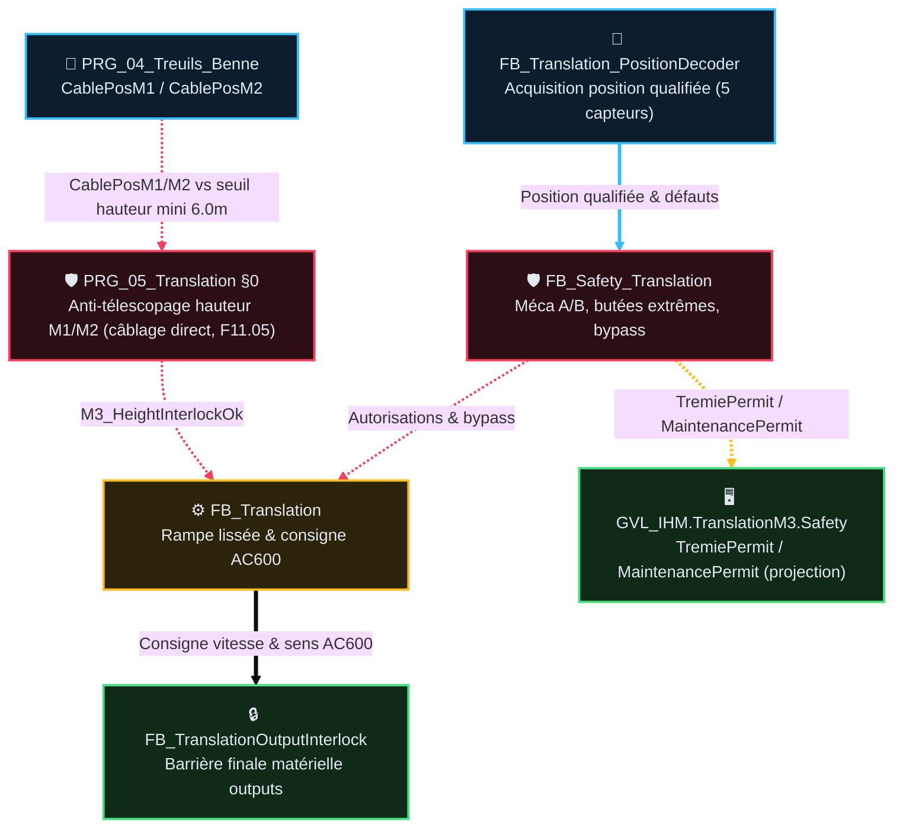

# Analyse Fonctionnelle — Partie 11 : Fonction Translation M3 (v2.4)

> La traçabilité des versions programme/document est portée par [`DOC/VERSION_HISTORY.md`](../VERSION_HISTORY.md).  
> Méthodologie et standard de test en 2 étages définis par [`DOC/STDS/GUIDES/GUIDE_METHODOLOGIE_AF_ET_TESTS_2_ETAGES_v1.0.md`](../STDS/GUIDES/GUIDE_METHODOLOGIE_AF_ET_TESTS_2_ETAGES_v1.0.md).

---

## 🎯 Rôle et périmètre

- **Rôle** : Positionnement transversal du chariot/pont le long de la digue (moteur M3 via variateur AC600 EtherCAT) et sécurisation anti-collision.
- **Périmètre strict** :
  - Pilotage de la consigne de vitesse M3 et de la rampe d'accélération/décélération.
  - Séquencement et surveillance matérielle du frein mécanique.
  - Décodage de position physique par 5 capteurs inductifs et odométrie de recalage.
  - Sécurités d'axe : arrêt d'urgence, butées directionnelles, surveillance de mouvement résiduel, et interlock d'anti-télescopage Benne/Translation (`PRG_05` §0, F11.05).
- **Type de composant** : Domaine autonome Mouvement & Safety M3 (`PRG_05_Translation`) — Fonction métier.

---

### 🎯 Table des fonctions

> **État** — `V` validé, implémentation non vérifiée · `V-I` validé et implémenté · `NV` non validé, non implémenté · `NV-I` code présent mais non validé · `R` refusé · `NA` non applicable.

<table style="width: 100%; table-layout: fixed; border-collapse: collapse; font-size: 14px;">
  <colgroup>
    <col style="width: 40px;">
    <col style="width: 140px;">
    <col style="width: calc(100% - 520px);">
    <col style="width: 110px;">
    <col style="width: 50px;">
    <col style="width: 90px;">
    <col style="width: 50px;">
    <col style="width: 40px;">
  </colgroup>
  <thead>
    <tr style="border-bottom: 2px solid #475569; text-align: left;">
      <th style="padding: 4px 1px; text-align: center;"><small><b>ID</b></small></th>
      <th style="padding: 4px 1px; text-align: center;"><small>Fonction</small></th>
      <th style="padding: 4px 8px;">Description</th>
      <th style="padding: 4px 1px; text-align: center;"><small>Réalisée par</small></th>
      <th style="padding: 4px 1px; text-align: center;"><small>Criticité</small></th>
      <th style="padding: 4px 1px; text-align: center;"><small>TC couvrants</small></th>
      <th style="padding: 4px 1px; text-align: center;"><small>Statut</small></th>
      <th style="padding: 4px 1px; text-align: center;"><small>État</small></th>
    </tr>
  </thead>
  <tbody>
    <tr style="border-bottom: 1px solid rgba(255,255,255,0.08);">
      <td style="padding: 4px 1px; text-align: center; vertical-align: middle;">F11.01</td>
      <td style="padding: 4px 1px; text-align: center; vertical-align: middle;"><small><b>Décoder la position M3 (5 capteurs)</b></small></td>
      <td style="padding: 6px 8px; line-height: 1.55;">Position qualifiée Travail/Trémie/Extrêmes ; odométrie recalée ; incohérence → défaut immédiat</td>
      <td style="padding: 4px 1px; text-align: center; vertical-align: middle;"><small><code>FB_Translation_PositionDecoder</code></small></td>
      <td style="padding: 4px 1px; text-align: center; vertical-align: middle;"><small>🟠 C3</small></td>
      <td style="padding: 4px 1px; text-align: center; vertical-align: middle;">TC-P11-001, 002</td>
      <td style="padding: 4px 1px; text-align: center; vertical-align: middle;"><small>✅</small></td>
      <td style="padding: 4px 1px; text-align: center; vertical-align: middle;"><small><code>V-I</code></small></td>
    </tr>
    <tr style="border-bottom: 1px solid rgba(255,255,255,0.08);">
      <td style="padding: 4px 1px; text-align: center; vertical-align: middle;">F11.02</td>
      <td style="padding: 4px 1px; text-align: center; vertical-align: middle;"><small><b>Protéger M3 (Méca A/B, butées, AU)</b></small></td>
      <td style="padding: 6px 8px; line-height: 1.55;">Arrêt commandé mais mouvement résiduel / butée atteinte → SafeStop+PowerCutOff ; produit les faits de limite <code>TremieLimitClear</code>/<code>MaintenanceLimitClear</code>. Permits effectifs calculés en <code>PRG_05</code> (§3bis).</td>
      <td style="padding: 4px 1px; text-align: center; vertical-align: middle;"><small><code>FB_Safety_Translation</code></small></td>
      <td style="padding: 4px 1px; text-align: center; vertical-align: middle;"><small>🔴 C4</small></td>
      <td style="padding: 4px 1px; text-align: center; vertical-align: middle;">TC-P11-010, 011, 014</td>
      <td style="padding: 4px 1px; text-align: center; vertical-align: middle;"><small>✅</small></td>
      <td style="padding: 4px 1px; text-align: center; vertical-align: middle;"><small><code>V-I</code></small></td>
    </tr>
    <tr style="border-bottom: 1px solid rgba(255,255,255,0.08);">
      <td style="padding: 4px 1px; text-align: center; vertical-align: middle;">F11.03</td>
      <td style="padding: 4px 1px; text-align: center; vertical-align: middle;"><small><b>Piloter le mouvement M3 (Joystick, MAINT, Cycle)</b></small></td>
      <td style="padding: 6px 8px; line-height: 1.55;">Joystick / SemiAuto ➔ rampe 20 Hz/s ➔ AC600 ; ralentissement PV 15 Hz ; boutons IHM MAINT sous Homme-Mort armé</td>
      <td style="padding: 4px 1px; text-align: center; vertical-align: middle;"><small><code>FB_Translation</code></small></td>
      <td style="padding: 4px 1px; text-align: center; vertical-align: middle;"><small>🟠 C3</small></td>
      <td style="padding: 4px 1px; text-align: center; vertical-align: middle;">TC-P11-003, 004, 005, 013</td>
      <td style="padding: 4px 1px; text-align: center; vertical-align: middle;"><small>✅</small></td>
      <td style="padding: 4px 1px; text-align: center; vertical-align: middle;"><small><code>V-I</code></small></td>
    </tr>
    <tr style="border-bottom: 1px solid rgba(255,255,255,0.08);">
      <td style="padding: 4px 1px; text-align: center; vertical-align: middle;">F11.04</td>
      <td style="padding: 4px 1px; text-align: center; vertical-align: middle;"><small><b>Barrière finale sorties &amp; watchdog frein</b></small></td>
      <td style="padding: 6px 8px; line-height: 1.55;">Watchdog frein 500 ms, réautorisation post-timeout, coupure immédiate mot/fréquence en cas de discordance</td>
      <td style="padding: 4px 1px; text-align: center; vertical-align: middle;"><small><code>FB_TranslationOutputInterlock</code></small></td>
      <td style="padding: 4px 1px; text-align: center; vertical-align: middle;"><small>🔴 C4</small></td>
      <td style="padding: 4px 1px; text-align: center; vertical-align: middle;">TC-P11-006, 007, 008, 009</td>
      <td style="padding: 4px 1px; text-align: center; vertical-align: middle;"><small>✅</small></td>
      <td style="padding: 4px 1px; text-align: center; vertical-align: middle;"><small><code>V-I</code></small></td>
    </tr>
    <tr style="border-bottom: 1px solid rgba(255,255,255,0.08);">
      <td style="padding: 4px 1px; text-align: center; vertical-align: middle;">F11.05</td>
      <td style="padding: 4px 1px; text-align: center; vertical-align: middle;"><small><b>Anti-télescopage hauteur benne M1/M2</b></small></td>
      <td style="padding: 6px 8px; line-height: 1.55;">Bloque toute translation si câbles M1/M2 sous seuil mini (< 6.0 m), sauf <code>Bypass.MinHeight</code> conscient</td>
      <td style="padding: 4px 1px; text-align: center; vertical-align: middle;"><small><code>PRG_05_Translation</code> §0 (câblage direct inter-domaine)</small></td>
      <td style="padding: 4px 1px; text-align: center; vertical-align: middle;"><small>🔴 C4</small></td>
      <td style="padding: 4px 1px; text-align: center; vertical-align: middle;">TC-P11-015</td>
      <td style="padding: 4px 1px; text-align: center; vertical-align: middle;"><small>✅</small></td>
      <td style="padding: 4px 1px; text-align: center; vertical-align: middle;"><small><code>V-I</code></small></td>
    </tr>
    <tr style="border-bottom: 1px solid rgba(255,255,255,0.08);">
      <td style="padding: 4px 1px; text-align: center; vertical-align: middle;">F11.06</td>
      <td style="padding: 4px 1px; text-align: center; vertical-align: middle;"><small><b>Dynamique simulée boucle fermée (SIL)</b></small></td>
      <td style="padding: 6px 8px; line-height: 1.55;">Validation temporelle sous SimBench via HwSim : traversée nominale, balancement de charge 10t avec rebond capteur 1s (T300), escalade graduée butée 2.5s/5s (T287)</td>
      <td style="padding: 4px 1px; text-align: center; vertical-align: middle;"><small><code>PRG_05_Translation</code> ◄► <code>FB_SimBench</code></small></td>
      <td style="padding: 4px 1px; text-align: center; vertical-align: middle;"><small>🟠 C3</small></td>
      <td style="padding: 4px 1px; text-align: center; vertical-align: middle;">TC-P11-016, 017, 018</td>
      <td style="padding: 4px 1px; text-align: center; vertical-align: middle;"><small>⏳ T300</small></td>
      <td style="padding: 4px 1px; text-align: center; vertical-align: middle;"><small><code>NV-I</code></small></td>
    </tr>
  </tbody>
</table>

---

## 📑 Sommaire

1. [🧪 Table des points de validation (Étage 1 & Étage 2)](#1-table-des-points-de-validation-étage-1--étage-2)
2. [🧱 Composition — fiches FB dédiées & Diagramme de flux](#2-composition-fiches-fb-dédiées--diagramme-de-flux)
3. [⚙️ Intégration programme & Architecture](#3-intégration-programme-architecture)
4. [🧭 3bis · Modèle uniforme des permits directionnels M3 (T184)](#3bis-modèle-uniforme-des-permits-directionnels-m3-t184)
5. [🧭 3ter · Sémantique D2 du permit M3 & Enforcement en gate (T204)](#3ter-sémantique-d2-du-permit-m3--enforcement-en-gate-t204)
6. [🧭 3quater · Escalade graduée aux butées M3 (T287)](#3quater-escalade-graduée-aux-butées-m3-t287)
7. [📏 4 · Convention de position & Cotes M3 (T301)](#4-convention-de-position--cotes-m3-t301)
8. [📜 5 · Suivi historique](#5-suivi-historique)
9. [❓ 6 · TBD](#6-tbd)
10. [📚 7 · Documents liés](#7-documents-liés)

---

## 🧪 1 · Table des points de validation (Étage 1 & Étage 2)

> Les tests combinent **non-régression boîte noire (Étage 1)** et **dynamique simulée boucle fermée (Étage 2)**.  
> Chaque test est instrumenté selon le format standardisé d'étapes chronologiques.

<table style="width: 100%; table-layout: fixed; border-collapse: collapse; font-size: 14px;">
  <colgroup>
    <col style="width: 28px;">
    <col style="width: 50px;">
    <col style="width: calc(100% - 165px);">
    <col style="width: 45px;">
    <col style="width: 26px;">
    <col style="width: 36px;">
  </colgroup>
  <thead>
    <tr style="border-bottom: 2px solid #475569; text-align: left;">
      <th style="padding: 4px 1px; text-align: center;"><small><b>ID</b></small></th>
      <th style="padding: 4px 1px; text-align: center;"><small>Intention</small></th>
      <th style="padding: 4px 8px;">Séquence &amp; Déroulé des étapes (Comportement attendu &amp; Signaux)</th>
      <th style="padding: 4px 1px; text-align: center;"><small>Type</small></th>
      <th style="padding: 4px 1px; text-align: center;"><small>Réf</small></th>
      <th style="padding: 4px 1px; text-align: center;"><small>État</small></th>
    </tr>
  </thead>
  <tbody>
    <!-- ÉTAGE 1 : NON-REGRESSION STATIQUE & BOÎTE NOIRE -->
    <tr style="border-bottom: 1px solid rgba(255,255,255,0.08);">
      <td style="padding: 4px 1px; text-align: center; vertical-align: middle;">TC-P11-001/002</td>
      <td style="padding: 4px 1px; text-align: center; vertical-align: middle;"><small><b>Position &amp; Cohérence</b> (FP11.01)</small></td>
      <td style="padding: 6px 8px; line-height: 1.55;">
        💤 <b>Étape 0 (Repos)</b> : 5 entrées capteurs DI à zéro, position odométrique stationnaire. 
        🚀 <b>Étape 1 (Qualification)</b> : Activation <code>SensorP1_DI=TRUE</code> ➔ <code>AtP1=TRUE</code>, <code>PositionDiscrete=P1</code>. 
        ⚡ <b>Étape 2 (Incohérence)</b> : Activation simultanée <code>SensorTremie_DI=TRUE</code> et <code>SensorMaintenance_DI=TRUE</code>. 
        ✅ <b>Étape 3 (Sécurité)</b> : Détection immédiate <code>Incoherent=TRUE</code> ➔ <code>M3_SafeStop_Aggregate=TRUE</code> + <code>PowerCutOff</code>.
      </td>
      <td style="padding: 4px 1px; text-align: center;"><small><code>💻 AUTO</code></small></td>
      <td style="padding: 4px 1px; text-align: center;"><small><code>PRG_05</code></small></td>
      <td style="padding: 4px 1px; text-align: center;"><small><code>V-I</code></small></td>
    </tr>
    <tr style="border-bottom: 1px solid rgba(255,255,255,0.08);">
      <td style="padding: 4px 1px; text-align: center; vertical-align: middle;">TC-P11-003..005/013</td>
      <td style="padding: 4px 1px; text-align: center; vertical-align: middle;"><small><b>Commande Joystick &amp; MAINT</b> (FP11.02)</small></td>
      <td style="padding: 6px 8px; line-height: 1.55;">
        💤 <b>Étape 0 (Repos neutre)</b> : Joystick centré (<code>RawX=5000</code>, <code>AtNeutralXY=TRUE</code>, <code>TargetFrequencyHz=0.0</code>). 
        🔒 <b>Étape 1 (Armement)</b> : <code>DeadmanArmed=TRUE</code>, <code>EffectivePermitM3_Tremie=TRUE</code>. 
        🚀 <b>Étape 2 (Zone morte &amp; décollement)</b> : Déflexion +20% ➔ <code>Direction=+1</code>, <code>BrakeReleaseCmd=TRUE</code>, rampe 20 Hz/s démarre. 
        ⚡ <b>Étape 3 (Plein régime)</b> : Déflexion +90% ➔ Rampe jusqu'à <code>TargetFrequencyHz=50.0 Hz</code> (nominal). En mode MAINT : vitesse bornée à <code>15.0 Hz</code> (PV). 
        🔄 <b>Étape 4 (Retour neutre)</b> : Retour <code>RawX=5000</code> ➔ Décélération 20 Hz/s jusqu'à 0 Hz ➔ <code>BrakeReleaseCmd=FALSE</code> (frein retombe).
      </td>
      <td style="padding: 4px 1px; text-align: center;"><small><code>⚡ AUTO_PLC</code></small></td>
      <td style="padding: 4px 1px; text-align: center;"><small><code>PRG_05</code></small></td>
      <td style="padding: 4px 1px; text-align: center;"><small><code>V-I</code></small></td>
    </tr>
    <tr style="border-bottom: 1px solid rgba(255,255,255,0.08);">
      <td style="padding: 4px 1px; text-align: center; vertical-align: middle;">TC-P11-006..009</td>
      <td style="padding: 4px 1px; text-align: center; vertical-align: middle;"><small><b>Barrière &amp; Frein</b> (FP11.04)</small></td>
      <td style="padding: 6px 8px; line-height: 1.55;">
        💤 <b>Étape 0 (Sorties prêtes)</b> : Sorties autorisées, frein fermé (<code>BrakeReleaseCmd=FALSE</code>). 
        🚀 <b>Étape 1 (Ordre de marche)</b> : Commande <code>BrakeReleaseCmd=TRUE</code> ➔ Attente retour contact auxiliaire <code>BrakeFeedback_DI</code>. 
        ⚡ <b>Étape 2 (Défaut frein)</b> : Perte de <code>BrakeFeedback_DI</code> en mouvement pendant > 500 ms ➔ Alarme watchdog frein + coupure immédiate mot/vitesse. 
        🔄 <b>Étape 3 (Anti-redémarrage)</b> : Réapparition du feedback ➔ La commande reste verrouillée (exige Cause disparue + Front Reset + Retour neutre).
      </td>
      <td style="padding: 4px 1px; text-align: center;"><small><code>⚡ AUTO_PLC</code></small></td>
      <td style="padding: 4px 1px; text-align: center;"><small><code>PRG_05</code></small></td>
      <td style="padding: 4px 1px; text-align: center;"><small><code>V-I</code></small></td>
    </tr>
    <tr style="border-bottom: 1px solid rgba(255,255,255,0.08);">
      <td style="padding: 4px 1px; text-align: center; vertical-align: middle;">TC-P11-010/011/014</td>
      <td style="padding: 4px 1px; text-align: center; vertical-align: middle;"><small><b>Sécurité &amp; Méca A/B</b> (FP11.02)</small></td>
      <td style="padding: 6px 8px; line-height: 1.55;">
        💤 <b>Étape 0 (Nominal)</b> : Chariot en marche normale, <code>BypassGlobal=FALSE</code>. 
        🚀 <b>Étape 1 (Injection anomalie)</b> : Méca A (vitesse variateur active mais consigne arrêt) ou Méca B (glissement prolongé). 
        ⚡ <b>Étape 2 (Déclenchement)</b> : Escalade en <code>SafeStop</code> + <code>PowerCutOff</code>. 
        🔄 <b>Étape 3 (Acquittement)</b> : Réarmement conditionné par disparition du mouvement + appui conscient sur Reset.
      </td>
      <td style="padding: 4px 1px; text-align: center;"><small><code>⚡ AUTO_PLC</code></small></td>
      <td style="padding: 4px 1px; text-align: center;"><small><code>PRG_05</code></small></td>
      <td style="padding: 4px 1px; text-align: center;"><small><code>V-I</code></small></td>
    </tr>
    <tr style="border-bottom: 1px solid rgba(255,255,255,0.08);">
      <td style="padding: 4px 1px; text-align: center; vertical-align: middle;">TC-P11-015</td>
      <td style="padding: 4px 1px; text-align: center; vertical-align: middle;"><small><b>Anti-Télescopage Benne</b> (FP11.05)</small></td>
      <td style="padding: 6px 8px; line-height: 1.55;">
        💤 <b>Étape 0 (Benne haute)</b> : Câbles <code>CablePosM1/M2 > 6.0 m</code> ➔ <code>M3_HeightInterlockOk=TRUE</code>. 
        🚀 <b>Étape 1 (Descente benne)</b> : <code>CablePosM1</code> descend à 5.5 m (< 6.0 m) ➔ <code>M3_HeightInterlockOk=FALSE</code>. 
        ⚡ <b>Étape 2 (Blocage axe)</b> : Toute commande de translation est neutralisée au même scan (consigne=0, frein fermé). 
        🔄 <b>Étape 3 (Bypass dédié)</b> : Seul <code>Bypass.MinHeight=TRUE</code> (action explicite) lève l'interlock ; <code>BypassGlobal</code> ne le lève jamais.
      </td>
      <td style="padding: 4px 1px; text-align: center;"><small><code>💻 AUTO</code></small></td>
      <td style="padding: 4px 1px; text-align: center;"><small><code>PRG_05</code></small></td>
      <td style="padding: 4px 1px; text-align: center;"><small><code>V-I</code></small></td>
    </tr>
    <!-- ÉTAGE 2 : DYNAMIQUE SIMULÉE SIL SIMBENCH -->
    <tr style="border-bottom: 1px solid rgba(255,255,255,0.08);">
      <td style="padding: 4px 1px; text-align: center; vertical-align: middle;">TC-P11-016</td>
      <td style="padding: 4px 1px; text-align: center; vertical-align: middle;"><small><b>Traversée &amp; Odométrie</b> (DS11.01)</small></td>
      <td style="padding: 6px 8px; line-height: 1.55;">
        💤 <b>Étape 0 (Départ Trémie)</b> : Chariot à 0.0 m simulé sous <code>FB_SimBench</code> (<code>SensorTremie_DI=TRUE</code>). 
        🚀 <b>Étape 1 (Consigne 50 Hz)</b> : Ordre continu vers Maintenance (<code>Direction=-1</code>). 
        ⚡ <b>Étape 2 (Défilement des 5 capteurs)</b> : Passage successif sur PV (5m), P2 (15m), P1 (20m), Maintenance (30m). 
        🔄 <b>Étape 3 (Recalage dynamique)</b> : À chaque front de capteur dans HwSim, l'odométrie <code>EstimatedPos_M</code> se recale sur la cote exacte sans glitch ni saut discontinu.
      </td>
      <td style="padding: 4px 1px; text-align: center;"><small><code>🔄 SIL</code></small></td>
      <td style="padding: 4px 1px; text-align: center;"><small><code>SimBench</code></small></td>
      <td style="padding: 4px 1px; text-align: center;"><small><code>NV-I</code></small></td>
    </tr>
    <tr style="border-bottom: 1px solid rgba(255,255,255,0.08);">
      <td style="padding: 4px 1px; text-align: center; vertical-align: middle;">TC-P11-017</td>
      <td style="padding: 4px 1px; text-align: center; vertical-align: middle;"><small><b>Balancement &amp; Rebond (T300)</b> (DS11.02)</small></td>
      <td style="padding: 6px 8px; line-height: 1.55;">
        💤 <b>Étape 0 (Vitesse établie)</b> : Chariot approche du capteur P1 à 50 Hz sous charge suspendue oscillante (10 t). 
        🚀 <b>Étape 1 (1er franchissement)</b> : Front montant <code>SensorP1_DI=TRUE</code> généré par HwSim. 
        ⚡ <b>Étape 2 (Oscillation pendulaire)</b> : L'oscillation fait sortir puis ré-entrer la cible : le signal bascule <code>1 ➔ 0 ➔ 1</code> sur 1 seconde. 
        🔄 <b>Étape 3 (Filtrage automate)</b> : Le décodeur filtre la perte momentanée : <code>AtP1</code> reste qualifié, pas de claquement du frein ni de faux défaut.
      </td>
      <td style="padding: 4px 1px; text-align: center;"><small><code>🔄 SIL</code></small></td>
      <td style="padding: 4px 1px; text-align: center;"><small><code>SimBench</code></small></td>
      <td style="padding: 4px 1px; text-align: center;"><small><code>NV-I</code></small></td>
    </tr>
    <tr style="border-bottom: 1px solid rgba(255,255,255,0.08);">
      <td style="padding: 4px 1px; text-align: center; vertical-align: middle;">TC-P11-018</td>
      <td style="padding: 4px 1px; text-align: center; vertical-align: middle;"><small><b>Escalade Butée Graduée (T287)</b> (DS11.03)</small></td>
      <td style="padding: 6px 8px; line-height: 1.55;">
        💤 <b>Étape 0 (Heurt butée)</b> : Chariot arrive en fin de course Trémie sous commande vitesse maintenue. 
        🚀 <b>Étape 1 (T=0 s)</b> : <code>SensorTremie_DI=TRUE</code> ➔ Arrêt directionnel immédiat du variateur (consigne=0 Hz). 
        ⚡ <b>Étape 2 (T > 2.5 s)</b> : La commande vers Trémie reste maintenue ➔ Déclenchement alarme <code>SafeStop</code> (code <code>ErrorLimitSwitch</code>). 
        🔄 <b>Étape 3 (T > 5.0 s)</b> : Persistance anormale ➔ Escalade en coupure générale <code>PowerCutOff</code> mémorisée (exige Reset conscient).
      </td>
      <td style="padding: 4px 1px; text-align: center;"><small><code>🔄 SIL</code></small></td>
      <td style="padding: 4px 1px; text-align: center;"><small><code>SimBench</code></small></td>
      <td style="padding: 4px 1px; text-align: center;"><small><code>NV-I</code></small></td>
    </tr>
  </tbody>
</table>

---

## 🧱 2 · Composition — fiches FB dédiées & Diagramme de flux

| Fiche | FB détaillé | Rôle & Contenu |
|---|---|---|
| [`FB_Translation_PositionDecoder_v1.1.md`](AF_Partie-11_Fonction_Translation/FB_Translation_PositionDecoder_v1.1.md) | `FB_Translation_PositionDecoder` | Décodage des 5 capteurs inductifs, qualification de position discrète, détection d'incohérence. |
| `FB_TranslationCmdArbitrationM3` | `FB_TranslationCmdArbitrationM3` | Arbitrage des ordres de commande (AU > Défaut > Cycle > Joystick > Boutons IHM MAINT). |
| [`FB_Safety_Translation_v1.1.md`](AF_Partie-11_Fonction_Translation/FB_Safety_Translation_v1.1.md) | `FB_Safety_Translation` | Surveillance Méca A/B, butées extrêmes, gestion des 8 bits ErrorId et des bypass. |
| [`FB_Translation_v1.1.md`](AF_Partie-11_Fonction_Translation/FB_Translation_v1.1.md) | `FB_Translation` (+ `FB_Brake`, `FB_Ramp`) | Générateur de rampe de vitesse (20 Hz/s), séquence frein et ralentissement PV. |
| [`FB_TranslationOutputInterlock_v1.1.md`](AF_Partie-11_Fonction_Translation/FB_TranslationOutputInterlock_v1.1.md) | `FB_TranslationOutputInterlock` | Barrière finale matérielle, watchdog retour frein 500 ms et anti-redémarrage intempestif. |

---

## ⚙️ 3 · Intégration programme & Architecture

- **POU maître unique** : `PRG_05_Translation` (ST pur, cycle tâche 10 ms).
- **Source des autorisations** : `ST_Modes_Autorisations` distribué par `PRG_03_Modes_Cycle`.
- **Image des sorties** : Transmise à `PRG_06_Outputs` pour pilotage variateur EtherCAT AC600 et contacteurs freins.

---

### 🧭 3bis · Modèle uniforme des permits directionnels M3 (T184)

Modèle aligné sur les treuils M1/M2 (`AscentPermit`/`DescendPermit`) :  
**1 source safety ➔ 2 permits directionnels nommés par la sémantique métier ➔ projection IHM du niveau EFFECTIF** :

| Étape | Élément | Rôle |
|---|---|---|
| **1 source safety** | `FB_Safety_Translation` | Sorties `TremieLimitClear` / `MaintenanceLimitClear` (polarité fail-safe `TRUE`=autorisé), gatées par `Enable`. |
| **2 permits directionnels** | `TremiePermit` / `MaintenancePermit` | Nommés par la sémantique métier : direction `+1` vers Trémie, `-1` vers Maintenance. |
| **Permit effectif (D1)** | `EffectivePermitM3_Tremie` / `_Maintenance` | Safety directionnel **AND NOT SafeStop AND NOT PowerCutOff** (prêt à fonctionner), calculé dans `PRG_05_Translation` §1ter. |
| **Projection IHM** | `GVL_IHM.TranslationM3.Safety` | Alimenté par `PRG_05` au niveau **EFFECTIF**, projeté sur la supervision opérateur. |

---

### 🧭 3ter · Sémantique D2 du permit M3 & Enforcement en gate (T204)

- **Quand l'axe est en défaut** (`SafeStop`/`PowerCutOff` actifs) ➔ **TOUS les sens sont bloqués**.
- **Au retour en condition** ➔ un sens peut être autorisé et pas l'autre (ex: butée Trémie active ➔ `TremiePermit=FALSE`, `MaintenancePermit=TRUE`).
- **Enforcement en gate (`FB_Translation`)** : les permits directionnels sont câblés en `VAR_INPUT` de `FB_Translation`. Un `EffectiveSafeStop` local bloque la rampe de consigne vers le sens interdit **sans toucher à la variable `Direction`** : l'estimateur de position et les verrous bistables restent informés.

---

### 🧭 3quater · Escalade graduée aux butées M3 (T287)

Une butée active interdit immédiatement le seul sens qui pousse vers elle (consigne et fréquence à zéro au même scan) ; le sens opposé reste disponible :
1. **0 s à < 2.5 s** : Arrêt directionnel seul, pas d'alarme latched, pas de coupure puissance.
2. **≥ 2.5 s** : Si la commande ou le mouvement persiste (`ABS(DriveActualFreqHz) > 0.5 Hz`) ➔ Alarme `SafeStop` + diagnostic `ErrorLimitSwitch`.
3. **≥ 5.0 s** : Escalade en coupure générale `PowerCutOff` mémorisée (réarmement uniquement après disparition de la cause puis front Reset).

---

## 📏 4 · Convention de position & Cotes M3 (T301)

- **Origine 0.0 m** = Trémie (Extrême gauche / Poste de déchargement).
- **Extrémité 30.0 m** = Zone de Maintenance (Extrême droite / Parking).
- **Sens physique** : `+1` = vers Trémie (cote décroissante), `-1` = vers Maintenance (cote croissante).

### Table des 5 capteurs physiques :
| Capteur | Cote théorique | Segment | Rôle fonctionnel |
|---|---|---|---|
| **Trémie** | `0.0 m` | Butée gauche | Fin de course extrême gauche & déchargement |
| **Petite Vitesse (PV)** | `5.0 m` | Ralentissement | Déclenchement de la décélération automatique vers Trémie |
| **Palier 2 (P2)** | `15.0 m` | Intermédiaire | Repère d'approche et dégagement |
| **Palier 1 (P1)** | `20.0 m` | Poste de dragage | Position nominale de travail (au-dessus du puits de dragage) |
| **Maintenance** | `30.0 m` | Butée droite | Fin de course extrême droite & zone d'entretien |

*(Note T301 : Les cotes réelles et le ratio odométrique `GainMetersPerHzSec` sont configurables dans `GVL_PERSISTENT` sans recompilation).*

---

## 📜 5 · Suivi historique

| Version | Date | Changement |
|---|---|---|
| **v2.4** | 2026-09-16 | **Refonte standard 2 Étages (T302)** : Intégration de la méthodologie en 2 étages (Étage 1 Fonctions Principales boîte noire + Étage 2 Dynamique simulée boucle fermée SIL). Formalisation des séquences de test chronologiques avec émojis et signaux réels (`RawX`, `TargetFrequencyHz`, `BrakeReleaseCmd`, etc.). Intégration de l'escalade graduée butée (T287), de la dynamique d'oscillation capteurs (T300), et des conventions de calibration odométrique (T301). Retrait du tag obsolète "brouillon". |
| **v2.3** | 2026-08-26 | Mise en conformité `GUIDE_EDITION_AF_v1.0` : Reconstruction du catalogue TC réels (001 à 015), correction de l'anti-télescopage F11.05 câblé en direct dans `PRG_05` §0 avec entrée croisée `PRG_04`. Diagramme Mermaid mis à jour. |
| **v2.3 (T184/D1/D2/T204)** | 2026-08-31 | Harmonisation des permits directionnels effectifs M3 (`EffectivePermitM3_*`), enforcement en gate dans `FB_Translation` sans altérer `Direction`. |
| **v2.2** | — | Version initiale (archivée dans `ARCHIVES/Doc/`). |

---

## ❓ 6 · TBD

- ✅ **F11.05 (anti-télescopage hauteur M1/M2)** : Couvert par `TC-P11-015`. Seul `Bypass.MinHeight` lève l'interlock.
- ⏳ **F11.06 (dynamique simulée)** : En cours sous T300. Couvert par `TC-P11-016` (odométrie), `TC-P11-017` (T300 balancement), et `TC-P11-018` (T287 escalade) [`NV-I`].
- Les formules et seuils bas niveau vivent dans les 5 fiches FB dédiées (§2).

---

## 📚 7 · Documents liés

| Réf | Document | Rôle |
|---|---|---|
| **AF01** | [`AF_Partie-01_Analyse_Fonctionnelle_v2.1.md`](AF_Partie-01_Analyse_Fonctionnelle_v2.1.md) | Chaîne AU et coupure de puissance matérielle. |
| **AF02** | [`AF_Partie-02_Architecture_Programme_v3.2.md`](AF_Partie-02_Architecture_Programme_v3.2.md) | Architecture 7 POU (`PRG_02` ➔ `PRG_05` ➔ `PRG_06`). |
| **AF04** | [`AF_Partie-04_Mode_SemiAuto_Sequenceur_v2.3.md`](AF_Partie-04_Mode_SemiAuto_Sequenceur_v2.3.md) | Ordres de translation en cycle automatique. |
| **AF10** | [`AF_Partie-10_Fonction_Winch_v2.1.md`](AF_Partie-10_Fonction_Winch_v2.1.md) | Position des câbles treuils pour anti-télescopage. |
| **AF13** | [`AF_Partie-13_Fonction_Simulation_v2.5.md`](AF_Partie-13_Fonction_Simulation_v2.5.md) | Modèle physique `FB_SimBench` et injection `HwSim`. |
| **Guide** | [`GUIDE_METHODOLOGIE_AF_ET_TESTS_2_ETAGES_v1.0.md`](../STDS/GUIDES/GUIDE_METHODOLOGIE_AF_ET_TESTS_2_ETAGES_v1.0.md) | Standard de rédaction AF et de test en 2 étages. |
| **Code** | `CODE/I_TRANSLATION/*.st`, `CODE/M_MAIN/PRG_05_Translation.st` | Implémentation Structured Text CODESYS. |
