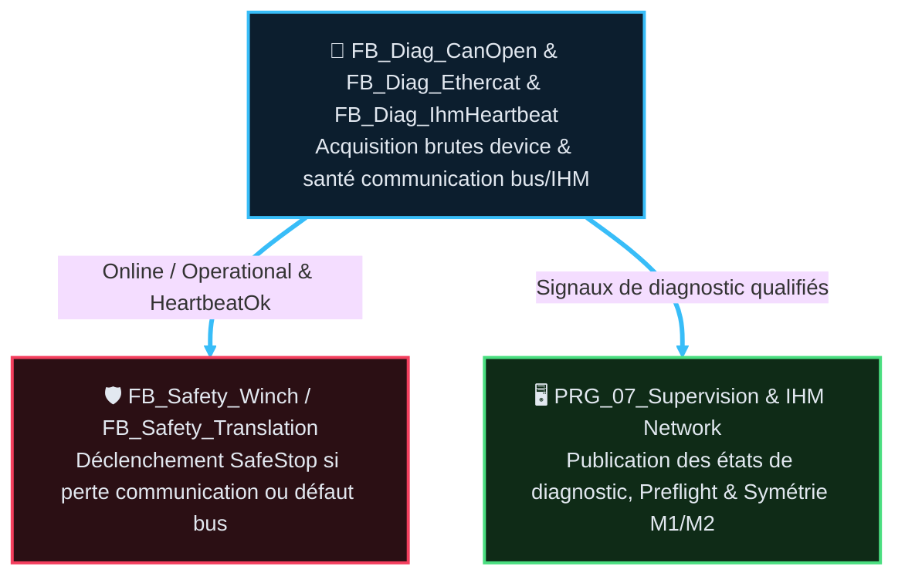

# AF Partie 12 — Diagnostic & Supervision Bus (v1.1)

> La tracabilite des versions programme/document est portee par `DOC/VERSION_HISTORY.md`.
> Source code : `CODE/C_DIAG_RESEAUX/*.st` (corrigé 2026-08-26 — l'ancien `CODE/DIAG/*.st` n'a
> jamais existé) · instances dans `PRG_01_Diagnostics` et `PRG_TROUBLESHOOTING_CFC` (ST actuels).
> Cible : les diagnostics devices/bus rejoignent `PRG_02_Acquisition`, les observateurs passifs
> rejoignent `PRG_07_Supervision` — voir §6.
> 🗺️ Architecture cible faisant foi : `DOC/AF/AF_Partie-02_Architecture_Programme_v3.2.md` §3 et §5.

## 🎯 Rôle et périmètre

- **Rôle** : diagnostics de communication bus/devices et surveillance opérateur.
- **Périmètre** : les FB diag publient des faits (`Online`, `Operational`, `State`, `ErrorId`) ;
  les FB Safety aval **décident** d'agir (SafeStop) — aucun FB diag ne coupe directement.
- **Type de composant** : `FB_Diag_CanOpen`, `FB_Diag_Ethercat`, `FB_Diag_IhmHeartbeat` — Fonction
  métier (observation pure, aucun mouvement).

### Table des fonctions

> ⛔ **Aucun `TC-P12-*` n'existe** — ni dans ce chapô, ni dans les 3 fiches FB dédiées (vérifié
> 2026-08-26, `grep` sur le dossier). Écart signalé plutôt qu'inventé — voir TBD §9.

| ID | Fonction | Description | Réalisée par | Criticité | TC couvrants | Statut |
|---|---|---|---|---|---|---|
| `F12.01` | Diagnostiquer le bus CANopen (joystick) | Perte liaison / non-opérationnel → `ErrorId` bit0/1 | `FB_Diag_CanOpen` | 🟠 C3 | — | ⚠️ non testé |
| `F12.02` | Diagnostiquer le bus EtherCAT (variateur M3, codeurs M1/M2) | Perte liaison par device → `ErrorId` bit4/5/6 (nibbles) | `FB_Diag_Ethercat` | 🟠 C3 | — | ⚠️ non testé |
| `F12.03` | Surveiller le heartbeat IHM↔PLC | Toggle bidirectionnel, détecte timeout communication | `FB_Diag_IhmHeartbeat` | 🟠 C3 | — | ⚠️ non testé |

## 📑 Sommaire

1. [🧱 Composition — fiches FB dédiées](#1--composition--fiches-fb-dédiées)
2. [🎭 Rôles et familles](#2--rôles-et-familles)
3. [🚌 DUT et bus](#3--dut-et-bus)
4. [🔄 Flux et consommateurs](#4--flux-et-consommateurs)
5. [🔗 Intégration programme](#5--intégration-programme)
6. [📊 ErrorId](#6--errorid)
7. [📜 Suivi historique](#7--suivi-historique)
8. [❓ TBD](#8--tbd)
9. [📚 Documents liés](#9--documents-liés)

---

## 🧱 1 · Composition — fiches FB dédiées

| Fiche | FB | Contenu |
|---|---|---|
| [`FB_Diag_CanOpen`](AF_Partie-12_Fonction_Diagnostic/FB_Diag_CanOpen_v1.0.md) | `FB_Diag_CanOpen` | Diagnostic bus CANopen + esclave Joystick |
| [`FB_Diag_Ethercat`](AF_Partie-12_Fonction_Diagnostic/FB_Diag_Ethercat_v1.0.md) | `FB_Diag_Ethercat` | Diagnostic bus EtherCAT (variateur M3 + codeurs M1/M2) |
| [`FB_Diag_IhmHeartbeat`](AF_Partie-12_Fonction_Diagnostic/FB_Diag_IhmHeartbeat_v1.0.md) | `FB_Diag_IhmHeartbeat` | Surveillance bidirectionnelle IHM↔PLC |

> 📌 `FB_Acquisition_Preflight` (qualification E/S machine arrêtée) est documenté dans
> [`AF_Partie-06`](AF_Partie-06_Fonction_Acquisition_Qualification_IO/FB_Acquisition_Preflight_v1.2.md).
> `FB_Winch_Symmetry` (mesure M1/M2) est documenté dans
> [`AF_Partie-10`](AF_Partie-10_Fonction_Winch/FB_Winch_Symmetry_v1.1.md).

---

## 🎭 2 · Rôles et familles

| Famille | Rôle | Coupe ? | Consommateurs |
|---|---|---|---|
| **Bus/Device** | Publie Online/Operational/State/ErrorId par device | Non (directement) | FB_Safety_Winch, FB_Safety_Translation, FB_Modes, IHM |
| **Comm opérateur** | Surveille toggle IHM, génère toggle PLC, détecte timeout | Non (directement) | FB_Safety_Winch, FB_Safety_Translation, Troubleshooting |
| **Observateur** | Verdict passif ou mesure sans rétroaction machine | Non | IHM uniquement |

> 📌 **Principe** : un FB diag ne pilote jamais SafeStop/PowerCutOff. Il publie des faits.
> Les FB_Safety_<Domaine> consomment ces faits et décident seuls de l'action.

---

## 🚌 3 · DUT et bus

| DUT | Champs clés | Producteur | Consommateur |
|---|---|---|---|
| `ST_Diag_Device` | `Online`, `Operational`, `Error`, `ErrorId`, `State` (E_Diag_State), `StateAtError` | `FB_Diag_CanOpen`, `FB_Diag_Ethercat` | Safety, Modes, IHM, Troubleshooting |
| `E_Diag_State` | `DISABLED`, `READY`, `INIT`, `MONITORING`, `ERROR`, `SIMULATED` | FB diag | IHM, Modes |
| `ST_Winch_SymmetryCfg` | Seuils (`DeltaStartDelay_Ms`, etc.) | GVL_PERSISTENT | `FB_Winch_Symmetry` |
| `ST_Winch_SymmetryData` | Mesures (`DeltaStartDelay_Ms`, `MaxSyncDeviation_M`, etc.) | `FB_Winch_Symmetry` | IHM, GVL_PERSISTENT |

---

## 🔄 4 · Flux et consommateurs

### 4.1 État actuel du code (ST, avant migration)

Trait plein épais = flux de données (faits qualifiés). Couleur = domaine (cyan acquisition, rouge
sécurité, vert sortie/observation), même dictionnaire que `GUIDE_EDITION_AF_v1.0.md §3quater`.

---

## 🔗 5 · Intégration programme

### 5.1 État actuel du code (ST legacy, avant migration)

| Programme | Instances | Rôle |
|---|---|---|
| `PRG_01_Diagnostics` | `instDiagCanOpen`, `instDiagEthercat`, `instIhmHeartbeat` | Acquisition brutes + appel FB diag bus/comm |
| `PRG_TROUBLESHOOTING_CFC` | `instPreflight`, `instWinchSymmetry` | Observateurs passifs (doc : AF06 Preflight, AF10 Symmetry) |
| `PRG_SAFETY_CFC` | (consommateur) | Relaye `JoystickOnline/Operational`, `HeartbeatIhmOk`, `DriveOnline/Operational` vers `FB_Safety_Winch/Translation` |
| `PRG_SUPERVISION_CFC` | (consommateur) | Publie diagnostics vers IHM (Network, Preflight, Symmetry) |

### 5.2 Cible — architecture 7 POU

Il n'existe **plus de POU de diagnostic autonome** ni de POU safety global dans la cible : un
diagnostic device est un **fait d'entree qualifie**, donc il appartient a l'acquisition ; un
observateur passif est de l'observation, donc il appartient a la supervision.

| POU cible | Instances | Rôle |
|---|---|---|
| `PRG_02_Acquisition` | `instDiagCanOpen`, `instDiagEthercat`, `instIhmHeartbeat` | Acquisition brutes + appel FB diag bus/comm, **au meme endroit que le joystick et les codeurs qu'ils surveillent** |
| `PRG_04_Treuils_Benne` | (consommateur) | `FB_Safety_Winch` M1/M2 y est instancie : il consomme directement `JoystickOnline/Operational` et `HeartbeatIhmOk` |
| `PRG_05_Translation` | (consommateur) | `FB_Safety_Translation` y est instancie : il consomme `DriveOnline/Operational` et `HeartbeatIhmOk` |
| `PRG_07_Supervision` | `instPreflight`, `instWinchSymmetry` + (consommateur) | Observateurs passifs et publication IHM. Lecture seule stricte : n'ecrit ni commande, ni configuration, ni interlock |

⚠️ **Aucune semantique diagnostic ne change** : les bits `ErrorId` du §6, les etats `E_Diag_State`,
les seuils et les consommateurs restent identiques. Seule **l'affectation POU** change.

✅ Effet attendu : la duplication de `instJoystick` et le cycle prouve `Acquisition ↔ Diagnostics`
disparaissent (lot M1) ; le relais par un POU safety intermediaire disparait (lots M3/M4), chaque
`FB_Safety_*` lisant le fait diagnostic directement depuis l'acquisition.

📌 Lots de migration : **M1** (diagnostics dans l'acquisition) et **M6** (observateurs dans la
supervision) — migration 7 POU soldée, historique archivé (`ARCHIVES/Doc/AUDITS/Architecture_Migration7POU/`).

---

## 📊 6 · ErrorId

### FB_Diag_CanOpen (DeviceJoystick.ErrorId)
| Bit | Cause |
|---|---|
| 0 | Perte liaison CAN joystick |
| 1 | Joystick non opérationnel (pas RUNNING) |

### FB_Diag_Ethercat
| Device | Bit (intention) | Bit (code réel) | Cause |
|---|---|---|---|
| DeviceVariateur | 4 | 4 (`16#0010`) | Perte liaison variateur M3 |
| DeviceEncoderM1 | 5 | 5 (`16#0020`) | Perte liaison codeur M1 |
| DeviceEncoderM2 | 6 | ⛔ **4+5 combinés** (`16#0030`, pas `16#0040`) | Perte liaison codeur M2 |

> ⛔ **Bug de code trouvé** (revue sous-agent expert automatisme, 2026-08-26) :
> `CODE/C_DIAG_RESEAUX/FB_Diag_Ethercat.st` positionne `DeviceEncoderM2.ErrorId` sur `16#0030`
> (bits 4+5, masque effacement `16#FFCF`) au lieu de `16#0040` (bit6 seul, masque `16#FFBF`)
> attendu. **N'affecte pas les décisions safety** (`Error`/`Online`/`Operational`, seuls champs
> consommés par `FB_Safety_Winch`, restent corrects) — impact limité à la lecture directe du
> champ `DeviceEncoderM2.ErrorId` par un technicien/IHM, qui verrait un motif indiscernable d'un
> double défaut variateur+M1. Non corrigé ici (hors périmètre documentaire) — voir TBD §8.
>
> ErrorId global synthétise par nibble sur le booléen `Error` (pas sur la valeur brute du bit) :
> `0x00F0` = variateur, `0x0F00` = M1, `0xF000` = M2 — **cette synthèse agrégée reste correcte**,
> le bug ci-dessus ne l'affecte pas (vérifié `FB_Diag_Ethercat.st` §5 Synthèse).

### FB_Acquisition_Preflight (PreflightErrorId)

> Documenté dans [`AF_Partie-06`](AF_Partie-06_Fonction_Acquisition_Qualification_IO/FB_Acquisition_Preflight_v1.2.md) — 16 bits de qualification E/S machine arrêtée.

### FB_Winch_Symmetry

> Documenté dans [`AF_Partie-10`](AF_Partie-10_Fonction_Winch/FB_Winch_Symmetry_v1.1.md) — mesures M1/M2 (MES-008).

---

## 📜 7 · Suivi historique

| Version | Date | Changement |
|---|---|---|
| v1.1 | 2026-08-26 | Mise en conformite `GUIDE_EDITION_AF_v1.0` : Sommaire lié, section `🎯 Rôle et périmètre` explicite, Table des fonctions `F12.01`-`F12.03` ajoutée (obligatoire, famille Fonctions métier, absente jusqu'ici), diagramme HTML/SVG → Mermaid `flowchart TD` stylisé, Suivi historique + TBD ajoutés, renumérotation complète. **Correctifs de fond** : chemin source `CODE/DIAG/*.st` (inexistant) corrigé en `CODE/C_DIAG_RESEAUX/*.st` (réel) ; liens vers `FB_Acquisition_Preflight_v1.0.md`/`FB_Winch_Symmetry_v1.0.md` (versions périmées, déjà bumpées v1.2/v1.1 dans leurs AF respectifs cette session) corrigés ; **aucun `TC-P12-*` n'existe** dans ce chapô ni les 3 fiches FB — signalé explicitement plutôt que silencieusement absent (TBD §8, nuancé par la review : tests CI informels existants mais superficiels). **Bug de code trouvé** (non corrigé, hors périmètre documentaire) : `DeviceEncoderM2.ErrorId` sur `16#0030` au lieu de `16#0040` dans `FB_Diag_Ethercat.st` (§6, TBD §8) |
| v1.0 | — | Version precedente (voir `ARCHIVES/Doc/`) |

## ❓ 8 · TBD

- ⛔ **Aucun `TC-P12-*` n'existe** pour les 3 FB de diagnostic (`FB_Diag_CanOpen`, `FB_Diag_Ethercat`,
  `FB_Diag_IhmHeartbeat`), ni dans ce chapô ni dans leurs fiches dédiées. Fonctions C3 (perte de
  communication bus/IHM), consommées par des FB safety C4 en aval. **Nuance** (revue sous-agent
  2026-08-26) : des tests CI informels existent (`TOOLS/TEST_AUTO_CI/TEST_AUTO_CI_UNITARY/C_DIAG_RESEAUX/`,
  `registry.yaml`), mais couverture superficielle — `test_fb_diag_ethercat.st` n'a que 2 cas
  (`Enable=FALSE`, tout-OK), aucune injection de défaut par device, aucune assertion sur les bits
  `ErrorId` (le bug M2 ci-dessus serait passé inaperçu). **Décision requise** : créer un catalogue
  `TC-P12-*` formel avec scénarios de défaut par device + assertions bit-level, ou documenter
  pourquoi ce niveau reste hors périmètre de test formel.
- ⛔ **Bug de code** : `DeviceEncoderM2.ErrorId` positionné sur `16#0030` au lieu de `16#0040`
  (§6) — sans impact sur les décisions safety, mais trompeur en lecture directe IHM/troubleshooting.
  Correction proposée mais pas appliquée (hors périmètre documentaire, task créée — voir journal
  de conformité Q10).

## 📚 9 · Documents liés

| Doc | Lien |
|---|---|
| AF02 | Architecture programme — frontières et flux |
| AF03 | Contrats composants — profil non-mouvement |
| AF06 | Acquisition qualifiée — diagnostics bus §4 |
| AF07 | Interface IHM — heartbeat, affichage diag |
| AF10/AF11 | FB_Safety_Winch / FB_Safety_Translation (consommateurs) |
| Code | `CODE/C_DIAG_RESEAUX/*.st` |