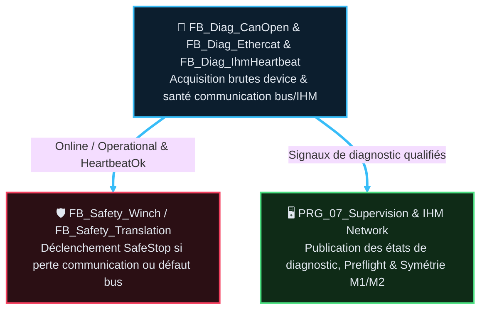

# AF Partie 12 — Diagnostic & Supervision Bus (v1.4)

> La tracabilite des versions programme/document est portee par `DOC/VERSION_HISTORY.md`.
> Source code : `CODE/C_DIAG_RESEAUX/*.st` (corrigé 2026-08-26 — l'ancien `CODE/DIAG/*.st` n'a
> jamais existé) · instances dans `PRG_01_Diagnostics` et `PRG_TROUBLESHOOTING_CFC` (ST actuels).
> Cible : les diagnostics devices/bus rejoignent `PRG_02_Acquisition`, les observateurs passifs
> rejoignent `PRG_07_Supervision` — voir §6.
> 🗺️ Architecture cible faisant foi : `DOC/AF/AF_Partie-02_Architecture_Programme_v3.2.md` §3 et §5.

## 🎯 Rôle et périmètre

- **Rôle** : diagnostics de communication bus/devices et surveillance opérateur.
- **Périmètre** : les FB diag publient des faits (`Online`, `Operational`, `State`, `ErrorId`) ;
  les FB Safety aval **décident** d'agir (SafeStop) — aucun FB diag ne coupe directement.
- **Type de composant** : `FB_Diag_CanOpen`, `FB_Diag_Ethercat`, `FB_Diag_IhmHeartbeat` — Fonction
  métier (observation pure, aucun mouvement).

### 🎯 Table des fonctions

> **État** — `V` validé, implémentation non vérifiée · `V-I` validé et implémenté · `NV` non validé,
> non implémenté · `NV-I` code présent mais non validé · `R` refusé · `NA` non applicable.

<table style="width: 100%; table-layout: fixed; border-collapse: collapse; font-size: 14px;">
  <colgroup>
    <col style="width: 40px;">
    <col style="width: 140px;">
    <col style="width: calc(100% - 520px);">
    <col style="width: 110px;">
    <col style="width: 50px;">
    <col style="width: 90px;">
    <col style="width: 50px;">
    <col style="width: 40px;">
  </colgroup>
  <thead>
    <tr style="border-bottom: 2px solid #475569; text-align: left;">
      <th style="padding: 4px 1px; text-align: center;"><small><b>ID</b></small></th>
      <th style="padding: 4px 1px; text-align: center;"><small>Fonction</small></th>
      <th style="padding: 4px 8px;">Description</th>
      <th style="padding: 4px 1px; text-align: center;"><small>Réalisée par</small></th>
      <th style="padding: 4px 1px; text-align: center;"><small>Criticité</small></th>
      <th style="padding: 4px 1px; text-align: center;"><small>TC couvrants</small></th>
      <th style="padding: 4px 1px; text-align: center;"><small>Statut</small></th>
      <th style="padding: 4px 1px; text-align: center;"><small>État</small></th>
    </tr>
  </thead>
  <tbody>
    <tr style="border-bottom: 1px solid rgba(255,255,255,0.08);">
      <td style="padding: 4px 1px; text-align: center; vertical-align: middle;">F12.01</td>
      <td style="padding: 4px 1px; text-align: center; vertical-align: middle;"><small><b>Diagnostiquer le bus CANopen (joystick)</b></small></td>
      <td style="padding: 6px 8px; line-height: 1.55;">Perte liaison / non-opérationnel → <code>ErrorId</code> bit0/1</td>
      <td style="padding: 4px 1px; text-align: center; vertical-align: middle;"><small><code>FB_Diag_CanOpen</code></small></td>
      <td style="padding: 4px 1px; text-align: center; vertical-align: middle;"><small>🟠 C3</small></td>
      <td style="padding: 4px 1px; text-align: center; vertical-align: middle;">TC-P12-010, 020, 040</td>
      <td style="padding: 4px 1px; text-align: center; vertical-align: middle;"><small>⚠️ conçu, non implémenté</small></td>
      <td style="padding: 4px 1px; text-align: center; vertical-align: middle;"><small><code>NV</code></small></td>
    </tr>
    <tr style="border-bottom: 1px solid rgba(255,255,255,0.08);">
      <td style="padding: 4px 1px; text-align: center; vertical-align: middle;">F12.02</td>
      <td style="padding: 4px 1px; text-align: center; vertical-align: middle;"><small><b>Diagnostiquer le bus EtherCAT (variateur M3, codeurs M1/M2)</b></small></td>
      <td style="padding: 6px 8px; line-height: 1.55;">Perte liaison par device → <code>ErrorId</code> bit4/5/6 (nibbles)</td>
      <td style="padding: 4px 1px; text-align: center; vertical-align: middle;"><small><code>FB_Diag_Ethercat</code></small></td>
      <td style="padding: 4px 1px; text-align: center; vertical-align: middle;"><small>🟠 C3</small></td>
      <td style="padding: 4px 1px; text-align: center; vertical-align: middle;">TC-P12-010, 020, 030, 040</td>
      <td style="padding: 4px 1px; text-align: center; vertical-align: middle;"><small>⚠️ conçu, non implémenté</small></td>
      <td style="padding: 4px 1px; text-align: center; vertical-align: middle;"><small><code>NV</code></small></td>
    </tr>
    <tr style="border-bottom: 1px solid rgba(255,255,255,0.08);">
      <td style="padding: 4px 1px; text-align: center; vertical-align: middle;">F12.03</td>
      <td style="padding: 4px 1px; text-align: center; vertical-align: middle;"><small><b>Surveiller le heartbeat IHM↔PLC</b></small></td>
      <td style="padding: 6px 8px; line-height: 1.55;">Toggle bidirectionnel, détecte timeout communication</td>
      <td style="padding: 4px 1px; text-align: center; vertical-align: middle;"><small><code>FB_Diag_IhmHeartbeat</code></small></td>
      <td style="padding: 4px 1px; text-align: center; vertical-align: middle;"><small>🟠 C3</small></td>
      <td style="padding: 4px 1px; text-align: center; vertical-align: middle;">TC-P12-050</td>
      <td style="padding: 4px 1px; text-align: center; vertical-align: middle;"><small>⚠️ conçu, non implémenté</small></td>
      <td style="padding: 4px 1px; text-align: center; vertical-align: middle;"><small><code>NV</code></small></td>
    </tr>
  </tbody>
</table>

## 📑 Sommaire

1. [🧱 Composition — fiches FB dédiées](#1-composition-fiches-fb-dédiées)
2. [🧪 Table des points de validation](#2-table-des-points-de-validation)
3. [🎭 Rôles et familles](#3-rôles-et-familles)
4. [🚌 DUT et bus](#4-dut-et-bus)
5. [🔄 Flux et consommateurs](#5-flux-et-consommateurs)
6. [🔗 Intégration programme](#6-intégration-programme)
7. [📊 ErrorId](#7-errorid)
8. [📜 Suivi historique](#8-suivi-historique)
9. [❓ TBD](#9-tbd)
10. [📚 Documents liés](#10-documents-liés)

---

## 🧱 1 · Composition — fiches FB dédiées

| Fiche | FB | Contenu |
|---|---|---|
| [`FB_Diag_CanOpen`](AF_Partie-12_Fonction_Diagnostic/FB_Diag_CanOpen_v1.0.md) | `FB_Diag_CanOpen` | Diagnostic bus CANopen + esclave Joystick |
| [`FB_Diag_Ethercat`](AF_Partie-12_Fonction_Diagnostic/FB_Diag_Ethercat_v1.0.md) | `FB_Diag_Ethercat` | Diagnostic bus EtherCAT (variateur M3 + codeurs M1/M2) |
| [`FB_Diag_IhmHeartbeat`](AF_Partie-12_Fonction_Diagnostic/FB_Diag_IhmHeartbeat_v1.0.md) | `FB_Diag_IhmHeartbeat` | Surveillance bidirectionnelle IHM↔PLC |

> 📌 `FB_Acquisition_Preflight` (qualification E/S machine arrêtée) est documenté dans
> [`AF_Partie-06`](AF_Partie-06_Fonction_Acquisition_Qualification_IO/FB_Acquisition_Preflight_v1.3.md).
> `FB_Winch_Symmetry` (mesure M1/M2) est documenté dans
> [`AF_Partie-10`](AF_Partie-10_Fonction_Winch/FB_Winch_Symmetry_v1.1.md).

---

## 🧪 2 · Table des points de validation

> Catalogue conçu (revue expert automatisme/IHM/sécurité, 2026-08-26) — **pas encore implémenté**
> (`⬜ GAP`, voir TBD §9). Aucun test épisodique/anti-bug isolé : chaque TC décrit un comportement
> **stable et général**, applicable à tout device/axe présent et futur — un bug précis trouvé sur un
> device donné (ex. M2, voir §7) est une **tâche corrective** (`TASKS.yaml`), pas un TC dédié ; sa
> preuve/garde-fou est le cas correspondant dans le TC générique qui aurait dû le couvrir.
>
> `TC-P12-010`/`020`/`040` sont **partagés** entre `FB_Diag_CanOpen` et `FB_Diag_Ethercat` — ils
> restent ici (pas de propriétaire unique). `TC-P12-030` (`FB_Diag_Ethercat` seul) et `TC-P12-050`
> (`FB_Diag_IhmHeartbeat` seul) sont détaillés dans leur fiche dédiée (propriétaire unique, pas
> dupliqué ici — `GUIDE_EDITION_AF_v1.0.md` §4).

> **État** — `V` validé, implémentation non vérifiée · `V-I` validé et implémenté · `NV` non validé,
> non implémenté · `NV-I` code présent mais non validé · `R` refusé · `NA` non applicable.

<table style="width: 100%; table-layout: fixed; border-collapse: collapse; font-size: 14px;">
  <colgroup>
    <col style="width: 28px;">
    <col style="width: 50px;">
    <col style="width: calc(100% - 165px);">
    <col style="width: 45px;">
    <col style="width: 26px;">
    <col style="width: 36px;">
  </colgroup>
  <thead>
    <tr style="border-bottom: 2px solid #475569; text-align: left;">
      <th style="padding: 4px 1px; text-align: center;"><small><b>ID</b></small></th>
      <th style="padding: 4px 1px; text-align: center;"><small>Intention</small></th>
      <th style="padding: 4px 8px;">Séquence & Déroulé des étapes (Comportement attendu)</th>
      <th style="padding: 4px 1px; text-align: center;"><small>Type</small></th>
      <th style="padding: 4px 1px; text-align: center;"><small>Réf</small></th>
      <th style="padding: 4px 1px; text-align: center;"><small>État</small></th>
    </tr>
  </thead>
  <tbody>
    <tr style="border-bottom: 1px solid rgba(255,255,255,0.08);">
      <td style="padding: 4px 1px; text-align: center; vertical-align: middle;">TC-P12-010</td>
      <td style="padding: 4px 1px; text-align: center; vertical-align: middle;"><small><b>Perte liaison</b> par device</small></td>
      <td style="padding: 6px 8px; line-height: 1.55;">
        💤 <b>Étape 0</b> : Tous devices opérationnels (<code>StateRaw=RUNNING</code>) 
        🚀 <b>Étape 1</b> : Un device perd son état (<code>StateRaw≠RUNNING/ACTIVE</code>) 
        ⚡ <b>Étape 2</b> : <code>Online=FALSE</code>, <code>Operational=FALSE</code>, <code>State=INIT</code> pour ce device 
        ✅ <b>Étape 3</b> : Aucun effet sur les autres devices — indépendance inter-devices
      </td>
      <td style="padding: 4px 1px; text-align: center;"><small><code>💻 AUTO</code></small></td>
      <td style="padding: 4px 1px; text-align: center;"><small><code>FB_Diag_CanOpen</code> <code>FB_Diag_Ethercat</code></small></td>
      <td style="padding: 4px 1px; text-align: center;"><small><code>NV-I</code></small></td>
    </tr>
    <tr style="border-bottom: 1px solid rgba(255,255,255,0.08);">
      <td style="padding: 4px 1px; text-align: center; vertical-align: middle;">TC-P12-020</td>
      <td style="padding: 4px 1px; text-align: center; vertical-align: middle;"><small><b>ErrorId</b> bit-level</small></td>
      <td style="padding: 6px 8px; line-height: 1.55;">
        💤 <b>Étape 0</b> : Tous devices OK, <code>ErrorId=0</code> pour chaque device 
        🚀 <b>Étape 1</b> : Défaut isolé sur un seul device (ex. Joystick, Variateur, M1, M2) 
        ⚡ <b>Étape 2</b> : <code>ErrorId</code> de ce device porte exactement son bit attendu 
        ✅ <b>Étape 3</b> : Aucun bit croisé sur un autre device — ⚠️ M2 porte <code>16#0030</code> (bug T159, pas <code>16#0040</code>)
      </td>
      <td style="padding: 4px 1px; text-align: center;"><small><code>💻 AUTO</code></small></td>
      <td style="padding: 4px 1px; text-align: center;"><small><code>FB_Diag_CanOpen</code> <code>FB_Diag_Ethercat</code></small></td>
      <td style="padding: 4px 1px; text-align: center;"><small><code>NV-I</code></small></td>
    </tr>
    <tr style="border-bottom: 1px solid rgba(255,255,255,0.08);">
      <td style="padding: 4px 1px; text-align: center; vertical-align: middle;">TC-P12-030</td>
      <td style="padding: 4px 1px; text-align: center; vertical-align: middle;"><small><b>Synthèse</b> ErrorId globale</small></td>
      <td style="padding: 6px 8px; line-height: 1.55;">
        💤 <b>Étape 0</b> : État diag nominal 
        🚀 <b>Étape 1</b> : Consultation du catalogue détaillé dans la fiche dédiée 
        ⚡ <b>Étape 2</b> : Vérification de la synthèse globale ErrorId 
        ✅ <b>Étape 3</b> : Détail dans <a href="AF_Partie-12_Fonction_Diagnostic/FB_Diag_Ethercat_v1.1.md"><code>FB_Diag_Ethercat_v1.1.md</code> §Points de validation</a>
      </td>
      <td style="padding: 4px 1px; text-align: center;"><small><code>💻 AUTO</code></small></td>
      <td style="padding: 4px 1px; text-align: center;"><small><code>FB_Diag_Ethercat</code></small></td>
      <td style="padding: 4px 1px; text-align: center;"><small><code>NV</code></small></td>
    </tr>
    <tr style="border-bottom: 1px solid rgba(255,255,255,0.08);">
      <td style="padding: 4px 1px; text-align: center; vertical-align: middle;">TC-P12-040</td>
      <td style="padding: 4px 1px; text-align: center; vertical-align: middle;"><small><b>Bypass</b> sim/réseau</small></td>
      <td style="padding: 6px 8px; line-height: 1.55;">
        💤 <b>Étape 0</b> : <code>Enable=TRUE</code>, device réel <code>RUNNING</code>, pas de bypass 
        🚀 <b>Étape 1</b> : Activation <code>SimBypass</code>/<code>NetworkBypassActive</code> sans device réel <code>RUNNING</code> 
        ⚡ <b>Étape 2</b> : États <code>SIMULATED</code> (bypass), <code>READY</code> (réel seul), <code>INIT</code> (ni l'un ni l'autre), <code>DISABLED</code> (<code>Enable=FALSE</code> prioritaire) 
        ✅ <b>Étape 3</b> : Table de vérité bypass vs état réel validée
      </td>
      <td style="padding: 4px 1px; text-align: center;"><small><code>💻 AUTO</code></small></td>
      <td style="padding: 4px 1px; text-align: center;"><small><code>FB_Diag_CanOpen</code> <code>FB_Diag_Ethercat</code></small></td>
      <td style="padding: 4px 1px; text-align: center;"><small><code>NV</code></small></td>
    </tr>
    <tr style="border-bottom: 1px solid rgba(255,255,255,0.08);">
      <td style="padding: 4px 1px; text-align: center; vertical-align: middle;">TC-P12-050</td>
      <td style="padding: 4px 1px; text-align: center; vertical-align: middle;"><small><b>Heartbeat</b> IHM</small></td>
      <td style="padding: 6px 8px; line-height: 1.55;">
        💤 <b>Étape 0</b> : Communication IHM↔PLC active, toggle bidirectionnel 
        🚀 <b>Étape 1</b> : Timeout communication (pas de front IHM dans le délai) 
        ⚡ <b>Étape 2</b> : Détection timeout par surveillance toggle 
        ✅ <b>Étape 3</b> : Détail dans <a href="AF_Partie-12_Fonction_Diagnostic/FB_Diag_IhmHeartbeat_v1.1.md"><code>FB_Diag_IhmHeartbeat_v1.1.md</code> §Points de validation</a>
      </td>
      <td style="padding: 4px 1px; text-align: center;"><small><code>💻 AUTO</code></small></td>
      <td style="padding: 4px 1px; text-align: center;"><small><code>FB_Diag_IhmHeartbeat</code></small></td>
      <td style="padding: 4px 1px; text-align: center;"><small><code>NV</code></small></td>
    </tr>
  </tbody>
</table>

Couverture CI **existante mais superficielle** (pas un substitut au catalogue ci-dessus) :
`TOOLS/TEST_AUTO_CI/RESULTS/C_DIAG_RESEAUX/tests/test_fb_diag_ethercat.st` — 2 cas seulement
(`Enable=FALSE`, tout-OK), aucune injection de défaut par device, aucune assertion sur les bits
`ErrorId` (registre global des tests : `TOOLS/TEST_AUTO_CI/registry.yaml`, à la racine de
`TEST_AUTO_CI/`, pas dans un sous-dossier par domaine).

---

## 🎭 3 · Rôles et familles

| Famille | Rôle | Coupe ? | Consommateurs |
|---|---|---|---|
| **Bus/Device** | Publie Online/Operational/State/ErrorId par device | Non (directement) | FB_Safety_Winch, FB_Safety_Translation, FB_Modes, IHM |
| **Comm opérateur** | Surveille toggle IHM, génère toggle PLC, détecte timeout | Non (directement) | FB_Safety_Winch, FB_Safety_Translation, Troubleshooting |
| **Observateur** | Verdict passif ou mesure sans rétroaction machine | Non | IHM uniquement |

> 📌 **Principe** : un FB diag ne pilote jamais SafeStop/PowerCutOff. Il publie des faits.
> Les `FB_Safety_<Domaine>` consomment ces faits et décident seuls de l'action.

---

## 🚌 4 · DUT et bus

| DUT | Champs clés | Producteur | Consommateur |
|---|---|---|---|
| `ST_Diag_Device` | `Online`, `Operational`, `Error`, `ErrorId`, `State` (E_Diag_State), `StateAtError` | `FB_Diag_CanOpen`, `FB_Diag_Ethercat` | Safety, Modes, IHM, Troubleshooting |
| `ST_BypassNetwork` | Bypasses granulaires (`Global`, `BusCanOpen`, `BusEthercat`, `InputModules`, `Joystick`, `EncoderM1/M2`, `VariateurM3`, `IhmHeartbeat`) | IHM / Banc | `PRG_02_Acquisition`, `instDiagCanOpen`, `instDiagEthercat` |
| `ST_NetworkDiagHMI` | `BusCanOpen`, `Joystick`, `CanError`, `CanErrorId`, `BusEthercat`, `EncoderM1/M2`, `VariateurM3`, `EcatError`, `EcatErrorId`, `InputModules`, `Bypass` | `PRG_07_Supervision` | IHM (Visu, Bandeau, Diagnostics) |
| `ST_InputModuleDiagHMI` | `LocalDigitalIoOk`, `Vh0800EndOk`, `Vh0808EtpOk`, `Vh0008ErOk`, `Vh0008Er1Ok`, `Fault` | `PRG_02` / `PRG_07` | `FB_Hmi_BannerFormatter`, IHM |
| `E_Diag_State` | `DISABLED`, `READY`, `INIT`, `MONITORING`, `ERROR`, `SIMULATED` | FB diag | IHM, Modes |
| `ST_fbWinch_Symmetry_Cfg` | Seuils (`DeltaStartDelay_Ms`, etc.) | GVL_PERSISTENT | `FB_Winch_Symmetry` |
| `ST_fbWinch_Symmetry_Data` | Mesures (`DeltaStartDelay_Ms`, `MaxSyncDeviation_M`, etc.) | `FB_Winch_Symmetry` | IHM, GVL_PERSISTENT |

---

## 🔄 5 · Flux et consommateurs

### 5.1 État actuel du code (ST, avant migration)

Trait plein épais = flux de données (faits qualifiés). Couleur = domaine (cyan acquisition, rouge
sécurité, vert sortie/observation), même dictionnaire que `GUIDE_EDITION_AF_v1.0.md §3quater`.

---

## 🔗 6 · Intégration programme

### 6.1 État actuel du code (ST legacy, avant migration)

| Programme | Instances | Rôle |
|---|---|---|
| `PRG_01_Diagnostics` | `instDiagCanOpen`, `instDiagEthercat`, `instIhmHeartbeat` | Acquisition brutes + appel FB diag bus/comm |
| `PRG_TROUBLESHOOTING_CFC` | `instPreflight`, `instWinchSymmetry` | Observateurs passifs (doc : AF06 Preflight, AF10 Symmetry) |
| `PRG_SAFETY_CFC` | (consommateur) | Relaye `JoystickOnline/Operational`, `HeartbeatIhmOk`, `DriveOnline/Operational` vers `FB_Safety_Winch/Translation` |
| `PRG_SUPERVISION_CFC` | (consommateur) | Publie diagnostics vers IHM (Network, Preflight, Symmetry) |

### 6.2 Cible — architecture 7 POU

Il n'existe **plus de POU de diagnostic autonome** ni de POU safety global dans la cible : un
diagnostic device est un **fait d'entree qualifie**, donc il appartient a l'acquisition ; un
observateur passif est de l'observation, donc il appartient a la supervision.

| POU cible | Instances | Rôle |
|---|---|---|
| `PRG_02_Acquisition` | `instDiagCanOpen`, `instDiagEthercat`, `instIhmHeartbeat` | Acquisition brutes + appel FB diag bus/comm, **au meme endroit que le joystick et les codeurs qu'ils surveillent** |
| `PRG_04_Treuils_Benne` | (consommateur) | `FB_Safety_Winch` M1/M2 y est instancie : il consomme directement `JoystickOnline/Operational` et `HeartbeatIhmOk` |
| `PRG_05_Translation` | (consommateur) | `FB_Safety_Translation` y est instancie : il consomme `DriveOnline/Operational` et `HeartbeatIhmOk` |
| `PRG_07_Supervision` | `instPreflight`, `instWinchSymmetry` + (consommateur) | Observateurs passifs et publication IHM. Lecture seule stricte : n'ecrit ni commande, ni configuration, ni interlock |

⚠️ **Aucune semantique diagnostic ne change** : les bits `ErrorId` du §7, les etats `E_Diag_State`,
les seuils et les consommateurs restent identiques. Seule **l'affectation POU** change.

✅ Effet attendu : la duplication de `instJoystick` et le cycle prouve `Acquisition ↔ Diagnostics`
disparaissent (lot M1) ; le relais par un POU safety intermediaire disparait (lots M3/M4), chaque
`FB_Safety_*` lisant le fait diagnostic directement depuis l'acquisition.

📌 Lots de migration : **M1** (diagnostics dans l'acquisition) et **M6** (observateurs dans la
supervision) — migration 7 POU soldée, historique archivé (`ARCHIVES/Doc/AUDITS/Architecture_Migration7POU/`).

---

## 📊 7 · ErrorId

### FB_Diag_CanOpen (DeviceJoystick.ErrorId)

| Bit | Cause |
|---|---|
| 0 | Perte liaison CAN joystick |
| 1 | Joystick non opérationnel (pas RUNNING) |

### FB_Diag_Ethercat

⛔ **Bug de code connu** (`TASKS.yaml` T159) : `DeviceEncoderM2.ErrorId` mal positionné — détail
bit-level complet, synthèse par nibble et impact déplacés dans
[`FB_Diag_Ethercat_v1.1.md` §ErrorId](AF_Partie-12_Fonction_Diagnostic/FB_Diag_Ethercat_v1.1.md)
(anti-duplication, `GUIDE_EDITION_AF_v1.0.md` §4). Résumé : n'affecte pas les décisions safety
(`Error`/`Online`/`Operational`), seulement la lecture directe IHM/troubleshooting — voir TBD §9.

### FB_Acquisition_Preflight (PreflightErrorId)

> Documenté dans [`AF_Partie-06`](AF_Partie-06_Fonction_Acquisition_Qualification_IO/FB_Acquisition_Preflight_v1.3.md) — 16 bits de qualification E/S machine arrêtée.

### FB_Winch_Symmetry

> Documenté dans [`AF_Partie-10`](AF_Partie-10_Fonction_Winch/FB_Winch_Symmetry_v1.1.md) — mesures M1/M2 (MES-008).

---

## 📜 8 · Suivi historique

| Version | Date | Changement |
|---|---|---|
| v1.4 | 2026-08-26 | Décongestion chapô/sous-fiches (challengé par l'humain) : <nobr><code>TC-P12-030</code></nobr> (propriétaire unique `FB_Diag_Ethercat`) et `TC-P12-050` (propriétaire unique `FB_Diag_IhmHeartbeat`) déplacés en détail dans leurs fiches dédiées (`FB_Diag_Ethercat_v1.1.md`, `FB_Diag_IhmHeartbeat_v1.1.md`), le chapô ne garde qu'un pointeur — seuls `TC-P12-010`/`020`/`040` (partagés entre 2 FB) restent ici. Le tableau `ErrorId` détaillé de `FB_Diag_Ethercat` (§7) est déplacé dans sa fiche pour la même raison. Les 2 fiches modifiées gagnent au passage un lien retour vers ce chapô (absent avant) et une correction de leur propre table `ErrorId` (elle affichait le bit **intentionné**, pas le bug réel). |
| v1.3 | 2026-08-26 | Catalogue <nobr><code>TC-P12-010</code></nobr> à `050` conçu (revue sous-agent expert automatisme/IHM/sécurité) et inséré en §2 — 5 TC macro stables/généraux (perte liaison, bit-level, synthèse, bypass, heartbeat), remplace le placeholder vide de v1.2. **Correction humaine appliquée** : un 6e TC (`TC-P12-060`, "anti-régression bug M2") initialement proposé a été **retiré** — challengé et refusé : un TC doit décrire un comportement stable et général, pas un test calé sur un bug précis d'un seul device ; le cas M2 est un cas normal de `TC-P12-020` (déjà générique par device), pas un TC distinct. Le bug M2 reste une tâche corrective (`TASKS.yaml` T159, mis à jour pour référencer `TC-P12-020` comme garde-fou). Table des fonctions F12.01-03 mise à jour (colonne TC couvrants + statut "conçu, non implémenté"). 2 écarts supplémentaires trouvés en marge (non traités) : `E_Diag_State.MONITORING` jamais assigné, `Reset` de `FB_Diag_Ethercat` jamais exploité — ajoutés en TBD §9. |
| v1.2 | 2026-08-26 | Corrections issues d'une revue expert automatisme/standards : (1) chemin de la couverture CI informelle corrigé — le test réel est `TOOLS/TEST_AUTO_CI/RESULTS/C_DIAG_RESEAUX/tests/test_fb_diag_ethercat.st` (pas `TEST_AUTO_CI_UNITARY/C_DIAG_RESEAUX/`) et `registry.yaml` vit à la racine de `TEST_AUTO_CI/`, pas dans un sous-dossier par domaine ; (2) ajout d'une section `🧪 Points de validation` dédiée et numérotée (§2, avant absente structurellement — l'alerte `TC-P12` vide était repliée dans la Table des fonctions) conformément à `GUIDE_EDITION_AF_v1.0.md` §4 (section obligatoire même vide) ; renumérotation cascadée §3-§10. |
| v1.1 | 2026-08-26 | Mise en conformite `GUIDE_EDITION_AF_v1.0` : Sommaire lié, section `🎯 Rôle et périmètre` explicite, Table des fonctions `F12.01`-`F12.03` ajoutée (obligatoire, famille Fonctions métier, absente jusqu'ici), diagramme HTML/SVG → Mermaid `flowchart TD` stylisé, Suivi historique + TBD ajoutés, renumérotation complète. **Correctifs de fond** : chemin source `CODE/DIAG/*.st` (inexistant) corrigé en `CODE/C_DIAG_RESEAUX/*.st` (réel) ; liens vers `FB_Acquisition_Preflight_v1.0.md`/`FB_Winch_Symmetry_v1.0.md` (versions périmées, déjà bumpées v1.2/v1.1 dans leurs AF respectifs cette session) corrigés ; **aucun `TC-P12-*` n'existe** dans ce chapô ni les 3 fiches FB — signalé explicitement plutôt que silencieusement absent (TBD §8, nuancé par la review : tests CI informels existants mais superficiels). **Bug de code trouvé** (non corrigé, hors périmètre documentaire) : `DeviceEncoderM2.ErrorId` sur `16#0030` au lieu de `16#0040` dans `FB_Diag_Ethercat.st` (§6, TBD §8) |
| v1.0 | — | Version precedente (voir `ARCHIVES/Doc/`) |

## ❓ 9 · TBD

- ⬜ **`TC-P12-*` conçu mais non implémenté** — catalogue 5 TC (§2) prêt, squelettes `.st` rédigés
  (revue expert automatisme/IHM/sécurité, 2026-08-26), rien encore écrit dans
  `TOOLS/TEST_AUTO_CI/RESULTS/C_DIAG_RESEAUX/tests/`. Fonctions C3 (perte de communication bus/IHM),
  consommées par des FB safety C4 en aval. **Décision requise** : autoriser l'implémentation des 5
  TC (essentiellement `TC-P12-010`/`020` en priorité 1, cf. `TASKS.yaml` T159).
- ⛔ **Bug de code** : `DeviceEncoderM2.ErrorId` positionné sur `16#0030` au lieu de `16#0040`
  (§7) — sans impact sur les décisions safety, mais trompeur en lecture directe IHM/troubleshooting.
  Tâche `T159` créée (`TASKS.yaml`) : écrire d'abord le cas M2 de `TC-P12-020` (doit être rouge),
  corriger le code dans un commit séparé, `TC-P12-020` doit repasser vert.
- 🆕 **Écarts trouvés en marge de la revue tests (2026-08-26, non traités ici)** :
  - `E_Diag_State.MONITORING` déclaré dans le DUT et cité §4, mais **jamais assigné** dans les 3
    `.st` — enum mort ou fonctionnalité jamais implémentée, à clarifier avant d'écrire un TC dessus.
  - `FB_Diag_Ethercat.st` calcule un front `Reset` (`ResetEdge`) dont le `.Q` n'est **jamais lu** —
    contrairement à `FB_Diag_CanOpen` qui conditionne l'effacement d'`ErrorId` sur son `Reset`.
    Incohérence entre les deux FB frères, potentiel second bug — non qualifié, pas de tâche créée.

## 📚 10 · Documents liés

| Doc | Lien |
|---|---|
| AF02 | Architecture programme — frontières et flux |
| AF03 | Contrats composants — profil non-mouvement |
| AF06 | Acquisition qualifiée — diagnostics bus §4 |
| AF07 | Interface IHM — heartbeat, affichage diag |
| AF10/AF11 | FB_Safety_Winch / FB_Safety_Translation (consommateurs) |
| Code | `CODE/C_DIAG_RESEAUX/*.st` |
