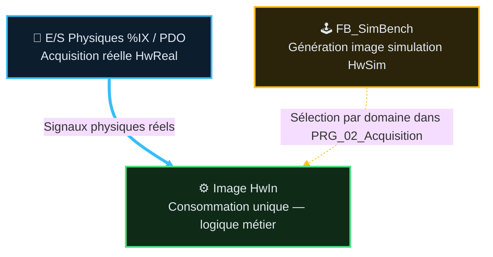

# 🧪 Analyse Fonctionnelle — Partie 13 : Simulation (v2.4)

> **Projet** : Excavatrice de dragage — CODESYS 3.5
> **Statut** : référence active · décision documentaire préalable au retrait de `PRG_01/FB_Input`
> **Sources** : `CODE/L_SIMULATION/*.st`, `CODE/M_MAIN/PRG_02_Acquisition.st` (ST propriétaire),
> `AUDITS/PreLivraison/PLAN_Rationalisation_Simulation_v1.0.md`,
> `CHECKLISTS/CHECKLIST_MiseEnRoute_Simulation_v1.0.md`.
> 🆕 v2.4 (2026-08-26) : mise en conformité `GUIDE_EDITION_AF_v1.0` — Sommaire lié, Table des
> fonctions (F13.01-05), macro-table Points de validation (catalogue TC-P13-* réel, non dupliqué),
> §3 Frontière unique converti en Mermaid, correction chemin source (`CODE/L_SIMULATION`, pas
> `CODE/SIMULATION`), Suivi historique + TBD + Documents liés.
> v2.3 (2026-08-14) : composition éclatée en fiches par FB dédiées (§3, pattern Partie 11/01) —
> chaque FB de simulation a désormais son propre document, avec son piège opérateur documenté.
> Déclenché par un REX de plusieurs heures de diagnostic (§8).

---

## 🧭 Sommaire

1. [🎯 Rôle et périmètre](#1--rôle-et-périmètre)
2. [🧪 Points de validation](#2--points-de-validation-tc-p13---propriétaire-fiches-fb)
3. [🧱 Composition — fiches FB dédiées](#3--composition--fiches-fb-dédiées)
4. [🏗️ Frontière unique](#4-️-frontière-unique)
5. [🎛️ Commande de simulation](#5-️-commande-de-simulation)
6. [🔍 Observation et diagnostic](#6--observation-et-diagnostic)
7. [🧹 Historique et garde-fous](#7--historique-et-garde-fous)
8. [📥 Application CODESYS 3.5](#8--application-codesys-35)
9. [📜 Suivi historique](#9--suivi-historique)
10. [❓ TBD](#10--tbd)
11. [📚 Documents liés](#11--documents-liés)

---

## 1. 🎯 Rôle et périmètre

La simulation fournit au programme une image d'entrée plausible lorsque le matériel est absent.
Elle n'est ni un bypass, ni un forçage d'état sain, ni une autorisation de sécurité.

| Besoin | Outil | Règle |
|---|---|---|
| Ignorer un défaut sur matériel présent | 🔒 Bypass IHM | MAINT_N2, tracé et maintenu explicitement |
| Fabriquer une valeur pour matériel absent | 🧪 Simulation | Banc PLC confiné derrière la frontière d'entrée |
| Injecter une panne ponctuelle | 🖐️ Force natif CODESYS | Vue instance, temporaire, jamais dans la logique |

🚫 La simulation ne complète jamais une entrée réelle par `OR`. Un domaine est réel **ou** simulé.

### 🎯 Table des fonctions

| F-code | Fonction | FB propriétaire | Fiche | TC associés |
|---|---|---|---|---|
| F13.01 | Enveloppe unique de simulation — composition des 4 sous-modèles, décalage 1 scan | `FB_SimBench` | [FB_SimBench_v1.0.md](AF_Partie-13_Fonction_Simulation/FB_SimBench_v1.0.md) | <nobr><code>TC-P13-010..013</code></nobr> |
| F13.02 | Chaîne AU/contacteur simulée | `FB_Sim_Safety` | [FB_Sim_Safety_v1.0.md](AF_Partie-13_Fonction_Simulation/FB_Sim_Safety_v1.0.md) | <nobr><code>TC-P13-020..023</code></nobr> |
| F13.03 | Position codeurs M1/M2 simulée, persistance reset froid | `FB_Sim_Encoder` | [FB_Sim_Encoder_v1.0.md](AF_Partie-13_Fonction_Simulation/FB_Sim_Encoder_v1.0.md) | <nobr><code>TC-P13-030..033</code></nobr> |
| F13.04 | 5 capteurs M3 simulés par progression continue | `FB_Sim_Translation` | [FB_Sim_Translation_v1.0.md](AF_Partie-13_Fonction_Simulation/FB_Sim_Translation_v1.0.md) | <nobr><code>TC-P13-040..043</code></nobr> |
| F13.05 | Entrées joystick brutes, homme-mort jamais contourné | `FB_Sim_Joystick` | [FB_Sim_Joystick_v1.0.md](AF_Partie-13_Fonction_Simulation/FB_Sim_Joystick_v1.0.md) | <nobr><code>TC-P13-050..052</code></nobr> |

---

## 2. 🧪 Points de validation (`TC-P13-*` — propriétaire fiches FB)

> Catalogue détaillé et propriété unique dans chaque fiche FB (§3). Cette macro-table condense
> les points clés — **ne pas dupliquer les libellés exacts** ici, se référer à la fiche pour le TC complet.

| Bloc | Plage TC | Points clés |
|---|---|---|
| `FB_SimBench` | <nobr><code>TC-P13-010..013</code></nobr> | Enveloppe unique, décalage 1 scan, REX StatusWord AC600 corrigé |
| `FB_Sim_Safety` | <nobr><code>TC-P13-020..023</code></nobr> | Chaîne AU simulée, latch contacteur, 🆕 <nobr><code>TC-P13-023</code></nobr> : défaut réel latché **survit** au cycle Reset du modèle simulé (§4) |
| `FB_Sim_Encoder` | <nobr><code>TC-P13-030..033</code></nobr> | Position codeur simulée, persistance reset froid |
| `FB_Sim_Translation` | <nobr><code>TC-P13-040..043</code></nobr> | 6 mots thermomètre valides, bornage position, reset Trémie sur `Enable=FALSE` |
| `FB_Sim_Joystick` | <nobr><code>TC-P13-050..052</code></nobr> | Entrées brutes joystick, homme-mort jamais contourné |

---

## 3. 🧱 Composition — fiches FB dédiées

Chaque bloc du banc de simulation a sa propre fiche : contrat d'interface, modèle physique simulé
et, quand pertinent, les pièges opérateur observés en exploitation. **Lecture obligatoire de la
fiche `FB_Sim_Safety` avant tout diagnostic de blocage AU en simulation** (§4 de cette fiche).

| Fiche | FB | Contenu |
|---|---|---|
| [`FB_SimBench_v1.0.md`](AF_Partie-13_Fonction_Simulation/FB_SimBench_v1.0.md) | `FB_SimBench` | Enveloppe unique, composition des 4 sous-modèles, décalages 1 scan, REX StatusWord AC600 |
| [`FB_Sim_Safety_v1.0.md`](AF_Partie-13_Fonction_Simulation/FB_Sim_Safety_v1.0.md) | `FB_Sim_Safety` | Chaîne AU/contacteur simulée — ⚠️ piège latches AU non liés à la simulation |
| [`FB_Sim_Encoder_v1.0.md`](AF_Partie-13_Fonction_Simulation/FB_Sim_Encoder_v1.0.md) | `FB_Sim_Encoder` | Position codeur COD1/COD2, persistance reset froid |
| [`FB_Sim_Translation_v1.0.md`](AF_Partie-13_Fonction_Simulation/FB_Sim_Translation_v1.0.md) | `FB_Sim_Translation` | 5 capteurs M3 par progression continue |
| [`FB_Sim_Joystick_v1.0.md`](AF_Partie-13_Fonction_Simulation/FB_Sim_Joystick_v1.0.md) | `FB_Sim_Joystick` | Entrées brutes joystick, homme-mort jamais contourné |

---

## 4. 🏗️ Frontière unique

`PRG_02_Acquisition` est la frontière unique réelle/simulée. Il acquiert aussi les codeurs,
les diagnostics devices/bus et les retours auxiliaires :

1. il acquiert chaque E/S brute dans `HwReal : ST_HardwareImage` ;
2. il évalue `GetDeviceState()` et publie `InputModuleFault` ;
3. `instSimBench` construit les sous-images simulées ;
4. `HwSim : ST_HardwareImage` les expose pour observation ;
5. les sélecteurs par domaine choisissent `HwReal` ou `HwSim` dans `HwIn` ;
6. `HwIn` alimente la logique métier.

`PRG_01_Inputs_LD`, `FB_Input` et `ST_InputsQualified` sont en retrait documentaire et ne doivent
plus recevoir de nouveau consommateur. Leur suppression effective intervient après le remappage
et la preuve du filtrage matériel ou logiciel.

`HwIn` est la seule image consommée par le programme métier. Aucun FB métier ne lit
`GVL_Simulation` ni `HwSim`.

## 5. 🎛️ Commande de simulation

`GVL_Simulation` est lu uniquement par l'acquisition ST actuelle, le banc et les publications/diagnostics
autorisés. Polarité positive : `TRUE = simulation/stimulus actif`; tous les flags sont `FALSE` au démarrage.

| Signal | Domaine ou rôle |
|---|---|
| `SimulationModeActive` | 🔑 bit maître : front montant active les 4 domaines ; front descendant les désactive et remet les stimuli au nominal |
| `SimWinchActive` | M1/M2 : codeurs, contacteurs, freins, thermiques, haut, câble |
| `SimTranslationActive` | AC600 M3, fréquence, cinq capteurs et frein |
| `SimOperatorActive` | joystick CANopen, axes bruts et homme-mort |
| `SimSafetyActive` | chaîne AU, contacteur, réarmement, phases, thermiques, Kobold et auxiliaires communs |

⚠️ **Le front descendant du bit maître remet à nominal les *stimuli* de ce tableau — pas l'état
interne des FB safety réels** (`FB_Safety_EmergencyManagementLogic`, `FB_Safety_Translation`...).
Un latch de défaut réel (`RedundancyTestFailedCause`, etc.) survit à un cycle simulation
ON→OFF→ON. Détail et piège complet : `FB_Sim_Safety_v1.0.md §4`.

Le sélecteur est atomique par domaine : `HwIn.<Domaine> := HwSim.<Domaine>` ou
`HwReal.<Domaine>`. Il interdit tout mélange réel/simulé dans un même domaine.

### Stimuli de banc

| Famille | Champs | Sémantique |
|---|---|---|
| ↔️ M3 | `SimM3SensorsWordOverrideActive`, `SimM3SensorsWord` | Override manuel uniquement ; bit4=Trémie, bit3=PV, bit2=PVP2, bit1=P1, bit0=Maintenance. Le modèle dynamique reste la source nominale. |
| 🕹️ Joystick | `SimJoystickLeft_Rev_TREMIE_Active`, `SimJoystickRight_Fwd_MAINT_Active`, `SimJoystickFwd_Up_Close_Active`, `SimJoystickRev_Down_Open_Active` | Un seul bouton impose `0`/`5000`/`10000` (plusieurs ⇒ neutre). L'activation d'un bouton directionnel simule l'appui homme-mort `JoyBtnRaw` (aucun auto-arm permanent) : le homme-mort `FB_Joystick` est testé fidèlement — armement au commandement, grâce 3 s, retombée au neutre. |
| 🕹️ Homme-mort | `SimJoystickRawButton` | TRUE simule le bouton brut indépendant (pour essais spécifiques neutre/homme-mort) ; le contrôle homme-mort de `FB_Joystick` reste actif. |
| 🪝 Synchronisation | `SimSyncDeviationInjectM1/M2`, `SimSyncDeviationOffset_M` | Front montant : saut persistant de position simulée afin de tester l'écart M1/M2. |

Au front descendant du bit maître, tous les flags de domaine et stimuli ci-dessus reprennent leurs
valeurs nominales. Les positions codeurs persistantes ne sont pas des stimuli et ne sont pas effacées.

## 6. 🔍 Observation et diagnostic

En vue instance de `PRG_02_Acquisition`, lire côte à côte les trois `ST_HardwareImage` homologues :

| Image | Signification |
|---|---|
| `HwReal` | valeur brute reçue du matériel/PDO |
| `HwSim` | valeur calculée par le banc |
| `HwIn` | valeur réellement utilisée par le programme |

Cette lecture est un diagnostic humain : elle ne produit aucun verdict automatique, défaut,
compteur ni action.

🆕 **Pour un blocage AU (armement qui ne progresse plus)**, cette comparaison `HwReal/HwSim/HwIn`
ne suffit pas : vérifier **aussi** `GVL_Troubleshooting.Safety.RedundancyTestFailed` et
`.ArmingFailed` avant de conclure à un bug de simulation — un latch réel non acquitté produit
exactement le même symptôme visible (`Step3_EmergencyChainClosed` bloqué FALSE) qu'un vrai bug de
modèle. Voir `FB_Sim_Safety_v1.0.md §4` pour le mécanisme complet et la règle opérateur.

Pour les autres blocages fonctionnels, consulter `Troubleshooting` (lecture seule).

## 7. 🧹 Historique et garde-fous

Ont été retirés : `GVL_PLC_Tests`, `FB_Sim_DigitalMirror`, les 25 flags `*IsReal` et les
injections dispersées. Motif : des expressions du type `DI OR (Simulation ... AND ...)` pouvaient
forcer un capteur sain et masquer une polarité erronée (REX C1).

🆕 **REX 2026-08-14 (plusieurs heures de diagnostic)** : un bug de modèle (`FB_SimBench`, StatusWord
AC600 — détail `FB_SimBench_v1.0.md §4`) provoquait un faux `PowerCutOff` répété côté M3, qui a
fini par faire échouer un test de redondance AU et **latcher** un défaut réel dans
`FB_Safety_EmergencyManagementLogic` (Partie 01). Une fois le bug de modèle corrigé, le symptôme a
persisté — pas parce que le fix était faux, mais parce que le latch réel, une fois posé, ne
s'efface que sur `Reset` explicite, jamais par la simulation. Deux leçons retenues et actées dans
ce lot : (1) toute fiche FB de simulation qui pilote une entrée d'un FB safety réel documente
désormais explicitement ce risque de latch (§3, colonne « Contenu ») ; (2) le §6 ci-dessus intègre
maintenant le réflexe `RedundancyTestFailed`/`ArmingFailed` avant toute conclusion « bug de
simulation ». Écart sémantique potentiellement plus large (le variateur réel a-t-il la même
faille dormante côté Méca B ?) : suivi séparé, `PLAN_TASK.md T110`.

Les gates Python interdisent désormais :

- toute dépendance exécutable à `GVL_Simulation` hors `SIMULATION`, acquisition ST actuelle,
  `Supervision` et `Troubleshooting` ;
- toute forme `OR (GVL_Simulation.<flag> AND ...)`, sans exception.

## 8. 📥 Application CODESYS 3.5

1. Importer le bundle unique `CODE_XML/CODE_Bundle.xml` dans `Application` via
   **Project → Import PLCopenXML**.
2. En vue instance, ouvrir `PRG_02_Acquisition` et comparer `HwReal`, `HwSim`, `HwIn`.
3. Machine arrêtée : activer le bit maître ; les quatre domaines sont activés automatiquement.
   Contrôler que chaque `HwIn.<Domaine>` bascule entièrement sur son image simulée.
4. Pour tester un domaine réel, désactiver explicitement son flag pendant la session.
5. Avant retour réel : désactiver `SimulationModeActive`; le front descendant remet tous les
   flags et stimuli au nominal. Vérifier les bypass RETAIN et l'absence de défaut actif.
6. 🆕 Devant un blocage d'armement AU en simulation qui persiste après correction d'un bug de
   modèle suspecté : presser **Reset** (`BtnFaultReset`) avant de rejouer l'essai (§6, §7).

## 9. 📜 Suivi historique

| Version | Date | Contenu |
|---|---|---|
| v2.4 | 2026-08-26 | Mise en conformité `GUIDE_EDITION_AF_v1.0` : Sommaire lié, Table des fonctions F13.01-05, macro-table Points de validation, Mermaid §4, correction chemin source `CODE/L_SIMULATION`, Suivi historique/TBD/Documents liés |
| v2.3 | 2026-08-14 | Composition éclatée en fiches FB dédiées (pattern Partie 11/01), REX StatusWord AC600 |
| v2.2 et antérieures | — | Voir `ARCHIVES/Doc/` |

## 10. ❓ TBD

- Écart sémantique variateur réel M3 vs modèle simulé (Méca B, faille dormante StatusWord) —
  suivi séparé `PLAN_TASK.md T110` (voir §7).
- Retrait effectif de `PRG_01_Inputs_LD`/`FB_Input`/`ST_InputsQualified` conditionné à la preuve
  du filtrage matériel ou logiciel côté remplacement (§4) — non planifié dans `TASKS.yaml` à ce jour.

## 11. 📚 Documents liés

- [AF_Partie-01](AF_Partie-01_Analyse_Fonctionnelle_v2.1.md) — chaîne AU réelle, `FB_Safety_EmergencyManagementLogic`
- [AF_Partie-02](AF_Partie-02_Architecture_Programme_v3.2.md) — architecture CFC, `PRG_02_Acquisition`
- [AF_Partie-03](AF_Partie-03_Contrats_Composants_v2.2.md) — contrats FB/DUT
- [AF_Partie-11](AF_Partie-11_Fonction_Translation_v2.3.md) — `FB_Sim_Translation` miroir M3
- [AF_Partie-14](AF_Partie-14_Fonction_Troubleshooting_v1.2.md) — réflexe `RedundancyTestFailed`/`ArmingFailed`
- Fiches FB dédiées : voir §3
- `DOC/WFLOW/TASKS.yaml` — suivi organisationnel (T110)
