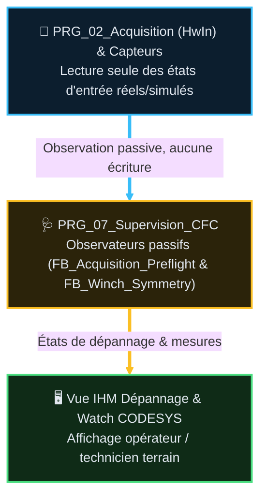

# 🧪 Analyse Fonctionnelle — Partie 14 : Troubleshooting (v1.3)

> **Projet** : Excavatrice de dragage — CODESYS 3.5
> **Statut** : référence active — orientée Fonctions Machine / Utilisation Opérateur.
> **Source** : `CODE/J_SUPERVISION/FB_TroubleshootingView.st`, `CODE/J_SUPERVISION/GVL_Troubleshooting.st`,
> `CODE/M_MAIN/PRG_07_Supervision.st`.
> 🆕 v1.3 (2026-08-26) : mise en conformité `GUIDE_EDITION_AF_v1.0` — Sommaire lié, Table des
> fonctions (F14.01), macro-table Points de validation (catalogue `TC-P14-TSV-*` réel), §1bis
> converti HTML/SVG → Mermaid, Suivi historique + TBD + Documents liés. Correction de 2 références
> périmées trouvées dans la fiche FB associée (§11).

---

## 🧭 Sommaire

1. [🎯 Rôle et périmètre](#1--rôle-et-périmètre)
2. [🧪 Points de validation](#2--points-de-validation-tc-p14---propriétaire-fiche-fb)
3. [🧱 Composition](#3--composition)
4. [🔄 Flux d'observation & Supervision](#4--flux-dobservation--supervision)
5. [🛡️ Invariant opposable](#5-️-invariant-opposable)
6. [🩺 Table de visu — dépannage de l'acquisition DI](#6--table-de-visu--dépannage-de-lacquisition-di)
7. [🔒 Diagnostic réarmement AU — checklist chronologique](#7--diagnostic-réarmement-au--checklist-chronologique)
8. [📜 Suivi historique](#8--suivi-historique)
9. [❓ TBD](#9--tbd)
10. [📚 Documents liés](#10--documents-liés)

---

## 1. 🎯 Rôle et périmètre

Le troubleshooting **observe** le fonctionnement réel de la machine et le publie pour diagnostic
opérateur/automaticien — il ne décide, ne calcule et ne commande jamais. Il couvre 5 fonctions
machine, organisées par ordre de lecture haut→bas dans `GVL_Troubleshooting` :

1. LevageSynchroniseM1M2
2. LevageUnitaireM1
3. LevageUnitaireM2
4. BenneOuvertureFermeture
5. TranslationPontM3

### 🎯 Table des fonctions

> **Etat** ? `V` valid?, impl?mentation non v?rifi?e ? `V-I` valid? et impl?ment? ? `NV` non valid?, non impl?ment? ? `NV-I` code pr?sent mais non valid? ? `R` refus? ? `NA` non applicable.

| F-code | Fonction | FB propriétaire | Fiche | TC associés | Etat |
|---|---|---|---|---|---|
| F14.01 | Recopie passive de l'état machine (5 fonctions ci-dessus) vers `GVL_Troubleshooting`, aucun calcul ni décision | `FB_TroubleshootingView` | [FB_TroubleshootingView_v1.2.md](AF_Partie-14_Fonction_Troubleshooting/FB_TroubleshootingView_v1.2.md) | <nobr><code>TC-P14-TSV-01..05</code></nobr> | `NV` |

---

## 2. 🧪 Points de validation (`TC-P14-*` — propriétaire fiche FB)

> Catalogue détaillé et propriété unique dans `FB_TroubleshootingView_v1.2.md §8`. Macro-table :

> **Etat** ? `V` valid?, impl?mentation non v?rifi?e ? `V-I` valid? et impl?ment? ? `NV` non valid?, non impl?ment? ? `NV-I` code pr?sent mais non valid? ? `R` refus? ? `NA` non applicable.

| Bloc | Plage TC | Points clés | Etat |
|---|---|---|---|
| `FB_TroubleshootingView` | <nobr><code>TC-P14-TSV-01..05</code></nobr> | Zéro `VAR_OUTPUT` de commande, chaque champ a un producteur réel documenté, aucun TBD affiché comme mesure réelle, instance unique dans `PRG_07_Supervision`, zéro régression gates | `NV` |

---

## 3. 🧱 Composition

Il n'existe **pas** de POU `PRG_11_Troubleshooting` dans l'architecture : ce nom appartient au
découpage transverse abandonné. Observer un fonctionnement et le publier à l'IHM est une seule
responsabilité, portée par un programme unique exécuté en dernier.

| | POU | Statut |
|---|---|---|
| POU actuel | `PRG_07_Supervision` (ST pur, rang 07) | **absorbe le troubleshooting** : observation et diagnostic au même endroit |

Le contenu fonctionnel des 5 fonctions machine (§1), ses seuils et ses observateurs
(`FB_Acquisition_Preflight`, `FB_Winch_Symmetry`) ne sont pas modifiés par le changement de POU.
Fiches : `AF_Partie-06` (Preflight) et `AF_Partie-10` (Symmetry).

📌 Lot de migration : **M6** (C2, patch) — migration 7 POU soldée, historique archivé
(`ARCHIVES/Doc/AUDITS/Architecture_Migration7POU/`).

---

## 4. 🔄 Flux d'observation & Supervision

## 5. 🛡️ Invariant opposable

Le troubleshooting **n'écrit jamais** une commande, une configuration ou un interlock.
⚠️ **Portée exacte** : cet invariant s'applique à l'**instance `FB_TroubleshootingView`**
elle-même (§8 `Structure de GVL_Troubleshooting` et §3 Interface — appel en lecture seule
stricte des entrées de tous les domaines). Il ne s'applique **pas** à l'intégralité du POU
`PRG_07_Supervision`, qui porte par ailleurs d'autres sections écrivant légitimement des
`Cmd`/`Cfg`/`Bypass` (projections IHM, bypass sécurité par domaine — hors périmètre de ce
FB). Trouvé en revue 2026-08-26 : la formulation précédente généralisait à tort au POU entier
une propriété qui n'appartient qu'au sous-composant observateur.

## 6. 🩺 Table de visu — dépannage de l'acquisition DI

> La source d'observation cible est `PRG_02_Acquisition`. Les références historiques à
> `PRG_01_Inputs_LD` et `FB_Input` ne doivent plus être ajoutées ; elles sont conservées
> uniquement dans les audits de migration jusqu'à la suppression effective du code.
>
> **Proposition de support IHM / Watch CODESYS.** Cette table est en lecture seule : elle observe
> l'acquisition et ses conséquences, mais n'écrit ni commande, ni Reset, ni bypass.
> Les valeurs doivent être comparées dans l'ordre **module → agrégat → procédé → entrée**.

### 6.1 Ordre de diagnostic

1. Vérifier l'état des trois modules (`GetDeviceState()` traduit en `*Ok`).
2. Vérifier l'agrégat `InputModuleFault` / `Network.InputModules.Fault`.
3. Identifier les `SafeStop` actifs sur M1, M2 et M3.
4. Contrôler ensuite les valeurs `HwIn` des entrées concernées et leur polarité.
5. Corriger la cause matérielle ou de simulation, puis acquitter par un appui conscient.
6. Vérifier qu'aucun mouvement ne redémarre automatiquement.

### 6.2 Table opérateur/automaticien

| Observable à afficher | Valeur nominale | Si défaut | Cause probable | Action sûre | Interdit |
|---|---|---|---|---|---|
| `PRG_02_Acquisition.LocalDigitalIoOk` | `TRUE` | `FALSE` | `Local_Digital_IO` absent, non opérationnel ou non présent sur le banc | Vérifier alimentation, bus et présence du module | Forcer à `TRUE` |
| `PRG_02_Acquisition.Vh0800EndOk` | `TRUE` | `FALSE` | `VH_0800END` absent ou non opérationnel | Vérifier module, bus et configuration CODESYS | Forcer à `TRUE` |
| `PRG_02_Acquisition.Vh0808EtpOk` | `TRUE` | `FALSE` | `VH_0808ETP` absent ou non opérationnel | Vérifier module, bus et configuration CODESYS | Forcer à `TRUE` |
| `PRG_02_Acquisition.InputModuleFault` | `FALSE` | `TRUE` | Au moins une carte DI en défaut ; défaut global actuel | Relever les trois états individuels, corriger la cause, Reset conscient | Forcer à `FALSE` |
| `GVL_IHM.Network.InputModules.Fault` | `FALSE` | `TRUE` | Recopie IHM de l'agrégat acquisition | Comparer à `InputModuleFault` | Utiliser l'IHM comme preuve unique |
| `PRG_04_Treuils_Benne.SafeStopM1_Raw` | `FALSE` au repos sain | `TRUE` | Défaut module, synchro ou glissement selon code actuel | Identifier la cause avant Reset | Forcer à `FALSE` |
| `PRG_04_Treuils_Benne.SafeStopM2_Raw` | `FALSE` au repos sain | `TRUE` | Défaut module ou synchro selon code actuel | Identifier la cause avant Reset | Forcer à `FALSE` |
| `PRG_05_Translation.M3_SafeStop_Active` | `FALSE` au repos sain | `TRUE` | `InputModuleFault` selon implémentation actuelle | Vérifier les cartes DI et la rampe SafeStop | Forcer à `FALSE` |
| `PRG_02_Acquisition.HwIn.Winch.M1_BrakeIsOpen_DI` | Selon position réelle/simulée | Valeur incohérente | Capteur, polarité ou modèle de simulation | Comparer `HwReal` / `HwSim` / `HwIn` | Conclure à la santé de la carte |
| `PRG_02_Acquisition.HwIn.Winch.M2_BrakeIsOpen_DI` | Selon position réelle/simulée | Valeur incohérente | Capteur, polarité ou modèle de simulation | Comparer `HwReal` / `HwSim` / `HwIn` | Conclure à la santé de la carte |
| `PRG_04_Treuils_Benne.AscentPermitM1_Raw` | Selon limite haute validée | `FALSE` si limite atteinte | Liaison limite haute à vérifier | Bloquer l'essai de montée limite tant que non validé | Déclarer le test conforme sans preuve |
| `PRG_04_Treuils_Benne.AscentPermitM2_Raw` | Selon limite haute validée | `FALSE` si limite atteinte | Liaison limite haute à vérifier | Bloquer l'essai de montée limite tant que non validé | Déclarer le test conforme sans preuve |
| `GVL_IHM.Modes.Cmd.BtnFaultReset` | Appui bref / front | Maintenu ou sans effet | Cause encore présente ou traitement Reset à vérifier | Relâcher, corriger la cause, générer un nouvel appui | Utiliser un niveau maintenu comme bypass |

### 6.3 Règle d'interprétation

Un bit TOR qui change prouve que le programme reçoit une valeur logique ; il ne prouve pas que
la carte est saine. La santé carte est donnée par `*Ok`. Inversement, un module `*Ok = TRUE` ne
prouve pas que chaque capteur est correctement câblé ou mécaniquement fonctionnel.

Sur un banc sans modules physiques, `GetDeviceState()` peut rester différent de `RUNNING` et
maintenir `InputModuleFault = TRUE`. Ce cas doit être affiché comme **indisponibilité matérielle
de la simulation**, pas comme panne d'un canal et pas comme défaut à contourner sans décision
safety formelle.

> ⚠️ Cette table ne valide pas les fonctions de limite haute, de frein, d'AU ou de SafeStop. Elle
> indique les observations à relever ; chaque fonction nécessite encore sa recette dédiée.

## 7. 🔒 Diagnostic réarmement AU — checklist chronologique

La checklist `GVL_Troubleshooting.Safety` suit l'ordre AF01 §5.3 : modules, demande AU, boucle
fermée, contacteur relâché, puis état armable. Pour éviter tout masquage ou ambiguïté en
diagnostic, la structure sépare explicitement :

1. **Les entrées directes `HwIn` (vérité terrain instantanée)** : `HwIn_EmergencyChainClosed_DI`,
   `HwIn_PowerContactorEngaged_DI`, `HwIn_EmergencyBtnCut_HMI`.
2. **Les étapes chronologiques de pré-conditions** : `Step1..5`. `Step3_EmergencyChainClosed` et
   `Step4_ContactorReleased` sont basés directement sur les entrées `HwIn` (non filtrées par
   l'automate de sécurité), tandis que `Step5_ArmingAllowed` reflète l'autorisation calculée du
   bloc AU.
3. **La séquence et les états internes du bloc AU** : `ArmingStep`, `ArmingBusy`, `LockoutActive`,
   `ArmingErrorId`, `PowerCutOffActive` et les maintiens A/B.

`AllConditionsMet` décrit uniquement l'état final chaîne fermée + contacteur engagé ; ce n'est pas
une précondition d'armement. Après acquittement éventuel, l'opérateur doit générer un **front
`BtnEmergencyArming`**. Aucun réarmement automatique n'est autorisé.

## 8. 📜 Suivi historique

| Version | Date | Contenu |
|---|---|---|
| v1.3 | 2026-08-26 | Mise en conformité `GUIDE_EDITION_AF_v1.0` : Sommaire lié, Table des fonctions F14.01, macro-table TC-P14-TSV, §4 Mermaid, Suivi historique/TBD/Documents liés. Review sous-agent : §5 invariant reformulé (portée restreinte à l'instance `FB_TroubleshootingView`, pas au POU entier — `PRG_07_Supervision` écrit bien des Cmd/Bypass ailleurs) ; coquille `HwIn_EmergencyBtnCut_IHM`→`_HMI` corrigée en §7 |
| v1.2 et antérieures | — | Contenu fonctionnel (table de visu §6, checklist AU §7) inchangé depuis, voir `ARCHIVES/Doc/` |

## 9. ❓ TBD

- `FB_TroubleshootingView_v1.2.md §6` liste 4 champs `ST_Chain*` sans producteur public actuel
  (`Idx103_JoystickCommOk`, `Idx402_CycleAutoBusy`, `Idx203_BypassSensorsGlobal`,
  `Idx101_EncoderRawPos`, `Idx208/209_Arbitrated*`) — non bloquant, publiés à valeur neutre avec
  commentaire explicite, pas de calcul inventé.
- Écart trouvé dans `FB_TroubleshootingView_v1.2.md` (à corriger dans une prochaine passe sur la
  fiche FB elle-même, hors périmètre chapô) : §1 mentionne un dossier `CODE/DEPANNAGE/` alors que
  le code réel vit dans `CODE/J_SUPERVISION/` (cohérent avec l'en-tête §📄 Source de la même
  fiche) — contradiction interne à corriger.

## 10. 📚 Documents liés

- [AF_Partie-02](AF_Partie-02_Architecture_Programme_v3.2.md) §2/§5 — décision architecture 7 POU, lecture seule
- [AF_Partie-03](AF_Partie-03_Contrats_Composants_v2.2.md) — profil FB observateur passif
- [AF_Partie-06](AF_Partie-06_Acquisition_Qualification_IO_v2.4.md) — `FB_Acquisition_Preflight`
- [AF_Partie-10](AF_Partie-10_Fonction_Winch_v2.1.md) — `FB_Winch_Symmetry`
- [AF_Partie-13](AF_Partie-13_Fonction_Simulation_v2.4.md) — réflexe `RedundancyTestFailed`/`ArmingFailed` en diagnostic simulation
- Fiche FB dédiée : [FB_TroubleshootingView_v1.2.md](AF_Partie-14_Fonction_Troubleshooting/FB_TroubleshootingView_v1.2.md)
- Fiche dépannage terrain : [TROUBLESHOOTING_Translation_M3_v1.0.md](AF_Partie-14_Fonction_Troubleshooting/TROUBLESHOOTING_Translation_M3_v1.0.md)
