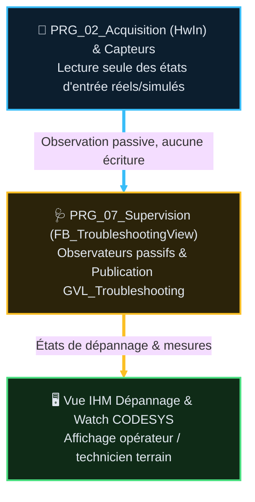

# 🧪 Analyse Fonctionnelle — Partie 14 : Troubleshooting (v1.4)

> **Projet** : Excavatrice de dragage — CODESYS 3.5
> **Statut** : référence active — orientée Fonctions Machine / Utilisation Opérateur.
> **Source** : `CODE/J_SUPERVISION/FB_TroubleshootingView.st`, `CODE/J_SUPERVISION/GVL_Troubleshooting.st`,
> `CODE/M_MAIN/PRG_07_Supervision.st`.
> 🆕 v1.4 (2026-08-28) : Intégration du diagnostic chronologique approfondi du cycle Semi-Automatique (`GVL_Troubleshooting.CycleSemiAuto` enrichi des champs `Idx209` à `Idx216` : attentes opérateur, attentes procédé, action ID, libellé explicite, organe/axe attendu, direction et état de pause).

---

## 🧭 Sommaire

1. [🎯 Rôle et périmètre](#1--rôle-et-périmètre)
2. [🧪 Table des points de validation (non détaillé)](#2--table-des-points-de-validation-non-détaillé)
3. [🧱 Composition](#3--composition)
4. [🔄 Flux d'observation & Supervision](#4--flux-dobservation--supervision)
5. [🛡️ Invariant opposable](#5-️-invariant-opposable)
6. [🩺 Table de visu — dépannage de l'acquisition DI](#6--table-de-visu--dépannage-de-lacquisition-di)
7. [🔒 Diagnostic réarmement AU — checklist chronologique](#7--diagnostic-réarmement-au--checklist-chronologique)
8. [🔄 Diagnostic Séquenceur Semi-Auto — arbre chronologique](#8--diagnostic-séquenceur-semi-auto--arbre-chronologique)
9. [📜 Suivi historique](#9--suivi-historique)
10. [❓ TBD](#10--tbd)
11. [📚 Documents liés](#11--documents-liés)

---

## 1. 🎯 Rôle et périmètre

Le troubleshooting **observe** le fonctionnement réel de la machine et le publie pour diagnostic
opérateur/automaticien — il ne décide, ne calcule et ne commande jamais. Il couvre 6 fonctions
machine, organisées dans `GVL_Troubleshooting` :

1. LevageSynchroniseM1M2
2. LevageUnitaireM1
3. LevageUnitaireM2
4. BenneOuvertureFermeture
5. TranslationPontM3
6. SéquenceurSemiAuto (`CycleSemiAuto`)

### 🎯 Table des fonctions

> **État** — `V` validé, implémentation non vérifiée · `V-I` validé et implémenté · `NV` non validé,
> non implémenté · `NV-I` code présent mais non validé · `R` refusé · `NA` non applicable.

<table style="width: 100%; table-layout: fixed; border-collapse: collapse; font-size: 14px;">
  <colgroup>
    <col style="width: 40px;">
    <col style="width: 140px;">
    <col style="width: 120px;">
    <col style="width: calc(100% - 430px);">
    <col style="width: 90px;">
    <col style="width: 40px;">
  </colgroup>
  <thead>
    <tr style="border-bottom: 2px solid #475569; text-align: left;">
      <th style="padding: 4px 1px; text-align: center;"><small><b>F-code</b></small></th>
      <th style="padding: 4px 1px; text-align: center;"><small>Fonction</small></th>
      <th style="padding: 4px 1px; text-align: center;"><small>FB propriétaire</small></th>
      <th style="padding: 4px 8px;">Fiche</th>
      <th style="padding: 4px 1px; text-align: center;"><small>TC associés</small></th>
      <th style="padding: 4px 1px; text-align: center;"><small>État</small></th>
    </tr>
  </thead>
  <tbody>
    <tr style="border-bottom: 1px solid rgba(255,255,255,0.08);">
      <td style="padding: 4px 1px; text-align: center; vertical-align: middle;"><span style="writing-mode: vertical-rl; transform: rotate(180deg); display: inline-block; font-family: monospace; font-size: 11.5px; font-weight: bold; letter-spacing: 0.5px;">F14.01</span></td>
      <td style="padding: 4px 1px; text-align: center; vertical-align: middle;"><small>Recopie passive de l'état machine vers <code>GVL_Troubleshooting</code>, aucun calcul ni décision</small></td>
      <td style="padding: 4px 1px; text-align: center; vertical-align: middle;"><small><code>FB_TroubleshootingView</code></small></td>
      <td style="padding: 6px 8px; line-height: 1.55;"><a href="AF_Partie-14_Fonction_Troubleshooting/FB_TroubleshootingView_v1.2.md"><code>FB_TroubleshootingView_v1.2.md</code></a></td>
      <td style="padding: 4px 1px; text-align: center; vertical-align: middle;"><span style="font-family: monospace; font-size: 11.5px; font-weight: bold; letter-spacing: 0.5px;">TC-P14-TSV-01..05</span></td>
      <td style="padding: 4px 1px; text-align: center; vertical-align: middle;"><small><code>V-I</code></small></td>
    </tr>
  </tbody>
</table>

---

## 2. 🧪 Table des points de validation (non détaillé)

> Catalogue détaillé et **propriété unique** dans la fiche
> [`FB_TroubleshootingView_v1.2.md`](AF_Partie-14_Fonction_Troubleshooting/FB_TroubleshootingView_v1.2.md) —
> ce chapô ne recopie que la synthèse.

> **État** — `V` validé, implémentation non vérifiée · `V-I` validé et implémenté · `NV` non validé,
> non implémenté · `NV-I` code présent mais non validé · `R` refusé · `NA` non applicable.

<table style="width: 100%; table-layout: fixed; border-collapse: collapse; font-size: 14px;">
  <colgroup>
    <col style="width: 130px;">
    <col style="width: 100px;">
    <col style="width: calc(100% - 280px);">
    <col style="width: 40px;">
  </colgroup>
  <thead>
    <tr style="border-bottom: 2px solid #475569; text-align: left;">
      <th style="padding: 4px 1px; text-align: center;"><small><b>Bloc</b></small></th>
      <th style="padding: 4px 1px; text-align: center;"><small>Plage TC</small></th>
      <th style="padding: 4px 8px;">Points clés</th>
      <th style="padding: 4px 1px; text-align: center;"><small>État</small></th>
    </tr>
  </thead>
  <tbody>
    <tr style="border-bottom: 1px solid rgba(255,255,255,0.08);">
      <td style="padding: 4px 1px; text-align: center; vertical-align: middle;"><small><code>FB_TroubleshootingView</code></small></td>
      <td style="padding: 4px 1px; text-align: center; vertical-align: middle;"><small><code>TC-P14-TSV-01..05</code></small></td>
      <td style="padding: 6px 8px; line-height: 1.55;">Zéro <code>VAR_OUTPUT</code> de commande, chaque champ a un producteur réel documenté, aucun TBD affiché comme mesure réelle, instance unique dans <code>PRG_07_Supervision</code>, zéro régression gates</td>
      <td style="padding: 4px 1px; text-align: center;"><small><code>V-I</code></small></td>
    </tr>
  </tbody>
</table>

---

## 3. 🧱 Composition

| | POU | Statut |
|---|---|---|
| POU actuel | `PRG_07_Supervision` (ST pur, rang 07) | **absorbe le troubleshooting** : observation et diagnostic au même endroit |

---

## 4. 🔄 Flux d'observation & Supervision



---

## 5. 🛡️ Invariant opposable

Le troubleshooting **n'écrit jamais** une commande, une configuration ou un interlock.
⚠️ **Portée exacte** : cet invariant s'applique à l'**instance `FB_TroubleshootingView`**
elle-même.

---

## 6. 🩺 Table de visu — dépannage de l'acquisition DI

| Observable à afficher | Valeur nominale | Si défaut | Cause probable | Action sûre | Interdit |
|---|---|---|---|---|---|
| `PRG_02_Acquisition.LocalDigitalIoOk` | `TRUE` | `FALSE` | `Local_Digital_IO` absent, non opérationnel | Vérifier alimentation, bus et présence du module | Forcer à `TRUE` |
| `PRG_02_Acquisition.Vh0800EndOk` | `TRUE` | `FALSE` | `VH_0800END` absent ou non opérationnel | Vérifier module, bus et configuration | Forcer à `TRUE` |
| `PRG_02_Acquisition.Vh0808EtpOk` | `TRUE` | `FALSE` | `VH_0808ETP` absent ou non opérationnel | Vérifier module, bus et configuration | Forcer à `TRUE` |
| `PRG_02_Acquisition.InputModuleFault` | `FALSE` | `TRUE` | Au moins une carte DI en défaut | Relever les trois états individuels, corriger la cause, Reset conscient | Forcer à `FALSE` |

---

## 7. 🔒 Diagnostic réarmement AU — checklist chronologique

La checklist `GVL_Troubleshooting.Safety` suit l'ordre [AF_Partie-01](AF_Partie-01_Securite_et_Arrets_v2.4.md) §5.3 : modules, demande AU, boucle
fermée, contacteur relâché, puis état armable.

---

## 8. 🔄 Diagnostic Séquenceur Semi-Auto — arbre chronologique

La structure `GVL_Troubleshooting.CycleSemiAuto` (`ST_ChainCycleSemiAuto`) permet à l'automaticien d'identifier instantanément toute cause de blocage d'étape :

```text
GVL_Troubleshooting.CycleSemiAuto
 ├─ Idx101..108 : Pré-requis (Mode, Sécurité, Heartbeat, Homme-mort, Manche, Homed, Start, Abort)
 ├─ Idx201..208 : État séquenceur (Ready, Busy, Done, Error, ErrorId, Step, StepStr, StepAtError)
 ├─ Idx209..216 : Arbre de déblocage opérateur :
 │   ├─ Idx209_WaitingForOperator : 1 si blocage en attente d'une action humaine
 │   ├─ Idx210_WaitingForProcess  : 1 si attente d'une condition physique/procédé
 │   ├─ Idx211_OperatorActionId   : Code numérique d'action
 │   ├─ Idx212_OperatorAction     : Consigne explicite en clair
 │   ├─ Idx213_ExpectedAxis       : Organe attendu (NONE, JOYSTICK_X, JOYSTICK_Y, BUTTON)
 │   ├─ Idx214_ExpectedDirection  : Sens attendu (-1 descente/gauche, +1 montée/droite)
 │   ├─ Idx215_WaitingResume      : 1 si le cycle a été suspendu par une bascule de mode
 │   └─ Idx216_PausedState        : Étape mémorisée pour reprise sécurisée
 └─ Idx301..306 : Consignes & feedbacks (Cible, Profondeur, Kobold, Écart vitesse, Limite légale, Synchro)
```

---

## 9. 📜 Suivi historique

| Version | Date | Contenu |
|---|---|---|
| v1.4 | 2026-08-28 | Intégration du diagnostic chronologique et arbre de déblocage séquenceur semi-automatique `ST_ChainCycleSemiAuto` (Idx209 à Idx216). |
| v1.3 | 2026-08-26 | Mise en conformité `GUIDE_EDITION_AF_v1.0` : Sommaire lié, Table des fonctions F14.01, macro-table TC-P14-TSV. |

---

## 10. ❓ TBD

- Fiche dépannage terrain pour le cycle semi-auto.

---

## 11. 📚 Documents liés

- [AF_Partie-02](AF_Partie-02_Architecture_Programme_v3.2.md) — Architecture 7 POU
- [AF_Partie-03](AF_Partie-03_Contrats_Composants_v2.3.md) — Profil FB observateur passif
- [AF_Partie-04](AF_Partie-04_Mode_SemiAuto_Sequenceur_v2.3.md) — Mode semi-automatique et séquenceur
- [AF_Partie-06](AF_Partie-06_Acquisition_Qualification_IO_v2.4.md) — Acquisition et qualification IO
- [AF_Partie-10](AF_Partie-10_Fonction_Winch_v2.1.md) — Fonction treuils
- [AF_Partie-13](AF_Partie-13_Fonction_Simulation_v2.4.md) — Simulation et diagnostic banc
