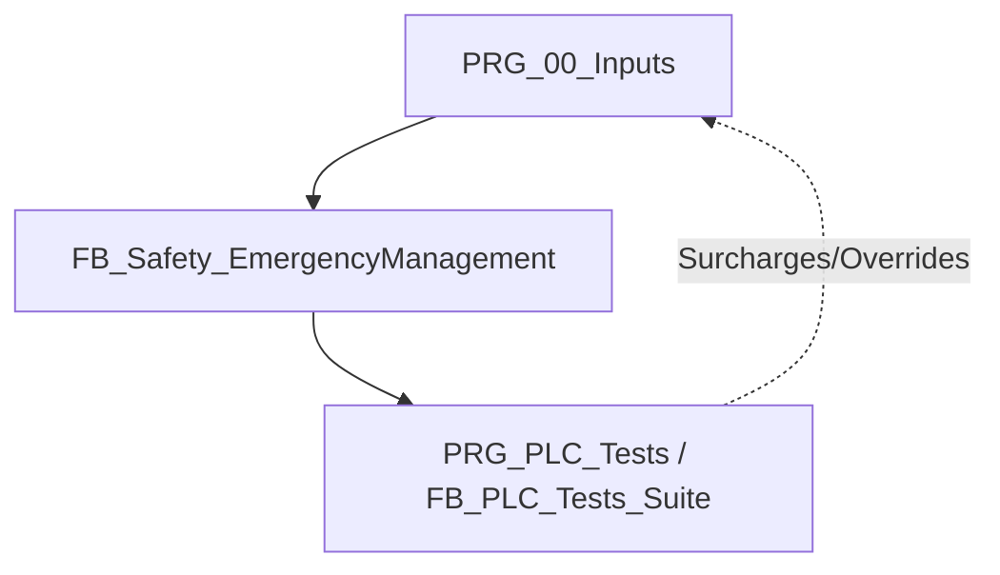

# 📋 Analyse Fonctionnelle — Partie 14 : Tests de Validation de la Sécurité (v1.0)

> **Projet** : Excavatrice de dragage — Automate CODESYS 3.5
> **Rôle** : Définition et architecture des tests de validation automatisés de la chaîne de sécurité (Arrêt d'Urgence et commande des contacteurs de puissance).
> **Version** : v1.0 (Initiale - 2026-07-16)
> 🔗 **Dépend de** : [P2 Architecture v2.11](AF_Partie-02_Architecture_Programme_v2.11.md), [P13 Simulation v1.2](AF_Partie-13_Fonction_Simulation_v1.2.md).

---

## 🎯 1. Cadre réglementaire et objectifs

La fonction d'arrêt d'urgence et la coupure de puissance associée sur l'excavatrice de dragage YGO sont conçues selon les normes et directives européennes et françaises :

* **Directive Machines 2006/42/CE (Annexe I, § 1.2.4.3)** : Priorité absolue de la fonction d'arrêt d'urgence sur tous les modes opérationnels.
* **EN ISO 13849-1 PL-d Catégorie 3** : 
  * *Tolérance aux pannes* : Un seul défaut dans l'une des parties liées à la sécurité ne doit pas conduire à la perte de la fonction de sécurité.
  * *Couverture Diagnostic (DC)* : Obligation d'effectuer un auto-test périodique (à chaque réarmement) afin de détecter les défauts accumulés avant qu'ils ne provoquent une situation dangereuse (ex. contacteur soudé/collé).
* **EN IEC 60204-1 (§ 9.2.2 & 9.2.5.4)** : Arrêt de catégorie 0 (coupure immédiate de l'alimentation). Le réarmement ne doit pas entraîner de redémarrage automatique ; il doit uniquement réautoriser l'activation des mouvements via un organe de commande distinct (réarmement manuel).
* **INRS ED 6112** : Principes généraux de conception de sécurité applicables aux équipements de travail.

---

## 🔁 2. Concept de Validation Continue (CI/CD) appliqué à l'Automatisme

### 💡 Qu'est-ce que le CI/CD en Automatisme ?
Le **CI/CD (Continuous Integration / Continuous Deployment)** désigne des pratiques de développement visant à automatiser l'intégration du code et sa validation :
* **Intégration Continue (CI) :** Chaque modification de code est automatiquement compilée, testée syntaxiquement et validée par une suite de tests unitaires (ici, via `pytest` exécuté dans VS Code et potentiellement dans un pipeline GitHub/GitLab).
* **Validation Continue (In-PLC Testing) :** Dans le cadre industriel, cela consiste à exécuter un programme de test unique (`PRG_PLC_Tests.st`) appelant une suite de blocs fonctionnels (`FB_PLC_Tests_Suite.st` et ses sous-blocs comme `FB_SafetyValidation.st`) directement au cœur du processeur de l'automate pour simuler des scénarios de pannes et certifier dynamiquement que les sécurités réagissent conformément aux normes.

### ⚙️ Comment lancer les tests de validation pendant qu'on code ?
Pendant le codage ou le refactoring de blocs de sécurité, le flux recommandé est le suivant :

1. **Validation syntaxique (Terminal VS Code) :**
   * Lance la commande suivante pour s'assurer que le générateur et le parser CODESYS acceptent le code ST :
     ```powershell
     python -m pytest
     ```
2. **Validation comportementale (CODESYS Simulator) :**
   * Connecte-toi à l'automate en mode Simulation.
   * Force `GVL_Simulation.SimulationModeActive := TRUE`.
   * Active la variable de commande globale `GVL_Simulation.CmdRunTests := TRUE`.
   * La suite de tests déroule tous les cas de tests en moins de 10 secondes et fournit la synthèse via `PRG_PLC_Tests.instTestsSuite.AllTestsPassed`.

---

## 🧩 3. Architecture du validateur automatique dans l'API

Afin de valider ces exigences sans matériel physique connecté, le système intègre une suite de tests par composition de blocs fonctionnels dans `CODE/SIMULATION/PLC_TESTS/` :
* **`PRG_00_Inputs.st` :** Programme d'acquisition des entrées qui héberge et appelle l'instance globale de tests.
* **`FB_PLC_Tests_Suite.st` :** Bloc fonctionnel parent qui orchestre toutes les instances de tests et écoute la GVL simulation.
* **`FB_SafetyValidation.st` :** Sous-bloc fonctionnel contenant la logique et le séquencement des tests d'arrêt d'urgence.

### ⚙️ Conditions de fonctionnement
Chaque bloc de test individuel vérifie que la simulation est active :
```pascal
IF NOT GVL_Simulation.SimulationModeActive THEN
    TestSeqStep := 0;
    TestInProgress := FALSE;
    RETURN;
END_IF;
```

### 🔀 Surcharges dynamiques (Overrides)
Comme le programme `PRG_PLC_Tests` s'exécute **après** `PRG_00_Inputs.st` dans la tâche automate, les sous-blocs de tests appliquent des surcharges (overrides) sur les variables de retour physique pour injecter des stimuli ou simuler des pannes :
* `OverrideChainTrue` : Force `PRG_00_Inputs.EmergencyChain` à `TRUE` (boucle saine).
* `OverrideChainFalse` : Force `PRG_00_Inputs.EmergencyChain` à `FALSE` (boucle ouverte).
* `OverrideContactorFalse` : Force `PRG_00_Inputs.EmergencyStopOk` à `FALSE` (défaut retour contacteur).



---

## 🧪 4. Fiches techniques des cas de tests (TC)

Le validateur automatique déroule séquentiellement les trois scénarios réglementaires décrits ci-dessous.

### 🧪 TC-01 : Séquence Nominale d'Arrêt d'Urgence et Auto-Maintien
* **Objectif** : Valider la coupure instantanée, le maintien en sécurité (latch) et la séquence de réarmement avec auto-test des canaux A et B.
* **Séquence d'exécution** :
  1. **Phase 1.1** : Initialisation saine (acquittement des défauts).
  2. **Phase 1.2 & 1.3** : Envoi de l'impulsion `ArmRequest` pour passer en étape d'auto-test `ArmingSeqStep = 1`.
  3. **Phase 1.4** : Attente de l'auto-test du canal A (coupure de `PowerCutOff_A_RQ`, détection de l'ouverture de la boucle en moins de 200 ms, puis rétablissement).
  4. **Phase 1.5** : Attente de l'auto-test du canal B (`PowerCutOff_B_RQ` coupe à son tour, détection de l'ouverture en moins de 200 ms, puis rétablissement).
  5. **Phase 1.6** : Passage à l'étape 5 (`ArmingSeqStep = 5`) : génération de l'impulsion physique de réarmement `EmergencyArming_RQ` pendant 1s.
  6. **Phase 1.7** : Confirmation du retour d'armement (`EmergencyStopOk := TRUE`). Le système passe à l'étape `0` (actif).
  7. **Trip & Latch** : Forçage de `EmergencyChain := FALSE` (coupure franche), vérification de la retombée immédiate (< 1 cycle) des relais de puissance. Relâchement du bouton d'urgence ; vérification que les relais restent coupés tant qu'un réarmement manuel n'a pas été initié.

### 🧪 TC-02 : Détection de Redondance (Contacteur soudé/collé)
* **Objectif** : Vérifier que si un canal ne s'ouvre pas lors de la phase d'auto-test, le système se verrouille en sécurité et lève un défaut.
* **Séquence d'exécution** :
  1. Déclenchement d'un réarmement (`ArmRequest := TRUE`).
  2. À l'étape `ArmingSeqStep = 1` (ordre de coupure du relais A), le validateur maintient artificiellement `EmergencyChain := TRUE` (simulant un contact soudé du relais A).
  3. Au bout de la temporisation de diagnostic de 200 ms (`TonTestA`), le FB doit détecter le défaut :
     * Blocage immédiat de la séquence et retour à l'étape `0`.
     * Levée du défaut de redondance : `RedundancyTestFailed := TRUE`.
     * Sorties de puissance maintenues à `FALSE`.

### 🧪 TC-03 : Verrouillage Temporel (Safety Lockout)
* **Objectif** : Empêcher les tentatives répétées et intempestives de réarmement thermique des contacteurs en cas d'échec ou de défaut cyclique.
* **Séquence d'exécution** :
  1. Lancer un armement mais simuler l'absence de retour du contacteur principal (`EmergencyStopOk` reste à `FALSE` à l'étape 6).
  2. Après 2s, le FB détecte l'échec de réarmement : `EmergencyArmingFailed := TRUE` et `EmergencyArmingLockoutActive := TRUE`.
  3. Pendant la durée stricte de 5 secondes du verrouillage temporel, toute impulsion `ArmRequest` doit être ignorée et la séquence doit rester bloquée à l'étape `0`.
  4. À l'expiration du verrouillage (5s), la variable `EmergencyArmingLockoutActive` repasse à `FALSE` et une nouvelle demande de réarmement redevient fonctionnelle.

---

## 📊 5. Variables de diagnostic et indicateurs IHM

Le bloc `FB_Safety_EmergencyManagement` expose les variables suivantes pour le diagnostic machine et l'affichage IHM :

| Variable API (dans `PRG_10_Outputs.instSafetyEmergencyManagement`) | Type | Rôle fonctionnel |
| :--- | :---: | :--- |
| `RedundancyTestFailed` | `BOOL` | Actif si un canal a échoué à l'auto-test de coupure périodique (contact collé). Bloquant. |
| `EmergencyArmingFailed` | `BOOL` | Actif si le contacteur principal n'a pas confirmé sa fermeture dans la fenêtre de 2s. |
| `EmergencyArmingLockoutActive` | `BOOL` | Actif pendant les 5s de verrouillage de sécurité suivant un échec de réarmement. |
| `ArmingSeqStep` | `INT` | Étape courante de la séquence (0: Idle, 1: Test A, 2: Restore A, 3: Test B, 4: Restore B, 5: Pulse, 6: Confirmation). |
| `Error` | `BOOL` | Signal de défaut général de la fonction de sécurité. |
| `ErrorId` | `WORD` | Code d'erreur structuré (ex: `16#0001` = Défaut de redondance). |

---

## 📈 6. Matrice des critères d'acceptation de sécurité

| ID du Test | Fonction de Sécurité Validée | Paramètre Critique | Critère d'Acceptation (Attendu) |
| :---: | :--- | :---: | :--- |
| **TC-01** | Coupure d'urgence instantanée | Temps de cycle API | Coupure immédiate des commandes `PowerCutOff_A/B_RQ` |
| **TC-01** | Mémorisation de l'arrêt (Latch) | Persistance d'état | Pas de réarmement automatique au rétablissement de la chaîne |
| **TC-02** | Auto-test Redondance Canal A | Filtrage = 200 ms | Détection d'un contact collé A, levée de `RedundancyTestFailed` |
| **TC-02** | Auto-test Redondance Canal B | Filtrage = 200 ms | Détection d'un contact collé B, levée de `RedundancyTestFailed` |
| **TC-03** | Temporisation de confirmation | Fenêtre = 2000 ms | Tolère l'inertie du contacteur principal dans la limite de 2s |
| **TC-03** | Verrouillage temporel (Lockout) | Durée = 5000 ms | Blocage strict de toute tentative d'armement pendant 5s |
| **TC-04** | Priorité absolue de sécurité | Mode Manuel actif | Coupure de sécurité prioritaire et non-outrepassable |

> [!IMPORTANT]
> Tout échec du validateur automatique (`TestFailed = TRUE`) sur le banc de simulation ou d'intégration bloque immédiatement le processus d'homologation et de mise en service de l'excavatrice de dragage YGO.
