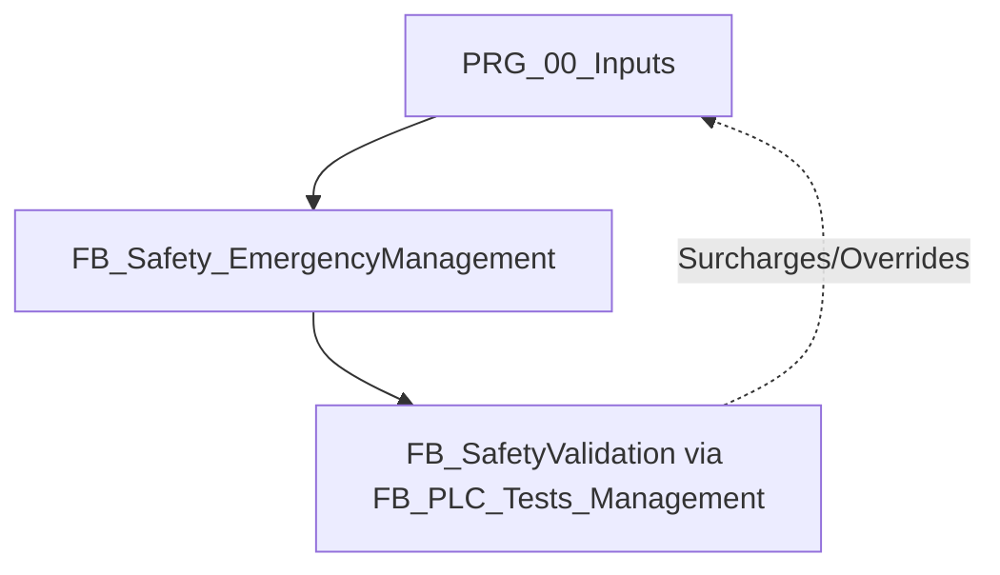
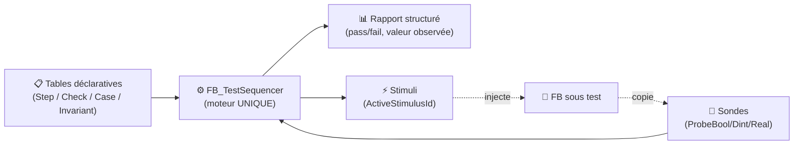
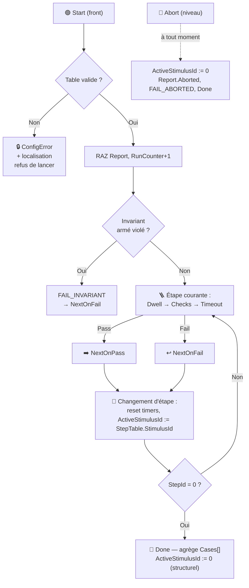
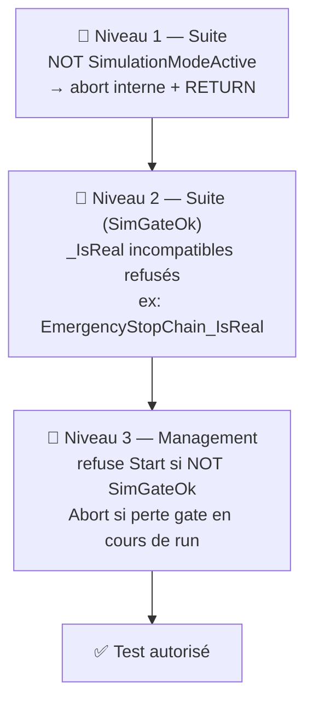
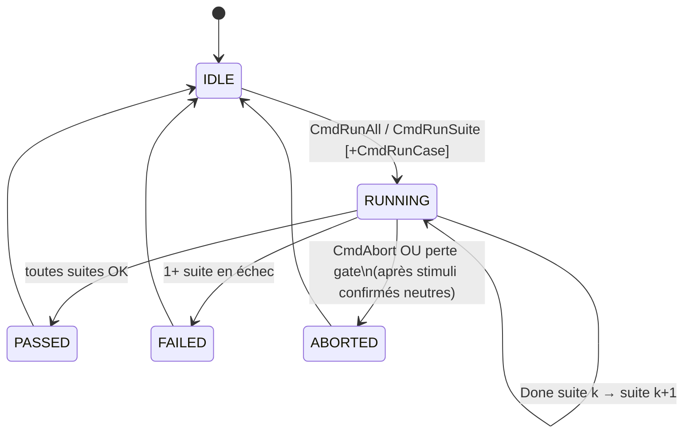

# 📋 Analyse Fonctionnelle — Partie 14 : Tests de Validation de la Sécurité (v1.2)

> **Projet** : Excavatrice de dragage — Automate CODESYS 3.5
> **Rôle** : Définition et architecture des tests de validation automatisés de la chaîne de sécurité (Arrêt d'Urgence et commande des contacteurs de puissance).
> **Version** : v1.2 (2026-07-16) — §7 **réécrit intégralement** : spécification finale du framework de test in-PLC (architecture de données, moteur d'exécution, catalogue de primitives, IHM de pilotage, preuve de couverture TC-01/02/03, plan de migration), issue d'une double revue croisée entre deux analyses expertes indépendantes (primitives de test ↔ architecture de données/IHM) + audit final. **Remplace entièrement** le cadrage v1.1 §7. Base §1-6 **inchangée**. ⚠️ **Aucune modification de `CODE/` n'accompagne cette version** — cadrage uniquement ; migration à dérouler séparément (§7.6).
> 🔗 **Dépend de** : [P2 Architecture v2.12](AF_Partie-02_Architecture_Programme_v2.12.md), [P13 Simulation v1.2](AF_Partie-13_Fonction_Simulation_v1.2.md), [P3 Template FB v1.3](AF_Partie-03_Template_FB_Commun_v1.3.md) (contrat FB, profils §1bis), [P7 Interface IHM v1.4](AF_Partie-07_Interface_IHM_v1.4.md) (pattern `ST_*HMI`), [NAMING_CONVENTION.md](NAMING_CONVENTION.md).

---

## 🎯 1. Cadre réglementaire et objectifs

La fonction d'arrêt d'urgence et la coupure de puissance associée sur l'excavatrice de dragage YGO sont conçues selon les normes et directives européennes et françaises :

* **Directive Machines 2006/42/CE (Annexe I, § 1.2.4.3)** : Priorité absolue de la fonction d'arrêt d'urgence sur tous les modes opérationnels.
* **EN ISO 13849-1 PL-d Catégorie 3** :
  * *Tolérance aux pannes* : Un seul défaut dans l'une des parties liées à la sécurité ne doit pas conduire à la perte de la fonction de sécurité.
  * *Couverture Diagnostic (DC)* : Obligation d'effectuer un auto-test périodique (à chaque réarmement) afin de détecter les défauts accumulés avant qu'ils ne provoquent une situation dangereuse (ex. contacteur soudé/collé).
* **EN IEC 60204-1 (§ 9.2.2 & 9.2.5.4)** : Arrêt de catégorie 0 (coupure immédiate de l'alimentation). Le réarmement ne doit pas entraîner de redémarrage automatique ; il doit uniquement réautoriser l'activation des mouvements via un organe de commande distinct (réarmement manuel).
* **INRS ED 6112** : Principes généraux de conception de sécurité applicables aux équipements de travail.

---

## 🔁 2. Concept de Validation Continue (CI/CD) appliqué à l'Automatisme

### 💡 Qu'est-ce que le CI/CD en Automatisme ?
Le **CI/CD (Continuous Integration / Continuous Deployment)** désigne des pratiques de développement visant à automatiser l'intégration du code et sa validation :
* **Intégration Continue (CI) :** Chaque modification de code est automatiquement compilée, testée syntaxiquement et validée par une suite de tests unitaires (ici, via `pytest` exécuté dans VS Code et potentiellement dans un pipeline GitHub/GitLab).
* **Validation Continue (In-PLC Testing) :** Dans le cadre industriel, cela consiste à exécuter un programme de test autonome directement au cœur du processeur de l'automate (ou de son simulateur) pour simuler des scénarios de pannes et certifier dynamiquement que les sécurités réagissent conformément aux normes.

### ⚙️ Comment lancer les tests de validation pendant qu'on code ?
Pendant le codage ou le refactoring de blocs de sécurité, le flux recommandé est le suivant :

1. **Validation syntaxique (Terminal VS Code) :**
   * Lance la commande suivante pour s'assurer que le générateur et le parser CODESYS acceptent le code ST :
     ```powershell
     python -m pytest
     ```
2. **Validation comportementale (CODESYS Simulator) :**
   * Connecte-toi à l'automate en mode Simulation.
   * Force `GVL_Simulation.SimulationModeActive := TRUE`.
   * Déclenche la suite de tests voulue via `GVL_PLC_Tests.CmdRunTests := TRUE`.
   * Le programme déroule tous les cas de tests en moins de 10 secondes par étape et fournit le statut via le rapport structuré (§7.3.6).

⚠️ **Limite actuelle (voir §7.5.6)** : ces deux étapes restent **déclenchées manuellement**. Aucune orchestration n'existe aujourd'hui pour les lancer automatiquement à chaque `git push` — voir §7.5.6 pour le périmètre exact.

---

## 🧩 3. Architecture du validateur automatique dans l'API (état v1.0/v1.1 — voir §7 pour la cible finale)

Afin de valider ces exigences sans matériel physique connecté, le système intègre un programme de test automatique : `FB_SafetyValidation` (situé dans `CODE/SIMULATION/PLC_TESTS/`), orchestré par `FB_PLC_Tests_Management`.

⚠️ **Cette architecture (`CASE` monolithique) est l'état actuel du code, pas encore migré vers le socle §7.** Elle reste opérationnelle et documentée ici jusqu'à la migration M3 (§7.6).

### ⚙️ Conditions de fonctionnement
Le validateur ne s'exécute que si la simulation est active :
```pascal
IF NOT GVL_Simulation.SimulationModeActive THEN
    TestSeqStep := 0;
    TestInProgress := FALSE;
    RETURN;
END_IF;
```

### 🔀 Surcharges dynamiques (Overrides)
Comme la suite de tests s'exécute **après** `PRG_00_Inputs.st` dans la tâche automate (appelée depuis celui-ci), elle applique des surcharges (overrides) sur les variables de retour physique pour injecter des stimuli ou simuler des pannes :
* `OverrideChainTrue` : Force `PRG_00_Inputs.EmergencyChain` à `TRUE` (boucle saine).
* `OverrideChainFalse` : Force `PRG_00_Inputs.EmergencyChain` à `FALSE` (boucle ouverte).
* `OverrideContactorFalse` : Force `PRG_00_Inputs.EmergencyStopOk` à `FALSE` (défaut retour contacteur).



---

## 🧪 4. Fiches techniques des cas de tests (TC)

Le validateur automatique déroule séquentiellement les trois scénarios réglementaires décrits ci-dessous. **Ces trois cas sont la référence fonctionnelle** ; leur expression déclarative finale (tables du socle §7) est donnée en §7.4.1 — le comportement attendu ne change pas, seule l'implémentation migre.

### 🧪 TC-01 : Séquence Nominale d'Arrêt d'Urgence et Auto-Maintien
* **Objectif** : Valider la coupure instantanée, le maintien en sécurité (latch) et la séquence de réarmement avec auto-test des canaux A et B.
* **Séquence d'exécution** :
  1. **Phase 1.1** : Initialisation saine (acquittement des défauts).
  2. **Phase 1.2 & 1.3** : Envoi de l'impulsion `ArmRequest` pour passer en étape d'auto-test `ArmingSeqStep = 1`.
  3. **Phase 1.4** : Attente de l'auto-test du canal A (coupure de `PowerCutOff_A_RQ`, détection de l'ouverture de la boucle en moins de 200 ms, puis rétablissement).
  4. **Phase 1.5** : Attente de l'auto-test du canal B (`PowerCutOff_B_RQ` coupe à son tour, détection de l'ouverture en moins de 200 ms, puis rétablissement).
  5. **Phase 1.6** : Passage à l'étape 5 (`ArmingSeqStep = 5`) : génération de l'impulsion physique de réarmement `EmergencyArming_RQ` pendant 1s.
  6. **Phase 1.7** : Confirmation du retour d'armement (`EmergencyStopOk := TRUE`). Le système passe à l'étape `0` (actif).
  7. **Trip & Latch** : Forçage de `EmergencyChain := FALSE` (coupure franche), vérification de la retombée immédiate (< 1 cycle) des relais de puissance. Relâchement du bouton d'urgence ; vérification que les relais restent coupés tant qu'un réarmement manuel n'a pas été initié.

### 🧪 TC-02 : Détection de Redondance (Contacteur soudé/collé)
* **Objectif** : Vérifier que si un canal ne s'ouvre pas lors de la phase d'auto-test, le système se verrouille en sécurité et lève un défaut.
* **Séquence d'exécution** :
  1. Déclenchement d'un réarmement (`ArmRequest := TRUE`).
  2. À l'étape `ArmingSeqStep = 1` (ordre de coupure du relais A), le validateur maintient artificiellement `EmergencyChain := TRUE` (simulant un contact soudé du relais A).
  3. Au bout de la temporisation de diagnostic de 200 ms (`TonTestA`), le FB doit détecter le défaut :
     * Blocage immédiat de la séquence et retour à l'étape `0`.
     * Levée du défaut de redondance : `RedundancyTestFailed := TRUE`.
     * Sorties de puissance maintenues à `FALSE`.

### 🧪 TC-03 : Verrouillage Temporel (Safety Lockout)
* **Objectif** : Empêcher les tentatives répétées et intempestives de réarmement thermique des contacteurs en cas d'échec ou de défaut cyclique.
* **Séquence d'exécution** :
  1. Lancer un armement mais simuler l'absence de retour du contacteur principal (`EmergencyStopOk` reste à `FALSE` à l'étape 6).
  2. Après 2s, le FB détecte l'échec de réarmement : `EmergencyArmingFailed := TRUE` et `EmergencyArmingLockoutActive := TRUE`.
  3. Pendant la durée stricte de 5 secondes du verrouillage temporel, toute impulsion `ArmRequest` doit être ignorée et la séquence doit rester bloquée à l'étape `0`.
  4. À l'expiration du verrouillage (5s), la variable `EmergencyArmingLockoutActive` repasse à `FALSE` et une nouvelle demande de réarmement redevient fonctionnelle.
* ⚠️ **Défaut connu (2026-07-16)** : `EmergencyArmingLockoutActive` est actuellement posé à `TRUE` aussi sur la branche **succès** de la confirmation d'armement (pas seulement sur l'échec) dans `FB_Safety_EmergencyManagementLogic.st`. **Corrigé pendant la migration M3 (§7.6)** et verrouillé par un test de non-régression dédié (§7.4.2) — ne pas dupliquer le correctif ailleurs entre-temps.

---

## 📊 5. Variables de diagnostic et indicateurs IHM

Le bloc `FB_Safety_EmergencyManagement` expose les variables suivantes pour le diagnostic machine et l'affichage IHM :

| Variable API (dans `PRG_10_Outputs.instSafetyEmergencyManagement`) | Type | Rôle fonctionnel |
| :--- | :---: | :--- |
| `RedundancyTestFailed` | `BOOL` | Actif si un canal a échoué à l'auto-test de coupure périodique (contact collé). Bloquant. |
| `EmergencyArmingFailed` | `BOOL` | Actif si le contacteur principal n'a pas confirmé sa fermeture dans la fenêtre de 2s. |
| `EmergencyArmingLockoutActive` | `BOOL` | Actif pendant les 5s de verrouillage de sécurité suivant un échec de réarmement. |
| `ArmingSeqStep` | `INT` | Étape courante de la séquence (0: Idle, 1: Test A, 2: Restore A, 3: Test B, 4: Restore B, 5: Pulse, 6: Confirmation). |
| `Error` | `BOOL` | Signal de défaut général de la fonction de sécurité. |
| `ErrorId` | `WORD` | Code d'erreur structuré (ex: `16#0001` = Défaut de redondance). |

📌 `GVL_PLC_Tests` restructurée par le socle §7 (§7.3.6) — mapping de compatibilité donné à cet endroit (`CmdRunTests` → `Hmi.CmdRunAll`, etc.).

---

## 📈 6. Matrice des critères d'acceptation de sécurité

| ID du Test | Fonction de Sécurité Validée | Paramètre Critique | Critère d'Acceptation (Attendu) |
| :---: | :--- | :---: | :--- |
| **TC-01** | Coupure d'urgence instantanée | Temps de cycle API | Coupure immédiate des commandes `PowerCutOff_A/B_RQ` |
| **TC-01** | Mémorisation de l'arrêt (Latch) | Persistance d'état | Pas de réarmement automatique au rétablissement de la chaîne |
| **TC-02** | Auto-test Redondance Canal A | Filtrage = 200 ms | Détection d'un contact collé A, levée de `RedundancyTestFailed` |
| **TC-02** | Auto-test Redondance Canal B | Filtrage = 200 ms | Détection d'un contact collé B, levée de `RedundancyTestFailed` |
| **TC-03** | Temporisation de confirmation | Fenêtre = 2000 ms | Tolère l'inertie du contacteur principal dans la limite de 2s |
| **TC-03** | Verrouillage temporel (Lockout) | Durée = 5000 ms | Blocage strict de toute tentative d'armement pendant 5s |
| **TC-04** | Priorité absolue de sécurité | Mode Manuel actif | Coupure de sécurité prioritaire et non-outrepassable |

> [!IMPORTANT]
> Tout échec du validateur automatique (`TestFailed = TRUE`) sur le banc de simulation ou d'intégration bloque immédiatement le processus d'homologation et de mise en service de l'excavatrice de dragage YGO.

---

## 🏗️ 7. Architecture du framework de test (spécification finale v1.2 — remplace intégralement le cadrage v1.1 §7)

> 📌 **Remplace entièrement** le cadrage v1.1. Issu de 4 rounds : 2 analyses expertes indépendantes (primitives de test ↔ architecture données/IHM) → 2 revues croisées (chacune challenge et corrige l'autre) → 1 audit final. Arbitrages tracés en §7.7.
> ⚠️ **Aucune modif `CODE/` dans cette version** — cadrage seul. Migration M1→M6 en §7.6, à dérouler et valider étape par étape.

### 🎯 7.1 Vision

**Construire un test = remplir des tables.** Pas de code séquenceur à écrire.

Combien de tests, quelles étapes, quels stimuli, quelles attentes, quels timeouts → tout est **donnée**, parcourue par UN moteur unique (`FB_TestSequencer`). Plus jamais de `CASE` ad-hoc, plus jamais de timeout réécrit à la main (c'est exactement ce qui a causé le défaut lockout TC-03 — §4).



**1 étape = 4 blocs, rien d'autre :**

| Bloc | Contenu |
|---|---|
| ⚡ Stimulus | `StimulusId` — l'état appliqué pendant l'étape |
| ✅ Checks | `Kind` (quoi) × `Mode` (quand) sur sondes indexées |
| 🕐 Temps | `DwellPT` / `MinPT` / `TimeoutPT` / `StablePT` |
| ➡️ Transition | `NextOnPass` / `NextOnFail` / `FailAction` |

**Zéro pointeur.** Le domaine **copie chaque cycle** ses signaux dans des **banques de sondes typées** (`ProbeBool/ProbeDint/ProbeReal`) ; la table pointe un **index**, jamais une adresse. Ça donne : online-change-proof, visualisable en live à l'IHM, table persistable, débogable en vue instance (conforme « copies locales = intégrité », P3 §9).

**Frontière en une phrase** : le moteur ne connaît que des nombres et des booléens ; le métier ne connaît que comment les remplir. Contact unique entre les deux = `VAR_IN_OUT`.

### 📋 7.2bis — Nomenclature TC et Traçabilité (Cloisonnement par Suite)

**Format de nom TC unifié** — tracabilité Méca/Sécurité/Perf en un coup d'œil :

```
TC-[SUITE]-[NUM]_[TYPE]_[DOMAIN[_DOMAIN...]]
```

| Composant | Exemple | Rôle |
|-----------|---------|------|
| `SUITE` | BUCKET, WINCH, SAFETY, TRANSLATION | Domaine métier propriétaire |
| `NUM` | 01, 02, 03 | Ordre d'exécution dans la suite (1-indexé) |
| `TYPE` | MECA, SAFETY, PERF, COMPLIANCE | Catégorie validée |
| `DOMAIN` | C, E, A_B, REDUNDANCY, LOCKOUT | Référence précise (Méca A/B/C/D/E, fonction sécurité, ou métrique) |

**Exemples** :
```
TC-BUCKET-01_MECA_C              → Glissement benne → valide Méca C (détection slip)
TC-BUCKET-02_MECA_C_E            → Glissement critique → Méca C + E (écart synchro aggravé)
TC-BUCKET-03_MECA_D              → Capteur haut → Méca D (limite ascension)

TC-WINCH-01_MECA_A_B             → Roue libre + pilotage sans cmd → Méca A/B
TC-WINCH-02_MECA_E               → Écart synchro critique → Méca E (2.0m seuil)

TC-SAFETY-01_SAFETY_EMERGENCY     → Coupure d'urgence instantanée
TC-SAFETY-02_SAFETY_REDUNDANCY    → Auto-test redondance canaux
TC-SAFETY-03_SAFETY_LOCKOUT       → Verrouillage temporel 5s

TC-TRANSLATION-01_PERF_LATENCY    → Réactivité variateur AC600
```

**Matrice centralisée (à remplir au fur à mesure)** :

| Suite | TC | Type | Domain | Description | Statut |
|-------|----|----|--------|-------------|--------|
| BUCKET | TC-BUCKET-01 | MECA | C | Glissement modéré M1 | 🟡 TBD |
| BUCKET | TC-BUCKET-02 | MECA | C,E | Glissement critique | 🟡 TBD |
| BUCKET | TC-BUCKET-03 | MECA | D | Capteur haut | 🟡 TBD |
| WINCH | TC-WINCH-01 | MECA | A,B | Roue libre + pilotage | 🟡 TBD |
| WINCH | TC-WINCH-02 | MECA | E | Écart synchro critique | 🟡 TBD |
| SAFETY | TC-SAFETY-01 | SAFETY | EMERGENCY | Coupure urgence | 🟡 TBD |
| SAFETY | TC-SAFETY-02 | SAFETY | REDUNDANCY | Redondance canaux | 🟡 TBD |
| SAFETY | TC-SAFETY-03 | SAFETY | LOCKOUT | Verrouillage 5s | 🟡 TBD |
| TRANSLATION | TC-TRANSLATION-01 | PERF | LATENCY | Réactivité AC600 | 🟡 TBD |

**Avantages** :
- ✅ Single source of truth = nom TC
- ✅ Cloisonnement : chaque suite = propriétaire ses TC + domaines validés
- ✅ Vue d'ensemble : `grep TC-*_MECA_E` = tous les TC validant Méca E
- ✅ Extensible : TYPE peut être MECA, SAFETY, PERF, COMPLIANCE, etc.

**Règles** :
- Domaines alphabétiques (A_B_C, jamais C_A_B)
- Séparateur `_` (jamais `-` au sein de DOMAIN)
- Chaque suite = responsable ses TC (pas de cross-suite)
- Matrice = source de vérité ; changer nom TC = MAJ matrice

---

### 🧱 7.2 Socle générique (candidat bibliothèque CODESYS)

Compile **sans le projet** : aucune référence à `GVL_Simulation`, `GVL_IHM`, `PRG_*`. Bornes par Parameter List côté bibliothèque (redimensionnables au Library Manager) ou `ARRAY[*]` en `VAR_IN_OUT` (à valider une fois sur la version compilateur cible ; repli sans douleur = bornes `GVL_PLC_Tests_Const`).

#### 7.2.1 Enums pivots (FINAUX, arbitrés)

```pascal
TYPE E_TestCheckKind :               // ✅ QUOI comparer — 10 kinds
(
    BOOL_EQUAL     := 0,   // ProbeBool[i] = ExpectedBool
    BOOL_RISING    := 1,   // Front montant de ProbeBool[i]
    BOOL_FALLING   := 2,   // Front descendant de ProbeBool[i]
    DINT_EQUAL     := 3,   // ProbeDint[i] = ExpectedDint
    DINT_NOT_EQUAL := 4,   // ProbeDint[i] <> ExpectedDint
    DINT_IN_RANGE  := 5,   // ExpectedMin <= ProbeDint[i] <= ExpectedMax (bornes ouvertes = extrêmes DINT)
    WORD_MASK_ALL  := 6,   // (DINT_TO_WORD(ProbeDint[i]) AND Mask) = Mask     — bits attendus tous levés
    WORD_MASK_ANY  := 7,   // (DINT_TO_WORD(ProbeDint[i]) AND Mask) <> 0       — au moins un bit levé
    WORD_MASK_NONE := 8,   // (DINT_TO_WORD(ProbeDint[i]) AND Mask) = 0        — aucun bit parasite
    REAL_IN_RANGE  := 9    // RealMin <= ProbeReal[i] <= RealMax — tolérance ± = calculée au remplissage
);
END_TYPE

TYPE E_TestCheckMode :               // 🕐 COMMENT/QUAND évaluer — 4 modes (orthogonal au Kind)
(
    CHECK_INSTANT      := 0,  // Vérité exigée au 1er cycle d'évaluation de l'étape (fail sinon)
    CHECK_WAIT_UNTIL   := 1,  // Attendre que ça devienne vrai, tenu StablePT en continu (T#0s = immédiat), borné par TimeoutPT d'étape
    CHECK_INVARIANT    := 2,  // Doit rester vrai CHAQUE cycle de la fenêtre — fail immédiat à la 1re violation
    CHECK_NEVER_DURING := 3   // Ne doit JAMAIS devenir vrai — pass à l'expiration du TimeoutPT d'étape (= la fenêtre)
);
END_TYPE

TYPE E_TestFailReason :              // 🧾 POURQUOI l'échec — diagnostic structuré
(
    FAIL_NONE           := 0,
    FAIL_TIMEOUT        := 1,  // TimeoutPT écoulé sans pass (couvre "trop tard")
    FAIL_CHECK          := 2,  // CHECK_INSTANT faux, ou NEVER_DURING violé
    FAIL_INVARIANT      := 3,  // Invariant multi-étapes violé (voir FailedInvariantId)
    FAIL_WINDOW_EARLY   := 4,  // Pass survenu AVANT MinPT (réaction trop rapide = anormale)
    FAIL_ABORTED        := 5   // Abort commandé ou gate simulation perdu
);
END_TYPE

TYPE E_TestFailAction :
(
    FAIL_CONTINUE    := 0,  // 🟠 Marque l'échec, branche NextOnFail (teardown → case suivant)
    FAIL_ABORT_SUITE := 1   // 🔴 Non-récupérable (ex. SETUP en échec) : teardown puis fin de suite
);
END_TYPE

TYPE E_TestRunState :
(
    TESTRUN_IDLE := 0, TESTRUN_RUNNING := 1, TESTRUN_PASSED := 2,
    TESTRUN_FAILED := 3, TESTRUN_ABORTED := 4
);
END_TYPE

TYPE E_TestStimKind :                // ⚡ Profils de stimulus instrumenté (voir §7.2.6 — les échelons TOR passent par le CASE état-complet §7.3.2)
(
    STIM_PULSE_BOOL    := 0,  // Impulsion calibrée PulsePT puis retour auto
    STIM_RAMP_REAL     := 1,  // Rampe linéaire StartReal→TargetReal en RampPT (compose RAMP_REAL lib Util — P3 §0)
    STIM_SEQUENCE_REAL := 2   // Profil de valeurs, chacune tenue SeqDwellPT (SEQUENCE_DINT : différé, aucun cas d'usage)
);
END_TYPE
```

#### 7.2.2 Structures de configuration (FINALES)

```pascal
TYPE ST_TestCheckConfig :            // ✅ 1 assertion — champs non pertinents pour un Kind = ignorés (pas d'union en ST ; combos invalides refusés par la validation §7.2.5)
STRUCT
    Kind         : E_TestCheckKind;  // Famille de sonde DÉDUITE du Kind (BOOL_*→ProbeBool, DINT_*/WORD_*→ProbeDint, REAL_*→ProbeReal)
    Mode         : E_TestCheckMode;
    ProbeIdx     : INT;              // Index dans la banque correspondante
    ExpectedBool : BOOL;             // BOOL_EQUAL
    ExpectedDint : DINT;             // DINT_EQUAL / DINT_NOT_EQUAL
    ExpectedMin  : DINT;             // DINT_IN_RANGE
    ExpectedMax  : DINT;
    Mask         : WORD;             // WORD_MASK_* — casté explicitement DINT_TO_WORD(ProbeDint[i]) côté FB_TestCheck avant le AND (ErrorId source = WORD, P3 §3)
    RealMin      : REAL;             // REAL_IN_RANGE (tolérance ± : Min := e-tol, Max := e+tol au remplissage)
    RealMax      : REAL;
    StablePT     : TIME;             // WAIT_UNTIL : tenue continue exigée avant pass (T#0s = pass immédiat)
END_STRUCT
END_TYPE

TYPE ST_TestStepConfig :             // 🪜 1 étape de test
STRUCT
    Name       : STRING(32);         // 🏷️ Libellé IHM + rapport (au niveau step UNIQUEMENT — mémoire)
    CaseId     : INT;                // 🔗 Rattachement test case (rapport, progression)
    StimulusId : INT;                // ⚡ État de stimulation COMPLET appliqué pendant l'étape (0 = neutre, tout relâché — §7.3.2)
    CheckIdx   : ARRAY[1..GVL_PLC_Tests_Const.MaxChecksPerStep] OF INT; // Renvois CheckTable, 0 = slot vide. Pass = TOUS les checks passés
    DwellPT    : TIME;               // 🕐 Tempo fixe AVANT évaluation (T#0s = aucune) — ex. délai mécanique FB_Sim_DigitalMirror
    MinPT      : TIME;               // 🕐 Fenêtre : pass AVANT MinPT = FAIL_WINDOW_EARLY (T#0s = pas de borne basse)
    TimeoutPT  : TIME;               // ⏱️ Délai max de l'étape — réglable PAR étape (vs 10 s unique actuel)
    NextOnPass : INT;                // ➡️ 0 = fin de suite
    NextOnFail : INT;                // ↩️ Classiquement l'étape TEARDOWN du case (0 = fin)
    FailAction : E_TestFailAction;
END_STRUCT
END_TYPE

TYPE ST_TestCaseConfig :
STRUCT
    Name      : STRING(32);          // Ex. 'TC-01 Armement nominal + AU'
    FirstStep : INT;                 // 1er step du case (= son SETUP) — point d'entrée « run one »
END_STRUCT
END_TYPE

TYPE ST_TestInvariantConfig :        // 🛡️ Invariant de portée multi-étapes
STRUCT
    Check          : ST_TestCheckConfig; // Kind + sonde + attendu (Mode forcé CHECK_INVARIANT par le moteur)
    ArmAtStepId    : INT;            // Étape qui l'active (à son entrée)
    DisarmAtStepId : INT;            // Étape qui le désactive (0 = jusqu'à fin de suite)
END_STRUCT
END_TYPE

TYPE ST_TestStimAnalogConfig :       // ⚡ Config d'un stimulus instrumenté (FB_TestStimulus §7.2.6)
STRUCT
    Kind       : E_TestStimKind;
    StartReal  : REAL;               // RAMP : départ
    TargetReal : REAL;               // RAMP : cible
    PulsePT    : TIME;               // PULSE_BOOL : durée d'impulsion
    RampPT     : TIME;               // RAMP : durée totale
    SeqValues  : ARRAY[1..GVL_PLC_Tests_Const.MaxSeqValues] OF REAL; // SEQUENCE
    SeqCount   : INT;                // Nb de valeurs utilisées
    SeqDwellPT : TIME;               // Maintien de chaque valeur
END_STRUCT
END_TYPE
```

#### 7.2.3 Structures de rapport (FINALES — pattern figé façon `StateAtError` P3 §4 : consultable jusqu'au run suivant)

```pascal
TYPE ST_TestStepResult :
STRUCT
    Executed          : BOOL;
    Passed            : BOOL;
    FailReason        : E_TestFailReason; // FAIL_NONE si pass
    FailedCheckIdx    : INT;             // Slot CheckIdx fautif (0 = aucun / timeout global)
    FailedInvariantId : INT;             // Invariant violé pendant cette étape (0 = aucun)
    Duration          : TIME;            // ⏱️ Entrée d'étape → verdict (mesuré)
    ObservedBool      : BOOL;            // 📸 Valeur de la sonde du check fautif AU MOMENT du verdict
    ObservedDint      : DINT;            //    (pass : sonde du check slot 1)
    ObservedReal      : REAL;
END_STRUCT
END_TYPE

TYPE ST_TestCaseResult :
STRUCT
    Executed     : BOOL;             // FALSE = « non exécuté » (ex. SETUP précédent en ABORT_SUITE) — distinct d'un échec
    Ok           : BOOL;
    FailedStepId : INT;              // 1er step en échec du case (0 = aucun)
    FailReason   : E_TestFailReason;
    Duration     : TIME;
END_STRUCT
END_TYPE

TYPE ST_TestSuiteReport :
STRUCT
    Name           : STRING(32);
    InProgress     : BOOL;
    AllPassed      : BOOL;
    AnyFailed      : BOOL;
    Aborted        : BOOL;
    FailedTestCase : INT;            // 1er case en échec — compat directe ancien §7.3
    CurrentStepId  : INT;
    CurrentCaseId  : INT;
    Duration       : TIME;           // Run complet de la suite
    RunCounter     : UDINT;          // N° de run depuis boot (pas de dépendance SysTimeRtc)
    Steps : ARRAY[1..GVL_PLC_Tests_Const.MaxSteps]     OF ST_TestStepResult;
    Cases : ARRAY[1..GVL_PLC_Tests_Const.MaxTestCases] OF ST_TestCaseResult;
END_STRUCT
END_TYPE
```

#### 7.2.4 Constantes de dimensionnement

```pascal
{attribute 'qualified_only'}
VAR_GLOBAL CONSTANT   // GVL_PLC_Tests_Const — côté projet ; en bibliothèque : Parameter List
    MaxSuites        : INT := 4;
    MaxTestCases     : INT := 8;    // par suite
    MaxSteps         : INT := 32;   // par suite, table PLATE (pas d'imbrication case/steps)
    MaxChecks        : INT := 64;   // CheckTable par suite
    MaxChecksPerStep : INT := 4;
    MaxInvariants    : INT := 4;    // actifs en parallèle
    MaxProbeBool     : INT := 16;
    MaxProbeDint     : INT := 8;    // INT/WORD/étapes séquenceur → conversion au câblage (WORD_TO_DINT)
    MaxProbeReal     : INT := 8;    // analogiques + TIME → REAL ms
    MaxAnalogStims   : INT := 4;    // instances FB_TestStimulus par suite
    MaxSeqValues     : INT := 8;    // ⚠️ plus gros poste mémoire par stim — ne pas grossir sans besoin
    TaskCycleMs      : INT := 10;   // MainTask — base des mesures en cycles
    SuiteSafety      : INT := 1;    // index de suite (WinchSync=2, Translation=3…)
END_VAR
```

💾 Budget : StepTable+CheckTable+rapport ≈ 8–10 Ko/suite — assumé (contrôleur CODESYS SL moderne). `GVL_PLC_Tests` **non-RETAIN** (un rapport ne survit pas au reboot ; pas de NVRAM gaspillée).

#### 7.2.5 `FB_TestSequencer` — moteur unique (1 seul pour tout le projet)

```pascal
FUNCTION_BLOCK FB_TestSequencer
VAR_INPUT
    Start       : BOOL;              // Front : lance à FirstStepId
    Abort       : BOOL;              // Niveau : arrêt immédiat propre
    FirstStepId : INT;               // Run all = 1er SETUP ; run one = FirstStep du case visé
END_VAR
VAR_IN_OUT                           // 🔗 zéro copie ; re-liaison à chaque appel = online-change safe
    StepTable      : ARRAY[1..GVL_PLC_Tests_Const.MaxSteps]      OF ST_TestStepConfig;
    CheckTable     : ARRAY[1..GVL_PLC_Tests_Const.MaxChecks]     OF ST_TestCheckConfig;
    CaseTable      : ARRAY[1..GVL_PLC_Tests_Const.MaxTestCases]  OF ST_TestCaseConfig;
    InvariantTable : ARRAY[1..GVL_PLC_Tests_Const.MaxInvariants] OF ST_TestInvariantConfig;
    ProbeBool      : ARRAY[1..GVL_PLC_Tests_Const.MaxProbeBool]  OF BOOL;
    ProbeDint      : ARRAY[1..GVL_PLC_Tests_Const.MaxProbeDint]  OF DINT;
    ProbeReal      : ARRAY[1..GVL_PLC_Tests_Const.MaxProbeReal]  OF REAL;
    Report         : ST_TestSuiteReport;  // rempli au fil de l'eau PAR LE MOTEUR (format garanti homogène)
END_VAR
VAR_OUTPUT
    Busy, Done, AnyFailed : BOOL;
    ConfigError       : BOOL;        // 🔒 Table invalide → refus de lancer (jamais de comportement silencieux). Réévalué à CHAQUE front Start (retombe à FALSE dès qu'une table valide est présentée)
    ConfigErrorStepId : INT;         //    + localisation (étape / check fautif)
    ConfigErrorCheckIdx : INT;
    CurrentStepId     : INT;
    ActiveStimulusId  : INT;         // ⚡ consommé par le domaine (§7.3.2) — 0 GARANTI sur tout chemin terminal
    StepElapsed       : TIME;        // Pour l'IHM : progression vs TimeoutPT
END_VAR
VAR
    TimeoutCtrl : FB_Timeout;        // 🧩 composition — AUCUN timeout réécrit ailleurs
    Checks      : ARRAY[1..GVL_PLC_Tests_Const.MaxChecksPerStep] OF FB_TestCheck;
    InvChecks   : ARRAY[1..GVL_PLC_Tests_Const.MaxInvariants]    OF FB_TestCheck;
    // fronts, dwell, MinPT, snapshot…
END_VAR
```

🔄 **Cycle moteur** (ordre normatif) :



| # | Étape | Détail |
|---|---|---|
| 1 | ✅ Validation table | `Kind↔ProbeIdx` dans bornes, `CheckIdx` valide, `NextOn*` dans [0..MaxSteps], `TimeoutPT > T#0s` sauf NEVER_DURING |
| 2 | 🛑 Abort | Niveau, priorité absolue, relâche tout |
| 3 | 🛡️ Invariants | Évalués AVANT les checks d'étape → `FAIL_INVARIANT` + `FailedInvariantId` |
| 4 | 🪜 Étape | `DwellPT` écoulé → tous les checks passés = pass ; pass avant `MinPT` = `FAIL_WINDOW_EARLY` ; `NEVER_DURING` : timeout = **pass** (c'est la fenêtre) |
| 5 | 📸 Verdict | Snapshot `Observed*` + `Duration` dans `Report.Steps[]` ; `FAIL_ABORT_SUITE` → teardown puis fin |
| 6 | 🔁 Transition | Reset timers, `ActiveStimulusId := StepTable[Id].StimulusId` |
| 7 | 🏁 Fin (`StepId=0`) | Agrège `Cases[]`, `AllPassed`/`AnyFailed`, `ActiveStimulusId := 0` **structurel**, `Done` |

📌 Rapport réinitialisé **au démarrage** d'un run, jamais à la fin → consultable entre deux runs.

#### 7.2.6 Briques et instruments génériques (profil « brique réduite » P3 §1bis — jamais de `StartStop`/`SafeStop`)

| FB | I/O clés | Rôle | Implémentation imposée |
|---|---|---|---|
| `FB_Timeout` | `Active : BOOL`, `PT : TIME` → `Elapsed : BOOL` | Délai écoulé depuis montée d'un état — brique transverse projet, pas que tests | Compose `TON` (P3 §0) |
| `FB_TestCheck` | `Config : ST_TestCheckConfig`, `Evaluate : BOOL`, sondes en `VAR_IN_OUT` → `Passed/Failed/Pending`, `FailReason` | Évalue 1 check (10 kinds × 4 modes) | `R_TRIG`/`F_TRIG`/`TON` composés |
| `FB_TestStimulus` | `Config : ST_TestStimAnalogConfig`, `Start` (front), `Abort` → `OutBool`, `OutReal`, **`OutActive`**, `Done` | Profils PULSE/RAMP/SEQUENCE | `TON` + `RAMP_REAL` lib **Util** (interdit de recoder une rampe — P3 §0) |
| `FB_TestStopwatch` | `Arm`, `StartEvent`, `StopEvent` (fronts), `ExpectedMinMs/MaxMs : DINT` → `ElapsedMs : DINT`, `Done`, `InWindow` | Temps de réponse événement→événement borné | **Compteur de cycles** (`ElapsedMs := CycleCount * TaskCycleMs`), PAS un `TON` : quantification explicite et déterministe en simulateur |
| `FB_TestEventOrder` | `Arm`, `EventA`, `EventB`, `TimeoutPT` → `OrderOk`, `Failed` | A doit précéder B (B avant A, ou B sans A = fail) | `R_TRIG` ×2 |
| `FB_TestEdgeCounter` | `Arm`, `Signal`, `CountRising : BOOL`, `ExpectedMin/Max : DINT` → `Count`, `InRange` | Comptage de fronts borné (rebonds, canaux non testés) | `R_TRIG`/`F_TRIG` |

🔁 **Bouclage instruments → tables (déclaratif conservé)** : les verdicts d'instruments reviennent dans les sondes (`ProbeBool[k] := instOrderAB.OrderOk;`, `ProbeReal[m] := DINT_TO_REAL(instStopwatch.ElapsedMs);`) et sont assertés par des checks standard. Leur **armement** est piloté par le `CASE` de stimuli (§7.3.2) — c'est la table qui arme, pas du code ad-hoc.

### 🧩 7.3 Côté projet (spécifique — `CODE/SIMULATION/PLC_TESTS/`)

#### 7.3.1 Suites `FB_<Domaine>Validation` — squelette imposé (5 sections, ordre calqué P3 §9)

Chaque suite (aujourd'hui `FB_SafetyValidation` ; demain `FB_WinchValidation`, `FB_WinchSyncValidation`…) possède **SON périmètre complet** en `VAR` : `StepTable`, `CheckTable`, `CaseTable`, `InvariantTable`, sondes, instances d'instruments, stimuli locaux. Rien à plat en GVL.

```
1. 🛡️ GATE    → NOT GVL_Simulation.SimulationModeActive → Abort interne + RETURN
              → SimGateOk := « aucun _IsReal incompatible » (§7.3.3) — exposé en sortie
2. 📋 TABLES  → IF NOT TableReady : remplir Step/Check/Case/InvariantTable (données pures) ; TableReady := TRUE
3. 📥 ACQUIRE → câblage sondes, 1 ligne par signal, AUCUNE logique au-delà de compositions BOOL simples :
                ProbeBool[SigChainOk] := PRG_00_Inputs.EmergencyChain;
                ProbeBool[SigPowerCutOffAny] := NOT PowerCutOff_A_RQ AND NOT PowerCutOff_B_RQ;
                ProbeDint[SigArmingSeqStep] := PRG_10_Outputs.instSafetyEmergencyManagement.ArmingSeqStep;
                ProbeDint[SigErrorId] := WORD_TO_DINT(...ErrorId);   // WORD → DINT au câblage
                ProbeBool[SigOrderABOk] := instOrderAB.OrderOk;      // bouclage instruments
4. ⚙️ MOTEUR  → Sequencer(Start, Abort, FirstStepId, tables, sondes, Report)
5. ⚡ STIMULI → CASE Sequencer.ActiveStimulusId (§7.3.2) + instruments + injection IHM
```

Index de sondes et d'étapes = **constantes nommées** en `VAR CONSTANT` de la suite (`SigChainOk : INT := 1;`, `StepTc01Latch : INT := 6;`) — LA mitigation du risque « mauvais index », et la lisibilité du chaînage `NextOn*`.

#### 7.3.2 Stimuli — modèle hybride arbitré

**a) Échelons TOR (overrides) = `CASE` état-complet, réaffecté CHAQUE cycle** :

```pascal
(* ⚡ Chaque StimulusId définit la TOTALITÉ du vecteur : aucun override latché possible,
   relâcher = ne plus être dans l'étape ; StimulusId 0 = neutre GARANTI (abort/fin). *)
CASE Sequencer.ActiveStimulusId OF
    0: // 🔓 Neutre — TOUT relâché
        GVL_PLC_Tests.OverrideChainTrue := FALSE;  GVL_PLC_Tests.OverrideChainFalse := FALSE;
        GVL_PLC_Tests.OverrideContactorFalse := FALSE;  ArmRequest := FALSE;  ResetFaults := FALSE;
    1: // Reset défauts, chaîne saine        → toutes les variables affectées, pas d'omission possible
    2: // Demande d'armement (arme aussi instPulseArm, instOrderAB, instEdgeCount — §7.2.6)
    3: // AU simulé : coupure franche (OverrideChainFalse := TRUE, reste FALSE)
    4: // Contact soudé canal A (OverrideChainTrue := TRUE)
    5: // Contacteur sans retour (OverrideContactorFalse := TRUE + ArmRequest := TRUE)
END_CASE;
```

**b) Profils temporisés/analogiques = instances `FB_TestStimulus`** armées par le `CASE`, sorties câblées en paires `(OutValue, OutActive)` : `IF instRampJoy.OutActive THEN SimRawY := REAL_TO_INT(instRampJoy.OutReal); END_IF` (SEL sur l'injection P13 `JoystickSignal_IsReal`).

**Double garantie anti-override-orphelin** : structurelle côté suite (état-complet) **et** structurelle côté moteur (`ActiveStimulusId := 0` sur tout chemin terminal — Done, Abort, gate perdu). Ceinture + bretelles, chacune testée une fois.

🚫 **Interdit absolu** (incident réel `instWinchM1.SafeStop` forcé) : jamais de stimulus sur une **sortie de commande calculée** (`SafeStop`, `PowerCutOff*_RQ`, `ForbidDescent`, `_DQ`). On force le **capteur amont** (niveau `PRG_00_Inputs`, aval `_DI`), on **observe** la commande aval par sonde en lecture. À auditer à la revue de chaque nouvelle suite.

#### 7.3.3 Gates de sécurité (défense en profondeur — 3 niveaux)



| Niveau | Où | Règle |
|---|---|---|
| 1 | Suite (section GATE) | `NOT GVL_Simulation.SimulationModeActive` → abort interne + RETURN (comportement actuel conservé) |
| 2 | Suite (SimGateOk) | Chaque suite déclare ses `_IsReal` **incompatibles** (P13 §2). Suite Safety : `SimGateOk := NOT GVL_Simulation.EmergencyStopChain_IsReal` — un override sur une chaîne AU réellement câblée serait un forçage de sécurité réelle |
| 3 | `FB_PLC_Tests_Management` | Refuse le `Start` si `NOT SimGateOk` ; front descendant de `SimulationModeActive` en cours de run → `Abort` propagé, `TESTRUN_ABORTED` seulement après `NOT Busy` ET vecteur d'overrides lu neutre |

📌 Le **moteur générique ne référence JAMAIS `GVL_Simulation`** (frontière bibliothèque) : les gates sont côté projet.

#### 7.3.4 `FB_PLC_Tests_Management` — unique orchestrateur



🎯 **1 FB = 1 responsabilité**, rien d'autre :
- 🎮 Consomme les `Cmd*` sur front (`R_TRIG`) + remise à zéro
- 🔗 Enchaîne les suites (`instSafetyValidation`, `instWinchSyncValidation`… — ajouter une suite = 1 instance + 1 branche `CASE`, rien d'autre ne bouge)
- 🛡️ Applique les gates niveau 3
- 📊 Agrège `Report` → `GVL_PLC_Tests.Hmi.Suites[k]`
- 🔁 Reprise après échec = `FAIL_CONTINUE` par défaut (1 case en échec ne stoppe pas la suite) ; reprise manuelle ciblée via `CmdRunCase` (entre toujours par le SETUP → état sain garanti)

#### 7.3.5 Hiérarchie, numérotation, setup/teardown

- **Tables PLATES** : 1 `StepTable` par suite + `CaseTable` (`FirstStep`). Pas d'imbrication (max d'étapes identique imposé à tous les cases, chaînage teardown→setup compliqué).
- **StepId = index de tableau** (pas de double numérotation ID logique/index) ; lisibilité par constantes nommées (§7.3.1) ; lien step→case porté par `CaseId` (redondance contrôlée : rapport et IHM ne cherchent jamais).
- **SETUP/TEARDOWN = étapes ordinaires** (les étapes 10/20/30 du code actuel le prouvent) :
  - Chaque case commence par ≥1 étape SETUP : stimulus reset + `CHECK_WAIT_UNTIL` sur l'état sain (`SigHealthyIdle` : ni `RedundancyTestFailed` ni `ArmingFailed` ni `LockoutActive`), `TimeoutPT` > lockout max (12 s). SETUP en échec → le rapport montre `Executed = FALSE` sur le case (« non exécuté car état sale »), pas un faux échec.
  - Chaque case finit par 1 étape TEARDOWN : `StimulusId := 0` + dwell 2 cycles + attente état sain. **`NextOnFail` de TOUTE étape du case pointe sur SON teardown** (jamais directement le case suivant) → aucun chemin d'échec ne laisse un override actif ni un lockout non purgé.
  - Le teardown du dernier case : `NextOnPass := 0`.

#### 7.3.6 `GVL_PLC_Tests` restructurée + IHM

```pascal
{attribute 'qualified_only'}
VAR_GLOBAL   // ❗ non-RETAIN
    Hmi              : ST_PlcTestsHMI;      // 🖥️ Page IHM banc de test
    SafetyValidation : ST_TestSuiteReport;  // Rapport suite Safety (miroir Hmi.Suites[SuiteSafety]) — 1 variable structurée par suite
    // ⚡ Overrides consommés par PRG_00_Inputs (inchangés)
    OverrideChainTrue, OverrideChainFalse, OverrideContactorFalse : BOOL;
END_VAR
```

```pascal
TYPE ST_PlcTestsHMI :   // pattern P7 : Cmd* = boutons tactiles (front consommé par le Management), reste = lecture seule
STRUCT
    (* 🎮 Commandes *)
    CmdRunAll      : BOOL;
    CmdRunSuite    : INT;   // >0 : suite n seule (auto-remis à 0)
    CmdRunCase     : INT;   // >0 avec CmdRunSuite : 1 case (entrée = FirstStep/SETUP)
    CmdAbort       : BOOL;  // 🛑 Abandon propre
    CmdClearReport : BOOL;
    (* 🚦 Progression *)
    RunState         : E_TestRunState;
    SimulationActive : BOOL;        // Miroir gate — bouton Run grisé sinon
    ActiveSuiteId, ActiveCaseId, ActiveStepId : INT;
    ActiveSuiteName, ActiveCaseName, ActiveStepName : STRING(32);
    StepElapsed    : TIME;          // ⏱️ Barre de progression StepElapsed / StepTimeoutPT
    StepTimeoutPT  : TIME;
    CasesTotal, CasesPassed, CasesFailed : INT;
    (* 📊 Dernier run — affichage tableau direct ; détail check fautif via FailedCheckIdx → CheckTable *)
    Suites : ARRAY[1..GVL_PLC_Tests_Const.MaxSuites] OF ST_TestSuiteReport;
END_STRUCT
END_TYPE
```

Compat migration : `CmdRunTests` → `Hmi.CmdRunAll` ; `TC01_NominalArming_Ok` → `SafetyValidation.Cases[1].Ok` ; `FailedTestCase` conservé tel quel dans le rapport.

### 🧪 7.4 Preuve de couverture

#### 7.4.1 TC-01/02/03 réécrits en tables (extraits — zéro code ad-hoc)

| Étape actuelle (`CASE`) | Expression déclarative finale |
|---|---|
| 10 (init saine) | SETUP : stim 1 (reset) ; check `BOOL_EQUAL(SigHealthyIdle, TRUE)/WAIT_UNTIL` ; `TimeoutPT := T#12s` |
| 11→14 (armement + auto-test) | Stim 2 (`instPulseArm` 200 ms + arme `instOrderAB`/`instEdgeCount`/`instStopwatch`) ; checks : `DINT_EQUAL(SigArmingSeqStep, 5)/WAIT_UNTIL` + `BOOL_RISING(SigEmergencyStopOk)` (prouve que la confirmation arrive PENDANT le test, pas avant) |
| 15–16 (trip) | Stim 3 (`OverrideChainFalse`) ; check `BOOL_EQUAL(SigPowerCutOffAny, TRUE)/CHECK_INSTANT` (coupure < 1 cycle observable — sémantique N+1, §7.5.1) |
| 17 (latch) | Stim 0 (AU relâché) ; check `BOOL_EQUAL(SigPowerCutOffAny, TRUE)/WAIT_UNTIL` + `StablePT := T#500ms` (l'étape 17 actuelle ne teste qu'un instantané — un rebond d'1 cycle passait inaperçu) |
| 21–22 (TC-02 contact collé) | Stim 4 à `ArmingSeqStep = 1` ; checks : `BOOL_EQUAL(SigRedundancyFailed, TRUE)/WAIT_UNTIL` + `REAL_IN_RANGE(SigStopwatchMs, 180.0, 260.0)` (détection ~200 ms MESURÉE) + `WORD_MASK_NONE(SigErrorId, Mask := NOT 16#0001)` (aucun bit parasite) |
| 31–34 (TC-03 lockout) | Stim 5 ; check `DINT_NOT_EQUAL(SigArmingSeqStep, 0)/NEVER_DURING`, `TimeoutPT := T#5s` (fenêtre) ; puis fin de lockout en fenêtre `MinPT := T#4.8s` / `TimeoutPT := T#5.5s` — l'étape 34 actuelle accepterait un lockout de 50 ms |
| Branches timeout manuelles (l. 65–86 du code actuel) | **Supprimées** : `NextOnFail` → TEARDOWN du case, moteur unique, release structurel |

#### 7.4.2 Les 5 checks supplémentaires (introuvables dans le `CASE` actuel, gagnés sans nouvelle primitive)

| # | Check | Mécanisme |
|---|---|---|
| 1 | Fenêtre lockout **4,8–5,5 s** (pas juste « il finit par retomber ») | `MinPT` + `TimeoutPT` d'étape |
| 2 | Latch **stable 500 ms** après relâchement AU | `WAIT_UNTIL` + `StablePT` |
| 3 | Auto-test **canal A avant canal B** (chute `PowerCutOff_A_RQ` avant `B_RQ`) | `FB_TestEventOrder` → sonde → `BOOL_EQUAL` |
| 4 | **Exactement 2 chutes** d'`EmergencyChain` pendant l'auto-test (3 = rebond, 1 = canal non testé) | `FB_TestEdgeCounter` → `DINT_IN_RANGE(2, 2)` |
| 5 | **Aucun bit `ErrorId` parasite** hors défaut attendu (TC-02) | `WORD_MASK_NONE` |

➕ **Non-régression lockout** (§7.5.4) : invariant `ST_TestInvariantConfig` « `SigLockoutActive` jamais TRUE » armé de la confirmation d'armement TC-01 à la fin du case — verrouille le correctif du défaut connu.

#### 7.4.3 Deux suites métier futures (démonstration de généricité)

| Suite | Sondes | Stimuli | Checks clés |
|---|---|---|---|
| **Winch mou de câble** (`FB_WinchValidation`, P9) | `SigSlackDetected`, `SigSafeStopWinch` (sortie safety **en LECTURE** — jamais forcée), `SigForbidDescent`, `SigSpeedRefPct` (REAL) | Override capteur `SlackCableSwitch` (via `_IsReal` P13) + `FB_TestStimulus` RAMP sur consigne joystick simulée | `FB_TestStopwatch` : `SlackDetected` → `SafeStop_Winch` ≤ 1 cycle + filtre `FB_Input_Digital` (borné en ms) ; `BOOL_EQUAL(SigForbidDescent, TRUE)/WAIT_UNTIL` ; invariant `REAL_IN_RANGE(SigSpeedRefPct)` décroissante = rampe rapide effective |
| **WinchSync** (`FB_WinchSyncValidation`) | `SigDeltaPosM` (REAL), `SigSyncWarn`, positions M1/M2 | Consignes dissymétriques M1/M2 par `FB_TestStimulus` SEQUENCE_REAL (via codeurs simulés P13) | Invariant `REAL_IN_RANGE(SigDeltaPosM, -Tol, +Tol)` armé pendant toute la montée ; `BOOL_EQUAL(SigSyncWarn, TRUE)/WAIT_UNTIL` quand l'écart injecté dépasse `SyncToleranceM` |

### ⚠️ 7.5 Risques & règles d'usage (normatifs)

#### 7.5.1 Sémantique de cycle (MainTask 10 ms, suite appelée APRÈS `PRG_00_Inputs`)
- Un stimulus posé au cycle N est vu par la logique **au cycle N** (même scan, aval) ; une **réaction** n'est observable par les sondes qu'au cycle **N+1** (copies avant évaluation). `CHECK_INSTANT` = « au 1ᵉʳ cycle d'évaluation » = N+1 après le stimulus — « coupure < 1 cycle » se vérifie en INSTANT au cycle suivant le trip.
- Fronts sur copies : aucun front raté si le signal tient ≥ 1 cycle MainTask. **Signaux plus courts (EtherCatTask 4 ms) : hors périmètre du banc** — à tester via les FB de diag, limite écrite dans la spec.

#### 7.5.2 Précision temporelle
- Toute mesure est quantifiée ±1 cycle + jitter. Règles : toute borne `Min/Max` intègre **±2×`TaskCycleMs`** de marge (« < 200 ms » ⇒ `Max := 220.0`) ; **interdit** (revue) toute borne < `4×TaskCycleMs` ; `FB_TestStopwatch` compte en **cycles** (déterministe, simulable).
- Simulateur CODESYS ≠ temps réel strict : fenêtres normatives (200 ms/2 s/5 s) comparées en **temps** (`TON` horloge système), « < 1 cycle » comptés en **cycles** — le framework offre les deux.

#### 7.5.3 Écritures IHM partagées
- Injection `GVL_IHM.Modes.CmdEmergencyArming`/`FaultMachineReset` seulement si suite `Busy` **+ purge explicite (`:= FALSE`) à la retombée de `TestInProgress`** — bug latent du code actuel (dernière valeur écrite conservée).

#### 7.5.4 Correctif verrouillé
- Défaut connu (§4) : `EmergencyArmingLockoutActive` posé aussi sur la branche **succès** dans `FB_Safety_EmergencyManagementLogic.st`. Corrigé **pendant** la migration (étape M3 §7.6) et verrouillé par l'invariant de non-régression §7.4.2 — le test échoue si le défaut réapparaît.

#### 7.5.5 Interdits structurels (rappel — cas d'arrêt guardrails)
- Jamais de stimulus sur sortie de commande calculée / `_RQ` / `_DQ` (§7.3.2) ; capteur amont uniquement.
- Jamais de `StartStop`/`SafeStop` sur un FB de ce framework (briques réduites P3 §1bis).
- Jamais de POINTER/REFERENCE/`ANY` dans les tables (online change) ; jamais de METHOD/INTERFACE (composition).
- Suites TC-01→02→03 **ordonnées** (dépendance lockout, état global machine) — assumé et documenté, pas de fausse promesse d'indépendance.

#### 7.5.6 Limites CI/CD (contenu repris de v1.1 §7.4, inchangé)
- Pas de déclenchement automatique au `git push` (orchestration externe = projet d'infra séparé ; le rapport structuré dans `GVL_PLC_Tests` est LE point de lecture prévu pour un futur gate, ex. CODESYS Test Manager).
- Pas de génération de scénarios : le socle standardise l'écriture, chaque table reste écrite par quelqu'un qui connaît le métier.
- Le `pytest` (`TOOLS/`) reste la seule validation syntaxique, complémentaire.

### 🔜 7.6 Plan de migration (chaque étape compile et se livre seule — application manuelle CODESYS par l'utilisateur)

| # | Étape | Contenu | Vérification |
|---|---|---|---|
| M1 | 🧱 Socle générique | Enums §7.2.1, structs §7.2.2/7.2.3, `GVL_PLC_Tests_Const`, `FB_Timeout`, `FB_TestCheck`, `FB_TestSequencer`, `FB_TestStimulus`, `FB_TestStopwatch`, `FB_TestEventOrder`, `FB_TestEdgeCounter` | Compile sans référencer l'existant ; valider `ARRAY[*]` ou acter le repli bornes fixes |
| M2 | 🗂️ GVL & IHM data | `GVL_PLC_Tests` restructurée (§7.3.6) + `ST_PlcTestsHMI` ; mapping compat (`CmdRunTests`→`CmdRunAll`) | L'ancien `FB_SafetyValidation` tourne encore (variables compat conservées le temps de M3) |
| M3 | 🧪 Suite Safety | `FB_SafetyValidation` réécrit sur le squelette §7.3.1 (tables §7.4.1 + 5 checks §7.4.2) ; **correctif lockout** dans `FB_Safety_EmergencyManagementLogic.st` + invariant de non-régression ; purge `GVL_IHM.Modes.*` §7.5.3 | TC-01/02/03 verts en simulateur ; anciens bools à plat supprimés |
| M4 | 🎛️ Orchestrateur | `FB_PLC_Tests_Management` machine d'états §7.3.4 + gates 3 niveaux §7.3.3 | Run all / run one / abort / perte de gate en cours de run |
| M5 | 🖥️ Page IHM | Page banc de test sur `GVL_PLC_Tests.Hmi` (progression, rapport, historique dernier run) | Boutons grisés hors simulation |
| M6 | 📚 Docs | *(cette version v1.2 = M6 pour le cadrage)* ligne `VERSION_HISTORY.md` à ajouter après M3 (impact code réel) ; extraction bibliothèque (Parameter List) = chantier optionnel ultérieur | — |

### ⚖️ 7.7 Annexe — Arbitrages (traçabilité des revues croisées)

| # | Sujet | Décision finale | Justification |
|---|---|---|---|
| A1 | Référencement cibles | Sondes typées indexées, zéro pointeur | Convergence des deux analyses (rejet commun POINTER/ANY/interfaces OOP) |
| A2 | Nom + type banques | `ProbeBool/ProbeDint/ProbeReal`, numérique en **DINT** | DINT absorbe INT/WORD/étapes séquenceur ; « Probe » = rôle |
| A3 | Checks | Table séparée + `CheckIdx[1..4]` par étape (multi-checks) | TC-02 vérifie 3 choses simultanément ; friction indirection acceptée, compensée par `FailedCheckIdx` au rapport |
| A4 | Catalogue kinds | **10** : suppression `TIME_IN_RANGE` (doublon REAL ms), `REAL_TOL_REL`/`REAL_TOL_ABS` (calculés au remplissage → `REAL_IN_RANGE`), `DINT_GREATER/LESS` (→ `IN_RANGE` bornes ouvertes), `E_TestSignalKind` (déduit du Kind) | Surface de test moteur −40 %, zéro couverture perdue — micro-conflit résiduel tranché : `REAL_TOL_ABS` aussi replié (principe « 1 primitive de plage par famille ») |
| A5 | Modes | **4** : `STABLE_FOR` fusionné dans `WAIT_UNTIL` (`StablePT`) ; `INSTANT` conservé bien que réductible (explicite > sentinelle en contexte sécurité) | Simplification sans perte |
| A6 | Fenêtres temps | `WindowPT` par check supprimé : fenêtre `NEVER_DURING` = `TimeoutPT` d'étape (1 seule horloge/étape) ; `MinPT`+`DwellPT` d'étape conservés | Simplification + `MinPT`/`WINDOW_EARLY` : un lockout de 50 ms devient détectable |
| A7 | Stimuli | Hybride : échelons TOR = `CASE` état-complet réaffecté chaque cycle (structurel) ; profils PULSE/RAMP/SEQUENCE = `FB_TestStimulus` + `(OutValue, OutActive)` ; `SET_*`/`RELEASE` supprimés (couverts par le CASE) ; `SEQUENCE_DINT` différé ; release-all AUSSI dans le moteur (double garantie) | Fusion des deux approches |
| A8 | Invariants multi-étapes | `ST_TestInvariantConfig` (Arm/DisarmAtStepId), évalués avant les checks d'étape, + `FailedInvariantId` au rapport | Nécessaire pour les invariants normatifs (ex. sorties puissance FALSE pendant tout un case), complété du diagnostic IHM |
| A9 | Diagnostic échec | `E_TestFailReason` réduit à **5+NONE** (`ORDER_VIOLATED`/`COUNT_MISMATCH` remontent en `FAIL_CHECK` via sondes d'instruments ; `WINDOW_TOO_LATE` ≡ `FAIL_TIMEOUT` ; `NEVER_VIOLATED` ≡ `FAIL_CHECK`), porté au **niveau step** avec `Observed*`/`Duration` | Fusion : le pourquoi + le où + valeur observée figée |
| A10 | Instruments | `FB_TestStopwatch` (compteur de cycles), `FB_TestEventOrder`, `FB_TestEdgeCounter` adoptés ; armement par le `CASE` stimuli + verdicts bouclés en sondes (déclaratif préservé) | Convention d'armement homogène |
| A11 | Gate simulation | HORS moteur générique (frontière bibliothèque) : suite + management ; refus `_IsReal` incompatible par suite adopté | Frontière bibliothèque propre + trou de sécurité réel comblé (`_IsReal`) |
| A12 | Nommage & bornes | `CaseId` (anti-stutter), `MaxSteps := 32`, `Name` au step uniquement, `FailAction` conservé (CONTINUE/ABORT_SUITE), rapport hiérarchique + `ST_PlcTestsHMI` | Cohérence pattern P7 |
| A13 | Validation de table | Passe au `Start` : `ConfigError` + step/check fautif, refus de lancer | Indispensable dès que le catalogue est riche — pas d'union en ST, combos invalides silencieux sinon |

### ✅ 7.8 Audit final de conformité

| # | Point vérifié | Résultat |
|---|---|---|
| 1 | Couverture — TC-01/02/03 + 5 checks gagnés + non-régression lockout + Winch/WinchSync | 100 % exprimables par les tables finales, zéro code ad-hoc identifié |
| 2 | Cohérence interne — champs référencés en §7.4 existent dans les structs §7.2.2/7.2.3, bornes cohérentes avec `GVL_PLC_Tests_Const`, `MinPT` au niveau step / `StablePT` au niveau check | OK |
| 3 | `WORD_MASK_*` : cast `Mask` (WORD) / `ProbeDint` (DINT) | Précisé — cast explicite `DINT_TO_WORD` côté `FB_TestCheck` (intégré en §7.2.2) |
| 4 | Sécurité — 3 gates non redondants, double garantie release-all, interdit stimulus sur sortie de commande, marges temporelles (§7.5.2) | OK |
| 5 | Conformité projet — PascalCase, profil « brique réduite » P3 §1bis (aucun `StartStop`/`SafeStop`), aucun `CoupeEnable`/`FB_Watchdog` réintroduit | OK |

**Verdict** : 🟢 **GO** — cadrage validé pour démarrer la migration M1.

### 🛡️ 7.9 Fiabilisation anti-blocage — implémentation 2026-07-18

Le moteur et l'orchestrateur appliquent désormais les garde-fous suivants :

- `ConfigError`, étape/check invalide et étape hors limites produisent toujours `Done = TRUE` + un état terminal.
- États terminaux : `DONE`, `FAILED`, `ABORTED`, `CONFIG_ERROR`, `WATCHDOG_TIMEOUT`.
- Le séquenceur expose `ErrorCode` et `ErrorMessage` au niveau de chaque suite.
- Un watchdog de suite de 180 s interdit toute attente infinie sur `Done`.
- `GVL_PLC_Tests.EventLog[]` conserve les erreurs d'orchestration avec compteur et indicateur de débordement.
- Une erreur de suite n'empêche pas l'enchaînement `RunAll` vers la suite suivante ; seul un abandon opérateur/gate arrête volontairement la campagne.
- Correction de cohérence : `StepTc06Teardown = 63` respecte `MaxSteps = 64`.

⚠️ La compilation finale doit être confirmée dans CODESYS après réimport du bundle. Les tests Python valident le contrat statique et la génération PLCopenXML, pas l'exécution temps réel de l'automate.

