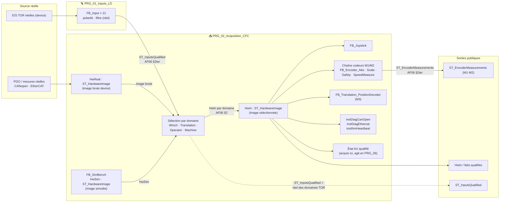
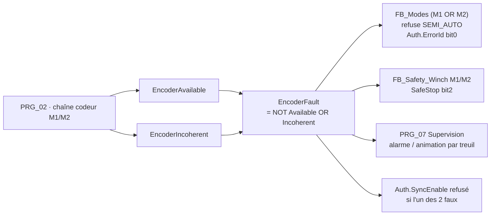

# 🏗️ Diagramme architecture cible — blocs & flux (d'après les specs AF)

> **Ce que c'est** : diagramme des blocs et de leurs liens (flux DUT / bus) comme ils doivent
> apparaître dans la page CFC cible, **strictement dérivé des specs** :
> `AF_Partie-02` §2/§4 (ordre MainTask) · `AF_Partie-06` §1/§2/§2bis/§2ter (frontière + contrats DUT).
> **Ce que ce n'est pas** : aucun élément inventé — chaque flux cite sa référence de spec.
> **Généré** : 2026-08-03. En cas d'écart avec une spec, la spec fait foi.

---

## 🔎 Légende

| Symbole | Sens |
|---|---|
| `──►` | Flux de données typé (DUT) entre producteur → lecteur |
| `==>` | Flux `PowerCutOff` (demandes de coupure agrégées en `PRG_06`) |
| `⇢` | Bascule réel/simulé (une seule par domaine, dans le CFC) |

---

## 1. Vue d'ensemble MainTask — ordre cible (AF02 §4)

```mermaid
flowchart LR
    A["🪜 01 PRG_01_Inputs_LD<br/>TOR réelles qualifiées<br/>(FB_Input, polarité+filtre)"]
    B["📥 02 PRG_02_Acquisition_CFC<br/>frontière E/S · sélection<br/>Joystick · Codeurs M1/M2 ·<br/>PosDecoder M3 · diag devices<br/>état AU"]
    C["🎚️ 03 PRG_03_Modes_Cycle_CFC<br/>FB_Modes · FB_Cycle"]
    D["🪝 04 PRG_04_Treuils_Benne_CFC<br/>M1/M2 + synchro + benne<br/>+ safety M1/M2 + homing"]
    E["↔️ 05 PRG_05_Translation_CFC<br/>M3 + safety M3"]
    F["⚡ 06 PRG_06_Outputs_LD<br/>barrières · agrégation PowerCutOff"]
    G["🔎 07 PRG_07_Supervision_CFC<br/>IHM · alarmes · bypass<br/>(lecture seule)"]

    A -->|ST_InputsQualified| B
    B -->|ST_EncoderMeasurements<br/>HwIn · faits qualifiés| C
    B -->|ST_EncoderMeasurements<br/>HwIn · faits qualifiés| D
    B -->|HwIn · faits qualifiés M3| E
    B -->|faits qualifiés| F
    C -->|Auth : autorisations| D
    C -->|Auth : autorisations| E
    D -->|demandes| F
    E -->|demandes| F
    D ==|PowerCutOff M1/M2| F
    E ==|PowerCutOff M3| F
    F -->|commandes physiques + état| G
```

> **Source** : AF02 §4 (liste 01→07), AF06 §2bis (frontière/absorptions), AF06 §2ter (DUT), AF02 §2 (autorisations Modes→procédés).

---

## 2. Zoom `PRG_02_Acquisition_CFC` — frontière interne (AF06 §1/§2)



### Règles du câblage (extraits AF06 §2, §2ter)

| # | Règle | Réf. spec |
|---|---|---|
| 1 | Aucun FB métier ne lit une E/S brute device : tout passe par `HwIn` | AF06 §2 (TC-P06-001) |
| 2 | Bascule réel/simulé **une seule fois par domaine**, dans le CFC | AF06 §2 (TC-P06-003) |
| 3 | `FB_Input` filtre le **réel uniquement** (Q1=A) ; le sim passe sans filtre | AF06 §2ter |
| 4 | `ST_InputsQualified` : réel pur, jamais de sim ; lu par `PRG_02` seul | AF06 §2ter |
| 5 | `ST_EncoderMeasurements` : producteur `PRG_02` unique ; lecteurs Treuils/Modes/Supervision | AF06 §2ter |
| 6 | `EncoderFault.<T> := NOT EncoderAvailable OR EncoderIncoherent` — agrégat calculé par `FB_Modes` | AF06 §2ter « Flux perte codeur » |
| 7 | Diagnostics devices/bus produits **ici** (supprime le POU legacy) | AF06 §2bis |
| 8 | État AU **acquis ici, agit en `PRG_06_Outputs_LD`** — jamais d'action ici | AF06 §2bis |

---

## 3. Flux perte codeur (P0) — un seul fait par treuil (AF06 §2ter)



> **Source** : AF06 §2ter « Flux perte codeur → Modes / Safety / Supervision / IHM » (tableau des consommateurs + formule).

---

## 4. Correspondance code legacy → cible (AF02 §4, AF06 §2bis)

| Legacy | Cible | Lot |
|---|---|---|
| `PRG_00_Inputs` / `PRG_INPUTS_LD` | `PRG_01_Inputs_LD` | M1 |
| `PRG_ACQUISITION_CFC` + `PRG_02_Encoders` + `PRG_01_Diagnostics` + `PRG_AUXILIARY_CFC` | `PRG_02_Acquisition_CFC` | M1 |
| `PRG_MODES_CFC` + `PRG_05_Cycle` | `PRG_03_Modes_Cycle_CFC` | M2 |
| `PRG_TREUILS_CFC` + safety M1/M2 (`PRG_SAFETY_CFC`) | `PRG_04_Treuils_Benne_CFC` | M3 |
| `PRG_TRANSLATION_CFC` + safety M3 | `PRG_05_Translation_CFC` | M4 |
| `PRG_OUTPUTS_LD` (+ agrégat `PowerCutOff`) | `PRG_06_Outputs_LD` | M5 |
| `PRG_SUPERVISION_CFC` + `PRG_TROUBLESHOOTING_CFC` | `PRG_07_Supervision_CFC` | M6 |
| — (renumérotation + CFC natif) | — | M7/M8 |

📌 Détail des lots : `PLAN_EXECUTION_MIGRATION_7POU.md` · arbitrages : `REGISTRE_ARBITRAGES_MIGRATION.md`.
