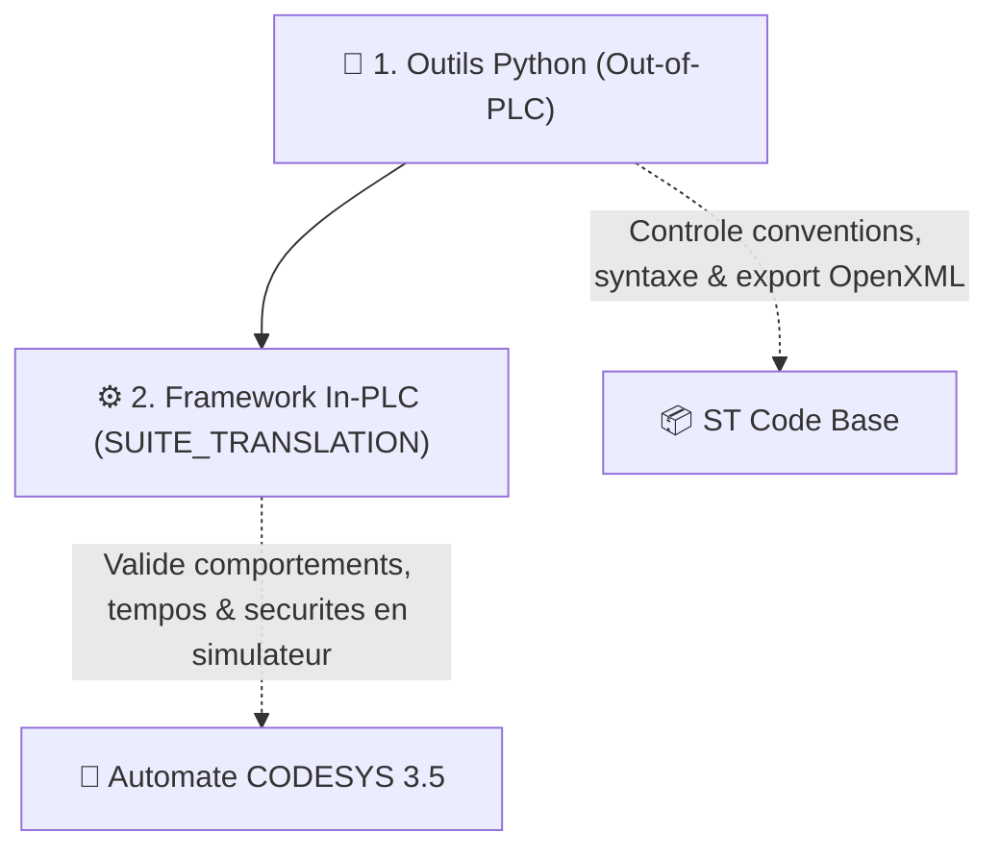
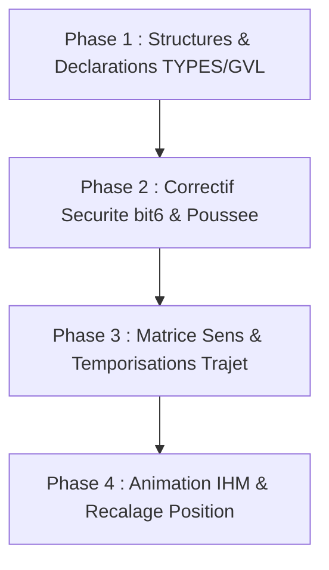

# 📄 AUDIT & SPÉCIFICATIONS — Refonte du Positionnement & Sécurités Translation M3

> 📅 **Date** : 24 Juillet 2026  
> 🏷️ **Document** : `DOC/AUDITS/TranslationM3/AUDIT_Refonte_Positionnement_Securites_M3_v1.0.md`  
> 🎯 **Objet** : Bilan complet de l'analyse expert, décisions de conception, matrice d'impacts système/sécurité, plan de phasage, stratégie de tests et maquettes de code pour la translation M3.

---

## 🎯 1. Contexte & Problématique

La translation M3 du chariot d'excavatrice s'effectue sur un axe horizontal desservant 4 zones (`Trémie`, `P2`, `P1`, `Maintenance`) et une zone de pré-ralentissement `PV` (Point de Vitesse avant Trémie).

### 🔍 Trous dans la raquette et limites de l'architecture actuelle :
1. **Absence de mesure continue** : Système 100% TOR sur 5 capteurs physiques. Aucun codeur sur M3 $\Rightarrow$ Impossibilité de connaître la position absolue ou la vitesse réelle en mètres.
2. **Gestion binaire simpliste du sens en Auto (`PRG_07`)** :
   ```pascal
   // Code actuel PRG_07 (lignes 50-54)
   IF SelTarget = 1 THEN M3_Direction_Active := 1; ELSE M3_Direction_Active := -1; END_IF;
   ```
   *Anomalie* : Si le chariot est en `P1` et qu'on demande `P2` (situé à sa gauche vers Trémie), l'automate imposait `Direction := -1` (vers Maintenance) $\Rightarrow$ **Déplacement dans le mauvais sens !**
3. **Le Paradoxe du Fin de Course Extrême (`bit6`)** :
   * Le mot `11111` est à la fois la position normale `Trémie` ET le fin de course extrême avant.
   * Le mot `00000` est à la fois la position normale `Maintenance` ET le fin de course extrême arrière.
   * *Anomalie* : Une arrivée normale en Trémie déclenchait immédiatement l'alarme d'urgence extrême `bit6` et la décélération rapide `SafeStop` !
4. **Absence de séquence de localisation / initialisation (Homing M3)**.
5. **Ralentissement dissymétrique** (`PV` ne ralentit que vers la Trémie, arrêt brutal vers Maintenance).
6. **Absence de Watchdog de parcours** (si patinage ou chaîne cassée, le variateur tourne indéfiniment).

---

## 🚀 2. Nouvelles Fonctionnalités Valides & Choisies

### ⚙️ Feature 1 : Matrice de Déplacement Inter-Positions & Temporisations
* **Principe** : À partir de chaque position connue (`Trémie`, `P2`, `P1`, `Maintenance`), le passage sur un capteur intermédiaire lance une **temporisation de parcours à grande vitesse** adaptée au trajet commandé.
* **Fonctionnement** :
  1. Départ (ex: `Trémie` `11111`).
  2. Commande vers la cible (ex: `P1`).
  3. Montée en vitesse sur rampe logicielle.
  4. Franchissement du capteur de sortie `PV` (`01111`) $\Rightarrow$ Lancement de `Tampo_Tremie_To_P1`.
  5. Échéance de la tempo $\Rightarrow$ Décélération vers la vitesse lente d'approche (`ApproachSpeedPct`).
  6. Franchissement du capteur cible `P1` $\Rightarrow$ **Arrêt net (`ArrivalLock`)**.
* 🛡️ **Règle d'or Joystick & Sécurité** :
  * Si l'opérateur relâche ou réduit le joystick pendant la tempo, la temporisation continue de s'écouler pendant que le chariot avance moins vite.
  * **Résultat** : La tempo expire alors que le chariot est plus loin du capteur $\Rightarrow$ Le chariot repasse en petite vitesse d'approche **plus tôt** (jamais trop tard, aucun choc à grande vitesse).

### 🐢 Feature 2 : Zone "Navette Douce" Maintenance
* Tout déplacement dans la zone arrière (`P1` $\leftrightarrow$ `Maintenance`) est automatiquement **bridé à vitesse réduite** (ex: 30% max) pour préserver la mécanique et les structures d'extrémité.

### 🧭 Feature 3 : Désambiguïsation des Libellés IHM (`BtnFwd` / `BtnRev`)
* Pour éliminer toute confusion sur le terrain :
  * `BtnFwd` / `Direction = +1` $\rightarrow$ **`BtnFwd_Tremie` (Vers la Trémie / Vers la Gauche)**.
  * `BtnRev` / `Direction = -1` $\rightarrow$ **`BtnRev_Maintenance` (Vers la Maintenance / Vers la Droite)**.

### 🛡️ Feature 4 : Surveillances Sécurité Métier & Watchdog (Méca C)
1. **Watchdog de Parcours (Timeout)** : Si le capteur cible n'est pas touché au bout de $\text{TempoNominale} + \text{Marge (ex: 5s)}$, arrêt d'urgence `SafeStop` + Alarme *"Défaut temps de parcours Translation"*.
2. **Détection de Capteur Inattendu** : Saut de zone anormal $\Rightarrow$ Arrêt rapide `SafeStop`.
3. **Poussée Anormale à l'Arrêt (Correction du Paradoxe `bit6`)** :
   * Le franchissement du capteur extrême (`11111` ou `00000`) déclenche un **arrêt de travail normal**.
   * Le `bit6` (Fin de course extrême / `PowerCutOff`) ne se lève **que si après $1.5\text{ s}$ d'arrêt commandé, la vitesse réelle variateur reste $> 0.5\text{ Hz}$** (preuve physique que le chariot pousse contre les tampons !).

### 🖥️ Feature 5 : Position Estimée & Animation Fluidifiée IHM
* Interpolation à $10\text{ Hz}$ de la position $X_{est}$ (en mètres) basée sur la fréquence variateur mesurée.
* **Recalage instantané** sur la valeur exacte à chaque franchissement de capteur physique (`Trémie`=$0\text{m}$, `P2`=$8.5\text{m}$, `P1`=$16\text{m}$, `Maintenance`=$24\text{m}$).

---

## 🧪 3. Stratégie de Validation & Framework de Test

La validation repose sur la complémentarité entre la vérification de code out-of-PLC (Python) et l'exécution automatisée in-PLC (AF_Partie-14) :



### 1. Contrôle Statique & Out-of-PLC (Python)
* **Outils** : `TOOLS/AGENT_WORKFLOW/scripts/check_code_style.py` et `pytest`.
* **Rôle** : Garantir la conformité PascalCase, la cohérence du XML et l'absence de mots-clés interdits (`CoupeEnable`).

### 2. Validation Dynamique Automatisée In-PLC (`CODE/SIMULATION/PLC_TESTS/`)
L'implémentation de la refonte M3 sera couverte par les cas de tests automatisés In-PLC suivants dans `FB_TranslationValidation.st` :

| Identifiant TC | Feature / Sécurité Validée | Condition & Injection | Critère d'Acceptation (Attendu) |
| :--- | :--- | :--- | :--- |
| **TC-TRANSLATION-01** | Matrice de Sens Dynamique | Demande $P1 \rightarrow P2$ depuis la zone $P1$. | `Direction` forcée à $+1$ (Trémie), `M3_Direction_Active` correct. |
| **TC-TRANSLATION-02** | Correctif Poussée `bit6` | Franchissement `11111` avec $v = 0$ puis injection $v = 1.0\text{ Hz}$ pendant $2\text{ s}$. | Pas de `bit6` à $v=0$. Levée de `bit6` + `PowerCutOff` après $1.5\text{ s}$ d'effort continu. |
| **TC-TRANSLATION-03** | Watchdog de Parcours (Méca C) | Consigne lancée vers $P1$, pas de franchissement $P1$ au-delà de $\text{Tempo} + 5\text{ s}$. | Arrêt immédiat `SafeStop` + Alarme *"Défaut temps de parcours Translation"*. |
| **TC-TRANSLATION-04** | Bridage Zone Maintenance | Déplacement $P1 \rightarrow \text{Maintenance}$. | Vitesse `DriveFreqRefHz` plafonnée à $30\%$ max de la pleine échelle. |

---

## 🗺️ 4. Plan Phased & Organisation du Projet (Éviter les Répulsions & Incohérences)

Pour garantir une implémentation sans régression ni blocage, le développement sera découpé en **4 Phases Successives**. Chaque phase se termine par une validation avant de passer à la suivante.



### 🔹 Phase 1 : Fondations & Structures de Données (`_TYPES` & `GVL`)
* **But** : Poser toutes les nouvelles variables et enums sans modifier le code exécutable (zéro risque de casser le fonctionnement existant).
* **Fichiers impactés** : `ST_TranslationCmd.st`, `E_ZoneM3` (nouvel Enum), `GVL_PERSISTENT.st` (ajouts tempos RETAIN).
* **Validation** : Execution de `check_code_style.py` + Compilation 0 erreur.

### 🔹 Phase 2 : Correction Sécurité Extrême `bit6` & Découplage `FB_Safety_Translation`
* **But** : Résoudre le paradoxe d'arrêt d'urgence intempestif en Trémie/Maintenance.
* **Fichiers impactés** : `FB_Translation_PositionDecoder.st`, `FB_Safety_Translation.st`.
* **Validation** : Exécution de **TC-TRANSLATION-02** dans `FB_TranslationValidation.st` (s'assurer qu'une arrivée normale en Trémie ne lève PLUS le bit 6).

### 🔹 Phase 3 : Matrice de Sens, Temporisations & Watchdog (`PRG_07` & `FB_Translation`)
* **But** : Remplacer l'arbitrage de sens simpliste par la matrice dynamique et gérer les temporisations de parcours.
* **Fichiers impactés** : `PRG_07_TranslationControl.st`, `FB_Translation.st`.
* **Validation** : Exécution de **TC-TRANSLATION-01** (matrice inter-positions), **TC-TRANSLATION-03** (watchdog) et **TC-TRANSLATION-04** (bridage maintenance).

### 🔹 Phase 4 : Estimation Visuelle $X_{est}$ & Supervision IHM
* **But** : Intégrer l'interpolation de position pour la visualisation fluide IHM et renommer les boutons pour l'opérateur (`BtnFwd_Tremie`).
* **Fichiers impactés** : `FB_Translation.st`, `PRG_09_Supervision.st`.
* **Validation** : Vérifier que le chariot glisse bien sur l'écran et se recale à chaque franchissement de capteur en simulation CODESYS.

---

## ⚠️ 5. Matrice d'Impacts sur le Programme & le Code Existant

| Composant | Phase | Impact / Modification Requise | Risque / Vigilance |
| :--- | :--- | :--- | :--- |
| **`ST_TranslationCmd.st`** | Phase 1 | Ajout des champs `BtnFwd_Tremie`, `BtnRev_Maintenance`, `PositionEstimated_M`. | Conservateurs d'alias pour rétrocompatibilité. |
| **`FB_Translation_PositionDecoder.st`**| Phase 2 | Découplage du mot 5 bits : `LimitSwitch` ne se lève plus sur simple présence de `11111`/`00000`. | 🛑 CRITIQUE : Impact direct sur la chaîne d'arrêt. |
| **`FB_Safety_Translation.st`** | Phase 2 | Modification de `bit6` (conditionné par $v > 0.5\text{Hz}$ temporisé) + Watchdog parcours. | 🛡️ Validation obligatoire sur banc de simulation. |
| **`PRG_07_TranslationControl.st`** | Phase 3 | Remplacement du `IF SelTarget = 1` par la matrice de sens dynamique `CurrentZone` vs `SelTarget`. | 🛑 CRITIQUE : Détermine le sens de marche en SEMI_AUTO. |
| **`FB_Translation.st`** | Phase 3 & 4 | Intégration de la matrice de tempos, de l'état `ArrivalLock` et de l'interpolation $X_{est}$. | ⚠️ Attention aux rampes d'accélération/décélération en cours de tempo. |
| **`FB_TranslationValidation.st`** | Phase 2,3,4 | Implémentation des cas de tests TC-TRANSLATION-01 à 04 pour certifier l'automate. | Exécution obligatoire avant validation terrain. |
| **`GVL_IHM.st` / Supervision** | Phase 4 | Ajustement des libellés et des visuels pour le chariot IHM. | Nécessite l'adaptation des vues HMI CODESYS. |

---

## 💻 6. Détails Techniques & Maquettes de Code ST

### 🧪 Maquette 1 : Matrice de Sens et Temporisation (`PRG_07_TranslationControl`)

```pascal
// Détermination du sens de marche dynamique selon la zone courante et la cible
CASE CurrentZone OF
    E_ZoneM3.TREMIE:
        IF SelTarget = 2 OR SelTarget = 3 OR SelTarget = 4 THEN
            M3_Direction_Active := -1; // Vers Maintenance (Droite)
            TempoRunTarget := GetTempo(CurrentZone, SelTarget);
        END_IF;
        
    E_ZoneM3.P2:
        IF SelTarget = 1 THEN
            M3_Direction_Active := 1;  // Vers Trémie (Gauche)
        ELSIF SelTarget = 3 OR SelTarget = 4 THEN
            M3_Direction_Active := -1; // Vers Maintenance (Droite)
        END_IF;

    E_ZoneM3.P1:
        IF SelTarget = 1 OR SelTarget = 2 THEN
            M3_Direction_Active := 1;  // Vers Trémie (Gauche)
        ELSIF SelTarget = 4 THEN
            M3_Direction_Active := -1; // Vers Maintenance (Droite)
        END_IF;

    E_ZoneM3.MAINTENANCE:
        IF SelTarget = 1 OR SelTarget = 2 OR SelTarget = 3 THEN
            M3_Direction_Active := 1;  // Vers Trémie (Gauche)
        END_IF;
END_CASE;
```

### 🧪 Maquette 2 : Levée Conditionnelle du Fin de Course Extrême (`FB_Safety_Translation`)

```pascal
// Correction du paradoxe bit6 :
// Se déclenche uniquement si on est sur le capteur d'extrémité ET que le variateur pousse encore après un délai !
OnEndCapteur := (LimitSwitchFwd_Raw OR LimitSwitchRev_Raw);
PushesAgainstBuffer := OnEndCapteur AND (ABS(DriveActualFreqHz) > 0.5) AND (Direction = 0 OR SafeStop);

TonBufferPush(IN := PushesAgainstBuffer, PT := T#1S500MS);

IF TonBufferPush.Q THEN
    ErrorId := ErrorId OR 16#0040; // bit6: Vrai surpassement physique confirmé !
END_IF;
```

### 🧪 Maquette 3 : Interpolation & Recalage Position IHM (`FB_Translation`)

```pascal
// Calcul de la vitesse estimée en m/s (ex: 50 Hz = 0.5 m/s)
EstimatedSpeed_MS := (DriveActualFreqHz / DriveFreqScaleMaxHz) * MaxLinearSpeed_MS;

// Intégration de la position estimée
IF CommandedDirection = 1 THEN
    PositionEstimated_M := PositionEstimated_M - (EstimatedSpeed_MS * CycleTimeS);
ELSIF CommandedDirection = -1 THEN
    PositionEstimated_M := PositionEstimated_M + (EstimatedSpeed_MS * CycleTimeS);
END_IF;

// Recalage instantané sur capteurs réels (Auto-correction)
IF SensorsWord = 2#11111 THEN PositionEstimated_M := 0.0; END_IF;  // Trémie
IF SensorsWord = 2#00111 THEN PositionEstimated_M := 8.5; END_IF;  // P2
IF SensorsWord = 2#00011 THEN PositionEstimated_M := 16.0; END_IF; // P1
IF SensorsWord = 2#00000 THEN PositionEstimated_M := 24.0; END_IF; // Maintenance
```

---

## ✅ 7. Conclusion

Ce document d'audit intègre le plan de phasage et la stratégie de tests automatisés In-PLC. La mise en œuvre suivra scrupuleusement les phases 1 à 4 pour certifier chaque composant avant livraison.
