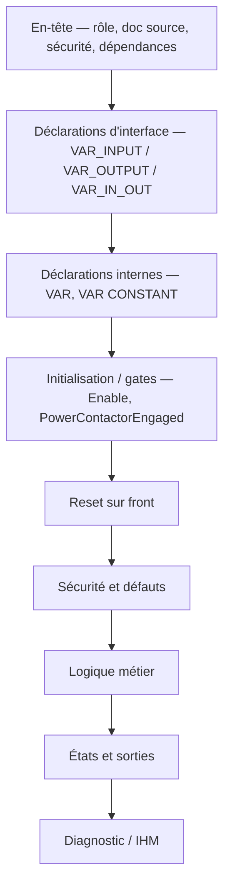

# 🧭 Standards Qualité Code — Référentiel Universel

> 📌 **Propriétaire unique** des règles de déclaration, de liaison et de POO du projet.
> Tout autre document (skill CODESYS, `CODE_WRITING_POLICY`, prompts agents) **renvoie ici**
> au lieu de reformuler — une règle écrite deux fois dérive toujours.
> Portée : tout agent (Claude, Codex, Gemini/antigravity), tout workflow, et l'humain.

**Répartition des rôles — ne pas chercher ailleurs :**

| <nobr>Sujet</nobr> | Document |
|---|---|
| <nobr>Comment on **nomme**</nobr> | `DOC/STDS/NAMING_CONVENTION.md` |
| <nobr>Comment on **déclare, encapsule, relie**</nobr> | **ce document** |
| <nobr>Comment on **édite une AF**</nobr> | **ce document §0** |
| <nobr>Comment on **teste/vérifie**</nobr> | `DOC/STDS/GUIDES/GUIDE_GATES_ET_TESTS_v1.2.md` |
| <nobr>Contrats FB, DUT et CFC</nobr> | `DOC/AF/AF_Partie-03_Contrats_Composants_v2.3.md` |
| <nobr>Ce que fait la machine</nobr> | `DOC/` — voir `DOC/README.md` pour l'index complet |
| <nobr>Comment on exécute une modif</nobr> | `AGENTS.md` (§ Workflow d'édition) |

---

## 0. Rédaction et Édition des Analyses Fonctionnelles (`DOC/AF/`)

1. **Emplacement & Versionnement** :
   - Toute spécification vit sous `DOC/AF/`.
   - Une modification d'exigence métier impose une nouvelle version (`_vX.Y.md`). L'ancienne version est déplacée dans `ARCHIVES/Doc/`.
2. **Structure d'une AF** :
   - 📌 Sommaire
   - 🎯 **§1 Rôle et périmètre + Table des fonctions** (`F<NN>.<seq>`) — catalogue des fonctions
     du domaine, **avant** la Table des points de validation (convention `GUIDE_EDITION_AF.md §2bis`,
     document `DESIGN_TABLE_FONCTIONS_AF`)
   - 🧪 **Table des points de validation — Cas de Test (`TC-Pxx-nnn`)** (juste après §1, obligatoire)
   - 🧱 Interfaces & DUTs
   - ⚙️ Chronogrammes & Logique métier
3. **Règle des Identifiants de Validation (`TC-Pxx-nnn`)** :
   - **Format** : `TC-P<Partie>-<Numéro>` (ex: `TC-P01-010`, `TC-P10-010`).
   - **Numérotation par pas de 10** (`010`, `020`, `030`) pour autoriser les insertions sans dénumérotation.
4. **Formatage Standard & Optimisation Espace des Tableaux de Validation TC** :
   - **Contrôle de Largeur Rigide (`table-layout: fixed; width: 100%`)** : Utilisation d'un `<colgroup>` explicite pour forcer 92%+ de la largeur sur le déroulé.
   - **ID Vertical (`28px`)** : L'ID est orienté verticalement (`writing-mode: vertical-rl; transform: rotate(180deg)`) pour libérer l'espace horizontal, tandis que l'en-tête `ID` reste horizontal.
   - **Intention Centrée (`50px`)** : Intitulé ultra-compact sur 2 lignes (ex: `Nominal`<br>`Réarm.`), centré horizontalement et verticalement.
   - **Séquence & Déroulé Étape par Étape (`calc(100% - 165px)`)** : Décomposition chronologique complète par étapes (`💤 Étape 0`, `🚀 Étape 1`, `⚡ Étape 2`, `✅ Étape 3`), mentionnant stimuli, temporisations et sanctions.
   - **Suppression de la Colonne Preuve** : Le déroulé complet portant déjà les assertions précises et le comportement observable, la colonne `Preuve` est bannie pour éliminer la redondance et laisser 100% de place au texte.
   - **Colonnes Annexes Compactes** : `Type` (45px), `Réf` (26px), `État` (36px, `V-I`, `NV-I`, `NV`).
   - **Typographie Uniforme** : Police 13px, interligne 1.55, padding compact (`4px 1px` sur les bords, `6px 8px` dans la séquence).
   - **Combinaison Zéro-Marge & Flèches Vectorielles** : Cartes HTML ultra-compactes (`padding: 6px 10px`) associées à de vraies flèches vectorielles SVG colorées (`<svg>`).
   - **Émoji collé directement à gauche** : Émoji sur la même ligne avec espace fixe devant le nom (`🛡️ &nbsp;<b>FB_Safety_Translation</b> &nbsp;—&nbsp; <span style="color:#cbd5e1;">Rôle</span>`).
   - **Flèches Vectorielles & Contrats Explicites** : Éléments vectoriels `<svg>` colorés selon le domaine métier et étiquette explicite du signal transmis.
   - *(Référentiel d'édition complet : [`DOC/STDS/GUIDES/GUIDE_EDITION_AF_v1.0.md`](GUIDES/GUIDE_EDITION_AF_v1.0.md))*.
6. **Cartouche d'Entête des Fichiers Code ST (`CODE/*.st`) & Cohérence AF Stricte** :
   - **Concisions & Longueur Maximale (≤ 15 lignes)** : Le cartouche d'entête doit être **ultra-concis, direct et fonctionnel**. Il comporte au maximum 15 lignes de commentaires.
   - **Purge Absolue du Journal de Chantier / REX** : **Zéro historique REX, dates de correctifs terrain ou compte-rendus d'incidents** dans le cartouche d'entête du code ST (ex: ❌ *« REX 2026-07-01 bug corrigé... »*, ❌ *« ÉVOLUTION D72 suite retour terrain... »*). Tout l'historique vit exclusivement dans `DOC/VERSION_HISTORY.md`, `DOC/AF/` et Git.
   - **Structure Multi-Lignes & Liste Blanchie d'Emojis** : Tout fichier ST commence par un cartouche structuré utilisant **exclusivement** les émojis de la liste blanchie du projet, validée empiriquement dans l'éditeur et la visualisation CODESYS 3.5 (aucun carré vide) :
     ```pascal
     (* =======================================================================
        🛡️ FB_Safety_Translation — Anti-télescopage & Verrouillage M3
        ───────────────────────────────────────────────────────────────
        🎯 Rôle : Anti-télescopage Benne/Translation et verrous de sécurité M3
        🔒 Polarité : MaintainA/B_RQ en maintien (TRUE = voie saine)
        🔌 Architecture : Composition interne Logic/Output
        📄 Doc métier : DOC/AF/AF_Partie-11_Fonction_Translation_v2.3.md
        ======================================================================= *)
     ```
   - **Guide des Émojis Blanchis Autorisés (whitelist CODESYS projet)** :
     - `🎯` = Rôle principal du composant (recopié de l'AF).
     - `📄` = Référence exacte à la spec métier active dans `DOC/AF/` — **chemin complet
       versionné obligatoire** (`DOC/AF/AF_Partie-NN_..._vX.Y.md`), c'est le seul format que
       `G340_check_doc_links.py --fix` reconnaît et maintient à jour automatiquement (D1/D2).
       Si la Table des fonctions de l'AF existe, ajouter le(s) code(s) `F<NN>.<seq>` **en
       suffixe entre parenthèses**, jamais en remplacement du chemin :
       `📄 Doc métier : DOC/AF/AF_Partie-08_Fonction_Joystick_v2.5.md (F08.02)`. Un FB qui
       porte plusieurs fonctions liste plusieurs codes (`F08.01, F08.03-F08.07`).
     - `🛡️` = Bloc ou fonction de Sécurité Machine.
     - `🔒` = Polarité, invariant de sécurité ou verrouillage / interlock.
     - `🔌` = Interface matérielle ou bus de données DUT.
     - `📥` = Section Entrées / Acquisition.
     - `📤` = Section Sorties / Ordres Actionneurs.
     - `⚙️` = Machine d'état / Calcul interne.
     - `📊` = Diagnostic / Mesures.
     - `💾` = Donnée Persistante (`GVL_PERSISTENT`).
     - `🧪` = Mode Test / Simulation.
     *(Whitelist validée en visualisation CODESYS du projet. Tout émoji qui s'afficherait en carré vide `` selon la police Windows CODESYS est proscrit et doit être retiré sur signalement terrain.)*
   - **Source Unique de Vérité (Zéro Dérive)** : Le titre et le rôle décrits dans le cartouche d'entête `.st` doivent être **recopiés à l'identique** depuis l'AF spécifiée (`DOC/AF/`). Le script d'audit valide automatiquement cette cohérence.

1. Le nom dit **le rôle**, jamais le type (`bFlag` ❌, `iCounter` ❌ — le type se lit en déclaration).
2. Le nom se lit **sans le commentaire d'à côté**. Si le commentaire répète le nom, le nom est mauvais.
3. Une notion = **un seul nom** dans tout le projet (jamais `BrakeIsOpenConfirmed` à côté de `BrakeCommandOpenConfirmed`).

Détail complet (préfixes, suffixes d'unité, polarité booléenne, construction instance→champ) :
`DOC/STDS/NAMING_CONVENTION.md`.

---

## 2. Déclaration — ce qu'un automaticien vérifie sans y penser

- **Ordre immuable des blocs de déclaration** :
  1. `VAR_INPUT` (Entrées)
  2. `VAR_OUTPUT` (Sorties)
  3. `VAR_IN_OUT` (Bus et structures partagées)
  4. `VAR` (Sous-instances FB puis variables locales internes)
  5. `VAR_STAT` / `VAR CONSTANT` (Si applicables)

- **Flèches ASCII de flux et Tags de rôle en visualisation CODESYS** :
  Pour maximiser la lisibilité en mode Watch / Visualisation CODESYS 3.5 et identifier immédiatement le flux de données :
  - **Entrées (`VAR_INPUT`)** : Flèche `-->` suivie du tag `[CMD]` (commande), `[CFG]` (réglage), `[HW]` (matériel/capteur), `[SAFE]` (sécurité/permis), ou `[TST]` (bypasses/tests).
  - **Sorties (`VAR_OUTPUT`)** : Flèche `<--` suivie du tag `[STAT]` (état/synoptique), `[ACT]` (ordre actionneur), ou `[DIAG]` (diagnostic/mesure).
  - **In/Out (`VAR_IN_OUT`)** : Flèche bidirectionnelle `<->` suivie du tag `[BUS]`.
  - **Instances FB (`VAR`)** : Étoile `*` suivie du tag `[INST]`.
  - **Variables Locales (`VAR`)** : Point `.` suivi du tag `[LOC]` (⚠️ **Ne JAMAIS utiliser `[INT]`** pour éviter la confusion avec le type de donnée `INT` / Integer IEC 61131-3 !).

- **Sous-groupage par Bannières ASCII** :
  À l'intérieur de chaque bloc (`VAR_INPUT`, `VAR_OUTPUT`, `VAR`), les variables sont regroupées par sous-domaines fonctionnels précédés d'une bannière ASCII `// === TITRE ===`.

- **Exemple de déclaration cible conforme** :
  ```pascal
  VAR_INPUT
      // === COMMANDES & CONSIGNES ===
      Enable                  : BOOL;   // --> [CMD] Autorisation generale FB (TRUE=Autorise)
      Direction               : INT;    // --> [CMD] Sens demande (-1: Descente, 0: Stop, 1: Montee)

      // === REGLAGES & CONFIGURATION ===
      CfgMaxStepDescente      : INT := 3; // --> [CFG] Plafond palier en descente
  END_VAR
  VAR_OUTPUT
      // === ETATS IEC & SYNOPTIQUE ===
      Ready                   : BOOL;   // <-- [STAT] FB pret a fonctionner

      // === ORDRES ACTIONNEURS (SORTIES TOR) ===
      RelayFwd                : BOOL;   // <-- [ACT]  Ordre contacteur sens montee
  END_VAR
  VAR
      // === SOUS-INSTANCES FB ===
      SpeedStep               : FB_SpeedStep; // * [INST] Decodage paliers vitesse

      // === DETECTEURS & TIMERS INTERNES ===
      ResetEdge               : R_TRIG;       // . [LOC]  Detecteur front montant Reset
      DirectionDelay          : TON;          // . [LOC]  Temporisation d'inversion
  END_VAR
  ```

- **Toute variable est initialisée explicitement** quand sa valeur par défaut n'est pas la valeur
  sûre. Cas vécu : un `BOOL` capteur de sécurité non initialisé démarre à `FALSE` = « défaut »
  permanent (REX `PhaseRotationOk`). Règle : famille sécurité → `:= TRUE` explicite.
- **Aucun nombre magique dans le corps.** Un seuil, une durée, un facteur se déclarent en
  `VAR CONSTANT` nommée (ou en paramètre de config), jamais en littéral au milieu du code.
  Exception admise : `0`, `1`, `TRUE`, `FALSE` et les indices de boucle.
- **Portée minimale.** Dans l'ordre de préférence : variable locale `VAR` → `VAR_INPUT`/`VAR_OUTPUT`
  → GVL. Une GVL ne se crée que pour une **frontière identifiée** (IHM, persistance, simulation,
  image process), jamais comme boîte à variables communes.
- **Une déclaration = un rôle documenté** : unité, plage et polarité en commentaire de fin de ligne
  quand elles ne sont pas évidentes dans le nom.
- **Littéraux STRING en ASCII strict** : un littéral STRING (`'...'`) ne contient **aucun caractère
  multi-octet** (emoji, tiret cadratin `—`, trait de cadre `═`). CODESYS n'interprète pas les STRING
  en UTF-8 par défaut → un caractère multi-octet casse la compilation (C0555 + erreurs en cascade,
  REX 2026-08-17 `FB_Hmi_BannerFormatter`). Les accents latins (é, è, à) sont tolérés ; les emojis
  restent autorisés dans les **commentaires**. Contrôle : `G405_check_st_string_ascii.py`.
- **`VAR_IN_OUT` est réservé** au partage intentionnel et documenté d'un objet. Il ne sert jamais
  à contourner une interface ni à autoriser un second écrivain.
- **`PERSISTENT`/`RETAIN`** : uniquement pour un réglage qui doit survivre à un redémarrage.
  Un paramètre influençant une fonction de sécurité n'est pas rendu réglable sans exigence
  métier validée, bornage et traçabilité.

---

## 2bis. 🧭 Convention des Régions `{region ...}` (Lisibilité Maintenance)

Les régions CODESYS (`{region "..."}` / `{endregion}`) structurent le corps ST en blocs
repliables. Elles **n'ont aucun effet sur la compilation ni la logique** (balises d'éditeur),
mais elles guident la lecture maintenance. Convention projet :

- **Format unique** : `{region "§N <Description concise>"}` — `N` = **numéro de section du corps**
  que le bloc contient (aligné sur les commentaires `// §N` du corps, eux-mêmes référencés par
  les fiches AF). L'ordre des régions suit l'ordre d'exécution du POU.
- **Sous-sections** : `§Nbis`, `§Nter`, `§Nquater` pour un sous-bloc rattaché à `§N`
  (ex. `§1bis Diagnostic modules DI`). Une région peut contenir plusieurs sous-sections du corps
  (ex. une région `§2` contenant `§2` et `§3`).
- **Description** : en français, **courte et TDAH-friendly**, sans REX, date, lot ni récit
  d'essai (même règle que les commentaires, §2ter). Elle nomme le **rôle fonctionnel** du bloc.
- **`{endregion}`** : inchangé, toujours présent pour fermer chaque région.
- **Cohérence globale** : la numérotation `§N` des régions est **alignée sur les sections du corps**
  dans chaque POU ; un POU ne mélange jamais style numéroté et style descriptif.

Exemple conforme :
```pascal
{region "§1 Gate neutralisation"}
...
{endregion}
{region "§2 Reset et arbitrage mode"}
...
{endregion}
{region "§3 Calcul autorisations machine"}
...
{endregion}
```

Contrôle : la numérotation des régions est vérifiée par revue (pas de gate dédié à ce jour).

---

## 2ter. 💬 Politique de Rédaction des Commentaires (Zéro « Journal Intime / REX » dans le Code)

1. **Le Code ST est un Livrable Industriel Client** :
   - Les commentaires dans `CODE/*.st` doivent décrire **exclusivement ce que fait le code**, les plages, unités, algorithmes et rôles physiques.
   - **Interdiction Formelle des Commentaires de type « Journal Intime / REX »** :
     - ❌ *« n'était protégé par AUCUN étage avant ce lot, contrairement à ce qu'affirmait AF... »*
     - ❌ *« suite demande client du 07/08... »*
     - ❌ *« correctif bug trouvé par audit M3... »*
2. **La Traçabilité Vit dans la Documentation** :
   - Tout l'historique des arbitrages, analyses de cause racine, REX, décisions de réunions et comparatifs avant/après est consigné dans `DOC/` (`DOC/VERSION_HISTORY.md`, `DOC/AF/`, `DOC/WFLOW/TASKS.yaml`, `ARCHIVES/Doc/AUDIT_*`).
3. **Style de Commentaire dans le Code** :
   - **Concis, direct, TDAH-friendly** avec repères visuels emojis (`🎯 Rôle`, `⚡ Front`, `🔀 Aiguillage`, `📏 Mesure`, `🛡️ Sécurité`).
   - L'explication porte sur le **« Pourquoi » métier / physique**, jamais sur les péripéties de développement passées.

---

## 2quater. Lisibilité des conditions booléennes (REX 2026-08-12)

> 🚨 Cas vécu (`PRG_04_Treuils_Benne.st`) : `M1_StartStop_Active` combine 7 termes
> (`AND`/`OR`/`NOT` imbriqués) sur une seule condition. Impossible en Watch CODESYS de voir
> lequel bloque sans recalculer la condition à la main.

**Règle** : une condition de plus de **3 termes** (comparaisons/`AND`/`OR`/`NOT` chaînés) est
**scindée** en variables `BOOL` intermédiaires nommées (≤3 termes chacune), recombinées ensuite.
Zéro changement fonctionnel — chaque variable intermédiaire devient observable seule en Watch.

**Comparaison brute jamais niée inline.** Une comparaison (`=`, `<>`, `>`, `<`, `>=`, `<=`,
notamment sur un `enum`) qui doit être combinée ou inversée dans une condition composée est
**nommée d'abord**, puis réutilisée — jamais écrite `NOT (Mode = E_Mode.MAINT_N1)` au milieu
d'une condition. Le lecteur lit un fait (`ModeIsMaint1`), il n'a pas à repasser par l'opérateur
de comparaison pour comprendre ce qui est testé.

```pascal
// ❌ 7 termes sur une ligne, comparaison niée inline, illisible en debug
M1_StartStop_Active := (M1_Direction_Active <> 0) AND NOT instBucket.Busy
                        AND NOT CoupledMotionBlockedByBucket
                        AND NOT ((SyncMinorDeviationBlocksUp AND (M1_Direction_Active = 1))
                             OR  (SyncMinorDeviationBlocksDown AND (M1_Direction_Active = -1)))
                        AND (NOT GVL_IHM.Modes.Cmd.TglJoystickMaster OR PRG_02_Acquisition.JoystickDeadmanArmed);

// ✅ décomposé, chaque comparaison nommée avant d'être combinée/niée
M1_DirectionRequested  := (M1_Direction_Active <> 0);
M1_BucketFree           := NOT instBucket.Busy AND NOT CoupledMotionBlockedByBucket;
M1_SyncBlocksDirection := (SyncMinorDeviationBlocksUp AND (M1_Direction_Active = 1))
                       OR (SyncMinorDeviationBlocksDown AND (M1_Direction_Active = -1));
M1_JoystickAuthorized  := NOT GVL_IHM.Modes.Cmd.TglJoystickMaster OR PRG_02_Acquisition.JoystickDeadmanArmed;

M1_MotionAllowed    := M1_DirectionRequested AND M1_BucketFree AND NOT M1_SyncBlocksDirection;
M1_StartStop_Active := M1_MotionAllowed AND M1_JoystickAuthorized;
```

📌 **Portée** : s'applique aux **nouvelles écritures et aux refactors futurs**, pas de retouche
rétroactive du code existant à l'occasion de cette règle. Même logique pour la cohérence de
nommage `NAMING_CONVENTION.md` : l'écart déjà présent dans le code (noms longs plutôt
qu'abréviations anglaises courtes) n'est **pas** corrigé maintenant — mais toute variable créée
ou renommée à l'occasion d'un refactor ou d'une nouvelle fonctionnalité **doit** appliquer la
convention de façon cohérente avec le reste du projet, pas seulement localement.

---

## 2quinquies. 🔌 Interfaces Socle des Blocs Fonctionnels (Contrats Light & Standard)

Tout bloc fonctionnel (`FB_*`) relève de l'un des deux contrats d'interface socle formalisés à partir du code existant :

### 1. Contrat `light` (Calculateurs, filtres, utilitaires)
Destiné aux blocs **sans cycle de vie** (filtres, mises à l'échelle, convertisseurs, utilitaires purs)
et qui **ne remontent aucun défaut** — proche d'un FC de calcul.
- **`VAR_INPUT`** : `Enable : BOOL;` (en `BOOL` nu).
- **`VAR_OUTPUT`** : `Ready : BOOL;` (en `BOOL` nu).
- **Principe** : `Enable = FALSE` → sorties neutres/sûres + `Ready := FALSE`. Aucune machine d'état,
  aucun acquittement, aucune sortie d'erreur.
- 🚫 Un bloc qui doit **remonter un défaut** (capteur, calibration, bus) n'est **pas** `light` — c'est
  un `standard` (voir §2).

### 2. Contrat `standard` (Composants métier, séquenceurs, organes, devices)
Destiné aux blocs qui **remontent un défaut** (acquittable ou non) ou pilotent un organe.
- **`VAR_INPUT`** (socle fixe — 2 champs) :
  - `Enable : BOOL;` (en `BOOL` nu : autorisation générale).
  - `Reset : BOOL;` (en `BOOL` nu : acquittement sur front).
- **`VAR_OUTPUT`** :
  - `Ready : BOOL;` (en `BOOL` nu).
  - `Fault : ST_Fault;` — **forme cible**, remplie via une instance du socle `FB_FaultCore`
    alimentée par une liste `Causes : ARRAY[0..15] OF ST_FaultCause` nommées (§3 / §3bis).
  - `Lifecycle : ST_Lifecycle;` — **en plus, uniquement** si le FB porte une machine d'état à
    cycle (organe, séquenceur). Rempli par le FB lui-même, pas par `FB_FaultCore`. Un FB synchrone
    (conditionneur, joystick) ne le porte pas.

> 🎯 **Un device qui remonte un défaut est `standard`, même sans machine d'état.**
> Le critère de classement est **« remonte-t-il un défaut ? »**, pas « a-t-il une machine d'état ? ».
> Ex. `FB_Joystick` (device d'acquisition) remonte un défaut capteur/calibration/bus → il est
> `standard`. Il porte `Fault : ST_Fault` **sans** `Lifecycle`. Le socle `FB_FaultCore` ne produit
> ni `State`, ni `Warning`, ni texte — dérivés côté IHM depuis `LatchedId`/`ErrorId`.

> ⚠️ **`PowerContactorEngaged` n'est PAS un champ du socle `standard`.** Ce n'est pas un troisième
> `VAR_INPUT` imposé par défaut — c'est une entrée **conditionnelle**, à ajouter **seulement** si
> le FB pilote lui-même un organe consommant de la puissance (contacteur, frein, moteur) et doit
> en conséquence interlocker sa propre action sur l'état de la chaîne de puissance. `Reset`/`Error`
> (gestion de défaut, ex. calibration, capteur hors plage) est une question totalement indépendante
> de `PowerContactorEngaged` (pilotage d'organe) — les deux ne se déduisent jamais l'un de l'autre.
> Un FB `standard` de pure acquisition/conditionnement qui gère un défaut capteur (donc `Reset`/`Error`
> légitimes) mais ne pilote **aucun** actionneur ne porte **jamais** `PowerContactorEngaged`.
> Ajouter ce champ par réflexe de conformité au tableau, sans vérifier que le FB pilote réellement
> un organe, est une erreur (constaté sur `FB_Joystick` : gate sur `PowerContactorEngaged` sans
> piloter aucun actionneur, forçait le reset du timer d'armement homme-mort pendant toute la
> séquence de réarmement AU). Décision au cas par cas, par FB — jamais par copie du tableau.

> ⏳ **Formes legacy tolérées (décomptées, jamais permanentes)** — deux tolérances coexistent,
> aucune n'est une forme de conformité cible :
> 1. **Défaut à plat** (`Busy`, `Done`, `Error`, `ErrorId`, `State`, `StateAtError` déclarés
>    individuellement en `VAR_OUTPUT`, sans textes) — FB antérieurs au socle, migration **T137**.
> 2. **`Status : ST_Status`** (struct de statut agrégé legacy — `CODE/A_COMMUN/_TYPES/ST_Status.st`) —
>    **17 FB** encore concernés, tolérés **jusqu'à T164-5** (migration vers `Fault : ST_Fault`).
>
> Tout FB **nouveau** porte `Fault : ST_Fault` rempli via `FB_FaultCore` (+ `Lifecycle : ST_Lifecycle`
> si machine d'état) — §3 / §3bis. Le guard `G315_check_fb_interface.py` reconnaît la forme cible
> et les formes legacy et publie leur décompte (mesure de l'avancement des migrations).

### 3. Structures socle `ST_Fault` / `ST_FaultCause` / `ST_Lifecycle`
Le défaut d'un FB `standard` est porté par la brique **`ST_Fault`** (`CODE/A_COMMUN/_TYPES/ST_Fault.st`) —
**deux vues**, applicable dans TOUS les cas (acquittable ou non), sans brique warning séparée :

```pascal
TYPE ST_Fault :
STRUCT
    Error     : BOOL;   // vue LIVE : au moins une cause présente maintenant ; Error := (ErrorId <> 0)
    ErrorId   : WORD;   // bitfield des causes présentes maintenant (0 si aucune) — retombe seul
    Latched   : BOOL;   // vue LATCHÉE : défaut non acquitté, reste jusqu'au front Reset ; Latched := (LatchedId <> 0)
    LatchedId : WORD;   // ErrorId figé à l'apparition d'une cause `Active AND Latching`, effacé au Reset
END_STRUCT
END_TYPE
```

La cause élémentaire est **`ST_FaultCause`** (`CODE/A_COMMUN/_TYPES/ST_FaultCause.st`), exprimée EN CLAIR
(pas de bitfield, pas de masque) :

```pascal
TYPE ST_FaultCause :
STRUCT
    Active   : BOOL;    // 1 = cause présente maintenant (interlock TOUJOURS sur cette valeur brute)
    Latching : BOOL;    // 1 = cause à acquitter (arme Latched) ; 0 = live seulement (retombe seule)
    Texte    : STRING;  // libellé prêt IHM (NON stocké dans ST_Fault, dérivé côté IHM)
END_STRUCT
END_TYPE
```

L'avancement d'une action à cycle est porté **séparément** par **`ST_Lifecycle`**
(`CODE/A_COMMUN/_TYPES/ST_Lifecycle.st`), **optionnelle** — un FB purement synchrone ne la porte pas :

```pascal
TYPE ST_Lifecycle :
STRUCT
    Busy : BOOL;   // 1 = action en cours   — remplie par le FB porteur, jamais par FB_FaultCore
    Done : BOOL;   // 1 = action terminée   — idem Busy
END_STRUCT
END_TYPE
```

> 💡 Texte IHM : **non stocké** dans `ST_Fault`. Le mapping IHM dérive le libellé depuis
> `LatchedId`/`ErrorId` en s'appuyant sur le champ `Texte` de la `ST_FaultCause` correspondante.
> Si **plusieurs** causes sont actives, l'IHM choisit sa stratégie d'affichage (ex. rotation) — le
> socle ne fait pas de rotation.

> 🗂️ **Legacy** : 17 FB portent encore `Status : ST_Status` (`CODE/A_COMMUN/_TYPES/ST_Status.st`, struct
> agrégée `Busy`/`Done`/`Error`/`ErrorId`/`State`/`StateAtError`/`Warning`/textes). **Toléré
> jusqu'à T164-5**, pas la forme cible. Ces FB compilent et passent `G315` sans modification.

### 3bis. `FB_FaultCore` — socle de remplissage standardisé (forme cible)
Tout FB `standard` remplit son `Fault : ST_Fault` **via** l'instance d'un socle unique `FB_FaultCore`
(`CODE/A_COMMUN/FB_FaultCore.st` — code et comportement écrits une seule fois, réutilisés partout).
Le bloc métier fournit sa **liste de causes en clair** (`Causes : ARRAY[0..15] OF ST_FaultCause`) et
le socle produit les deux vues (live + latchée).

```pascal
FB_FaultCore
  IN  Enable  : BOOL;                          // autorisation générale (FALSE → Ready=FALSE, vue LIVE non évaluée, latch CONSERVÉ)
  IN  Reset   : BOOL;                          // front acquittement R_TRIG (jamais conditionné, §9 — agit même Enable=FALSE)
  IN  Causes  : ARRAY[0..15] OF ST_FaultCause; // liste des causes (Active/Latching/Texte)
  OUT Ready   : BOOL;                          // = Enable (contrat standard, BOOL nu)
  OUT Fault   : ST_Fault;                      // mappé 1:1 sur la sortie `Fault` du bloc métier
```

**Règles de catégorisation (par cause, via `Latching`)** :
- `Latching=TRUE` → la cause **arme la vue latchée** (`Fault.Latched`/`LatchedId`) : reste après la
  disparition de la cause, exige un front `Reset`, **re-arme** si la cause revient (ré-alarme).
- `Latching=FALSE` → la cause **n'alimente que la vue live** (`Fault.Error`/`ErrorId`) : visible tant
  que `Active`, retombe seule, **aucun acquittement**.
- 🚨 **Changement de convention fail-safe assumé (T164-3)** — à ne pas glisser en douce :

| Socle | Champ de classement | Cause laissée à `FALSE` / non renseignée | Conséquence |
|---|---|---|---|
| **Ancien** (`ST_FbCause`, supprimé au commit `51fccce6`) | `IsWarning` | classée **Fault** (latchée, à acquitter) | fail-safe par défaut = latch |
| **Nouveau** (`ST_FaultCause`) | `Latching` | **live seulement** (retombe seule) | la cause reste **visible**, mais **pas latchée** tant que `Latching=TRUE` n'est pas déclaré |

  Le sens de sécurité est préservé **au niveau de la visibilité** : une cause `Active` non classée
  reste toujours vue (`Fault.Error`) et **tout interlock se base sur cette cause brute**, jamais sur
  le latch — le fail-safe d'interdiction de mouvement n'est pas affaibli. Ce qui **change** : le
  caractère **acquittable** d'une cause est désormais un **choix explicite par cause**
  (`Latching := TRUE`), plus la valeur par défaut. Point de revue **obligatoire** à la création
  d'un FB `standard`.
- ⚠️ **Exigence à tester nommément** : une cause `Active AND Latching` doit armer `Fault.Latched`
  et y rester jusqu'au front `Reset`, même si `Active` retombe. Le nom du test porte l'exigence
  (ex. `'cause Latching=TRUE : reste latchée après disparition, jusqu'au Reset'`).

**Comportement** (miroir de `CODE/A_COMMUN/FB_FaultCore.st`) :
- **Vue LIVE (`Error`/`ErrorId`)** : bitfield des `Causes[i].Active` maintenant. **Non évaluée si
  `Enable=FALSE`** (`ErrorId=0`). `Error := (ErrorId <> 0)`.
- **Armement du latch** : `Causes[i].Active AND Causes[i].Latching` arme le bit `i` ; le bit reste
  jusqu'au front `Reset`. Réapparition ⇒ ré-armement. Non évalué si `Enable=FALSE`.
- **Vue LATCHÉE (`Latched`/`LatchedId`)** : **toujours publiée**, y compris `Enable=FALSE` — un
  défaut non acquitté ne disparaît pas sur bascule `Enable` OFF→ON sans `Reset`. Résout **T147**.
- `Reset` : **toujours effectif, jamais conditionné** (§9) — front `R_TRIG`, agit même
  `Enable=FALSE`. Un `Reset` maintenu sans nouveau front n'acquitte rien de plus (**T148 non
  applicable** à cette brique).
- **Hors périmètre du socle** : pas de `State`/`StateAtError`, pas de `Warning`/`WarningId`, pas de
  génération de texte. Un FB avec sa **propre** machine d'état capture son état au défaut lui-même
  (`Lifecycle`/struct métier) — comme `FB_Modes.st`, qui ne passe pas par `FB_FaultCore`.
- `Busy`/`Done` (via `ST_Lifecycle`, si le FB en porte) : **non gérés par le socle** — renseignés
  par le FB métier selon son propre cycle après l'appel de `FB_FaultCore`.

---

## 3. Liaison — la vérification qui manquait (REX 2026-07-29)

> ⛔ **Un bundle généré, des tests Python verts ou un XML bien formé ne prouvent JAMAIS
> qu'une fonction est reliée au reste du programme.** Ce sont des preuves de forme.
> Le bug de la barrière finale Outputs a franchi tous ces contrôles.

Quatre faits doivent être **prouvés par recherche**, jamais déduits :

1. L'instance est **déclarée** dans le POU qui doit la porter (`Instance : FB_Xxx;` en `VAR`).
2. L'instance est **appelée** — `Instance(...)` — dans le corps du **même** POU, une fois par scan.
3. Elle n'existe **pas en double** ailleurs (déclaration accidentelle dans un autre POU).
4. Toute référence croisée `AutrePOU.instXxx.Champ` pointe une instance **réellement déclarée**
   dans `AutrePOU`, et un nouveau `PROGRAM` est **référencé dans la configuration de tâche**
   CODESYS sous son nom exact.

🤖 **Ce n'est plus à faire de tête** — c'est mécanique et obligatoire :

```powershell
python TOOLS/AGENT_WORKFLOW/scripts/G200_check_linkage.py --report
```

Le résultat (bloc `Auto-vérification liaison`) est **collé dans la restitution du lot**.
Une restitution sans ce bloc est incomplète, quel que soit l'agent qui l'écrit.

---

## 3bis. Collision de nom avec une variable matérielle (REX 2026-08-05)

> 🚨 **Incident vécu** : `PRG_06_Outputs` déclarait `M3_BrakeRelease_RQ` (et l'équivalent
> M1/M2) en `VAR_OUTPUT` **avec le même nom exact** que la variable globale que CODESYS crée
> lors du mapping E/S physique du device. Un identificateur **local masque toujours un global
> homonyme** (IEC 61131-3) : toute écriture dans ce POU résolvait vers la sortie locale, jamais
> vers la globale réellement mappée au matériel. **Aucune erreur de compilation ni d'import ne
> signale ce piège** — le contacteur frein M3 ne s'est simplement jamais activé, plusieurs
> heures de diagnostic terrain avant identification. Le même schéma touchait aussi la
> **chaîne AU** (`PowerKeepAlive_A_RQ`/`PowerKeepAlive_B_RQ`/`EmergencyArming_RQ`, confirmé
> câblé réel par l'utilisateur) — corrigé dans le même lot. Détail complet et fix :
> `TOOLS/CONVERTER_ST2XML_PLCopenXML/generator/ld_builder.py`.

**Règle** : un `PROGRAM` ne déclare **jamais** de variable (`VAR`/`VAR_INPUT`/`VAR_OUTPUT`)
portant le **nom exact** d'un point matériel du mapping E/S (`TOOLS/AGENT_WORKFLOW/config/
Device_IO_*.csv`, le plus récent, colonne `Mapped variable`) — sauf `PRG_02_Acquisition`, seul POU dont
le rôle architectural est de porter ces noms bruts en `VAR_INPUT` (AF_Partie-06 §1/§4).

Un `FUNCTION_BLOCK` n'est pas concerné : ses paramètres sont toujours référencés via une
instance (`instXxx.Param`), jamais par un nom nu — pas le même risque de collision de portée.

**Raccordement physique correct** : le mapping E/S CODESYS cible le **chemin qualifié**
(`PRG_06_Outputs.TranslationBrakeCmd`, `PRG_06_Outputs.M1RelayFwd`...), jamais un nom nu
qui recréerait la collision.

🤖 **Vérification automatique** :
```powershell
python TOOLS/AGENT_WORKFLOW/scripts/G350_check_hw_name_collision.py .
```
Intégré à `run_all_gates.py` (GATE 2quinquies). Toute nouvelle collision est bloquante (`ERROR`).

---

## 4. Code et variables mortes (base MISRA)

- Toute variable déclarée est **lue au moins une fois** hors de son initialisation.
- Toute instance déclarée est **appelée** (§3) — jamais déclarée « pour plus tard ».
- Une branche inatteignable est **supprimée**, pas commentée.
- Un FB qui n'est plus appelé nulle part sort du programme actif ; s'il reste disponible
  comme POU, c'est documenté explicitement.

---

## 5. POO / encapsulation en IEC 61131-3

- **Une responsabilité par objet.** Le propriétaire d'une donnée est le FB qui l'acquiert, la
  calcule ou garantit sa cohérence. Un bloc safety surveille une mesure ; il n'en devient pas
  le producteur par commodité de câblage.
- **Producteur unique.** Une donnée/commande a **un seul** POU qui l'écrit. Les autres la lisent,
  ne la recalculent pas et ne créent pas de source parallèle.
- **Composition, pas héritage.** Un FB compose d'autres FB en instances privées `VAR`.
  Pas de méthode/propriété ajoutée sans décision d'architecture explicite.
- **Internes privés.** Aucun appelant ne lit ni n'écrit `Instance.VariableInterne`. Le contrat,
  ce sont les `VAR_INPUT`/`VAR_OUTPUT` — et eux seuls.
- **Couplage explicite.** Une GVL n'est jamais un canal de commande informel entre deux POU qui
  devraient se parler par interface typée.
- **Commandes arbitrées avant l'appel.** Une décision combinant plusieurs causes est calculée,
  nommée et documentée par son propriétaire fonctionnel :

```pascal
// ❌ sources fusionnées anonymement à l'interface
Start := HmiButton OR JoystickActive OR CycleRequest;

// ✅ l'arbitre propriétaire choisit, expose, puis appelle
StartArbitrated := ...;
Instance(Start := StartArbitrated);
```

Un `OR` reste légitime pour agréger des **états homogènes** documentés (`AnyError := ErrorM1 OR ErrorM2`).
Il ne doit jamais masquer un arbitrage de commandes ni une priorité safety.

- **Structure (`ST_*`) seulement si les données forment un contrat cohérent** (commande, mesure,
  état, diagnostic). Ni fourre-tout, ni structure pour deux scalaires sans bénéfice.
- **Un programme orchestre**, il ne réimplémente pas la responsabilité d'un FB. Les données
  destinées à d'autres programmes passent par ses `VAR_OUTPUT`, pas par accès direct à une instance interne.

---

## 6. Robustesse numérique

- **Division** : jamais sans garantir le dénominateur non nul (test explicite ou borne de config).
- **Conversion de type** : explicite (`TO_REAL`, `TO_INT`), jamais implicite ; vérifier la plage
  avant une conversion réductrice.
- **Bornage** : toute valeur issue d'un capteur, d'un bus ou de l'IHM est bornée avant usage
  (`LIMIT`), y compris quand la source est « censée » être valide.
- **Temps** : les durées se déclarent en `TIME` nommé, pas en compteurs de cycles implicites.

---

## 7. Organisation d'un POU

```text
En-tête (rôle, doc source, sécurité, dépendances)
Déclarations d'interface (VAR_INPUT / VAR_OUTPUT / VAR_IN_OUT)
Déclarations internes (VAR, VAR CONSTANT)
Initialisation / gates (Enable, PowerContactorEngaged)
Reset sur front
Sécurité et défauts
Logique métier
États et sorties
Diagnostic / IHM
```



En-tête minimal obligatoire :

```pascal
(* ═══════════════════════════════════════════════════════════════
   🎯 Nom du POU — rôle métier
   ───────────────────────────────────────────────────────────────
   📄 Doc : DOC/AF_Partie-XX_...md §...
   🛡️ Sécurité : [règle ou domaine concerné]
   🧩 Dépendances : [FB/PRG principaux]
   ═══════════════════════════════════════════════════════════════ *)
```

Commentaires en français, orientés **rôle / raison / risque**. Détail obligatoire sur sécurité,
interlock, temporisation, polarité, ordre d'appel et correction de bug. Pas de commentaire sur
une affectation évidente.

#### En-têtes de section dans un FB — `// === TITRE ===`

À l'intérieur des blocs `VAR_INPUT` / `VAR_OUTPUT` / `VAR` et du corps, les regroupements sont
titrés par `// === TITRE ===` — **MAJUSCULES, sans accents** (ASCII pur, cf. `G405`), un espace
de part et d'autre du titre.

- Le **premier** bloc de `VAR_INPUT` est `// === CONTRAT STANDARD (Enable + Reset) ===` ;
  le **premier** bloc de `VAR_OUTPUT` est `// === CONTRAT STANDARD (Ready + Fault) ===`
  (champs socle §2quinquies) — ils viennent toujours en tête, avant tout champ métier.
- Un **permis de sécurité** (`ArmingPermit`, `DescendPermit`…) va dans son propre bloc
  `// === PERMIS SECURITE ===`, jamais mêlé aux entrées d'acquisition ou de commande.
- Entrées et sorties portent des titres **cohérents entre eux** (mêmes intitulés de familles :
  `ACQUISITION MATERIELLE & DIAGNOSTIC`, `COMMANDES OPERATEUR`, `REGLAGES & CONFIGURATION`,
  `MIROIRS IHM / TEST`…). Référence appliquée : `FB_Joystick` (2026-08-27).

---

### 7bis. Regions Pragma CODESYS — repli visuel

```st
{region "§1 Rôle fonctionnel"}
// === 📥 §1 RÔLE FONCTIONNEL ===
...
{endregion}
```

- Une Region est **purement visuelle** : elle ne porte aucune logique et ne modifie ni l'ordre d'exécution, ni l'interface du POU.
- L'utiliser dans un `PROGRAM` ou `FUNCTION_BLOCK` ST lorsqu'il regroupe plusieurs responsabilités top-level. Ce n'est pas une règle de longueur : un FB cohésif reste sans Region.
- Ouvrir/fermer uniquement entre deux structures complètes top-level ; ne jamais couper ou traverser `IF`, `CASE`, `FOR`, `WHILE` ou `REPEAT`. Pas de Regions imbriquées par défaut.
- Les `PROGRAM` utilisent `§N` et un rôle en français ; un `FUNCTION_BLOCK` utilise un rôle en français, avec `§N` seulement si son ordre est stable. Conserver le commentaire de section avec emoji.
- Interdit dans `GVL_*`, `ST_*`, `E_*` et les déclarations `VAR_*` dans cette phase.
- Le garde-fou `TOOLS/AGENT_WORKFLOW/tests/test_region_pragmas.py` vérifie l'équilibrage, le périmètre autorisé et les POU sélectionnés.

## 8. Non-régression

- **Avant** modification : identifier ce qui consomme la fonction/variable touchée (appelants,
  IHM, diagnostics, tests).
- **Après** : vérifier que chaque consommateur identifié tient toujours (types, noms, signature).
- Un renommage ou un déplacement de responsabilité se fait **atomiquement** avec ses appelants.
- Un changement de comportement de sécurité (`SafeStop`, `Enable`, `Reset`, timeouts) est comparé
  explicitement au comportement documenté avant d'être accepté.

---

## 9. Alarmes et défauts — condition vs acquittement (REX 2026-08 AU)

> 🚩 Pattern absent depuis le début du projet, formalisé après incident `EmergencyArmingFailed`
> (Reset conditionné → blocage opérateur). Basé sur ISA-18.2 (gestion d'alarmes industrielles).

Deux catégories de défaut, **jamais mélangées dans la même variable** :

| <nobr>Catégorie</nobr> | Comportement | Exemple |
|---|---|---|
| <nobr>**Info / Warning**</nobr> | S'affiche et s'efface **seule** avec la cause. Jamais d'acquittement, aucun `Reset` impliqué. | <small><code>BypassOperatorComm actif</code></small> |
| <nobr>**Fault (à acquitter)**</nobr> | Nécessite un geste opérateur conscient (`Reset`) pour être effacée, **même si la cause a disparu**. Si la cause **revient après acquittement**, l'alarme réapparaît et redemande un acquittement. | <small><code>EmergencyArmingFailed</code><br><code>SlackCableDetected</code></small> |

> 🧩 **Dans un FB `standard`, cette distinction est portée par cause** via
> `ST_FaultCause.Latching` (§3 / §3bis) : `Latching=FALSE` = comportement « Info / Warning » (vue
> live seulement, retombe seule) ; `Latching=TRUE` = comportement « Fault à acquitter » (arme
> `Fault.Latched`, exige un front `Reset`, re-arme si la cause revient). ⚠️ **Changement de
> convention T164-3** : l'ancien socle classait en Fault toute cause sans `IsWarning=TRUE`
> (fail-safe = latch par défaut) ; le nouveau laisse une cause sans `Latching=TRUE` en live
> seulement — la cause reste **visible** (l'interlock se base sur la cause brute, jamais sur le
> latch), mais son acquittabilité devient un **choix explicite par cause**.

### Le Reset n'est jamais conditionné

```pascal
// ❌ Reset conditionné par un état externe — bloque l'acquittement lui-même
IF ResetEdge.Q THEN
    IF PowerContactorEngaged THEN
        EmergencyArmingFailed := FALSE;
    END_IF;
END_IF;
```

```pascal
// ✅ Pattern Cause / Ack — Reset TOUJOURS effectif, jamais conditionné
CauseEdge(CLK := EmergencyArmingFailedCause);   // R_TRIG : nouvelle apparition de la cause
IF CauseEdge.Q THEN
    EmergencyArmingFailedAck := FALSE;          // nouvelle occurrence -> ack remis à zéro (ré-alarme)
END_IF;
IF ResetEdge.Q THEN
    EmergencyArmingFailedAck := TRUE;           // toujours effectif, sans condition externe
END_IF;

EmergencyArmingFailed := EmergencyArmingFailedCause OR NOT EmergencyArmingFailedAck;
```

- `<Nom>Cause` = condition brute (l'événement ou la mesure qui a déclenché).
- `<Nom>Ack` = accusé de réception opérateur, remis à `FALSE` automatiquement au prochain front de cause.
- Un interlock de sécurité (ex : interdiction de redémarrage) se base **toujours sur la cause brute**,
  jamais sur l'état d'acquittement — l'acquittement n'ouvre jamais un interlock de sécurité par lui-même.

### Temporisation d'affichage IHM (anti-clignotement, pas de délai sur l'action)

L'**action de sécurité** reste instantanée (coupure, interdiction de mouvement...). Seul
**l'affichage IHM** de la cause peut être retardé par un `TON` court (typiquement `T#0ms` à `T#500ms`,
valeur en `VAR CONSTANT` documentée) pour éviter qu'un opérateur qui acquitte pendant que la
cause est encore présente voie l'alarme reclignoter immédiatement — le délai laisse le temps de
constater visuellement que le problème revient plutôt qu'un affichage figé permanent.

```pascal
// Action de sécurité : instantanée sur la cause brute, jamais retardée
SafeStopRequest := EmergencyArmingFailedCause OR ...;

// Affichage IHM uniquement : lissage anti-clignotement
TonDisplayDebounce(IN := EmergencyArmingFailedCause, PT := CST_FaultDisplayDebounce);
EmergencyArmingFailedDisplayed := TonDisplayDebounce.Q OR NOT EmergencyArmingFailedAck;
```

## 10. Orchestration ST pur (`.st`) — REX 2026-08 (Remplace CFC XML)

> 📌 **Décision d'architecture (Urgence Projet)** : L'orchestration par diagrammes graphiques CFC (`.xml`) est remplacée par du **Texte Structuré ST pur (`.st`)** pour tous les programmes d'orchestration (`PRG_02_Acquisition`, `PRG_03_Modes_Cycle`, `PRG_04_Treuils_Benne`, `PRG_05_Translation`, `PRG_07_Supervision`).

Règles obligatoires pour tout programme d'orchestration ST :

1. **Sections structurées avec emojis** : Chaque programme ST d'orchestration doit obligatoirement découper son flux de haut en bas avec des bannières commentées explicites (ex: `// === 📥 §1 ACQUISITION ===`, `// === 🛡️ §2 SÉCURITÉ ===`, `// === 🔀 §3 ARBITRAGE ===`).
2. **Aucune logique métier inline** : Le POU ST ne contient aucun `IF` complexe ni calcul métier — uniquement des instanciations et des appels de FB avec liaison par structures DUT publiques (`ST_*`).
3. **Producteur unique par bus DUT** : Les échanges inter-programmes passent par des structures typées dédiées (`Auth`, `Qualified`, `Measurements`).

## 11bis. Séquenceurs et machines à état (REX 2026-08-12)

> 📌 Écritures de machine à état non standardisées avant ce REX — origine du flou diagnostic
> terrain ("pourquoi ça bloque, sur quelle tempo"). Règles ci-dessous **normatives** ; squelettes
> de code, exemples et détail : [`DOC/STDS/GUIDES/GUIDE_SEQUENCEUR_v1.2.md`](GUIDES/GUIDE_SEQUENCEUR_v1.2.md).

| # | Règle |
|---|---|
| R1 | `CASE` obligatoire sur enum unique. SET/RESET par étape interdit. |
| R2 | Label runtime = `"Xn - texte métier"`, toujours le numéro et le texte ensemble. |
| R2bis | Gabarit `X0..Xn` autorisé en brouillon ; renommage sémantique ensuite, préfixe `Xn` conservé. |
| R3 | Graphe linéaire ; sous-graphes linéaires ; sauts autorisés seulement s'ils rejoignent le tronc. |
| R4 | Dernière étape = synchronisation finale nommée et documentée, jamais un simple bit `Done` isolé. |
| R5 | `TON` scaffold sur chaque bloc de transition, commenté `Xi→Xj : <ce qu'on teste>`. |
| R6 | Front partagé ≥2 consommateurs (entrée ou `GVL_IHM.*.Cmd`) → centralisé `PRG_02_Acquisition`, jamais `PRG_07_Supervision`. Front à consommateur unique → reste local. |
| R7 | `FB_Edge` (nouveau, sans lien avec `FB_Input` retiré §10) : une instance par entrée qualifiée dans `PRG_02_Acquisition`, sorties `.R`/`.F`, systématique, sans paramètre. |
| R8 | Porte d'initialisation en tête de FB (`NOT Enable OR NOT PowerContactorEngaged`) : sorties sûres, retour à la **première** étape (jamais intermédiaire), `RETURN` immédiat. |
| R9 | `<StateField>AtError` mémorise l'étape **spécifique** (pas `E_State` générique) au moment du défaut, capturée avant la bascule vers `ERROR_HOLD`. |

## 12. Checklist de restitution (bloquante)

```text
[ ] G200_check_linkage.py --report = PASS, bloc collé dans la restitution
[ ] G340_check_doc_links.py = PASS (aucun lien mort, aucune version périmée)
[ ] G350_check_hw_name_collision.py = PASS (aucune variable PRG_* homonyme d'un point Device_IO, §3bis)
[ ] Nommage conforme DOC/STDS/NAMING_CONVENTION.md
[ ] Aucune variable/instance déclarée non utilisée
[ ] Aucun nombre magique ; constantes nommées
[ ] Producteur unique par donnée ; aucune GVL de commande cachée
[ ] Contrat FB respecté (AF_Partie-03)
[ ] Non-régression : appelants/IHM/diagnostics identifiés et mis à jour
[ ] Défaut à acquitter : Reset jamais conditionné (§9) ; Warning auto-effaçable distingué du Fault
[ ] Orchestration ST pur (.st) : découpage par sections commentées avec emojis, zéro logique métier inline, contrats DUT raccordés (§10)
[ ] Séquenceur (§11bis) : CASE+enum unique (R1), label "Xn - texte" (R2), graphe linéaire (R3), synchronisation finale nommée (R4), TON scaffold par transition (R5), fronts centralisés si partagés (R6/R7), initialisation standard (R8), StateAtError spécifique (R9)
[ ] Devoir d'alerte : toute ambiguïté signalée AVANT d'écrire, pas après
```

---

## 📖 Comment ce document vit

- `AGENTS.md` (point d'entrée unique) y renvoie au même niveau que `NAMING_CONVENTION.md`.
- `TOOLS/AGENT_WORKFLOW/docs/CODE_WRITING_POLICY.md` renvoie ici pour §POO et §organisation.
- Les prompts de sous-agents le citent via `TOOLS/AGENT_WORKFLOW/prompts/subagent_preamble.md`.
- Toute règle ajoutée ici après un incident vient **avec son garde-fou** dans
  `TOOLS/AGENT_WORKFLOW/scripts/` (règle `fix:` + `guard:`, `docs/WORKFLOW.md`).

Sources : *Clean Code* (R. C. Martin), MISRA C:2012 (dead code / unused variables), principes
SOLID, conventions IEC 61131-3. Amendable par tout agent disposant d'une recherche externe réelle —
indiquer la source ajoutée.
