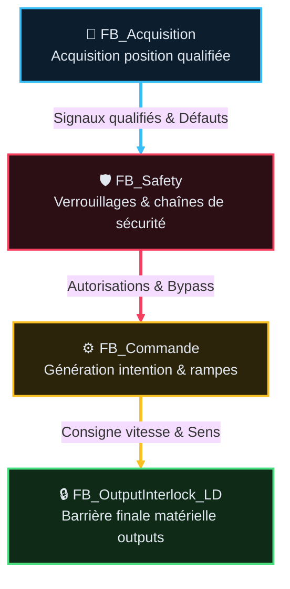

# 📐 Guide d'Édition des Analyses Fonctionnelles (AF) (v1.0)

> 📌 **Standard normatif d'ingénierie** pour la rédaction, le versionnement et la structuration des spécifications fonctionnelles sous `DOC/AF/`.
> Tout agent ou développeur modifiant une AF **doit** se conformer à ce guide.

---

## 📑 0. Sommaire (obligatoire)

Toute fiche AF **commence** par un sommaire (liens vers les `##`/`###` du document). Il est
**obligatoire** dès que la fiche dépasse 2 sections, et doit être **maintenu à jour** à chaque
ajout/retrait de section — un sommaire périmé est pire que pas de sommaire. Les titres de
paragraphe nomment la fonction traitée en clair (ex. `## 4. Homme-mort`, pas `## 4. Section
technique`) : le lecteur doit retrouver une fonction depuis le sommaire sans ouvrir le corps.

---

## 🎯 1. Rôle et périmètre (en-tête obligatoire)

Toute fiche AF doit commencer par un paragraphe **court, clair et synthétique (3-4 lignes max)** qui explique pourquoi ce document existe :

```markdown
# AF_Partie-XX : [Nom du Domaine / Fonction]

## 🎯 Rôle et périmètre
- **Rôle** : [Expliquer le besoin physique/opérateur résolu par la fonction]
- **Périmètre strict** : [Ce que la fonction fait / Ce qu'elle ne fait absolument pas]
- **Type de composant** : [Producteur d'intention / Brique E/S / Commande Mouvement / Safety]
```

> ⛔ **Ne pas y mettre l'historique** : versions archivées, notes de resynchronisation, corrections
> de profil, décisions passées — tout ça va dans `📜 Suivi historique` (§4bis), **jamais** dans
> `Rôle et périmètre` ni dans le chapô sous le titre H1. Ce paragraphe décrit **l'état actuel**
> uniquement ; le passé et les questions ouvertes ont chacun leur section dédiée en fin de fiche.

---

## 🛡️ 2. Philosophie des Modes & Sécurités Machine (ISO 13849)

> ⚠️ **Rester générique ici** : ce guide est un standard de rédaction, pas une spec projet. Ne pas
> y figer un nom de mode/variable propre à un projet donné (ex. un identifiant `MAINT_Nx` précis) —
> le nommage réel varie d'un projet à l'autre et vit dans le `NAMING_CONVENTION.md`/`AGENTS.md` du
> projet concerné. Ce guide décrit le **principe**, chaque AF instancie avec les noms réels.

### Règle d'or d'un mode de maintenance étendue (dérogation supervisée) :
- **Pas de déverrouillage automatique** : le simple basculement dans ce mode **ne désactive aucune sécurité par défaut**.
- Dans ce mode, l'automate se comporte comme en maintenance standard (toutes les sécurités, fins de course et anti-télescopages restent **100% actifs**).
- **Dérogation consciente & individuelle** : le bypass d'une sécurité spécifique (ex: dépassement FDC, désynchronisation d'axes) nécessite **deux conditions cumulées** :
  1. Être dans le mode de maintenance étendue du projet.
  2. Une **action volontaire IHM spécifique** (appui bouton dédié/maintien), journalisée et affichée à l'écran.

---

## 🎯 2bis. Table des fonctions (avant les Points de Validation)

> 📌 Catalogue **exhaustif** des fonctions du domaine, **placé avant** la section Table des
> Points de Validation (§3) : on liste d'abord ce que la machine doit faire, ensuite ce qui le prouve.
> Convention détaillée : voir le document `DESIGN_TABLE_FONCTIONS_AF` (actuellement archivé sous
> `DOC/WFLOW/AUDITS/PRG02_20260824/`, à terme dans les templates du workflow — dossier temporaire,
> ne pas figer de lien versionné dessus). Outillage d'extraction : script
> `extract_functions_matrix.py` (`TOOLS/AGENT_WORKFLOW/scripts/`) → matrice consolidée
> `af_traceability_matrix.yaml` (`TOOLS/AGENT_WORKFLOW/config/`).

| Colonne | Contenu |
|---|---|
| `ID` | `F<NN>.<seq>` — `NN` = numéro de Partie AF, `seq` = compteur plat `01`, `02`… (**pas-de-1**, volontairement différent du pas-de-10 des `TC-Pxx-nnn` §3 : une fonction est un catalogue **exhaustif figé à la rédaction** de l'AF, pas un flux qui grossit pendant une campagne de test comme les TC — pas besoin de marge d'insertion. Une fonction oubliée s'ajoute en fin de séquence plate (ex. `F08.09`), jamais insérée en pas-de-10) |
| `Fonction` | Nom court, verbe d'action |
| `Description` | 1-3 phrases complètes (toutes les conditions pertinentes citées) |
| `Réalisée par` | `FB` / `PRG` (câblage de collage) / `gate` (script de vérification) |
| `Criticité` | `C0`-`C4`, au cas par cas — **jamais héritée mécaniquement** du FB porteur (voir échelle ci-dessous) |
| `TC couvrants` | `TC-Pxx-nnn` associés — un TC n'apparaît que sur une seule fonction sauf note explicite |
| `Statut` | ✅/⚠️/❌ — manuel tant que l'outillage d'extraction n'est pas exécuté, sinon dérivé |

### 🎨 Échelle de criticité (identifier vite le risque machine/humain)

Même échelle et mêmes couleurs que `TASKS.yaml` / `TASK_VIEWER.html`, pour repérer d'un coup
d'œil les fonctions basiques des fonctions critiques ou de sécurité :

| Criticité | Sens | Repère couleur |
|---|---|---|
| 🔴 `C4` | Sécurité critique — AU, `PowerCutOff`, redondance, risque machine/humain direct | rouge |
| 🟠 `C3` | Majeur — mouvement, interlock, anti-collision | orange |
| 🔵 `C2` | Nominal métier — logique de commande sans risque direct | cyan |
| ⚪ `C1` | Standards / doc non-safety | gris |
| ⚪ `C0` | Format, typo | gris |

> Une fonction héritée d'un FB `C4` n'est pas automatiquement `C4` : une fonction de lecture pure
> (ex. acquisition brute) reste `C2` même portée par un FB par ailleurs safety — la criticité
> qualifie **l'effet de la fonction**, pas son porteur.

Exemple de référence : document `AF_Partie-08_Fonction_Joystick` §1 (8 fonctions, version active courante).

---

## 🧪 3. Table des points de validation (Cas de Test — TC)

### Règle des Identifiants (Immuabilité & Synthèse) :
1. **Numérotation Immuable** : `TC-P<Partie>-<Numéro>` (ex: `TC-P11-010`, `TC-P11-020`).
2. **ID 1 Ligne Stricte (Obligatoire)** : L'ID doit **toujours** être contenu sur 1 seule ligne (ne jamais broken/wrapper sur plusieurs lignes). Utiliser `<nobr><code>TC-Pxx-010</code></nobr>`.
3. **Incrémentation par pas de 10** (`010`, `020`, `030`) pour insérer des sous-cas sans casser la séquence.
4. **Non-réutilisation absolue** : Un ID supprimé ou obsolète n'est **jamais réutilisé** pour un autre test.
5. **Regroupement Macro (Pas de bruit)** :
   - Fini la démultiplication de micro-tests sur des détails ST internes.
   - **3 à 6 grands tests Macro maximum** par domaine AF.

### 📐 Formatage Ultra-Compact & Compacité Maximale du Tableau :
- **ID Unique (Cellules)** : Encadré par `<nobr><code>TC-Pxx-010</code></nobr>` (verrouillage mono-ligne strict).
- **Réf FB** : Écrire en police réduite (`<small>`) et **découper sur plusieurs lignes** (ex: `<small><code>FB_Modes</code><br><code>FB_Translation</code></small>`) pour compacter la colonne au minimum.
- **Intitulés de Colonnes Concis** : Préférer `<nobr>ID Unique</nobr>`, `Groupe`, `Comportement Attendu`, `<nobr>Type</nobr>`, `<nobr>Réf FB</nobr>` pour éviter les espaces inutiles.
- **Comportement Attendu (Hauteur & Densité)** : Formulations concises et denses (1 à 2 phrases ultra-courtes avec flèches `➔`) pour éviter d'étirer inutilement le tableau.

| <nobr>ID Unique</nobr> | Groupe | Comportement Attendu | <nobr>Type</nobr> | <nobr>Réf FB</nobr> |
|---|---|---|---|---|
| <nobr><code>TC-Pxx-010</code></nobr> | **[Nom Groupe]** | [Comportement physique et logique ultra-synthétique en 1-2 phrases] | <nobr><code>⚡ AUTO+SITE</code></nobr> | <small><code>FB_NomComposant1</code><br><code>FB_NomComposant2</code></small> |

---

## 🔄 3bis. Représentation du Flux de Données & Séquencement FB

> 🚩 **Décision (2026-08-25)** : les cartes HTML/SVG (ancienne version de ce paragraphe) sont
> **trop lourdes** à écrire/maintenir (40+ lignes pour 3 blocs) — remplacées par **Mermaid**
> comme format par défaut. Mermaid est déjà un format prouvé dans ce projet (rendu natif VS Code +
> GitHub, sans dépendance) : `GUIDE_SEQUENCEUR_v1.2.md` (`stateDiagram-v2`),
> `AF_Partie-07_Interface_IHM_v2.1.md` (`flowchart`).

### Format par défaut : `flowchart TD` (vertical)

**Vertical (`TD`), pas horizontal (`LR`)** : une page ne doit jamais forcer un lecteur à scroller
horizontalement — un flux vertical s'empile proprement quel que soit le nombre de blocs. Chaque
flèche porte le **flux de données transmis**, pas juste une ligne muette :



**Style obligatoire** (validé sur `AF_Partie-08_Fonction_Joystick_v2.3.md`) :
- `%%{init...}%%` en première ligne — thème `base`, sans quoi Mermaid applique son thème neutre
  terne par défaut (flèches grises fades).
- **Trait plein épais (`==>`)** = flux de **donnée** transformée entre blocs métier. **Pointillé
  (`-.->`)** = signal de **commande/permission** qui ne transite pas de calcul (ex. `Enable`,
  `ArmingPermit`, un bouton) — distinction visuelle immédiate donnée vs commande.
- `classDef` + `class` : chaque bloc coloré par domaine, **même palette que §3quater**
  (cyan `#38bdf8` acquisition, rouge `#f43f5e` sécurité, jaune `#fbbf24` commande/mouvement, vert
  `#4ade80` sortie/barrière finale) — fond sombre + bordure teintée, jamais de nœud gris par défaut.
- `linkStyle N` (index 0-based de l'arête dans l'ordre d'écriture) coloré selon le **bloc source**
  de l'arête — cohérence visuelle bloc→flèche.

Émoji du bloc = même dictionnaire que §3quater, cohérent avec le cartouche `.st` du FB.

### Alternative légère : tableau de flux vertical

Si même Mermaid est disproportionné pour un pipeline à 2-3 étapes simples (cas fréquent en
sous-fiche FB), un tableau suffit — même info, zéro rendu à vérifier :

| Étape | Bloc | Flux produit |
|---|---|---|
| 1 | 📡 `FB_Acquisition` | Signaux qualifiés & Défauts |
| 2 | 🛡️ `FB_Safety` | Autorisations & Bypass |
| 3 | ⚙️ `FB_Commande` | Consigne vitesse & Sens |
| 4 | 🔒 `FB_OutputInterlock_LD` | *(barrière finale, rien en aval)* |

Choix entre les deux formats : au jugement du rédacteur (nombre de blocs, présence de branches/
bypass qui justifient un vrai graphe Mermaid vs séquence strictement linéaire → tableau).

---

## ⏱️ 3ter. Chronogramme (état d'une variable dans le temps)

> Utile pour expliquer une séquence temporelle (armement, palier, homing...) sans mur de texte.
> **Tableau texte uniquement** — un vrai graphique créneaux/carrés (type WaveDrom) dépend d'un
> rendu JS non garanti dans tous les viewers Markdown ; ce format graphique reste dans les
> rapports `TEST_AUTO_CI` (HTML généré, lu au navigateur), jamais dans une fiche AF.

| Instant | `RawButton` | `DeadmanArmPending` | `DeadmanArmed` |
|---|---|---|---|
| t0 — repos | FALSE | FALSE | FALSE |
| t1 — appui bouton (↑) | TRUE ↑ | TRUE | FALSE |
| t2 — +100ms (`DeadmanArmHoldTime`) | TRUE | FALSE | **TRUE** |
| t3 — relâche (↓) | FALSE ↓ | FALSE | TRUE *(pas de reconfirmation)* |

Une ligne = un instant notable (front, expiration de tempo, changement d'état) — pas un pas de
temps fixe. Colonnes = signaux pertinents à la séquence, dans l'ordre où le lecteur les lira.
**Notation de front** : `↑` = front montant, `↓` = front descendant, collé à la valeur qui vient
de changer (`TRUE ↑`, `FALSE ↓`) — jamais de flèche textuelle ambiguë (`TRUE→`, `→FALSE`).

---

## 🏷️ 3quater. Dictionnaire des Émojis Standards & Cartouche ST

Pour assurer la lisibilité visuelle et supprimer tout risque de dérive entre les schémas AF et le code ST :

| Domaine Fonctionnel | Émoji | Couleur Bordure | Exemples de FB / POU |
|---|---|---|---|
| **Acquisition & Diag Device** | 📡 | Cyan (`#38bdf8`) | `FB_Translation_PositionDecoder`, `FB_Encoder_Abs`, `FB_Diag_Ethercat` |
| **Référencement & Homing** | 🎯 | Cyan (`#38bdf8`) | `FB_Encoder_Homing`, `FB_Encoder_Scale` |
| **Sécurité & Verrouillages** | 🛡️ | Rouge (`#f43f5e`) | `FB_Safety_Translation`, `FB_Safety_Winch`, `FB_Safety_EmergencyManagement` |
| **Mouvement & Commandes** | ⚙️ | Jaune (`#fbbf24`) | `FB_Translation`, `FB_Winch`, `PRG_04_Treuils_Benne` |
| **Barrière Finale Sorties** | 🔒 | Vert (`#4ade80`) | `FB_TranslationOutputInterlock`, `PRG_06_Outputs` |
| **Supervision & Dépannage** | 🖥️ / 🩺 | Bleu-Gris | `PRG_07_Supervision`, `FB_Acquisition_Preflight` |

- **Alignement Strict des Titres et Rôles** : Le nom du FB, la description de son rôle et l'émoji du cartouche `.st` doivent être **exactement identiques** à ceux présentés dans le tableau de composition de la spec AF (`DOC/AF/`).

---

## 🧱 4. Structure d'un Dossier AF

### 🏷️ Légende des émoji de section (fixe, ne pas varier d'une fiche à l'autre)

| Émoji | Section | Émoji | Section |
|---|---|---|---|
| 📑 | Sommaire | 📜 | Suivi historique |
| 🎯 | Rôle et périmètre (+ Table des fonctions) | ❓ | TBD (À définir) |
| 🧪 | Table des points de validation (TC) | 📚 | Documents liés |
| 🔄 | Pipeline et composition | 🔌 | Interface publique |
| 🖥️ | IHM, Configuration & Dépannage | | |

Un émoji identifie **le type de section**, pas la fiche : `🔄 Pipeline et composition` porte le
même émoji sur toutes les AF, exactement comme `🧪` identifie toujours les points de validation.
Ne pas en inventer un nouveau par fiche.

### Trame canonique d'une fiche `AF_Partie-XX_*.md`

Ordre attendu (adapter le libellé au domaine, garder l'ordre et l'émoji) :

1. `📑 Sommaire` (§0)
2. `🎯 Rôle et périmètre` (§1, inclut la `Table des fonctions` §2bis) — état actuel seulement, voir règle §1
3. `🧪 Table des points de validation (Cas de Test — TC)` (§3)
4. `🔄 Pipeline et composition` — schéma/diagramme du flux de données et des FB traversés (§3bis)
5. `🔌 Interface publique` — **table des entrées** et **table des sorties** (nom, type, unité, rôle)
6. Paragraphes de détail par fonction — libre, un paragraphe par comportement notable (homme-mort, calibration, défauts, intégration programme, alertes...). **Si la fiche porte une Table des fonctions (§2bis)**, le titre de chaque paragraphe référence le(s) code(s) `F<NN>.<seq>` qu'il couvre, entre parenthèses (ex. `## 5. Homme-mort (F08.03, F08.04)`) — le lecteur retrouve depuis le sommaire quelle fonction du catalogue est traitée où, sans deviner. Un paragraphe qui ne couvre aucune fonction du catalogue (ex. Suivi historique, TBD) n'en porte pas.
7. `🖥️ IHM, Configuration & Dépannage` — section groupée recommandée (famille Fonctions métier) :
   contrat IHM (`Cmd`/`State`), réglages (`Cfg` s'il existe, ou table réglage/persistance/réglable-
   IHM sinon), `Bypass` (même produit ailleurs — dire ce qu'il masque et où il vit réellement) et
   **un pointeur** (pas une duplication) vers la fiche de dépannage chronologique (AF14,
   `GVL_Troubleshooting.XXX`). 🚫 **La simulation n'y entre pas** : elle vit dans `Pipeline et
   composition` (§4, production du geste/mesure réel vs simulé) ou dans AF13 — l'AF décrit le
   fonctionnement machine réel destiné à l'exploitation, la simulation est un outil de mise en
   service pour l'équipe technique, pas une exigence métier au même niveau. Squelette :
   `DOC/WFLOW/TEMPLATE/AF_SPEC_TEMPLATE.md §6`. Décision T156 (2026-08-25), première application :
   `AF_Partie-08_Fonction_Joystick_v2.2.md §8`.
8. `📜 Suivi historique` — chronologie factuelle : versions archivées, resynchronisations
   doc↔code, corrections de profil, décisions tranchées et leur date. C'est ici, **pas** dans
   `Rôle et périmètre` ni sous le titre H1, que vit tout ce qui est daté/révolu. Facultatif si la
   fiche n'a encore aucun historique.
9. `❓ TBD (À définir - To Be Define)` — **paragraphe unique, listing court** des points ouverts et
   questions **non tranchées**. Pas de détail ici — le détail d'une question ouverte connue vit
   dans le corps (§6/§7) ou en `Suivi historique` une fois tranchée ; ce paragraphe ne liste que
   « quoi trancher », pas « pourquoi ». Facultatif si la fiche n'a aucun point ouvert.
10. `📚 Documents liés` — table des documents référencés ou référençant cette fiche. **Obligatoire même vide** : garder le paragraphe et écrire « aucun » plutôt que de le supprimer.

### Répartition chapô / sous-fiches (anti-duplication)

- **Chapô principal (`AF_Partie-XX_*.md`)** : porte le résumé machine, l'intégration programme et le **Catalogue Synthétique des TC Macro**.
- **Fiches FB sous-dossier (`AF_Partie-XX_*/FB_*.md`)** : si un détail technique est nécessaire, il décline sous forme d'étapes `TC-Pxx-010.1`, `TC-Pxx-010.2` sans inventer de nouveaux identifiants racine. Squelette : `DOC/WFLOW/TEMPLATE/FB_SPEC_TEMPLATE.md`.
- ⛔ **Jamais les deux à la fois** : soit le détail complet d'une fonction vit **uniquement** dans le
  chapô (pas de sous-fiche FB pour ce domaine), soit le chapô ne garde qu'un **squelette** qui
  renvoie vers la fiche FB détaillée. Dupliquer le détail des deux côtés rend les mises à jour
  ingérables — une info corrigée d'un côté et oubliée de l'autre devient une source d'erreur.

---

## 🗂️ 5. Familles de fiches AF (quelle section pour quelle AF)

> 📌 Toutes les AF ne se ressemblent pas — inutile de forcer un moule unique. Trois familles,
> reprises du plan de numérotation (`AGENTS.md`) : **1-3 Fondations** (vue machine, architecture
> programme, contrats composants — méta, pas de FB unique), **4-7 Transverses** (Cycle/Modes/E-S/
> IHM — domaine partagé par plusieurs FB), **8+ Fonctions métier** (une AF = un domaine/FB,
> ex. AF-08 Joystick). Un seul guide, une applicabilité par famille — pas trois documents qui
> divergent avec le temps (cf. leçon `CLAUDE.md`/`AGENTS.md` de ce projet).

| Section (§4) | 🏛️ Fondations (01-03) | 🔀 Transverses (04-07) | 🔧 Fonctions métier (08+) |
|---|---|---|---|
| Sommaire | ✅ | ✅ | ✅ |
| Rôle et périmètre | ✅ (périmètre machine/architecture) | ✅ | ✅ |
| Table des fonctions | ❌ (pas de découpage F<NN>.<seq> pertinent) | recommandé si la fiche décrit plusieurs comportements | ✅ obligatoire |
| Table des points de validation (TC) | ✅ si la fiche a des invariants vérifiables | ✅ | ✅ |
| Pipeline et composition | selon pertinence | ✅ | ✅ |
| Interface publique (Entrées/Sorties) | ❌ (pas de FB unique à interfacer) | selon domaine | ✅ |
| Suivi historique | ✅ | ✅ | ✅ |
| TBD | ✅ | ✅ | ✅ |
| Documents liés | ✅ | ✅ | ✅ |

Squelette prêt à copier pour la famille **Fonctions métier** (la plus fréquente, pilotée par
AF-08) : `DOC/WFLOW/TEMPLATE/AF_SPEC_TEMPLATE.md`. Pour Fondations/Transverses, partir du même
squelette et retirer les sections marquées ❌ ci-dessus.
