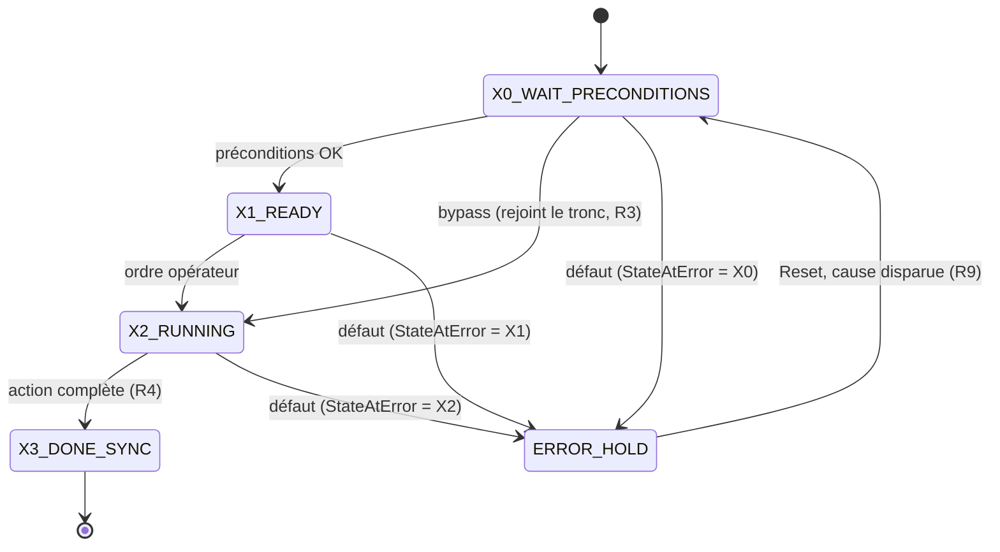

# 🔄 Guide d'Écriture des Séquenceurs & Fronts (v1.2)

## 🎯 Raison d'être & Responsabilité Unique
- **Problème résolu** : trois écritures de machine à état coexistaient sans règle commune
  (`CASE`+enum avec label texte, `E_State` générique + tempos ad hoc, `E_Diag_State`) — en essai,
  une tempo bloquante n'a pas de repère uniforme et un enum ne dit pas son rang sans rouvrir la
  déclaration.
- **Périmètre strict** : comment écrire un séquenceur ST (`CASE`+enum) et centraliser un front.
  Ne redéfinit pas le contrat FB standard (`AF_Partie-03`) ni la casuistique métier de chaque
  domaine.
- **Type de composant** : guide pratique, compagnon normatif de
  [`CODE_QUALITY_STANDARDS.md §11bis`](../CODE_QUALITY_STANDARDS.md#11bis-séquenceurs-et-machines-à-état-rex-2026-08-12)
  (règles R1-R9) — ce document montre **comment** les appliquer, il ne les redéfinit pas.

> Origine : réflexion terrain 2026-08-12 (fronts dupliqués, pas de convention d'écriture de
> séquence, tempos bloquantes non identifiables en mise en service).

---

## 🧭 Sommaire

| <nobr>§</nobr> | Contenu |
|---|---|
| <nobr>1</nobr> | Pourquoi ce guide |
| <nobr>2</nobr> | Vue d'ensemble (diagramme) |
| <nobr>3</nobr> | Squelette d'une séquence (R1, R2, R2bis) |
| <nobr>4</nobr> | Graphe linéaire (R3) |
| <nobr>5</nobr> | Étape de synchronisation finale (R4) |
| <nobr>6</nobr> | Initialisation (R8) |
| <nobr>7</nobr> | Cas de repli — `StateAtError` (R9) |
| <nobr>8</nobr> | Tempo scaffold par transition (R5) |
| <nobr>9</nobr> | Fronts — centralisation (R6) et `FB_Edge` (R7) |
| <nobr>10</nobr> | Checklist rapide |
| <nobr>11</nobr> | Glossaire |

---

## 🎯 1. Pourquoi ce guide

Trois écritures de machine à état coexistaient dans le code sans règle commune : `CASE`+enum
avec label texte (`FB_Cycle`), `E_State` générique + tempos internes ad hoc nommées au cas par
cas (`FB_Winch`), `E_Diag_State` (`FB_Diag_*`). Résultat en essai : une tempo qui bloque une
transition (ex. `DirectionChangeDelay`, `StabilizationTimer`) n'a pas de repère visuel uniforme,
et un enum comme `E_DiveSearchState` (`WAIT_PRECONDITIONS`, `READY_TO_DESCEND`...) ne dit pas son
rang dans la séquence sans rouvrir la déclaration.

Ce guide fige une seule façon d'écrire : `CASE` sur enum, label numéroté, graphe linéaire,
étape de synchronisation finale, initialisation standard, mémorisation de l'étape en défaut,
tempo scaffold par transition, fronts centralisés.

---

## 🗺️ 2. Vue d'ensemble



Graphe linéaire (R3) avec un bypass qui rejoint le tronc, une étape de synchronisation finale
(R4), et un état `ERROR_HOLD` atteignable depuis n'importe quelle étape — la spécifique est
mémorisée dans `StateAtError` avant la bascule (R9, §7).

---

## 🧱 3. Squelette d'une séquence (R1, R2, R2bis)

```pascal
TYPE E_MaSequenceState :
(
    X0_WAIT_PRECONDITIONS := 0, (* 🅧0 — attente conditions initiales *)
    X1_READY               := 1, (* 🅧1 — prêt, attend ordre opérateur *)
    X2_RUNNING              := 2, (* 🅧2 — action en cours *)
    X3_DONE_SYNC             := 3, (* 🅧3 — synchronisation finale (R4) *)
    ERROR_HOLD               := 4  (* défaut, hors chronologie normale *)
);
END_TYPE
```

- **Brouillon (R2bis)** : si la séquence n'est pas encore stabilisée, nommer les littéraux
  `X0`, `X1`, `X2`… tels quels. Renommer en sémantique (`WAIT_PRECONDITIONS`…) dès que la
  structure se fixe — mais **toujours en gardant le numéro dans le label runtime** (R2, ci-dessous).
- `ERROR_HOLD` n'est jamais numéroté dans la chronologie : ce n'est pas une étape du graphe
  normal, c'est un état d'arrêt sûr.

### Label runtime (R2) — numéro + texte, toujours ensemble

```pascal
CASE State OF
    E_MaSequenceState.X1_READY:
        StateStr := 'X1 - Prêt : demander le lancement.';
        Ready := TRUE;
        IF StartEdge.Q THEN
            State := E_MaSequenceState.X2_RUNNING;
        END_IF;
END_CASE;
```

❌ `StateStr := 'Prêt : demander le lancement.';` — pas de repère de rang, illisible en debug
sans rouvrir l'enum.
✅ `'X1 - Prêt : ...'` — chronologie visible au premier coup d'œil, sur l'IHM comme en Watch.

---

## 🔀 4. Graphe linéaire (R3)

Une séquence FB = une chaîne d'étapes ordonnées. Un saut qui **rejoint le tronc plus loin** est
autorisé (ex. bypass de préconditions déjà validées) :

```pascal
E_MaSequenceState.X0_WAIT_PRECONDITIONS:
    StateStr := 'X0 - Attente préconditions.';
    IF BypassPreconditions THEN
        State := E_MaSequenceState.X2_RUNNING; // saut direct, rejoint le tronc
    ELSIF PreconditionsOk THEN
        State := E_MaSequenceState.X1_READY;   // chemin normal
    END_IF;
```

❌ Interdit : une étape qui peut être atteinte depuis **deux directions différentes** avec des
préconditions distinctes non réconciliées (fourche réelle) — décomposer en sous-graphe FB séparé
plutôt que complexifier un seul `CASE`.

---

## 🏁 5. Étape de synchronisation finale (R4)

Le dernier état du `CASE` est **nommé et documenté** comme point d'intégration officiel — pas un
bit `Done` isolé :

```pascal
E_MaSequenceState.X3_DONE_SYNC:
    StateStr := 'X3 - Séquence complète : prêt pour la fonction suivante.';
    Done := TRUE;
    // Ce que d'autres FB consomment pour démarrer : DoneSyncOutput, pas seulement Done.
```

Exemple réel déjà conforme : `E_DiveSearchState.BOTTOM_CONFIRMED` (`FB_DiveSearch`) — dernier
état nommé, utilisé par `FB_ExtractionSequence` comme condition d'entrée.

---

## 🚦 6. Initialisation (R8)

Toute séquence commence par une porte d'entrée, **avant** le `CASE`, qui neutralise le FB et
ramène l'état à la **première** étape — jamais une étape intermédiaire :

```pascal
IF NOT Enable OR NOT PowerContactorEngaged THEN
    // Sorties sûres — tout ce qui commande un mouvement/une sortie à FALSE/0
    Ready := FALSE; Busy := FALSE; Done := FALSE;

    // Retour à la PREMIÈRE étape du graphe, jamais un état intermédiaire
    State := E_MaSequenceState.X0_WAIT_PRECONDITIONS;
    StateStr := 'X0 - Désactivé.';
    RETURN;
END_IF;
```

- Ce pattern est déjà systématique dans le code existant (`FB_DiveSearch`, `FB_ExtractionSequence`,
  `FB_Cycle`…) — ce guide le rend **normatif**, pas seulement une habitude constatée.
- `RETURN` immédiat : aucune logique de séquence n'est évaluée tant que la porte est fermée.
- Ne jamais initialiser sur `ERROR_HOLD` : une perte d'`Enable` n'est pas un défaut, c'est une
  neutralisation — l'étape de reprise après réactivation est toujours `X0`.

---

## 🧭 7. Cas de repli — mémoriser l'étape en défaut (R9)

**Trou identifié dans le code existant** : `FB_DiveSearch`/`FB_ExtractionSequence` exposent un
`StateAtError : E_State` (générique — `READY`/`BUSY`/`DONE`), mais **aucune trace de l'étape
spécifique** (`DiveState`/`ExtractionState`) au moment du défaut. Une fois basculé en
`ERROR_HOLD`, impossible de savoir sur quelle étape le défaut est apparu sans avoir suivi le
Watch en direct pendant l'essai.

**Règle** : chaque séquence expose un champ dédié qui mémorise l'étape **spécifique** (pas le
`E_State` générique) au moment de l'apparition du défaut, capturé **avant** la bascule vers
`ERROR_HOLD` :

```pascal
VAR_OUTPUT
    ...
    StateAtError : E_MaSequenceState; // étape spécifique au moment du défaut — pas E_State générique
END_VAR
VAR
    ErrorEdge : R_TRIG;
END_VAR

ErrorEdge(CLK := Error);
IF ErrorEdge.Q THEN
    StateAtError := State; // capturé AVANT la bascule ci-dessous — sinon on capture ERROR_HOLD lui-même
END_IF;

IF ErrorId <> 16#0000 THEN
    State := E_MaSequenceState.ERROR_HOLD;
END_IF;
```

- **Nommage** : `<StateField>AtError`, ex. `DiveStateAtError : E_DiveSearchState`,
  `ExtractionStateAtError : E_ExtractionSequenceState`, `CycleStepAtError : E_CycleStep`.
- **Ordre critique** : la capture (`ErrorEdge.Q`) doit s'exécuter **avant** l'affectation qui
  bascule `State` vers `ERROR_HOLD`, sinon `StateAtError` mémorise `ERROR_HOLD` au lieu de
  l'étape réelle.
- ⚠️ Chantier différé (pas touché par ce guide, qui ne modifie pas `CODE/`) : ajouter
  `DiveStateAtError`/`ExtractionStateAtError` à `FB_DiveSearch`/`FB_ExtractionSequence` dans un
  lot dédié.

---

## ⏱️ 8. Tempo scaffold par transition (R5)

Chaque bloc de test de transition reçoit un `TON` prêt à l'emploi, commenté avec la transition
qu'il garde :

```pascal
E_MaSequenceState.X2_RUNNING:
    StateStr := 'X2 - Action en cours.';
    Busy := TRUE;

    // X2→X3 : dwell mini 20ms avant d'évaluer la fin d'action (filtre rebond mécanique)
    X2ToX3Ton(IN := (State = E_MaSequenceState.X2_RUNNING), PT := T#20ms);
    IF X2ToX3Ton.Q AND ActionComplete THEN
        State := E_MaSequenceState.X3_DONE_SYNC;
    END_IF;
```

- Usage 1 — **dwell** : le `TON` mesure le temps passé dans l'étape courante (`IN := State = ...`),
  la transition n'est évaluée qu'une fois le délai écoulé.
- Usage 2 — **anti-rebond sur un front** : le `TON` garde un signal de niveau avant de
  considérer le front comme valide, en complément (pas en remplacement) d'un `R_TRIG`/`F_TRIG`
  quand un vrai événement ponctuel existe :

```pascal
// Le front n'est considéré qu'une fois la condition stable depuis FilterDelay
StableTon(IN := RawCondition, PT := FilterDelay);
IF StableTon.Q THEN
    ConditionEdge(CLK := TRUE); // ou toute logique de transition dépendante
END_IF;
```

Le `TON` est déclaré même si la transition n'en a finalement pas besoin — coût négligeable,
évite d'avoir à le créer sur le chantier en essai.

---

## 🔌 9. Fronts — centralisation (R6) et `FB_Edge` (R7)

### Où vit un front ?

| <nobr>Consommateurs</nobr> | Où | Exemple |
|---|---|---|
| <nobr>1 seul FB</nobr> | Local au FB (`R_TRIG`/`F_TRIG` en `VAR`) | <small><code>ResetEdge</code><br><code>ConfirmOpenEdge</code> (`FB_Bucket`)</small> |
| <nobr>≥ 2 FB</nobr>, entrée matérielle/simu ou commande IHM `Cmd` | Centralisé `PRG_02_Acquisition`, jamais `PRG_07_Supervision` (lecture seule stricte) | voir doublon ci-dessous |

⚠️ Doublon connu, à corriger dans un lot dédié (pas dans ce guide, qui ne modifie pas `CODE/`) :
`ConfirmOpenPosition`/`ConfirmClosePosition` (bouton IHM référencement benne) est aujourd'hui
détecté en front **deux fois** — une fois dans `PRG_02_Acquisition` (`M2BucketRefOpenEdge`), une
fois dans `FB_Bucket` (`ConfirmOpenEdge`), sur le même bouton. Autres candidats identifiés :
`M1_M2_KoboldContactFond_DI` (3 détections indépendantes) et les 5 capteurs position translation
(`FB_Translation_PositionEstimator` + `FB_Translation_PositionDecoder`, doublon complet).

### `FB_Edge` — squelette

```pascal
FUNCTION_BLOCK PUBLIC FB_Edge
VAR_INPUT
    InputRaw : BOOL; // Valeur déjà qualifiée (HwIn ou GVL_IHM.*.Cmd)
END_VAR
VAR_OUTPUT
    R : BOOL; // Front montant (Rising)
    F : BOOL; // Front descendant (Falling)
END_VAR
VAR
    RTrig : R_TRIG;
    FTrig : F_TRIG;
END_VAR

RTrig(CLK := InputRaw);
FTrig(CLK := InputRaw);
R := RTrig.Q;
F := FTrig.Q;
```

Instanciation dans `PRG_02_Acquisition`, une entrée qualifiée = une instance :

```pascal
// VAR
instEdgeM1ContactorsReleased   : FB_Edge;

// Corps
instEdgeM1ContactorsReleased(InputRaw := HwIn.Winch.M1_ContactorsReleased_DI);
// Consommateurs : instEdgeM1ContactorsReleased.R / .F
```

Pas de paramètre d'activation — toujours actif, coût CPU négligeable (même ordre de grandeur qu'un `TON`).

⚠️ `FB_Edge` ≠ `FB_Input` (composant historique en retrait, `AF_Partie-06`). Rôle différent
(front, pas diagnostic canal `ChannelOk`), nom délibérément distinct.

---

## ✅ 10. Checklist rapide avant de restituer un séquenceur

```text
[ ] CASE sur enum unique, aucun SET/RESET par étape (R1)
[ ] Label runtime "Xn - texte" sur chaque étape (R2)
[ ] Graphe linéaire ou sous-graphes linéaires, sauts uniquement vers le tronc (R3)
[ ] Dernière étape = synchronisation finale nommée et documentée (R4)
[ ] TON scaffold commenté "Xi→Xj : ..." sur chaque bloc de transition (R5)
[ ] Fronts à consommateur unique restent locaux ; fronts partagés vérifiés dans PRG_02_Acquisition (R6/R7)
[ ] Porte d'initialisation en tête de FB, retour à la première étape, RETURN immédiat (R8)
[ ] <Champ>AtError mémorise l'étape spécifique, capturé avant bascule ERROR_HOLD (R9)
```

---

## 📖 11. Glossaire

| Terme | Sens |
|---|---|
| <nobr><code>CASE</code>+enum</nobr> | Machine à état où une seule variable enum porte l'étape active — exclusivité mutuelle garantie par le compilateur (R1) |
| <nobr>Label runtime</nobr> | Texte affiché en IHM/Watch pour l'étape courante, toujours préfixé `Xn -` (R2) |
| <nobr>Gabarit <code>X0..Xn</code></nobr> | Nommage brouillon des littéraux enum avant stabilisation de la séquence (R2bis) |
| <nobr>Graphe linéaire</nobr> | Séquence sans fourche réelle ; les sauts autorisés rejoignent toujours le tronc (R3) |
| <nobr>Synchronisation finale</nobr> | Dernière étape nommée du `CASE`, point d'intégration officiel pour les FB avals (R4) |
| <nobr>Porte d'initialisation</nobr> | Bloc `IF NOT Enable OR ...` en tête de FB, retour à la première étape (R8) |
| <nobr><code>StateAtError</code></nobr> | Champ qui mémorise l'étape spécifique (pas `E_State` générique) au moment du défaut (R9) |
| <nobr><code>TON</code> scaffold</nobr> | Temporisateur pré-déclaré sur chaque transition, utilisé ou non (R5) |
| <nobr><code>FB_Edge</code></nobr> | FB générique front montant/descendant (`.R`/`.F`), une instance par entrée qualifiée (R7) |
| <nobr>Front centralisé</nobr> | Détection de front à la source unique quand ≥ 2 FB consomment le même signal (R6) |

---

## 📚 Documents liés

- [`CODE_QUALITY_STANDARDS.md §11bis`](../CODE_QUALITY_STANDARDS.md) — règles normatives R1-R9.
- [`NAMING_CONVENTION.md`](../NAMING_CONVENTION.md) — nommage des instances (`inst<Rôle>`), suffixes `_DI`/`_DQ`.
- `AF_Partie-02_Architecture_Programme_v3.1.md §5` — `PRG_07_Supervision` lecture seule stricte.
- `AF_Partie-14_Fonction_Troubleshooting_v1.1.md` — invariant troubleshooting lecture seule.
- Exemples de code déjà conformes (R1-R4, R8) : `CODE/G_CYCLE/FB_Cycle.st`, `CODE/G_CYCLE/FB_DiveSearch.st`, `CODE/G_CYCLE/FB_ExtractionSequence.st`.
