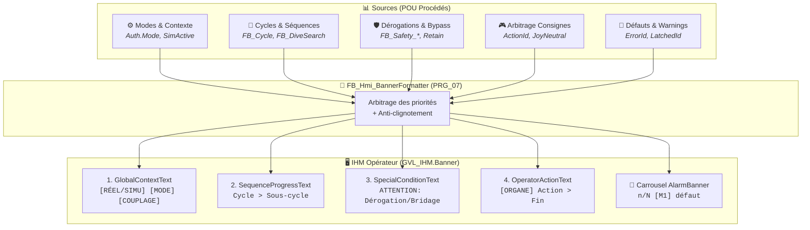

# DESIGN — Bandeau IHM à 3 niveaux (défaut / blocage / guidage + marqueur [HISTO])

> **Statut** : ✅ **Implémenté** — lot `BANDEAU-TRI-HISTO`
> (contrat [`TASK_CONTRACT_BANDEAU_TRI_HISTO.md`](../../CONTRACTS/TASK_CONTRACT_BANDEAU_TRI_HISTO.md)).
> **Date** : 2026-09-01 · **Auteur** : DSH (DeepSeek)
> **Sources** : `CODE/J_SUPERVISION/FB_Hmi_BannerFormatter.st` · `DOC/AF/AF_Partie-07_Interface_IHM_v2.3.md` (§5, §6)
> **Contexte** : une revue a challengé le design 3 niveaux contre le code actuel → **verdict MAJOR**.
> Cette fiche documente le design, les risques identifiés et les décisions utilisateur (2026-09-01)
> qui ont conduit à l'implémentation du lot `BANDEAU-TRI-HISTO`.

---

## 1 · Objectif

Distinguer **3 familles sémantiques** d'information et les répartir sur les bons champs du bandeau,
pour que l'opérateur voie **immédiatement** ce qui bloque, ce qui guide, et ce qui est passé :

| Niveau | Famille | Champ cible | Exemple |
|---|---|---|---|
| **1** | **Défaut actif bloquant** (ErrorId-based) | Carrousel alarme (§5) | `[M1] MecaA - deplacement sans commande` |
| **2** | **Info de blocage / guidage non bloquant** | `SpecialConditionText` (§3) | `Ouvrir la benne`, `Limite haute` |
| **3** | **Défaut latched passé encore affiché** | Préfixe `[HISTO]` | `[HISTO] [M1] surchauffe moteur` |

**But** : ne plus mélanger un défaut bloquant (à acquitter) et un simple guidage (à suivre) dans le
même champ, et rendre visible un défaut **latched** (cause disparue mais non acquittée).

---

## 2 · Architecture actuelle (constat code)

`FB_Hmi_BannerFormatter` assemble **4 champs fixes** + **1 carrousel rotatif**. Références exactes :

| Champ | § | Lignes | Rôle actuel |
|---|---|---|---|
| `GlobalContextText` | §1 | 193–225 | Contexte `[RÉEL/SIMU] [MODE] [COUPLAGE]` |
| `SequenceProgressText` | §2 | 227–278 | Étape cycle / homing / manuel |
| `SpecialConditionText` | §3 | 280–305 | **Mono-slot** : 1 seul bypass/dérogation/bridage |
| `OperatorActionText` | §4 | 307–562 | Cause fixe, sécurité d'abord, sans rotation |
| `AlarmBanner` (carrousel) | §5 | 564–856 | Tous défauts/warnings actifs, rotation 1/N |

### 2.1 `SpecialConditionText` — mono-slot (§3, l. 280–305)

- **L. 288–301** : chaîne `IF/ELSIF` → **un seul** `SpecialConditionCandidate` :
  `Bypass actif` > `Synchro bridée` > `Limite légale`. Si plusieurs conditions, **seule la première
  s'affiche, les autres sont masquées**.
- **L. 303** : `AntiFlickSpecial(NewText := SpecialConditionCandidate, ForceInstant := FALSE, ...)`
  → **jamais critique**, toujours maintenu min 500 ms (anti-clignotement).
- **L. 304** : `Banner.SpecialConditionText := AntiFlickSpecial.Text;`

### 2.2 `OperatorActionText` — cause fixe (§4, l. 307–562)

- **L. 430–552** : grande chaîne de priorité `IF/ELSIF` (AU → E/S → bus → abandon AU → coupure →
  SafeStop → `DirectionBlocked` → guidage cycle → guidage manuel).
- **L. 556–558** : `PowerOrChainFault`, `HardwareModuleOrBusFault`, `CriticalActionActive :=
  (PowerOrChainFault OR HardwareModuleOrBusFault OR SafeStopActive OR DirectionBlocked)`.
- **L. 560–561** : `AntiFlickOperator(NewText := OperatorActionCandidate, ForceInstant :=
  CriticalActionActive, ...)` → les causes critiques passent **immédiatement** (pas de maintien).

### 2.3 Carrousel d'alarmes (§5)

> ✅ **Implémenté (lot `BANDEAU-TRI-HISTO`)** : le carrousel est désormais **trié** — il ne publie
> que les **défauts actifs bloquants** (SafeStop / PowerCutOff / interlock), plus les défauts
> **latched passés** marqués `[HISTO]`. Les warnings non bloquants (ex. `[M1] mou de câble`,
> `[M1] surchauffe moteur`) n'y figurent plus.

- **Collecte** : défauts actifs **bloquants** uniquement (SafeStop / PowerCutOff / interlock) —
  plus les défauts latched passés `[HISTO]` (M1/M2/M3).
- **Rotation** : un message à la fois, maintien `AlarmHoldTime` (déf. `T#1s`).
- **`HasAlarm`** : restreint aux défauts bloquants (décision Q2).
- **`Text`** : préfixé `n/N` + code `ErrorID` (ex. `1/2 [M1] ErrorID:08 - MecaA`).
- **`Index`** (1-based), `Count`.

---

## 3 · Design cible (répartition 3 niveaux)

| Niveau | Famille | Champ | Règle de placement |
|---|---|---|---|
| **1** | Défaut actif **bloquant** | Carrousel alarme (§5) | `ErrorId` actif **et** bloquant (SafeStop / PowerCutOff / interlock) |
| **2** | **Blocage** non bloquant + **guidage** | `SpecialConditionText` (§3) | `Ouvrir la benne`, `Limite haute`, `Attendre fin Dive`, guidages cycle |
| **3** | Défaut **latched** passé | Préfixe `[HISTO]` | bit `LatchedId` **AND NOT** bit `ErrorId` actif |

**Principe directeur** : un **défaut bloquant** reste dans le carrousel (et/ou `OperatorActionText`
pour les critiques), un **blocage/guidage** va dans `SpecialConditionText`, un **défaut passé
latched** est marqué `[HISTO]`.

### 3.1 Diagramme d'interaction & priorités



**Priorités (AF-07 §5.3)** :

| Priorité | Message | Champ | Affichage |
|---|---|---|---|
| **1** | Défaut AU / puissance / SafeStop | `OperatorActionText` | **Immédiat** (ForceInstant) |
| **2** | `DirectionBlocked` (mouvement bloqué) | `OperatorActionText` | **Immédiat** (défaut critique) |
| **3** | Warning / état | `OperatorActionText` + `SpecialConditionText` | Maintien 500 ms |
| **4** | Contexte / cycle | `GlobalContextText` + `SequenceProgressText` | Continu |
| **5** | Tous défauts/warnings actifs | **Carrousel** `AlarmBanner` | Rotatif 1 s |

### 3.2 Exigence — messages avec `ErrorID`

> **Décision opérateur (2026-09-01)** : les messages d'alarme doivent **contenir le code
> `ErrorID`** pour que l'opérateur voie immédiatement le défaut (ex. `ErrorID:08`), sans ouvrir le
> journal. Conforme à AF-07 §5.2 (« les alarmes restent publiées dans `Error`/`ErrorId` »).

| Champ | Exigence |
|---|---|
| **Carrousel** `AlarmBanner` | Chaque message préfixé du code : `n/N [M1] ErrorID:08 - MecaA` |
| **`OperatorActionText`** (défauts) | Inclure le code : `[PUPITRE] Défaut #08 (étape X) - acquitter` |
| **`SpecialConditionText`** (blocages) | Optionnel : `ATTENTION: Limite haute (ErrorID:05)` |

---

## 4 · Marqueur `[HISTO]` (défaut latched passé)

### 4.1 Principe de calcul

Un défaut est **latched passé** quand son bit est **encore laté** mais **plus actif** :

```text
[HISTO] bit i  ⇔  (LatchedId bit i = 1)  AND  (ErrorId bit i = 0)
```

- **Entrées** : `LatchedId : WORD` par domaine (même mapping de bits que `ErrorId`) — exposé pour
  M1/M2/M3 depuis le lot `BANDEAU-TRI-HISTO` (décision Q3/M6).
- **Collecte** : pour chaque bit, `(LatchedId AND NOT ErrorId)` → message préfixé `[HISTO]`.
- **Affichage** : dans le carrousel (§5) en complément des défauts actifs (décision Q1).

### 4.2 Limites (constat code → levées par le lot `BANDEAU-TRI-HISTO`)

| Domaine | Vue latched disponible ? | Source |
|---|---|---|
| Benne / Synchro / Plongée / Extraction / AU / Cycle | ✅ `Fault.LatchedId` (via `FB_FaultCore`) | `ST_Fault.st:22` |
| **M1 / M2 / M3** | ✅ **Exposée depuis le lot `BANDEAU-TRI-HISTO`** (décision Q3/M6) | `ST_SafetyWinch.st` & `ST_SafetyTranslation.st` : `LatchedId` |

- **Avant** : `ST_SafetyWinch` / `ST_SafetyTranslation` n'exposaient que `ErrorId` + bits actifs ;
  le latch vivait en interne de `FB_Safety_Winch` / `FB_Safety_Translation` — non publié.
- **Depuis le lot `BANDEAU-TRI-HISTO`** : les DUT safety exposent `LatchedId` (décision Q3/M6),
  ce qui rend `[HISTO]` possible pour M1/M2/M3.

---

## 5 · Risques identifiés (revue MAJOR)

| # | Risque | Constat code | Impact |
|---|---|---|---|
| **R1** | **Mono-slot `SpecialConditionText` (masquage)** | §3 l. 288–301 : 1 seul candidat, les autres masqués | Si on y déplace blocages + guidages, un blocage critique peut être masqué par un guidage bénin |
| **R2** | **Perte d'affichage immédiat (`ForceInstant`)** | §3 l. 303 : `ForceInstant := FALSE` (maintien 500 ms) | Un blocage critique déplacé vers `SpecialConditionText` perd l'affichage direct (latence 500 ms) |
| **R3** | **Régression sécurité (carrousel rotatif vs champ fixe)** | §5 l. 822–856 : rotation 1/N, `T#1s` | Un défaut bloquant **uniquement** dans le carrousel peut ne pas être visible à l'instant où l'opérateur regarde (rotation) — le champ fixe `OperatorActionText` garantit la visibilité permanente |
| **R4** | **Sémantique `HasAlarm`** | §5 l. 841 : `HasAlarm := TRUE` dès `AlarmCount > 0` | Si le carrousel ne porte plus que les défauts bloquants, `HasAlarm` ne reflète plus « au moins un défaut/warning actif » (AF-07 §6) — changement de contrat IHM |
| **R5** | **Carrousel non uniforme** | §5 l. 572–820 : mélange sévérités sans distinction | Impossible de trier « bloquant » vs « warning » sans ajouter un champ de sévérité par message |

---

## 6 · Modifications proposées (implémentées par le lot `BANDEAU-TRI-HISTO`)

| # | Proposition | Statut |
|---|---|---|
| **M1** | **Ajouter entrées `LatchedId : WORD`** par domaine (Benne/Sync/Dive/Extraction/AU/Cycle) | ✅ Implémenté (M1/M2/M3) |
| **M2** | **Ajouter flag `SpecialConditionCritical : BOOL`** en sortie/entrée | ⏳ Non couvert par le lot — à trancher (Q5) |
| **M3** | **Garder les défauts critiques dans `OperatorActionText`** (champ fixe) | ✅ Préservé (déjà en place) |
| **M4** | **Reclasser les états purs** : déplacer les guidages non bloquants de `OperatorActionText` vers `SpecialConditionText` | ⏳ Non couvert par le lot |
| **M5** | **Trier le carrousel** : ne publier que les défauts actifs bloquants (SafeStop/PowerCutOff/interlock) | ✅ Implémenté (tri bloquants seuls) |
| **M6** | **Exposer la vue latched M1/M2/M3** (ajouter `LatchedId` dans `ST_SafetyWinch`/`ST_SafetyTranslation`) | ✅ Implémenté (décision Q3) |

> ✅ **M6 a été autorisé** (décision Q3) : les DUT safety `ST_SafetyWinch`/`ST_SafetyTranslation`
> exposent désormais `LatchedId`, rendant `[HISTO]` possible pour M1/M2/M3.

---

## 7 · Points à trancher (résolus 2026-09-01)

| # | Question | Décision (2026-09-01) |
|---|---|---|
| **Q1** | Placement `[HISTO]` | ✅ **Carrousel** (§5) — les défauts latched passés s'affichent dans le carrousel, préfixés `[HISTO]`, en complément des défauts actifs bloquants. |
| **Q2** | Sémantique `HasAlarm` | ✅ **Restreinte aux défauts bloquants** — `HasAlarm` ne reflète plus « au moins un défaut/warning actif » mais « au moins un défaut bloquant actif ou latched passé ». |
| **Q3** | M6 (vue latched M1/M2/M3) | ✅ **Autorisée** — `ST_SafetyWinch`/`ST_SafetyTranslation` exposent `LatchedId`. `[HISTO]` est possible pour M1/M2/M3. |
| **Q4** | Sévérité carrousel (M5) | ✅ **Tri bloquants seuls** — le carrousel ne publie que les défauts actifs bloquants (SafeStop/PowerCutOff/interlock) ; les warnings non bloquants en sont exclus. |
| **Q5** | `SpecialConditionCritical` (M2) | ⏳ **Non couvert par le lot** `BANDEAU-TRI-HISTO` — à trancher dans un lot ultérieur. |
| **Q6** | Périmètre | ✅ **Inclut les DUT safety** — le lot `BANDEAU-TRI-HISTO` modifie `ST_SafetyWinch`/`ST_SafetyTranslation` (M6). Criticité C2. |

**Décisions complémentaires (2026-09-01)** :

- **Format `ErrorID`** : position de bit **1-based** (ex. `MecaA` bit7 → `ErrorID:08`).
- **`[HISTO]` inclut les warnings** (surchauffe, mou de câble) comme défauts passés à acquitter.
- **`[HISTO]` limité à M1/M2/M3** — l'extension aux autres domaines (Benne/Sync/Dive/Extraction/AU/Cycle) est une décision future.

---

## 8 · Conclusion

Le design 3 niveaux a été **implémenté** par le lot `BANDEAU-TRI-HISTO` (contrat
`DOC/WFLOW/CONTRACTS/TASK_CONTRACT_BANDEAU_TRI_HISTO.md`) : le carrousel est **trié** (défauts
actifs bloquants seuls), le marqueur `[HISTO]` est affiché pour les défauts latched passés
M1/M2/M3 (`LatchedId AND NOT ErrorId`), les messages portent le code `ErrorID` (1-based), et
`HasAlarm` est restreint aux bloquants. Les DUT safety `ST_SafetyWinch`/`ST_SafetyTranslation`
exposent désormais `LatchedId` (décision Q3/M6). Les points §7 sont résolus (Q1/Q2/Q3/Q4/Q6) ;
Q5 (`SpecialConditionCritical`) reste à trancher dans un lot ultérieur.
