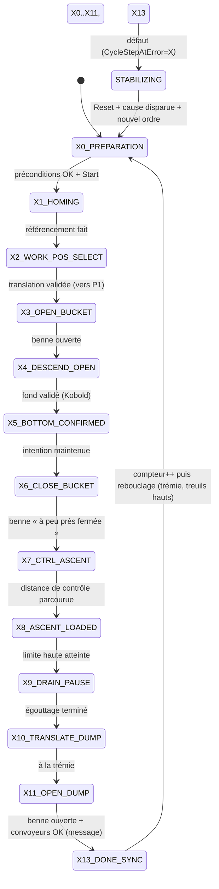

# 🔄 CONCEPTION — Mode SEMI_AUTO & Séquenceur de Cycle (grafcet) — v0.2

**Projet** : Excavatrice de Dragage en Carrière Noyée
**Cible API** : CODESYS 3.5 (IEC 61131-3)
**Date** : 15 Août 2026
**Objet** : Conception finie du séquenceur du mode semi-automatique (cycle de dragage),
conforme `DOC/STDS/GUIDES/GUIDE_SEQUENCEUR_v1.2.md` (§11bis R1-R9), réutilisant les
fonctionnalités MAINT_N1/N2 et s'intégrant aux PRG actuels.

> 🟡 **STATUT : PROPOSITION v0.2 — intègre les décisions utilisateur D1-D4/Q3bis/Q4.**
> À valider avant toute implémentation.

---

## 🧭 Sommaire

1. Décisions utilisateur actées (D1-D4, Q3bis, Q4)
2. Architecture : deux instances (maintenance + semi-auto)
3. Sémantique homme-mort (D2)
4. Grafcet révisé (Xn)
5. Standardisation séquenceur (Écart C)
6. Intégration PRG + IHM + Troubleshooting
7. Effort & plan d'implémentation
8. Checklist de conformité (§11bis)

---

## ✅ 1. Décisions utilisateur actées

| # | Décision | Choix retenu |
|---|---|---|
| **D1** | Instances séquence | **Deux instances** du FB séquence (comme dive/extract) : une **maintenance**, une **semi-auto**. Bascule facile + retour en auto **dans l'état où on était** (quasi transparent). Certaines étapes non reprenables → retour à zéro. |
| **D2** | Homme-mort | **Pas de maintien continu.** Appui = autorisation de mouvement **3 s** (comme MAINT). Si le mouvement est initié, il **continue même sans appuyer**. **Arrêt uniquement quand le manche revient au centre.** |
| **D3** | Pause / Abort | **Pas de bouton Pause** (tout est conditionnel au joystick). Si bloqué → **reset de la séquence semi-auto** + retour condition initiale via bouton maintenance. |
| **Q3bis** | Compteur de prélèvements | **RETAIN** (survit à la coupure). **Compte inconditionnellement** (toujours). **Reset uniquement en maintenance**, par action utilisateur. |
| **Q4** | Vitesses par phase | **Réutiliser la config maintenance** : palier max montée, palier max descente, paliers spécifiques maintenance/positions. Translation : vitesses min PV existantes. **Pas de nouveaux paramètres.** |

---

## 🏗️ 2. Architecture : deux instances (D1)

### Principe
`FB_Cycle` est un FB séquence **générique** (comme `FB_DiveSearch`/`FB_ExtractionSequence`),
instancié **deux fois** :

```text
PRG_03_Modes_Cycle
 ├─ FB_Modes
 ├─ instCycleMaintenance : FB_Cycle   ← utilisé en MAINT_N1/N2
 └─ instCycleSemiAuto    : FB_Cycle   ← utilisé en SEMI_AUTO
```

### Bascule transparente (le point clé)
- Chaque instance **conserve son état** (`State` interne) tant qu'elle est instanciée.
- **Ne PAS désactiver l'instance** au changement de mode (sinon R8 → retour X0). À la place :
  - L'instance reste `Enable := TRUE` (ou gated par « cycle autorisé » sans reset d'état).
  - Le **gating de mode se fait sur les SORTIES** (pont PRG_04/05) : on ne transmet
    `instCycleSemiAuto.WinchM1Cmd` etc. **que si** `Auth.Mode = SEMI_AUTO`.
- **Retour transparent** : en revenant en SEMI_AUTO, l'instance semi-auto reprend son `State`
  mémorisé.

### Vérification de reprise (sécurité)
- À la ré-entrée en SEMI_AUTO, **valider que l'état mémorisé est encore valide** (préconditions
  d'étape toujours vraies : positions, benne, codeurs homés…).
- Si l'étape n'est **pas reprenable** (ex. fond perdu, benne changée d'état) → **retour X0**
  (repartir de zéro), avec message IHM explicite.

### ⚠️ Impact sur les cycles maintenance
**Objectif utilisateur : le cycle ne doit PAS impacter le fonctionnement des cycles maintenance.**
- Les deux instances sont **indépendantes** (états séparés).
- Le pont de sortie est **strictement gated par mode** : en MAINT, les sorties semi-auto ne sont
  jamais transmises ; en SEMI_AUTO, les sorties maintenance ne sont jamais transmises.
- Aucune écriture croisée entre les deux instances.

---

## 🕹️ 3. Sémantique homme-mort (D2)

### Règle (identique MAINT)
| Événement | Effet |
|---|---|
| Appui homme-mort | Autorise le mouvement pendant **3 s** (fenêtre d'armement) |
| Mouvement initié | **Continue même sans appuyer** (l'appui n'est pas maintenu) |
| Manche au centre | **Arrêt** des mouvements |

### Conséquence pour le cycle
- `CycleMotionPermit` (continuité d'un mouvement) = **manche défléchi (non centré)**, PAS appui
  homme-mort maintenu.
- L'homme-mort n'est requis que pour **initier** (armer) un mouvement, avec fenêtre 3 s.
- ⚠️ **À vérifier** : la logique actuelle `JoystickDeadmanArmed` + `AxisCmdY` dans `PRG_02`/`PRG_04`
  doit être alignée sur cette sémantique (fenêtre 3 s, pas maintien). **Point d'audit avant code.**

---

## 🔄 4. Grafcet révisé (intègre tes retours)

### Enum `E_CycleStep` réécrit
```pascal
TYPE E_CycleStep :
(
    X0_PREPARATION      := 0,   (* 🏁 Début de graphe : à la TRÉMIE, treuils en position HAUTE *)
    X1_HOMING           := 1,   (* 🆕 vitesses lentes pour chercher capteur top + référencement *)
    X2_WORK_POS_SELECT  := 2,   (* sélection cible P1 + translation validée *)
    X3_OPEN_BUCKET      := 3,   (* 🆕 ouverture benne (si déjà ouverte → passe vite) *)
    X4_DESCEND_OPEN     := 4,   (* plongée benne ouverte, M1+M2 synchro, Kobold mesure ON *)
    X5_BOTTOM_CONFIRMED := 5,   (* fond validé (FB_DiveSearch) ; arrêt descente *)
    X6_CLOSE_BUCKET     := 6,   (* fermeture benne — tolérance « à peu près fermé » *)
    X7_CTRL_ASCENT      := 7,   (* remontée palier 1 de contrôle *)
    X8_ASCENT_LOADED    := 8,   (* remontée nominale jusqu'à limite haute *)
    X9_DRAIN_PAUSE      := 9,   (* égouttage temporisé — temps affiché IHM *)
    X10_TRANSLATE_DUMP  := 10,  (* translation vers trémie + avertissements IHM *)
    X11_OPEN_DUMP       := 11,  (* ouverture benne = vidage ; montée possible, descente ouvre la benne *)
    X13_DONE_SYNC       := 13,  (* fin de cycle, synchronisation finale (R4) + compteur *)
    STABILIZING         := 14   (* 🆕 état d'attente/stabilisation (ex-ERROR_HOLD) — pas une erreur *)
);
END_TYPE
```

> 📌 **X12 supprimé** (décision utilisateur) : pas de retour P1 en fin de cycle — on reboucle
> directement sur `X0_PREPARATION` (trémie, treuils hauts), puis `X1`/`X2` pour aller à P1.

### Graphe linéaire


### Détail des étapes (tes retours intégrés)

| Étape | Comportement | Tes retours |
|---|---|---|
| **X1_HOMING** | Vitesses lentes pour chercher capteur top + référencement | 🆕 « imposer des vitesses lentes pour venir chercher le capteur top et faire le référencement » |
| **X2_WORK_POS_SELECT** | Cible **P1** uniquement | 🆕 « P2 n'est plus une position de travail — P2 est devenu un déclencheur de petite vitesse pour un arrêt propre et répétable sur P1 » |
| **X3_OPEN_BUCKET** | Ouverture benne ; si déjà ouverte → passe vite | 🆕 « rajouter une étape d'ouverture de la benne » |
| **X4_DESCEND_OPEN** | Plongée benne ouverte, synchro, Kobold | « on maintient le joystick pour la plongée, pas d'arrêt, descente synchronisée » |
| **X6_CLOSE_BUCKET** | Fermeture benne | 🆕 « la benne peut se fermer mal (matière, bois, objet) → si à peu près fermée, on remonte et on fait l'étape de contrôle » |
| **X9_DRAIN_PAUSE** | Égouttage temporisé | 🆕 « assurer que le temps écoulé est bien remonté à l'IHM pour que l'utilisateur sache pourquoi il attend » |
| **X10_TRANSLATE_DUMP** | Translation vers trémie | 🆕 « textes utilisateur : grille abaissée/libre, crible libre pour réceptionner la charge. Arrivée capteur PV → ralentissement auto petite vitesse → arrêt propre sur capteur trémie. Si chargé et câble relâché → remonter les 2 treuils en synchro jusqu'en haut, mais descente interdite → on peut uniquement ouvrir la benne » |
| **X11_OPEN_DUMP** | Ouverture benne = vidage | 🆕 « montée possible, descente fait ouvrir la benne » · « au lâcher, contrôler (par **message utilisateur**, pas encore câblé) que les convoyeurs sont bien en route » |
| **X13_DONE_SYNC** | Fin de cycle + compteur | 🆕 « on passe à X13_DONE_SYNC, on peut incrémenter le compteur, puis on retourne à X0_PREPARATION (trémie, treuils hauts) → X1 → X2 pour aller à P1 » |

---

## 🧱 5. Standardisation séquenceur (Écart C)

### Constat
`FB_Cycle` a été produit **avant** la définition du guide séquenceur → non conforme R2/R9.
**À refaire à neuf** (décision utilisateur).

### Règles à appliquer (guide §11bis + tes retours)
| Règle | Application |
|---|---|
| **R1** | `CASE` sur enum unique, pas de SET/RESET par étape |
| **R2** | Label runtime `"Xn - texte"` (les textes = ceux des 4 champs IHM) |
| **R3** | Graphe linéaire, sauts seulement vers le tronc |
| **R4** | Dernière étape `X13_DONE_SYNC` nommée = synchronisation finale |
| **R5** | `TON` scaffold par transition, commenté `Xi→Xj` |
| **R6/R7** | Fronts partagés centralisés `PRG_02` ; `FB_Edge` |
| **R8** | Porte d'initialisation en tête, retour X0, `RETURN` immédiat |
| **R9** | `CycleStepAtError` mémorise l'étape, capturée avant bascule `STABILIZING` |

### 🆕 Tempo max d'étape (ton retour)
- **Tempo max d'étape** : si on reste trop longtemps à une étape → **défaut** (blocage probable).
- ⚠️ **Ne PAS lancer la tempo max directement** : la lancer **quand on pilote avec le joystick**
  et que ça dure trop longtemps. Si l'utilisateur ne pilote pas (manche au centre), **pas de défaut
  d'étape**.
- L'erreur **et l'étape** sur laquelle on est tombé en défaut doivent être **mémorisées et
  affichées clairement** (R9 + IHM).

### 🆕 Renommage
- Le terme « pause » n'est pas adapté aux états → **`STABILIZING`** (abréviation `STAB` suffit,
  avec commentaire). L'état d'attente/stabilisation (ex-`ERROR_HOLD`) est renommé `STABILIZING` —
  ce n'est **pas** une erreur, c'est un état d'attente/stabilisation.

---

## 🖥️ 6. Intégration PRG + IHM + Troubleshooting

### 6.1 PRG_03 — instancier les deux `FB_Cycle`
```pascal
instCycleMaintenance : FB_Cycle;
instCycleSemiAuto    : FB_Cycle;
```
- Câbler entrées (Start/Abort depuis GVL_IHM, Auth.Mode, heartbeat…).
- Exposer `CycleStep`, `CycleStateStr`, `Error`, `ErrorId` vers GVL_IHM.

### 6.2 PRG_04 — pont SEMI_AUTO (débloque Écart A)
```pascal
IF PRG_03_Modes_Cycle.Auth.Mode = E_Mode.SEMI_AUTO THEN
    M1_Direction_Active := instCycleSemiAuto.WinchM1Cmd.Direction;
    M1_StartStop_Active := instCycleSemiAuto.WinchM1Cmd.StartStop AND CycleMotionPermit;
    M1_SpeedRef_Active  := instCycleSemiAuto.WinchM1Cmd.SpeedPct;
    // idem M2 ; BucketCmd.Close/Open → CmdBucketCloseArbitrated / CmdOpen
END_IF;
```
⚠️ **Critique** : `CycleMotionPermit` = manche défléchi (D2), pas appui maintenu.

### 6.3 PRG_05 — pont SEMI_AUTO translation
```pascal
IF PRG_03_Modes_Cycle.Auth.Mode = E_Mode.SEMI_AUTO THEN
    TranslationCmd_Target := instCycleSemiAuto.TranslationCmd.Target;
    TranslationCmd_Start  := instCycleSemiAuto.TranslationCmd.Start AND CycleMotionPermit;
END_IF;
```

### 6.4 GVL_IHM + Banner (débloque T115)
- `GVL_IHM.Cycle.State.CycleStep := instCycleSemiAuto.CycleStep;` → bandeau champ 2 alimenté.
- `CycleStateStr` (`Xn - texte`) affiché en Watch + IHM.
- **Compteur de prélèvements** : `SampleCount : INT` **RETAIN**, compte inconditionnellement,
  reset uniquement en MAINT (Q3bis).

### 6.5 Troubleshooting (lecture seule, `PRG_07`)
- `CycleStepAtError : E_CycleStep` (R9) — étape spécifique au défaut.
- `ErrorId` détaillé, timers de transition (R5), fronts centralisés `PRG_02` (R6/R7).
- Tempo max d'étape visible (blocage joystick).

---

## ⏱️ 7. Effort & plan d'implémentation

> 🆕 **Demande utilisateur** : planifier les implémentations de façon **sûre, vérifiable et
> évaluable par des agents**, et **surtout ne pas impacter les cycles maintenance**.

### Plan par lots (chaque lot = gates + liaison + validation)
| Lot | Contenu | Effort | Vérifiable par |
|---|---|---|---|
| **L1** | Réécrire `FB_Cycle` conforme R1-R9 + tempo max d'étape + `CycleStepAtError` | 1,5–2 j | G200, G400, tests |
| **L2** | Deux instances (maintenance + semi-auto) dans `PRG_03` + gating sorties | 0,5 j | G200 |
| **L3** | Pont SEMI_AUTO `PRG_04` (treuils/benne) — **sans toucher MAINT** | 1 j | G200, non-régression MAINT |
| **L4** | Pont SEMI_AUTO `PRG_05` (translation) | 0,5 j | G200 |
| **L5** | GVL_IHM + banner + compteur RETAIN + troubleshooting | 1 j | G200, G380 |
| **L6** | Tests + validation | 0,5 j | gates, simulation |

**Total** : ~5 j.

### 🔴 Garantie « ne pas impacter MAINT »
- Chaque lot vérifie la **non-régression MAINT** : les chemins MAINT (`instDiveSearch`,
  `instExtractionSequence`, arbitrage manuel) restent **inchangés**.
- Le pont SEMI_AUTO est **strictement gated** : en MAINT, aucune sortie cycle n'est transmise.
- Gates G200 (liaison) + G400 (syntaxe) à chaque lot.

---

## ✅ 8. Checklist de conformité (§11bis)

```text
[ ] CASE sur enum unique, SET/RESET par étape interdit (R1)
[ ] Label runtime "Xn - texte" sur chaque étape (R2)
[ ] Graphe linéaire, sauts seulement vers le tronc (R3)
[ ] Dernière étape X13_DONE_SYNC nommée = synchronisation finale (R4)
[ ] TON scaffold "Xi→Xj : ..." par transition (R5)
[ ] Fronts partagés centralisés PRG_02 (R6/R7) ; fronts locaux si consommateur unique
[ ] Porte d'initialisation en tête, retour X0, RETURN immédiat (R8)
[ ] CycleStepAtError mémorise l'étape, capturée avant bascule STABILIZING (R9)
[ ] Tempo max d'étape : lancée seulement si pilotage joystick actif (pas de défaut au repos)
[ ] Deux instances (MAINT + SEMI_AUTO), gating sorties par mode, non-régression MAINT
```

---

## ❓ Points restants à trancher (avant code)

> ✅ **Déjà tranchés** : renommage = `STABILIZING` (STAB) · convoyeurs = **message utilisateur**
> (pas câblé) · tempo max = `T#60s` · X12 supprimé (rebouclage trémie/haute).

1. **X11_OPEN_DUMP** : j'ai codé « montée possible, descente ouvre la benne » — confirme que la
   descente déclenche bien l'ouverture benne (et non une commande `Open` directe).
2. **X2_WORK_POS_SELECT** : destinations sélectionnables = **Trémie (1), P1 (3), Maintenance (4)**.
   **P2 (2) n'est PAS une destination** — c'est un capteur de passage en petite vitesse (PV).
   Source réelle : `GVL_IHM.TranslationM3.Cmd.SelTarget` (vérifié `PRG_05_Translation.st:218-222`).
   Le cycle accepte `SelTarget ∈ {1, 3, 4}` et rejette `2` (P2).

*Document de conception v0.2 — proposition à valider avant implémentation.*
