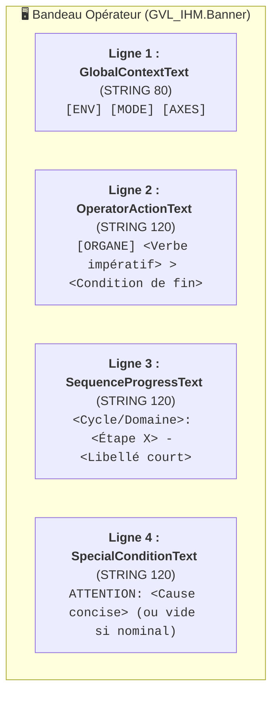

# 🖥️ Plan Détaillé & Standardisation des Textes Bandeau IHM (v1.0)

> **Document de cadrage & conception** : Architecture de génération des messages opérateur et progression système.  
> **Référence documentaire** : [`DOC/AF/AF_Partie-07_Interface_IHM_v2.0.md`](file:///C:/_MGS/DEV/2026_Projet_YGO_ExcavatriceDragage/DOC/AF/AF_Partie-07_Interface_IHM_v2.0.md) §4  
> **POU concernés** : `FB_Hmi_BannerFormatter`, `FB_Cycle`, `FB_DiveSearch`, `FB_ExtractionSequence`, `PRG_07_Supervision`.

---

## 🎯 1. Objectifs & Constat Actuel

### 🚨 Les Problèmes Identifiés sur le Banc
1. **Écrasement d'étapes de cycle par le Homing** : Si `HomingActive = TRUE`, la ligne Progression affiche `Homing: ATTENTE CAPTEUR HAUT` en continu, masquant totalement l'étape courante (`X0_PREPARATION`, `X1_HOMING`, etc.).
2. **Pollution du Contexte global** : Affichage redondant `[SIMULATION] [SEMI-AUTO] [CYCLE AUTO]`.
3. **Consignes passives et imprécises** : `[IHM] Attendre référencement codeurs` au lieu d'une instruction claire d'action physique pour l'opérateur (`[JOYSTICK] Remonter treuils > Capteur haut`).
4. **Textes trop longs / éparpillés** : Présence de longues chaînes en dur dans les FB métier (`FB_Cycle`, `FB_DiveSearch`), en violation du principe AF-07 §4.2 (*« Les FB métier publient des enums typés, PRG_07 centralise le texte »*).

---

## 📐 2. Dictionnaire des Abréviations & Contractions Normalisées

Pour optimiser l'encombrement sur l'écran tactile IHM (affichage concis, TDAH-friendly, zéro troncature), le dictionnaire suivant est acté :

| Terme Métier Long | Contraction Standard | Exemple d'utilisation |
|---|:---:|---|
| **RÉFÉRENCEMENT / HOMING** | `HOMING` ou `RÉF` | `X1_HOMING : Homing treuils capteur haut` |
| **SYNCHRONISÉ / SYNCHRONISATION** | `SYNCHRO` | `[SIMU] [SEMI-AUTO] [M1+M2 SYNCHRO]` |
| **SEMI-AUTOMATIQUE** | `SEMI-AUTO` | `[RÉEL] [SEMI-AUTO]` |
| **TRANSLATION / CHASSIS M3** | `TRANS` ou `M3` | `X10_TRANS: Translation vers trémie` |
| **POSITION / POSITIONNEMENT** | `POS` | `X2_POS : Positionnement P1` |
| **VÉRIFICATION / CONTRÔLE** | `CTRL` | `X7_CTRL : Contrôle charge palier 1` |
| **HOMME-MORT** | `HM` ou `HOMME-MORT` | `[JOYSTICK] Maintenir descente (HM actif)` |
| **PRÉPARATION** | `PREP` | `X0_PREP : Attente départ` |
| **OUVERTURE / FERMETURE** | `OUV` / `FERM` | `X3_OUV : Ouverture benne` |
| **PLONGÉE / DESCENTE** | `PLONG` / `DESC` | `X4_PLONG: Descente benne ouverte` |
| **ARRÊT D'URGENCE / PUISSANCE** | `AU` / `PUISS` | `[PUPITRE] Réarmer AU & Puissance` |

---

## 🖥️ 3. Architecture & Grammaire des 4 Lignes du Bandeau

L'IHM (`GVL_IHM.Banner`) expose 4 champs à responsabilités strictement disjointes :

---

### 🏷️ Ligne 1 : `GlobalContextText` (Contexte Global)
* **Responsabilité :** État d'environnement, mode de marche et sélection mécanique d'axes.
* **Grammaire :** `[ENV] [MODE] [AXES]`

| Mode Actif | Exemple Affiché |
|---|---|
| **SEMI_AUTO** (Simu) | `[SIMULATION] [SEMI-AUTO] [M1+M2 SYNCHRO]` |
| **SEMI_AUTO** (Réel) | `[RÉEL] [SEMI-AUTO] [M1+M2 SYNCHRO]` |
| **MAINT_N1** (Couplé) | `[RÉEL] [MAINT_N1] [M1+M2 COUPLÉS]` |
| **MAINT_N2** (M1 seul) | `[SIMULATION] [MAINT_N2] [M1 SEUL]` |
| **DISABLE** | `[RÉEL] [DÉSACTIVÉ] [AUCUN AXE]` |

---

### 🎮 Ligne 2 : `OperatorActionText` (Consigne d'Action Opérateur)
* **Responsabilité :** Indiquer **qui** doit faire **quoi** immédiatement (ordre de priorité absolu : Sécurité > Interlock > Guidance Cycle).
* **Grammaire :** `[ORGANE] <Verbe d'action à l'impératif> > <Fin attendue>`

| Priorité | Condition Machine | Message Normalisé |
|:---:|---|---|
| **P1** | AU déclenché ou Puissance coupée | `[PUPITRE] Réarmer AU et Puissance` |
| **P2** | Défaut SafeStop actif | `[PUPITRE] Acquitter défaut SafeStop` |
| **P3** | Interlock sens (Descente/Montée bloquée) | `[TREUIL] Descente interdite (butée/sécurité)` / `[TREUIL] Montée interdite` |
| **P4** | Codeurs treuils non référencés (Homing) | `[JOYSTICK] Remonter treuils > Capteur haut` |
| **P5** | Semi-Auto : Prêt à X0 (attente départ) | `[IHM] Appuyer sur START (avec Homme-Mort)` |
| **P6** | Semi-Auto : X2 (attente sélection cible) | `[IHM] Sélectionner cible (Trémie / P1)` |
| **P7** | Semi-Auto : X4 (plongée / descente) | `[JOYSTICK] Pousser Descente (maintenir HM actif)` |
| **P8** | Semi-Auto : X6/X7 (fermeture / arrachage) | `[JOYSTICK] Tirer Montée (maintenir HM actif)` |
| **P9** | Semi-Auto : X11 (vidage sur trémie) | `[IHM] Confirmer vidage trémie` |
| **P10** | Semi-Auto : Stabilisation / Hold (X14) | `[IHM] Corriger anomalie puis réarmer Reset` |

---

### 🔄 Ligne 3 : `SequenceProgressText` (Progression Système)
* **Responsabilité :** Indiquer **où se trouve la machine** dans la séquence (numéro X systématique en Semi-Auto).
* **Règle :** Ne **jamais** écraser le numéro d'étape `X<n>` par un état sous-jacent.

| Étape / Contexte | Message Normalisé |
|---|---|
| **X0_PREPARATION** | `Cycle: X0_PREP - Attente départ & cohérence` |
| **X1_HOMING** | `Cycle: X1_HOMING - Recherche capteurs haut M1/M2` |
| **X2_WORK_POS_SELECT**| `Cycle: X2_POS - Sélection cible travail` |
| **X3_OPEN_BUCKET** | `Cycle: X3_OUV - Ouverture benne` |
| **X4_DESCEND_OPEN** | `Cycle: X4_PLONG - Descente (Kobold: Immersion)` *(ou Recherche fond)* |
| **X5_BOTTOM_CONFIRMED**| `Cycle: X5_FOND - Fond validé Kobold` |
| **X6_CLOSE_BUCKET** | `Cycle: X6_FERM - Fermeture benne` |
| **X7_CTRL_ASCENT** | `Cycle: X7_CTRL - Arrachement & contrôle charge` |
| **X8_ASCENT_LOADED** | `Cycle: X8_MONT - Remontée nominale en charge` |
| **X9_DRAIN_PAUSE** | `Cycle: X9_EGOUT - Égouttage godet temporisé` |
| **X10_TRANSLATE_DUMP**| `Cycle: X10_TRANS - Translation vers trémie` |
| **X11_OPEN_DUMP** | `Cycle: X11_VID - Vidange benne dans trémie` |
| **X13_DONE_SYNC** | `Cycle: X13_FIN - Cycle terminé avec succès` |
| **STABILIZING (X14)** | `Cycle: STABILIZ [Défaut #ID depuis X<n>]` |
| **MAINT_N1 / N2** | `Manuel: PILOTAGE DIRECT JOYSTICK` |
| **MACHINE ARRÊTÉE** | `Machine: ARRÊTÉE / HORS CYCLE` |

---

### ⚠️ Ligne 4 : `SpecialConditionText` (Conditions Spéciales & Alertes)
* **Responsabilité :** Informer des régimes dérogatoires ou contraintes d'exploitation (*vide si nominal*).
* **Format :** `ATTENTION: <Détail court>`

| Condition | Message Normalisé |
|---|---|
| **Bypass actif** | `ATTENTION: Dérogation / Bypass actif` |
| **Synchro bridée** | `ATTENTION: Synchro bridée (Écart Palier 1)` |
| **Limite légale** | `ATTENTION: Limite légale de profondeur atteinte` |
| **Nominal** | `''` *(champ masqué)* |

---

## 🛠️ 4. Plan de Refactoring Technique

1. **Suppression des chaînes de caractères dans `FB_Cycle.st`** :
   - Remplacer les assignations directes de `CycleStateStr` par un simple export de l'enum `CycleStep`.
2. **Refonte de `FB_Hmi_BannerFormatter.st`** :
   - Mise à jour du `CASE CycleStep OF` pour générer les libellés `SequenceProgressText` normalisés.
   - Refonte de la cascade de décision de `OperatorActionCandidate` selon la table de priorité P1 à P10.
   - Découplage de la détection de Homing : si `CurrentMode = SEMI_AUTO`, la progression affiche `Cycle: X...`, et l'action opérateur indique `[JOYSTICK] Remonter treuils > Capteur haut`.
3. **Mise à jour de la documentation `AF_Partie-07`** :
   - Synchroniser le paragraphe §4 avec la présente grille de standardisation.
