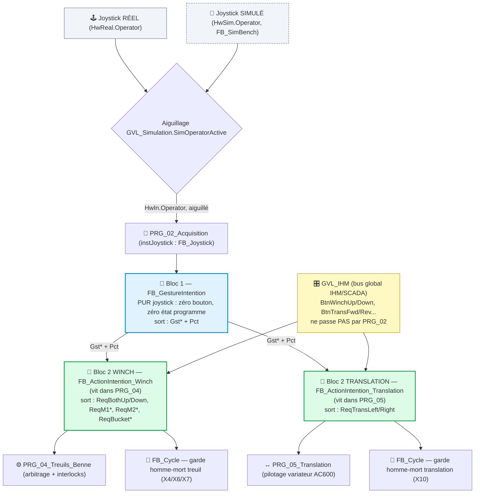

# 🔍 Revue — Architecture d'Intention Joystick (Geste → Action)

> 📅 Session 2026-08-19 · Revue + décisions par Claude Code (Sonnet 5), avec l'utilisateur.
> 📄 Document source : [`DESIGN_INTENTION_ARCHITECTURE_v0.1.md`](DESIGN_INTENTION_ARCHITECTURE_v0.1.md)
> 🔍 Phase étude — **zéro code touché**.

---

## ✅ Décisions actées (2026-08-19)

| # | Décision |
|---|---|
| D1 | **Architecture 2 blocs retenue** : Bloc 1 (`FB_GestureIntention`, pur joystick) → Bloc 2 (`FB_ActionIntention`, action). Un décodeur unique a trop de responsabilité et rend le dépannage plus difficile (on ne sait pas si un défaut vient du geste brut ou du mapping contexte) |
| D2 | **Bloc 2 scindé par domaine** : `FB_ActionIntention_Winch` (vit dans `PRG_04`) + `FB_ActionIntention_Translation` (vit dans `PRG_05`) — pas un monolithe unique, isolation de test |
| D3 | **Joystick → Bloc 1 uniquement**, via l'aiguillage réel/simulé déjà existant (`HwIn.Operator` = `SEL(OperatorInputSourceSimulated, HwReal, HwSim)`, `PRG_02_Acquisition.st:165,316`). `FB_Joystick` ne sait jamais s'il lit réel ou simulé |
| D4 | **Boutons IHM → Bloc 2 uniquement**, source parallèle `GVL_IHM` (`CODE/J_SUPERVISION/GVL_IHM.st`) — ne passe **pas** par `PRG_02_Acquisition`, lu directement comme le fait déjà `PRG_04` aujourd'hui |
| D5 | **Nommage `Act*` → `Req*` obligatoire** — non négociable (`AGENTS.md` : nommage non conforme = cas d'arrêt). `Act` signifie déjà *"valeur mesurée/actuelle"* dans `NAMING_CONVENTION.md:160` (`SpeedAct`, `NeutralXAct`, en usage réel). Les sorties Bloc 2 sont non-arbitrées (permis en aval) → sémantiquement `Req*` (`NAMING_CONVENTION.md:301-310`) |
| D6 | **`DiveActive`/`ExtractionActive` retirés de `ST_ActionContext`** — redondants : A1≡A9 et A2≡A10 produisent la même action (`ActBothDown+ActBucketOpen` / `ActBothUp+ActBucketClose`), qu'on soit en assist ou en mode normal. Ces flags ne servent qu'au séquencement déjà géré dans `PRG_04` |
| D7 | **`DumpAtTremieActive` conservé** dans `ST_ActionContext` — seul contexte qui change réellement l'action produite (A11 : `ActBucketOpen` seul, pas `ActBothDown`) |
| D8 | **`FB_Cycle` consomme les 2 domaines** (Winch ET Translation) comme garde homme-mort — X4/X6/X7 (treuil) et X10 (translation, table C3 du doc) |
| D9 | **Structures échangées** : groupées en struct par domaine, mais **pas d'enum obligatoire** — un `ActionId:INT/ENUM` complique la relecture en historique SCADA (table de correspondance requise) vs des `BOOL` nommés auto-descriptifs en trend. Struct de `BOOL` groupés retenu, enum = option ponctuelle seulement si un cas précis le justifie |
| D10 | **Profil FB : `AF_Partie-03_Contrats_Composants_v2.1.md` §2 s'applique tel quel** — `FB_GestureIntention`/`FB_ActionIntention_*` = profil **"FB métier"** (responsabilité domaine + état public + diagnostics), **pas** "FB mouvement" → pas de `StartStop`/`SafeStop`/`Mode`/`PowerContactorEngaged` dans leur interface. `Enable` reste un `BOOL` nu (§3 : *"pas un champ d'en-tête de bus, commande de cycle de vie du FB"*). Leurs sorties (`Gst*`/`Req*`) sont du type contrat **"Demande"** (§4 : *"intention brute sourcée, jamais confondue avec une commande déjà arbitrée"*) — pas encore une "Commande mouvement" (réservée à `ST_WinchCmdDemand` post-interlocks) |
| D11 | **Stratégie de déploiement du standard `AF_Partie-03`** : pilote d'abord, généralisation ensuite — pas de big-bang. ⚠️ **Pilote = `FB_Winch` (profil mouvement)**, pas les FB d'intention : ceux-ci sont profil *light* et ne porteraient aucune des structures à valider, le pilote ne prouverait rien |
| D12 | **Le standard est extrait de l'existant, pas inventé** — mesure sur les 53 FB du projet (voir §"Mesure" ci-dessous). La distribution est bimodale : 21 FB portent le bloc d'état complet, 27 n'en portent aucun, 5 sont en entre-deux. Le standard existait déjà de fait, il n'était pas écrit |
| D13 | **2 contrats + 1 seule struct transverse** : contrat *light* (`Enable` in / `Ready` out, en `BOOL` nus — **aucune struct**) et contrat *standard* (= light + `Reset`, `PowerContactorEngaged` in / `Status : ST_FbStatus` out). Les structs **métier** s'ajoutent par-dessus selon les besoins du domaine, jamais dans le socle |
| D14 | **Pas de struct mouvement** — `StartStop` n'existe que dans 2 FB (`FB_Winch`, `FB_Translation`) : un type partagé pour 2 instances est de la cérémonie sans bénéfice. Restent en `BOOL` nus. Idem `PowerContactorEngaged` : présent dans 22 FB dont 16 **sans** `StartStop`/`SafeStop` → c'est un permis quasi-universel (comme `Enable`), pas une entrée mouvement |

---

## 🗺️ Schéma retenu


*(`CYC`/`CYC2` = même instance `FB_Cycle`, dédoublée sur le schéma pour lisibilité des 2 flux)*

---

## 🔁 Mapping nommage `Act*` → `Req*` (D5, application concrète)

| Domaine | `Act*` (doc actuel) | `Req*` (retenu) |
|---|---|---|
| Winch | `ActDescentOpen` | `ReqDescentOpen` |
| Winch | `ActAscentClose` | `ReqAscentClose` |
| Winch | `ActBucketOpen` | `ReqBucketOpen` |
| Winch | `ActBucketClose` | `ReqBucketClose` |
| Winch | `ActBothUp` | `ReqBothUp` |
| Winch | `ActBothDown` | `ReqBothDown` |
| Winch | `ActM1Up` | `ReqM1Up` |
| Winch | `ActM1Down` | `ReqM1Down` |
| Winch | `ActM2Up` | `ReqM2Up` |
| Winch | `ActM2Down` | `ReqM2Down` |
| Translation | `ActTransLeft` | `ReqTransLeft` |
| Translation | `ActTransRight` | `ReqTransRight` |

Ce mapping converge avec celui déjà choisi dans `PREETUDE_INTENTION_DECODER_v0.1.md` (archivé,
`ARCHIVES/Doc/AUDITS/`) avant que le doc actuel reparte sur `Act*`.

---

## 📊 Mesure — le standard tel qu'il existe déjà (53 FB analysés, 2026-08-19)

Relevé mécanique sur `CODE/**/FB_*.st`. Aucune règle inventée : ce tableau **décrit** l'existant.

| Membre | Nb FB qui le portent |
|---|---|
| `Enable` | 35 |
| `Reset` | 26 |
| `Ready` / `Error` / `ErrorId` | 24 |
| `State` / `Busy` / `Done` | 23 |
| `PowerContactorEngaged` | 22 |
| `StateAtError` | 19 |
| `Mode` | 15 |
| `SafeStop` | 6 |
| `StartStop` | **2** |

**Distribution bimodale du bloc d'état** (`Busy`+`Done`+`Error`+`ErrorId`+`State`) :

| Complétude | Nb FB | Lecture |
|---|---|---|
| 5/5 | **21** | profil *standard* |
| 0/5 | **27** | profil *light* |
| 1–4/5 | 5 | entre-deux, à examiner |

Sur les 21 FB « standard » : `Ready` et `Reset` présents dans **21/21** (100%), `StateAtError`
dans 19/21 (exceptions : `FB_Cycle`, `FB_Safety_EmergencyManagement`).

Les 5 entre-deux, à trancher au cas par cas (pas forcément des défauts) :
`FB_Output` (1/5), `FB_SimBench` (2/5), `FB_Safety_EmergencyManagementLogic` (2/5),
`FB_Safety_EmergencyManagementOutput` (3/5), `FB_Joystick` (4/5 — sans `State`).

---

## 🧱 Les 2 contrats retenus (D13)

### Contrat *light* — 27 FB (ex. `FB_AxisScale`, `FB_Filter_PT1`)
```pascal
VAR_INPUT
    Enable : BOOL;   // --> [CMD] Activation du FB
    // ... entrees propres au role : [HW] / [CFG]
END_VAR
VAR_OUTPUT
    Ready  : BOOL;   // <-- [STAT] FB pret / resultat valide
    // ... resultat(s) propre(s) au role : [STAT]
END_VAR
```
Aucune struct : `Enable`/`Ready` restent des `BOOL` nus.

### Contrat *standard* — 21 FB (ex. `FB_Winch`, `FB_Bucket`, `FB_Cycle`)
```pascal
VAR_INPUT
    Enable                : BOOL;   // --> [CMD]  Activation du FB
    Reset                 : BOOL;   // --> [CMD]  Acquittement defaut (front interne)
    PowerContactorEngaged : BOOL;   // --> [SAFE] Chaine puissance/AU rearmee
    // ... entrees metier
END_VAR
VAR_OUTPUT
    Ready  : BOOL;         // <-- [STAT] FB pret (reste nu)
    Status : ST_FbStatus;  // <-- [STAT] Etat de vie + diagnostic (regroupement)
    // ... sorties metier
END_VAR
```

`ST_FbStatus` = **regroupement à l'identique** du cluster mesuré, zéro changement sémantique :
```pascal
TYPE ST_FbStatus :
STRUCT
    Busy         : BOOL;    // <-- [STAT] Traitement en cours
    Done         : BOOL;    // <-- [STAT] Action terminee
    Error        : BOOL;    // <-- [STAT] Error := (ErrorId <> 0)
    ErrorId      : WORD;    // <-- [DIAG] Bitfield cumulatif, 1 bit = 1 cause documentee
    State        : E_State; // <-- [STAT] Phase courante
    StateAtError : E_State; // <-- [DIAG] Phase figee au defaut jusqu'a acquittement
END_STRUCT
END_TYPE
```

Les structures **métier** (commande mouvement, contexte, demande…) s'ajoutent par-dessus ces
contrats selon le domaine — elles ne rentrent jamais dans le socle.

### Impact réel de la migration `ST_FbStatus` — vérifié sur le code

Une première analyse annonçait un risque de reparamétrage IHM/SCADA. **C'est faux, vérifié** :
`PRG_07_Supervision` est une vraie couche de publication (128 affectations champ par champ, ex.
`GVL_IHM.Network.CanError := instDiagCanOpen.Error;`). Passer `Error` en `Status.Error` ne change
que le **membre droit** — le chemin `GVL_IHM.*` vu par le pupitre est inchangé.

| Ce qui change | Volume | Risque |
|---|---|---|
Il existe en réalité une **double couche d'adaptation**, vérifiée sur le code :
```pascal
WinchM1State.Busy := instWinchM1.Busy;           // PRG_04:968  (FB -> struct metier)
GVL_IHM.M1TreuilRetenue.State := WinchM1State;   // PRG_07:292  (struct metier -> IHM)
```
Avec `Status.Busy`, seule la 1ʳᵉ ligne change à droite. `ST_WinchState` garde sa forme exacte
→ `GVL_IHM` inchangé → **pupitre inchangé**. C'est la discipline `AF_Partie-03` §1 (*« l'IHM lit
ses structures dédiées, jamais les internes des FB »*) qui paie ici.

**Périmètre exact mesuré** — lignes lisant `inst*.{Busy,Done,Error,ErrorId,State,StateAtError}` :

| Fichier | Lignes | Risque |
|---|---|---|
| `PRG_04_Treuils_Benne` | 105 | 🟢 Mécanique — **erreur de compilation** si oubli |
| `PRG_07_Supervision` | 20 | 🟢 Idem |
| `PRG_05_Translation` | 10 | 🟢 Idem |
| `PRG_03_Modes_Cycle` | 5 | 🟢 Idem |
| `PRG_02_Acquisition` | 3 | 🟢 Idem |
| `PRG_06_Outputs_LD` | 1 | ✅ **Hors périmètre** — `instSafetyEmergencyManagement.State` est de type `ST_Safety_Emergency_State` (struct métier), pas le `E_State` de phase. Aucun risque d'import Ladder |
| **Total** | **144** | |
| `GVL_IHM` / SCADA / pupitre | **0** | ✅ Aucun impact |

Le compilateur attrape 100% des oublis : pas de dérive silencieuse possible, donc **pas besoin de
transition en miroir**. Migration franche, en un lot, avec `G200_check_linkage.py` en garde-fou.

> 💡 **Bénéfice non anticipé** : `State` est un nom surchargé dans le projet (tantôt phase
> `E_State`, tantôt struct métier). Le contournement actuel est un renommage, documenté dans
> `ST_SyncState.st:13` : *« `FBState : E_State` — ex-"State", renommé pour éviter collision avec le
> sous-struct State »*. Placer la phase dans `Status` la namespace (`instX.Status.State`) et
> **supprime la cause** du contournement au lieu de le perpétuer.

---

## 🏗️ Propositions à trancher (pas encore décidées)

> P1/P2 (enum `E_ActionId`/`E_Gesture`) retirés — tranchés par D9 : struct de `BOOL` groupés
> retenu par défaut, pas d'enum imposé (lisibilité historique SCADA prime sur la garantie de
> mutuelle exclusion par typage dans ce cas précis).

| # | Proposition | Bénéfice | Statut |
|---|---|---|---|
| P3 | Table de règles exécutable (`ARRAY[1..12] OF ST_ActionRule`) au lieu d'IF/ELSIF, pour que la matrice §3bis **soit** le code, pas juste un tableau Markdown qui peut diverger | Traçabilité exigence↔implémentation directe (audit sécurité fonctionnelle) | 🟡 Ouvert |
| P4 | Étendre le refactor `Req*`/domaine à `PRG_05_Translation` — `M3_Direction_Active` y est recalculé par 2 chemins différents (`PRG_05.st:150` SEMI_AUTO vs `:169` manuel), même dette que `PRG_04` | Évite de laisser la dette côté translation pendant qu'on la corrige côté treuil | 🟡 Ouvert |
| P5 | Sortie diagnostic `LastRuleId:INT` (quelle ligne de la matrice a matché) | Dépannage terrain immédiat, cohérent avec la culture diagnostic du projet (`STABILIZING` affiche cause+étape) | 🟡 Ouvert |
| P6 | Cartographie fichiers impactés + registre de risques avec mitigations (comme `PREETUDE_INTENTION_DECODER_v0.1.md` archivé le faisait) | Traçabilité blast-radius sur un chantier qui touche `FB_Cycle`/`PRG_04`/`PRG_05` (sécurité machine) | 🟡 Ouvert |
| P7 | Plan de déploiement en jalons testables : `FB_GestureIntention` isolé + testé en simu **avant** de toucher `PRG_04`/`PRG_05`/`FB_Winch` | Réduit le risque sur un programme sécurité-critique — repris de 2 docs archivés indépendamment (signal fort) | 🟡 Ouvert |

---

## ⚠️ Risque à traiter avant ou avec ce lot

`PRG_04_Treuils_Benne.st:654-660` documente en dur un **gap réel confirmé** :
`instDiveSearch.DescendPermit` est calculé mais **jamais consommé** — les permis liés à
Dive/Extraction sont déjà fragiles aujourd'hui. Bâtir la matrice d'action dessus sans d'abord
fiabiliser ces permis risque de figer/dupliquer le bug plutôt que de le corriger.

---

## 📌 Prochaine étape

1. Trancher P1-P7 ci-dessus (proposer un ordre de discussion si besoin).
2. Mettre à jour `PLAN_TASK.md` T130 pour référencer cette architecture (2 blocs, `Req*`) comme
   version actée.
3. Une fois P1-P7 tranchés, rédiger le contrat de tâche (`task_contract.yaml`) avant tout code —
   `AGENTS.md` l'impose dès C2.
