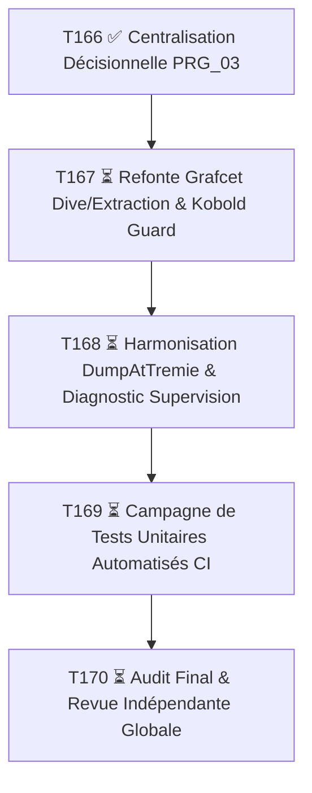

# 🗺️ FEUILLE DE ROUTE STRATÉGIQUE & PLAN DE CHARGE GLOBAL : REFONTE DES CYCLES & DIAGNOSTICS (T167 à T170)

> **Rôle Orchestrateur** : Pilotage macroscopique, vision à 360°, cadrage des familles de tâches et contrats en amont, délégation d'exécution et de revue aux sous-agents Ollama.

---

## 🧭 1. Synthèse Macro des 2 Audits & Angles Morts Traités

Les 2 audits récents ont mis en lumière **4 chantiers majeurs indispensables** pour rendre le système robuste, testable et certifiable :

1. **Chantier 1 (Architectural — T166) [FAIT ✅]** :
   - Centralisation de toutes les machines d'état décisionnelles (`FB_Cycle`, `FB_DiveSearch`, `FB_ExtractionSequence`) dans `PRG_03`.
   - Allègement de `PRG_04` en muscle/sécurité physique.
   - Élimination des fuites d'encapsulation dans `PRG_07`.
   - Alignement documentaire immédiat `AF-02`, `AF-04`, `AF-10`.

2. **Chantier 2 (Fonctionnel Métier — T167) [À FAIRE ⏳]** :
   - **Refonte et Unification du Grafcet Plongée / Recherche Fond / Extraction**.
   - Suppression du transport "brut" du bypass Kobold : traitement en `fix:` + `guard:`.
   - Règle stricte des timeouts d'étape, capture d'étape fautive (`StepAtFault`), gestion des reprises et resets conscients.

3. **Chantier 3 (Sécurité & Diagnostic Avancé — T168) [À FAIRE ⏳]** :
   - Raccordement du diagnostic unifié de dragage `ST_ChainCycleSemiAuto` et `FB_TroubleshootingView`.
   - Traitement de l'assistance `DumpAtTremie` sur le même patron strict Décision/Muscle.
   - Protection anti-rebond et sécurisation de la confirmation manuelle de fond.

4. **Chantier 4 (Campagne de Qualification Automatisée — T169 & T170) [À FAIRE ⏳]** :
   - Suite de tests unitaires et scénarios réels (StruCpp / ST2C / CI) : Plongée nominale, perte mesure Kobold, blocage benne, rupture synchro, arrêt d'urgence, reprise après défaut.

---

## 🗂️ 2. Décomposition Complète des Familles de Tâches & Contrats

---

### 📋 Famille `T167` : Refonte & Unification du Grafcet Plongée / Extraction (Criticité C4)
- **`T167-A`** : *Spécification fonctionnelle et Grafcet cible unifié* (Document `AF-04 §3` & Grafcet X_DIVE_0 à X_EXTRACT_N).
- **`T167-B`** : *Refonte `FB_DiveSearch` (fix + guard)* : Gestion sécurisée du bypass Kobold, détection de perte de contact, time-outs d'étape et capture `StepAtFault`.
- **`T167-C`** : *Refonte `FB_ExtractionSequence`* : Coordination décollage matière, asservissement vitesse lente et passage de témoin fluide avec la montée normale.
- **`T167-CR`** : *Revue indépendante Ollama du code ST des deux briques*.

---

### 📋 Famille `T168` : Harmonisation Vidage Trémie & Diagnostic Supervision (Criticité C3)
- **`T168-A`** : *Migration et harmonisation `DumpAtTremie`* : Déplacement de la décision dans `PRG_03` et application muscle dans `PRG_04` / `PRG_05`.
- **`T168-B`** : *Intégration Diagnostic `FB_TroubleshootingView`* : Synthèse d'étape fautive, états des capteurs et chaîne de blocage pour l'opérateur.
- **`T168-CR`** : *Revue indépendante Ollama*.

---

### 📋 Famille `T169` : Qualification & Tests Automatisés CI (Criticité C4)
- **`T169-A`** : *Harness de test STruCpp pour les cycles `PRG_03`* (Plongée, Recherche fond, Extraction).
- **`T169-B`** : *Scénarios de test aux limites & défauts* (Perte Kobold, Benne non fermée, Hors tolérance synchro M1/M2).
- **`T169-C`** : *Intégration dans `run_all_gates.py` et validation 100% PASS*.

---

### 📋 Famille `T170` : Clôture & Revue Globale d'Ingénierie (Criticité C4)
- **`T170-AUDIT`** : *Audit de cohérence documentaire globale (`AUDIT_Coherence_Documentaire`)*.
- **`T170-CR`** : *Revue globale par sous-agent local Ollama (`qwen3.8:27b` ou `deepseek-v4-flash`)*.
