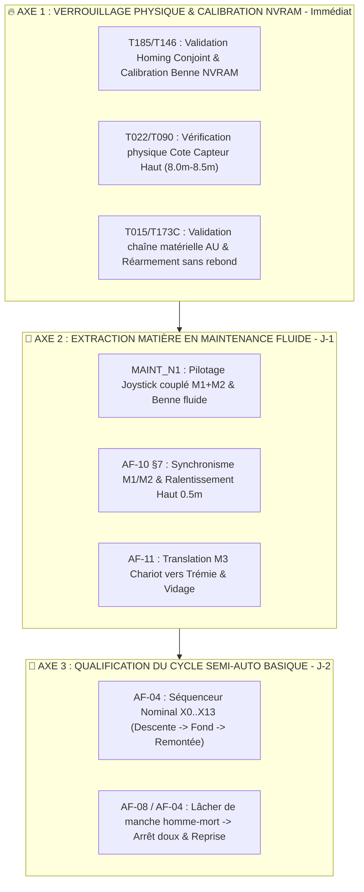

# 🎯 Plan d'Action & Priorisation Chantier J-2 (Mise en Route SAT)

**Date** : 2026-09-05  
**Auteur / Rôle** : Expert Senior Automatisme Industriel, Sécurité Machine (ISO 13849), Ergonomie IHM & SAT  
**Référentiels** : `DOC/WFLOW/TASKS.yaml`, `DOC/WFLOW/CONTRACTS/`, `DOC/AF/`, `DOC/STDS/`, `AGENTS.md`

---

## 🚨 1. Posture d'Ingénierie & Challenge Constructif (Anti-Yes-Man)

À **48 heures de la mise en service et réception machine (SAT)**, l'analyse formelle des tâches en cours, de l'analyse fonctionnelle et du code source impose une ligne directrice stricte :

* ⛔ **Ce qu'il est formellement interdit de faire** : Refactor d'architecture, modifications des bus de communication, refonte d'interfaces POU ou tentative de validation d'automatismes complexes multi-variateurs.
* 🎯 **L'objectif unique et non négociable** : **Permettre à l'opérateur d'extraire de la matière en carrière noyée en toute sécurité, sans blocage opérateur, avec un mode Maintenance N1 robuste et un cycle Semi-Automatique basique éprouvé**.

---

## 🧭 2. Plan d'Action Détaillé par Axe Critique

### 🔴 AXE 1 : Verrouillage Physique, Homing & NVRAM (Matin J-1 — 2h max)
*Sources : Contrat `TASK_CONTRACT_T185`, `AF_Partie-09 v2.4`, `AF_Partie-10 v2.1`, `GVL_PERSISTENT.st`*

1. **Calage Réel Géométrie Benne (`TASK_CONTRACT_T185` AC2/AC9)** :
   * **Constat physique** : L'état de la benne est dérivé en continu de $\Delta = \text{CablePosM2} - \text{CablePosM1}$. Si la benne bascule en `IsOpen` au redémarrage, c'est que la valeur réelle ne matche pas le réglage NVRAM.
   * **Action** : En `MAINT_N2`, fermer physiquement la benne, relever le $\Delta$ réel, renseigner `_BucketCfgPersist.Config.OffsetCloseM` (IHM/NVRAM), et appuyer sur `BtnConfirmClosePos` pour figer `BucketReferenced := TRUE`.
2. **Cote Physique Capteur Haut (`T022` / `T090` / `AF-09 §5`)** :
   * **Action** : Valider la position d'attaque physique du capteur haut M1/M2 et aligner `CfgTopSensorPos_M` dans `GVL_PERSISTENT` (entre 8.0 m et 8.5 m).
3. **Sécurité Électrique & Chaîne AU (`T015` / `T173C` / `AF-01 v1.4`)** :
   * **Action** : Vérifier que le réarmement électrique s'effectue sans blocage ni staccato grâce aux filtres `CST_PreArmDelay = 500ms` et `ArmPulseInhibitActive = 5s`.

---

### 🟡 AXE 2 : Robustesse du Mode Maintenance `MAINT_N1` & Sortie Matière (Après-midi J-1)
*Sources : `AF_Partie-05 v2.1`, `AF_Partie-10 v2.1`, `AF_Partie-11 v2.3`, `AF_Partie-07 v2.3`*

1. **Mouvements Levage M1 / M2 & Benne (`AF-05 §4`, `AF-10 §3-§7`)** :
   * **Exigence** : L'opérateur pilote les deux treuils au joystick (`WinchSel=0`), descend chercher la matière, bascule en benne (`WinchSel=2`) pour fermer et remonte en couplé.
   * **Garde-fous vérifiés** :
     * Ralentissement haut à **`0.5 m`** effectif (`SlowdownDistanceTop_M := 0.5`).
     * Dégradation automatique au Palier 1 si la benne n'est pas fermée en montée (`BucketNotClosedAscentCapStep1`).
     * Absence d'alarme intempestive `SyncDeviationWarn` pendant la manipulation benne grâce au hold 2s (`BucketActivityHold`).
2. **Translation M3 Chariot & Déchargement Trémie (`AF-11 v2.3`)** :
   * **Exigence** : Translation du chariot M3 de la zone de dragage (P1) jusqu'à la trémie (`DumpAtTremie`) avec accostage amorti sur variateur AC600 EtherCAT (`PosPV` ➔ `PosTremie`).
3. **Ergonomie & Diagnostic IHM (`AF-07 v2.3`, `AF-14 v1.4`)** :
   * **Exigence** : Les bannières IHM (`FB_Hmi_BannerFormatter`) affichent en clair la cause et l'action (aucun mouvement refusé de manière muette).

---

### 🟢 AXE 3 : Qualification du Cycle Semi-Automatique Nominal Basique (Matin J-2)
*Sources : Contrat `TASK_CONTRACT_T127-B`, `AF_Partie-04 v2.3`, `GUIDE_SEQUENCEUR_v1.2`*

1. **Enchaînement Nominal Simple ($X_0 \rightarrow X_{13}$)** :
   * Descente rapide M1/M2 ($X_1$) ➔ Détection fond Kobold / contact matière ($X_4$) ➔ Fermeture benne M2 ($X_5$) ➔ Décollage palier 1 ($X_6$) ➔ Remontée nominale ($X_7$) ➔ Arrêt haut ($X_{10}$).
2. **Gestion Homme-Mort & Robustesse Sécurité (`TC-P04-001`, `TC-P04-004`)** :
   * Maintien joystick actif exigé pour le déroulement automatique.
   * Tout lâcher de manche stoppe le mouvement en rampe sans perte de l'étape active.
   * Ré-engagement du manche = reprise fluide de la séquence sans réarmement brutal.

---

## 📅 3. Planning d'Exécution Opérationnel

| Étape | Horodatage Cible | Objectif Opérationnel | Référentiel Technique |
|---|:---:|---|---|
| **Étape 1** | Matin J-1 (2h) | Figer `OffsetCloseM` NVRAM + Mesure Capteur Haut + Réarmement AU | `AF-01`, `AF-09`, `TASK_CONTRACT_T185` |
| **Étape 2** | Après-midi J-1 | Sortir de la matière en `MAINT_N1` + Vidage Trémie M3 | `AF-05`, `AF-10`, `AF-11` |
| **Étape 3** | Matin J-2 | Valider 3 cycles complets Semi-Auto basique en dragage réel | `AF-04 v2.3` ($X_0..X_{13}$) |
| **Étape 4** | Après-midi J-2 | PV de réception & validation SAT client | `REGISTRE_Suivi_MiseEnService.md` |