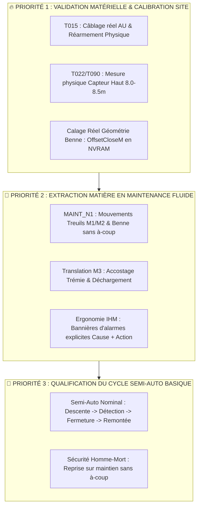

# 📋 Synthèse et Bilan des Tâches Projet (TASKS.yaml & Contrats)

**Date** : 2026-09-05  
**Auteur / Rôle** : Point d'avancement & Coordination Workflow  
**Référentiels** : DOC/WFLOW/TASKS.yaml, DOC/WFLOW/CONTRACTS/, AGENTS.md

---

## 🎯 1. Vue d'Ensemble du Catalogue des Tâches

Le catalogue DOC/WFLOW/TASKS.yaml formalise l'intégralité des chantiers techniques du projet avec leur criticité (C0 à C4), leurs dépendances et leurs critères de validation formelle.

### 📊 Snapshot des Statuts (259 Tâches)

| Catégorie de Statut | Icône / Repère | Volume | Signification & Rôle |
|---|:---:|:---:|---|
| **Tâches Terminées & Validées** | ✅ | **238** | Chantiers clôturés, revus, audités et intégrés dans CODE/ et DOC/ |
| **Tâches Clôturées / Remplacées** | ❌ | **5** | Tâches supersédées par des refactors plus récents ou devenues caduques |
| **Tâches en Cours / Verrouillées** | 🔒 / ⏳ | **4** | Lots en exécution active sous contrat |
| **Tâches en Attente / Terrain** | ⏸️ / ⬜ | **12** | Points de mise en service (MES), mesures site ou arbitrages différés |

## 🧭 2. ARGUMENTAIRE & PLAN DE BATAILLE CHANTIER J-2 (SAT & RÉCEPTION)

> 🚨 **Posture d'Ingénierie & Challenge Constructif (Anti-Yes-Man) :**  
> Avec seulement **48 heures avant la réception machine**, il est **strictement hors de question** d'ouvrir des chantiers d'architecture lourds, de modifier les bus de communication ou de chercher à déployer un mode automatique complexe.  
> **L'objectif unique du SAT est : « Sortir de la matière en carrière noyée en toute sécurité, sans blocage opérateur, avec un mode Maintenance robuste et un cycle Semi-Auto basique éprouvé »**.

---

### ⏱️ Les 3 Paliers d'Action pour les Prochaines 48 Heures

#### 🔴 PALIER 1 : Socle Physique & Déverrouillage des Axes (Ce matin — 2h max)
* **1. Calage géométrie Benne dans la NVRAM (`_BucketCfgPersist.Config.OffsetCloseM`)** :
  * *Pourquoi* : Hier la benne fermait mais ce matin elle est vue "ouverte" car le delta réel ne matche pas la valeur par défaut. Mesurer le $\Delta$ physique fermé et ajuster `OffsetCloseM` + `CoherenceLimitM` dans l'IHM.
* **2. Validation physique Capteur Haut & Cible Homing (`T022` / `T090`)** :
  * *Pourquoi* : S'assurer que le capteur haut M1/M2 est physiquement positionné et que la cote dans `_WinchM1/M2CfgPersist.CfgTopSensorPos_M` correspond au millimètre (8.0m à 8.5m).
* **3. Contrôle Chaîne AU & Réarmement Électrique (`T015`)** :
  * *Pourquoi* : Valider que le bouton physique d'armement réarme sans rebond intempestif (`CST_PreArmDelay = 500ms`, `ArmPulseInhibitActive = 5s`).

#### 🟡 PALIER 2 : Fonctionnalité Métier « Sortir la Matière » en Maintenance (Après-midi J-1)
* **1. Maintien et pilotage Treuils M1 / M2 / Benne (`MAINT_N1`)** :
  * Valider que l'opérateur peut descendre, poser au fond, fermer la benne et remonter en pleine charge sans déclenchement intempestif de `SyncDeviationWarn` ou `MecaE`.
  * *Sécurité vérifiée* : Ralentissement haut à 0.5m effectif (`SlowdownDistanceTop_M := 0.5`).
* **2. Translation M3 & Vidage Trémie (`DumpAtTremie`)** :
  * Valider la translation du chariot M3 entre la zone de dragage (P1) et la trémie, avec décélération propre sur les capteurs `PosPV` et `PosTremie`.
* **3. Lisibilité du Bandeau d'Alarmes IHM (`FB_Hmi_BannerFormatter`)** :
  * Aucune alarme muette ou bloquante sans explication : l'opérateur doit lire instantanément la cause (ex. *"M3 pas à P1 : descente refusée"*).

#### 🟢 PALIER 3 : Qualification du Cycle Semi-Auto Basique (J-2)
* **1. Séquence nominale simple (`X0` ➔ `X13`)** :
  * Descente couplée M1/M2 ➔ Détection fond (Kobold / Mou de câble) ➔ Fermeture benne M2 ➔ Remontée nominale palier 4/5 ➔ Arrêt haut.
* **2. Ergonomie Homme-Mort & Anti-Panique** :
  * Lâcher de manche = arrêt immédiat en rampe sans défaut.
  * Ré-appui manche = reprise directe de l'étape sans redémarrage brutal.

---

## 🔍 3. État des Lieux par Domaine Métier

### A. Sécurité Machine & Arrêt d'Urgence (AF01, AF03, AF14)
- **Chaîne AU & Bypass MES (T173C)** : Formalisation et validation des 3 modes de bypass orthogonaux (BypassArmingPreconditions, BypassRedundancyTest, BypassPowerCutOff), tempo 500 ms et anti-staccato 5 s.
- **Actions Terrain Ouvertes** :
  - T015 (C2) : Validation câblage physique EmergencyStopOk_DI sur armoire.
  - T092 (C4) : Qualification terrain de la persistance bypass RETAIN et reprise après coupure.

### B. Instrumentation & Codeurs Absolus (AF09)
- **Homing Machine & Repères (T146, T185)** : Séquenceur de référencement machine HX0..HX6 validé, prise en compte de la cible haute dynamique pour M2 (_WinchM2CfgPersist.CfgTopSensorPos_M).
- **Garde ISO 13849** : Bridage palier 1 en cas de perte de référence codeur.
- **Action Terrain Ouverte** :
  - T022 / T090 : Mesure physique de la position exacte du capteur haut (ajustement 8.0 m à 8.5 m dans la NVRAM).

### C. Modes de Marche & Séquenceur Automatique (AF04, AF05)
- **Séquenceur Semi-Auto (T127)** : Grafcet X0..X13 opérationnel, gestion des sous-cycles Plongée / Extraction / Kobold (bridage Palier $\le 4$), arrêt propre en maintien joystick.
- **Revue de Conception (T125)** : Audit livré (REVUE_T125_MODES_DRAGAGE_v0.2.md), implémentation programmée pour validation post-essais.

### D. Treuils, Benne & Translation (AF10, AF11)
- **Treuils M1/M2 (T166-T170)** : Allègement de PRG_04 en actionneur exécutif pur, centralisation de la logique de décision dans PRG_03.
- **Translation M3 (T129)** : Exposition complète du mot de diagnostic Idx317_ErrorId dans la raquette Troubleshooting et validation du décodage de position 5 capteurs.

---

## 📑 3. Santé des Contrats et Outillage CI/CD

- **Couverture des Contrats** : 42 contrats formels actifs (TASK_CONTRACT_*.yaml) sous DOC/WFLOW/CONTRACTS/.
- **Règle de Gouvernance** : Obligation de spécification TASK_CONTRACT dès la criticité C2, avec arrêt technique obligatoire avant édition de code.
- **Auto-Vérification** : Liaison G200_check_linkage.py systématiquement validée (0 erreur de câblage).
