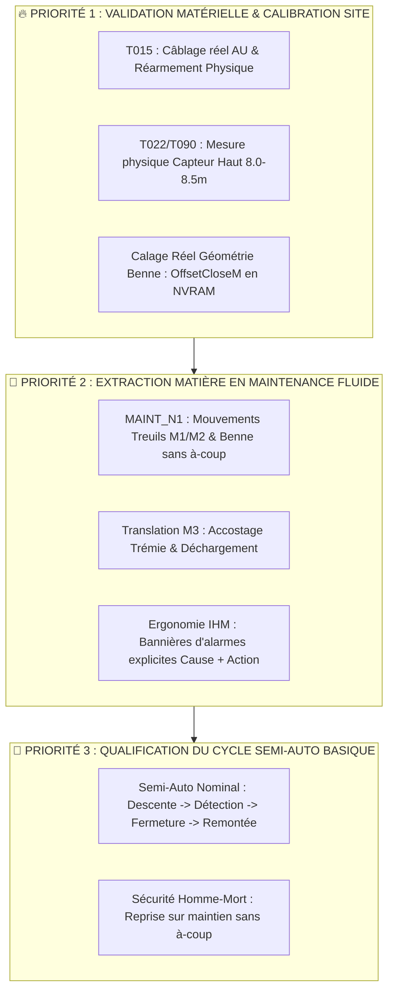

# 📋 Synthèse et Bilan des Tâches Projet (TASKS.yaml & Contrats)

**Date** : 2026-09-05  
**Auteur / Rôle** : Point d'avancement & Coordination Workflow  
**Référentiels** : DOC/WFLOW/TASKS.yaml, DOC/WFLOW/CONTRACTS/, AGENTS.md

---

## 🎯 1. Vue d'Ensemble du Catalogue des Tâches

Le catalogue DOC/WFLOW/TASKS.yaml formalise l'intégralité des chantiers techniques du projet avec leur criticité (C0 à C4), leurs dépendances et leurs critères de validation formelle.

### 📊 Snapshot des Statuts (260 Tâches au Total)

| Catégorie de Statut | Icône / Repère | Volume | Signification & Rôle |
|---|:---:|:---:|---|
| **Tâches Terminées & Validées** | ✅ | **187** | Chantiers clôturés, audités, intégrés dans `CODE/` et validés (inclus `T015`, `T125`, `T146`) |
| **Tâches en Cours / Verrouillées** | ⏳ / 🔒 | **27** | Lots actifs ou requalifiés sous contrat (inclus `T092`, `T157`, `T243`, `T253`) |
| **Tâches en Attente / Reliquats** | ⏸️ / ⬜ | **38** | Points de mise en service (MES), inventaires ou chantiers différés post-SAT |
| **Tâches Clôturées / Remplacées** | ❌ / ⛔ | **7** | Tâches supersédées par des refactors plus récents ou devenues caduques |
| **Sous investigation** | 🔎 | **1** | Point d'analyse isolé |

## 🧭 2. ARGUMENTAIRE & PLAN DE BATAILLE CHANTIER J-2 (SAT & RÉCEPTION)

> 🚨 **Posture d'Ingénierie & Challenge Constructif (Anti-Yes-Man) :**  
> Avec seulement **48 heures avant la réception machine**, il est **strictement hors de question** d'ouvrir des chantiers d'architecture lourds, de modifier les bus de communication ou de chercher à déployer un mode automatique complexe.  
> **L'objectif unique du SAT est : « Sortir de la matière en carrière noyée en toute sécurité, sans blocage opérateur, avec un mode Maintenance robuste et un cycle Semi-Auto basique éprouvé »**.

---

### ⏱️ Les 3 Paliers d'Action pour les Prochaines 48 Heures

#### 🔴 PALIER 1 : Socle Physique & Déverrouillage des Axes (En cours)
* **1. Calage géométrie Benne dans la NVRAM (`T253` sous contrat C4)** :
  * *Pourquoi* : Ajuster `OffsetCloseM` et `CoherenceLimitM` dans la rémanence NVRAM / IHM pour garantir la reconnaissance univoque `IsClosed` / `IsOpen` sans bascule au redémarrage.
* **2. Persistance & Homing à 0m (`T092`)** :
  * *Pourquoi* : Qualifier la rémanence des bypass et le comportement du référencement 0m avec benne raccordée.
* **3. Contrôle Chaîne AU & Réarmement Électrique (`T015`)** :
  * *Statut* : ✅ **Validé sur site** (chaîne physique `EmergencyStopOk_DI` et tempo anti-staccato opérationnelles).
* **4. Homing Machine & Codeurs Absolus (`T146`)** :
  * *Statut* : ✅ **Validé** (séquenceur `HX0..HX6` validé, bridage Palier 1 hors homing en place).

#### 🟡 PALIER 2 : Fonctionnalité Métier « Sortir la Matière » en Maintenance (Après-midi)
* **1. Maintien et pilotage Treuils M1 / M2 / Benne (`MAINT_N1`)** :
  * *Statut* : ✅ **Validé par traces réelles 29, 30, 31 (MES-046..048)** :
    - Descente/Remontée pleine vitesse ($1.90\text{ m/s}$ sur M1, $1.61\text{ m/s}$ sur M2 sans fausse coupure de survitesse).
    - Synchronisation dynamique remarquable ($< 6\text{ cm}$ d'écart en pleine montée).
    - Ouverture/Fermeture benne opérationnelle en position haute.
    - Ralentissement FdC haut à $0.5\text{ m}$ effectif.
* **2. Translation M3 & Vidage Trémie (`DumpAtTremie` / `T249`)** :
  * Valider la translation du chariot M3 entre la zone de dragage (P1) et la trémie, avec décélération propre et verrouillage vertical treuils.
* **3. Lisibilité du Bandeau d'Alarmes IHM (`FB_Hmi_BannerFormatter`)** :
  * Aucune alarme muette ou bloquante sans explication : l'opérateur doit lire instantanément la cause (ex. *"M3 pas à P1 : descente refusée"*).

#### 🟢 PALIER 3 : Qualification du Cycle Semi-Auto Basique (J-2)
* **1. Séquence nominale simple (`FB_CycleSemiAuto`)** :
  * Descente couplée M1/M2 ➔ Détection fond (Kobold / Mou de câble) ➔ Fermeture benne M2 ➔ Remontée nominale ➔ Arrêt haut.
  * *Note d'architecture* : Abandon des sous-GRAFCETs éclatés `DiveSearch`/`ExtractionSequence` (**`T125` clôturé en legacy**), logique centralisée dans `FB_CycleSemiAuto`.
* **2. Ergonomie Homme-Mort & Permis Joystick (`T157`)** :
  * Asymétrie treuils/translation déjà mergée.
  * Câblage dynamique de `ArmingPermit` pour sécuriser les réarmements manche au neutre.

---

## 🔍 3. État des Lieux par Domaine Métier

### A. Sécurité Machine & Arrêt d'Urgence (AF01, AF03, AF14)
- **Chaîne AU & Bypass MES** : 3 modes de bypass orthogonaux validés, temporisations normatives 500 ms / 5 s.
- **Tâches associées** :
  - `T015` (C2) : ✅ **Validé** (câblage physique `EmergencyStopOk_DI` et réarmement opérationnels).
  - `T092` (C4) : ⏳ **En cours** (qualification terrain de la persistance RETAIN et reprise après coupure avec benne).

### B. Instrumentation & Codeurs Absolus (AF09)
- **Homing Machine & Repères** : Séquenceur `HX0..HX6` opérationnel, cible dynamique M2 calculée sur config propre.
- **Tâches associées** :
  - `T146` (C4) : ✅ **Validé** (arbitrage vitesse hors homing bridé Palier 1, synchronisation Homed unifiée).
  - `T253` (C4) : ⏳ **En cours sous contrat C4** (Calibration géométrie benne et rémanence NVRAM).

### C. Modes de Marche & Séquenceur Automatique (AF04, AF05)
- **Séquenceur Semi-Auto** : Centralisation dans `PRG_03_Modes_Cycle`, structure unifiée prête pour les essais.
- **Tâches associées** :
  - `T125` (C4) : ✅ **Clôturé [LEGACY / OBSOLÈTE]** (sous-blocs séparés abandonnés au profit de `FB_CycleSemiAuto`).
  - `T157` (C4) : ⏳ **En cours** (asymétrie Q2 résolue/mergée, reste câblage fin de `ArmingPermit`).

### D. Treuils, Benne & Translation (AF10, AF11)
- **Treuils M1/M2 & Benne** : Validés sur traces terrain réelles (`MES-046`, `MES-047`, `MES-048`).
- **Translation M3** : Diagnostic complet et gestion des fins de course opérationnels.

---

## 📑 4. Santé des Contrats et Outillage CI/CD

- **Couverture des Contrats** : 43 contrats formels actifs (`TASK_CONTRACT_*.yaml`) sous `DOC/WFLOW/CONTRACTS/` (dont `TASK_CONTRACT_T253_CALIB_BENNE_PERSISTANTE.yaml`).
- **Auto-Vérification** : Liaison `G200_check_linkage.py` systématiquement validée (**0 erreur de câblage**).
- **Bundle CODESYS** : `CODE_XML/CODE_Bundle.xml` synchronisé à 100% avec les sources ST.

