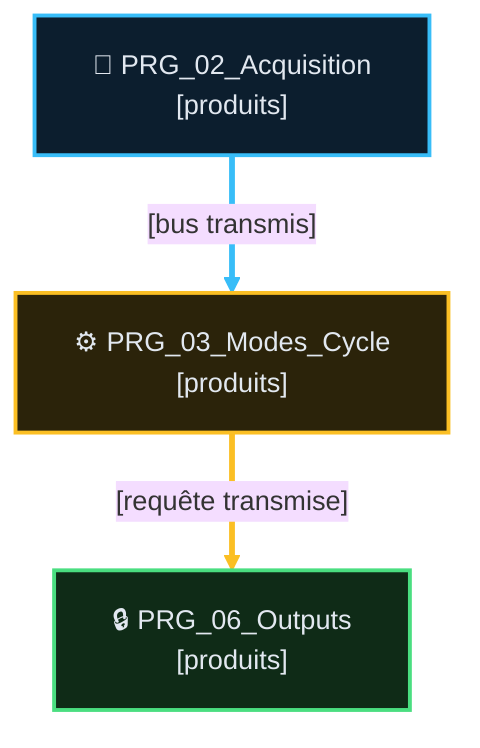

# Analyse Fonctionnelle — Partie 02 : Architecture Programme (vX.Y)

> 📐 **Squelette AF-02** — contrat d'intégration et d'ordonnancement des PRG ST.
> Règles : `DOC/STDS/GUIDES/GUIDE_EDITION_AF_v1.0.md` §5. Ne pas dupliquer les exigences métier
> des AF04 à AF14 ni les interfaces détaillées d'AF03.

## 📑 Sommaire

1. Rôle et périmètre
2. Points de validation
3. Principes d'architecture
4. Organisation et pipeline
5. Contrats de flux
6. Exécution
7. Maintenance
8. Suivi historique
9. TBD
10. Documents liés

---

## 🎯 Rôle et périmètre

- **Rôle** : [ordonnancement, frontières de flux et responsabilités exclusives des PRG].
- **Périmètre** : [POU actifs et bus inter-PRG]. Ne définit pas : [AF03 / règles métier].
- **Type de composant** : Architecture d'intégration — pas de FB unique.

### 🎯 Table des fonctions

| ID | Fonction | Description | Réalisée par | Criticité | TC couvrants | Statut |
|---|---|---|---|---|---|---|
| `F02.01` | [verbe d'action] | [fonction d'architecture testable] | `PRG_XX` / `MainTask` | `C0`-`C4` | <nobr><code>TC-P02-001</code></nobr> | ✅/⚠️/❌ |

## 🧪 Points de validation

| ID | Intention | Preuve | Type | Réf |
|---|---|---|---|---|
| <nobr><code>TC-P02-001</code></nobr> | [intention] | [preuve] | `💻 AUTO` | <small>§N</small> |

## 🧱 Principes d'architecture

[Producteur unique, encapsulation, safety visible, frontière IHM et sortie finale.]

## 🔄 Organisation et pipeline

### 🔌 Contrats d'intégration des programmes

| PRG | Lit (producteurs) | Produit | Responsabilité exclusive | Ordonnancement / AF propriétaire |
|---|---|---|---|---|
| `PRG_XX` | [bus et producteur] | [bus produit] | [une responsabilité] | [rang, latence, AF] |

### 🕸️ Topologie détaillée des liaisons (si nécessaire)

Conserver le pipeline vertical ci-dessus comme lecture rapide. Si les liaisons IHM, simulation,
persistance, retours d'état ou retards d'un scan ne tiennent pas sans élargir ce pipeline, ajouter
un second Mermaid détaillé, coloré et étiqueté. Il reprend tous les liens utiles à la revue de
raccordement ; il ne remplace jamais la table des contrats.

### ⏱️ Ordre fonctionnel intra-PRG

L'ordre est **chronologique et se lit de haut en bas** : chaque phase ne consomme que les garanties
des phases précédentes. Ne citer ni instances ni appels privés ; documenter une phase par objectif
fonctionnel. Si deux phases sont indépendantes, le dire explicitement afin de ne pas transformer un
rang de lecture en dépendance artificielle.

#### `PRG_XX`

| Phase chronologique | But | 🕒 Fraîcheur lue | Pourquoi à cette position ? | Garantie avant phase suivante |
|---|---|---|---|---|
| 1. [phase] | [objectif fonctionnel] | [🟢 scan courant / 🟡 N-1, cause] | [dépendance qui impose cette position] | [donnée/état garanti] |

### 🔩 Repères d'implémentation concrets

Pour chaque phase qui raccorde une GVL, une mémoire persistante, une image E/S ou un bus inter-PRG,
ajouter une ligne : **lire concrètement → faire → écrire/garantir**. Nommer le propriétaire
(`GVL_IHM`, `GVL_Simulation`, `GVL_PERSISTENT`, `HwReal/HwSim/HwIn`, contrat public), mais ne pas
figer les noms d'instances FB locales. Toute donnée `N-1` indique explicitement sa durée et sa cause.

## 🚍 Contrats de flux

[Frontières par rôle ; AF03 porte types, unités, polarités et interfaces détaillées.]

## ⏱️ Exécution

[Ordre MainTask, ordonnancement intra/inter-PRG et retards d'un scan explicitement acceptés.]

## 🔧 Règles de maintenance

[Invariants d'intégration et règles de migration.]

## 📜 Suivi historique

- **vX.Y (AAAA-MM-JJ)** : [changement factuel].

## ❓ TBD

- [Question non tranchée.]

## 📚 Documents liés

- AF03 : contrats FB/DUT.
- AF04 à AF14 : exigences métier propriétaires.
