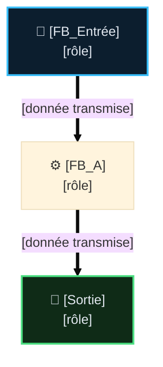

# Analyse Fonctionnelle — Partie NN : [Nom du Domaine / Fonction] (vX.Y)

> 📌 **Squelette de fiche AF** — famille "Fonctions métier" (AF-08+, une AF = un domaine/FB).
> Règles complètes : `DOC/STDS/GUIDES/GUIDE_EDITION_AF_v1.0.md`. Pour les familles Fondations
> (01-03) / Transverses (04-07) : partir d'ici et retirer les sections marquées
> `[FONCTIONS MÉTIER SEULEMENT]` — voir `GUIDE_EDITION_AF_v1.0.md §5`. Supprimer ce bloc de note
> avant de committer la fiche réelle.

> Rôle : [1 ligne — ce que produit la fonction, en termes physiques/opérateur].
> **Pas** un FB de [ce que ce composant N'EST PAS, ex. mouvement/safety] : [ce qu'il ne fait pas].
> Source code : `CODE/.../FB_XXX.st` · instance `PRG_NN_XXX.instXXX`.

## 🧭 Sommaire

1. Rôle et périmètre
2. Table des points de validation (TC)
3. Pipeline et composition
4. Interface publique
5. [Paragraphes de détail — un par comportement notable]
6. Intégration programme
7. IHM, Configuration & Dépannage
8. Suivi historique
9. TBD
10. Documents liés

## 🎯 1. Rôle et périmètre

- **Rôle** : [Expliquer le besoin physique/opérateur résolu par la fonction]
- **Périmètre strict** : [Ce que la fonction fait / Ce qu'elle ne fait absolument pas]
- **Type de composant** : [Producteur d'intention / Brique E/S / Commande Mouvement / Safety]
- **Contrat AF03** : `[standard | light]` ([justification courte — remonte des défauts ou non,
  via `Status : ST_FbStatus` le cas échéant])

⛔ Pas d'historique ici (versions, resynchronisations, décisions passées) — voir §Suivi
historique. État actuel uniquement, 3-4 lignes max.

### 🎯 Table des fonctions

<!-- [FONCTIONS MÉTIER SEULEMENT] — obligatoire pour cette famille -->

| ID | Fonction | Description | Réalisée par | Criticité | TC couvrants | Statut |
|---|---|---|---|---|---|---|
| `FNN.01` | [Nom court, verbe d'action] | [1-3 phrases, toutes les conditions pertinentes] | `FB_XXX` | `C0`-`C4` | <nobr><code>TC-PNN-001</code></nobr> | ❌ |

## 🧪 2. Table des points de validation (Cas de Test — TC)

| <nobr>ID Unique</nobr> | Groupe | Comportement Attendu | <nobr>Type</nobr> | <nobr>Réf</nobr> |
|---|---|---|---|---|
| <nobr><code>TC-PNN-001</code></nobr> | **[Nom Groupe]** | [Comportement physique et logique, 1-2 phrases] | <nobr><code>💻 AUTO</code></nobr> | <small>§N</small> |

## 🔄 3. Pipeline et composition

> Format : Mermaid `flowchart TD` (vertical, flèches étiquetées par le flux de données) —
> voir `DOC/STDS/GUIDES/GUIDE_EDITION_AF_v1.0.md §3bis` pour le style complet (couleurs par
> domaine, plein=donnée/pointillé=commande). Table de flux vertical en alternative si 2-3 blocs
> linéaires suffisent (même §3bis).

## 🔌 4. Interface publique

### Entrées (`VAR_INPUT`)

| Nom | Type | Rôle |
|---|---|---|
| `XXX` | `BOOL` | [rôle] |

### Sorties (`VAR_OUTPUT`)

| Nom | Type | Rôle |
|---|---|---|
| `XXX` | `BOOL` | [rôle] |

## 5. [Comportement notable — renommer, ex. Homme-mort (FNN.03, FNN.04)]

[Corps libre — un paragraphe par comportement notable. Si la fiche a une Table des fonctions
§2bis, le titre référence le(s) code(s) `FNN.<seq>` couverts, entre parenthèses — un paragraphe
sans fonction associée (historique, TBD) n'en porte pas.]

## 6. Intégration programme

[Où et comment l'instance est appelée, dans quel PRG/tâche.]

## 🖥️ 7. IHM, Configuration & Dépannage

`ST_XXXHMI` = `Cmd` ([champs]) + `State` ([champs]). Pas de sous-struct `Cfg` dans `ST_XXXHMI`
[si applicable] — réglages existants, pas tous au même niveau de maturité :

| Réglage | Persistant ? | Réglable depuis un écran IHM ? |
|---|---|---|
| `XXX` | ✅/❌ `GVL_PERSISTENT` | ✅/❌ |

`Bypass` : [existe / n'existe pas — si oui, où il vit réellement (souvent un autre domaine,
ex. diagnostic bus) et ce qu'il peut masquer].

Dépannage (`GVL_Troubleshooting.XXX : ST_XXXChecklist`) : renvoi vers la vue chronologique dédiée
(AF14) — ne pas dupliquer son contenu ici, un pointeur suffit.

🚫 **La simulation reste hors de cette section** : elle vit dans `Pipeline et composition` (§3,
production du geste/mesure) ou dans AF13 — l'AF décrit le fonctionnement machine réel, la
simulation est un outil de mise en service, pas une exigence métier.

## 📜 8. Suivi historique

- **vX.Y (AAAA-MM-JJ)** : [changement factuel et daté].

## ❓ 9. TBD (À définir - To Be Define)

<!-- Facultatif si aucun point ouvert. Listing court : quoi trancher, pas pourquoi. -->
- [Question non tranchée, courte.]

## 📚 10. Documents liés

| Doc | Lien |
|---|---|
| — | — |
