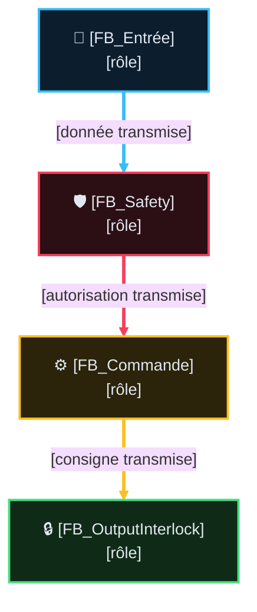

# Analyse Fonctionnelle — Partie NN : [Nom du Domaine / Fonction] (vX.Y)

> 📌 **Squelette de fiche AF** — famille "Fonctions métier" (AF-08+, une AF = un domaine/FB).
> Règles complètes : `DOC/STDS/GUIDES/GUIDE_EDITION_AF_v1.0.md`. Pour **AF-02 Architecture**,
> utiliser `DOC/WFLOW/TEMPLATE/AF_ARCHITECTURE_PROGRAMME_TEMPLATE.md` ; AF-03 et les familles
> Transverses (04-07) adaptent ce squelette en retirant les sections marquées
> `[FONCTIONS MÉTIER SEULEMENT]` — voir `GUIDE_EDITION_AF_v1.0.md §5`. Supprimer ce bloc de note
> avant de committer la fiche réelle.

> Rôle : [1 ligne — ce que produit la fonction, en termes physiques/opérateur].
> **Pas** un FB de [ce que ce composant N'EST PAS, ex. mouvement/safety] : [ce qu'il ne fait pas].
> Source code : `CODE/.../FB_XXX.st` · instance `PRG_NN_XXX.instXXX`.

## 🧭 Sommaire

1. Rôle et périmètre
2. Table des points de validation (TC)
3. Pipeline et composition
4. Interface publique
5. [Paragraphes de détail — un par comportement notable]
6. Intégration programme
7. IHM, Configuration & Dépannage
8. Suivi historique
9. TBD
10. Documents liés

## 🎯 1. Rôle et périmètre

- **Rôle** : [Expliquer le besoin physique/opérateur résolu par la fonction]
- **Périmètre strict** : [Ce que la fonction fait / Ce qu'elle ne fait absolument pas]
- **Type de composant** : [Producteur d'intention / Brique E/S / Commande Mouvement / Safety]
- **Contrat AF03** : `[standard | light]` ([justification courte — remonte des défauts ou non,
  via `Status : ST_FbStatus` le cas échéant])

⛔ Pas d'historique ici (versions, resynchronisations, décisions passées) — voir §Suivi
historique. État actuel uniquement, 3-4 lignes max.

### 🎯 Table des fonctions

> **État** — `V` validé, implémentation non vérifiée · `V-I` validé et implémenté · `NV` non validé,
> non implémenté · `NV-I` code présent mais non validé · `R` refusé · `NA` non applicable.

<!-- [FONCTIONS MÉTIER SEULEMENT] — obligatoire pour cette famille -->

<table style="width: 100%; table-layout: fixed; border-collapse: collapse; font-size: 14px;">
  <colgroup>
    <col style="width: 40px;">
    <col style="width: 140px;">
    <col style="width: calc(100% - 520px);">
    <col style="width: 110px;">
    <col style="width: 50px;">
    <col style="width: 90px;">
    <col style="width: 50px;">
    <col style="width: 40px;">
  </colgroup>
  <thead>
    <tr style="border-bottom: 2px solid #475569; text-align: left;">
      <th style="padding: 4px 1px; text-align: center;"><small><b>ID</b></small></th>
      <th style="padding: 4px 1px; text-align: center;"><small>Fonction</small></th>
      <th style="padding: 4px 8px;">Description</th>
      <th style="padding: 4px 1px; text-align: center;"><small>Réalisée par</small></th>
      <th style="padding: 4px 1px; text-align: center;"><small>Criticité</small></th>
      <th style="padding: 4px 1px; text-align: center;"><small>TC couvrants</small></th>
      <th style="padding: 4px 1px; text-align: center;"><small>Statut</small></th>
      <th style="padding: 4px 1px; text-align: center;"><small>État</small></th>
    </tr>
  </thead>
  <tbody>
    <tr style="border-bottom: 1px solid rgba(255,255,255,0.08);">
      <td style="padding: 4px 1px; text-align: center; vertical-align: middle;">FNN.01</td>
      <td style="padding: 4px 1px; text-align: center; vertical-align: middle;"><small><b>[Nom court, verbe d'action]</b></small></td>
      <td style="padding: 6px 8px; line-height: 1.55;">[1-3 phrases, toutes les conditions pertinentes]</td>
      <td style="padding: 4px 1px; text-align: center; vertical-align: middle;"><small><code>FB_XXX</code></small></td>
      <td style="padding: 4px 1px; text-align: center; vertical-align: middle;"><small><code>C0</code>-<code>C4</code></small></td>
      <td style="padding: 4px 1px; text-align: center; vertical-align: middle;">TC-PNN-001</td>
      <td style="padding: 4px 1px; text-align: center; vertical-align: middle;"><small>❌</small></td>
      <td style="padding: 4px 1px; text-align: center; vertical-align: middle;"><small><code>NV</code></small></td>
    </tr>
  </tbody>
</table>

## 🧪 2. Table des points de validation (Cas de Test — TC)

> **Organisation & Standard de Rédaction** :
> - **Séquence & Déroulé** : Décomposition chronologique complète par étapes numérotées (`💤 Étape 0`, `🚀 Étape 1`, `⚡ Étape 2`, `✅ Étape 3`), avec stimuli, temporisations et résultats attendus.
> - **État** : `V-I` Validé & Implémenté · `V` Validé (non vérifié) · `NV` Non validé · `NV-I` Implémenté non validé · `R` Refusé · `NA` Non applicable.

<table style="width: 100%; table-layout: fixed; border-collapse: collapse; font-size: 14px;">
  <colgroup>
    <col style="width: 28px;">
    <col style="width: 50px;">
    <col style="width: calc(100% - 165px);">
    <col style="width: 45px;">
    <col style="width: 26px;">
    <col style="width: 36px;">
  </colgroup>
  <thead>
    <tr style="border-bottom: 2px solid #475569; text-align: left;">
      <th style="padding: 4px 1px; text-align: center;"><small><b>ID</b></small></th>
      <th style="padding: 4px 1px; text-align: center;"><small>Intention</small></th>
      <th style="padding: 4px 8px;">Séquence & Déroulé des étapes (Comportement attendu)</th>
      <th style="padding: 4px 1px; text-align: center;"><small>Type</small></th>
      <th style="padding: 4px 1px; text-align: center;"><small>Réf</small></th>
      <th style="padding: 4px 1px; text-align: center;"><small>État</small></th>
    </tr>
  </thead>
  <tbody>
    <tr style="border-bottom: 1px solid rgba(255,255,255,0.08);">
      <td style="padding: 4px 1px; text-align: center; vertical-align: middle;">TC-PNN-SCEN-NOM</td>
      <td style="padding: 4px 1px; text-align: center; vertical-align: middle;"><small><b>Nominal</b> [Fonction]</small></td>
      <td style="padding: 6px 8px; line-height: 1.55;">
        💤 <b>Étape 0</b> : Repos initial (conditions nominales saines) 
        🚀 <b>Étape 1</b> : Demande de commande opérateur ou consigne métier 
        ⚡ <b>Étape 2</b> : Exécution de la commande et surveillance dynamique 
        ✅ <b>Étape 3</b> : Atteinte de l'état final cible et confirmation
      </td>
      <td style="padding: 4px 1px; text-align: center;"><small><code>⚡ AUTO</code></small></td>
      <td style="padding: 4px 1px; text-align: center;"><small>§N</small></td>
      <td style="padding: 4px 1px; text-align: center;"><small><code>V-I</code></small></td>
    </tr>
    <tr style="border-bottom: 1px solid rgba(255,255,255,0.08);">
      <td style="padding: 4px 1px; text-align: center; vertical-align: middle;">TC-PNN-001</td>
      <td style="padding: 4px 1px; text-align: center; vertical-align: middle;"><small>[Intention courte]</small></td>
      <td style="padding: 6px 8px; line-height: 1.55;">
        ⚡ <b>Étape 1</b> : Stimulus initial d'entrée 
        🔍 <b>Étape 2</b> : Traitement et évaluation logique 
        🛑 <b>Étape 3</b> : Résultat / Sanction attendue sur les sorties
      </td>
      <td style="padding: 4px 1px; text-align: center;"><small><code>💻 AUTO</code></small></td>
      <td style="padding: 4px 1px; text-align: center;"><small>§N</small></td>
      <td style="padding: 4px 1px; text-align: center;"><small><code>V-I</code></small></td>
    </tr>
  </tbody>
</table>

## 🔄 3. Pipeline et composition

> Format : Mermaid `flowchart TD` (vertical, flèches étiquetées par le flux de données) —
> voir `DOC/STDS/GUIDES/GUIDE_EDITION_AF_v1.0.md §3bis` pour le style complet (couleurs par
> domaine, plein=donnée/pointillé=commande). Table de flux vertical en alternative si 2-3 blocs
> linéaires suffisent (même §3bis).

## 🔌 4. Interface publique

### Entrées (`VAR_INPUT`)

| Nom | Type | Rôle |
|---|---|---|
| `XXX` | `BOOL` | [rôle] |

### Sorties (`VAR_OUTPUT`)

| Nom | Type | Rôle |
|---|---|---|
| `XXX` | `BOOL` | [rôle] |

## 5. [Comportement notable — renommer, ex. Homme-mort (FNN.03, FNN.04)]

[Corps libre — un paragraphe par comportement notable. Si la fiche a une Table des fonctions
§2bis, le titre référence le(s) code(s) `FNN.<seq>` couverts, entre parenthèses — un paragraphe
sans fonction associée (historique, TBD) n'en porte pas.]

## 6. Intégration programme

[Où et comment l'instance est appelée, dans quel PRG/tâche.]

## 🖥️ 7. IHM, Configuration & Dépannage

`ST_XXXHMI` = `Cmd` ([champs]) + `State` ([champs]). Pas de sous-struct `Cfg` dans `ST_XXXHMI`
[si applicable] — réglages existants, pas tous au même niveau de maturité :

| Réglage | Persistant ? | Réglable depuis un écran IHM ? |
|---|---|---|
| `XXX` | ✅/❌ `GVL_PERSISTENT` | ✅/❌ |

`Bypass` : [existe / n'existe pas — si oui, où il vit réellement (souvent un autre domaine,
ex. diagnostic bus) et ce qu'il peut masquer].

Dépannage (`GVL_Troubleshooting.XXX : ST_XXXChecklist`) : renvoi vers la vue chronologique dédiée
(AF14) — ne pas dupliquer son contenu ici, un pointeur suffit.

🚫 **La simulation reste hors de cette section** : elle vit dans `Pipeline et composition` (§3,
production du geste/mesure) ou dans AF13 — l'AF décrit le fonctionnement machine réel, la
simulation est un outil de mise en service, pas une exigence métier.

## 📜 8. Suivi historique

- **vX.Y (AAAA-MM-JJ)** : [changement factuel et daté].

## ❓ 9. TBD (À définir - To Be Define)

<!-- Facultatif si aucun point ouvert. Listing court : quoi trancher, pas pourquoi. -->
- [Question non tranchée, courte.]

## 📚 10. Documents liés

| Doc | Lien |
|---|---|
| — | — |
