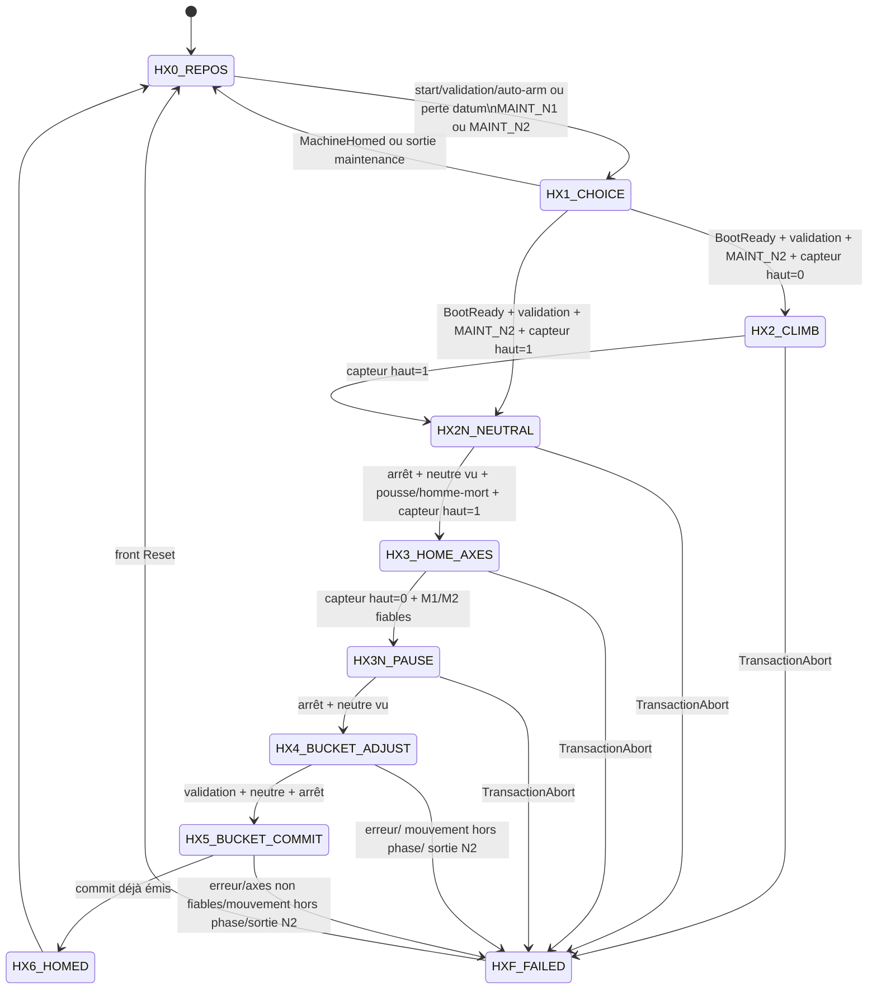

# T336 — État des lieux du cycle homing (Graphe 7)

**Phase :** 1 — constat factuel uniquement  
**Date :** 2026-09-20  
**Périmètre lu :** `CODE/G_CYCLE/`, `CODE/E_CODEURS/`, `DOC/AF/`, `DOC/WFLOW/TASKS.yaml`, `DOC/WFLOW/CONTRACTS/`  
**Périmètre écrit :** cette fiche et le suivi T336. Aucun fichier `CODE/` modifié.

## Verdict factuel

Le GRAFCET réel est `E_MachineHomingTxState` : HX0, HX1, HX2, HX2N, HX3, HX3N, HX4, HX5, HX6 et HXF (`CODE/G_CYCLE/_TYPES/E_MachineHomingTxState.st:12-25`).

Le référencent M1/M2 est explicitement demandé pendant la descente HX3, sur le front descendant de `TopPositionSensor` ; il n'est pas déclenché après un arrêt dans HX3 (`CODE/G_CYCLE/FB_CycleMachineHoming.st:504-515`). La confirmation de calibration est traitée ensuite par `FB_Encoder_Homing` via une transaction preset et son readback (`CODE/E_CODEURS/FB_Encoder_Homing.st:239-280`).

## 1. Tableau exhaustif du Graphe 7

Les sorties impulsionnelles et toutes les commandes de mouvement sont remises à zéro au début de chaque scan ; une commande listée ci-dessous n'est donc émise que dans l'étape qui la réécrit (`CODE/G_CYCLE/FB_CycleMachineHoming.st:168-178`). Les entrées sont la transition qui affecte l'étape, pas une inférence sur la trajectoire précédente.

| Étape | Commandes émises | Entrée | Sortie / transition |
|---|---|---|---|
| `HX0_REPOS` | Aucune action propre à l'étape (`FB_CycleMachineHoming.st:436-440`). | Initialisation `SeqStep := HX0` si `Enable=FALSE` (`FB_CycleMachineHoming.st:384-406`), au front `Reset` (`:302-315`), ou retour depuis HX1/HX6 (`:461-463`, `:567-569`). | → HX1 si le mode est MAINT_N1 ou MAINT_N2 et : `StartEdge.Q`, ou `(ExplicitValidationPulse OR AutoArmTimer.Q) AND NOT BothAxesHomed`, ou perte mémorisée de datum `MachineWasHomed AND NOT MachineHomedRaw AND NOT BothAxesHomed` (`:449-455`). |
| `HX1_CHOICE` | Aucune commande mouvement (`FB_CycleMachineHoming.st:457-460`). | Depuis HX0 sous les conditions ci-dessus (`:449-455`) ; forçage mise en service possible sous `CfgCommissioningEnable`, MAINT_N2 et front `CfgForceStepApply` (`:318-348`). | → HX0 si `MachineHomed` ou sortie de MAINT_N1/N2 (`:461-463`). → HX2 si `BootReady AND ExplicitValidationPulse AND Mode=MAINT_N2 AND NOT TopPositionSensor` (`:464-469`). → HX2N avec la même condition mais `TopPositionSensor=TRUE`; `SeenNeutral := NOT JoystickDeflected` (`:464-472`). Avant ces deux départs : `CommitPublished := FALSE`, `CommitDone := FALSE` (`:464-466`). |
| `HX2_CLIMB` | Si `DeadmanArmed AND JoystickPull`, M1 et M2 : `RunRequest=TRUE`, `ReqAscent=TRUE`, `StepTgt=CST_StepSlow` (`FB_CycleMachineHoming.st:196-200`, `:476-481`). | Depuis HX1 si démarrage validé, boot prêt, MAINT_N2 et capteur haut inactif (`:464-469`). | → HXF si `TransactionAbort` (`:482-484`). → HX2N dès `TopPositionSensor=TRUE`, avec `SeenNeutral := NOT JoystickDeflected` (`:485-488`). `TransactionAbort` couvre erreur homing, mouvement hors phase, timeout montée, timeout HX3, ou perte MAINT_N2 (`:210-220`). |
| `HX2N_NEUTRAL` | Aucune commande mouvement propre ; les sorties sont à zéro de tête de scan (`FB_CycleMachineHoming.st:168-178`, `:490-502`). Si joystick neutre, `SeenNeutral := TRUE` (`:492-494`). | Depuis HX1 si le capteur était déjà actif (`:464-472`), ou depuis HX2 à l'activation du capteur (`:485-488`). | → HXF si `TransactionAbort` (`:495-497`). → HX3 si `WinchesMechanicallyStopped AND SeenNeutral AND DescendPermit AND TopPositionSensor`; alors `HomeReqDone := FALSE` (`:498-502`). `DescendPermit = DeadmanArmed AND JoystickPush` (`:196-200`). |
| `HX3_HOME_AXES` | Si `DescendPermit`, M1 et M2 : `RunRequest=TRUE`, `ReqDescend=TRUE`, `StepTgt=CST_StepSlow` (`FB_CycleMachineHoming.st:504-509`). Sur `TopLostEdge.Q AND NOT HomeReqDone` : impulsion `M1Demand.HomeReq=TRUE`, `M2Demand.HomeReq=TRUE`, puis `HomeReqDone=TRUE` (`:510-515`). | Depuis HX2N, après arrêt mécanique, neutre vu, pousse + homme-mort, capteur encore actif (`:498-502`). | → HXF si `TransactionAbort` (`:516-518`). → HX3N si `NOT TopPositionSensor AND M1Status.HomedAndReliable AND M2Status.HomedAndReliable`; `SeenNeutral := NOT JoystickDeflected` (`:519-522`). Le timeout HX3 vaut `HomeAxesTimer.Q AND NOT BothAxesHomed` (`:214-215`, `:424-425`). |
| `HX3N_PAUSE` | Aucune commande treuil/benne propre ; sorties à zéro de tête de scan (`FB_CycleMachineHoming.st:168-178`, `:524-534`). Si joystick neutre, `SeenNeutral := TRUE` (`:526-528`). | Depuis HX3 après capteur inactif et M1/M2 `HomedAndReliable` (`:519-522`). | → HXF si `TransactionAbort` (`:529-531`). → HX4 si `WinchesMechanicallyStopped AND SeenNeutral` (`:532-534`). |
| `HX4_BUCKET_ADJUST` | Si `BucketPermit AND JoystickPull` : `CmdBucketClose=TRUE`; sinon si `BucketPermit AND JoystickPush` : `CmdBucketOpen=TRUE` (`FB_CycleMachineHoming.st:536-542`). `BucketPermit = DeadmanArmed AND JoystickDeflected` (`:196-200`). | Depuis HX3N après arrêt mécanique confirmé et neutre vu (`:532-534`). | → HXF si `AxisHomingError OR MotionOutOfPhase OR ModeLostDuringCycle` (`:543-546`). → HX5 si `ExplicitValidationPulse AND NOT JoystickDeflected AND WinchesMechanicallyStopped`; pose `PendingClose := TRUE`, `CommitDone := FALSE` (`:547-551`). |
| `HX5_BUCKET_COMMIT` | Au premier scan non `CommitDone` : `BucketCommit.CommitClose := PendingClose`, `CommitPublished := TRUE`, `CommitDone := TRUE` (`FB_CycleMachineHoming.st:553-562`). | Depuis HX4 après validation explicite, joystick neutre et arrêt mécanique (`:547-551`). | → HXF si `AxisHomingError OR NOT BothAxesHomed OR MotionOutOfPhase OR ModeLostDuringCycle` (`:553-557`). Sinon, après le scan de commit (`CommitDone=TRUE`) : `PendingClose := FALSE` puis → HX6 (`:558-565`). |
| `HX6_HOMED` | Aucune commande ; `MachineHomed` est calculé hors CASE : `BothAxesHomed AND (CommitPublished OR BucketOffsetValid) AND NOT MachineHomingFailed AND NOT ReHomingAckRequired AND NOT Fault.Latched` (`FB_CycleMachineHoming.st:567-569`, `:592-596`). | Depuis HX5 après publication du commit (`:558-565`). | → HX0 au scan de HX6 (`:567-569`). `Lifecycle.Done` est vrai quand `CommitPublished` et HX0 (`:580-590`). |
| `HXF_FAILED` | Aucune commande propre ; sorties à zéro de tête de scan (`FB_CycleMachineHoming.st:168-178`, `:571-573`). | Depuis HX2, HX2N, HX3, HX3N, HX4 ou HX5 selon les branches explicitement citées ci-dessus. | Aucun CASE ne sort de HXF ; la sortie est le front `Reset`, qui remet `SeqStep := HX0` et purge les latches de cycle (`FB_CycleMachineHoming.st:300-315`, `:571-573`). |

### Branches transverses qui peuvent modifier le chemin

| Événement | Effet sourcé |
|---|---|
| `Enable=FALSE` | Retour HX0, sorties sûres, `MachineHomed=FALSE`, demandes/commandes à zéro (`FB_CycleMachineHoming.st:382-407`). |
| Front `Reset` | Retour HX0 et purge de `PendingClose`, commit, demande Home, neutre, échec et latches de perte (`FB_CycleMachineHoming.st:300-315`). |
| Forçage mise en service | Sous front `CfgForceStepApply`, `CfgCommissioningEnable` et MAINT_N2, cible 0…9 mappée sur HX0…HXF et purge de certains latches (`FB_CycleMachineHoming.st:318-348`). |
| Perte de datum M1/M2 pendant mouvement | Si un datum avait été vu, qu'il devient faux et que les treuils ne sont pas arrêtés : `HomingLossLatched := TRUE`; une fois arrêté, `ReHomingAckRequired` reste requis jusqu'au Reset (`FB_CycleMachineHoming.st:266-297`). |
| Timeout montée HX2 | `ClimbTimedOut = (SeqStep=HX2) AND ClimbTimer.Q`; il entre dans `TransactionAbort` (`FB_CycleMachineHoming.st:210-220`, `:422-425`). |
| Timeout homing HX3 | `HomeAxesTimedOut = (SeqStep=HX3) AND HomeAxesTimer.Q AND NOT BothAxesHomed`; il entre dans `TransactionAbort` (`FB_CycleMachineHoming.st:210-220`, `:424-425`). |
| Mouvement hors phase / sortie MAINT_N2 / erreur homing | Ces conditions constituent `TransactionAbort` pendant `CycleRunning` (`FB_CycleMachineHoming.st:210-220`), avec branches vers HXF citées pour chaque étape. |

## 2. Diagramme d'état

Le diagramme reprend les 10 états de l'énumération (`CODE/G_CYCLE/_TYPES/E_MachineHomingTxState.st:12-25`) et les affectations `SeqStep` de `FB_CycleMachineHoming.st:449-575`.

## 3. Recensement historique : homing, état benne et cible M2

| Tâche / date documentée | Décision ou état alors documenté | Évolution factuelle relevée |
|---|---|---|
| T185, contrat C4 | Parcours MAINT_N2 : choix explicite Ouverte/Fermée; la cible dynamique M2 devait suivre l'état confirmé et le commit était atomique après les deux homings (`DOC/WFLOW/CONTRACTS/TASK_CONTRACT_T185_HOMING_BENNE_CONJOINT_N2.yaml:5-43`). | Le Graphe 7 courant force `UseDynamicTarget=FALSE` pour M1 et M2 et ne publie que `CommitClose` (`CODE/G_CYCLE/FB_CycleMachineHoming.st:412-420`, `:547-565`). |
| T198, 2026-08-31 | `BtnHome` vise la cote capteur haut; `BtnHomingAtZero` vise 0 m; la transaction dynamique M2 devait rester prioritaire (`DOC/WFLOW/CONTRACTS/TASK_CONTRACT_T198_ENCODER_HOMING_BUTTONS.yaml:5-17, 45-55`). | Le déclenchement dynamique reste défini dans `FB_Encoder_Homing` comme front `UseDynamicTarget` ou `UseDynamicTarget AND HomeEdge` (`CODE/E_CODEURS/FB_Encoder_Homing.st:206-223`), mais le Graphe 7 ne l'active pas (`CODE/G_CYCLE/FB_CycleMachineHoming.st:412-420`). |
| T199, 2026-08-31 | ConfirmOpen devait référencer M2 à M1 courant; ConfirmClose à M1 + `OffsetCloseM`; MAINT_N2 + arrêt mécanique requis (`DOC/WFLOW/CONTRACTS/TASK_CONTRACT_T199_BUCKET_HARDWARE_REFERENCE_ROUTE.yaml:5-20`). | Ce contrat séparait explicitement ces confirmations du cycle global (`:19-20`); le code de Graphe 7 analysé ici utilise `PendingClose` seulement (`CODE/G_CYCLE/FB_CycleMachineHoming.st:547-565`). |
| T208, 2026-09-01 | Ne pas reconstruire `IsOpen/IsClosed` depuis le delta; détecter la contradiction et geler la commande plutôt que forcer `ActiveOffsetM` (`DOC/WFLOW/TASKS.yaml:1549-1568`; `DOC/WFLOW/CONTRACTS/TASK_CONTRACT_T208.yaml:10-26`). | Cette règle traite la cohérence état/position; elle ne définit pas le choix benne du Graphe 7. |
| T213, 2026-09-01 | Diagnostic demandé pour le bug « M2 reste à 8.5 m » : exposer cible dynamique, offset, demande M2 et état cycle (`DOC/WFLOW/TASKS.yaml:1653-1668`; `DOC/WFLOW/CONTRACTS/TASK_CONTRACT_T213.yaml:5-10`). | Dans le code actuel, M2 est demandé sur la perte du capteur en HX3 (`CODE/G_CYCLE/FB_CycleMachineHoming.st:510-515`) et cible dynamique est forcée inactive (`:412-420`). |
| T226, 2026-09-02 | Frontière voulue : SEMI_AUTO homed-only; homing déplacé en maintenance; la description évoquait front montant capteur haut + stop dur (`DOC/WFLOW/TASKS.yaml:1926-1944`). | L'implémentation de Graphe 7 actuelle demande le Home sur front **descendant** pendant HX3 (`CODE/G_CYCLE/FB_CycleMachineHoming.st:504-515`). |
| T233, 2026-09-03 | Implémentation déclarée du GRAFCET HX0…HX6/HXF, référencement conjoint « au vol » sur `F_TRIG(TopPositionActive)`, mise benne fermée + commit atomique (`DOC/WFLOW/TASKS.yaml:2092-2119`). | Ces éléments correspondent au code : `TopLostEdge : F_TRIG` (`CODE/G_CYCLE/FB_CycleMachineHoming.st:89-103, 180-183`) et `CommitClose` (`:553-565`). |
| T235, 2026-09-03 | La vérification preset après délai était considérée transactionnelle; suppression du délai sans refonte risquait une validation erronée (`DOC/WFLOW/TASKS.yaml:2145-2163`). | `FB_Encoder_Homing` porte aujourd'hui `CST_PresetVerifyTime := T#50MS`, puis décide `Calib.Homed` sur confirmation (`CODE/E_CODEURS/FB_Encoder_Homing.st:107-111, 239-280`). |
| T253, 2026-09-05 | Calage terrain : Delta M2-M1 de la benne fermée, `OffsetOpenM`, `OffsetCloseM`, cohérence et persistance; le constat disait que 0 m était identifié comme ouvert malgré le cas attendu fermé (`DOC/WFLOW/TASKS.yaml:2695-2714`). | Le Graphe 7 ne calcule pas de delta; son commit est `CommitClose` (`CODE/G_CYCLE/FB_CycleMachineHoming.st:553-565`). |
| T260, contrat C3 en attente | Étude d'une pré-validation benne avant HX2 : réglage ouvert/fermé au palier 1 sans FDC logiciel, puis geste explicite « benne fermée »; HX2…HXF et HX4/HX5 devaient être conservés (`DOC/WFLOW/CONTRACTS/TASK_CONTRACT_T260_HOMING_PREVALIDATION_BENNE.yaml:14-21, 25-65, 92-102`). | Le Graphe 7 courant place l'ajustement benne après HX3, dans HX4, et `CommitClose` dans HX5 (`CODE/G_CYCLE/FB_CycleMachineHoming.st:524-565`). |
| T311, contrat C2 en attente | Demandait une reproduction réelle ou SimBench et la cause exacte du bug homing avant toute correction (`DOC/WFLOW/CONTRACTS/TASK_CONTRACT_T311_CYCLE_HOMING_BUG.yaml:6-23`). | T336 relève le code mais n'apporte pas cette trace ou reproduction. |
| T322, contrat C2 en attente | Campagne terrain de mesure : course ouverture/fermeture, état de benne noté avec les essais, et partage de charge M1/M2 avec benne fermée (`DOC/WFLOW/CONTRACTS/TASK_CONTRACT_T322_MISE_EN_SERVICE_RECALAGE.yaml:14-45, 78-91`). | Aucun résultat de mesure de cette campagne n'est affirmé dans le présent état des lieux. |
| T327, 2026-09-20 | Le contrat distingue le jog libre du cycle `instBucket.Busy` et rappelle les seuils d'état franc `IsClosed` / `IsOpen`; une piste de gate de configuration ayant cassé le référencement benne a été retirée (`DOC/WFLOW/CONTRACTS/TASK_CONTRACT_T327_MANUAL_BUCKET_LIMITS_PHASE_JOG.yaml:10-33, 156-181, 208-214`). | Cet historique concerne les bornes de jog/phase benne; il ne change pas les demandes HX3 ni le commit HX5 lus dans le Graphe 7. |
| T323, contrat C3 | Distinguer non-référencé et défaut mécanique; le homing ne doit pas générer une alarme latched parasite (`DOC/WFLOW/CONTRACTS/TASK_CONTRACT_T323_BENNE_NON_REFERENCEE_DIAGNOSTIC.yaml:5-38`). | Les transitions HX3 attendent explicitement les deux statuts `HomedAndReliable` avant HX3N (`CODE/G_CYCLE/FB_CycleMachineHoming.st:519-522`). |
| T330, 2026-09-20 | Cadrage de l'invariant entre `CfgTopSensorPos_M` et `CfgCableLimitAscent_M`; deux règles distinctes actées (`DOC/WFLOW/CONTRACTS/TASK_CONTRACT_T330_HOMING_TOP_SOFT_LIMIT_INVARIANT.yaml:5-36, 40-55`). | HX3 utilise le capteur haut et les temporisations de `Cfg`; cette tâche ne modifie pas le choix `CommitClose` dans le Graphe 7 lu. |

## 4. Cartographie factuelle du référencement « au vol »

| Point | Fait relevé | Conditions / garde ou blocage explicite |
|---|---|---|
| Détection de passage capteur dans le cycle | `TopLostEdge` est un `F_TRIG` sur `TopPositionSensor` (`CODE/G_CYCLE/FB_CycleMachineHoming.st:89-103, 180-183`). | Il est évalué chaque scan; la demande ne part que si `TopLostEdge.Q AND NOT HomeReqDone` (`:510-515`). |
| Commande au vol du Graphe 7 | En HX3, alors que la descente M1/M2 est commandée sous `DescendPermit`, le front descendant émet `M1Demand.HomeReq` et `M2Demand.HomeReq` dans le même scan (`CODE/G_CYCLE/FB_CycleMachineHoming.st:504-515`). | Entrée HX3 : arrêt mécanique, neutre vu, capteur haut actif, pousse et homme-mort (`:498-502`). La sortie n'arrive qu'après capteur inactif et M1/M2 `HomedAndReliable` (`:519-522`). |
| Interdiction de répétition au même passage | `HomeReqDone` est mis à vrai au scan de la demande (`CODE/G_CYCLE/FB_CycleMachineHoming.st:511-515`). | Il est remis à faux avant l'entrée HX3 (`:498-501`) et lors de Reset/forçage (`:302-315`, `:341-347`). |
| Timeout / échec pendant la phase en mouvement | `HomeAxesTimedOut` s'arme seulement en HX3 si le timer expire et que `BothAxesHomed` est faux; il alimente `TransactionAbort` (`CODE/G_CYCLE/FB_CycleMachineHoming.st:210-220, 424-425`). | HX3 va HXF si `TransactionAbort` (`:516-518`). |
| Déclencheurs internes de `FB_Encoder_Homing` | Homing nominal : `HomingPermit AND NOT UseDynamicTarget AND ((Home AND TopSensorEdge.Q) OR (HomeEdge.Q AND TopPositionSensor))`; unitaire : front `Home`; dynamique : front `UseDynamicTarget` ou `UseDynamicTarget AND HomeEdge` (`CODE/E_CODEURS/FB_Encoder_Homing.st:193-214`). | Si front `Home` sans `HomingPermit`, `HomingModeError := TRUE` (`:200-204`); si cible hors `[-99;+99]`, `TargetOutOfRangeError := TRUE` et aucune requête preset n'est émise (`:216-236`). |
| Écriture et qualification post-demande | À un `HomingTrigger` valide, la demande preset est émise et `PresetVerificationActive := TRUE` (`CODE/E_CODEURS/FB_Encoder_Homing.st:216-236`). Après `CST_PresetVerifyTime`, la lecture est comparée à la cible; `Calib.Homed := TRUE` n'est affecté que dans `PresetConfirmed` (`:239-280`). | Les trois modes de confirmation sont listés à `:252-261`; l'échec pose `HomingSuspect`, `PresetConfirmationFailed` et `PresetFailError` (`:263-280`). |
| Écart documentation / code à ne pas confondre avec une preuve de fonctionnement | AF-09 décrit un nominal « front Home ET front capteur haut » et écrit « capture au front, pas après arrêt confirmé » (`DOC/AF/AF_Partie-09_Fonction_Encoder_v2.4.md:388-399`). | AF-09 documente également une cible dynamique M2 et le choix ouverte/fermée (`:359`, `:429-467`), tandis que Graphe 7 force les cibles dynamiques à FALSE et son commit courant est `CommitClose` (`CODE/G_CYCLE/FB_CycleMachineHoming.st:412-420, 553-565`). |

## 5. Points ouverts pour la Phase 2 (sans proposition)

1. Quelle définition métier l'utilisateur valide-t-il pour le choix « benne fermée / ouverte » dans le cycle courant, puisque le code publie `CommitClose` (`CODE/G_CYCLE/FB_CycleMachineHoming.st:553-565`) alors qu'AF-09 maintient RES-004 comme choix ouvert (`DOC/AF/AF_Partie-09_Fonction_Encoder_v2.4.md:461-467, 633-639`) ?
2. Quelle source est décisionnelle entre l'AF-09 qui décrit une cible M2 dynamique (`DOC/AF/AF_Partie-09_Fonction_Encoder_v2.4.md:359, 429-432`) et le Graphe 7 qui la force inactive (`CODE/G_CYCLE/FB_CycleMachineHoming.st:412-420`) ?
3. Quel scénario mesuré explique le constat « cycle actuellement buggué » du mail GCAM : transition non atteinte, timeout, `HomingError`, transaction preset non confirmée, ou autre événement ? Cette fiche ne contient aucune trace d'exécution PLC.
4. La procédure AF-09 nominale indique arrêt confirmé puis `BtnHome` (`DOC/AF/AF_Partie-09_Fonction_Encoder_v2.4.md:447-456`), alors que HX3 émet `HomeReq` pendant la descente au front descendant (`CODE/G_CYCLE/FB_CycleMachineHoming.st:504-515`) : arbitrage documentaire et métier requis avant Phase 2.

## 6. Contrôle de périmètre

`git status --short` a été contrôlé avant et après. Aucun fichier `CODE/` n'a été écrit par T336 ; les modifications `CODE/` visibles au départ sont hors périmètre du présent lot.
