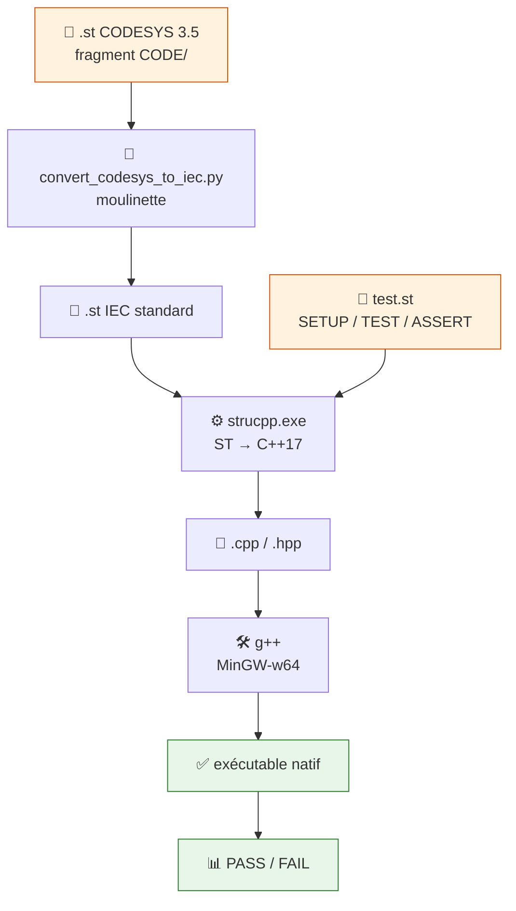

# 🧪 COMPILER_ST2C_STruCpp

Compile du **vrai ST CODESYS 3.5** en C++17 (via [STruCpp](https://github.com/Autonomy-Logic/STruCpp))
pour tester des FB **en boîte noire** (IN/OUT), hors CODESYS, en VS Code ou en CI.

🎯 Le corps du FB **n'est jamais réécrit à la main** — même la composition de sous-FB
(`instXxx(...)`) est câblée automatiquement, garantie fidèle au source. Complémentaire à
`TOOLS/OUTILS_ST2PY` (Python, logique réécrite manuellement).

## 🔄 Flux de travail



## ❓ Pourquoi cet outil

Tester un FB composite (ex. `FB_Encoder`, 6 sous-FB) sans jamais réécrire à la main la logique
interne ni le câblage des sous-FB (risque de faute de câblage humaine — REX `PRG_10_Outputs_LD`).

| Compilateur testé | Verdict |
|---|---|
| `matiec` (`iec2c`, build 2003-2014 via `OpenPLC_v2`) | ❌ Abandonné — trop d'écarts non résolus (enums sans valeurs, `//` non supporté...) et binaire trop vieux pour être représentatif |
| **`STruCpp`** (actif 2026, éditeur d'OpenPLC Editor) | ✅ Retenu — supporte `PUBLIC`, enums avec valeurs, cadre de test intégré |

## 📦 Prérequis

- `bin/win32-x64/strucpp.exe` — **déjà vendoré** ici (v0.6.2, ~58 Mo), rien à télécharger.
- **`g++` (MinGW-w64)** — requis **seulement** pour `--test` (compile le C++ en exécutable) :
  ```powershell
  winget install -e --id BrechtSanders.WinLibs.POSIX.UCRT
  ```
  Rouvrir le terminal ensuite (PATH mis à jour par l'installeur).

<details>
<summary>🔄 Mettre à jour le binaire vendoré</summary>

| Plateforme | Asset |
|---|---|
| Windows x64 | `strucpp-win32-x64.zip` |
| Windows ARM64 | `strucpp-win32-arm64.zip` |
| Linux x64/ARM64 | `strucpp-linux-x64.tar.gz` / `strucpp-linux-arm64.tar.gz` |
| macOS x64/ARM64 | `strucpp-darwin-x64.zip` / `strucpp-darwin-arm64.zip` |
| VS Code | `strucpp-vscode-<version>.vsix` (non testée dans ce projet) |

```bash
curl -sL -o strucpp.zip \
  https://github.com/Autonomy-Logic/STruCpp/releases/latest/download/strucpp-win32-x64.zip
unzip strucpp.zip -d /tmp/strucpp_new
cp -r /tmp/strucpp_new/strucpp/. TOOLS/COMPILER_ST2C_STruCpp/bin/win32-x64/
```
Vérifier : `bin/win32-x64/strucpp.exe -v` · Releases : https://github.com/Autonomy-Logic/STruCpp/releases
</details>

## 🩹 4 écarts CODESYS 3.5 ↔ STruCpp, corrigés automatiquement

Les `.st` de `CODE/` sont des **fragments** pensés pour être collés dans l'éditeur CODESYS (qui
fournit sa propre enveloppe) — pas des unités de compilation autonomes. `convert_codesys_to_iec.py`
comble ça, sans jamais changer la sémantique :

| # | Écart | Correctif | Mesuré sur `CODE/` |
|---|---|---|---|
| 1️⃣ | `TYPE x : ENUM lit := val, ... END_ENUM` | → forme parenthésée standard, **valeurs conservées** | 9 fichiers `E_*.st` |
| 2️⃣ | Pragmas `{region}` / `{endregion}` / `{attribute}` | Supprimés (cosmétiques) | 52 fichiers |
| 3️⃣ | `FUNCTION_BLOCK PUBLIC Nom` | Qualificatif retiré | 40 fichiers |
| 4️⃣ | `END_FUNCTION_BLOCK` absent | Ajouté automatiquement | Systématique |

## 🚀 Utilisation

**1. Convertir** (fichier + ses dépendances de type) :
```bash
python TOOLS/COMPILER_ST2C_STruCpp/convert_codesys_to_iec.py \
  CODE/A_COMMUN/E_State.st CODE/E_CODEURS/FB_Encoder.st --out /tmp/converted
```
Repérer les dépendances : `grep -oE ": (ST_|E_|FB_)[A-Za-z0-9_]+" CODE/E_CODEURS/FB_Encoder.st | sort -u`
Une dépendance manquante lève `Undefined type 'X'` — itérer jusqu'à liste complète.

**2. Compiler en C++** (sans test) :
```bash
TOOLS/COMPILER_ST2C_STruCpp/bin/win32-x64/strucpp.exe <fichiers convertis, DUT/enum d'abord> -o out/FB.cpp
```

**3. Écrire et lancer des tests** (nécessite `g++`) :
```
SETUP
VAR
    fb : FB_JOYSTICK;
END_VAR
END_SETUP

TEST 'nom du scenario'
    fb(ENABLE := TRUE, RESET := FALSE, ...);
    ASSERT_TRUE(fb.ERROR, 'message explicite');
END_TEST
```
```bash
TOOLS/COMPILER_ST2C_STruCpp/bin/win32-x64/strucpp.exe <fichiers convertis> -o out/FB.cpp --test mon_test.st
```

⚠️ **4 pièges vérifiés empiriquement** :
- Titres `TEST` et messages `ASSERT_*` en **guillemets simples** (`'...'`) — pas doubles, malgré la doc officielle.
- Tous les identifiants sont **MAJUSCULES** dans le C++/tests générés (`fb.ERROR`, pas `fb.Error`).
- L'initialisation `:= valeur` d'une `VAR` du bloc `SETUP` (ex. `nx : INT := 5000;`) **n'est
  jamais appliquée** — `TestSetup_N::setup()` généré est vide, la variable démarre à la valeur
  par défaut du type (`0` pour un `INT`). Toujours initialiser explicitement dans le corps du
  `TEST` (`nx := 5000;`) avant le premier `fb(...)`, jamais compter sur le défaut déclaré en `SETUP`.
- Une `VAR_IN_OUT` du FB testé (ex. `NeutralXMem`) **n'est pas re-copiée** vers la variable de
  test après `fb(...)` — chaque appel réécrit l'entrée depuis la variable de test (`s.FB.X = s.NX;`)
  sans jamais faire le retour `s.NX = s.FB.X;`. Toute valeur calculée par le FB sur un scan
  (ex. calibration dynamique d'un neutre) est donc **perdue** au scan suivant si on compte sur le
  round-trip. Contournement : forcer explicitement la variable de test à la valeur attendue dans
  le corps du `TEST` plutôt que de compter sur ce que le FB a écrit au scan précédent.

📄 Exemple réel validé (2/2 PASS) : [`examples/test_fb_joystick.st`](examples/test_fb_joystick.st)
— bus non opérationnel neutralise les sorties **sans** lever d'erreur (gate sécurité, pas un
défaut) ; `Reset` n'acquitte une erreur de calibration que si la cause a disparu (règle
`AGENTS.md` "Reset = front + cause disparue").

## ⚠️ Limites connues

- Pas une preuve FAT/SAT — valide la logique métier, pas le comportement réel sur automate.
- Blocs matériels natifs non simulables : stubés, inévitable.
- `VAR_GLOBAL PERSISTENT RETAIN` (`GVL_PERSISTENT.st`) jamais testé — hors périmètre (FB testés
  ne touchent la persistance qu'au travers de `VAR_IN_OUT`, jamais la GVL directement).
- Binaire vendoré = version figée (v0.6.2), mise à jour manuelle si besoin.

## 📜 Historique

- 2026-08 : PoC `FB_Encoder` (6 sous-FB) + `FB_Joystick` (4 sous-FB) — compilation 100% réussie,
  câblage inter-FB auto-généré vérifié dans le C++ produit. Tests `FB_Joystick` : 2/2 PASS.
