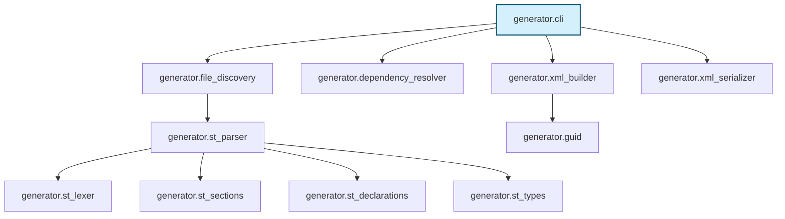

# Guide — Conversion ST → PLCopenXML pour CODESYS 3.5

> ⚠️ **Ce dossier est hors périmètre du projet d'automatisme** (pas de la doc fonctionnelle,
> pas du code machine). C'est un **outil de travail** pour permettre un import sélectif d'un
> FB/PROGRAM/STRUCT/ENUM/GVL dans CODESYS sans réimporter tout le projet.
>
> **Statut : schéma quasi entièrement confirmé sur échantillons réels** (`samples_reference_codesys/`,
> exportés depuis **CODESYS V3.5 SP19 Patch 1**, projet `Programme MGS_v0.3.10_Simulation`) :
> `FB_Winch.xml` / `FB_Grappin.xml` / `FB_Cycle.xml` (FUNCTION_BLOCK), `PRG_MAIN.xml` (PROGRAM),
> `E_Diag_State.xml` / `E_CycleStep.xml` (ENUM), `ST_WinchHMI.xml` / `ST_SpeedStepTable.xml` (STRUCT),
> `GVL_IHM.xml` / `GVL_PERSISTENT.xml` / `GVL_DEBUG.xml` (GVL, retain / retain+persistent / non-retain).
> **Import testé en conditions réelles** (§7) : le POC `test_import_poc/` a été importé (et
> réimporté) dans le vrai projet CODESYS. Confirmé : sélection d'objets individuelle à l'import
> (cases à cocher, pas de tout-ou-rien) ; le dossier cible du `ProjectStructure` se crée
> **relativement au nœud sélectionné dans l'arbre projet** au moment de l'import (pas un chemin
> absolu) ; **le ré-import d'un objet déjà présent ne propose PAS la boîte Replace/Rename/Skip
> documentée officiellement — CODESYS duplique silencieusement en `_1`/`_2`...** (voir §7).
> Reste `🟡 TBD` : dépendance de type manquante entre plusieurs objets.

---

## 0. Pourquoi ce document existe

But : pouvoir écrire un FB/PROGRAM/STRUCT/ENUM/GVL en ST brut (comme dans `CODE/`), le
convertir en un fichier `.xml` au format **PLCopenXML**, et l'importer **sélectivement** dans
CODESYS via `Project → Import PLCopenXML` — sans passer par tout le projet, et sans reproduire
l'ancien pipeline `tools/inject.py`/`st2xml.py` (abandonné — celui-là patchait le format interne
propriétaire `Device.export` par GUID, pas du vrai PLCopenXML).

Trois choses confirmées par la doc officielle CODESYS (menus `Project → Import…` /
`Project → Export…`, sous-commande PLCopenXML) :
- L'import PLCopenXML matche les objets **par nom**, pas par GUID. La doc officielle décrit une
  boîte de dialogue à 3 choix en cas de conflit de nom (Replace/Rename/Skip) — **⚠️ non
  reproduit lors du test réel de ce projet** : réimporter un objet déjà présent ne l'a **pas**
  proposé, CODESYS a dupliqué silencieusement en `_1` sans rien demander (voir §7, POC
  `test_import_poc/`). À considérer comme le comportement réel par défaut tant que le cas où la
  boîte à 3 choix apparaît réellement n'est pas identifié.
- `Project → Export PLCopenXML` ouvre une boîte de dialogue qui **liste tous les objets de
  l'arbre du device exportables** en PLCopenXML — l'utilisateur coche un sous-ensemble précis.
  La doc officielle ne précise pas si les dépendances (types utilisés) sont cochées
  automatiquement : **à vérifier soi-même à l'export** (probablement non — à cocher à la main).
- **Aucune fidélité à 100 % garantie** (formulation officielle) : PLCopenXML ne couvre qu'un
  sous-ensemble des éléments CODESYS, contrairement au format natif `*.export` qui est
  "fully compatible with the CODESYS project format". Toujours vérifier visuellement après import.

👉 **Bonne pratique recommandée** (pas une exigence documentée par CODESYS, juste du bon sens
projet) : ce dépôt versionne déjà `PRJ_CODESYS/*.project` sous Git — commiter l'état courant
avant un import PLCopenXML permet de revenir en arrière si le résultat ne convient pas.

---

## 0bis. Qu'est-ce que PLCopenXML ? (norme vs extension CODESYS)

### Origine et objectif

**PLCopenXML** est un format d'échange XML défini par le comité technique **PLCopen TC6**,
pour permettre l'échange de programmes IEC 61131-3 (types de données, interfaces de POU, corps
de code FBD/LD/ST/SFC) entre différents environnements de développement industriels (EDI) —
CODESYS, Beremiz, TwinCAT, etc. Objectif affiché : interopérabilité, portabilité d'un
programme (ou d'un fragment) d'un outil à un autre.

### Historique

| Version | Année | Namespace | Remarque |
|---|---|---|---|
| v1.01 | 2005 | — | Première publication du schéma XSD par PLCopen. |
| **v2.0** | 2008 | **`tc6_0200`** | "Official Release". **C'est celle utilisée par CODESYS 3.5 SP19 Patch 1** (confirmé sur les 11 échantillons de `samples_reference_codesys/`). |
| v2.01 | 2009 | `tc6_0201` | Changements mineurs. Version documentée sur le site public PLCopen actuel — **mais pas celle que CODESYS 3.5 SP19 émet réellement** (voir §1). |
| IEC 61131-10 | 2019 | — | En 2014, PLCopen transfère la propriété intellectuelle du schéma à l'IEC ; le travail aboutit à la norme internationale **IEC 61131-10** ("PLCopen XML exchange format"), qui intègre officiellement le format dans la suite IEC 61131. |

### Ce qui est standard vs ce qui est extension propriétaire CODESYS/3S-Software

Le schéma TC6/IEC 61131-10 couvre le "cœur" du langage : types de données, interface de POU
(`VAR_INPUT`/`OUTPUT`/`IN_OUT`/local), corps de code. Il ne prévoit **pas** certaines notions
propres à un EDI donné (listes de variables globales, placement dans une arborescence de
projet, identifiant interne d'objet...). CODESYS comble ces manques via son propre mécanisme
d'extension `<addData><data name="http://www.3s-software.com/plcopenxml/...">`, déjà détaillé
empiriquement section par section dans ce guide :

| | Standard IEC 61131-10 / TC6 (`tc6_0200`) | Extension CODESYS (`3s-software.com`) |
|---|---|---|
| Types de données (STRUCT/ENUM) | ✅ `<types><dataTypes>` | — |
| Interface POU (FB/PROGRAM) | ✅ `<interface>` (`inputVars`/`outputVars`/`inOutVars`/`localVars`) | — |
| Corps de code | ✅ `<body><ST>` (texte brut échappé) | — |
| Listes de variables globales (GVL) | ❌ absent du schéma de base | ✅ `addData[.../globalvars]` (§5) |
| Placement dans l'arbre projet (dossier CODESYS) | ❌ absent du schéma de base | ✅ `addData[.../projectstructure]` (§1) |
| Identifiant interne d'objet | ❌ absent du schéma de base | ✅ `addData[.../objectid]` (GUID, `handleUnknown="discard"`) |
| Attributs enum (`qualified_only`/`strict`) | ❌ absent du schéma de base | ✅ `addData[.../attributes]` (§4) |
| Doc par valeur d'énum (commentaire `//` par valeur) | ❌ absent du schéma de base | ✅ `addData[.../enumvaluedocumentation]` (§4) |

### ⚠️ Conséquence pratique pour ce générateur

Un fichier produit par cet outil sera fidèle **à l'implémentation CODESYS 3.5 SP19 Patch 1**
(namespace `tc6_0200` + extensions `3s-software.com`), pas garanti portable tel quel vers un
autre EDI IEC 61131-3 : la norme garantit l'interopérabilité pour le cœur (types/POU/corps),
pas pour le placement dans l'arbre, les GVL, ni les autres extensions propriétaires
`3s-software.com` ci-dessus. Ce n'est pas un problème pour l'usage visé ici (aller-retour
CODESYS ↔ CODESYS), mais à garder en tête si le fichier généré devait un jour servir ailleurs.

**Sources** : [PLCopen — Technical Committees / XML](https://www.plcopen.org/technical-committees),
[IEC 61131-10:2019](https://webstore.iec.ch/publication/29056).

---

## 1. Structure générale d'un fichier PLCopenXML CODESYS

```xml
<?xml version="1.0" encoding="utf-8"?>
<project xmlns="http://www.plcopen.org/xml/tc6_0200">
  <fileHeader companyName="" productName="CODESYS" productVersion="CODESYS V3.5 SP19 Patch 1"
              creationDateTime="2026-07-04T07:56:09.9828169" />
  <contentHeader name="<Nom du projet>.project" modificationDateTime="...">
    <coordinateInfo>
      <fbd><scaling x="1" y="1" /></fbd>
      <ld><scaling x="1" y="1" /></ld>
      <sfc><scaling x="1" y="1" /></sfc>
    </coordinateInfo>
    <addData>
      <data name="http://www.3s-software.com/plcopenxml/projectinformation" handleUnknown="implementation">
        <ProjectInformation>
          <property name="Project" type="string"><Nom du projet></property>
        </ProjectInformation>
      </data>
    </addData>
  </contentHeader>
  <types>
    <dataTypes>  <!-- ou <dataTypes /> si aucune STRUCT/ENUM -->
      <dataType name="...">...</dataType>
    </dataTypes>
    <pous>       <!-- ou <pous /> si aucun FB/PROGRAM -->
      <pou name="..." pouType="functionBlock|program">...</pou>
    </pous>
  </types>
  <instances>
    <configurations />
  </instances>
  <addData>
    <!-- Uniquement si GVL exportée (voir §5) -->
    <data name="http://www.3s-software.com/plcopenxml/globalvars" handleUnknown="implementation">
      <globalVars name="GVL_X" retain="true">...</globalVars>
    </data>
    <!-- TOUJOURS présent : placement dans l'arborescence CODESYS -->
    <data name="http://www.3s-software.com/plcopenxml/projectstructure" handleUnknown="discard">
      <ProjectStructure>
        <Folder Name="NOM_DOSSIER_CODESYS">
          <Object Name="<Nom objet>" ObjectId="<GUID>" />
        </Folder>
      </ProjectStructure>
    </data>
  </addData>
</project>
```

Points confirmés (pas des suppositions) :
- **Namespace réel utilisé par CODESYS 3.5 SP19** : `http://www.plcopen.org/xml/tc6_0200`
  (pas `tc6_0201` comme documenté sur le site PLCopen public — CODESYS embarque une révision
  antérieure du schéma).
- `<types><dataTypes/>` et `<types><pous/>` sont **auto-fermants quand vides** (les 2 sont
  toujours présents même si l'un des deux ne contient rien).
- `<instances><configurations /></instances>` : boilerplate vide pour un export d'objet(s)
  isolé(s) (pas de config de tâche exportée).
- **Bloc `<addData name=".../projectstructure">` obligatoire** : c'est lui qui indique à
  CODESYS **dans quel dossier de l'arbre projet** ranger l'objet importé (`Folder Name=`
  correspond exactement au nom du sous-dossier `CODE/` d'origine : `WINCH`, `SYSTEM`,
  `SUPERVISION`, etc. — mapping direct et pratique pour un générateur).
- `ObjectId` (GUID) : présent partout mais avec `handleUnknown="discard"` → CODESYS peut
  l'ignorer sans erreur. Un GUID fraîchement généré (`uuid4`) pour un nouvel objet convient
  (confirme ce qu'indique la doc officielle : le matching à l'import se fait par **nom**, pas
  par cet ObjectId).

---

## 2. Function Block / Program (`<pou>`)

Confirmé sur `FB_Winch.xml` (functionBlock, ~30 VAR_INPUT/OUTPUT/VAR) et `PRG_MAIN.xml`
(program) :

```xml
<pou name="FB_MonFB" pouType="functionBlock">
  <interface>
    <inputVars>
      <variable name="Enable">
        <type><BOOL /></type>
      </variable>
      <variable name="MaxStepDescente">
        <type><INT /></type>
        <initialValue><simpleValue value="2" /></initialValue>
        <documentation>
          <xhtml xmlns="http://www.w3.org/1999/xhtml"> 🆕 Plafond palier en descente</xhtml>
        </documentation>
      </variable>
      <variable name="SpeedStepTable">
        <type><derived name="ST_SpeedStepTable" /></type>
      </variable>
    </inputVars>
    <outputVars>
      <variable name="ErrorId"><type><WORD /></type></variable>
    </outputVars>
    <localVars>
      <variable name="SpeedStep"><type><derived name="FB_SpeedStep" /></type></variable>
      <variable name="ResetEdge"><type><derived name="R_TRIG" /></type></variable>
    </localVars>
    <documentation>
      <xhtml xmlns="http://www.w3.org/1999/xhtml"> <!-- gros commentaire d'en-tête du FB, texte brut --> </xhtml>
    </documentation>
  </interface>
  <body>
    <ST>
      <xhtml xmlns="http://www.w3.org/1999/xhtml">
IF NOT Enable OR NOT EmergencyStopOk THEN
    RelayFwd := FALSE;
END_IF;
      </xhtml>
    </ST>
  </body>
  <addData>
    <data name="http://www.3s-software.com/plcopenxml/objectid" handleUnknown="discard">
      <ObjectId>fe1e6af7-da18-4559-8d7e-415a962a53ee</ObjectId>
    </data>
  </addData>
</pou>
```

### Points confirmés / corrigés par rapport aux hypothèses initiales

| Point | Confirmé sur échantillon |
|---|---|
| Corps ST | **Texte brut échappé XML** (`&lt;`, `&gt;`, `&amp;`), directement dans `<xhtml xmlns="http://www.w3.org/1999/xhtml">...</xhtml>` — **PAS de CDATA**, **PAS** de wrapper `<xhtml:p>`. Correction par rapport à la 1ère version de ce guide. |
| Documentation (commentaire d'en-tête du FB) | `<documentation><xhtml xmlns="...">texte brut</xhtml></documentation>` en dernier enfant de `<interface>`, après `localVars`. Même règle d'échappement que le corps. |
| Documentation par variable | Chaque `<variable>` peut avoir son propre `<documentation>` (utilisé pour le commentaire inline `//` de chaque VAR en ST). |
| Valeur par défaut | `<initialValue><simpleValue value="2" /></initialValue>` — confirmé, y compris pour `TIME` : `<simpleValue value="TIME#200ms" />` (texte litéral IEC, pas de conversion). |
| Type dérivé (FB interne, struct, enum) | `<derived name="XXX" />` — confirmé pour instances de FB (`FB_SpeedStep`, `TON`, `R_TRIG`), structures (`ST_SpeedStepTable`), énumérations (`E_Mode`). |
| GUID objet | `<addData><data name=".../objectid" handleUnknown="discard"><ObjectId>...</ObjectId></data></addData>` en dernier enfant du `<pou>`. Peut être un GUID neuf généré côté script. |
| `VAR_IN_OUT` | **Confirmé** sur `FB_Grappin.xml` (`GrappinState : ST_GrappinState`) : `<interface><inOutVars><variable name="GrappinState"><type><derived name="ST_GrappinState"/></type>...</variable></inOutVars></interface>` — même structure que `inputVars`/`outputVars`, positionné après `outputVars` et avant `localVars`. |
| `VAR_TEMP` | 🟡 non vérifié (aucun FB échantillon n'en déclare) — par analogie, `<tempVars>` au même niveau. |

### Mapping ST → PLCopenXML (confirmé)

| Bloc ST | Élément PLCopenXML |
|---|---|
| `FUNCTION_BLOCK <Nom>` | `<pou name="<Nom>" pouType="functionBlock">` |
| `PROGRAM <Nom>` | `<pou name="<Nom>" pouType="program">` |
| `VAR_INPUT ... END_VAR` | `<interface><inputVars>` |
| `VAR_OUTPUT ... END_VAR` | `<interface><outputVars>` |
| `VAR ... END_VAR` (interne) | `<interface><localVars>` |
| Commentaire d'en-tête `(* ... *)` | `<interface><documentation><xhtml>` |
| Commentaire inline `// ...` sur une variable | `<variable><documentation><xhtml>` |
| Corps ST (implémentation) | `<body><ST><xhtml xmlns="http://www.w3.org/1999/xhtml">texte échappé</xhtml></ST></body>` |

### Mapping des types de base IEC 61131-3 (confirmé)

| ST | PLCopenXML |
|---|---|
| `BOOL` | `<BOOL/>` |
| `INT` | `<INT/>` |
| `WORD` | `<WORD/>` |
| `REAL` | `<REAL/>` |
| `TIME` | `<TIME/>` |
| `TON`, `R_TRIG` (FB standard IEC) | `<derived name="TON"/>` |
| `E_Mode`, `FB_SpeedStep`, `ST_SpeedStepTable` (type/FB du projet) | `<derived name="..."/>` |
| `STRING(n)` | **Confirmé** sur `FB_Cycle.xml` (`CycleStateStr`) : `<string length="80" />` — attribut `length`, pas d'élément enfant. |
| `ARRAY[a..b] OF T` | **Confirmé** sur `ST_SpeedStepTable.xml` (`StepThreshold_Pct : ARRAY[1..5] OF REAL`) : `<array><dimension lower="1" upper="5" /><baseType><REAL /></baseType></array>` — une `<dimension>` par dimension (tableau multi-dim = plusieurs `<dimension>` successives, non vérifié mais cohérent avec le schéma TC6). |
| `ARRAY[1..CONST] OF T` (borne symbolique, ex. `GVL_PLC_Tests_Const.MaxSteps`) | ⚠️ **NON VÉRIFIÉ** — ajouté 2026-07-16 (framework PLC_TESTS) : le générateur émet `<dimension lower="1" upper="GVL_PLC_Tests_Const.MaxSteps" />` (texte brut de l'expression, pas résolu en entier). Avant cette version, ces champs étaient **silencieusement omis** du bundle (`unsupported type expression`, `continue` sans les ajouter aux déclarations) — bug corrigé mais le format de sortie pour une borne symbolique reste à confirmer par un import CODESYS réel. |
| `REFERENCE TO <FB/Type>` | **Confirmé** sur échantillon réel généré 2026-07-17 (`FB_TestReference.xml`, `refTest : REFERENCE TO FB_Winch`) : `<derived name="REFERENCE TO FB_Winch" />` — **PAS** un `<pointer>` (ça c'est POINTER TO, cas différent, actuellement non supporté cf. `test_pointer_to_type_is_skipped_with_warning_not_crash`). Le `name` contient littéralement le texte `"REFERENCE TO <NomType>"`, pas de structure `<baseType>` imbriquée. Seul `REFERENCE TO <derived type>` est confirmé (REFERENCE TO d'un type de base type ex. `REFERENCE TO INT` n'a pas été testé). |
| Valeur par défaut | `<initialValue><simpleValue value="..."/></initialValue>` (texte litéral, y compris préfixe `TIME#`) |

---

## 3. Structures (`TYPE ... STRUCT ... END_STRUCT END_TYPE`)

Confirmé sur `ST_WinchHMI.xml` (33 membres) :

```xml
<dataType name="ST_Joystick_AxisCmd">
  <baseType>
    <struct>
      <variable name="StartStop">
        <type><BOOL /></type>
        <documentation><xhtml xmlns="http://www.w3.org/1999/xhtml"> commentaire </xhtml></documentation>
      </variable>
      <variable name="PositionM">
        <type><REAL /></type>
        <initialValue><simpleValue value="12.5" /></initialValue>
      </variable>
    </struct>
  </baseType>
  <addData>
    <data name="http://www.3s-software.com/plcopenxml/objectid" handleUnknown="discard">
      <ObjectId>818e37d8-0c03-4540-a2bb-61a33833a34f</ObjectId>
    </data>
  </addData>
  <documentation>
    <xhtml xmlns="http://www.w3.org/1999/xhtml"> commentaire d'en-tête de la structure </xhtml>
  </documentation>
</dataType>
```

Placé dans `<types><dataTypes>` (pas `<pous>`, qui reste `<pous />` vide dans ce cas).

---

## 4. Énumérations (`TYPE ... ENUM ... END_TYPE`)

Confirmé sur `E_Diag_State.xml` (5 valeurs) et `E_CycleStep.xml` (13 valeurs, avec commentaire
par valeur) :

```xml
<dataType name="E_CycleStep">
  <baseType>
    <enum>
      <values>
        <value name="INIT" value="0" />
        <value name="WORK_POS_SELECT" value="1" />
        <value name="ERROR_HOLD" value="12" />
      </values>
    </enum>
  </baseType>
  <addData>
    <!-- Commentaire // inline par valeur d'énum (optionnel) -->
    <data name="http://www.3s-software.com/plcopenxml/enumvaluedocumentation" handleUnknown="implementation">
      <EnumValueDocumentation>
        <EnumValue>
          <Name>INIT</Name>
          <Documentation>
            <xhtml xmlns="http://www.w3.org/1999/xhtml"> Vérifs cohérence états + sécurités </xhtml>
          </Documentation>
        </EnumValue>
        <!-- une <EnumValue> par valeur documentée -->
      </EnumValueDocumentation>
    </data>
    <!-- Attributs enum "strict" (comportement par défaut de CODESYS pour un TYPE ENUM) -->
    <data name="http://www.3s-software.com/plcopenxml/attributes" handleUnknown="implementation">
      <Attributes>
        <Attribute Name="qualified_only" Value="" />
        <Attribute Name="strict" Value="" />
      </Attributes>
    </data>
    <data name="http://www.3s-software.com/plcopenxml/objectid" handleUnknown="discard">
      <ObjectId>...</ObjectId>
    </data>
  </addData>
</dataType>
```

⚠️ **Correction importante par rapport à la 1ère version de ce guide** : `value` est un
**attribut** (`<value name="X" value="0" />`), pas un élément enfant imbriqué. Pas de
`<baseType>` séparé pour le type entier sous-jacent — non observé (`INT` implicite).

Points additionnels confirmés sur `E_CycleStep.xml` :
- Le commentaire `//` placé après chaque valeur en ST (ex. `INIT := 0, (* ... *)`) devient un
  bloc `<EnumValueDocumentation>` **séparé**, dans `addData` du `dataType` — pas attaché au
  `<value>` lui-même (le schéma TC6 n'a pas prévu de documentation par valeur).
- `qualified_only` + `strict` : attributs CODESYS par défaut pour un `TYPE ... : (...) END_TYPE`
  moderne (accès uniquement via `E_CycleStep.INIT`, pas juste `INIT`) — à reproduire tel quel
  pour tout nouvel enum généré, sauf besoin explicite contraire.

---

## 5. Global Variable Lists (GVL) — extension propre à CODESYS, hors norme PLCopen de base

Confirmé sur `GVL_IHM.xml` (`retain="true"`), `GVL_PERSISTENT.xml` (`retain="true"
persistent="true"`) et `GVL_DEBUG.xml` (**aucun attribut** — GVL simple non-retain).
**Une GVL n'apparaît PAS dans `<types>`** : c'est une extension
CODESYS/3S-Software placée directement dans le **`<addData>` de niveau `<project>`** :

```xml
<addData>
  <data name="http://www.3s-software.com/plcopenxml/globalvars" handleUnknown="implementation">
    <globalVars name="GVL_IHM" retain="true">
      <variable name="WinchM1">
        <type><derived name="ST_WinchHMI" /></type>
        <documentation><xhtml xmlns="http://www.w3.org/1999/xhtml"> commentaire </xhtml></documentation>
      </variable>
      <!-- ... -->
      <addData>
        <data name="http://www.3s-software.com/plcopenxml/objectid" handleUnknown="discard">
          <ObjectId>da68fdec-ff0d-49e0-a78d-9c44c7a18922</ObjectId>
        </data>
      </addData>
      <documentation>
        <xhtml xmlns="http://www.w3.org/1999/xhtml"> commentaire d'en-tête de la GVL </xhtml>
      </documentation>
    </globalVars>
  </data>
  <data name="http://www.3s-software.com/plcopenxml/projectstructure" handleUnknown="discard">
    <ProjectStructure>
      <Folder Name="SUPERVISION">
        <Object Name="GVL_IHM" ObjectId="da68fdec-ff0d-49e0-a78d-9c44c7a18922" />
      </Folder>
    </ProjectStructure>
  </data>
</addData>
```

- `retain="true"` ↔ `VAR_GLOBAL RETAIN` en ST.
- `retain="true" persistent="true"` ↔ `VAR_GLOBAL PERSISTENT RETAIN` (`GVL_PERSISTENT`).
- **Confirmé** sur `GVL_DEBUG.xml` : GVL simple (`VAR_GLOBAL` sans qualificatif) → élément
  `<globalVars name="GVL_DEBUG">` **sans aucun attribut** `retain`/`persistent` (l'attribut est
  absent, pas mis à `"false"`).
- Variable-niveau `<addData name=".../attributes"><Attributes><Attribute Name="order_in_persistent_editor" Value="0" /></Attributes></addData>` :
  observé sur `GVL_PERSISTENT` (ordre d'affichage dans l'éditeur de persistance CODESYS) —
  **cosmétique, sûr à omettre** dans un fichier généré (pas de `handleUnknown="discard"`
  explicite mais purement lié à l'UI de l'éditeur, pas à la donnée elle-même).

---

## 6. Contraintes et limites connues

- **`VAR_GLOBAL` et `VAR_GLOBAL CONSTANT` ne peuvent pas cohabiter dans la même liste PLCopenXML**
  (doc officielle CODESYS) — à scinder en deux `globalVars` si une GVL mélange les deux.
- **Pas d'export de bibliothèque** via PLCopenXML.
- **Pas de garantie de fidélité à 100 %** (formulation officielle CODESYS) — toujours
  comparer visuellement le résultat après import avant de faire confiance à un lot généré.
- Import = matching **par nom**, pas besoin de faire correspondre un `ObjectId` existant. En
  revanche, réimporter un nom déjà présent **ne l'écrase pas en place** : CODESYS a dupliqué
  silencieusement en `_1` lors du test réel (voir §7) — la boîte Replace/Rename/Skip décrite
  officiellement n'est pas apparue. Pour mettre à jour un objet existant, supprimer l'ancien
  avant de réimporter plutôt que de compter sur un remplacement automatique.
- Le placement dans l'arbre (`<ProjectStructure><Folder Name="...">`) est piloté par le nom
  de dossier choisi dans le fichier généré — reproduire le nom du sous-dossier `CODE/` d'origine.

### 👉 Bonne pratique : import d'objets interdépendants

Tant que le point §7 (dépendance de type absente du fichier) n'est pas tranché par un test
réel, la pratique la plus sûre pour ce générateur est de **regrouper dans un seul fichier
`.xml`** (un seul `<project>`, plusieurs `<dataType>`/`<pou>` dans `<types>`) tous les objets
qui se référencent entre eux (ex. une STRUCT + le FB qui la consomme en `VAR_IN_OUT`, ou une
ENUM + les FB qui l'utilisent) — plutôt que de faire plusieurs imports séparés dans un ordre
supposé. Un seul import = une seule transaction CODESYS, donc pas de risque d'ordre.

---

## 7. Comportements observés à l'import réel (POC `test_import_poc/`)

Test effectué : import de `POC_ImportTest.xml` (2 objets neufs, GUID neufs, dossier
`_POC_IMPORT_TEST` inexistant) dans le projet réel, puis **export complet du projet** en
`Device.export` (format natif) pour vérifier ligne à ligne où et comment CODESYS a rangé les
objets importés.

### ✅ Confirmé : sélection d'objets à l'import, pas un tout-ou-rien

Comme pour l'export (§0), la boîte de dialogue d'import PLCopenXML permet de **cocher/décocher
individuellement** les objets contenus dans le fichier avant de valider — l'utilisateur n'est
pas obligé d'importer tout ce que contient le `.xml`. Utile pour un générateur qui produirait
un fichier "large" (plusieurs objets liés, cf. bonne pratique §6) : rien n'empêche de
n'en importer qu'une partie ponctuellement.

### ✅ Confirmé : le placement dépend de la sélection dans l'arbre au moment de l'import, pas uniquement du XML

La boîte de dialogue d'import PLCopenXML liste les objets du fichier avec des **cases à
cocher** (sélection individuelle, cf. point précédent). L'emplacement où atterrit le contenu
importé dépend de **l'endroit sélectionné avec la souris dans l'arborescence du projet** au
moment de lancer la commande — CODESYS crée/peuple un sous-dossier (nommé d'après
`<ProjectStructure><Folder Name="...">` du XML) **sous ce nœud sélectionné**, pas à un
emplacement absolu fixe déterminé uniquement par le fichier.

Dans le test POC, l'objet a atterri sous `Application › _IMPORT › _POC_IMPORT_TEST` simplement
parce que le nœud `_IMPORT` du projet était sélectionné dans l'arbre à ce moment-là — ce n'est
pas un dossier tampon auto-généré par CODESYS, ni un comportement caché : c'est le nœud choisi
par l'utilisateur qui sert de parent.

👉 **Conséquence pour le futur générateur** : le nom de dossier dans `ProjectStructure` (`WINCH`,
`GRAPPIN`, etc.) crée bien un sous-dossier de ce nom, mais **relativement au nœud sélectionné
dans l'arbre CODESYS avant de lancer l'import** — pas un chemin absolu depuis la racine de
l'Application. Pour reproduire l'organisation `CODE/` (dossiers à plat sous `Application`),
il faut **sélectionner le nœud `Application`** (ou le device racine de la logique) avant de
lancer `Project → Import PLCopenXML`, pas n'importe quel sous-dossier.

### ⚠️ Confirmé : le ré-import du même fichier ne déclenche PAS la boîte Replace/Rename/Skip

Test effectué : réimporter `POC_ImportTest.xml` tel quel (même noms, mêmes `ObjectId`
inchangés) alors que `ST_POC_ImportTest`/`FB_POC_ImportTest` existaient déjà dans le projet.
**Résultat observé** : import réussi, **sans aucune erreur ni boîte de dialogue de conflit** —
CODESYS a renommé automatiquement le nouvel objet en `ST_POC_ImportTest_1`, en incrémentant le
suffixe tout seul, silencieusement.

👉 Ceci **contredit la description officielle** citée en §0 (boîte à 3 choix Replace / Rename /
Skip) — au moins pour ce flux d'import précis (sélection dans l'arbre + `Project → Import`) :
en pratique, un nom déjà présent est **automatiquement dupliqué en `_1`/`_2`/...** sans qu'on
soit interrogé. **Conséquence importante pour le générateur** : réimporter un objet pour le
"mettre à jour" ne l'écrase donc pas en place — il faut soit supprimer manuellement l'ancien
objet avant de réimporter, soit s'attendre à des doublons `_1`, `_2`... à nettoyer à la main.
La boîte Replace/Rename/Skip documentée officiellement n'a pas été vue lors de ce test — peut-
être réservée à un autre point d'entrée (ex. import depuis un écran de gestion de bibliothèque,
ou un conflit de type différent) : à garder en tête, pas encore expliqué.

### ✅ Confirmé : un `ProjectStructure` avec plusieurs `<Folder>` s'importe correctement

Testé en conditions réelles : le générateur (`TOOLS/ST_PLCOPENXML_GENERATOR/generator/`, voir son propre
README) produit, avec l'option `--bundle`, un seul fichier XML regroupant plusieurs objets
répartis sur plusieurs dossiers d'origine (`<ProjectStructure>` avec un `<Folder Name="...">`
par dossier `CODE/` distinct, chacun listant ses objets). Import réel du bundle complet de
`CODE/` (61 objets, 15 dossiers) dans CODESYS : **chaque objet est arrivé dans le bon dossier**,
CODESYS a bien recréé/peuplé les 15 dossiers séparément à partir d'un seul fichier — pas de
mélange, pas de dossier unique fourre-tout. Ceci répond au point qui restait ouvert plus haut
(fermeture de dépendances embarquée) : un objet + ses dépendances de dossiers différents dans
un même fichier s'importe sans problème, chacun à sa bonne place.

### 🟡 Reste à vérifier

| Point | Pourquoi c'est encore incertain |
|---|---|
| Comportement exact à l'import d'un `dataType` référencé par un FB mais absent **du fichier lui-même** (aucune dépendance embarquée du tout, ni dans le même fichier ni déjà présente dans le projet cible) | Non testé isolément — le générateur inclut désormais les dépendances par défaut (`--bundle`/fermeture transitive), donc ce cas ne se présente plus en usage normal. Resterait pertinent uniquement en usage `--no-deps` explicite. |
| `VAR_GLOBAL CONSTANT` | Non observé dans un échantillon — seule la contrainte documentée officiellement (§6, incompatibilité avec `VAR_GLOBAL` simple dans la même liste) est connue. Faible priorité (peu utilisé dans `CODE/`). |
| `VAR_TEMP` | Non observé — par analogie avec `inOutVars`, `<tempVars>` attendu mais pas vérifié. Faible priorité (rarement utilisé dans le style de code du projet). |

---

## 8. Architecture de l'outillage de génération Python (`TOOLS/`)

Ce dossier contient l'outil en ligne de commande de génération automatique de fichiers PLCopenXML (`st2plcopenxml`) à partir des fichiers sources Structured Text (`CODE/*.st`).

### 📦 Structure des modules et rôles



*   **`generator.cli`** : Point d'entrée de l'application en ligne de commande. Reçoit les paramètres de l'utilisateur, orchestre les différentes étapes de génération et écrit le résultat sur le disque.
*   **`generator.file_discovery`** : Parcourt récursivement le dossier source `CODE/` pour découvrir tous les fichiers `.st` et filtrer les anciennes structures de fichiers (`_Decl.st` et `_Impl.st`).
*   **`generator.st_parser`** : Module central de parsing. Il orchestre les modules bas niveau pour construire la représentation intermédiaire (`IR`) :
    *   `st_lexer` : Effectue l'analyse lexicale.
    *   `st_sections` : Extrait et nettoie les sections de code (déclaration vs corps ST).
    *   `st_declarations` : Analyse le bloc de déclaration des variables (`VAR_INPUT`, `VAR_OUTPUT`, etc.).
    *   `st_types` : Analyse les types définis par l'utilisateur (STRUCT, ENUM).
*   **`generator.dependency_resolver`** : Résout les dépendances transitives des types d'un objet (détection des STRUCT ou ENUM utilisés par un FB) pour les inclure dans le bundle d'importation.
*   **`generator.xml_builder`** : Construit l'arbre XML PLCopenXML compatible CODESYS en y ajoutant les extensions requises (`ProjectStructure`, `Retain/Persistent`, `xhtml`, etc.).
*   **`generator.guid`** : Fournit une génération déterministe de GUID (`uuid5` basé sur le nom qualifié de l'objet) pour assurer que les ré-imports dans CODESYS ciblent bien les mêmes identifiants internes.
*   **`generator.xml_serializer`** : Sérialise proprement l'arbre XML généré en préservant le formatage (indentation, retours chariot, en-tête XML).
*   **`generator.diagnostics`** : Collecte de façon centralisée les alertes et erreurs rencontrées lors de la découverte, du parsing ou de la génération.

### 🔄 Séquences d'appel et flux de données

#### Usage 1 : Mode unitaire (génération par fichier dans `out-dir`)
Génère un fichier `.xml` individuel par objet ST, en reproduisant la structure de dossiers.

```
[cli.py] -- (1. discover_objects) --> [file_discovery.py]
                                           |--> lit CODE/**/*.st
                                           |--> parse chaque fichier via [st_parser.py]
                                           |--> retourne liste de SourceObject (IR)
[cli.py] <-- (2. liste SourceObjects) ---- [file_discovery.py]
[cli.py] -- (3. build_project_xml) --> [xml_builder.py]
                                           |--> génère GUID via [guid.py]
                                           |--> convertit l'IR en structure XML
[cli.py] <-- (4. XML Tree) ------------ [xml_builder.py]
[cli.py] -- (5. write_file) ---------> [xml_serializer.py] --> Écrit sur disque (ex: TOOLS/ST_PLCOPENXML_GENERATOR/samples_reference_codesys/FB_Winch.xml)
```

#### Usage 2 : Mode Bundle (génération groupée via `--bundle`)
Regroupe tous les objets demandés ainsi que leurs dépendances transitives dans un seul fichier XML global.

```
[cli.py] -- (1. discover_objects) --> [file_discovery.py]
[cli.py] <-- (2. liste SourceObjects) ---- [file_discovery.py]
[cli.py] -- (3. resolve_dependencies) -> [dependency_resolver.py] (calcule la fermeture transitive des types)
[cli.py] <-- (4. dépendances résolues) --- [dependency_resolver.py]
[cli.py] -- (5. build_project_xml) --> [xml_builder.py] (inclut objets + dépendances + ProjectStructure multi-dossiers)
[cli.py] <-- (6. XML Tree) ------------ [xml_builder.py]
[cli.py] -- (7. write_file) ---------> [xml_serializer.py] --> Écrit sur disque (ex: CODE/CODE_Bundle.xml)
```

### 🧪 Stratégie de tests avec `pytest`

La suite de tests est configurée dans [pyproject.toml](file:///c:/_MGS/DEV/2026_Projet_YGO_ExcavatriceDragage/TOOLS/ST_PLCOPENXML_GENERATOR/pyproject.toml) et s'articule autour de trois dossiers de tests (`TOOLS/ST_PLCOPENXML_GENERATOR/tests/`) :

1.  **Tests unitaires (`tests/unit/`)** :
    *   Valident individuellement chaque brique : résolveur de dépendance, analyseur de déclarations ST, parser d'enums, parser de GVLs.
    *   Le module `test_file_discovery.py` vérifie le bon comportement de filtrage et de détection des doublons ou fichiers orphelins.
2.  **Tests d'intégration (`tests/integration/`)** :
    *   Valident les flux de bout en bout en simulant l'exécution du CLI (appel de `main` avec divers arguments).
    *   Vérifient la bonne reproduction de l'arborescence physique ou l'incorporation correcte des dépendances dans un fichier unique de bundle.
3.  **Tests Golden (`tests/golden/`)** :
    *   Comparent structurellement le XML généré à partir du code de `CODE/` avec les exports originaux stockés dans `TOOLS/ST_PLCOPENXML_GENERATOR/samples_reference_codesys/`.
    *   *Note de robustesse* : Afin de tolérer l'évolution naturelle du code et des commentaires de mise en service, les tests ignorent les valeurs brutes fluctuantes (`simpleValue`) et valident la simple présence du texte (`xhtml`) sans blocage strict de contenu textuel.

---

## 📚 Sources

- Échantillons réels : `TOOLS/ST_PLCOPENXML_GENERATOR/samples_reference_codesys/*.xml` (CODESYS V3.5 SP19 Patch 1)
- [Command: Export PLCopenXML](https://content.helpme-codesys.com/en/CODESYS%20Development%20System/_cds_cmd_export_plcopenxml.html)
- [Command: Import PLCopenXML](https://content.helpme-codesys.com/en/CODESYS%20Development%20System/_cds_cmd_import_plcopenxml.html)
- [Exporting and Importing Projects (CODESYS)](https://content.helpme-codesys.com/en/CODESYS%20Development%20System/_cds_project_export_import.html)
- [PLCopen — Technical Committees (TC6, XML)](https://www.plcopen.org/technical-committees)
- [IEC 61131-10:2019 — PLCopen XML exchange format](https://webstore.iec.ch/publication/29056)
