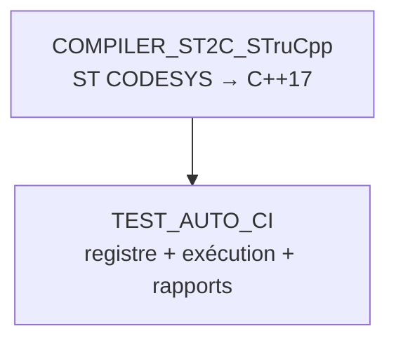

# 🤖 TEST_AUTO_CI

Runner de tests automatisés pour FB CODESYS — 2e outil de la chaîne, **séparé** de
`COMPILER_ST2C_STruCpp` (qui ne fait que la conversion ST → C++). Ici : registre figé +
exécution + rapports.

## 🔄 Les 2 outils, 2 rôles



- **`COMPILER_ST2C_STruCpp`** : moulinette + `strucpp.exe`. Compile un FB. Ne sait pas ce qu'est un "test prévu".
- **`TEST_AUTO_CI`** (ici) : sait **quel** FB tester, **avec quoi**, et **garde le résultat**.

## 📖 `registry.yaml` — source unique de vérité

Chaque entrée = un FB testé en boîte noire, **liste figée par un humain** (jamais devinée par un agent à la volée) :

```yaml
FB_Joystick:
  domain: JOYSTICK                     # -> RESULTS/JOYSTICK/
  af_doc: DOC/AF/AF_Partie-08_...md    # optionnel : active la verification de coherence AF<->tests
  sources: [...]                       # ordre exact de compilation (DUT/enum -> sous-FB -> FB composite)
  test: TOOLS/TEST_AUTO_CI/RESULTS/JOYSTICK/tests/test_fb_joystick.st
  report_group: A_COMMUN               # optionnel : plusieurs FB independants -> UNE seule fiche de rapport
```

## 🔍 Coherence AF ↔ tests (bonus, non bloquant)

Si `af_doc:` est renseigne, chaque run compare le tableau "Points de validation" de l'AF
(colonne Type contenant `AUTO`/`AUTO_PLC`) avec les `TEST 'TC-Pxx-nnn ...'` reellement presents
dans le `.st` — **dans les deux sens** :
- un ID `AUTO` de l'AF absent des tests -> `WARN` (test attendu mais pas ecrit)
- un `TEST` qui reference un ID absent du catalogue AF -> `WARN` (teste quelque chose que l'AF ne documente plus/pas)

Jamais bloquant (n'affecte pas PASS/FAIL) -- juste un `WARN` jaune dans le terminal et une
banniere orange en haut du rapport HTML. Implemente dans `af_coverage.py`.

### Un point AF n'est pas testable ICI (decision 2026-08-22) -- comment le marquer

Un `TC-Pxx-nnn` de type `AUTO` peut exister mais ne pas etre testable **depuis ce FB** -- cas
type : le point verifie la **reaction d'un AUTRE FB consommateur** a une sortie (ex: AF08
`TC-P08-008` "Winch/Translation/Cycle exigent DeadmanArmed" -- ce n'est pas `FB_Joystick` qui
peut prouver ca, c'est `FB_Winch`/`FB_Translation`/`FB_Cycle` chacun dans leur propre suite,
responsabilite unique).

**Reflexe a avoir : corriger la donnee source (le tableau AF), pas ajouter une exception a
cote.** Deux etapes, toujours ensemble :

1. Dans le tableau "Points de validation" de l'AF, changer la colonne **Type** de `💻 AUTO`
   (ou `⚡ AUTO_PLC` / `⚡ SITE+AUTO`) vers `❌ N/A` -- le coverage-check ne detecte QUE les
   cellules matchant `SITE`/`AUTO`/`AUTO_PLC`, donc `N/A` sort naturellement le point de la
   verification, sans rien toucher dans `TOOLS/TEST_AUTO_CI/`.
2. Dans la colonne **Preuve** de la MEME ligne, ecrire `⚠️ hors périmètre <fichier.st>` +
   pourquoi + quel fichier de test le couvre reellement. **Directement dans la ligne**, pas
   seulement dans un encart plus bas dans le document -- un lecteur qui scanne juste le tableau
   ne doit rien manquer.

Optionnellement, un encart `> ⚠️ ...` sous le tableau peut detailler le raisonnement complet
pour qui veut creuser -- mais jamais a la place des 2 etapes ci-dessus, seulement en plus.

**Filet de secours** : `check_af_coverage()` accepte aussi un parametre `ignore` (liste d'ID),
branchable via `af_ignore:` dans `registry.yaml`. A n'utiliser que si changer le Type de l'AF
n'est pas approprie (ex: le point reste `AUTO` au sens large mais on documente une exception
temporaire) -- dans le doute, preferer la methode "Type -> N/A" ci-dessus : une seule source de
verite (le tableau AF), rien a synchroniser entre deux fichiers.

## 🚀 Utilisation

```bash
python TOOLS/TEST_AUTO_CI/run_tests.py --fb FB_Joystick
python TOOLS/TEST_AUTO_CI/run_tests.py --domain AU_SECURITE
python TOOLS/TEST_AUTO_CI/run_tests.py            # --all par defaut, sans option
```

Nécessite `g++` (MinGW-w64) — voir `TOOLS/COMPILER_ST2C_STruCpp/README.md` pour l'installer.
Si `g++` est installé mais absent du `PATH` de la session en cours (cas classique juste après
un `winget install`, avant de redémarrer VS Code), `run_tests.py` le détecte automatiquement
dans l'emplacement d'installation WinGet connu et l'ajoute pour cette exécution seule — pas
besoin de fermer/rouvrir le terminal à chaque fois.

Le résumé final (`=== RESUME ===`) liste le résultat **par test individuel** (pas seulement par
FB), avec le détail de l'assertion en échec — lisible directement dans le terminal/par un
agent, sans avoir besoin d'ouvrir le rapport HTML. Code de sortie : `0` si tout passe, `1` sinon.

## 📁 `RESULTS/<DOMAINE>/`

```
RESULTS/JOYSTICK/
├── tests/
│   ├── test_fb_joystick.st   *.st versionné (comme du code) — QUOI on teste, COMMENT
│   └── run.cmd                raccourci Windows : lance --domain JOYSTICK depuis ce dossier
└── reports/
    ├── <FB>.html / .json / _test.st   # dernier run uniquement, toujours a jour
    │                                    (ou <GROUPE>.html si report_group utilisé)
    └── archive/                        # historique horodate (rapport + .st associe), gitignore
```

`reports/` (racine + `archive/`) est gitignoré — seuls `tests/*.st` (+ `run.cmd`) sont versionnés.
Nouveau FB à tester = ajouter une entrée `registry.yaml` + un fichier `RESULTS/<DOMAINE>/tests/*.st`. Ne jamais toucher `run_tests.py`.

## 🗂️ Fiche de rapport groupée (`report_group`)

Plusieurs FB **indépendants** (compilés et testés séparément, aucun lien entre eux) peuvent
partager UNE seule page HTML — utile pour des FB transverses type `CODE/A_COMMUN/` où un rapport
par FB serait dispersé. Chaque FB garde sa propre entrée `registry.yaml`, son propre `.st`, sa
propre compilation ; seule la page finale (`RESULTS/<DOMAINE>/reports/<GROUPE>.html`) est commune.

## ✅ État actuel (2026-08)

| FB | Domaine | Tests |
|---|---|---|
| `FB_Joystick` | JOYSTICK | 8/8 PASS (`TC-P08-001..006, 011, 012`) |
| `FB_Safety_EmergencyManagement` | AU_SECURITE | 6/8 PASS — `TC-P01-002, 003, 006, 007, 008` OK ; `TC-P01-004/009` et `TC-P01-010` **rouges intentionnellement** |
| `FB_CycleTime`, `FB_Ramp`, `FB_Acquisition_Preflight`, `FB_Brake` | A_COMMUN (rapport groupé) | 15/15 PASS |

Rouges intentionnels (écarts réels code/AF, non corrigés — audit 2026-08-22) :
- `TC-P01-004/009` : `Reset` réarme le maintien de puissance sans re-test physique du canal (`FB_Safety_EmergencyManagementLogic.st`, bloc Reset) — contredit l'AF §3.4bis.
- `TC-P01-010` : `BtnEmergencyCutOff` coupe `MaintainA/B_RQ` mais pas `ArmPulse_RQ` pendant le pulse de réarmement (step 5) — incohérence §7 du même fichier.

⚠️ Point relevé (test vert, mais comportement à confirmer) : `FB_Brake` déclare `DelayMotorDecel`
et un timer `TonDecel` ("délai avant collage frein") **jamais câblés** — `TonDecel.IN` est
toujours forcé à `FALSE`, le frein colle instantanément dès que `MovementRequested` retombe, sans
attendre la décélération moteur. Documenté par le test `TC` dédié ("Comportement actuel...") —
à trancher : paramètre mort à retirer, ou fonctionnalité manquante à câbler ?
