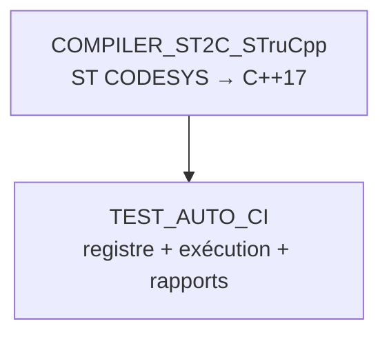

# 🤖 TEST_AUTO_CI

Runner de tests automatisés pour FB CODESYS — 2e outil de la chaîne, **séparé** de
`COMPILER_ST2C_STruCpp` (qui ne fait que la conversion ST → C++). Ici : registre figé +
exécution + rapports.

## 🔄 Les 2 outils, 2 rôles



- **`COMPILER_ST2C_STruCpp`** : moulinette + `strucpp.exe`. Compile un FB. Ne sait pas ce qu'est un "test prévu".
- **`TEST_AUTO_CI`** (ici) : sait **quel** FB tester, **avec quoi**, et **garde le résultat**.

## 📖 `registry.yaml` — source unique de vérité

Chaque entrée = un FB testé en boîte noire, **liste figée par un humain** (jamais devinée par un agent à la volée) :

```yaml
FB_Joystick:
  domain: JOYSTICK                     # -> RESULTS/JOYSTICK/
  sources: [...]                       # ordre exact de compilation (DUT/enum -> sous-FB -> FB composite)
  test: TOOLS/TEST_AUTO_CI/RESULTS/JOYSTICK/tests/test_fb_joystick.st
```

## 🚀 Utilisation

```bash
python TOOLS/TEST_AUTO_CI/run_tests.py --fb FB_Joystick
python TOOLS/TEST_AUTO_CI/run_tests.py --domain AU_SECURITE
python TOOLS/TEST_AUTO_CI/run_tests.py            # --all par defaut, sans option
```

Nécessite `g++` (MinGW-w64) — voir `TOOLS/COMPILER_ST2C_STruCpp/README.md` pour l'installer.
Si `g++` est installé mais absent du `PATH` de la session en cours (cas classique juste après
un `winget install`, avant de redémarrer VS Code), `run_tests.py` le détecte automatiquement
dans l'emplacement d'installation WinGet connu et l'ajoute pour cette exécution seule — pas
besoin de fermer/rouvrir le terminal à chaque fois.

Le résumé final (`=== RESUME ===`) liste le résultat **par test individuel** (pas seulement par
FB), avec le détail de l'assertion en échec — lisible directement dans le terminal/par un
agent, sans avoir besoin d'ouvrir le rapport HTML. Code de sortie : `0` si tout passe, `1` sinon.

## 📁 `RESULTS/<DOMAINE>/`

```
RESULTS/JOYSTICK/
├── tests/    *.st versionné (comme du code) — QUOI on teste, COMMENT
└── reports/
    ├── <FB>.html / .json / _test.st   # dernier run uniquement, toujours a jour
    └── archive/                        # historique horodate (rapport + .st associe), gitignore
```

`reports/` (racine + `archive/`) est gitignoré — seuls `tests/*.st` sont versionnés (comme du code).
Nouveau FB à tester = ajouter une entrée `registry.yaml` + un fichier `RESULTS/<DOMAINE>/tests/*.st`. Ne jamais toucher `run_tests.py`.

## ✅ État actuel (2026-08)

| FB | Domaine | Tests |
|---|---|---|
| `FB_Joystick` | JOYSTICK | 8/8 PASS (`TC-P08-001..006, 011, 012`) |
| `FB_Safety_EmergencyManagement` | AU_SECURITE | 6/8 PASS — `TC-P01-002, 003, 006, 007, 008` OK ; `TC-P01-004/009` et `TC-P01-010` **rouges intentionnellement** |

Rouges intentionnels (écarts réels code/AF, non corrigés — audit 2026-08-22) :
- `TC-P01-004/009` : `Reset` réarme le maintien de puissance sans re-test physique du canal (`FB_Safety_EmergencyManagementLogic.st`, bloc Reset) — contredit l'AF §3.4bis.
- `TC-P01-010` : `BtnEmergencyCutOff` coupe `MaintainA/B_RQ` mais pas `ArmPulse_RQ` pendant le pulse de réarmement (step 5) — incohérence §7 du même fichier.
