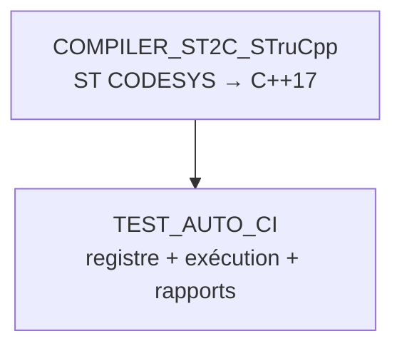

# 🤖 TEST_AUTO_CI

Runner de tests automatisés pour FB CODESYS — 2e outil de la chaîne, **séparé** de
`COMPILER_ST2C_STruCpp` (qui ne fait que la conversion ST → C++). Ici : registre figé +
exécution + rapports.

## 🔄 Les 2 outils, 2 rôles



- **`COMPILER_ST2C_STruCpp`** : moulinette + `strucpp.exe`. Compile un FB. Ne sait pas ce qu'est un "test prévu".
- **`TEST_AUTO_CI`** (ici) : sait **quel** FB tester, **avec quoi**, et **garde le résultat**.

## 📖 `registry.yaml` — source unique de vérité

Chaque entrée = un FB testé en boîte noire, **liste figée par un humain** (jamais devinée par un agent à la volée) :

```yaml
FB_Joystick:
  domain: JOYSTICK                     # -> RESULTS/JOYSTICK/
  sources: [...]                       # ordre exact de compilation (DUT/enum -> sous-FB -> FB composite)
  test: TOOLS/TEST_AUTO_CI/RESULTS/JOYSTICK/tests/test_fb_joystick.st
```

## 🚀 Utilisation

```bash
python TOOLS/TEST_AUTO_CI/run_tests.py --fb FB_Joystick   # un seul FB
python TOOLS/TEST_AUTO_CI/run_tests.py --all              # tous les FB du registre, un seul rapport
```

Nécessite `g++` (MinGW-w64) dans le PATH — voir `TOOLS/COMPILER_ST2C_STruCpp/README.md`.

## 📁 `RESULTS/<DOMAINE>/`

```
RESULTS/JOYSTICK/
├── tests/    *.st versionné (comme du code) — QUOI on teste, COMMENT
└── reports/  *.txt horodaté, régénéré à chaque run, gitignoré
```

Nouveau FB à tester = ajouter une entrée `registry.yaml` + un fichier `RESULTS/<DOMAINE>/tests/*.st`. Ne jamais toucher `run_tests.py`.

## ✅ État actuel (2026-08)

| FB | Domaine | Tests |
|---|---|---|
| `FB_Joystick` | JOYSTICK | 2/2 PASS |
| `FB_Safety_EmergencyManagement` | AU_SECURITE | 2/2 PASS (`TC-P01-004`, `006`, `008`, `009`) |
